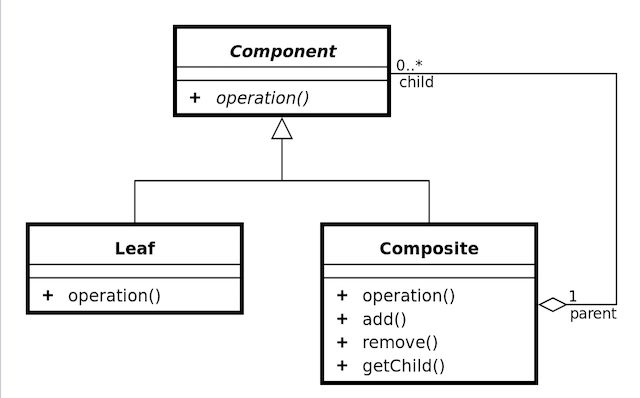

High level overview of what software architecture is.

Remaining:
* [add missing architectural patterns](https://en.wikipedia.org/wiki/List_of_software_architecture_styles_and_patterns)
* [mvvm, mvp](#model-view-presenter(mvp)-pattern)
* [design patterns](#design-patterns)
* [study non-functional requirements](https://en.wikipedia.org/wiki/Non-functional_requirement)

Sources:
* [Mark Richards - Software Architecture Patterns](https://www.oreilly.com/library/view/software-architecture-patterns/9781491971437/)
* [michael-rechardson.com](http://www.michael-richardson.com/processes/rup_for_sqa/core.base_rup/guidances/guidelines/software_architecture_document_F4C93435.html)
* [udacity](https://eu.udacity.com/course/software-architecture-design--ud821)
* [sourcemaking.com](https://sourcemaking.com/design_patterns)
* [techbeacon.com](https://techbeacon.com/app-dev-testing/top-5-software-architecture-patterns-how-make-right-choice)
* [tutorialspoint.com](https://www.tutorialspoint.com/software_architecture_design/)
* [plainoldobjects.com](https://plainoldobjects.com/2015/09/02/does-each-microservice-really-need-its-own-database-2/)
* [towardsdatascients.com](https://towardsdatascience.com/10-common-software-architectural-patterns-in-a-nutshell-a0b47a1e9013)

#### Table of contents
* [Software Architecture](#software-architecture)
    * [Concerns](#concerns)
    * [Architectural Entities](#architectural-entities)
        * [Components](#components)
        * [Connectors](#connectors)
        * [Configurations](#configurations)
    * [Architectural Views](#architectural-views)
    * [Non-Functional Requirements](#non-functional-requirements(nfr))
* [Distributed Systems](#distributed-systems)
    * [Technologies](#technologies)
    * [Characteristics](#characteristics)
    * [Engineering Issues](#engineering-issues)
* [Architecture Patterns](#architecture-patterns)
    * [Data Flow Architecture](#data-flow-architecture)
        * [Batch Sequential Pattern](#batch-sequential-pattern)
        * [Pipe and Filter Pattern](#pipe-and-filter-pattern)
        * [Process Control Pattern](#process-control-pattern)
    * [Data-Centered Architecture](#data-centered-architecture)
        * [Repository Pattern](#repository-pattern)
        * [Blackboard Pattern](#blackboard-pattern)
    * [Hierarchical Architecture](#hierarchical-architecture)
        * [Main-Subroutine Pattern](#main-subroutine-pattern)
        * [Master-Slave Pattern](#master-slave-pattern)
        * [Virtual Machine Architecture](#virtual-machine-architecture)
        * [Layered Architecture](#layered-architecture)        
    * [Interaction-Oriented Architecture](#interaction-oriented-architecture)
        * [Model-View-Controller Pattern](#model-view-controller(mvc)-pattern)
        * [Model-View-Presenter Pattern](#model-view-presenter(mvp)-pattern)
        * [Model-View-ViewModel Pattern](#model-view-viewModel(mvvm)-pattern)
        * [Presentation-Abstraction-Control Pattern](#presentation-abstraction-control(pac)-pattern)
    * [Distributed Architecture](#distributed-architecture)
        * [Client-Server Architecture](#client-server-architecture)
        * [Broker Pattern](#broker-pattern)
        * [Service Oriented Architecture](#service-oriented-architecture)
        * [Peer-To-Peer Architecture](#peer-to-peer-architecture)
        * [Event-Driven Architecture](#event-driven-architecture)
        * [Microservices Architecture](#microservices-architecture)
        * [Monolithic Architecture](#monolithic-architecture)
        * [Space-Based Architecture](#space-based-architecture)
        * [Serverless Architecture](#serverless-architecture(faas))
        * [Microkernel Architecture](#microkernel-architecture)
    * [Structural Architecture](#structural-architecture)
        * [Component Based Architecture](#component-based-architecture)
        * [Object Oriented Design](#object-oriented-design)
* [Software Design](#software-design)
    * [Design Concepts](#design-concepts)
    * [Modeling Behavior](#modeling-behavior)
    * [Design Patterns](#design-patterns)
        * [Creational Patterns](#creational-patterns)
        * [Structural Patterns](#structural-patterns)
        * [Behavioral Patterns](#behavioral-patterns)
        * [Functional Patterns](#functional-patterns)
        * [Concurrency Patterns](#concurrency-patterns)
* [Documentation](#documentation)
    * [Design Documentation](#design-documentation)
    * [Specification](#specification)
    * [UML](#UML)

&nbsp;
# Software Architecture
__Software Architecture__ regards the system as a whole, its components and how those components are interconnected. In other words it is the systematic creation of the blueprint for a system that meets business and functional requirements. Usually starts with a broad overview and works its way down to specifics that are used in developing a solution. 

The two main techniques used for software architecture are:
* __Abstraction__ - finding individual components that build a solution
* __Decomposition__ - dividing individual components into atomic pieces

<u>Architecture produces</u>:
* system specification
* conceptual system architecture
* logical system architecture
* physical system architecture
* documentation

__Architectural Description Languages__ - notation for describing architecture that allows tool support like Diagrammers, Analyzers and Simulators that can help validate the solution. Examples: Acme, Wright, CODE

## Concerns
Software Architecture concerns the entirety of the system which isn't limited to the components and connections that build the system.

Architecture has to define:
* __structure__ - selection of components and their interfaces
* __collaboration__ - how components are connected
* __behavior__ - how components store state and how events affect that state
* __composition__ - how to connect all moving parts to create a working system
* __style__ - what architectural style guides the system
* __usage__ - how the system will be used and how it will be effected by usage
* __functionality__ - does the system have features satisfying all business requirements
* __performance__ - does the system work optimally
* __resilience__ - how does the system recover from unexpected errors and system failures
* __reuse__ - can the code easily be reused in other projects
* __comprehensibility__ - is the code easy to understand for new-comers. Achieved through documentation and good coding practices
* __economics__ - the cost of developing, maintaining, licenses
* __technology constraints__ - limitations of the used technology stack
* __trade-offs__ - why one architecture, design pattern or technology over another
* __aesthetic__ - how the GUI looks and how intuitive is it

## Architectural Entities
Different elements that an application is comprised of.

### Components
A computational or data element and its interface to the rest of the system.

Responsibilities:
* __*encapsulates*__ a subset of functionality/data
* restricts access via an __*interface*__
* defines __*dependencies*__ for its execution context

When choosing components take into consideration:
* required functionality
* existing reusable components
* physical machine architecture
* expertise of staff
* projected evolution trajectories

API(Application Programming Interface):
* __access ports__ - how to access component properties(methods, property names)
* __arguments__ - values the components takes as arguments, their types and order
* __types__ - the type of value the component returns
* __language binding__ - what programming language the api pertains to

### Connectors
Communication protocols among components which affects and regulates their interaction.  

__Elements__:
* __Ducts__ - mechanism for transmitting data and controlling information exchanged by components
* __Protocol__ - set of rules governing how data is interchanged
* __Storage Unit__ - optional for storing state regarding transmitted data
* __Computation Unit__ - optional for processing transmitted data

__Connector services__:
* __Comunication__(t) - transmission of data
* __Coordination__(o) - transfer of control
* __Conversion__(x) - data format conversion
* __Facilitation__(f) - mediation and optimization

__Connector Types__:
* __Procedure Call Connector__ - a procedure is called by a callee and is placed on the execution stack
    * (o) - responsible for control flow
    * (t) - transmits data through parameters
    * __variants__: parameters, entry points, invocations, synchronicity, cardinality, accessbility
* __Event Connector__ - generates a message after detecting an event
    * (o) - responsible for control flow
    * (t) - transmits event related data(time stamp, source, parameters)
    * __variants__: 
        * cardinality - how many componets can produce event
        * delivery - how are they triggered
        * priority - order of processing events
        * synchronicity - is it sequential or asynchronous
        * notification - central updating mechanism, polling, publish/subscribe
        * causality - are they relative to other situations
        * mode - is it a system or user event
* __Data Access Connector__ - provides access to a data repository
    * (t)  - transmits repository data
    * (x) - provides translation of data
    * __variants__: 
        * locality - is the connector global, specific to a thread or process
        * kind of access - read, write, delete
        * availability - is the data persistant or volatile
        * accessibility - is the data private or public
        * life cycle - how long is the data stored
        * cardinality - how many elements request the data, how many elements receive data
* __Linkage Connector__ - structure the system by connecting components(like a api module)
    * (t) - establish ducts between elements
    * (f) - enforce interaction semantics
    * __variants__: 
        * reference - is it explicit or implicit
        * granularity - what units are being linked
        * cardinality - how many components are linked
        * binding - when are the components linked - compile / run-time
* __Stream Connector__ - connects components over a network
    * (t) - data transfer
    * __variants__: 
        * delivery - is the data guaranteed to reach the target
        * bounds - how is its capacity limited
        * buffering - does it store data before transmitting it
        * throughput - units of transition(bytes, Kb, etc)
        * state - does it store data regarding its operations
        * identity - is it named or unnamed
        * locality - is it available locally or remotely
        * synchronicity - is it sequential or asynchronous
        * format - what is the data structure
        * cardinality - how many devices are connected 1 to M, 1 to 1, N to N
* __Arbitrator Connector__ - responsible for conflict resolution, scheduling and load balancing, synchronization and fault trapping(exception handling)
    * (f) - conflict resolution
    * (o) - control flow redirection
    * __variants__:
        * fault handling - how they handle execution, more than arbitrator can involve a voting mechanism
        * concurrency - how shared state is handled
        * transactions - simple, nested, reads/writes
        * security - authentication, authorization, screening, single or multi session
        * scheduling - when which tasks are performed
* __Adaptor Connector__ - facilitate component interoperability
    * (x) - converting protocols and policies
    * __variants__: 
        * invocation conversion - is a data converted to another type
        * packaging conversion - namespace changes
        * protocol conversion - is one protocol translated to another
        * presentation conversion - is the form of the output changed
* __Distributor Connector__ - identify routes between componets
    * (f) - route and path identification
    * __variants__: 
        * naming - how are they structured
        * delivery - how is information regarding routes delivered, multicast / broadcast
        * routing - how is routing accomplished
* __Composite Connectors__ - combination of various connectors

### Configurations
Topology of a component with its connectors. It is a set of specific associations between components and connectors.

## Architectural Views
Their are various ways of representing an applications architecture. This results in different diagrams for modeling different aspects of a system called Architectural Views.

<u>Conceptual View</u>\
Very high level architecture. Focused on components and connections between them without any specifics on how these components work or what these connections represent. Great for communication with stakeholders.

<u>Logical View</u>\
Combination of high and low level architecture. Focuses on:
* how components work
* how components are connected
* what connections between components mean

Logical Architecture should not put contrainsts on how things are implements.

<u>Developmental View</u>\
Concerns the source code and its building blocks.

Can include:
* packages
* classes
* subsystems
* libraries
* files

<u>Process View</u>\
Processes and threads into which execution is divided.

<u>Physical View</u>\
Lowest level architecture. Specific products, data representations and technical notations. Concern real life software services, server models, CRM systems and network capabilities. Serves as a guide to the developers. 

<u>Use-Case View</u>\
Describes a single use-case of the system and how it makes use of different components.

<u>Related Terminology</u>:
* __As-Intended Architecture__ - the intended documented architecture
* __As-Build Architecture__ - the actual built architecture. Usually result of changes made to the As-Intended Architecture during development.
    * __Architectural Drift__ - process of making changes to the as-intended architecture
    * __Architectural Erosion__ - an architectural drift as an effect of maintenance

## Non-Functional Requirements(NFR)
Pertaining to how the system operates as opposed to its specific behavior.

An important part of Architecture is assuring some level of quality. This is described by a set of attributes indicating how readable, defect proof, stable and performant the software is.

__Categories:__
* <u>Design</u>
    * __Conceptual Integrity__ - consistency in component design
    * __Maintainability__ - extent to which enhancements can be readily added to a system
        * __measures__: coupling, cohesion
        * __techniques__: encapsulation, published interfaces, subclassing, indirection, wrapping
        * __paramount__: many versions must be supported
    * __Reusability__ - are components self-contained, can they easily be used in another application
    * __Portability__ - can run in various computing environments
    * __Modifiability__ - components can be changed without breaking other components
* <u>Execution</u>
    * __Interoperability__ - works well in different environments and with external systems
    * __Manageability__ - can be easily and intuitively managed
    * __Reliability__ - likelihood of failure in a given period or continuity of service
        * __measures__: MTTF(Mean Time To Failure)
        * __techniques__: redundancy, fault tolerance, recovery blocks
        * __paramount__: down-time results in huge loss
    * __Scalability__ - can handle usage peaks or easily made to handle them
    * __Security__ - extent to which system protects against unauthorized intrusion
        * __measures__: confidentiality levels, penetration tests, formal proof
        * __techniques__: authentication/authorization, security kernels, encryption, auditing and logging, access control
        * __paramount__: confidential data
    * __Performance__ - timeliness of the service delivered by the system
        * __measures__: response time, throughput, capacity, utilization
        * __techniques__: caching, concurrency, memory management
        * __paramount__: real-time data
    * __Availability__ - has a good up-time
* <u>System</u>
    * __Supportability__ - ease of tracking and resolving issues
    * __Testability__ - can easily be checked against crucial test cases
    * __Safety__ - extent to which system protects against injury or property damage
        * __measures__: interaction complexity, time coupling, faul-tree analysis
        * __techniques__: hardware interlocks, fault containment
        * __paramount__: errors can endanger human life
* <u>Business</u>
    * __Marketability__ - system has a clear conveyable business purpose
    * __Cost__ - the system operates at optimal costs
    * __Usability__ - the system meets user requirements

&nbsp;
# Distributed Systems
Distributed systems are comprised of components that can run on seperate platforms and cooperate with eachother over a communication network.

Architecture of distributed systems is its own field with specific technologies, tools and characteristics.

## Technologies
<u>Middleware</u>\
"Glue" code or applications that facilitate connections between components to address non-functional requirements.

Types of middleware:
* __transactional middleware__ - deals with distributed transactions
    * manages reliability 
    * facilitates ACID requirements
    * aims at location transparency
    * examples: [CICS](https://www.ibm.com/support/knowledgecenter/zosbasics/com.ibm.zos.zmidtrmg/zmiddle_13.htm), [Tuxedo](https://en.wikipedia.org/wiki/Tuxedo_(software)), 
* __message-oriented middleware(MOM)__ - focused on passing messages between components
    * asynchronous message passing
    * queues
    * fault tolerance through queue
    * not transparent - clients need to share state to coordinate messages
* __procedural middleware__ - responsible for handling remote procedure calls
    * executes procedures on an external resource
    * typically synchronous
    * execution and return value can depend on OS on external resource
* __components middleware__ - requests services from remote objects
    * pass messages between remote entities
    * can be both synchronous and asynchronous
    * can handle exceptions as they arise
    * data marshalling

<u>Abstractions</u>\
Technologies that provide abstractions for communication can be divided into:
* __architectures__ - REST, SOA
* __interfaces__ - APIs, AJAX, EJB
* __standards__ - HTTP, HTTPS

<u>Notations</u>\
How interchanged data is represented
* __JSON__ - data is represented through a hierarchical structure composed of key-value pairs where keys are in string format
* __XML__ - data is represented as markup tags that can be nested, have attributes and values

## Characteristics
Most important characteristics to consider during distributed system architecture are:
* Network communication
* Coordination
* Reliability
* Scalability
* Heterogeneity

<u>Network Communications</u>\
How components communicate with eachother over a network.

Common issues:
* __reliable error-handling__ - how are asynchronous and synchronous errors handled? How can we ensure that error messages reach components they could affect?
* __data representation and transport__ - how to create a common language in a heterogenous environment? This could pertain to:
    * __machine differences__ - word length, byte orders, character sets, word boundaries/byte boundaries
    * __data organization__ - is the order of data important
    * __self definition__ - can received pieces of data be appropriately identified
* __transactions__ - how are concurrent operations on the database handled? Transactions need to be consistent with the ACID properties:
    * reliable database access during concurrent operations
    * Atomic - each transaction is treated as a single unit
    * Consistency - contraint invariants are maintained
    * Isolated - one transaction does not have access to another transaction
    * Durable - once a transaction is finalized its persisted

<u>Coordination</u>\
How multiple components working concurrently synchronize their actions to maintain desired application flow.

Common issues:
* __synchronicity__ - do actions need to be performed sequentially or can they work non-sequentially?
* __control__ - which components decides on actions that effect multiple components?
* __robustness__ - how the system deals with components failure?
* __available__ - how and when is the system made available - 24/7? Set maintenance times? How it deals with usage peaks?
* __persistence__ - how a servers state is maintained?
* __concurrency__ - how does the system handle multiple concurrent requests?

<u>Reliability</u>\
How the system deals with component failure.

Common issues:
* __delivery__ - how to handle delivery of a message upon component failure? Should an attempt to redeliver be made after the component failure is resolved? If yes how do you safeguard against duplicates?
* __performance__ - how far are you willing to impede performance for reliability?

<u>Scalability</u>\
How the system deals with increase in users or load.

Common issues:
* __technique__ - will you scale by adding more machines to the resource pool(horizontally) or by adding more power to an existing resource(vertical)? What does this mean for the architecture?

An important aspect of scaling is __tranparency__ - is an aspect of the systems architecture visible externally.

Types of transparency:
* __access transparency__ - if how a resource can be accessed(remotely or locally) affects the application
* __location transparency__ - how the physical location of a resource could affect the application
* __migration transparency__ - how moving a resource from one location to another could affect the application
* __replication tranparency__ - how having multiple instances of a resource could affect the application

<u>Heterogeneity</u>\
How many different hardware and software components are used to build the system.

Common issues:
* __hardware__ - what kind of devices are used by the system?
* __operating systems__ - what operating systems does the system run on?
* __programming languages__ - what programming languages are used to build the system?
* __standard/protocols/APIs__ - what standards, protocols or APIs does the system make use of?
* __access mechanisms__ - what kind of devices or external applications make use of the system?

Other important characteristics:
* __Fault tolerance__ - how the system deals with errors
* __Flexibility__ - how well the system supports change
* __Reusability__ - how easily can the system components be reused in another application
* __Complexity__ - how complex is the system and how that complexity is managed
* __Quality of Service__ - does the system measure and analyse non-functional parameters

## Engineering Issues

__Requirements Engineering__ 
* determining non-functional requirements
* quantification of non-functional requirements
* quality of service

__Software Architecture__
* application structure that meets non-functional requirements
* relationships between connectors and middleware

__Design Issues__
* network latency for distributed systems
* statefulness and persistence
* concurrency - synchronization, deadlock avoidance

__Research Questions__\
When discussing business requirements with a client
* needed resources?
* SQL vs NoSQL?
* fat vs thin clients?
* any embedded systems?
* is mobility of importance?

&nbsp;
# Architecture Patterns
Common methodologies for organizing components within an application. 

<u>Patterns describe</u>:
* what functions each component performs
* how components are connected
* how components are coordinated
* how components exchange data
* semantic constraints
* topological layout indicating runtime behavior of components

<u>Pattern goals</u>:
* a __glossary__ of components, connections and rules
* creating __reusable__ solutions
* describe how a system is __configured__

<u>Pattern Types</u>:
* Data Flow
* Data-Centered
* Hierarchical
* Interaction-Oriented
* Distributed
* Component Based

## Data Flow Architecture
Focuses on how input data is affected by various components and finally returned.

### Batch Sequential Pattern
A batch of data is processed sequentially by various components that are grouped in a queue. The next component in the queue does not recieve the data until the previous component finishes execution.

<u>Advantages</u>:
* components are reusable and selfcontained
* seperation of concerns

<u>Disadvantage</u>:
* high latency and low throughput
* no concurrency
* no asynchronicity

<u>Usage</u>:
* banking systems
* wherever data is batched

### Pipe and Filter Pattern
Data originating at a source travels over a pipe through a series of _Filters_ before it reaches its target, the _Sink_. 

__Filters__ process input data and write the transformed data over a pipe for the next filter to process. The filter starts working as soon as it receives data on the input stream. Filters can work concurrently. 

There are two types of filters:
* __active__ - transform data
* __passive__ - perform read and write operations

__Pipes__ are stateless and carry the data stream from one filter to another.

<u>Advantages</u>:
* concurrent processing
* extensible - low coupling between filters
* reusability of filters - easy to build various pipelines
* flexibility - supports both parallel and sequential execution

<u>Disadvantage</u>:
* easily bottlenecked
* overhead when switching filters - data representation can change
* not suitable for dynamic interactions

<u>Usage</u>:
* compilers
* bioinformatics
* systems that produce and process streams of data

### Process Control Pattern
System built out of interconnected subcomponents or modules. Data flow between subcomponents is controlled by a set of variables called __control variables__. A __processing unit__ is responsible for changing the process variables values, while a __controller unit__ determines which variables should change. 

A controller unit is comprised of:
* __Controlled Variable__ - a value that needs to be controlled by the system. Usually measured by sensors
* __Input Variable__ - data from external subcomponents that is needed to maintain the controlled variable
* __Manipulated Variable__ - values that need to be manipulated in order to maintain the controlled variable
* __Process Definition__ - how variable values are interchanged
* __Sensor__ - mechanism behind obtaining process values that enable recalculating manipulated values
* __Set Point__ - desired value for the controlled variable
* __Control Algorithm__ - how variable values are manipulated

<u>Usage</u>:
* cars
* microwaves
* nuclear power plant
* anywhere application flow is dictated by sensor data

## Data-Centered Architecture
Focuses on central data store to which various components are connected. These components are relatively independent and interact mostly through the data store. 

This approach defines two key components:
* __central data__ - data store to which components are connected. Represents the current state
* __data accessor__ - independent component that can read and write to the central data store.

### Repository Pattern
System focuses around a __passive__ central __data store__. Independent clients(components) are connected to the data store and are active, meaning they are responsible for control flow and querying the data store for changes.

<u>Advantages</u>:
* data integrity
* scalable and reusable components
* components can easily share state 

<u>Disadvantage</u>:
* data duplication
* dead-locks
* data-structure changes have a cascading effect
* data store doesnt scale well

<u>Usage</u>:
* DBMS
* CASE

### Blackboard Pattern
An active central data store called the __blackboard__ with independent specialized clients connected to it. Clients make changes to the data store incrementally leading to the solution of a problem. Changes in the data store trigger an alert which is propagated to all clients.

<u>Blackboard Model Entities</u>:
* __Knowledge Source__ - a client also called a Listener or Subscriber is an independent unit that solves part of a problem and aggregates partial results. 
* __Blackboard Data Structure__ - central data store. Knowledge sources make changes to it incrementally leading to a final result
* __Control Shell__ - controls how and when the knowledge sources access the data structure and perform computations

<u>Advantages</u>:
* scalable
* concurrency and parallel computing
* reusability of knowledge source agents

<u>Disadvantage</u>:
* hard to model the central data store
* hard to test
* changing data structure is difficult do to coupling 
* synchronizing knowledge sources is difficult

<u>Usage</u>:
* AI applications

## Hierarchical Architecture
Seperates a system into a hierarchical structure. Components are grouped into subsystems represented by different levels of the hierarchy and only adjacent subsystems interchange data.

### Main-Subroutine Pattern
A main routine is decomposed into subroutines. Subroutines can also be decomposed into more cohesive subroutines. This continues until a collection of single-responsibility subroutines populate the lowest level in the hierarchy.

<u>Advantages</u>:
* easily decomposed

<u>Disadvantage</u>:
* contains global state
* tight coupling

### Master-Slave Pattern
A central master unit delegates work across identical slave units and computes a final value from data returned by the slaves.

<u>Advantages</u>:
* scalable
* persistence
* no shared state

<u>Disadvantage</u>:
* maintanance overhead
* expensive
* can cause latency
* only applicable if problem can be decomposed

<u>Usage</u>:
* database replication
* computers physical components(master and slave drives)
* anywhere data accuracy and durability is paramount

### Virtual Machine Architecture
A virtual system is built on top of another operating system to provide an isolated environment for operations. A program called the __hypervisor__ is responsible for translating system calls on the virtual system to corresponding system calls on the underlying operating system. The hypervisor controls the virtual systems access to CPU, system memory, persistant storage, I/O devices and the network.

<u>Advantages</u>:
* isolation
* portability

<u>Disadvantage</u>:
* lower performance - operations need to go through an additional layer before they computed

<u>Usage</u>:
* testing environments
* cloud infrastructure
* source code interpreters

### Layered Architecture
Also called __multitier architecture__. Components are grouped into isolated layers. Data flows through the outermost layer and works its way down to the core. Each layer performs its own checks and tasks involving the data respective to the layers purpose. The main advantage of the layered approach is __seperation of concerns__.

Typical application layers:
* User Interface
* Business Logic
* Data Access

<u>Advantages</u>:
* easy to understand
* easier standardization(clearly defined concerns)
* maintainability
* testability
* lower layer can be used by multiple higher layers

<u>Disadvantages</u>:
* strong reliance roles and relationships between modules
* can be __slow__ do to many operations focused on passing around data
* need to understand each layer to understand the architecture 
* can result in complex interdependencies
* monolithic deployment is often unavoidable
* not universally applicable

<u>Usage</u>:
* Desktop Applications
* E-commerce Web Applications
* Web Frameworks
* Applications that need to be built fast
* enterprise/business applications that need to mimic the organizations layered structure

## Interaction-Oriented Architecture
Focuses on seperating the user interface from business logic and data abstraction.

### Model-View-Controller(MVC) Pattern
Divides an app across 3 interconnected layers:
* __model__ - contains the data and core functionality
* __view__ - displays information to a user
* __controller__ - handles input from the user and control flow

MVC is a subset of [Layered Architecture](#layered-architecture)

<u>Advantages</u>:
* extendible
* seperation of concerns

<u>Disadvantage</u>:
* layers are tightly coupled
* not performant - data needs to flow through all the layers

<u>Usage</u>:
* web applications

### Model-View-Presenter(MVP) Pattern
Source: [wikipedia](https://en.wikipedia.org/wiki/Model%E2%80%93view%E2%80%93presenter)

### Model-View-ViewModel(MVVM) Pattern
Source: [wikipedia](https://en.wikipedia.org/wiki/Model%E2%80%93view%E2%80%93viewmodel)

### Presentation-Abstraction-Control(PAC) Pattern
System built out of multiple sets of cooperating components called agents. 

An agent is comprised of:
* __presentation component__ - formats data that is consumed by the user
* __abstraction component__ - retrieves and processes data
* __control component__ - handles control flow and communication between the presentation and abstraction components

<u>Advantages</u>:
* multi-tasking and multi-viewing
* loose coupling
* agents are reusable and extensible
* new agents can easily be plugged in
* scales well - agents can be placed on seperate servers
* concurrency and parallal computation

<u>Disadvantage</u>:
* complex to develop
* overhead do to communication across agents

<u>Usage</u>:
* rich GUI components
* distributed systems

## Distributed Architecture
Focuses on how components, that run on seperate platforms, cooperate with eachother over a communication network. 

### Client-Server Architecture
A network architecture in which clients communicate with a central server in order to consume resources and make use of services. A client sends __requests__ to the server, the server performs tasks in order to meet these requests and finally sends back an appropriate __response__. 

__Thin-client model__ - most operations are handled server-side

__Fat-client model__ - most operations are handled client-side

<u>Advantages</u>:
* easy to manage
* easy to configure
* simple design
* scalable
* cost effective
* extendible

<u>Disadvantages</u>:
* relies heavily on a centralized resource(server)
* security risks
* low reliability

<u>Usage</u>:
* Web Applications 
* Banking Applications
* Mailing Applications

### Broker Pattern
A broker middleware is responsible for handling communication between several decoupled components. Clients make requests to the broker and the broker redirects the requests to an appropriate service provider(example: server, microservices). Brokers store available service providers in a registry and provide an API that can handle user requests and various data types received from service providers.

<u>Advantages</u>:
* transparent distribution
* seperation of concerns
* simplifies dynamic operations

<u>Disadvantage</u>:
* standardized service descriptions

<u>Usage</u>:
* message brokers

### Service Oriented Architecture
An application is composed of a collection of services. Services can exchange data and work together to perform a complex task. Each service is a self-contained, self-defined, modular application. Services do not depend on the state of other services.

<u>Advantages</u>:
* loosly coupled / stateless - services are indepenedent of other services state
* composable - services can easily be added or removed
* interoperable - services work disrespective of the underlying protocols
* reusable - services can easily be used in other systems
* scalable - each service can be scaled seperatly

<u>Disadvantage</u>:
* complex
* hard to design

### Peer-To-Peer Architecture
A network architecture in which individual components can both be client(requesting services) and servers(providing services). These components are called __Peers__. Peers can change their roles dynamically.

<u>Advantages</u>:
* decentralized computing
* node failure doesnt effect the system
* scalable(most operations outsourced to client)

<u>Disadvantage</u>:
* no quality guarantee
* security issues
* performance dependent on number of nodes in the network

<u>Usage</u>:
* file sharing
* multimedia protocols
* torrents

### Event-Driven Architecture
A central unit is responsible for receiving data and delegating it to components that are responsible for processing that data. An __Event Source__ triggers an event through some form of action. An __Event Listener__ on the central unit catches the triggered event and forwards it to the resonsible component.

<u>Advantages</u>:
* easily adaptable
* scale well
* extendable
* good for asynchronous data flow
* works well with UI
* great for a decoupled system

<u>Disadvantages</u>:
* complex integration tests
* complex error handling
* requires backup for module failure
* usage peaks can severly effect performance(single processing unit)
* complex data-structure for events
* hard to implement a transaction-based system

<u>Usage</u>:
* web servers
* notification services

### Microservices Architecture
An application is built using many independent, self-contained components that run on their own resources. This includes computing power and persistant data.

Techniques for persistent data privacy per microservice:
* __Private Tables__ - set of tables within a shared schema that can only be accessed by one microservice
* __Private Schema__ - a schema within a shared database server that can only be accessed by one microservice
* __Private DB Server__ - each microservice has its own database server

<u>Advantages</u>:
* __readablility__ - each component can be understood on its own
* __better organized__ - components dont depend on each other
* __reusable__ - components can easily be adjusted to work with other apps
* __scalable__ - hot services can be isolated and scaled independent of the rest of the app
* __maintainability__ - maintaining a single component doesn't require knowledge on how other components in the system work

<u>Disadvantages</u>:
* __complex shared functionilty__ - cross-cutting concers will need to either be handled in seperate modules or in a service layer that all traffic is routed through
* __expensive__ - microservices are frequently on seperate VMs requiring configuration and maintenance overhead - this can be automated with container fleet management tools.
* __possibility__ - making components independent is not always possible
* __performance__ - communication between many components can negatively affect performance

### Monolithic Architecture
A software design model where an application is built using tightly coupled components that work as a single unit sharing the same memory space and resources.

Monolithic Systems usually scale by creating duplicates of the entire application.

<u>Advantages</u>:
* __shared functionalities__ - ease of connecting components to shared functionality(logging, rate limiting, audit trails, DOS protection)
* possible __performance boost__

<u>Disadvantages</u>:
* __dont scale well__ - hard to decouple resource hungry components
* __harder to understand__ - often have to understand the whole to understand a piece of it
* not reusable

### Space-Based Architecture
Splitting processing and storage between multiple servers called nodes. Cloud architecture is a subset of space-based architecture. 

<u>Advantages</u>:
* handles high-volume data well
* scales well
* application is built for reusability
* handles use peaks well

<u>Disadvantages</u>:
* distribution makes transactional systems hard to implement
* testing multiple nodes is difficult
* data corruption can be an issue

### Serverless Architecture(FaaS)
Dividing an application into functions which are hosted by a third-party service thus eliminating the need to manage server software and hardware. The application is scaled automatically based on how often the functions are called. 

<u>Advantages</u>:
* scales well
* is cheaper - price depends on how often the functions are called
* minimize overhead - no need manage server resources

<u>Disadvantages</u>:
* hard to implement complex systems
* hard to predict cost
* lower level of control over server side scripting

### Microkernel Architecture
Focuses on pushing basic and frequent tasks to a single processing unit - a microkernel. Complex or specific processes(plugins) are built seperately and have simple interfaces that allow interacting with the microkernel.

<u>Advantages</u>:
* great for tools used by a wide variaty of people
* clear division between basic and specific routines
* good for applications with set core routines and a dynamic set of rules

<u>Disadvantages</u>:
* deciding what should be in the microkernel
* lots of boilerplate operations for connecting a plugin with the microkernel
* modifying the kernel often requires modifying any dependant plugins
* hard to plan out and hard to change after implementation

## Structural Architecture
Focuses on how the application is structured - starts from defining its building blocks and ends with connecting them into a whole.

### Component Based Architecture
A definition for components by _Clemens Szyperski_ is:
> A component is an executable unit of independent production, acquisition, and deployment that can be composed into a functioning subsystem

Component Based Architecture is a bottom-up approach to software architecture. __Bottom up__ as in it focuses on building the components first and later composing them into a functioning applications. This naturally enforces __component reusability__.

Component modeling issues:
* __Configuration__ - a component should provide the means for tailoring it through a configuration file
* __Versioning__ - documentation needs to be up-to-date and newer versions should be backward compatible. Techniques:
    * semantic versioning
    * immutable interfaces
    * ad hoc compatibility rules - sets of rules for each major release
    * guaranteed backward compatibility or break compatiblity only in major releases
    * sliding windows of supported versions - for example support for past 3 major releases
* __Extensions__ - components are often extended with new features
* __Callbacks__ - an operation provided by the client. This could effect:
    * system integrity compromise(client gets control)
    * client can break the component since it is exposed when invoking the callback
* __Contracts__ - need for clear specification of what the component does. 4 Levels of guarantees starting from most basic:
    * __Signature Contract__ - or syntactic contract guarantees specified names and arguments of component operations
    * __Correctness Contract__ - guarantees the pre and post conditions for any callable operations
    * __Collaboration Contract__ - guarantees specific interactions(protocols) among components(synchronization, liveness, deadlock, etc.)
    * __Quality of Service Contract__ - guarantees certain non-functional requirements are met
* __Objects as components__ - a component that is an object. Comes with own set of issues:
    * hard to guarantee contracts(callbacks, intermethod calls, multithreading)
    * inheritance - subclasses may violate component contracts
    * fragile base class problem - changes to base class break derived classes
* __Scaling__ - industry scaling, as in increased usage of a vendor component
    * accounting - how should component usage be charged
    * configuration - how do you package the component
    * disputes - how to handle disputes when multiple components are working together
* __Domain standards__ - should it be prioprietary or open standards

Shared attributes across component vendors:
* late binding
* persistence
* encapsulation
* sub-typing
* communication among components
* component transfer packaging
* describing deployment
* provides way of serving components(npm, yarn, cdn)

### Object Oriented Design
An application and its components are treated as a collection of objects. These objects are mapped to classes. Constraints are identified and interfaces as a means of communication are defined. 

Primary Concerns:
* __Intermodel Consistancy__ - multiple diagrams created as a result of analysis need to be consistant
* __Analysis to Design__ - design will result in additional classes. Associations and invariants need to be implemented. The entire system should be treated as an object 
* __System Design__
    * non-functional requirements
    * how to deal with concurrency
    * physical design
    * data stores
    * control regime(reactive - user gui, proactive - control the flow on its own)
    * error handling
* __Abstraction Mechanisms__ - the vocabulary of design, could be in a form of a table:
    * __classes__ available to a component(as part of its composition)
    * __design patterns__ used in making the component
    * __aspects__ of the application which the component addresses(like logging or queueing)
    * __framework__ used in the design of the component(like MVP)
    * __architectural styles__ the component is part of(like client-server)
* __Collaboration Based Design__ - identification of different use-cases

Design Steps:
1. Methods
    * __operations__ - what operations can the system perform
    * __signals__ - what external signals does the system use
    * __events__ - how the system can be interacted with
    * __assign__ operations to classes
    * __constructors__ - how the object is instantiated
    * __destructors__ - how the object is deleted(memory deallocation)
    * __getters__ and __setters__
    * __copy constructors__ - methods for creating copies of an object
    * __print__ - method that construct a string representation of object data
    * __selectors__ - how to get pieces of complex data
    * __iterators__ - how will an object be iterated over
1. New Classes
    * implementing relationships
    * intermediate results for complex computation(storing partial results along the way)
    * invent new abstract classes for reuse purposes
1. Generalization
    * handling inheritance
    * consider interfaces and enums in place of inheritance
    * another approach are signals on a class that change its behavior(student signal, university signal)
1. Associations
    * __directionality__ - is communication one-way or two-way
    * __cardinality__ - is it a __1:1__(pointer), __1:N__(vector of pointers), __N:M__(association class or interface) connection?
    * __access__ - what kind of operations can be performed over the connection(**C**reate, **R**ead, **U**pdate, 
    **D**estroy)
    * __invariant maintenance__ - how to maintain the invariants of each associated component
1. Dependencies
    * how one class uses another class:
        * implement through attribute or global object of target class type
        * recieve target class arguments in method
        * call the target classes constructor or method
        * import the target class
1. Implementing Control
    * state controls a programs flow
    * ad hoc: react to different variantions of state as you go
    * state machine: assess possible state variations and implement an entity that controls this
1. Abstract Classes/Interfaces/Types
    * abstract methods
    * abstract classes(contract)
    * interface - set of actions that can be performed

&nbsp;
# Software Design
__Software Design__ is the process of implementing a program while adhering to functional and non-functional requirements.

<u>Phases</u>:
* __Architectural Design__ - identifying and assigning responsibilities based on aspects of programs behavior
* __Detail Design__ - specifying the behavior of each component within the system

<u>Aspects</u>:
* __Method__ - steps taken to solve a problem
* __Representation__ - how different building blocks are represented
* __Validation__ - checking if the design meets requirements and is optimal. Should be done by independent validators

<u>Objectives</u>:
* ascertain system requirements
* blueprint for development process
* guide tasks like testing, deployment, integration, design
* consider tradeoffs

## Design Principles
__Seperation Of Concerns__ - each component should be responsible for a specific feature. This facilitates high cohesion and low coupling.

__Single Responsibility Principle__ - each component should have one responsiblity. This facilitates readability, reusability and extendibility.

__Principle of Least Knowledge__ - each component should operate with no knowledge of internal workings of other components

__Do Not Repeat Yourself__ - functionalities should not be duplicated across the application

__Composition over Inheritance__ - objects should use eachother through composition, not inheritance which creates tight coupling.

__Define Communication Protocols__ - understand how the components will communicate with eachother in a given environment

__Define Data Formats__ - define data formats for different components and the layers they reside in. Do not mix formats across a layer.

__System Service Components as Abstract Entities__ - components related to security, communications, logging, profiling or configuration should be abstracted to seperate components - do not mix them with business logic.

__Design Exceptions__ - identify possible exceptions early on and create appropriate mechanisms to handle them.

__Naming Conventions__ - define naming conventions in advance to support readability across your team

## Design Concepts

<u>Design Vocabulary</u>
* __Coupling__ - how strongly two components rely on each-other
* __Cohesion__ - the extent to which a single component has a single purpose
* __Information Hiding__ - determine what is only needed for the internal workings of a component and what needs to be exposed for external consumption.
* __Divide and Conquer__ - breaking down a problem into several sub problems and tackling them one at a time
* __Horizontal Decomposition__ - dividing a problem into a set of problems within the same level of abstraction
* __Vertical Decompostion__ - dividing a problem into sub categories across a lower level of abstraction. Rules:
    * top level must represent the requirements
    * each level must be internally consistant - operations preserve invariants
    * each lower level must represent the level above it
        * for each lower level property there must exist a corresponding higher level property
        * lower level property values must match corresponding higher level property values

<u>Design Types</u>
* __Top down__ - treating the problem as a whole, then dividing it into atomic parts through abstraction and decomposition.
* __Bottom up__ - focuses on the atomic parts and then combines them into a whole.
* __Role Based__ - focusing on the use cases and building a collaboration diagram out of the different use cases, finally translating them into components and their connections. 

<u>Abstraction Mechanisms</u>
* __Declarative__ - specify what needs to be solved while abstracting away details of how it will be solved
* __Aggregation__ - group data while abstracting away how its grouped
* __Generalization__ - abstract away special/edge cases
* __Parameterization__ - pass dependencies as arguments over making them itegral parts of a component

<u>Invariant Maintenance Strategies</u>
* __Aggregated Responsiblity__ - a component is responsible for maintaining an invariant even if it requires usage of other components
* __Distributed Responsibility__ -  several components are responsible for maintaining an invariant
* __Mediated Responsiblity__ - one entity per invariant - the mediator, knows everything about participants of an invariant and is reponsible solely for maintaining it

## Modeling Behavior
Pertains to:
* __State Space__ - set of all possible states. Increases multiplicatively
* __State Transition__ - the change of state as an answer to an event
* __Events__ - a single, instantenous, noticeable occurence that can either be:
    * __asynchronous__ - randomly occurring, spread out
    * __synchronous__ - come at periodic intervals in the sequence of execution

<u>__Event Types__</u>
* `signal` - an asynchronous notification
* `method call` - synchronous operation invocation
* `state change` - monitored changes in the state
* `time passage` - measurement of time reaching a value

<u>__Behavior Model Types__</u>
* __Combinatorial__ - only deals with state
* __Sequential__ - deals with state and linearly ordered events
* __Concurrent__ - lots of states and unconstrained events

<u>Transition Model</u>
To depict a transition from one state to another use:
* source state
* target state
* trigger event
* guard
* action
* forks and joins

<u>__Behavior Model Tools__</u>
* __Decision Table__ - writing out different permutations of decisions pertaining to a system(matrix)
* __Decision Tree__ - a flow chart which represents what effect a sequence of decisions can produce(block diagram)
* __State Transition Table(STT)__ - a table writing out all possible states pertaining to a system(matrix)
* __State Transition Diagrams__ - a flow chart depicting how changes in state on a component level affect other components(block diagram)
* __State Chart__ - a diagram that models behavior under the assumption that there is a finite amount of state. Can model:
    * __Depth__ - hierarchy, modularity
    * __Concurrency__ - seperate threads working together
    * __Synchronization__ - coordinating seperate threads
        * __Broadcast Events__ - events that trigger other events
        * __Conditional Transitions__ - continuously monitored conditions that trigger an action when met
    * __Special Transitions__ - when the program enters/exit execution, actions(something that happens immediatly) and activities(something that takes time)
    * __Event parameters__ - events can accept parameters
    * __History States__ - logging mechanism that remembers history of state transition

__State Explosion Problem__ - a design problem pertaining to how the state space grows exponentially as new state variables are introduced.

## Design Patterns
> A general reusable solution to a commonly occurring problem in software development.

Design patterns can be categorized into:
* __Creational Patterns__ - focus on class and object instantiation
* __Structural Patterns__ - focus on class and object composition
* __Behavioral Patterns__ - focus on communication between objects
* __Functional Patterns__ - focuses on subroutines
* __Concurrency Patterns__ - focuses on dealing with multiple threads of execution

Source: 
* [sourcemaking](https://sourcemaking.com/design_patterns)
* [wikipedia](https://en.wikipedia.org/wiki/Architectural_pattern)

### Creational Patterns
<u>Abstract Factory</u>\

<u>Builder</u>\

<u>Dependency Injection</u>\

<u>Factory Method</u>\

<u>Lazy Initialization</u>\

<u>Multiton</u>\

<u>Object Pool</u>\

<u>Prototype</u>\

<u>RAII</u>\

<u>Singleton</u>\

### Structural Patterns
<u>Adapter</u>\

<u>Bridge</u>\

<u>Composite</u>\
Deals with organizing information in whole-parts relationships between a composite class and its component classes.

Class model:
* __Client Class__ - 
* __Component Class__ - 
* __Leaf Class__ - 
* __Composite Class__ - 

<u>Decorator</u>\

<u>Delegation</u>\

<u>Facade</u>\

<u>Flyweight</u>\

<u>Front Controller</u>\

<u>Marker Interface</u>\

<u>Module</u>\

<u>Proxy</u>\

<u>Twin</u>\

### Behavioral Patterns
<u>Chain of responsibility</u>\

<u>Command</u>\

<u>Interpreter</u>\

<u>Iterator</u>\

<u>Mediator</u>\

<u>Memento</u>\

<u>Null Object</u>\

<u>Observer</u>\

<u>Servant</u>\

<u>Specification</u>\

<u>State</u>\

<u>Strategy</u>\

<u>Template Method</u>\

<u>Visitor</u>\

### Functional Patterns
<u>Closure</u>\

<u>Currying</u>\

<u>Function composition</u>\

<u>Functor</u>\

<u>Monad</u>\

<u>Generator</u>\

### Concurrency Patterns

<u>Active object</u>\

<u>Actor</u>\

<u>Balking</u>\

<u>Barrier</u>\

<u>Binding properties</u>\

<u>Coroutine</u>\

<u>Compute kernel</u>\

<u>Double-checked locking</u>\

<u>Event-based asynchronous</u>\

<u>Fiber</u>\

<u>Futex</u>\

<u>Futures and promises</u>\

<u>Guarded suspension</u>\

<u>Immutable object</u>\

<u>Join</u>\

<u>Lock</u>\

<u>Messaging</u>\

<u>Monitor</u>\

<u>Nuclear</u>\

<u>Proactor</u>\

<u>Reactor</u>\

<u>Read write lock</u>\

<u>Scheduler</u>\

<u>Thread pool</u>\

<u>Thread-local storage</u>\

&nbsp;
# Documentation
A large part of architecture is system architecture documentation as well as components design documentation. While some standardized denotations like UML exist it is common practice to create your own symbolic representations of how the software works.

## Design Documentation
<u>Design Documentation</u>
* __Subcomponents__ - processes, activites, data and data flow
* __Control Flow__ - control regime
* __Performance__ - execution time required
* __Resources__ - space needed
* __Dependencies__ - what external components are used
* __Issues__ - possible issues and how they would be handled

<u>Design Study</u>\
Rigorous and systematic evaluation of the factors that influence a design. Involves creating a report which should consist of:
1. __Context__ - background, motivation, specialized vocabulary definition
1. __Research Questions__ - regarding the tradeoffs between non-functional requirements formulated in a neutral fashion
1. __Subject__ - each subject of the design briefly described
1. __Experimental Conditions__ - environment in which the server is tested - physical specs, software versions
1. __Variables__ - units of measurement in regards to aspects of design(maintainability, performance, etc) with associated metrics. There should be a table matching variables to subjects.
1. __Method__ - how many times the design was tested, with what devices and tools, with what arguments, statistical techniques to measure variables
1. __Results__ - overview of data collected and statistical analysis based on that data
1. __Discussion__ - interpretation of results and reflection on methodology(what you couldve done better)
1. __Conclusions__ - explicit answers to all research questions from phase 2

## Specification
Describing a system using quantifiable attributes and optionally mathematical logic(ex. FOL, predicate calculus). Specification is a broad term that pertains to anything from physical parameters of hardware to detailed documentation of particular components. Specifications are based on Requirements.

<u>Important properties</u>:
* input type
* output type
* relation between input and ouput

<u>Mathematical Specification</u>
1. __Signature__ - name of program, name/type input values, name/type result
    * `Array<float> X = SORT(Array<float> Y)`
1. __Precondition__ - any conditions that must be met before the flow/function is executed
1. __Postcondition__ - any conditions that must be met after the flow/function is executed and any __side-effects__

<u>OCL for specification</u>
1. class invariants(statement that is always true)
1. operation pre and post conditions
1. derivation rules
1. guards on state-machine transitions
1. specify targets for messages and actions
1. query language

## UML
**U**nified **M**odeling **L**anguage is a popular modeling language which is standardized by the **O**bject **M**anagement **G**roup. UML provides an extensive set of tools for creating a graphical description of how a component or system works.

<u>Diagram Types</u>
* __Structural__ - system components and their relationships
    * __Class Diagram__ - classes and relationships among them. Usually consists of _class name_, _attributes_, _operations_
    * __Relationships__:
        * Dependency ----> x uses y
        * Associations ---- x has a y
        * Generalization ====> x is a y
    * __Object Diagram__ - like class diagram but related to instances of classes
    * __Composite Structure Diagram__ - defines a class and its interfaces
    * __Component Diagram__ - a replaceable part of the system that conforms to and provides interfaces
    * __Deployment Diagram__ - physical system resources and how they map to hardware
    * __Package Diagram__ - modules and their dependencies
* __Behavioral__ - how components behave during execution. An execution diagram explains only one execution flow.
    * __Use Case Diagram__ - user-visible actions and associated system responses
    * __Sequence Diagram__ - conveys a single use case
    * __Communication Diagram__ - operation calls between classes or instances
    * __Activity Diagram__ - depicts how state changes during usage(through transitions)
    * __Timing Diagram__ - model how a components behaves over time
    * __State Diagram__ - model extended finite state machines(concurrency, history, broadcasting events)

<u>Relationships</u>
* __Generalization__ - when a class is a subclass of another class. Denotes an `is a` relationship
* __Association__ - when a class consists of an instance/s of another class. Denotes a 'has a' relationship
    * __Aggregation__ - the class is not responsible for the state of the instance
    * __Composition__ - the class is responsible for the state of the instance
* __Dependency__ - when a class depends on the state of another calss

<u>Extension</u>
* __MetaModel__ - enables extending the UML language
* **O**bject **C**onstraint **L**anguage - textual extension for UML diagrams

<u>**O**bject **O**riented **A**nalysis</u> - analysis methodology for software design. Focused on deconstructing the textual description of a problem into: 
* __nouns__ - translate to classes
* __adjectives__ - translate to class properties
* __action verbs__ - translate to class methods
* __stative verbs__ - translate to class properties or relationships
