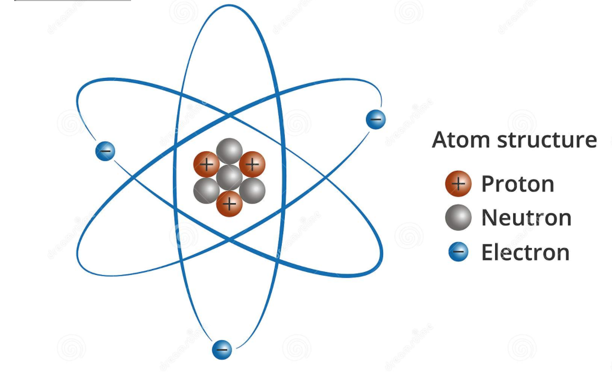
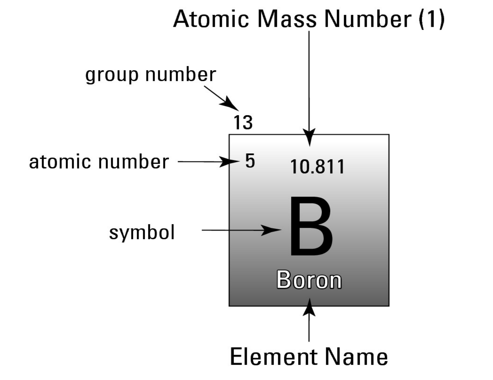
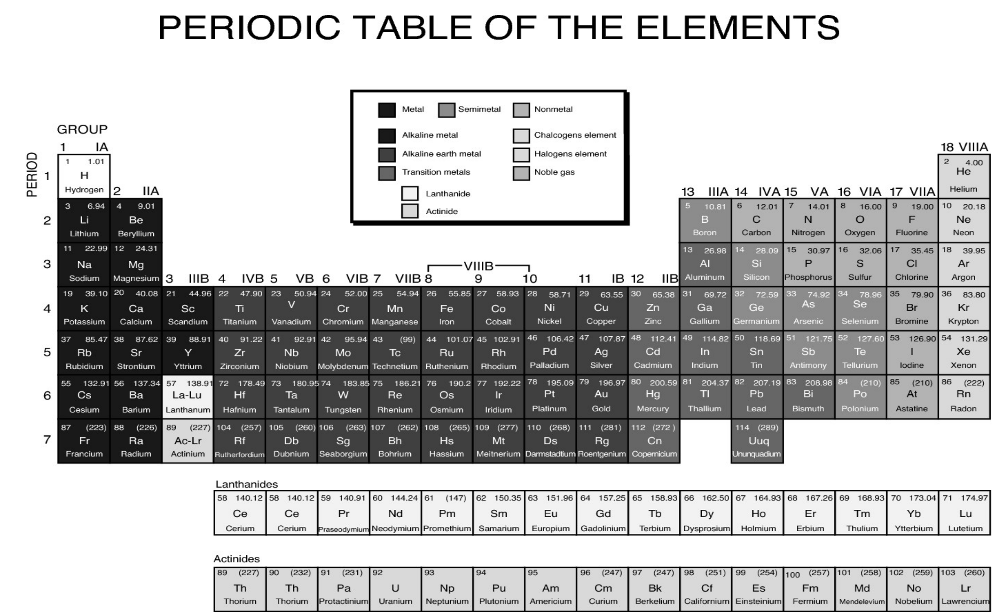
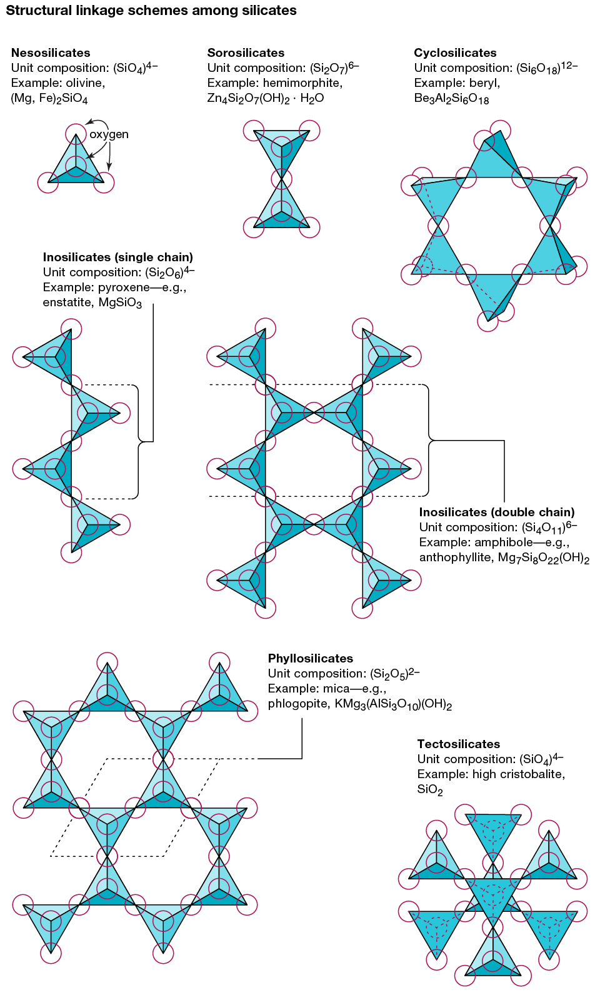
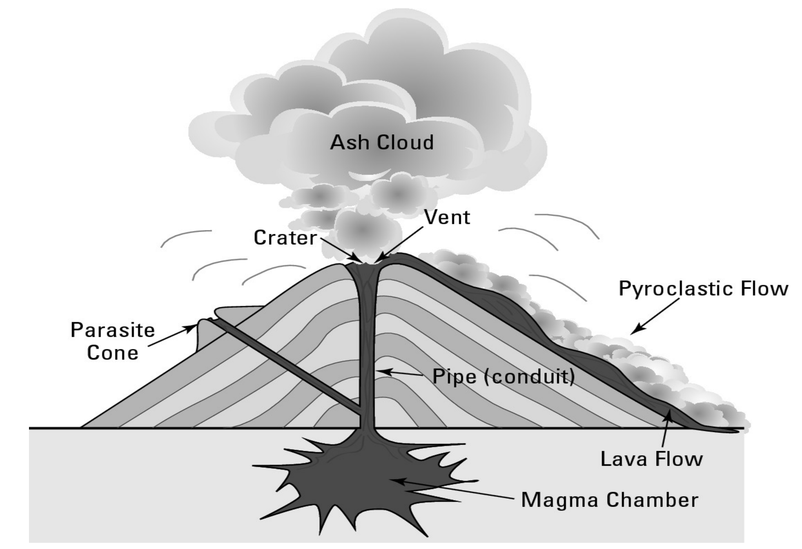

# Geology for Dummies

Author: Alecia M. Spooner

#### Table of contents

* [Rocks for Jocks](#rocks-for-jocks)
    * [Rock Types](#Rock-Types)
    * [Plate Boundary Types](#Plate-Boundary-Types)
    * [Plate Movement Mechanism](#Plate-Movement-Mechanism)
    * [Surface Processes](#Surface-Processes)
    * [Rock Dating](#Rock-Dating)
    * [Fossil Types](#Fossil-Types)
* [Observing Earth through a Scientific Lens](#Observing-Earth-through-a-Scientific-Lens)
* [The Past, Present and Future of Geological Thought](#the-past,-present-and-future-of-geological-thought)
    * [Nicholas Steno](#Nicholas-Steno)
    * [James Hutton](#James-Hutton)
    * [Uniformitarianism](#uniformitarianism)
    * [Mysteries of the past](#Mysteries-of-the-past)
* [Planet Earth](#planet-earth)
    * [Earths Spheres](#Earths-Spheres)
    * [Examining the Earth](#Examining-the-Earth)
    * [Seismic Wave Types](#Seismic-Wave-Types)
    * [Earth Layers](#Earth-Layers)
* [Chemistry of Elements and Compound](#chemistry-of-Elements-and-Compound)
    * [Subatomic Particles](#Subatomic-Particles)
    * [Periodic Table](#Periodic-Table)
    * [Elements in Earth's Crust](#Elements-in-Earth's-Crust)
    * [Chemical Bondage](#Chemical-Bondage)
* [Minerals](#minerals)
    * [Mineral Composition](#mineral-composition)
    * [Mineral Physical Characteristics](#Mineral-Physical-Characteristics)
    * [Silicates](#Silicates)
    * [Silicate Mineral Groups](#Silicate-Mineral-Groups)
    * [Nonsilicate Minerals](#Nonsilicate-Minerals)
* [Recognizing Rocks](#Recognizing-Rocks)
    * [Igneous Rocks](#Igneous-Rocks)
    * [Magma Formation](#Magma-Formation)
    * [Bowen's Reaction Series](#Bowen's-Reaction-Series)
    * [Volcanic Features](#Volcanic-Features)
    * [Volcano Types](#Volcano-Types)
    * [Pluton Types](#Pluton-Types)
    * [Sedimentary Rocks](#Sedimentary-Rocks)
    * [Lithification](#Lithification)
    * [Metamorphic Rocks](#Metamorphic-Rocks)
* [Plate Tectonics](#Plate-Tectonics)
    * [Rock Deformation](#Rock-Deformation)
    * [Earthquakes](#Earthquakes)
* [Gravity](#Gravity)
    * [Mass Wasting Triggers](#Mass-Wasting-Triggers)
    * [Mass Wasting Types](#Mass-Wasting-Types)
* [Water](#water)
    * [Stream Flow Measurement](#Stream-Flow-Measurement)
    * [Stream Erosion Types](#Stream-Erosion-Types)
    * [Groundwater](#Groundwater)
* [Glaciers](#Glaciers)
    * [Ice Types](#Ice-Types)
    * [Milankovitch Cycles](#Milankovitch-Cycles)
* [Wind](#Wind)
* [Waves](#Waves)
* [Geologic Time](#geologic-time)

&nbsp;
# Rocks for Jocks

Glossary:
* **Geology** - the study of the earth, whats it made of and the history of its evolution.
* **Tectonic Plate** - a separable part of the planet crust. The planet crust is divided into cohesive bodies of rocks that interact with each other.
* **Rock Cycle** - a series of processes involving movement, heat and pressure that transform a rock. These processes are the results of tectonic plate movements.
* **Mantle Convection** - the movement of heated rocks below the earths crust
* **Stratigraphy** - the study of rock layers(from strata)
* **Fossil** - the remains or impression of a life form preserved in rock layers
* **Mid-ocean ridge** - mountain ranges on the seafloor
* **Topography** - the arrangement of natural and artificial physical features of an area

## Rock Types
A large part of geology is studying the conditions and processes involved in the creation of rocks that can be observed today. 

The main rock types are:
* **Igneous** - form as liquid rock material(lava, magma)
* **Sedimentary** - formed by the compression of sediment particles that settle at the bottom of a body of water
* **Metamorphic** - formed by excessive heat or pressure that changes its mineral composition

## Plate Boundary Types
The interactions between continental plates depends on their boundary types. These can be divided into 3 groups:
* **Convergent Boundaries** - two plates are moving toward one another.
    * **subduction** - when a more dense crustal plate(oceanic) is forced under a less dense crust plate(continental)
        * **subduction plates** - regions where subduction is happening characterized by frequent volcanoes and earthquakes
        * friction between the plates causes excessive heat that melts rock
        * **continental volcanic arcs** - a chain of volcanoes parallel to a subducting oceanic plate
    * **oceanic convergent boundary** - when two oceanic crustal plates converge.
        * volcanoes erupt under water
        * when the volcanoes build up enough density they are visible beyond the water surface creating a **volcanic island arc**
        * both plates sink due to similar high density creating a **trench**
    * **continental-continental convergent boundaries** - when two continental crustal plates converge
        * rocks from both plates pile up on each other due to low density, creating mountains
* **Divergent Boundaries** - two plates are moving away from one another.
    * most common on sea floor
    * results in valleys, rift valleys(magma forces plates apart), a mid-ocean ridge
* **Transform Boundaries** - two plates are sliding alongside one another
    * interaction subtle but close to surface - can result in massive earthquakes

## Plate Movement Mechanism
Scientists have not yet agreed on what causes continental plate movements.

There are 3 hypothesis that all involve different stages of mantle convection:
* **Mantle convection hypothesis** - heated materials move under the earths crust and cause tectonic plates to move
* **Ridge-push hypothesis** - creation of new rocks cause mid-ocean ridges to move up and out. This movement pushes surrounding tectonic plates outwards
* **Slab-pull hypothesis** - heavy outer edges of crustal plates pull tectonic plates into the earths mantle

## Surface Processes
Surface processes always effect rock formation:
* **Gravity** - pulls material downwards and exerts pressure
* **Water** - flowing water moves around sediment and shapes the land
* **Ice** - similar like water but much more powerful. Can reshape continents
* **Wind** - moves around rock forming sand dunes
* **Waves** - effects coastal formations by removing or leaving behind sediment

## Rock Dating
Establishing the age of a rock is very important to determine what process formed the earth as we know it.

Two methods of dating rocks are used:
* **Relative dating** - ages of rocks in relation to one another
* **Absolute dating** - ages of rocks based on their elements isotopes

## Fossil Types
Fossils can be separated into two groups based on what they contain:
* **Body fossil** - remains of an organism, its cast or an impression of its body
* **Trace fossil** - remains of an organisms activities, like a footprint or burrow

&nbsp;
# Observing Earth through a Scientific Lens

Glossary:
* **Hypothesis** - a testable educated guess that proposes an answer to a question
* **Observation** - information collected about the physical world
* **Experimental Design** - the methodology used to make new observations. Experiments can be divided into:
    * *natural/observational* - observations made in natural environments with no manipulation
    * *manipulative* - observations made in a prepared environment(like a laboratory) to test which factors are most important in creating the observation
* **Statistics** - a mathematical tool used to describing and comparing information quantitatively
* **Scientific Method** - a methodical approach to proving or disproving a hypothesis involving the following steps:
    1. ask a question
    1. form a hypothesis that answers that question
    1. state a prediction based on your hypothesis that can be tested
    1. design an experiment to test the prediction
    1. perform the experiment
    1. observe the outcome
    1. interpret and draw conclusions from the outcome
    1. share the findings with other scientists
* **Peer-review** - the reviewing or retesting of scientific experiment by other qualified scientists
* **Scientific Theory** - a hypothesis that has been thoroughly tested and approved by the scientific community. A theory explains how a set of observations is related but not why they are related. 
* **Scientific Law** - describes an observation that is always reproduced by following specific steps, no matter how many times you attempt to reproduce it.
* **Scientific Paradigm** - a well-tested and excepted theory that serves as the basis for further research
* **Paradigm Shift** - when new information causes scientists to approach a problem in a completely different way

&nbsp;
# The Past, Present and Future of Geological Thought

Glossary:
* **Catastrophism** - the early belief that the earth was formed by a series of catastrophic events
* **Deep Time** - the idea of geological time, which assumes the earth exists for billions of years and the observable world is the result of geological processes over a long period of time
* **Uniformitarianism** - the idea that geological processes that are happening now have always been happening and this can be used to explain the features of the earth.
* **Continental Drift** - the constant movement of continental tectonic plates throughout geological time
* **Seafloor Spreading** - the moving apart of oceanic crust along ridges on the ocean floor(due to volcanic activity, like when a new island is formed)
* **Paleoclimatology** - the study of earths past climates
* **Cores** - long cylinder-shaped samples of ice take from ice-sheets used by paleoecologists
* **Astrogeology** - the study of planetary geology

## Nicholas Steno
A Danish physician that studied how solid objects can be trapped in other solid objects - like fossils. 

His work is considered the foundation of modern stratigraphy and produced 4 principles of stratigraphy:
* **Principle of superposition** - in an uninterrupted formation of sedimentary rocks, rock layers below are older then rock layers above
* **Principle of original horizontality** - sedimentary rock formations are formed horizontally, thus if they are placed vertically it is do to displacement by some natural force
* **Principle of lateral continuity** - sedimentary rocks when laid down, spread out until they reach some other objects that confine them(like when filling a bath tub with water)
* **Principle of cross-cutting relationships** - when a type of rock layer cuts through another type of rock layer the formation that is cutting through is younger then that which is being cut through

## James Hutton
A Scottish physician considered the father of modern geology. Hutton argued that observable rock formations need a long time to form and that even a simple observable process can result in dramatic formations given enough time. He was the first Scientist to propose deep time and uniformitarianism

## Uniformitarianism
Geological process that can be observed today have occurred in the past and can be used to explain the history of the earths features. 

While the processes are the same one must keep in mind:
* rates and intensity of process may vertically
* catastrophes can introduce a very radical change in the earths shape

## Mysteries of the past
While much of earths history can be deduced from observing patterns in rocks, there are parts of geological time that remain a complete mystery. This provides topics for scientific exploration:
* **Snowball Earth** - a hypothesis that proposes the earth was once completely covered in ice
* **Earliest Life** - fossils proving life on earth go back as far as 3.6 billion years, but it is still undetermined how living organism originated on earth
* **Mass Extinctions** - proof has been found that at least 5 mass extinctions happened throughout earths history wiping out thousands of species in a very short amount of time. It is still a mystery what caused this mass extinctions.

&nbsp;
# Planet Earth

Glossary:
* **Hydrologic cycle** - rotation of water molecules through the hydrosphere - flowing liquid, evaporating as a gas, falling as snow or rain
* **Seismic waves** - waves of energy that travel through the earth as a result of:
    * earthquakes
    * volcanic eruptions
    * magma movements
    * large landslides
    * large man-made explosions
* **Seismometers** - devices used to record seismic waves
* **Seismograph** - a machine that interprets data from seismometers and prints it out on sheets of papers(seismograms)
* **Seismogram** - a printout containing records seismic activities over time
* **Refracting** - when a seismic wave changes direction
* **Shadow Zones** - areas on the globe where P and S Waves disappear or are refactored. Very useful property when analyzing the earths composition
* **Moho Discontinuity/Moho Line** - the abrupt change from mantle rock to lighter crustal rocks in the lithosphere

## Earths Spheres
The earths materials can be separated into 5 spheres which can be studied as subsystems of the earth:
* **Atmosphere** - a layer of gas that surrounds the earth and protects it from sun radiation/heat. These gases interact with what creating the *weather system*
* **Geosphere** - solid layers of rock
* **Hydrosphere** - all the water on earth
* **Cryosphere** - all the ice on earth. The effect of large bodies of ice on the climate system is measured separately from that of large bodies of flowing water
* **Biosphere** - all organic material(dead or alive)

These systems are fueled by the energy coming from the sun and the energy coming from the earth's core.

## Examining the Earth
Scientists with todays technology can only dig 12km below the earths surface. They gather knowledge about the Earths geosphere by: 
* **experiments** - performing laboratory experiments where varied heat and pressure is applied to different material to see how it reacts
* **seismic waves** - interpreting information from seismic waves - waves pass differently through different material
* **digs** - digging into the earth and analyzing rock layers and their properties relating to other surrounding rock layers

## Seismic Wave Types
Seismic waves can be separated into two types:
* **P Waves** - travel quickly through solid materials, slow down through liquid materials
* **S Waves** - travel through solid materials but cannot travel through liquid materials

## Earth Layers
The earth can be separated into multiple layers. Each one has an estimated depth and physical properties:
* **Core** - at the center and is mostly comprised of heavy metals(nickel, iron) due to overwhelming pressure. The core has two layers:
    * *Inner Core* - solid, start at around 5150km from the surface
    * *Outer Core* - liquid layer of heavy metals, starts 2890km from the earths surface
* **Mantle** - a combination of light(silica, oxygen) and heavy element(iron, magnesium) right outside the earths core. Based on analyzed seismic waves can be separated into 3 layers:
    * *Mesosphere* - a deep solid part(due to pressure) right outside the outer core - starts 660km below surface
    * *Asthenosphere* - partially fluid, considered the 'weak' layer. Starts 200km below surface
    * *Lithosphere* - attached to the underside of the earths crust, 100km thick. Is rigid and brittle. Has similar physical properties to the crust, but its mineral composition makes it more akin to the mantle
* **Crust** - lighter layer(mostly silica) right under the earths surface. Can be separated into:
    * *Continental* - 20 to 75 km thick and composed mostly of granites
    * *Oceanic* - young and still forming, lies under earths oceans, only about 8km thick, comprised mostly of dark/dense silica rock(basalt, gabbro)

&nbsp;
# Chemistry of Elements and Compound

Glossary:
* **Chemistry** - the study of substances(gas, liquid, solid), how and why they interact with each other
* **Element** - a substance that cannot be broken down into simpler substances. On an atomic level the whole universe is built from these elements. Each element can be identified by the number of protons in its nucleus.
* **Atom** - the smallest bit of matter that can be measured and identified as a specific element
* **Atomic Nucleus** - a small dense region at the center of the atom
* **Nucleons** - subatomic particles that can be found in the atomic nucleus - protons and neutrons.
* **Electron Shell** - an orbit of electrons that surrounds the atomic nucleus. An atom can have more than one electron shell. The $n$th shell from the nucleus can hold up to $2(n^2)$ electrons. Shells are named according to their position from the nucleus - 1 shell(K shell), 2 shell(L shell), 3 shell(M shell) etc. 
* **Valence Shell** - the outermost electron shell, which determines the chemical properties of the atom
* **Isotopes** - atoms of the same element but different atomic mass numbers - this is due to variations in number of neutrons. Isotopes have different chemical properties, which are used to determine the age of rocks
    * isotopes are denoted in one of two ways:
        * $^{\text{atomic mass number}}\text{Symbol}$ -> $^{12}C$ , $^{13}C$ , $^{14}C$
        * $\text{Name} - \text{atomic mass number}$ -> `carbon-12`, `carbon-13`, `carbon-14`
* **Molecule** - a group of two or more bonded atoms
* **Ions** - positively or negatively charged atoms or molecules. This can happen as a result of chemical bondage. Ions come in two forms:
    * *cation* - an ion with a positive charge - the value of the charge ranges from 1 to 8
    * *anion* - an ion with a negative charge - the value of the charge ranges from 1 to 4
* **Compound** - a type of molecule where the combined atoms are of different types
* **Chemical formula** - describes the number of each element that forms a compound
    * $SiO_2$ - one atom of silica combined with two atoms of oxygen
    * $(Mg, Fe)_{2}SiO_4$ - two atoms of magnesium OR iron combined with one atom of silica and four atoms of oxygen

##  Subatomic Particles
Each atom is comprised of subatomic particles that can be divided into 3 types:
* **Neutron** - found in the nucleus, no net electronic charge, slightly greater mass than a proton
* **Proton** - found in the nucleus, positive electronic charge
* **Electron** - found in atom orbitals, negative electronic charge, around 1/1836 mass of proton

The number of ne

## Periodic Table
The periodic table lists all elements known to humans ordered by atomic number. 

For each element it presents the following information:
* **Atomic mass number** - the total mass of the protons and neutrons in the elements nucleus
* **Atomic number** - the number of protons in the elements nucleus
* **Group number** - the number of electrons in the valence shell
* **Symbol** - shorthand identifiers for the elements
* **Element name** - elements are usually named by the scientists that discover them - hence different element's names can have origins in different languages

## Elements in Earth's Crust
|Element|Symbol|% of Crustal Material|
|-------|------|---------------------|
|Oxygen|O|46.6|
|Silica|Si|28|
|Aluminum|Al|8.1|
|Iron|Fe|5|
|Calcium|Ca|3.6|
|Sodium|Na|2.8|
|Potassium|K|2.6|
|Magnesium|Mg|2.1|

## Chemical Bondage
When multiple atoms join together. How two atoms join is determined by the number of electrons in their valence shell.

There are 3 most common types of chemical bonding:
* **Ionic bonds** - when one atom donates electrons to another atom they become a cation and anion that form a neutrally charged compound. All ionic bonds create compounds called salts - a combination of a metal element and a non-metal element.
* **Covalent bonds** - when two atoms share electrons in their valiance shell. The result is each atom has a full outer shell and a neutral charge which makes the bond very strong.
* **Metallic bonds** - electrons are released from the atoms valiance shells and are used by the whole cluster of atoms, without belonging to a particular atom. This usually occurs among atoms with a very low number of electrons in their valiance shell - like metals. The metals are ionic atoms between which the "migrating" electrons travel. This type of bond is what gives metals some interesting properties:
    * shines
    * can be bent and molded without breaking
    * conduct electrical current

&nbsp;
# Minerals

Glossary:
* **Organic** - relating to or derived from living matter
* **Mineral** - A special kind of compound that satisfies the following criteria:
    * are solid - this can change under great heat
    * usually inorganic
    * orderly structure - crystal
    * naturally occurring
    * has a specific chemical composition
* **Crystal** - a substance in which atoms, molecules or ions are packed in an ordered, repeating 3-dimensional pattern. Atoms in minerals are organized into crystals
    * most minerals have one common crystal shape
    * minerals comprised of more than one crystal shape are said to have multiple **habits**
* **Petrographic Microscope** - a special microscope that shines light through an examined slide - used in geology
* **Polarization** - examining a mineral by shining light through it at different angles
* **Thin-section Slides** - slices of rock used for examination in a laboratory. Made by grinding down a rock until light shines through it and examining it with a petrographic microscope

## Mineral Composition
The mineral composition of a rock depend on:
* presence of surrounding minerals
* temperature
* pressure

## Mineral Physical Characteristics
A minerals physical characteristics can be used to identify it. Most common are:
* *Appearance in relation to light*
    * **Transparency** - the minerals ability to transmit light(also called clarity). The spectrum of clarity is:
        * *transparent* - can see through it
        * *translucent* - allows light to pass but cannot see through it
        * *opaque* - does not allow light to pass
    * **Color** - how light is absorbed or reflected by an object. A minerals color can change without changing its composition or crystal structure through:
        * heat
        * impurities - small amounts of other elements trapped in the crystal structure
    * **Luster** - how the surface reflects light. Luster can be:
        * *metallic* - it shines, this is the result of light transmitting energy to electrons of the surface atoms, causing these electrons to vibrate
        * *nonmetallic* -this includes pearly, glassy, silky, earthy, greasy or adamantine(extremely shiny or fiery)
    * **Streak** - how it appears in powdered form. This is achieved by rubbing it against a piece of rough porcelain called a *streak plate* and analyzing the color of the streak.
* *The strength of the crystal structure*
    * **Hardness** - how well it resists being scratched. By scratching you attempt to break the bonds of the atoms - this tests the strength of those bonds. Absolute hardness can be measured in a laboratory. Relative hardness can be measured on what is called **Mohs Scale**:
        1. Talc
        1. Gypsum - a human fingernail is 2.5
        1. Calcite - a copper penny is 3.5
        1. Fluorite - an iron nail is 4.5
        1. Apatite - glass is 5.5
        1. Feldspar - a steel file is 6.5
        1. Quartz - a streak plate is 7
        1. Topaz
        1. Corundum
        1. Diamond
    * **Tenacity** - how well it resists breaking.
        * *malleable* - can be shaped without breaking into pieces
        * *elastic* - can bend but return to original shape
        * *brittle* - break easily into smaller pieces
    * **Cleavage** - how a mineral breaks, if it has a combination of stronger and weaker bonds. It will break along the weaker bonds called *cleavage planes*. Cleavage is defined by the number of planes and the angle at which they intersect.
    * **Fracture** - how a mineral breaks if it has equally strong bonds. Minerals usually fracture irregularly, with rough/uneven surfaces.
        * *Conchoidal fracture* - a fracture that leaves a curved smooth surface. This property was used during the stone age to make tools
* *Effervescence* - how and if a mineral fizzes when sprayed with weak hydrochloric acid
* *Laboratory measurements*
    * *Polarized light* - the colors that appear when light is split through a crystal depend on the crystals shape and composition, which gives insight into its mineral composition
    * *Fluorescence* - fluorescent minerals glow when in contact with ultraviolet light
    * *X-ray diffraction* - each mineral has a unique pattern that is displayed when x-rays pass through it

## Silicates
A group of minerals based on silicon-oxygen tetrahedron. Tetrahedral are combined together to form silicate structures, which are held together by atoms of other elements. These are the most common types of minerals observed in the earths crust.

There are 5 common silicate structure. The structure is determined by how silicon-oxygen tetrahedra combine to share oxygen.
* **Single tetrahedral** - tetrahedral held together by other elements without sharing oxygen atoms
* **Single chains** - tetrahedral are linked up by sharing two oxygen atoms
* **Double chains** - when two single chain structures share a few oxygen atoms
* **Sheets** - when 3 oxygen atoms at the base of the tetrahedral are shared with other tetrahedral
* **Framework** - a 3-dimensional structure where each oxygen atom of a tetrahedral is shared with another tetrahedral
* **Ring** - when tetrahedral share two oxygen items in structures of 3/4/5/6

## Silicate Mineral Groups
The seven most common silicate groups are:

|Group Name|Chemical Formula|Example Mineral|Tetrahedra Structure|
|----------|----------------|---------------|--------------------|
|Olivine group|$(Mg, Fe)_{2}SiO_4$|Olivine|Single tetrahedra|
|Pyroxene group|$(Mg, Fe)_{2}SiO_3$|Augite|Single chains|
|Amphibole group|$Ca_{2}(Fe, Mg)_{5}Si_{8}O_{22}(OH)_2$|Hornblende|Double chains|
|Mica group|$K(Mg, Fe)_{3}AlSi_{3}O_{10}(OH)_{2}$ $KAI_{2}(AlSi_{3}O_{10})(OH)_2$|Biotite Muscovite|Sheets|
|Feldspar group|$KAISi_{3}O_4$ $(CaNa)AlSi_{3}O_8$|Orthoclase Plagioclase|Framework|
|Quartz|$SiO_2$|Quartz|Framework|
|Kaolinite group(clays)|$Al_{2}Si_{2}O_{5}(OH)_4$|Kaolinite|Ring|

## Nonsilicate Minerals
Crystals composed of elements other the silicon - only 5-8% of the earths crust. Major groups include:
* **Carbonates** - contain the carbonate anion ${CO_{3}}^{2-}$. Most popular are calcite and dolomite which are used in cement
* **Sulfides** - contain the sulfur anion $S^{2-}$, which are found in useful metals such as lead, sulfur, mercury and copper ore.
* **Sulfates** - contain the compound $SO^{2-}$ anion. Examples are gypsum or anhydrite used in plaster.
* **Oxides** - are the result of binding metal with oxygen atoms. Are the source of important metals such as iron, gemstone, tin, titanium and uranium ore.
* **Native Elements** -when same element atoms bind to each other creating a "pure" mineral. Includes gold($Au$), silver($Ag$), platinum($Pt$), diamond($C$) and copper($Cu$)
* **Evaporites** - sediment minerals formed as a result of evaporation. These include sulfates, halite and sylvite.
* **Gemstones** - minerals that are considered valuable or beautiful can be formed into jewelry. This requires conditions that allow individual mineral crystals to grow fairly large.

&nbsp;
# Recognizing Rocks
All rocks can be categorized based on how they are created. 

Glossary:
* **Crystallization** - changing a solution from a liquid to a solid
* **Magma** - melted rock below the surface of the earth
* **Lava** - melted rock above the surface of the earth
* **Mineralization** - the formation of minerals 
* **Viscosity** - how strongly a fluid resists flowing.
* **Volcanoes** - geological structures that are the result of magma forcing its way through the crustal layer of the earth to the surface
* **Volcanology** - the study of volcanoes
* **Plutons** - bodies of underground igneous rocks formed by solidified magma. Pluton can be:
    * *discordant* - cuts through layers of rock
    * *concordant* - fills crack parallel to pre-existing sedimentary levels
    * *massive* - rounded/full shape
    * *tabular* - linear/flat shape due to filling cracks in pre-existing rock
* **Soils** - the product of interaction of sediments with air, water, organic materials and bedrock.
* **Weathering** - changing something through exposure to natural elementals - water, heat, wind, ice
* **Mechanical/Physical Weathering** - the breaking down of rocks into smaller rocks, through weathering, without changing the chemical composition. Types of mechanical weathering:
    * *Frost wedging* - water seeps into rocks and freezes, breaking the rock apart
    * *Thermal expansion* - due to heat, minerals in the outer layer of a rock heat up, expand and brake
    * *Unloading/Sheeting/Exfoliation* - when plutons are exposed, outer layers of rock are released from great pressure. As a consequence the rocks expand outwards and break of from the original formation
    * *Abrasion* - scraping of rocks against each other. Most common form of physical weathering
* **Chemical Weathering** - changing the mineral composition of a rock by removing or exchanging its ions. Only pertains to the surface of a rock. Rates at which a rock weathers are measured in amount of water and heat in the surrounding area.Types of chemical weathering include:
    * *Dissolution* - what water removes ions from a mineral(salt dissolving in water)
    * *Oxidation* - bonding of oxygen with ions(rust)
    * *Hydrolysis* - exchange of hydrogen($H$) or hydroxide($OH$) ion for a mineral ion
* **Erosion** - breaking down by mechanical or chemical weathering
* **Diagenesis** - physical/chemical changes sediment goes through during transformation to sedimentary rocks

## Igneous Rocks
Are formed when magma crystallizes. Depending on where they formed they can be:
* **Intrusive/Plutonic** - formed under ground, generally have larger minerals
* **Extrusive/Volcanic** - formed above ground, generally have smaller minerals

Igneous rocks are classified by:
* **Texture** - the appearance and feel of the rock, determined by how quickly the magma cooled. Different textures pertaining to (I)Intrusive and (E)Extrusive rocks:
    * *Phanetric* (I) - with crystals large enough to see with naked eye, due to slow cooling
    * *Aphanitic* (I, E) - minerals only visible through microscope due to rapid cooling
    * *Porphyritic* (E, I) - large crystals trapped within a matrix of smaller crystals due to slow cooling followed by rapid cooling
    * *Pegmatite* (I) - giant crystals as a result of water mixed into the magma. The water helps ions move around forming large crystals
    * *Glassy* (E) - a smooth glassy surface as a result of rapidly cooled flowing magma(composed of high amount of silica)
    * *Vesicular* (E) - full of holes due to trapped gas bubbles which create holes when they are released
    * *Pyroclastic* (E) - fragments of rocks from volcanic walls and ash. Look like sedimentary rocks. Small fragments(<2mm) are called *tuff* and large fragments(>2mm) are called *volcanic breccia*
* **Mineral Content** - determined by elements in the magma. Terms used to define the composition of both extrusive and intrusive igneous rocks are:
    * *Felsic* - at least 65% silica. Light color
    * *Intermediate* - between 55% and 65% silica. Mixture of light and dark colored minerals
    * *Mafic* - between 45% and 55% silica. Fairly dark in color
    * *Ultramafic* - below 45% silica. Dark and uncommon

## Magma Formation
Magma can form in two ways:
* **mafic/basalt magma** - formed near the boundary of the earth's crust and mantle where heat and pressure is just right. Contains low amounts of silica since it is formed further from the earth crust.
* **rhyolite/felsic magma** - formed when one crustal plate is subducting below another. Contains high amount of silica, due to formation closer to the earth crust.

## Bowen's Reaction Series
The sequence of mineralization in magma - determined by the temperature at which different minerals form. The minerals with the highest melting points are first to crystallize. 

When certain minerals crystallize they remove certain elements from the magma. The resulting elements can only bond together to form specific minerals. This process is called **fractional crystallization**

**Magmatic differentiation** is the evolving of magma as some elements are removed due to fractional crystallization or when introduced into other magma.

**Partial melting** is when magma temperature doesn't reach values that melt certain minerals. The results is a mixture of liquid and solid form material in the magma. This is how most magmas are created.

Which minerals are melted also determines the magmas viscosity.

## Volcanic Features
Each volcano has specific features:
* **Magma chamber** - magma is created and held here until pressure pushes it towards the surface
* **Pipe** - where magma moves from the magma chamber to the surface
* **Vent** - where magma exits the pipe
* **Crater** - a depression at the top of the volcano, created through a collapse of surface materials
* **Caldera** - a very large crater when the top of a volcano collapses inward
* **Dome** - created when erupting materials cover the vent, which builds pressure and finally causes another explosion
* **Cone** - a mountain-like structure that forms over thousands of years as lava, gas, ash and pyroclastics spill out onto the surface

## Volcano Types
Volcanoes can be separated into 3 main types depending on what materials they are composed of:
* **Shield Volcanoes** - basalt lava that erupts from the ocean floor. Largest volcano type
* **Stratovolcanoes** - continental crust that subducts and is melted. Characterized by high peaks, steep slopes and small craters due to layers of solidified lava and pyroclastic ash.
* **Cinder cones** - usually formed as parasite cones of larger volcanoes. Small, cone-shaped with large craters. The pipe may close permanently after a single eruption.

## Pluton Types
* **Dike** - tabular, discordant, when magma fills narrow cracks in crustal rocks
* **Sill** - tabular, concordant, when magma fills space horizontally
* **Laccolith** - horizontal magma flow between sedimentary rocks close to the surface
* **Batholith** - massive, discordant plutons that often serve as the base for large mountain systems

## Sedimentary Rocks
Sedimentary rocks are composed of pieces of different rocks. Surface rocks are broken down and moved around by gravity, water, ice and wind, and finally settle down, get glued together to form sedimentary rock. 

Sediment rocks can be grouped by how they are sorted:
* *poorly-sorted* - mix of different sized rocks as a result of being transported by gravity or ice
* *well-sorted* - same sized rocks, as a results of being transported by wind or water

Major sedimentary rock groups:
* **Detrital**
    * *composition*: clasts - broken bits or rock
    * *classified by*: size of sediment grains, shape and composition of grains
    * *example*: shale, siltstone, sandstones
* **Chemical**
    * *composition*: formed when minerals dissolved from existing rock lithify
    * *classified by*: chemical particles 
    * *groups*: organic(like from shells) and inorganic
    * *example*: biogenic limestone, coal, salt evaporite 

A sedimentary rocks texture and grain size are defined by the distance and means at which it traveled.

## Lithification
The process in which sediment is transformed into sedimentary rock is as follows:
* *burial* - sediments are buried causing increased pressure and heat
* *compaction* - pressure squeezes out extra space from the sediment
* *cementation* - sediment is glued together and water flows through it carrying minerals

All this happens near the earths crust in relatively low temperatures(150 - 200 Celsius)

## Metamorphic Rocks
Sedimentary, igneous or preexisting metamorphic rocks that undergo a major change(metamorphosis) under high pressure and temperature, found deep in the earth's crust.

Types of metamorphosis:
* **Contact/Thermal metamorphosis** - when lava moves up and changes surrounding rocks on its way. Effects small areas
* **Hydrothermal metamorphosis** - when magma heats up water and the water enters the surrounding rocks changing them. Effects small areas
* **Burial metamorphosis** - when rocks are deeply buried causing heat and pressure to change them. Effects large areas
* **Dynamothermal metamorphosis** - when two crustal plates crash into each other causing excessive pressure and heat. Effects large areas

**Metamorphic Grade** is the degree of change of metamorphic rocks dependant on the degree of the morphing heat and pressure. Low-grade retain characteristics of the parent rock, while high-grade look very different. This characteristic is measured by the rocks mineral composition, called the **index minerals**(some minerals form only at specific heat and temperatures)

## Rock Cycle
How rocks transition from one type to another through various processes that create, transform and destroy the rock. All rock types transition to:
* *Sedimentary* through weathering, transport, deposition
* *Igneous* through melting and cooling 
* *Metamorphic* through increasing temperature and pressure

&nbsp;
# Plate Tectonics

Glossary:
* **Pangea** - a prehistoric supercontinent that was comprised of all contemporary continents.
* **Gondwana/Gondwanaland** - a prehistoric supercontinent comprised of South America, Africa, India, Australia and Antarctica
* **Laurasia** - a prehistoric supercontinent comprised of North America, Greenland, Europe and Asia
* **Striations** - scratch lines left when glaciers move across rocks
* **Geomagnetic Field** - a magnetic field as a result of convection currents of molten iron and nickel in the earths core.It extends out from the Earth's interior into space interacting with solar winds.
* **Polar wondering** - the movement of the earth's magnetic poles mostly due to continental drift
* **Polar/Geomagnetic reversal** - change in the planets magnetic field such that the southern and northern pole switch places
* **Paleomagnetism** - study of how the earths magnetic poles changed direction over time
* **Polarity** - determines under what magnetism a rock was structured based on how the minerals where aligned. A rock can have normal or reversed polarity(normal is alignment in accordance with the current polar position)
* **Continental drift hypothesis** - states that earth's continents where once a Pangea that moved apart over a long period of time. This hypothesis is supported by the following evidence:
    * continental shifts of some continents almost perfectly feat when joined(like south america and africa)
    * similarity of fossils found on different continents
    * similar strata - sequence of layers of rock
    * striations indicate the the same glaciers where moving across rock form different continents
    * GPS tracking - show that tectonic plates are moving away from the Mid-Atlantic Ridge
* **Density** - the amount of atomic matter in an object, or mass per unit of volume $D =\frac{m}{v}$
    * *m* - mass is the amount of matter in an object(grams)
    * *v* - volume is how much space the object fills($cm^3$)
    * do not confuse with **weight** - the pull of earths gravity on the object
    * average densities are $3.0 \frac{g}{cm^3}$ for oceanic crust and $2.7 \frac{g}{cm^3}$ for continental crust
* **Isostasy** - a state of gravitational equilibrium between the earths crust and mantle, where the earth's crust "floats" on the mantle at a height determined by its density. Dense crust sinks, where sparse crust rises.
    * example: 90% of a floating iceberg is hidden under water. This is due to the fact that its density is close to that of the surrounding water - the iceberg is 10% less dense then the surrounding water.
* **Orogenesis** - the process of building mountains due to plate movements and processes at plate boundaries
* **Accretion** - when two plates converge and the subducting plate is piled on top of the subducted plate
* **Convection** - the movement of heated materials
* **Focus** - the point of origination of an earthquake
* **Richter scale** - a logarithmic scale used to measure the magnitude of an earthquake. The richter scale is inaccurate for very strong earthquakes that measure greater than 7 on the Richter scale
* **Seismic moment-magnitude scale** - a logarithmic scale used to measure earthquake magnitude. More precise than the Richter scale - uses a combination of the depth of the slippage, distance rocks move and strength of the rocks to describe the energy released into the earth. 

## Rock Deformation
Movement of crustal plates exert force on rocks deforming them. The deformation depends on the type of plate boundaries.
* **Compression** - crushing of rocks against each other along convergent plate boundaries.
* **Tension stress** - tension of a rock due to stretching it apart on divergent plate boundaries.
* **Shearing stress** - the breaking off of rocks due to plates moving in different directions along a transform plate boundary

## Earthquakes
Rocks that are pressed together deform resulting in stored energy. This happens up to a point when **slippage** occurs and the rocks bounce back into their primary positions. This process is called **elastic rebound** and results in a large amount of energy being released. During this process the rocks move causing smaller releases of energy(**foreshocks**) and larger releases of energy(**aftershocks**)

&nbsp;
# Gravity
A surface process that pulls material downwards and exerts pressure

Glossary:
* **Mass wasting** - movement of large amount of earth minerals due to gravity
* **Friction** - the sticking force between two objects, usually determined by the angle at which the objects are placed and the smoothness of their surfaces. If the power of friction and gravity are equal an object will be motionless.
* **Repose** - to rest temporarily
* **Angle of repose** - angle at which sediment rocks are stable and wont move farther downslope as a result of gravity. Repose is temporary(the surrounding will eventually change)
    * the angle of repose is different for different rock types due to friction. Example: $35^{\circ}$ for fine sand and $45^{\circ}$ for rock pebbles
* **Bedrock** - solid rock formation found under loose formations of sedimentary rocks. Is less susceptible but not completely resistent to mass wasting
* **Quickly** - earth materials moving a few meters per second or faster

# Mass Wasting Triggers
* **Water** - causes increased weight(soaked in water), or particle saturation(they no longer touch each other removing friction, like a soaked sand castle)
* **Slope angle change** - increases in slope angle due to eroding at the base of the slope caused by water(undercutting)
* **Groundshaking** - volcanoes and earthquakes, can change elevation(uplift) or crack bedrock, resulting in a large slope angle
* **Vegetation** - vegetation holds sediment rocks together and can be removed due to fires, overgrazing or urban development

## Mass Wasting Types
Scientists categorize mass wasting by how the rocks move. Mass wasting can be slow or quick.

Quick mass wasting types:
* **Fall** - when rocks or sediment fall from one location to another without touch other rocks
* **Slides** - when rocks and sediment move downwards staying in contact with the surface
* **Slope** - a slide but along a curved surface(slower then a slide)
* **Flows** - a fluid downward movement 

**Solifluction** - a slow mass wasting process also called soil creep, due to closeness of angle to angle or repose. Soil creep is so slow it can only be observed over a long period of time.

&nbsp;
# Water 
A surface process that generates energy through flowing and reshapes the earth.

Glossary:
* **Evaporation** - when heated water molecules turn from liquid to gas
* **Hydrologic cycle** - the cycling of water among the atmosphere, oceans and lithosphere. Water never leaves the earths atmosphere.
    * water evaporates from oceans due to heat from the sun
    * the water vapor resides in the atmosphere forming clouds
    * eventually the body of water vapor becomes too heavy, or the surrounding temperature too low to hold it
    * as a result the water falls as rain
    * once on the ground the water makes its way to an ocean. The water can make this journey by various means:
        * **Surface runoff** - water traveling across a surface ot reach the nearest lake, stream or ocean
        * **Groundwater** - water absorbed by the ground and deposited into underground rocks and sediments
        * **Snowpacks/Ice sheets** - water remains in a body of snow or ice and awaits melting
        * **Lakes** - water stays in a lake before evaporating again
        * **Streams** - any moving body of water that carries sediment. This sediment is the result of erosion
* **Basin/Watershed** - an area of land that supplies water to a stream
* **Laminar/Sheet flow** - when water flows in a continuous, undisturbed, thin layer
* **Turbulent flow** - when streamlines and water are mixed together resulting in a choppy and disrupted flow
* **Channel** - a depression in landscape that can house a stream
* **Ultimate base level** - maximum point to which a channel can deepen(erosion). Elevation is equal to the sea level
* **Temporary base level** - maximum point to which a channel can deepen(erosion) because of a surface that cannot be eroded. Elevation is above sea level
* **Deposition** - when due to loss of velocity in liquid minerals are deposited building up layers of sediment. The opposite of erosion
* **Graded stream** - a stream that has just enough energy to transport all the minerals deposited into it, due to which it neither erodes or deposits sediments.
* **Aluvium** - earth material left behind by a stream
* **Infiltration** - the movement of rainwater, through soil layers into sediment and rock layers
* **Capillary action** - the ability of liquid to flow without the assistance or in opposition to gravity
* **Springs** - locations where groundwater flows out onto the surface
* **Aquifer** - any rock or sediment where fresh water is stored
* **Permeable** - allowing liquids or gasses to pass through it
* **Geyser** - a spring that discharges water due to groundwater being exposed to very high temperatures(contact with magma)
* **Soluble** - able to be dissolved
* **Karst** - a topography that is the result of water flowing through a rock or sediment layer and dissolving soluble minerals on the way. Example:
    * caves
    * caverns(systems of caves)

## Stream Flow Measurement
The following characteristics are taken into account when measuring stream flow:
* **Gradient** - the slope at which the water travels downhill. Measured as meters of elevation lost over a kilometer of distance traveled
* **Velocity** - distance traveled over time. Measured as meters per second
* **Discharge** - the amount of water that passes through a given point in a set amount of time. Width, depth and velocity are taken into account
* **Capacity** - maximum number of sediment particles a stream can carry. Limited by the streams discharge
* **Competence** - measure of the largest particle a stream can carry. Directly related to speed since faster movement provides more energy and enables moving heavier rocks. Competence is $v^2$ meaning a small change in velocity results in a big change in competence

## Stream Erosion Types
* **Abrasion** - particles scrape and scour the channel bed
* **Hydraulic Lifting** - intense pressure of flowing water remove sediments from the channel bed
* **Dissolution** - rock material dissolves into water

## Groundwater
Water that sinks through the soil and is deposited into underground rocks and sediments. Groundwater flows slower then surface streams.

How much water a rock or sediment layer can hold is measured by:
* **Porosity** - amount of space between particles(% of total volume) 
* **Permeability** - how easily water can move through the layer. Determined by porosity and how well spaces are connected
* **Potential** - how gravity and pressure affect groundwater at a given point
    * groundwater usually flows from areas of high potential to areas of low potential
    * **hydraulic gradient** - the difference in groundwater potential across a measure of distance. Determines the direction in which groundwater flows

Two zones of groundwater systems are identified:
* **zone of aeration** - space within layers is filled with air
* **zone of saturation** - space within layers is filled with water

&nbsp;
# Glaciers
Only 10% of earth's water is stored in ice. Glaciers combine the flowing movement of a liquid with the strength of a solid making it an extremely powerful force of change. 

Glossary:
* **Glaciation** - when ice covers large parts of continents and oceans
* **Firn** - a tightly packed dense snow created by the pressure and compaction of multiple layers of snow stacked on each other. Firns resist complete melting during summer and refreeze during winter. 
* **Accumulation** - when glacial ice grows due to more snowfalls than snow melt.
* **Wastage** - any ice lost by the glacier, either from melting of calving
* **Calving of icebergs** - when ice breaks off a glacier into the ocean
* **Zone of accumulation** - an area where a glacial accumulates, usually at a higher elevation
* **Zone of ablation** -  an area where a glacial recedes, usually at a lowe elevation
* **Line of equilibrium/snowline** - a point between the zone of accumulation and ablation where snow neither recedes nor accumulates. 
* **Glacial budget** - the annual cycle of a glaciers accumulation and wastage
* **Terminus** - the edge of a glacier
* **Advancing** - the movement of a glacier that has a positive glacial budget(accumulation higher than wastage). The terminus moves downslope
* **Retreating** - the movement of a glacier that has a negative glacial budget. The terminus moves upslope
* **Glacial trough** - a U-shaped valley that forms when a glacier removes rock and sediment
* **Fjord** - small, steep-sided bays that are formed by where a glacial trough exits into the sea
* **Glacial drift** - any sediment left behind by a melting glacier
* **Glacial till** - any rock or sediment that has been carried and left directly by glacial ice
* **Glacial erratic** - a large boulder carried by glacial ice and deposited far from its origin
* **Glacial geomorphologist** - experts who study the landscape shaped by glaciers and ice sheets
* **Erosional gaps** - periods of glacial history where evidence has been moved away due to erosion
* **Isostatic rebound** - when ice sheets melt the landmass they where covering is relieved of the weight of the ice, causing it to move up in relation to the sea level

## Ice Types
* **Valley glaciers** - smallest and most common. Flow in a path similar to stream - through mountain valleys towards lower elevation
* **Ice sheets** - not contained by valleys, flow out in all directions from the central point. Only 2 such exist:
    * covering Greenland
    * covering Antarctica
* **Ice caps** - flow out in all directions but cover smaller regions. Like in Iceland

## Milankovitch Cycles
The collective effect of changes in the earths movement on its climate over a thousand of years. These changes can be grouped:
* **Eccentricity** - the shape of the earths orbit. The Earth reaches the point farthest from the sun every 100000 years
* **Obliquity** - the angle at which the earth is tilted with respect to earth's orbital plane. It shifts by $2^{\circ}$ over 40000 years. A higher tilt means the northern hemisphere is tilted farthest away from the sun
* **Precession** - the direction earth's axis of rotation is pointed. The axis at the North Pole points in different directions over a span of 26000 years

&nbsp;
# Wind
A surface process that plays a huge real in shaping dry regions. Particles are moved by the flow of air. Wind, like water can have a laminar(straight line) or turbulent flow(erratic)

Glossary:
* **Precipitation** - rain and snowfall
* **Arid regions** - dry regions that are the result of precipitation being lower then evaporation
* **Bed load** - particles transported by wind that move close to the ground
* **Suspended load** - particles lifted away from the surface and carried within the flow of the wind
* **Creep** - when particles are to heavy to be lifted by wind they move along the ground
* **Saltation** - a type of particle motion where they are repeatedly lifted and dropped when moved by wind
* **Wind abrasion** - the blasting of sediments against another object by wind
* **Desertification** - turning productive farm or grazing land into a barren desert

&nbsp;
# Waves
Waves are create when wind blows against the surface of water, pushing it up into a crest. Waves are a powerful surface process that shape shorelines around the world.

Glossary:
* **Crest** - a point of the wave with the maximum value of upward displacement
* **Trough** - a point of the wave with the minimum value of upward displacement
* **Wave characteristics** when describing waves the following characteristics are taken into account:
    * **height** - distance from top of crest to bottom of trough
    * **length** - distance from one crest to another, or trough to another
    * **period** - the time it takes to pass a certain point
    * **velocity** - the speed at which the wave is travelling
* **Wind characteristics** - a waves features are measured through measurements pertaining to wind:
    * **speed** - how fast the wind is travelling
    * **duration** - how long the wind blows across the waters surface
    * **direction** - the direction in which the wind blows and whether its one stream or multiple streams blowing in different directions
    * **fetch** - the distance the wind moves across the surface
* **Oscillatory motion** - when wind cause water to move in a rolling pattern. The energy built by the rolling motion is accumulated over distance
* **Breakers** - waves that collapse and hit the shore
* **Translatory waves** - waves that move water outside of the originating body of water, like breakers when they move water onto the beach
* **Swash** - water moved up onto the beach by translatory waves
* **Backwash** - water that recedes from the beach back into the body of water
* **Tides** - forces that move ocean water towards and away from land as a response to the pull of the moon's gravity. 
    * *high tides* occur where closest to the moon - the water is pulled towards the land
    * *low tides* occur where farther from the moon - the water is pulled away from the land
* **Tidal currents** - flow of a water with the tides
    * **flood current** - when moving from low to high tide - the water is coming in
    * **ebb current** - when moving from high to low tide - the water is receding
* **Tidal flats** - areas along the shore where water comes and goes due to tides
* **Longshore current** - current parallel to the shore caused by waves hitting at an angle
* **Shoredrift** - movement along the shore due to a longshore current
* **Rip current/undertow** - when waves hits the shore straight on and the receding water washes out into the deeper water creating a potentially dangerous current that can pull unsuspecting swimmers into the dangerous deep waters.
* **Sediment budget** - the relationship between how much sediment is deposited and how much is eroded and carried away. A positive sediment budget means that more sediment is deposited.
* **Beach** - an area where movement of currents, tides and waves deposit sediment

&nbsp;
# Geologic Time
By combining relative dating and absolute dating techniques geologists have created(and are constantly working on) earth's geologic timescale dating back 4.5 billion years.

Glossary:
* **Strata** - a layer or series of layers of rock
* **Stratification** - the formation of strata in rocks
* **Inclusion** - a piece of rock contained in a different rock
* **Conformable** - deposited in a continuous sequence and having the same direction of stratification
* **Unconformities** - when sediment deposition is not continuous. This breaks the geologic record of the rock layer
    * often make it hard to relatively date since since pieces of the layers history have bee corrupted
* **Radiometric dating** - the measurement of atomic changes(decay) in a minerals atoms.
* **Unstable/radioactive isotopes** - an isotope that emits radiation in an attempt to transform into a stable isotope.
    * not all elements have isotopes
    * not all isotopes are radioactive
* **Parent Isotope** - the original form of an unstable isotope(before transformation)
* **Daughter Isotope** - the target form of an unstable isotope(after transfor

## Relative Dating
Determining the age of rocks in relation to other rocks. 

Stratigraphers study layered rocks to find out about their history, formation and origin. These layers are called **units** and can be categorized into:
* **Lithostratigraphic units** - layers described by their formation. Used to describe physical characteristics
* **Biostratigraphic units** - layers described by the fossils they contain
* **Chronostratigraphic units** - layers described by when they where formed

Stratigraphy follows a set of 6 principles. These are Nicholas Steno's [4 principles of stratigraphy](#nicholas-steno) and 2 more modern principles:
* **Principle of fossil succession** - any time period can be recognized by fossils present in the rocks. 
    * only sedimentary rocks can house fossils
* **Principle of inclusions** - inclusions always belong to older rocks then those they are contained in

All Nicholas Steno principles are used to date sedimentary rocks except the Principle of cross-cutting relationships which is used for igneous and metamorphic rocks.

## Absolute Dating
Determining the numerical age of rocks based on the chemical composition.

Methods for absolute dating:
* *radiometric dating* - dating by measuring the transformation of radioactive isotopes

## Radioactive Decay Types
Radioactive elements transform in one of three ways:
* **Alpha decay** - $\alpha$ decay is when two protons and two neutrons leave the nucleus, resulting in a completely new element and an alpha particle(comprised of the separated neutrons and protons)
    * example: $^{238}U$ -> $^{234}Th$
* **Beta decay** - $\beta$ decay is when a a neutron splits itself into an electron and a proton. The electron leaves the atom as a beta particle, while the proton stays changing the element into a new element with the same atomic mass number(but different atomic number due to the extra proton)
    * example: $^{40}K$ -> $^{40}Ca$
* **Beta/Electron capture** - when an atom captures an electron and combines it with a proton to create a new neutron in its nucleus. The resulting isotope has the same atomic mass number but a different atomic number
    * example: $^{40}Ca$ -> $^{40}Ar$