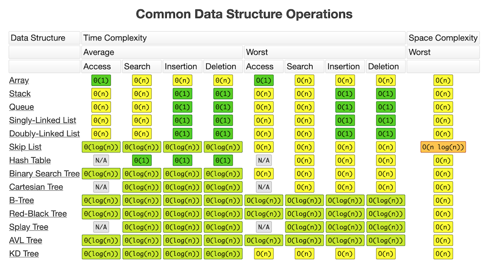
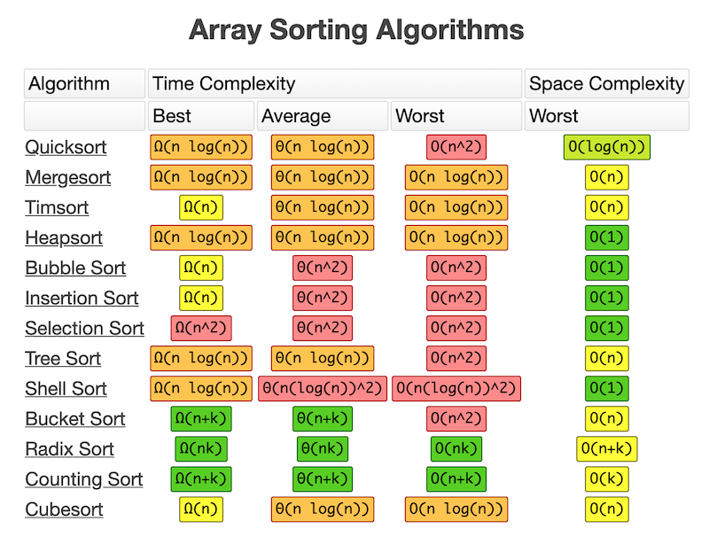
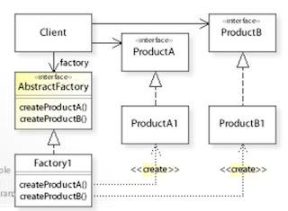
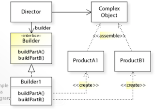
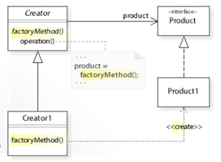
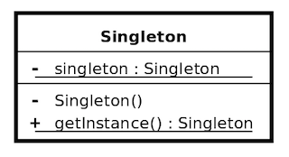
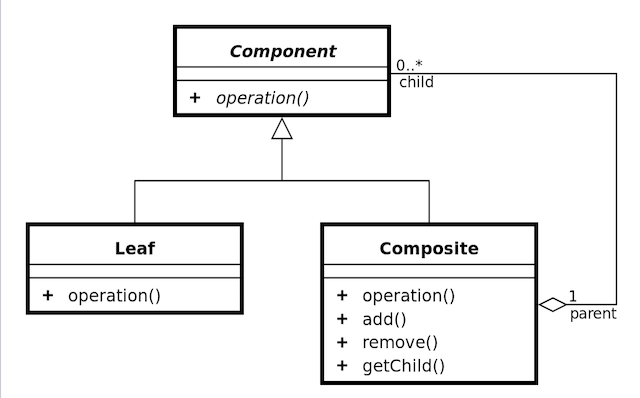
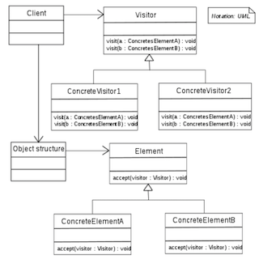
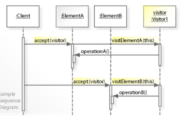

# Software Design Reference

Remaining:
* [design patterns](#design-patterns)

#### Table of contents
* [Software Design](#software-design)
    * [Design Concepts](#design-concepts)
    * [Design Principles](#design-principles)
    * [Modeling Behavior](#modeling-behavior)
    * [Design Reviews](#design-reviews)
    * [Big-O](#big-o)
* [Design Patterns](#design-patterns)
    * [Creational Patterns](#creational-patterns)
        * [Abstract Factory](#abstract-factory)
        * [Builder](#builder)
        * [Dependency Injection](#dependency-injection)
        * [Factory Method](#factory-method)
        * [Lazy Initialization](#Lazy-Initialization)
        * [Multiton](#multiton)
        * [Object Pool](#object-pool)
        * [Prototype](#prototype)
        * [RAII](#RAII)
        * [Singleton](#singleton)
    * [Structural Patterns](#structural-patterns)
        * [Adapter](#adapter)
        * [Bridge](#bridge)
        * [Composite](#composite)
        * [Decorator](#decorator)
        * [Delegation](#delegation)
        * [Facade](#facade)
        * [Flyweight](#flyweight)
        * [Front Controller](#front-controller)
        * [Marker Interface](#marker-interface)
        * [Module](#module)
        * [Proxy](#proxy)
        * [Twin](#twin)
    * [Behavioral Patterns](#behavioral-patterns)
        * [Chain of responsibility](#chain-of-responsibility)
        * [Command](#command)
        * [Interpreter](#interpreter)
        * [Iterator](#iterator)
        * [Mediator](#mediator)
        * [Memento](#memento)
        * [Null Object](#null-object)
        * [Observer](#observer)
        * [Servant](#servant)
        * [Specification](#specification)
        * [State](#state)
        * [Strategy](#strategy)
        * [Template Method](#template-method)
        * [Visitor](#visitor)
    * [Functional Patterns](#functional-patterns)
        * [Closure](#closure)
        * [Currying](#currying)
        * [Function composition](#function-composition)
        * [Functor](#functor)
        * [Monad](#monad)
        * [Generator](#generator)
    * [Concurrency Patterns](#concurrency-patterns)
        * [Active object](#active-object)
        * [Actor](#actor)
        * [Balking](#balking)
        * [Barrier](#barrier)
        * [Binding properties](#binding-properties)
        * [Coroutine](#coroutine)
        * [Compute kernel](#compute-kernel)
        * [Double-checked locking](#double-checked-locking)
        * [Event Based Asynchronous](#event-based-asynchronous)
        * [Fiber](#fiber)
        * [Futex](#futex)
        * [Futures and promises](#Futures-and-promises)
        * [Guarded suspension](#Guarded-suspension)
        * [Immutable object](#immutable-object)
        * [Join](#join)
        * [Lock](#lock)
        * [Messaging](#messaging)
        * [Monitor](#monitor)
        * [Nuclear](#nuclear)
        * [Proactor](#proactor)
        * [Reactor](#reactor)
        * [Read Write Lock](#read-write-lock)
        * [Scheduler](#scheduler)
        * [Thread Pool](#thread-pool)
        * [Thread-Local Storage](#thread-local-storage)

&nbsp;
# Software Design
__Software Design__ is the process of implementing a program while adhering to functional and non-functional requirements.

<u>Phases</u>:
* __Architectural Design__ - identifying and assigning responsibilities based on aspects of programs behavior
* __Detail Design__ - specifying the behavior of each component within the system

<u>Aspects</u>:
* __Method__ - steps taken to solve a problem
* __Representation__ - how different building blocks are represented
* __Validation__ - checking if the design meets requirements and is optimal. Should be done by independent validators

<u>Objectives</u>:
* ascertain system requirements
* blueprint for development process
* guide tasks like testing, deployment, integration, design
* consider tradeoffs

## Design Concepts

### Pillars of Design
* __Coupling__ - how strongly two components rely on each-other
* __Cohesion__ - the extent to which a single component has a single purpose
* __Orthogonality__ - extent to which the systems features can be used in various environments
* __Information Hiding__ - determine what is needed for the internal workings of a component and what needs to be exposed for external consumption.

### Design Types
* __Top down__ - treating the problem as a whole, then dividing it into atomic parts through abstraction and decomposition.
* __Bottom up__ - focuses on the atomic parts and then combines them into a whole.
* __Role Based__ - focusing on the use cases and building a collaboration diagram out of the different use cases, finally translating them into components and their connections. 

### Abstraction Mechanisms
* __Declarative__ - specify what needs to be solved while abstracting away details of how it will be solved
* __Aggregation__ - group data while abstracting away how its grouped
* __Generalization__ - abstract away special/edge cases
* __Parameterization__ - pass dependencies as arguments over making them itegral parts of a component

### Invariant Maintenance Strategies
* __Aggregated Responsiblity__ - a component is responsible for maintaining an invariant even if it requires usage of other components
* __Distributed Responsibility__ -  several components are responsible for maintaining an invariant
* __Mediated Responsiblity__ - one entity per invariant - the mediator, knows everything about participants of an invariant and is reponsible solely for maintaining it

## Design Principles
An informal piece of advice about the structure of a design.

__Abstract System Services__\
Components related to security, communications, logging, profiling or configuration should be abstracted to seperate components - do not mix them with business logic.

Consequences:
* `[+]` readability
* `[+]` maintainability
* `[+]` loose coupling

__Acyclic Dependency Principle__\
Dependencies between packages must not form cycles. Components should only depend on other components beneath it.

Consequences:
* `[+]` readability
* `[+]` maintainability

__Bad Smells__\
'Bad smells' are code situations that are suggestive of design problems. These problems should be resolved during the implementation phase.

Examples:
* duplicate code
* too many comments
* long classes

Consequences:
* `[+]` reduced rework in rapidly changing environments

__Common Closure Principle__\
Classes that change together should be released together.

Consequences:
* `[+]` versions can be easily maintained
* `[+]` straightforward contract for clients

__Dependency Inversion__\
High level modules should not depend on low level modules. Both should depend on abstractions. In other words: Layering should be one of abstraction, rather than one of control or data access. 

Consequences:
* `[+]` controlling principles are enforced at the highest level of architecture
* `[+]` higher reusability - modules depend on abtractions, not implementation details

__Design Heuristics__\
Situations that should be avoided during software design:
1. most __class methods__ should __use__ most __class data__ most of the time
    * if not split the class
1. check constraints in constructors
1. factor commonality of data, behavior and interface as high as possible in the inheritance hierarchy
1. inheritance should __only__ be used to model generalization
1. prefer composition over inheritance
1. do not override base class method with a NOP method
1. do not change state of an object without going through its public interface
1. do not create god classes - distribute system intelligence horizontally as uniformly as possible

Before implementation:
1. communication protocols between components should be known before implementation
1. define data formats and the layers they reside in - do not mix formats across layers
1. identify exceptions early on and handle them appropriately

Consequences:
* `[+]` reusability
* `[+]` error reduction
* `[+]` resolves common inheritance problems
* `[+]` maintains information hiding
* `[+]` enforces loose coupling

__Do Not Repeat Yourself__\
Functionalities should not be duplicated across the application. Repeated patterns should be replaced with abstractions or through data normalization.

Consequences:
* `[+]` maintainability
* `[+]` readability
* `[+]` reusability
* `[+]` loose coupling

__Hollywood Principle__\
Also called __Inversion of Control__ states that in a framework-client relationship calls should be made form the framework to the client classes.

> Don't call us, we'll call you

Consequences:
* `[+]` decouples execution from implementation
* `[+]` rely on contracts, not assumptions
* `[+]` prevents side effects when replacing frameworks
* `[-]` lower control on client side
* `[-]` loss of flexibility

__Intentionality__\
Design software in such a way that intent is manifest and localized in your code. The conceptual distance between the problem you are trying to solve and the code you are solving it with should be minimal.

This can be achieved by __cohesion__ and __naming conventions__.

Consequences:
* `[+]` traceability
* `[+]` validation
* `[+]` maintainability

__Interface Segregation Principle__\
Clients should depend on an interface to a part of a larger classes features.

Consequences:
* `[+]` reduced coupling - client only relies on functionality it actually needs
* `[+]` readability - interface clearly explains intent

__Law of Demeter__\
Or _Principle of Least Knowledge_ state that the number of different classes a method can refer to should be limited to: 
* enclosing objects properties
* enclosing objects components properties
* method parameters properties
* properties of objects instantiated in the method body

In short - each component should operate with no knowledge of the internal workings of other components.

Consequences:
* `[+]` low coupling
* `[-]` can require wrapper classes

__Liskov Substitution Principle__\
Subclass instances should satisfy parent-class constraints.

Consequences:
* `[+]` subclass obeys parent class invariants
* `[+]` subclass obeys parent class method contracts

__Naming Conventions__\
Define naming conventions in advance.

Consequences:
* `[+]` readability
* `[+]` maintainability

__Open Close Principle__\
A class should be open for extension but closed for modification. Once a class is released, enhancements should only be made to its subclasses.

Consequences:
* `[+]` resolves common inheritance problems like the fragile base class problem

__Reuse/Release Equivalency Principles__\
> The granule of reuse is the granule of release.

Each release of a package should be a highly cohesive code unit.

Consequences:
* `[+]` versions can be easily maintained
* `[+]` straightforward contract for clients

__Seperation Of Concerns__\
Each component should be responsible for a specific feature.

Consequences:
* `[+]` high cohesion
* `[+]` low coupling

__Single Choice Principle__\
If a program needs to support a set of alternatives they should be handled by a single subclass, with choice-specific subclass methods. Creating a module for each alternative reduces maintainability and readability.

Consequences:
* `[+]` readability
* `[+]` maintainability

__Single Responsibility Principle__\
Each component should have one and only one responsiblity. 

Consequences:
* `[+]` readability
* `[+]` maintainability
* `[+]` reusability
* `[+]` extendibility

__Stable Abstraction Principle__\
The more stable a package is the more abstract it should be. 

Consequences:
* `[+]` maintainability

__Stable Dependency Principle__\
No package should be dependent on packages that are more likely to change than it is. Depend in the direction of stability.

Consequences:
* `[+]` extendibility
* `[+]` maintainability

__Transparency__\
Provide interfaces that enable client code to be written without knowledge of extraneous details.

Consequences:
* `[+]` reusability
* `[+]` decoupling
* `[+]` maintainability
* `[-]` extra design
* `[-]` requires more tests

## Modeling Behavior
Pertains to:
* __State Space__ - set of all possible states. Increases multiplicatively
* __State Transition__ - the change of state as an answer to an event
* __Events__ - a single, instantenous, noticeable occurence that can either be:
    * __asynchronous__ - randomly occurring, spread out
    * __synchronous__ - come at periodic intervals in the sequence of execution

<u>__Event Types__</u>
* `signal` - an asynchronous notification
* `method call` - synchronous operation invocation
* `state change` - monitored changes in the state
* `time passage` - measurement of time reaching a value

<u>__Behavior Model Types__</u>
* __Combinatorial__ - only deals with state
* __Sequential__ - deals with state and linearly ordered events
* __Concurrent__ - lots of states and unconstrained events

<u>Transition Model</u>
To depict a transition from one state to another use:
* source state
* target state
* trigger event
* guard
* action
* forks and joins

<u>__Behavior Model Tools__</u>
* __Decision Table__ - writing out different permutations of decisions pertaining to a system(matrix)
* __Decision Tree__ - a flow chart which represents what effect a sequence of decisions can produce(block diagram)
* __State Transition Table(STT)__ - a table writing out all possible states pertaining to a system(matrix)
* __State Transition Diagrams__ - a flow chart depicting how changes in state on a component level affect other components(block diagram)
* __State Chart__ - a diagram that models behavior under the assumption that there is a finite amount of state. Can model:
    * __Depth__ - hierarchy, modularity
    * __Concurrency__ - seperate threads working together
    * __Synchronization__ - coordinating seperate threads
        * __Broadcast Events__ - events that trigger other events
        * __Conditional Transitions__ - continuously monitored conditions that trigger an action when met
    * __Special Transitions__ - when the program enters/exit execution, actions(something that happens immediatly) and activities(something that takes time)
    * __Event parameters__ - events can accept parameters
    * __History States__ - logging mechanism that remembers history of state transition

__State Explosion Problem__ - a design problem pertaining to how the state space grows exponentially as new state variables are introduced.

## Design Reviews
Also called an inspection or walkthrough is a systematic reading of a software development artifact. The purpose is to find defects, check adherence to corporate or governmental standards. __Should not__ be used to educate staff, report or fix defects. 70 to 90% of defects are found through the review process, but reviews amount to 10-20% total cost of development

Reviews complement other verification techniques such as testing, proofs and static analysis.

Prior to reviews the organization should determine __issue types__ and __severity classification__. 

Example severity classification:
* minor rework
* conditional rework
* major rework

Reviews can pertain to:
* requirements documents
* specifications
* architectural designs
* detail designs
* new code
* fixes
* test plans
* documentation

Process:
1. __Planning__ - around 5 days before the review
    * select participants
    * schedule meeting
    * assign roles
    * specify artifact
    * distribute materials
1. __Preperation__ - participants study material individually, detect defects on their own
1. __Review__ - meeting that lasts no more than two hours
    * collect individually noticed defects
1. __Rework__ - artifacts author investigates raised issues and fixes or logs them
1. __Follow up__
    * author reports results to moderator
    * moderator confirms that fixes have been implemented
    * moderator collects review data(defects, participants, time spent)
    * review data should be recorded and saved
    * moderator suggests improvements to review process

Roles:
* __Moderator__
    * preparation
    * follow up
    * determine if participants are prepared
    * evaluate whether artifact is ready for review
    * runs the meeting
    * technically competent but not necessarily experts
* __Recorder__
    * records the issues and defects
    * proactively clarify raised issues
    * ask for clarification
    * makes use of __Recording Form__[location, artifact, description, type(predefined), severity(predefined)]
* __Reader__
    * leads participants through artifact
    * enforces thoroughness
    * impersonal pronouns(refer to artifact not its author)
* __Reviewers__[3-6]
    * raise the issues
    * issues should be raised by asking questions
    * should not explicitly suggest improvements(ask if author though about ...)

Review Structure:
1. introduce participants
1. statement of objectives(moderator)
1. evaulation of preparedness(moderator)
1. systematic review
1. recording of results
1. summarization(recorder)
1. determination of responsiblities

Review Styles:
* __Fagan Review__ - a review process structured as above
* __Pair Programming__ - review is performed synchronously with coding
* __Pass-around Review__ - conducted by email, participants react to alerts generated by the source code management system
* __Tool-assisted Review__ - source control management systems, differencers, static analysis tools(lint, code-check)

Guidelines:
* raise issues without causing an emotionally driven discussion
* do not use reviews for personnel evaluations
* managers should not attend review meetings
* dont allow non-participant observers
* author of artifact should not be moderator or recorder
* topics:
    * avoid discussions of style
    * avoid problem solving
    * avoid phrases that raise defensiveness(like "you")
* process:
    * should be formerly defined
    * spread out reviews across time
    * each type of review has own criteria for thoroughness
    * treat review as a go/no-go decision activity
    * reviewers should sign off on acceptability of artifact
* thoroughness is paramount
    * line by line coverage
    * visual element coverage
    * coverage of all use cases
    * checklist of common defect types
    * verification conditions(for example if loop always terminates under various conditions)
* __metrics__ - measure to see how effective the review is
    * review rate [(lines reviewed) / (per staff hour spent)]
    * defect rate [(defect detected) / (per staff hour spent)]
    * defect density [(defects) / (lines of artifact)]
    * process yield [comparison of review deteced defects to total defects]

## Measuring Complexity
Sources:
* [wikipedia](https://en.wikipedia.org/wiki/Complexity)
* [towardsdatascience.com](https://towardsdatascience.com/understanding-time-complexity-with-python-examples-2bda6e8158a7)
* [justic.abrah.ms](https://justin.abrah.ms/computer-science/how-to-calculate-big-o.html)

Calculating time and space complexity of programs is essential to designing software that optimally uses available resources such as RAM and CPU. 

Computational complexity is calculated by counting the number of elementary operations and determining how they grow as the input grows. Complexity is described using the `Big-O notation` or `asymptotic notation` which looks like `O(n)` where `n` is the number of elementary operations. we usually take the most costly operation during measurement.

When calculating complexity we deal with the worst case scenario. For example if a function indicates if an element in an array is equal to `10` we assume that it will have to go through all the elements in the array when assessing complexity.

We assume that input size tends to infinity which means we ignore smaller factors. For example if we are to check if an element in an array is equal to `10` or `20` we would need to perform 2 comparisons for each element meaning the complexity would be `O(2n)` but coefficients and constants become insignificant as the input size grows so it is treated as `O(n)` complexity.

Complexity usually falls into the following categories(from lowest to highest complexity):
|Name|Complexity|
|----|----------|
|Constant|`0(1)`|
|Logarithmic|`0(log n)`|
|Linear|`0(n)`|
|Quasilinear|`0(n log n)`|
|Quadratic|`0(n^2)`|
|Exponential|`0(2^n)`|
|Factorial|`0(n!)`|

`Constant Complexity` will always be the same irrespective of the size of input. Like getting the first element of a list.

`Logarithmic Complexity` usually involves reducing the size of the data incrementally without actually reading each element. A good example is a `binary search` algorithm which cuts the data in half and checks which half the searched element is in, repeating this until the element is identified. 

`Linear Complexity` is usually when an operation needs to be performed on each element of the input data. For example searching for an index of a specific element in an array, since if the element is not in the array it compares each element with the searched element.

`Quasilinear Complexity` is when an operation of logarithmic complexity needs to be performed on each element of the input data. A common example is the `merge sort` algorithm which breaks down a list into smaller and smaller sublists until each sublist consists of one element, then merges the sublists into larger and larger sublists finally resulting in a sorted list.

`Quadratic Complexity` is when an operation with linear complexity needs to be performed on each element in the input data. For example bubble sort, which sorts an array by comparing each element to every other element and restructuring the array based on the results.

`Exponential Complexity` is when complexity doubles for each additional input element. An example could be brute force approach to cracking a password by checking each possible combination. Another example is a recursive Fibonacci algorithm.

`Factorial Complexity` when complexity grows in a factorial way like generating all the possible permutations of `n` objects.

Nice cheatsheets for data structures and sorting algorithms:

&nbsp;
# Design Patterns
> A general reusable solution to a commonly occurring problem in software development.

Design patterns can be categorized into:
* __Creational Patterns__ - focus on object instantiation
* __Structural Patterns__ - focus on object composition
* __Behavioral Patterns__ - focus on communication between objects
* __Functional Patterns__ - focuses on subroutines
* __Concurrency Patterns__ - focuses on dealing with multiple threads of execution

Design Pattern disadvantages:
* extra complexity
* __object schizophrenia__ - or the __self problem__ refers to delegating certain operations to a group of objects. It is hard to assess which object in a group actually performed the operation.
* refactoring could be complicated if the wrong pattern was chosen
* obligation during development to properly document and convey that a certain pattern was used

Source: 
* [sourcemaking](https://sourcemaking.com/design_patterns)
    * they have excellent checklists which I blatently coppied
* [wikipedia](https://en.wikipedia.org/wiki/Architectural_pattern)

## Creational Patterns

### Abstract Factory
__Intent__:
* using an interface for creating families of related or dependent objects without specyfing their concrete classes
* instantiation without the use of the `new` operator

__Motivation__: encapsulating the construction of a __suite__ of products
 
__Applicability__: 
* portable applications that need to work in various environments
* composite classes that can make use of a wide variety of related objects

__Structure__:\

__Participants__:
* __Client__ - the application that uses the products
* __AbstractFactory__ - an common interface that defines a method for instantiating products
* __Factory__ - a class with methods that perform the actual instantiation of products. Implements the AbstractFactory interface
* __ProductInterface__ - a common interface that defines how the products are operated on
* __ProductClass__ - a variation of a product that can be instantiated by a factory

__Process__:
1. the Client refers to the AbstractFactory for creating objects
1. the Factory instantiates the Product
1. the Product is made available to the Client through a ProductInterface

__Check list__:
1. Decide if "platform independence" and creation services are the current source of pain.
1. Map out a matrix of "platforms" versus "products".
1. Define a factory interface that consists of a factory method per product.
1. Define a factory derived class for each platform that encapsulates all references to the new operator.
1. The client should retire all references to new, and use the factory methods to create the product objects.

__Consequences__:
* `[+]` portable solution - platform indepenedence
* `[+]` low coupling
* `[+]` encapsulation of `new` operation

__Collaboration__:
* `[+]` Singleton - lots of clients can make use of one abstract factory - limiting its instances can improve memory usage
* `[+]` Factory Method - start out with factory method and evolve into abstract factory if needed
* `[+]` Prototype
* `[-]` Facade - abstract factory can be an alternative to hide specific product classes

### Builder
__Intent__: 
* seperate construction of a complex object from its representation
* create a unified construction process for various representations
* parse a complex representation and create one of several targets

__Motivation__: 
* simplifying creation of a complex object
* unified process for creation of a complex object

__Applicability__:
* encapsulate creating and assembling parts of a complex object
* delegation of object creation

__Structure__:\

__Participants__:
* __Director__ - invokes builder services
* __BuilderInterface__ - a unified interface for various build classes
* __BuilderClass__ - responsible for instantiating a group of products
* __Product__ - a part of the complexObject
* __ComplexObject__ - an composite object that is built out of various products

__Process__:
* Director invokes Builder services
* Builder instantiates Products each time it is called
* Builder stores information on all intermediate state
* when the ComplexObject is assembled the Director retrieves it from the Builder 

__Check list__:
1. Decide if a common input and many possible representations (or outputs) is the problem at hand.
1. Encapsulate the parsing of the common input in a Reader class.
1. Design a standard protocol for creating all possible output representations. Capture the steps of this protocol in a Builder interface.
1. Define a Builder derived class for each target representation.
1. The client creates a Reader object and a Builder object, and registers the latter with the former.
1. The client asks the Reader to "construct".
1. The client asks the Builder to return the result.

__Consequences__:
* `[+]` encapsulates construction and representation
* `[+]` control over construction process
* `[+]` variable internal representation of product
* `[-]` overhead - seperate builder for each type of product
* `[-]` complexity - builder class needs to be immutable
* `[-]` difficult dependency injection

__Collaboration__:
* `[+]` Singleton - limit the number of builder objects
* `[+]` Composite - builder often builds composites
* `[+]` Factory Method - start out with factory method and evolve into builder if needed
* `[-]` Abstract Factory - builder focuses on returning an object once its complete while abstract factory returns it immediately

### Dependency Injection
__Intent__:

__Motivation__:

__Applicability__: 

__Structure__:\

__Participants__:

__Process__:

__Consequences__:
* `[+]` 
* `[-]`  

__Collaboration__:
* `[+]` 
* `[-]` 

### Factory Method
__Intent__: 
* defer instantiation to subclasses
* defines a virtual constructor

__Motivation__:
* the `new` operator is considered harmful
* creating an object in a way where subclasses can redefine which class to instantiate

__Applicability__: 
* define a seperate operation for creating an object
* creating an object by calling a method(not constructor)

__Structure__:\

__Participants__:
* __Creator__ - requires a Product instance
* __Subclass__ - responsible for instantiating a Product instance
* __Product__ - product that is used by the Creator
* __ProductInterface__ - an interface through which available Product operations are defined

__Process__:
* Creator requires a Product
* Create refers to a seperate factoryMethod() to create the Product
* A Subclass invokes the factoryMethod() and instantiates a Product
* Creator makes use of the Product through a ProductInterface

__Check list__:
1. If you have an inheritance hierarchy that exercises polymorphism, consider adding a polymorphic creation capability by defining a static factory method in the base class.
1. Design the arguments to the factory method. What qualities or characteristics are necessary and sufficient to identify the correct derived class to instantiate?
1. Consider designing an internal "object pool" that will allow objects to be reused instead of created from scratch.
1. Consider making all constructors private or protected.

__Consequences__:
* `[+]` flexibility - can easily implement object pools, can return various types of objects
* `[+]` reusability
* `[+]` memory - can recycle objects
* `[+]` decoupling - object creation

__Collaboration__:
* `[+]` Abstract Factory - often implemented with Factory Methods
* `[+]` Prototype - often implemented with Factory Methods
* `[+]` Builder - often implemented with Factory Methods
* `[-]` Prototype - creation through delegation, where Factory Methods create through inheritance

### Lazy Initialization
__Intent__:

__Motivation__:

__Applicability__: 

__Structure__:\

__Participants__:

__Process__:

__Consequences__:
* `[+]` 
* `[-]` 

__Collaboration__:
* `[+]` 
* `[-]` 

### Multiton
__Intent__:

__Motivation__:

__Applicability__: 

__Structure__:\

__Participants__:

__Process__:

__Consequences__:
* `[+]`  
* `[-]` 

__Collaboration__:
* `[+]` 
* `[-]` 

### Object Pool
__Intent__:
* 

__Motivation__:

__Applicability__: 

__Structure__:\

__Participants__:

__Process__:

__Check list__:
1. Create ObjectPool class with private array of Objects inside
1. Create acquire and release methods in ObjectPool class
1. Make sure that your ObjectPool is Singleton

__Consequences__:
* `[+]`  
* `[-]`  

__Collaboration__:
* `[+]` Singleton - the ObjectPool needs be a singleton
* `[+]` Factory Method - can be used to encapsulate creation of objects in an Object Pool

### Prototype
__Intent__:

__Motivation__:

__Applicability__: 

__Structure__:\

__Participants__:

__Process__:

__Consequences__:
* `[+]`
* `[-]` 

__Collaboration__:
* `[+]` 
* `[-]` 

### RAII
__Intent__:

__Motivation__:

__Applicability__: 

__Structure__:\

__Participants__:

__Process__:

__Consequences__:
* `[+]`  
* `[-]` 

__Collaboration__:
* `[+]` 
* `[-]` 

### Singleton
__Intent__: Make sure a class has only one instance. Provide a global reference to that instance.

__Motivation__: 
* when number of instances of a class should be restricted
* when we need to perform lazy allocation and initialization
* as an alternative to global variables

__Applicability__:
* must be only one instance of a class
* that instance must be accessible

__Structure__:\

__Participants__:
* __Singleton__ - a class that provides access to an instance of itself

__Process__: clients access the unique instance of a class through an accessor method

__Consequences__:
* `[+]` controlled access
* `[+]` reduced namespace
* `[+]` support for subclassing
* `[+]` can be modified to provide a fixed number of instances
* `[+]` both eager and lazy construction possible
* `[-]` introduces global state
* `[-]` restricts usage of class
* `[-]` complicated multithreaded operations on instance

__Collaboration__:
* `[+]` 
* `[-]` 

## Structural Patterns

### Adapter
__Intent__: 

__Motivation__: converts an interface to improve interoperability

__Applicability__: 

__Structure__:\

__Participants__:

__Process__:

__Consequences__:
* `[+]` 
* `[-]` 

__Collaboration__:
* `[+]` 
* `[-]` 

### Bridge
__Intent__:

__Motivation__: decouple abstraction and implementation

__Applicability__: 
* in languages that dont support interfaces

__Structure__:\

__Participants__:

__Process__:

__Consequences__:
* `[+]` 
* `[-]` 

__Collaboration__:
* `[+]` 
* `[-]` 

### Composite
__Intent__: Deals with organizing whole-parts relationships into tree structures. Allows treating individual objects and compositions of objects uniformly by creating a common interface for them.

__Motivation__: If there is no reason for differentiating between a leaf-node and a branch then they should be treated uniformly.

__Applicability__: 
* clients ignore difference between individual and composite objects
* when multiple objects are used in the same way
* for a lowest common denominator interface

__Structure__:\

__Participants__:
* __Client__ - represents all possible uses of the component interface
* __Component__ - an abstract interface through which the client communicates with the whole-part objects.
* __Leaf__ - individual object
* __Composite__ - composite object

__Process__: both composite and leaf objects implement a method defined by the component interface. The client iterates through them treating them as intances of the component interface.

__Consequences__:
* `[+]` simplification
* `[-]` security

### Decorator
__Intent__:

__Motivation__: attaching additional functionalities to an object dynamically

__Applicability__: 

__Structure__:\

__Participants__:

__Process__:

__Consequences__:
* `[+]` 
* `[-]` 

__Collaboration__:
* `[+]` 
* `[-]` 

### Delegation
__Intent__:

__Motivation__:

__Applicability__: 

__Structure__:\

__Participants__:

__Process__:

__Consequences__:
* `[+]` 
* `[-]` 

__Collaboration__:
* `[+]` 
* `[-]` 

### Facade
__Intent__:

__Motivation__: a higher level interface for a subsystem

__Applicability__:
* non OO legacy applications

__Structure__:\

__Participants__:

__Process__:

__Consequences__:
* `[+]` 
* `[-]` 

__Collaboration__:
* `[+]` 
* `[-]` 

### Flyweight
__Intent__:

__Motivation__: use sharing to support large numbers of fine-grained objects

__Applicability__: 

__Structure__:\

__Participants__:

__Process__:

__Consequences__:
* `[+]` 
* `[-]` 

__Collaboration__:
* `[+]` 
* `[-]` 

### Front Controller
__Intent__:

__Motivation__:

__Applicability__: 

__Structure__:\

__Participants__:

__Process__:

__Consequences__:
* `[+]` 
* `[-]` 

__Collaboration__:
* `[+]` 
* `[-]` 

### Marker Interface
__Intent__:

__Motivation__:

__Applicability__: 

__Structure__:\

__Participants__:

__Process__:

__Consequences__:
* `[+]` 
* `[-]` 

__Collaboration__:
* `[+]` 
* `[-]` 

### Module
__Intent__:

__Motivation__:

__Applicability__: 

__Structure__:\

__Participants__:

__Process__:

__Consequences__:
* `[+]` 
* `[-]` 

__Collaboration__:
* `[+]` 
* `[-]` 

### Proxy
__Intent__:

__Motivation__: control access to an object

__Applicability__: 

__Structure__:\

__Participants__:

__Process__:

__Consequences__:
* `[+]` 
* `[-]` 

__Collaboration__:
* `[+]` 
* `[-]` 

### Twin
__Intent__:

__Motivation__:

__Applicability__: 

__Structure__:\

__Participants__:

__Process__:

__Consequences__:
* `[+]` 
* `[-]` 

__Collaboration__:
* `[+]` 
* `[-]` 

## Behavioral Patterns

### Chain of responsibility
__Intent__: 

__Motivation__: seperate a request from a handler

__Applicability__: 
* where a request is handled by multiple handlers

__Structure__:\

__Participants__:

__Process__:

__Consequences__:
* `[+]` 
* `[-]` 

__Collaboration__:
* `[+]` 
* `[-]` 

### Command
__Intent__:

__Motivation__: turns a request into an object

__Applicability__: 
* logging
* rollback functionality

__Structure__:\

__Participants__:

__Process__:

__Consequences__:
* `[+]` 
* `[-]` 

__Collaboration__:
* `[+]` 
* `[-]` 

### Interpreter
__Intent__:

__Motivation__: represent a grammar and interpret its instances

__Applicability__: 

__Structure__:\

__Participants__:

__Process__:

__Consequences__:
* `[+]` 
* `[-]` 

__Collaboration__:
* `[+]` 
* `[-]` 

### Iterator
__Intent__:

__Motivation__: access elements of a collection without exposing the underlying representation

__Applicability__: 

__Structure__:\

__Participants__:

__Process__:

__Consequences__:
* `[+]` 
* `[-]` 

__Collaboration__:
* `[+]` 
* `[-]` 

### Mediator
__Intent__:

__Motivation__: encapsulating object interactions

__Applicability__: 

__Structure__:\

__Participants__:

__Process__:

__Consequences__:
* `[+]` 
* `[-]` 

__Collaboration__:
* `[+]` 
* `[-]` 

### Memento
__Intent__:

__Motivation__: capture objects internal state for later usage

__Applicability__:
* rollback functionality

__Structure__:\

__Participants__:

__Process__:

__Consequences__:
* `[+]` 
* `[-]` 

__Collaboration__:
* `[+]` 
* `[-]` 

### Null Object
__Intent__:

__Motivation__:

__Applicability__: 

__Structure__:\

__Participants__:

__Process__:

__Consequences__:
* `[+]` 
* `[-]` 

__Collaboration__:
* `[+]` 
* `[-]` 

### Observer
__Intent__:

__Motivation__: notify dependents when an object changes

__Applicability__: 

__Structure__:\

__Participants__:

__Process__:

__Consequences__:
* `[+]` 
* `[-]` 

__Collaboration__:
* `[+]` 
* `[-]` 

### Servant
__Intent__:

__Motivation__: 

__Applicability__: 

__Structure__:\

__Participants__:

__Process__:

__Consequences__:
* `[+]` 
* `[-]` 

__Collaboration__:
* `[+]` 
* `[-]` 

### Specification
__Intent__:

__Motivation__:

__Applicability__: 

__Structure__:\

__Participants__:

__Process__:

__Consequences__:
* `[+]` 
* `[-]` 

__Collaboration__:
* `[+]` 
* `[-]` 

### State
__Intent__:

__Motivation__: have an object that tracks state

__Applicability__: 

__Structure__:\

__Participants__:

__Process__:

__Consequences__:
* `[+]` 
* `[-]` 

__Collaboration__:
* `[+]` 
* `[-]` 

### Strategy
__Intent__:

__Motivation__: family of algorithms with the same purpose and interface

__Applicability__: 

__Structure__:\

__Participants__:

__Process__:

__Consequences__:
* `[+]` 
* `[-]` 

__Collaboration__:
* `[+]` 
* `[-]` 

### Template Method
__Intent__:

__Motivation__: skeleton of algorithm with hooks for specific steps

__Applicability__: 

__Structure__:\

__Participants__:

__Process__:

__Consequences__:
* `[+]` 
* `[-]` 

__Collaboration__:
* `[+]` 
* `[-]` 

### Visitor
__Intent__: vary operations performed on a composite structure without modifying the structure itself

__Motivation__: decoupling structural elements of a composite structure from the operations performed on them

__Applicability__:
* perform various categories of operations on elements of a complex structure
* simplify code by factoring out operations
* decouple data structures from operations

__Structure__:\

__Participants__:
* __Client__ - represents all possible uses of the visitor interface
* __Visitor__ - an abstract class declaring various operations that can be performed on structural elements
* __ConcreteVisitor__ - a specialized operation that can be performed on structural elements; may store state
* __Element__ - an abstract class for various structural elements that declares an `Accept` operation that takes a Visitor as an argument
* __ConcreteElement__ - a structural element that implements the `Accept` method
* __Object Structure__ - the composite structure that enumerates elements

__Behavior__:\

__Process__:
* Client creates instances of ConcreteVisitor
* Client traverses ObjectStructure
* visited ConcreteElements call the `Visit` operation with self as argument

__Consequences__:
* `[+]` adding new operations is simplified
* `[+]` visitors can accumulate state(like collecting statistics)
* `[-]` adding new element types is complicated(would need to be adjusted to visitor model)
* `[-]` violates encapsulation by seperating operations from elements structure
* `[-]` __double dispatch__, what operation is performed depends both on the Element and the Visitor
* `[?]` what is responsible for tree traversal of the Object Structure(an iterator, visitor or the object itself)?

__Collaboration__:
* `[+]` 
* `[-]` 

## Functional Patterns

### Closure
__Intent__:

__Motivation__:

__Applicability__: 

__Structure__:\

__Participants__:

__Process__:

__Consequences__:
* `[+]`  
* `[-]`  

__Collaboration__:
* `[+]` 
* `[-]` 

### Currying
__Intent__:

__Motivation__:

__Applicability__: 

__Structure__:\

__Participants__:

__Process__:

__Consequences__:
* `[+]` 
* `[-]` 

__Collaboration__:
* `[+]` 
* `[-]` 

### Function composition
__Intent__:

__Motivation__:

__Applicability__: 

__Structure__:\

__Participants__:

__Process__:

__Consequences__:
* `[+]` 
* `[-]` 

__Collaboration__:
* `[+]` 
* `[-]` 

### Functor
__Intent__:

__Motivation__:

__Applicability__: 

__Structure__:\

__Participants__:

__Process__:

__Consequences__:
* `[+]` 
* `[-]` 

__Collaboration__:
* `[+]` 
* `[-]` 

### Monad
__Intent__:

__Motivation__:

__Applicability__: 

__Structure__:\

__Participants__:

__Process__:

__Consequences__:
* `[+]` 
* `[-]` 

__Collaboration__:
* `[+]` 
* `[-]` 

### Generator
__Intent__:

__Motivation__:

__Applicability__: 

__Structure__:\

__Participants__:

__Process__:

__Consequences__:
* `[+]` 
* `[-]` 

__Collaboration__:
* `[+]` 
* `[-]` 

## Concurrency Patterns

### Active object
__Intent__:

__Motivation__:

__Applicability__: 

__Structure__:\

__Participants__:

__Process__:

__Consequences__:
* `[+]` 
* `[-]` 

__Collaboration__:
* `[+]` 
* `[-]` 

### Actor
__Intent__:

__Motivation__:

__Applicability__: 

__Structure__:\

__Participants__:

__Process__:

__Consequences__:
* `[+]` 
* `[-]` 

__Collaboration__:
* `[+]` 
* `[-]` 

### Balking
__Intent__:

__Motivation__:

__Applicability__: 

__Structure__:\

__Participants__:

__Process__:

__Consequences__:
* `[+]` 
* `[-]` 

__Collaboration__:
* `[+]` 
* `[-]` 

### Barrier
__Intent__:

__Motivation__:

__Applicability__: 

__Structure__:\

__Participants__:

__Process__:

__Consequences__:
* `[+]` 
* `[-]` 

__Collaboration__:
* `[+]` 
* `[-]` 

### Binding properties
__Intent__:

__Motivation__:

__Applicability__: 

__Structure__:\

__Participants__:

__Process__:

__Consequences__:
* `[+]` 
* `[-]` 

__Collaboration__:
* `[+]` 
* `[-]` 

### Coroutine
__Intent__:

__Motivation__:

__Applicability__: 

__Structure__:\

__Participants__:

__Process__:

__Consequences__:
* `[+]` 
* `[-]` 

__Collaboration__:
* `[+]` 
* `[-]` 

### Compute kernel
__Intent__:

__Motivation__:

__Applicability__: 

__Structure__:\

__Participants__:

__Process__:

__Consequences__:
* `[+]` 
* `[-]` 

__Collaboration__:
* `[+]` 
* `[-]` 

### Double-checked locking
__Intent__:

__Motivation__:

__Applicability__: 

__Structure__:\

__Participants__:

__Process__:

__Consequences__:
* `[+]` 
* `[-]` 

__Collaboration__:
* `[+]` 
* `[-]` 

### Event Based Asynchronous
__Intent__:

__Motivation__:

__Applicability__: 

__Structure__:\

__Participants__:

__Process__:

__Consequences__:
* `[+]` 
* `[-]` 

__Collaboration__:
* `[+]` 
* `[-]` 

### Fiber
__Intent__:

__Motivation__:

__Applicability__: 

__Structure__:\

__Participants__:

__Process__:

__Consequences__:
* `[+]` 
* `[-]` 

__Collaboration__:
* `[+]` 
* `[-]` 

### Futex
__Intent__:

__Motivation__:

__Applicability__: 

__Structure__:\

__Participants__:

__Process__:

__Consequences__:
* `[+]` 
* `[-]` 

__Collaboration__:
* `[+]` 
* `[-]` 

### Futures and promises
__Intent__:

__Motivation__:

__Applicability__: 

__Structure__:\

__Participants__:

__Process__:

__Consequences__:
* `[+]` 
* `[-]` 

__Collaboration__:
* `[+]` 
* `[-]` 

### Guarded suspension
__Intent__:

__Motivation__:

__Applicability__: 

__Structure__:\

__Participants__:

__Process__:

__Consequences__:
* `[+]` 
* `[-]` 

__Collaboration__:
* `[+]` 
* `[-]` 

### Immutable object
__Intent__:

__Motivation__:

__Applicability__: 

__Structure__:\

__Participants__:

__Process__:

__Consequences__:
* `[+]` 
* `[-]` 

__Collaboration__:
* `[+]` 
* `[-]` 

### Join
__Intent__:

__Motivation__:

__Applicability__: 

__Structure__:\

__Participants__:

__Process__:

__Consequences__:
* `[+]` 
* `[-]` 

__Collaboration__:
* `[+]` 
* `[-]` 

### Lock
__Intent__:

__Motivation__:

__Applicability__: 

__Structure__:\

__Participants__:

__Process__:

__Consequences__:
* `[+]` 
* `[-]` 

__Collaboration__:
* `[+]` 
* `[-]` 

### Messaging
__Intent__:

__Motivation__:

__Applicability__: 

__Structure__:\

__Participants__:

__Process__:

__Consequences__:
* `[+]` 
* `[-]` 

__Collaboration__:
* `[+]` 
* `[-]` 

### Monitor
__Intent__:

__Motivation__:

__Applicability__: 

__Structure__:\

__Participants__:

__Process__:

__Consequences__:
* `[+]` 
* `[-]` 

__Collaboration__:
* `[+]` 
* `[-]` 

### Nuclear
__Intent__:

__Motivation__:

__Applicability__: 

__Structure__:\

__Participants__:

__Process__:

__Consequences__:
* `[+]` 
* `[-]` 

__Collaboration__:
* `[+]` 
* `[-]` 

### Proactor
__Intent__:

__Motivation__:

__Applicability__: 

__Structure__:\

__Participants__:

__Process__:

__Consequences__:
* `[+]` 
* `[-]` 

__Collaboration__:
* `[+]` 
* `[-]` 

### Reactor
__Intent__:

__Motivation__:

__Applicability__: 

__Structure__:\

__Participants__:

__Process__:

__Consequences__:
* `[+]` 
* `[-]` 

__Collaboration__:
* `[+]` 
* `[-]` 

### Read Write Lock
__Intent__:

__Motivation__:

__Applicability__: 

__Structure__:\

__Participants__:

__Process__:

__Consequences__:
* `[+]` 
* `[-]` 

__Collaboration__:
* `[+]` 
* `[-]` 

### Scheduler
__Intent__:

__Motivation__:

__Applicability__: 

__Structure__:\

__Participants__:

__Process__:

__Consequences__:
* `[+]` 
* `[-]` 

__Collaboration__:
* `[+]` 
* `[-]` 

### Thread Pool
__Intent__:

__Motivation__:

__Applicability__: 

__Structure__:\

__Participants__:

__Process__:

__Consequences__:
* `[+]` 
* `[-]` 

__Collaboration__:
* `[+]` 
* `[-]` 

### Thread-Local Storage
__Intent__:

__Motivation__:

__Applicability__: 

__Structure__:\

__Participants__:

__Process__:

__Consequences__:
* `[+]` 
* `[-]` 

__Collaboration__:
* `[+]` 
* `[-]` 
