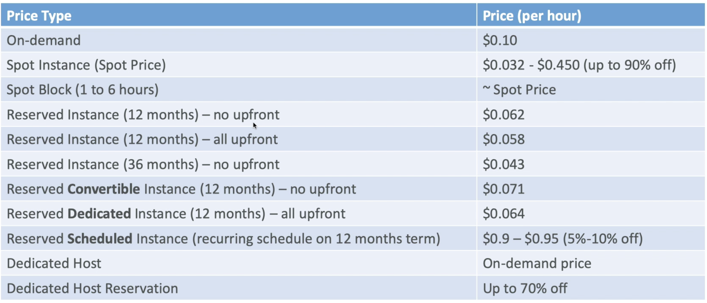

# AWS Guide

Amazon Web Services(AWS) is a leading cloud provider, meaning they provide you with services and servers that can scale easily and on demand.

Source:
* [udemy - aws-certified-solutions-architect-associate](https://www.udemy.com/course/aws-certified-solutions-architect-associate-saa-c02/)

TODO:
* EC2 service panel overview

#### Table of contents

* [General](#general)
    * [Glossary](#Glossary)
    * [Useful Links](#Useful-Links)
    * [Account](#Account)
* [IAM](#IAM)
    * [IAM Federation](#IAM-Federation)
* [EC2](#EC2)
    * [Launch and Connect](#Launch-and-Connect)
    * [EC2 Example CLI](#EC2-Example-CLI)
    * [EC2 User Data](#EC2-User-Data)
    * [Instance Launch Types](#Instance-Launch-Types)
        * [On Demand Instances](#On-Demand-Instances)
        * [Reserved](#Reserved)
        * [Spot Instances](#Spot-Instances)
        * [Dedicated Instances](#Dedicated-Instances)
        * [Dedicated Hosts](#Dedicated-Hosts)
    * [Instance Types](#Instance-Types)
    * [Images](#images)
        * [AMIs](#AMIs)
    * [Elastic Block Store](#Elastic-Block-Store)
    * [Network & Security](#Network-&-Security)
        * [Security Groups](#Security-Groups)
        * [Elastic IPs](#Elastic-IPs)
        * [Placement Groups](#Placement-Groups)

&nbsp;
# General

## Glossary
* **AWS Region** - a geographic area which can contain multiple availability zones
* **Availability Zone(AZ)** - a physical data center in a region, separate from other data centers. 
    * named according to the following convention: `<country_code>-<region>-<availability_zone>`.
    * example: eastern United States = `us-east-1a`
    * AWS Consoles are region scoped(apart from IAM and S3)
    * a map of AWS regions: https://aws.amazon.com/about-aws/global-infrastructure/

## Useful Links
* [AWS Regions Map](https://aws.amazon.com/about-aws/global-infrastructure/)
* [Amazon Marketplace](https://aws.amazon.com/marketplace)
* [EC2 Instance Comparison](https://www.ec2instances.info/)

## Account
Account services and configurations:
* **Billing Dashboard**
    * *Budgets* - budgets are ways of controlling your spending. You can setup a maximum amount you want to spend over a period of time.
    * *Bills* - a list of all costs and descriptions


&nbsp;
# IAM
*Identity and Access Management* is how AWS security is handled.
* entities include: 
    * Users - a physical person
    * Groups - users grouped by functions(devops, admin) or teams(engineering, design)
    * Roles - a machine. Roles are used internally by AWS
    * Policies - defines permissions
        * written in `JSON`
* users and groups are assigned policies
* all AWS services interact with IAM
* IAM is a global service(region agnostic)
* has prebuilt policies(templates you can use)
* can enable MFA(multi-factor-authentication)
* **IMPORTANT**: give minimum amount of permissions required to perform job(least privilege principal)

TIPS:
* 1 User per physical person
* 1 Role per application
* never share credentials
* never write IAM credentials in code and never commit them
* only use root account for initial setup
* never use root IAM credentials

## IAM Federation
A IAM solution for enterprises
* allows integration of own repository of users
* users can login using company credentials
* uses SAML standard

&nbsp;
# EC2
Scalable computing capacity. Mainly consists of:
* **EC2** - virtual machines on demand
* **EBS** - storing data on virtual drives
* **ELB** - load balancing
* **ASG** - auto-scaling services through groups

Service Panel Overview:
* **EC2 Dashboard** - overview of configured resources, AZ and service statuses, launch new instance
* **Events**
* **Tags**
* **Reports**
* **Limits**
* **Instances**
    * **Instances** - overview of all instances along with:
        * perform start/stop/delete operations
        * overview of configurations
        * check assigned ip
        * connect to instance
    * **Instance Types**
    * **Launch Templates**
    * **Spot Requests** - overview, configure, start and control existing spot requests. Check historical spot prices
    * **Savings Plan**
    * **Reserved Instances** - overview, actions and purchase of reserved instances
    * **Dedicated Hosts** - configure and purchase dedicated hosts
    * **Scheduled Reserved Instances** - overview, setup schedule, book available schedules
    * **Capacity Reservations** - 
* **Images**
    * **AMIs** - manage available AMIs, configure specific AMIs, launch instance from AMI
    * **Bundle Tasks** - 
* **Elastic Block Store**
    * **Volumes** - 
    * **Snapshots** - 
    * **Lifecycle Manager** - 
* **Network & Security** -
    * **Security Groups** - list, create and edit security groups
    * **Elastic IPs** - manage Elastic IPs assigned to the account
    * **Placement Groups** -
    * **Key Pairs** -
    * **Network Interfaces** - 
* **Load Balancing** -
    * **Load Balancers** - 
    * **Target Groups** -
* **Auto Scaling** - 
    * **Launch Configurations** - 
    * **Auto Scaling Groups** - 

TIPS:
* you only pay for compute components if they are in the `running` state

## Launch and Connect
Launch Instance from Dashboard, configure the following:
* **Operating System** - Amazon Linux 2 is recommended because its the latest native OS available
* **Hardware** - choose an instance type
* **Configuration Details**
    * **Basic** - instance launch type, IAM role, IP settings
    * **Advanced**
        * *User data* - bootstrapping script
* **Storage**
* **Tags**
    * key-value pair for later reference
    * *Name* - visible in UI
* **Security Group**
    * can limit SSH access to specific IP addresses
    * control inbound and outbound traffic
* name, download key pair for **SSH** and restrict the `.pem` file permissions: `chmod 0400 EC2Test.pem`
* SSH into the instance: `ssh -i <downloaded.pem> ec2-user@<instance-public-ip>`

**EC2 Instance Connect** - connect through browser based SSH
* only available for Amazon Linux 2
* access through `EC2 Service -> Instances -> Instances -> Connect

## EC2 Example CLI
Some of these only work on Amazon Linux 2
``` shell
# elevate rights on machine
sudo su
# update machine
#   -y -> without prompting the user
yum update -y
# install an Apache HTTP server
yum install -y httpd.x86_64
# start the http server
systemctl start httpd.service
# set to start after reboot
systemctl enable httpd.service
# check if service is running on a specific port
curl localhost:80
```

## EC2 User Data
A script that configures bootstrapping for an EC2 instance.
* **bootstrapping** - preparation scripts that are launched once on each instance startup
* used to:
    * install software
    * install updates
    * download common files form the internet
* runs with the root user
* can be configured when launching an instance(Advanced Details)

``` shell
#!/bin/bash

# no need to sudo su - this is done by default
yum update -y
yum install -y httpd.x86_64
systemctl start httpd.service
systemctl enable httpd.service
echo "Hello World from ${hostname -f}" > /var/www/html/index.html
```

## Instance Launch Types
Determines HOW hardware is assigned to the instance. Selecting the right launch type is crucial to meeting nonfunctional requirements(price, stability, performance etc.). Do not confuse with `instance type` which determines WHAT hardware is assigned to the instance.

Tips:
* a good combination is using:
    * reserved instances for baseline uses of application
    * on-demand & spot instances for peak uses of application



### On Demand Instances
Always available, hardware can be shared with other AWS customers.

Overview:
* *Pricing*
    * predictable
    * pay for usage(billing per second)
* *Recommended*
    * short and uninterrupted workload
    * unpredictable application behavior
* *Advantage*
    * guaranteed availability
    * no long-term commitment
    * no upfront cost
* *Disadvantage*
    * highest overall cost

### Reserved
Available for a preset amount of time. Different types include:
* **Reserved Instances** - specific hardware for a specific amount of time
    * *Pricing*
        * pay upfront
        * reserve specific instance type for 1-3 years
    * *Recommended*
        * steady state usage applications(database)
    * *Advantage*
        * up to 75% discount compared to On-demand
    * *Disadvantage*
        * long term commitment
* **Convertible Reserved Instances** - variable hardware for a specific amount of time
    * *Perks*
        * up to 54% discount compared to On-demand
        * can change instance type(hardware)
* **Scheduled Reserved Instances** - specific hardware for specific timeframes within a longer period of time(2:00 - 6:00 pm every Thursday)

### Spot Instances
Cheap leftover hardware.

Overview:
* *Pricing*
    * spot price - a benchmark price dependent on demand and availability of AWS spot instances. Changes hourly
    * max spot price - a user defined maximum price he is willing to pay for a spot instance
    * instance is kept as long as `current spot price < max spot price`
    * if `current spot price > max spot price` you have a 2 min grace period where you can choose to `terminate` or `stop` the spot instance
* *Recommended*
    * workloads resilient to failure(can retry):
        * batch jobs
        * data analysis
        * image processing
* *Advantages*
    * cheap - up to 90% discount compared to On-demand - most cost efficient instance type
* *Disadvantages*
    * no guaranteed availability - can lose access if max price is below current spot price

Additional:
* **Spot Block** - allows blocking the instance from being reclaimed for a preset amount of time(1-6h)
    * incurs additional costs
    * in very rare situations can still be reclaimed within the blocked period
* **Spot Request** - the specifics of requesting a spot instance include:
    * maximum price
    * desired number of instances
    * launch specification
    * how long the request is valid
    * **Request types**:
        * *one-time* - after request is fulfilled it is deleted
        * *persistent* - the request is renewed upon instance termination(as long as the request is valid)
    * **Request states**:
        * open
        * active
        * disabled
        * closed
        * cancelled
        * failed
    * can only cancel request in `open`, `active`, `disabled` state
    * canceling a spot request will not terminate active instances
        * usually: to terminate persistent request first cancel spot request and then the associated instances
* **Spot Fleet** - define a set of spot instances and optional On-Demand Instances
    * the spot fleet attempts to meet target capacity with price constraints
    * great for cost reduction
    * **Launch Pool** - defines instance types, OS, Availability Zone
        * can have multiple assigned to spot fleet
        * spot fleet chooses an optimal launch pool
    * spot instance allocation strategies include:
        * **lowestPrice** - launches instances from pool with lowest price(cost optimization, short workload)
        * **diversified** - distributes instances across pools(availability, long workloads)
        * **capacityOptimized** - pool with optimal capacity for the number of instances
    * allows automatic requesting of spot instances with lowest price

Launch:
* Spot Fleet from `Instances > Spot Requests > Request Spot Instances`
* Spot Instance from `Instances > Launch Instance > ... > Configure Instance > Purchasing Option`

### Dedicated Instances
Always available, hardware can not be shared with other AWS customers

Overview:
* *Pricing*
    * billed per instance(depends on how many instances are placed on the hardware)
* *Recommended*
* *Advantages*
    * dedicated hardware(shared across instances on same account)
* *Disadvantages*
    * no control over instance placement

### Dedicated Hosts
An entire dedicated physical server where you can allocate instances

Overview:
* *Pricing*
    * allocated for a 3-year period
    * most expensive
* *Recommended*
    * complicated licensing models(for example license price depends on number of used cores)
    * companies that have strong regulatory or compliance needs
* *Advantages*
    * full control over EC2 instance placement
    * visibility into physical core and underlying sockets of the hardware
* *Disadvantages*
    * price
    * long term commitment


## Instance Types
Determines WHAT hardware is assigned to the instance. Most popular types:
* **R** - for RAM intensive applications(IMDB, in memory caches)
* **C** - for CPU intensive applications(compute, big data)
* **M** - balanced applications(web app)
* **I** - for performant local I/O operations(databases)
* **G** - for GPU intensive applications(video rendering/machine learning)
* **T2/T3 burstable** - good capacity overall, very high capacity for a limited amount of time(spikes)
    * very high capacity uses **burst credits**
    * very low capacity if burst credits exhausted
    * credits are regained over time when machine is not bursting
    * the bigger the instance the more cpu credits and faster credit replenishment
* **T2/T3 unlimited** - high capacity without limits
    * unlimited burst credit balance
    * pay extra if over credit balance, but no loss in capacity

Tips:
* use www.ec2instances.info to determine which instance type you need

## Images
Base images that EC2 instances are built on. Can be customized at runtime through user data. Example include:
* Ubuntu
* AWS Linux
* Fedora
* Red Hat
* Windows
* much more

### AMIs
A custom user defined base image that can be launched on Linux or Windows machines.

Advantages include:
* preinstalled packages
* faster boot time(no EC2 user data)
* machine comes configured with monitoring/security/enterprise software
* control of maintenance and updates of the image
* manage Active Directory Integration
* install app ahead of time
* using someone elses AMI(public AMI)
    * can rent public AMIs
    * usually optimized for specific tasks
    * plug-and-play(easy to run and configure)

Storage:
* AMIs, along with their backups live in Amazon S3(durable, cheap, resilient storage)
    * you get charged for the extra space
* alternatively they can be stored in an EBS snapshot as an EBS-backed AMI

Tips:
* are region specific
* AMIs may contain  malware!
* only use AMIs from a trusted source
* AMIs are private by default(locked to your account / region)
* AMIs can be made public, shared and purchased through [Amazon Marketplace](https://aws.amazon.com/marketplace)
* remove AMIs you don't use to reduce costs
* storing private AMIs is overall inexpensive
* you can create an image from an existing instance through: `Instances > {right-click target instance} > Image > Create Image`

**Cross Account AMI Copy** - sharing AMIs with another AWS account
* does not affect the AMI ownership
* but if you copy a shared AMI you are the owner in the target account
* to copy AMI you must be granted read permission(form the author) to the storage medium where the AMI is backed. Can be one of two:
    * EBS snapshot
    * S3 bucket
* AMI can be encrypted 
* limits:
    * can only copy encrypted AMI if encryption key was shared with you
    * when copying you must encrypt it with a key of your own(now you can register it as a new AMI)
    * cant copy AMI with associated **billingProduct** code(Windows AMI or Marketplace AMI)
        * as a workaround you can launch an instance with the proprietary AMI and then create a new AMI from a snapshot of that instance

## Elastic Block Store

## Network & Security
Configure networking for your EC2 instances.

### Security Groups
Control inbound and outbound traffic of EC2 Instances.
* a firewall on EC2 instances
* control:
    * access to ports
    * authorize ip ranges access to specific ports
    * control inbound traffic
    * control outbound traffic
* can reference:
    * IP address
    * CIDR block
    * other security group
* can connect to multiple instances
* an instance can have multiple security groups
* specific to a region/VPC combination
* lives outside of the EC2 instance

Tips:
* maintain one separate security group for ssh access
* a timeout is usually the result of a security group issue
* a refused connection is usually an application error - **not a security group issue** 
* by default all inbound is blocked, all outbound is authorized
* a security group can reference other security groups
    * especially important when configuring traffic between EC2 instances
    * if SG1 authorizes inbound traffic for SG2 then any EC2 instances with SG2 assigned is allowed inbound traffic for SG1

### Elastic IPs
Instances can be identified within a computer network by:
* **Public IP** - default, for access to WWW
    * can be identified on the internet
    * must be unique across WWW
    * can be easily geo-located
    * can change if an instance is restarted
* **Private IP** - default, for internal AWS network or VPN
    * can only be identified on private network
    * must be unique across the private network
    * connect to WWW using a combination of NAT devices and internet gateways(proxies)
    * limited to a specific range of IP addresses
* **Elastic IP** - optional
    * a static IPv4 IP address designed for dynamic cloud computing
    * can attach to one instance at a time
    * can rapidly remap address to another service! (for example on )
    * you can only have 5 Elastic IP in one account(can ask AWS for more)

Tips:
* avoid using Elastic IP
* Elastic IP often reflects poor architectural decisions
* alternatively:
    * use a random public IP and register a DNS name to it
    * use a Load Balancer(best AWS pattern)

### Placement Groups
Determine how instances are placed across the AWS Infrastructure.

Placement strategies:
* *Cluster* - group of instances with low latency: same rack, same AZ
    * high performance(10Gbps bandwidth between instances)
    * high risk(if hardware fails, all instances fail)
    * uses:
        * big data jobs that need to complete fast
        * low latency/high network throughput apps
* *Spread* - spreads instances across different isolated hardware: different within the same AZ
    * max 7 instances in spread group per AZ
    * low performance
    * low risk
* *Partition* - spreads instances across partitions(racks) within an AZ
    * spread but instances are not completely isolated
    * scales to 100s of instances per group
    * good for big data - Hadoop, Cassandra, Kafka

&nbsp;
# Setup Checklist

1. **IAM**
    * *Dashboard*: cover steps in initial security status
    * *Dashboard*: customize IAM link
