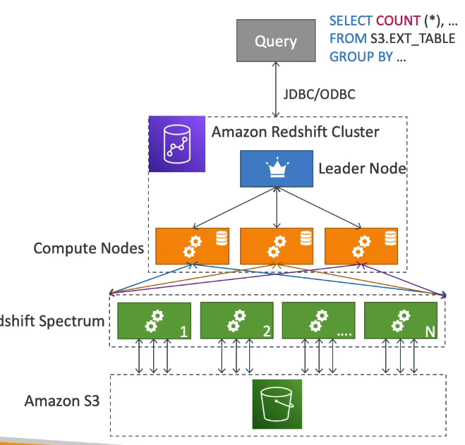

# AWS Certified Data Analytics Specialty

Amazon Web Services(AWS) is a leading cloud provider, meaning they provide you with services and servers that can scale easily and on demand.


#### Table of contents

* [Requirements](#requirements)
* [Collection](#collection)
    * [Kinesis](#kinesis)
        * [Kinesis - Data Streams](#kinesis---data-streams)
        * [Kinesis - Producers](#kinesis---producers)
        * [Kinesis - Consumers](#kinesis---consumers)
        * [Kinesis - Enhanced Fan Out](#kinesis---enhanced-fan-out)
        * [Kinesis - Scaling](#kinesis---scaling)
        * [Kinesis - Handling Duplicate Records](#kinesis---handling-duplicate-records)
        * [Kinesis - Security](#kinesis---security)
        * [Kinesis - Data Firehose](#kinesis---data-firehose)
        * [Kinesis - CloudWatch Subscription Filters](#kinesis---cloudwatch-subscription-filters)
    * [SQS](#sqs)
    * [Kinesis Data Streams vs SQS](#kinesis-data-streams-vs-sqs)
    * [IoT](#iot)
        * [IoT - Components Deep Dive](#iot---components-deep-dive)
    * [DMS](#dms)
    * [Direct Connect](#direct-connect)
    * [Snow Family](#snow-family)
    * [MSK](#msk)
        * [MSK - Connect](#msk---connect)
        * [MSK - Serverless](#msk---serverless)
    * [Kinesis vs MSK](#kinesis-vs-msk)
* [Storage](#storage)
    * [S3](#s3)
        * [S3 - Bucket Policy](#s3---bucket-policy)
        * [S3 - Versioning](#s3---versioning)
        * [S3 - Replication](#s3---replication)
        * [S3 - Storage Classes](#s3---storage-classes)
        * [S3 - Lifecycle Rules](#s3---lifecycle-rules)
        * [S3 - Event Notifications](#s3---event-notifications)
        * [S3 - Performance](#s3---performance)
        * [S3 - Select and Glacier Select](#s3---select-and-glacier-select)
        * [S3 - Encryption](#s3---encryption)
        * [S3 - Default Encryption](#s3---default-encryption)
        * [S3 - Access Points](#s3---access-points)
        * [S3 - Object Lambda](#s3---object-lambda)
    * [DynamoDB](#dynamodb)
        * [DynamoDB - Big Data](#dynamodb---big-data)
        * [DynamoDB - RCU & WCU - Throughput](#dynamodb---rcu-&-wcu---throughput)
        * [DynamoDB - Basic APIs](#dynamodb---basic-apis)
        * [DynamoDB - Indexes - GSI & LSI](#dynamodb---indexes---gsi-&-lsi)
        * [DynamoDB - PartiQL](#dynamodb---partiql)
        * [DynamoDB - DAX](#dynamodb---dax)
        * [DynamoDB - Streams](#dynamodb---streams)
        * [DynamoDB - TTL](#dynamodb---ttl)
        * [DynamoDB - Patterns with S3](#dynamodb---patterns-with-s3)
        * [DynamoDB - Security](#dynamodb---security)
    * [ElastiCache](#elasticache)
* [Processing](#processing)
    * [Lambda](#lambda)
        * [Lambda - Integration](#lambda---integration)
        * [Lambda - Costs, Promises, Anti-Patterns](#lambda---costs,-promises,-anti-patterns)
    * [Glue](#glue)
        * [Glue - Hive & ETL](#glue---hive-&-etl)
        * [Glue - Modifying Catalog from ETL Scripts](#glue---modifying-catalog-from-etl-scripts)
        * [Glue - Developer Endpoints, Running ETL Jobs with Bookmarks](#glue---developer-endpoints,-running-etl-jobs-with-bookmarks)
        * [Glue - Costs & Anti-Patterns](#glue---costs-&-anti-patterns)
        * [Glue - Studio](#glue---studio)
        * [Glue - Data Quality](#glue---data-quality)
        * [Glue - DataBrew](#glue---databrew)
        * [Glue - Elastic Views](#glue---elastic-views)
    * [AWS Lake Formation](#aws-lake-formation)
    * [Amazon Security Lake](#amazon-security-lake)
    * [EMR](#emr)
        * [EMR - Integration & Storage](#emr---integration-&-storage)
        * [EMR - Promises & Hadoop](#emr---promises-&-hadoop)
        * [EMR - Serverless & EKS](#emr---serverless-&-eks)
        * [Apache Spark](#apache-spark)
            * [Apache Spark - Integration with Kinesis & Redshift](#apache-spark---integration-with-kinesis-&-redshift)
            * [Apache Spark - Integration with Athena](#apache-spark---integration-with-athena)
        * [EMR - Hive](#emr---hive)
        * [EMR - Pig](#emr---pig)
        * [EMR - HBase](#emr---hbase)
        * [EMR - Presto](#emr---presto)
        * [EMR - Zeppelin and Notebooks](#emr---zeppelin-and-notebooks)
        * [Hue & Splunk & Flume](#hue-&-splunk-&-flume)
        * [S3DistCP and Other Services](#s3distcp-and-other-services)
        * [EMR - Securty & Instance Types](#emr---securty-&-instance-types)
    * [AWS Data Pipeline](#aws-data-pipeline)
    * [AWS Step Functions](#aws-step-functions)
* [Analysis](#analysis)
    * [Kinesis Analytics](#kinesis-analytics)
        * [Kinesis Analytics - Costs](#kinesis-analytics---costs)
    * [OpenSearch](#opensearch)
        * [OpenSearch - Service](#opensearch---service)
        * [OpenSearch - Index Management and Stability](#opensearch---index-management-and-stability)
        * [OpenSearch - Service Performance](#opensearch---service-performance)
        * [OpenSearch - Serverless](#opensearch---serverless)
    * [Athena](#athena)
        * [Athena - Glue, Costs & Security](#athena---glue,-costs-&-security)
        * [Athena - Performance](#athena---performance)
        * [Athena - ACID Transactions](#athena---acid-transactions)
    * [Redshift](#redshift)
        * [Redshift - Spectrum & Performance Tuning](#redshift---spectrum-&-performance-tuning)
        * [Redshift - Durability & Scaling](#redshift---durability-&-scaling)
        * [Redshift - Distribution Styles](#redshift---distribution-styles)
        * [Redshift - Sort Keys](#redshift---sort-keys)
        * [Redshift - Data Flows & COPY command](#redshift---data-flows-&-copy-command)
        * [Redshift - Integration & WLM & Vacuum & Anti-Patterns](#redshift---integration-&-wlm-&-vacuum-&-anti-patterns)
        * [Redshift - Resizing and 2020 Features](#redshift---resizing-and-2020-features)
        * [Redshift - New Features & AQUA & ML](#redshift---new-features-&-aqua-&-ml)
        * [Redshift - Security Concerns](#redshift---security-concerns)
        * [Redshift - Serverless](#redshift---serverless)
        * [Redshift - Spectrum](#redshift---spectrum)
    * [AWS RDS & Aurora](#aws-rds-&-aurora)
* [Visualization](#visualization)
    * [QuickSight](#quicksight)
        * [QuickSight - Pricing & Dashboards & ML Insights](#quicksight---pricing-&-dashboards-&-ml-insights)
        * [QuickSight - Q](#quicksight---q)
    * [Visualization Types](#visualization-types)
* [Security](#security)
    * [Encryption 101](#encryption-101)
    * [S3 Encryption](#s3-encryption)
    * [KMS](#kms)
        * [KMS - Key Rotation](#kms---key-rotation)
    * [CloudHSM](#cloudhsm)
    * [AWS Services Security](#aws-services-security)
    * [STS & Cross Account Access](#sts-&-cross-account-access)
    * [Identity Federation](#identity-federation)
    * [Policies - Advanced](#policies---advanced)
    * [CloudTrail](#cloudtrail)
    * [VPC Endpoints](#vpc-endpoints)
* [Everything Else](#everything-else)
    * [AWS Services Integrations](#aws-services-integrations)
    * [Big Data - Instance Types](#big-data---instance-types)
    * [Big Data - EC2](#big-data---ec2)
    * [Interacting with Data with AWS AppSync and Amazon Kendra](#interacting-with-data-with-aws-appsync-and-amazon-kendra)
    * [AWS Data Exchange](#aws-data-exchange)
    * [Amazon AppFlow](#amazon-appflow)
* [ML](#ml)
    * [ML 101](#ml-101)
    * [Classification Models](#classification-models)
    * [Amazon ML Service](#amazon-ml-service)
    * [SageMaker](#sagemaker)
    * [Deep Learning 101](#deep-learning-101)
    * [Amazon Machine Learning](#amazon-machine-learning)


&nbsp;
# Requirements
1. **Collection**
    * determine operational characteristics of collection system
    * select a collection system that handles the frequency, volume, and source data
    * select a collection system that addresses the key properties of data, such as order, format and compression
1. **Storage and Data Management**


&nbsp;
# Collection


## Kinesis
* **AWS Kinesis** - managed service to collect, process, and analyze real-time streaming data at any scale
    * used mostly for big data - like Kafka
    * ingest real time data such as:
        * app logs
        * metrics
        * website clickstreams
        * IoT telemetry data
    * no free tier
    * service suite that forms AWS Kinesis includes:
        * `Kinesis Data Streams` - streaming service for ingesting data at scale
            * write custom code (producer / consumer)
            * real time (~200ms)
            * manage scaling (shard splitting / merging)
            * data storage for 1-365 days
            * supports replay capability
        * `Kinesis Data Firehose` - load streaming data into destinations
            * fully managed
            * near real-time (buffer time min. 60 sec)
            * automatic scaling
            * no data storage
            * doesnt support replay
        * `Kinesis Data Analytics`
        * `Kinesis Video Streams` - monitor real-time video streams for analytics or ML
    * Data Source -> `Streams` > `Analytics` > `Firehose`


### Kinesis - Data Streams
* **Kinesis Data Streams** - low latency streaming to ingest data at scale from 100000s sources
    * properties:
        * retention 1d - 365d
        * ability to reprocess data (replay)
        * inserted data cannot be deleted (immutability)
        * data that shares same partition goes to the same shard (ordering)
    * **Shards** - numbered collections of data that make up a Data Stream
        * ingested data is distributed over available shards
        * need to be provisioned ahead of time
        * define stream capacity in iterm of `ingestion` and `consumption rates`
    * **Capacity Modes**
        * **Provisioned mode**
            * choose number of shards provisioned
            * scale manually or using API
            * each shard -> 1 MB/s in (or 1000 records / s)
            * each shard -> 2 MB/s out (classic or enhanced fan-out consumer)
            * pay per shard provisioned per hour
        * **On-demand mode**
            * no provisioning or managing capacity
            * default capacity: 4 MB/s or 4000 records per second
            * scales automatically based on observed throughput peak during last 30 days
            * pay per stream per hour & data in/out per GB
* **Client Library** - a Java library that helps read records from Kinesis Data Stream with distirbuted applications sharing the read workload
    * each shard can be read by only one KCL instance
    * progress is **checkpointed** into `DynamoDB` (needs IAM access)
        * this allows resuming in case of failure / shutdown
        * allows distributing workloads across KCL apps
    * track other workers and share the work amongst shards using DynamoDB
    * KCL can run on `EC2`, `Elastic Beanstalk`, `on-premises`
    * records are read in order at the shard level
    * versions:
        * `KCL 1.x` - supports shared consumer
        * `KCL 2.x` - suppors shared & enhanced fan-out consumer


### Kinesis - Producers
* **Kinesis Producers** - send data into KDS
    * can be:
        * `Apps`, `Clients`, 
        * `SDK` - simple producer
        * `KPL(Kinesis Producer Library)` - C++, Java, batch, compression, retries
        * `Kinesis Agent` - monitor log files and stream into KDS
    * throughput: 1 MB /sec or 1000 msg/sec per shard
    * **Producer Records** - a piece of data produced by a Producer that contains a `PartitionKey` and `Data Blob`(up to 1MB)
        * **Partition Key** - defines which shard the record will go into
            * a hash function is used to hash the partition key and figure out which shard it should go into
            * use highly distributed partition key to avoid `hot partition` (takes a lot more records then other partitions)
        * **Sequence no.** - additional grouping within partition-key, must be unique within partition-key within shard 
        * **Data Blob** - the value itself
    * `PutRecord` API to send records to stream
    * can use `batching` with PutRecords API to reduce costs & increase throughput
    * `ProvisionedThroughputExceeded` - exception if you are exceeding the throughput for a single shard. Solutions:
        * highly distributed parition key
        * exponential backoff
        * increase shards (scaling)


### Kinesis - Consumers
* **Consumers** - consume data from Data Streams
    * can be: 
        * Write your own Consumer with AWS SDK or **KCL - Kinesis Client Library**
        * Managed Consumers -> `Lambda`, `Kinesis Data Firehouse`, `Kinsesis Data Analytics`
    * **Consumer Records** - a piece of data consumed by a Consumer that contains a `Partition Key`, `Sequence no.`, `Data Blob`
        * **Partion Key** - which shard the record was consumed from
        * **Sequence no.** - where the record was in the shard
        * **Data Blob** - the value itself
    * **Consumption Modes**
        * *Shared* - 2 MB / s per shard for all consumers
            * `GetRecords` API to poll data from KDS shard in classic mode - `pull mode`
            * max 5 `GetRecords` API calls per sec
            * good for low number of consuming applications
            * latency ~200 ms
            * minimize costs
            * return up to 10 MB ( then throttle for 5s) or up to 10000 records
        * *Enhanced* - 2 MB / s per shard per consumer
            * `SubscribeToShard` API to create a push-based flow where each subscribing consumer get to new data pushed to it at a 2 MB /sec rate - `push mode`
            * multiple consumers from same stream
            * 2 MB/sec per consumer per shard
            * latency ~70 ms
            * hgiher cost
            * data is pushed over HTTP/2 (`SubscribeToShard` API)
            * soft limit of 5 consumer applications (KCL) per data stream (default)
                * can increase by writing a ticket to AWS Support
    * **Lambda Consumers** - fully serverless solution by polling for data with Lambdas and loading it into Amazon DynamoDB
        * support classic & enhanced fan-out consumers
        * read records in batches
        * can configure `batch size` and `batch window`
        * can retry in case of error until success or data expired
        * can process up to 10 batches per shard simultaneously


### Kinesis - Enhanced Fan Out


### Kinesis - Scaling
* **Shard Splitting** - split a shard into two shards
    * used to increase Stream capacity ( + 1 MB/s data in per shard)
    * used to divide `hot shard` which are shards with high traffic
    * old shard is closed and will be deleted once the data is expired
    * no automatic scaling of Kinesis DataStreams (manually increase / decrease capacity)
    * cant split shard into more then two shards within a single operation
* **Merging Shards** - merge two shards into one shard
    * decrease Streamn capacity and save costs
    * can group `cold shards` which are shards with low traffic
    * old shards are closed and will be deleted once the data is expired
    * cant merge more than two shards in one operation


### Kinesis - Handling Duplicate Records


### Kinesis - Security
* deployed within a region
* control access / auth using IAM policies
* encryption in flight using HTTPS endpoints
* encryption at rest using KMS
* optional encryption/decryption of data on client side(harder to implement)
* VPC Endpoints available for Kinesis
* monitor API calls using CloudTrail


### Kinesis - Data Firehose
* **Kinesis Data Firehose** - load streams into S3, Redshift, ElasticSearch, etc.
    * KDF requires no code to write, to propagate data
    * fully managed service, no administration, automatic scaling, serverless
    * pay for data going through Firehose
    * **Near Real Time** - `60s latency minimum` for non full batches, or `minimum 1 MB` of data at a time
    * can optionally perform custom transformations on the data using Lambda function
    * **Producers** - push records into Kinesis Data Firehose
        * can be:
            * **Direct PUT**
                * `Apps`, `Clients`, 
                * `SDK` - simple producer
                * `KPL(Kinesis Producer Library)` - C++, JAva, batch, compression, retries
                * `Kinesis Agent` - monitor log files and stream into KDS
                * `Amazon CloudWatch`
                * `AWS IoT`
            * `Kinesis Data Streams`
        * a record can be up to 1 MB large
    * **Destinations** - targets to which data is loaded from KDF with batch writes
        * can be:
            * `Amazon S3`
            * `Amazon Redshift` - copy through S3
            * `Amazon OpenSearch`
            * `3rd party Parner Destinations` - splunk, Datadog, New Relic, mongoDB
            * `Custom Destinations` - can implement HTTP endpoint to push data to
        * failed or all data can be pushed to an `S3 backup bucket`
    * **Buffer** - allows accumulating data before sending it to destination
        * `size`: 1 MiB - 128 MiB
            * lower -> faster, higher cost, less latency
            * higher -> lower cost, higher latency
        * `interval`: 60s - 900s
            * lower -> smaller data size, shorter cycles
            * higher -> larger data, more time to collect data


### Kinesis - CloudWatch Subscription Filters


## SQS
* **SQS** - **Simple Queue Service** - a queue messaging service for asynchronous communication
    * oldest offering - over 10 years
    * unlimited throughput -> # of msgs in queue
    * default retention of messages -> 4days, max -> 14 days
    * low latency -> < 10 ms on publish and recieve
    * max 256KB per msg sent
    * can have duplicate messages (at least once delivery, occasionally duplicates)
    * can have out of order messages (best effort ordering)
* **Messaging** - a method for peer-to-peer communication between software components. Communication can be:
    * *Synchronous* - when one application directly communicates with another
    * *Asynchronous / Event based* - applications communicate with one another through a middleware that queues and transports data
* a **Queue** contains **Messages**
    * a **Producer** sends messages into the Queue
        * you can have multiple producers
        * use SDK (`SendMessage API`)
        * message is `persisted` in SQS until consumer deletes it
    * a **Consumer** will poll messages from a queue
        * you can have multiple consumers that poll and process messages in parallel
        * run on EC2 instances, servers, AWS Lambda
        * can receive up to 10 messages at a time
        * polls and processes messages
        * deletes the messages using `DeleteMessage API` to make sure other Consumers dont poll it
        * can be integrated with [ASG](#asg)
            * scaling can be done based on metric controlled by CloudWatch -> `QueueLength` -> `ApproximateNumberOfMessages` which then uses a CloudWatch Alarm to scale the ASG
            * useful for creating a buffer for example between an ASG and DBs: `ASG [Enqueue Message]` --> SQS --> `ASG [Deqeueue message]` -> insert
        * SQS is great for decoupling between application tiers
        * consumers receive and process messages in parallel -> increase throuput of processing by scaling out
    * a queue decouples producers from consumers
* **Security**
    * **Encryption**
        * in-flight encryption using HTTPS API
        * at-rest encryption using KMS keys
        * client-side encryption if the client want to perform enc/dec itself
    * **Access Controls**: IAM policies to regulate access to the SQS API
* **SQS Access Policies**: 
    * for cross-account access to SQS Queus
        * specify the external AWS Account in the `Principal` key:value pair in the `Statement`
        * example below
    * for allowing other services (SNS, S3) to write to an SQS queue
        * for example if you want a message produced upon upload to S3 Bucket
        * example policy below
* **DLQ (Dead-Letter Queue)**
    * if a consumer fails to process a message it goes back into the Queue -> but what if the message cant be processed?
    * a `threshold` can be sent of how many times a message can go back to the queue -> `MaximumReceives`
    * if `MaximumReceives` is exceeded, the msg goes to DLQ
    * messages are stored in the DLQ for debugging
    * DLQ should have a very high retention period
    * **Redrive to Source** -> allows to redrive the messages from the DLQ to Source queue after fixing the Consumer code, for reprocessing
* two types of queues:
    * **Standard Queue**:
        * fully managed
        * unlimited throughput, unlimited number of messages in queue
        * retention: 
            * default: `4 days`
            * max: `14 days`
        * message size: max `256KB`
        * at least once delivery -> on occasion can have duplicate messages
        * best effort ordering -> can have out of order messages
    * **FIFO Queue**:
        * FIFO -> First In First Out
        * ordering is guarenteed
        * limited throughput: 300 msgs/s without batching, 3000 msgs/s with batching
        * exactly-once send capability -> `deduplication`
            * deduplication interval = 5min -> if you send the same message twice within 5 minutes the second one will be deleted
            * two deduplication methods:
                * `Content-based deduplication` - creates SHA-256 hash of the message body and compares message hashes
                * `Message Deduplication ID` - explicitly provide an ID and if same ID is encountered the duplicate is deleted
        * name must end in `.fifo`
        * `Message Grouping` -> if you specify the same value of `MessageGroupID` in an SQS FIFO message, only one consumer will handle a given `MessageGroupID`
            * messages that share MessageGroupId will be in order within the group
            * each Group ID can have a different consumer (parallel processing)
            * ordering across group is not guarenteed
* Concepts:
    * **Delay Queue**
        * delay a message, meaning consumers dont see it immediately, up to 15 minutes
        * default is 0 seconds
        * can set default at queue level
        * can override default on send using `DelaySeconds` parameter
    * **Message Visibility Timeout**
        * after message is polled it becomes invisible to other consumers - how long this lasts is the `Visiblity Timeout`
        * by default `Visibility Timeout` is 30 seconds
        * if the message is not processed within 30 seconds it becomes visible to other Consumers
        * a consumer could call the `ChangeMessageVisiblity API` to extend Visibility Timeout
        * if `high` Visibility Timeout and consumer crashes, re-processing will take a lot of time
        * if `low` Visiblity Timeout, risk of duplicates
    * **Long Polling** -> a Consumer can wait for messages to arrive if the are none in the queue
        * reduces latency
        * decreases the number of API calls to SQS
        * can be set between 1 sec - 20 sec
        * preferred to Short Polling
        * can be enabled at API level using `WaitTimeSeconds`
        * can be enabled at queue level
    * **SQS Extended Client** -> how to send messages larger than 256 KB into a queue?
        * SQS Extended Client (Java Library)
        * uses S3 bucket to store the large message payload
        * the actual payload is a `metadata` message that contains a reference to the large payload in S3
    * **Need-to-know SQS API**
        * `CreateQueue(MessageRetentionPeriod)` -> create Queue and optionally set how long a message should be retained
        * `DeleteQueue` -> deletes an existing queue
        * `PurgeQueue` -> deletes all messages in a queue
        * `SendMessage(DelaySeconds)` -> put a message into the queue and optionally set a delay for consumers
        * `ReceiveMessage` -> poll a queue
        * `DeleteMessage` -> delete a message from the queue
        * `MaxNumberOfMessages` -> set the batch size of received messages(effects ReceiveMessage API) - default 1, max 10
        * `ReceiveMessageWaitTimeSeconds` -> sets long polling in seconds
        * `ChangeMessageVisibility` -> changes the visibility timeout for a message
        * Batch APIs for `SendMessage`, `DeleteMessage` and `ChangeMessageVisibility` helps decrease your costs


### Access Policy For Cross Account Access
``` json
{
    "Version": "2012-10-17",
    "Statement": [
        {
            "Effect": "Allow",
            "Principal": {"AWS": ["1234567890123"]},
            "Action": ["sqs:ReceiveMessage"],
            "Resource": "arn:aws:sqs:us-east-1:444455556666:queue1"
        }
    ]
}
```

### Access Policy For S3 Bucket
``` json
{
    "Version": "2012-10-17",
    "Statement": [
        {
            "Effect": "Allow",
            "Principal": { "AWS": "*" },
            "Action": ["sqs:SendMessage"],
            "Resource": "arn:aws:sqs:us-east-1:444455556666:queue1",
            "Condition": {
                "ArnLike": { "aws:SourceArn": "arn:aws:s3:*:*:bucket1" },
                "StringEquals": {"aws:SourceAccount": "<bucket1_owner_account_id>"}
            }
        }
    ]
}

```


## Kinesis Data Streams vs SQS


## IoT


### IoT - Components Deep Dive


## DMS
* **DMS (Database Migration Service)** - allows migrating a *source DB* into a *target DB*
* quick / secure / resilient / self healing tool for migrating DBs into AWS
* source DB remains available during migration
* Supports:
    * `homogeneous` migrations: Oracle to Oracle
    * `heterogeneous` migrations: MS SQL to Aurora
* must create an EC2 instance to perform the replication tasks
* **Sources**
    * on-premise and ec2 instance dbs: Oracle, MS SQL Server, MySQL, MariaDB, PostgreSQL, MongoDB, SAP, DB2
    * Azure: Azure SQL Database
    * Amazon RDS: all including Aurora
    * Amazon S3
    * Document DB
* **Targets**
    * on-premise and ec2 instance dbs: Oracle, MS SQL Server, MySQL, MariaDB, PostgreSQL, MongoDB, SAP, DB2
    * RDS
    * Redshift, DynamoDB, S3
    * Kinesis Data Streams
    * Apache Kafka
    * DocumentDB & Amazon Neptune
    * Redis & Babelfish
* **AWS Schema Conversion Tool (SCT)**
    * convert your Database Schema from one engine to another
    * example OLTP: SQL Server to MySQL / PostgreSQL / Aurora
    * example OLAP: Teradata to Amazon Redshift
    * do not need SCT if migrating to same DB engine
* **Continuous Data Replication (CDC)**
    1. Perform Schema conversion from target to source
    1. setup AWS DMS Replication Instance in Public Subnet
    1. setup data migration from on premise to AWS DMS Replication Instance


## Direct Connect
* **Direct Connect (DX)**
    * physical dedicated and private connection between on-premise network and AWS
    * must be setup between DC and AWS Direct Connect locations
    * must setup Virtual Private Gateway on your VPC
    * does not have access to VPC Endpoints from DX
    * features:
        * access public (S3) and private (EC2) resources on same connection
        * private, secure and fast
        * over `private network`
    * take away: `slow to establish but fast and secure`
    * use cases:
        * increase `bandwidth` throughput -> lower costs with large scale data sets
        * more `consistent network` experience -> real-time data feeds
        * hybrid environments
    * **Connection Types**
        * `Dedicated Connection` - 1Gbps / 10 Gbps / 100 Gbps capacity
            * physical ehternet port dedicated to a customer
            * request made to AWS first -> completed by AWS Direct Connect Partners
        * `Hosted Connections` - 50 Mbps / 500 Mbps / 10 Gbps capacity
            * connection requests made via AWS Direct Connect Partners
            * capcity can be added or removed on demand
            * 1, 2, 5, 10 Gbps available at select AWS Direct Connect Partners
        * lead time often longer than 1 month to establish connection
* **Direct Connect Gateway** - allows setup to one or more VPC in many different regions (same account)
* **Encyrption**
    * data in-transit not encrypted, but private
    * AWS Direct Connect + VPN provides an IPsec-encrypted private connection
        * good for an extra level of security, more complex to setup
* **Resiliency**
    * `High` -> one connection at multiple locations
    * `Maximum` -> separate connections terminating on separate devices in more than one location
* **Site-to-Site VPN Integration** - can setup Site-to-Site VPN connection as backup to DX


## Snow Family
* a highly-secure, portable device to collect and process data at the edge and/or migrate data into and out of AWS. 
* AWS sends this portable device to the user, the user loads the data and ships the device back to AWS for import/export to S3 bucket
* all devices can run EC2 Instances & AWS Lambda functions (using AWS IoT Greengrass)
* **Data Migration** - moving large volumes of data takes a lot of time and can cost a lot, especially with limited connectivity/bandwidth/instable stability. Rule of thumb: if transfer takes more then a week you should use Snow Family. Tools:
    * *Snowcone* - smaller portable computing, anywhere, rugged & secure, resistant to harsh environments
        * light -> 4.5 pounds, 2.1 kg
        * 2 CPUs, 4 GB RAM, wired/wireless access
        * `Snowcone` - 8 TB, HDD ; `SNowcone SSD` - 14 TB, SSD
        * USB-C power or battery
        * used for edge computing, storage, data transfer
        * 8 TBs of usable storage
        * must provide own batteries and cables
        * send back to AWS offline, or connect to internet and use **AWS DataSync** to send data
        * *Recommended migration size* - up to 24 TB
    * *Snowball Edge* - physical data transport solution for moving TB/PB of data in/out of AWS
        * alternative to moving data across network
        * pay per data transfer job
        * provide block storage and AWS S3 compatible object storage
        * two types:
            * *Snowball Edge Storage Optimized* -> 80 TB of HDD capacity for block volume and S3 compatible object storage
                * 40 vCPUs, 80 GiB RAM
                * object clustering available
            * *Snowball Edge Compute Optimized* -> 42 TB of HDD capacity for block volume and S3 compatible object storage
                * 52 vCPUs, 208 GiB RAM
                * Optional GPU
        * use case: large data cloud migrations, DC decommission, disaster recovery
        * *Recommended migration size* - up to petabyes
    * *Snowmobile* - an actual truck that can transfer 100 PB of data (1 EB = 1000 PB = 1000000 TB)
        * high security: temperature controlled, GPS, 24/7 video surveillance
        * *Recommended migration size* - up to exabytes
* **Edge Computing** - process data while its created on an edge location(like ship) with limited/no internet access/access to computing power.
    * Tools:
        * *Snowcone*
        * *Snowball Edge*
    * Use cases: preprocessing data, machine learning at the edge, transcoding media streams
    * long-term deployment options: 1-3 years discounted pricing
* **Usage Process**
    1. Request devices from AWS console for delivery
    1. Install snowball client / AWS OpsHub on your servers
    1. connect devices to servers and copy using client
    1. ship devices back to AWS
    1. data loaded into S3 bucket
    1. devices completely wiped
* connect through CLI or AWS OpsHub (GUI application). Allows:
    * unlocking/configuring clustered devices
    * transferring files
    * launching/managing instances running on Snow Family Devices
    * monitor device metrics
    * launch AWS services on your devices
* **Snowball into Glacier** - must use S3 first, in combination with a S3 lifecycle policy to transition into Glacier


## MSK
* **Amazon MSK** - managed streaming for apache kafka
    * alternative to Amazon Kinesis
    * fully managed Apache Kafka on AWS
        * allow you to create, update, delete clusters
        * MSK creates / manages Kafka brokers nodes & Zookeeper nodes for you
        * deploy MSK cluster in your VPC, multi-AZ (up to 3 for HA)
        * automatic recovery from common Apache Kafka failures
        * data is stored on EBS volumes for as long as you want
    * **Apache Kafka** - producers write to topics in Brokers which are part of an MSK Cluster. Topics are replicated across brokers. Consumers poll from topics on brokers
    * **MSK Consumers**
        * `Kinesis Data Analytics for Apache Flink`
        * `AWS Glue` -> Streaming ETL Jobs
        * `Lambda`
        * `EC2`
        * `ECS`
        * `EKS`
    * **Use Cases**
        * consume topics in `Kinesis Data Analytics for Apache Flink`
        * consumer in `AWS Glue` for streaming ETL Jobs powered by Apache Spark Streaming
        * consume topics with `Lambda Function`
        * consume topics in applications running in `Amazon EC2`, `ECS`, `EKS`


### MSK - Connect


### MSK - Serverless
* **MSK Serverless**
    * run Apache Kafka on MSK without managing the capacity
    * MSK automatically provisions resources and scales compute / storage


## Kinesis vs MSK
* **Kinesis Data Streams vs Amazon MSK**
    * `Kinesis Data Streams`
        * `1 MB` message size limit
        * Data Stream with `Shards`
        * to scale `Shard Splitting` & `Merging`
        * `TLS` in-flight encryption
        * `KMS` at-rest encryption
        * can keep data `365 days`
    * `Amazon MSK`
        * `1 MB default`, configure for `higher`(ex: 10MB)
        * Kafka `Topics` with `Partitions`
        * to scale `add partitions` to topic
        * `PLAINTEXT` or `TLS` in-flight Encryption
        * `KMS` at-rest encryption
        * can keep data `as long as you want`


&nbsp;
# Storage


## S3
* **S3** - **Simple Cloud Storage** - infinitely scaling storage
* one of the main building blocks of AWS
* use cases: backup/storage/disaster recovery/archive/hybrid cloud storage/application hosting/media hosting/data lakes/big data analytics/software delivery/static websites
* buckets names are unique accross all AWS
* **Buckets** - directories containing objects
* **Objects** - files within buckets
    * each one has a **key** which is the full path composed of *prefix* + *object name*. Example: 
        * `s3://my-bucket/some_key.txt` -> some_key.txt
        * `s3://my-bucket/some_folder/some_key.txt` -> some_folder/some_key.txt
    * no directories, but objects can behave as directories
    * **value** is the content of the body
    * **type** is the objects mime type
    * max size 5TB
    * if uploading more than 5GB, must use `multi-part upload`
    * **metadata** - list of text key/value pairs, system/user metadata
    * **tags** - up to 10 unicode key/value pair, good for security/lifecycle
    * **version id** - if versioning enabled
    * a public url gives access to the S3 object, a pre-signed public url contains auth information on the user which is trying to view the object
* buckets defined at region level
* naming convention: no uppercase, no underscore, 3-62 chars, not an ip, starts with lowercase letter/number, no prefix xn--, no suffix -s3alias


### S3 - Bucket Policy
* **User-Based** - IAM Policies
    * an IAM principal can access S3 object if:
        * user IAM perm ALLOW it OR resource policy ALLOWS it
        * AND there's no explicit DENY
    * IAM policies take precedence over S3 bucket policies
* **Resource Based**
    * **Bucket Policies** - bucket wide rules from the S3 console - allows cross account access
        * used for:
            * grant public access
            * force object encryption on upload
            * grant cross account access
        * JSON document
            * Resource -> buckets and objects
            * Action -> allow or deny
            * Actions -> set of api to allow or deny
            * Principal -> the account or user to apply the policy to
        * apply conditioins on:
            * Public IP or Elastic IP (not on Private IP)
            * Source VPC or Source VPC Endpoint (not gateway)
            * CloudFront Origin Identity
            * MFA
    * **Object Access Control List (ACL)** - finer grain (can be disabled)
    * **Bucket Access Control List (ACL)** - less common (can be disabled)
* **Encryption** - encrypt object using encryption keys. Different types of encryption available:
    * **Server Side Encryption** - the server storing the object encrypts it after receiving it (encryption at rest)
    * **Client Side Encryption** - file is encrypted before it is uploaded ( encryption in flight)
* new buckets are configured by default to block all public access even if you allow it through a bucket policy - disable this in settings

Bucket Policy - restrict access to only principals from AWS account inside an AWS Organization:
```json
{
    "Version": "2012-10-17",
    "Statement": [
        {
            "Effect": "Allow",
            "Principal": "*",
            "Action":: [
                "s3:GetObject"
            ],
            "Resource": [
                "arn:aws:s3:::mybucket/*"
            ],
            "Condition": {
                "StringEquals": {
                    "aws:PrincipalOrgId": ["o-exampleorgid"]
                }
            }
        }
    ]
}
```

Bucket Policy - prevent upload of unencrypted objects
```json
{
    "Version": "2012-10-17",
    "Statement": [
        {
            "Effect": "Allow",
            "Principal": "*",
            "Action":: [
                "s3:PutObject"
            ],
            "Resource": [
                "arn:aws:s3:::mybucket/*"
            ],
            "Condition": {
                "Null": {
                    "s3:x-amz-server-side-encryption": true
                }
            }
        }
    ]
}
```

Bukect Policy - only users with MFA
```json
{
    "Version": "2012-10-17",
    "Statement": [
        {
            "Effect": "Allow",
            "Principal": "*",
            "Action":: [
                "s3:PutObject"
            ],
            "Resource": [
                "arn:aws:s3:::mybucket/*"
            ],
            "Condition": {
                "Bool": {
                    "aws:MultiFractorAuthPresent": "true"
                }
            }
        }
    ]
}
```


### S3 - Versioning
* **Versioning** - makes uploading objects with existing key create a new version without deleting the old version
    * enabled at bucket level
    * a good practice, easy to restore on delete, easy roll-back
    * any file not versioned prior to enabling versioning has version `null`
    * suspending versioning does not delete previous versions
    * deleting a file does a soft delete by applying a `delete marker` to it, deleting a `delete marker` file type will permanently delete it


### S3 - Replication
* **Replication** - allows replicating objects across buckets in the same or cross region
    * must enable versioning on both source and destination buckets
    * replication types:
        * *Cross-Region Replication (CRR)* - compliance, lower latency access, replication across account
        * *Same-Region Replication (SRR)* - log aggregation, live replication between prod and test accounts
    * buckets can be in different AWS account
    * copying is asynchronous
    * requires proper IAM permissions on S3
    * only new objects are replicated
    * to replicate existing objects you must use S3 Batch Replication
    * DELETE operations
        * can replicate delete markers (optional)
        * deletions with a version ID are not replicated
    * no replication chaining -> bucket 1 replicates to bucket 2 and bucket 2 to bucket 3, then bucket 1 IS NOT replicated to bucket 3


### S3 - Storage Classes
* **Durability** - how often objects can be lost
    * S3 is highly durable - 99.999999999% across multiple AZs
    * example: store 10,000,000, incur loss of 1 object once every 10000 years
    * `same` for all storage classes
* **Availability** - how readily available a service is
    * S3 standard is 99.99% available, which means its not available 53 minutes a year
    * `varies` depending on storage class
* object storage classes can be changed: 
    * manually or through *S3 Lifecycle configurations*
* **Amazon S3 Standard**
    * **General Purpose** - 99.99% availability, frequently accessed data, low latency, high throughput, sustains 2 concurrent facility failures
        * use cases: big data analytics, mobile & gaming applications, content distribution
    * **Infrequent Access (IA)** - less frequent acces, but requires rapid access when needed
        * lower cost than standard
        * 99.9% Availability
        * use cases: disaster recovery, backups
    * **One Zone-Infrequent Access** - high durability within a single AZ, data lost if AZ destroyed
        * 99.5% Availability
        * use cases: secondary backup copies of on-premise data, or data you can recreate
* **Amazon S3 Glacier** - low-cost object storage meant for archiving / backup, price for storage + object retrieval
    * **Instant Retrieval** - ms retreival, great for data accessed once a quarter, minimum 90 day storage duration
    * **Flexible Retrieval** - minimum storage duration is 90 days. 3 flexibility options:
        * Expedited -> retrieval in 1 to 5 min
        * Standard -> retrieval in 3 to 5 h
        * Bulk -> retrieval in 5 to 12 h, is free
    * **Deep Archive** - min storage duration 180 days. 2 flexibility options:
        * Standard -> retrieval in 12 h
        * Bulk -> retrieval in 48 h
* **Amazon S3 Intelligent Tiering** - move objects automatically between access tiers based on usage
    * costs a small fee
    * no retrieval charges
    * tiers:
        * *Frequent Access tier* - default tier, enabled automatically
        * *Infrequent Access tier* - objects not accessed for 30 days, enabled automatically
        * *Archive Instant Access tier* - objects not accessed for 90 days, enabled automatically
        * *Archive Access tier* - objects not accessed for a configurable amount of 90 to 700+ days, enabled optionally
        * *Deep Archive Access tier* - objects not accessed for a configurable amount of 180 to 700+ days, enabled optionally


### S3 - Lifecycle Rules
* **Lifecycle Rules** - allow setting rules for automatic transitioning S3 objects between storage classes
    * infrequently access -> Standard IA
    * dont need fast access -> Glacier / Glacier Deep Archive
    * **Actions**:
        * *Transition Actions* - rules to transition object to different storage class
            * use cases: old objects
        * *Expiration Actions* - rules to expire(delete) objects after some time
            * use cases: old versions of files, incomplete Multi-Part upload, log files
    * rules can target prefix, tags, versions
* **S3 Analytics** - tool to help decide when to transition objects to the right storage class
    * does not work for One-Zone IA or Glacier
    * recommended for *Standard* and *Standard IA*
    * generates a report that is updated daily
    * takes 24-48h to see data analysis
    * good first step to create or improve Lifecycle Rules


### S3 - Event Notifications
* **S3 Event Notifications** - events are any operations like Created, Removed, Replication, etc... on the S3 bucket
    * possible to filter based on object name, or **Advanced Filtering** with JSON rules(metadata, object size, name,...)
    * use case: generate thumbnails of images
    * events can be sent to: SNS, SQS, Lambda
    * events can take up to a minute or longer to propagate
    * all events end up in Amazon EventBridge from where they can be sent to 17 AWS services and destinations 
    * can send events to multiple destinations
    * events come with all `EventBridge` capabilities like Archive, Replay Events, Reliability


### S3 - Performance
* **S3 Baseline Performance**
    * scales to high request rates 100-200 ms latency
    * can achieve at least 3500 PUT/COPY/POST/DELETE or 5500 GET/HEAD requests per second per prefix in a bucket
    * no limit to number of prefixes in buckets
    * **Multi-Part upload**
        * recommended for files > 100 MB
        * must use for files > 5GB
        * helps parallelize uploads
    * **S3 Transfer Acceleration** - transfer to edge locatioin which then forwards data to S3 bucket, compatible with multi-part upload, maximizes private AWS network traffic
    * **S3 Byte-Range Fetches** - parallelize GETs by requesting specific byte ranges
        * better resilience in case of failures
        * use cases:
            * speed up downloads due to parallelization
            * retrieve only partial data (like first 20 records of file)


### S3 - Select and Glacier Select
* **S3 Select & Glacier Select** - allows retrieving less data using SQL by performing **server-side filtering**
    * can filter by rows/columns
    * less network transfer, less CPU cost client-side
    * get CSV with S3 Select using SQL


### S3 - Encryption
* **Encryption** - encrypt object using encryption keys. Different types of encryption available:
    * **Server Side Encryption (SSE)** - the server storing the object encrypts it after receiving it (encryption at rest)
        * three flavors:
            * use keys handled, owned and managed by AWS (Amazon S3-Managed Keys (**SSE-S3**))
                * encryption type AES-256
                * must set header **"x-amz-server-side-encryption": "AES256"**
                * enabled by default for new buckets & new objects
            * KMS Keys stored in AWS KMS (**SSE-KMS**) - AWS Key Management Service
                * user control over key
                * audit key usage using CloudTrail
                * must set header **"x-amz-server-side-encryption": "aws:kms"**
                * KMS limitations: 
                    * on upload it calls `GenerateDataKey` KMS API
                    * on download it calls `Decrypt` KMS API
                    * each call counts towards KMS quota per second (5500, 10000, 30000 req/s based on region)
            * use Customer-Provided Keys (SSE-C) to use own keys
                * AWS never stores the key
                * HTTPS must be used
                * key must be provided in HTTP headers for every HTTP request made
                * this is not supported in AWS Console, only SDK and CLI
    * **Client Side Encryption** - file is encrypted before it is uploaded
        * decryption also happens on client side
        * customer fully manages keys and encryption lifecycle
    * **Encryption in transit (SSL/TLS)**
        * two exposed S3 endpoints -> HTTP and HTTPS
        * HTTPS is encrypted and recommended
        * most clients use HTTPS by default
    * you can force encryption using a bucket policy -> refuse API call PUT on S3 object without encryption headers(`SSE-KMS` or `SSE-C`)


### S3 - Default Encryption


### S3 - Access Points
* **S3 Access Points** - an access point to specific prefix in S3 bucket that specifies permissions to files with that prefix based on a policy that looks just like a bucket policy
    * makes managing access to specific resources for specific groups of users easier
    * attach IAM policies to access points
    * access points simplify security management for S3 Buckets
    * each Access Point has:
        * own DNS name (Internet or VPC origin)
            * VPC origin:
                * only accessible from within the VPC
                * must create VPC Endpoint to access the Access Point (Gateway or Interface Endpoint)
                * endpoint must allow access to target bucket and Access Point
                * 3 layers of protection:
                    1. VPC Endpoint Policy
                    1. `Bucket Policy` -> enforce access to bucket only through access points
                    1. `Access Point Policy` -> allow only specific user access to specific prefix
        * access point policy
* **Multi-Region Access Points** - provide global endpoint that span S3 buckets in multiple AWS regions
    * dynamically route requests to the nearest S3 Bucket (lowest latency)
    * bi-directional S3 bucket replication rules are created automatically to keep data in sync across regions
    * **Failover Controls** - allows you to shift requests across S3 buckets in different AWS regions within minutes
        * `Active-Active`
        * or `Active-Passive`
    * can define Multi-Region Access Point Access Policy


### S3 - Object Lambda
* **S3 Object Lambda** - combine S3 Access Point and S3 Object Lambda Access Points to perform operations defined in Lambda on S3 files in flight
    * use cases: 
        * redacting or enriching data from S3 Bucket before it is sent to requesting application
        * adding watermarks
        * converting between data formats


## DynamoDB
* **DynamoDB** - fully managed, highly available NoSQL database with replication across 3 AZ
    * scales to massive workloads -> millions of req / s, trillions of row, 100s of TB storage
    * serverless (no provisioning of EC2 instance type)
    * fast and consistent in performance -> single-digit millisecond latency, low latency retrieval
    * integrated with IAM for security, auth, administration
    * low cost and autoscaling capabilities
    * **Table Classes** - Standard / Infrequent Access (IA)
* **Basic Building Blocks**
    * tables - have primary keys, inifinite number of items, items have attributes, each item is max 400 KB
    * key/value
    * *Primary Key*
        * types of primary keys:
            * **Partition Key** - a hash that must be unique and diverse so data is distributed - `user_id: 1`
            * **Partition Key + Sort Keys** - combination must be unique, data is grouped by partition key - `user_id: 1, game_id: 1`
        * choose a partition key that has the best cardinality to maximize data distribution
    * *Atrributes* -> schema defined per item, can be null
* **Data Types**:
    * *Scalar Types* -  String, Number, Binary, Boolean, Null
    * *Document Types* - List, Map
    * *Set Type** - String Set, Number Set, Binary Set
* **DynamoDB Accelerator (DAX)** - fully managed in-memory cache for DynamoDB
    * cache most frequently read objects
    * 10x performace improvement -> microseconds latency on read operations
    * secure / highly scalable / highly available
    * only used for DynamoDB
* only create tables -> through CLI or Console
* no joins/relations
* **Global Tables** -> way to make DynamoDB accessible with low latency in multiple regions by creating 2-way read-write replicas
    * *Active-Active* replication - read/write to any AWS Region
* **NOSQL DB** - do not support joins or aggregations, but scale horizontally


### DynamoDB - Big Data


### DynamoDB - RCU & WCU - Throughput
* control how to manage tables capacity
* **Read Capacity Units (RCU)** - throughput for reads. 
    * two Read Modes under the hood:
        * *Strongly Consistent Read* - no stale data, set `ConsistentRead` parameter to True in API calls - consumes 2 x the RCU 
        * *Eventually Consistent Read* - default, reading just after write can result in stale data due to incomplete propagation to replica 
    * one `RCU` represent either of:
        * 1 SCR per second for item up to 4 KB
        * 2 ECR per second for item up to 4 KB
* **Write Capacity Units (WCU)** - throughput for writes, 1 WCU = 1 write per seconds / 1 KB  
* modes:
    * **Provisioned Mode** - default, specify number of reads/writes per second, plan capacity beforehand, pay for provisioned RW capacity units
        * can set `auto-scaling` of throughput to meet demand
        * *Burst Capacity* - temporary exceeding of throughput to meet demand
        * `ProvisionedThroughputExceededException` - if Burst Capacity has been consumed, best practice is to perform exponential backoff
    * **On-Demand Mode** - autoamtically scale RW with workloads, no capacity planning, pay for what you use, more expensive
        * no throttle
        * charged for `RRU (Read Request Units)` and `WRU (Write Request Units)`
        * 2.5x more expensive then provisioned
        * use cases: unknown workloads, upredictable application traffic
* can switch between modes once every 24h
* **Partitions** - data is stored in partitions, partition keys with hashing algorithm decides in which partition data is stored, WCUs and RCUs are spread evenly across paritions
* **Throttling** - if we exceed provisioned RCU or WCU we get `ProvisionedThroughputExceededException`. 
    * reasons:
        * **Hot Keys** - one partition key is being read too many times
        * **Hot Partitions** - one partition is getting too many reads
        * **Very large items** - because RCU / WCU depends on size of items
    * solutions:
        * **Exponential backoff** - when exception is encountered (SDK)
        * **Distribute partition keys** as much as opssible, choose those with high cardinality, use sort keys
        * if RCU issue, can use DynamoDB Accelerator (DAX)


### DynamoDB - Basic APIs
* WRITE
    * `PutItem` - creates new item or fully replace old item (based on Primary Key), consumes WCUs
    * `UpdateItem` - edits existing item or adds new item if doesnt exist. Can use to implement  **Atomic Counters** - numeric attribute that is unconditionally incremented
    * `Conditional Writes` - write/update/delete only if conditions are met, otherwise returns error. Helps with concurrent access to items and has no performance impact
* READ
    * `GetItem` - read based on Primary Key. Used for *one item*
        * Primary Key can be **HASH** or **HASH + RANGE**
        * eventually consistent read (default)
        * option to use Strongly Consistent Reads (more RCU - might take longer)
        * **ProjectionExpression** - can be specified to retrieve only certain attributes
    * `Query` - returns items within partition based on conditions. Used for a *whole partition*
        * options:
            * **KeyConditionExpression** - Partition Key value (must be = operator) - required, sort key value (=, <, <=>, >, >=, Between, Begins with) - optional
            * **FilterExpression** - filter after query operation (before data is returned to you). Can only use with non-key attributes (does not allow HASH or RANGE attributes)
        * returns: number of items specified in **Limit** OR up to 1 MB of data
        * can do pagination on results
        * can query `Table`, a `Local Secondary Index`, or a `Global Secondary Index`
    * `Scan` -  returns items from an entire table with filtering capabilities(inefficient)
        * returns up to 1MB of data
        * pagination possible
        * consumes a lot of RCU
        * limit RCU usage with **Limit** or reduce the size of the result and pause
        * for better performance use **Parallel Scan**
            * multiple workers scan multiple data segments at the same time
            * increases throughput and RCU consumed
            * limit the impact of parallel scans just like you would for Scans
        * can use **ProjectionExpression** and **FilterExpression** - no changes to RCU
* DELETE
    * `DeleteItem` - delete an individual item, can use conditions
    * `DeleteTable` - delete a whole table and all its items, much quicker then scan and DeleteItem on each item
* BATCH OPERATIONS
    * allows you to save in latency by reducing the number of API calls
    * operations are done in parallel for better efficiency
    * part of a batch can fail -> returns failed items and can retry only for them
    * `BatchWriteItem`
        * up to 25 `PutItem` and/or `DeleteItem` in one call
        * up to 16 MB of data written
        * up to 400 KB data per item
        * can't `UpdateItem`
        * **UnprocessedItems** - for failed write operations, handle by adding WCU(if consistent) or exponential backoff
    * `BatchGetItem`
        * return items from 1 or more tables
        * up to 100 items or 16 MB of data
        * parallel retrieval for minimum latency
        * **UnprocessedKeys** for failed read operations, handle by adding RCU(if consistent) or exponential backoff


### DynamoDB - Indexes - GSI & LSI
* indexing enables more efficient query operations on tables
* two flavors:
    * **Local Secondary Index (LSI)**
        * alternative sort key for your table
        * sort key consists of one scalar attribute(String, Number, Binary)
        * up to 5 LSI per table
        * must be defined at table creation
        * **Atrribute Projections** - can contain some or all attributes of the base table (`KEYS_ONLY`, `INCLUDE`, `ALL`)
    * **Global Secondary Index (GSI)** -
        * alternative primary key (HASH or HASH + RANGE) from base table
        * speed up queries on non-key attributes
        * the index key consist of scalar attributes (String, Number or Binary)
        * **Atrribute Projections** - can contain some or all attributes of the base table (`KEYS_ONLY`, `INCLUDE`, `ALL`)
        * must provision RCUs & WCUs for the index
        * can be added / modified after table creation
        * sort of like a views in RDS - creates a new table with the Alternative Partition Key and rows
* throttling:
    * `GSI`
        * if writes are throttled on the GSI, then the main table will be throttled
        * event if WCU on the main tables are fine
        * choose GSI partition key carefully!
        * assign your WCU capacity carefully!
    * `LSI`
        * uses WCU and RCU of main table
        * no special htrottling considerations


### DynamoDB - PartiQL
* **PartiQL** - SQL-compatible query language for DynamoDB
    * can select / insert / update / delete
    * can run queries across multiple DynamoDB tables
    * cannot JOIN
    * can run PartiQL queries from:
        * AWS Management Console
        * NoSQL Workbench for DynamoDB
        * DynamoDB APIs
        * AWS CLI
        * AWS SDK


### DynamoDB - DAX
* **DynamoDB Accelerator (DAX)** - fully managed, HA, seamless in-memory cache fo DynamoDB
* microseconds latency for cached reads & queries
* compatible with existing DynamoDB APIs
* doesnt require app logs modification
* solves the `Hot Key` problem (too many reads)
* 5 minutes TTL for cache (default)
* DAX creates a `cluster` of nodes with up to 10 nodes in the cluster
* **Node Type Family**
    * `t-type family` - each node with baseline CPU performance and burstable. Good for lower throughput
    * `r-type family` - each node with fixed resources, always-ready capacity
* DynamoDB interacts with the DAX Cluster
* multi-az (3 nodes minimum recommended for production)
* secure -> encryption at rest with KMS, VPC, IAM, CloudTrail, more
* **DAX** -> great for:
    * individual objects cache
    * query & scan cache
* **Amazon ElastiCache** -> great for storing aggregation results
    * can be used with DAX


### DynamoDB - Streams
* **Streams** - ordered stream of item-level modifications (create/update/delete) in a table
    * can stream all operations on DynamoDB to get history
    * can integrate to perform ETL operations or send notifications
    * **View Type** - determines which information will be written to the stream:
        * `KEYS_ONLY` - only the key attributes of the modified item
        * `NEW_IMAGE` - the entire item, as it appears after it was modified
        * `OLD_IMAGE` - the entire item, as it appeared before it was modified
        * `NEW_AND_OLD_IMAGES` - both the new and old images of the item
    * are made of `shards` just like `Kinesis Data Streams`
    * shard are provisioned automatically by AWS
* Stream records can be:
    * sent to `Kinsesis Data Streams`
    * read by `AWS Lambda`
    * read by `Kinesis Client Library applications`
* data retention for up to 24 hours
* use cases:
    * react to changes in real-time (welcome email to users)
    * analytics
    * insert into derivative tables
    * insert into `ElasticSearch`
    * implement cross-region replication
* **Lambda Integration**
    1. define an **Event Source Mapping** to read from a DynamoDB Streams
    1. ensure Lambda function has appropriate permissions
    1. Lambda function is invoked **synchronously**


### DynamoDB - TTL
* automatically delete items after an expiry timestamp
* doesnt consume any WCUs (i.e., no extra cost)
* TTL attribute must:
    * be `Number` data type
    * have `Unix Epoch timestamp` value
* expired items deleted within 48 hours of expiration
* process:
    * **Expiration Process** - checks epoch timestamp against expiration timestamp and expires items with lower expiration timestamp
    * **Deletion Process** - scans for expired items and deletes them
* expired items that havent been deleted still appear in reads/queries/scans - can filter them out
* expired items are also deleted from LSI and GSI
* delete operations enter `DynamoDB Streams` - helps recover expired items
* use cases:
    * reduce stored data
    * adhere to regulatory obligations


### DynamoDB - Patterns with S3
* **Large Objects Pattern**
    * solves problem if you want to exceed maximum size of data in record(400KB)
    * WRITE: store large object(like image) in `AWS S3` and then store the url in the products table in `DynamoDB`
    * READ: read url from `DynamoDB`, fetch object from `AWS S3`
* **Indexing S3 Object Metadata** - store S3 objects metadata in DynamoDB. 
    * much easier to query DynamoDB then S3
    * use cases:
        * search S3 object by date
        * total storage used by a customer
        * list all objects with certain attributes
        * find all objects uploaded within a date range


### DynamoDB - Security
* **Security**
    * VPC Endpoints available to access DynamoDB without using the Internet
    * access controlled by IAM
    * encryption at rest using KMS and in-transit using SSL/TLS


## ElastiCache
* **ElastiCache** - fully managed in-memory data store on top of Redis or Memcached
    * **Cache** - an in-memory database with really high performance and low-latency
        * `cache invalidating` - a strategy to make sure most current data is used in cache
    * helps:
        * `query caching` - reduce load off database for read intensive workloads 
        *  make your application `stateless`
    * AWS manages:
        * OS maintenance
        * patching
        * optimizations
        * setup
        * configuration
        * monitoring
        * failure recovery
        * backups
    * usage involves *heavy application code changes*
    * configuration options:
        * **Cluster Mode**: enables replication across multiple shards for scalability and availability
            * if disabled Redis will have single shard with one primary node and up to *5 replicas*
        * **Multi-AZ** - provide enhanced HA, automatic failover to read replica, cross AZs
        * encryption at rest
        * encryption in flight -> can use Redis AUTH which requires a Redis AUTH token
        * can enable automatic backups
        * maintenance window with topic for SNS notifications
* **Solution Architecture Example**
    * `APP` <-> `Amazon Elasticache`
        * first queries cache
        * *Cache hit* - if requested data is stored in the Cache
        * saves a call to DB
    * `APP` <-> `Amazon RDS`
        * *Cache miss* - if requested data is NOT stored in the Cache
        * app reads the data from the DB
    * `APP` -> `Amazon Elasticache`
        * on *Cache miss* the application can write the data into the cache
    * can also be used to store user session so he doesn't have to log in all the time if different instances handling his requests
* **Redis** vs **Memcached**
    * **Redis**
        * multi AZ with Auto-Failover
        * read replicas to scale reads and have high availability
        * Data Durability using AOF persistence
            * `AOF persistence` - Append Only File - logs every write operation received by the server
        * backup and restore features
        * good for: HA and DR
    * **Memchached**
        * `sharding` - multi-node for partitioning data
        * `no HA(replication)`
        * non persistent
        * no backup and restore
        * multi-threaded architecture
        * good for: performance on big data-sets
* **Strategies**:
    * **Questions**:
        * *Is it safe to cache data?* -> yes, but data may be out of date, eventually consistent
        * *Is caching effective for that data?*
            * YES -> data changing slowly, few keys frequently needed
            * NO -> data changing rapidly, large key space frequently needed
        * *Is data structure well for caching?*
            * YES -> key value caching, caching of aggregations results
    * **Caching Design Patters**
        * `Lazy Loading` / `Cache-Aside` / `Lazy Population` -> populate cache on cache miss only
            * PROS: only requested data cached -> no unused data in cache, resilient to node failures(just latency to warm the cache)
            * CONS: cache miss penalty(read penalty) results in 3 round trips (read cache, read db, write cache), stale data -> updated in DB but not in cache
            * ADVICE: great for read side and easy to implement
        * `Write Through` -> add/update cache when DB is updated
            * PROS: no stale data, write penalty vs read penalty(users expect writes to take longer then reads)
            * CONS: missing data (can mitigate by implementing Lazy Loading strategy as fallback), *cache churn* - a lot of data that is never read
            * ADVICE: usually combined with Lazy Loading for queries/workloads that benefit from it
        * `Cache Evictions and Time-to-live (TTL)` -> removing data due to limited size of cache
            * Cache Eviction has 3 forms:
                * delete item explicitly in cache
                * item evicted because memory full and item not recently used (LRU)
                * set item time-to-live (or TTL)
            * TTL helpful for any kind of data (ex. leaderboards, comments, activity streams)
            * TTL can range from few sec to hours / days
            * too many evictions means you need to scale up/out
            * ADVICE: setting TTL usually not a bad idea, except for Write-Through
    * ADVICE: only cache data that makes sense (user profiles, blogs, etc)


&nbsp;
# Processing


## Lambda
* **AWS Lambda** - computing service that runs code in response to events and automatically provisions infrastructure required by that code
    * virtual functions
    * no servers to manage
    * short executions -> limited by time
    * run on demand
    * scaling is automated
    * benefits:
        * pay per request and compute time
        * very generous free-tier
        * integrated with whole suite of AWS services
        * integrated with many programming languages
        * easy monitoring through CloudWatch
        * easy to get more resources per function (up to 10GB of RAM)
        * increasing RAM improves CPU and network
    * compatible languages:
        * `Node.js`
        * `Python`
        * `Java`
        * `C# (.NET Core)`
        * `C# / Powershell`
        * `Golang`
        * `Ruby`
        * `Custom Runtime API` - community supported, like Rust
        * `Lambda Container Image` - must implement the Lambda Runtime API, ECS / Fargate preffered for running arbitrary Docker images
    * integrated services:
        * `API Gateway` - to create REST API that invokes Lambda functions
        * `Kinesis` - data transformations on the fly
        * `DynamoDB` - create triggers that invoke Lambda functions on specific database operations
        * `S3` - trigger Lambda functions on specific bucket operations
        * `CloudFront` - Lmabda at edge computing
        * `CloudWatch Events` - react to infrastructure specific events
        * `CloudWatch Logs` - streaming logs
        * `SNS` - react to notifications in SNS
        * `SQS` - process messages from SQS
        * `Cognito` - react to AWS user actions
    * pricing:
        * per calls: 1kk requests free, then $0.20 per 1kk requests
        * per duration: 400k GB/sec of compute time free, then $1.00 for 600k GB/sec in 1 ms increments
    * you can test your lambda withing the AWS console
    * lambda settings:
        * `Code` - contains the code that is run, allows making changes and deploying them
            * information on the runtime
            * the **Lambda Handler** which is the function within the code that is invoked when the lambda is run
                * **Event Object** - an JSON-formatted document passed to the lambda handler function that contains data for the function to process
                    * information on invoking service
                    * based on the used runtime it is converted to an object
                    * example: input arguments, invoking service arguments
                * **Context Object** - a JSON-formatted document containing method / properties that provide information about the invocation / function / runtime environment
                    * passed to function at runtime
                    * example: `aws_request_id`, `function_name`, `memoty_limit_in_mb`
        * `Test` - allows running the lambda with a preset input and presents output and metrics(runtime, memory used)
        * `Monitor` - aggregated metrics presented on graphs, logs per invocation(stored in CloudWatch Logs), errors with stacktrace
            * to make this possible make sure the assigned IAM Role has:
                * `Allow: logs:CreateLogGroup`
                * `Allow: logs:CreateLogStream`
                * `Allow: logs:PutLogEvents`
        * `Configuration` - allows setting max memory(CPU scales with memory), timeout(max 15min),  execution role(IAM role that defines function permissions)
* **Synchronous Invocation** - direct invocation where you wait for the result
    * services that use synchronous invocation:
        * user invoked:
            * ELB (Application Load Balancer)
            * API Gateway
            * Cloudfront
            * Amazon S3 Batch
            * CLI
        * services invoked:
            * Cognito
            * Step Functions
            * Amazon Lex
            * Amazon Alexa
            * Amazon Kinsesis Data Firehose
            * SDK
    * error handling must be done on client side (retries, exponential backoff, etc...)
* **Asynchronous Invocations** - invocation based on events placed in an `Event Queue`
    * services that use asynchronous invocation:
        * S3
        * SNS
        * CloudWatch Events / EventBridge
        * CodeCommit
        * CodePipeline
        * CloudWatch Logs (log processing)
        * Amazon Simple Email Service
        * AWS CloudFormation
        * AWS Config
        * AWS IoT
        * AWS IoT Events
    * Lambda retries 2 times on error
        * 1 minute wait after 1st fail
        * 2 minutes wait after 2nd fail
    * Lambda function should be idempotent(in case of retries) - in case of retries the result is the same
    * retries result in duplicate logs entries in CloudWatch Logs
    * Can define a DLQ (dead-letter queue) - SNS or SQS - for failed processing
        * this requires IAM permissions
    * allows to speed up processing but running multiple lambdas in parallel

``` bash
# list lambda functions
aws lambda list-functions

# synchronous invocation
aws lambda invoke --function-name {name} --cli-binary-format raw-in-base64-out --payload '("some": "example payload)' --region eu-west-2 response.json

# asynchronous invocation
aws lambda invoke --function-name {name} --cli-binary-format raw-in-base64-out --payload '("some": "example payload)' --invocation-type Event --region eu-west-2 response.json
```

### Lambda - Integration


### Lambda - Costs, Promises, Anti-Patterns


## Glue
* managed **ETL (Extract, transform, load)** service
* useful to prepare and transform data for analytics
* fully serverless
* example:
    * pull data from RDS / S3 into glue
    * execute scripts on data
    * load data into RedShift
* **Glue Data Catalog** - catalog of datasets that are available on your AWS account
    * can be used with Athena/Redshift/EMR
    * integrates with:
        * S3
        * RDS
        * DynamoDB
        * JDBC
    * uses the `AWS Glue Data Crawler` that crawls DBs and writes metadata to AWS Glue Data Catalog
    * can then perform `Data Discovery` with Athena, Redhisft Spectrum, EMR
* **Convert data into Parquet format**
    * import `CSV` from `Source S3` to `Glue ETL` and transfer result into  `Output S3` for analysis with `Amazon Athena`
    * can automate process using Lambda or EventBridge which triggers Glue ETL Job
* **Glue Job Bookmarks** - prevents re-processing old data
* **Glue Elastic Views**
    * combine and replicate data across multiple data stores using SQL
    * no custom code
    * serverless
    * Glue monitors for changes in teh source data
    * leverages a "virtual table" (materialized view)
* **Glue DataBrew** - clean and normalize data using pre-built transformation
* **Glue Studio** - new GUI to create / run / monitor ETL jobs in Glue
* **Glue Streaming ETL** - allows running ETL jobs as streams (instead of batches)
    * built on Apache Spark Structured Streaming
    * compatible with Kinesis Data Streaming, Kafka, MSK (managed Kafka)


### Glue - Hive & ETL


### Glue - Modifying Catalog from ETL Scripts


### Glue - Developer Endpoints, Running ETL Jobs with Bookmarks


### Glue - Costs & Anti-Patterns


### Glue - Studio


### Glue - Data Quality


### Glue - DataBrew


### Glue - Elastic Views


## AWS Lake Formation
* **AWS Lake Formation** - fully managed service that makes it easy to setup a data lake in days
    * **Data Lake** -> central place to have all your data for analytics purposes 
    * discover / cleanse / transform / ingest data into Data Lake
    * automates complex manual steps:
        * `collecting`
        * `cleansing`
        * `moving`
        * `cataloging`
        * `deduplication` -> using `ML Transforms`
    * data ingestions from:
        * S3
        * RDS
        * Aurora
        * on-premises dbs (SQL & NoSQL)
    * data lake consumers:
        * Athena
        * Redshift
        * EMR
        * Apache Spark
    * **Blueprints** - enables ingesting (migrating) from popular data sources to Data Lake
    * allows combining `structured` and `unstructured` data in the data lake
    * **Access Control** - fine-grained for your apps on row and column level
        * allows managing access to data in one-place!
        * cleaner and easier then doing it in each data producer and / or consumer
    * built on top of AWS Glue
    * features:
        * Source Crawlers
        * ETL and Data Prep
        * Data Catalog
        * Security Settings
        * Access Control


## Amazon Security Lake


## EMR
* **Elastic MapReduce (EMR)** - a Hadoop cluster for Big Data to analyze and process vast amounts of data
    * **Hadoop** - open source technology that allows multiple servers in a cluster to analyze data together
        * *Ecosystem* -> Apache Spaak, HBase, Presto, Flink work on top of Hadoop
    * allows creating clusters of hundreds of EC2 instances
    * responsible for provisioning and configuration of the Hadoop Cluster
    * auto-scaling and integrated with spot instances
    * **use cases**: data processing, machine learning, web indexing, big data
* **Node types**
    * `Master Node` -> manage the cluster, coordinate, manage health - long running
    * `Core Node` -> run tasks and store data - long running
    * `Task Node` -> run tasks - usually spot instances
* **Purchasing options**
    * `on-demand`: reliable, predictable, wont be terminated
    * `reserved instances` (min 1 year): cost savings (MER will automatically use if available) -> good for master / core nodes
    * `spot instances` - cheaper, can be terminated, less reliable -> good for task nodes
* can have:
    * `long-running cluster`
    * `transient cluster` - do something and tear down


### EMR - Integration & Storage


### EMR - Promises & Hadoop


### EMR - Serverless & EKS


### Apache Spark


#### Apache Spark - Integration with Kinesis & Redshift


#### Apache Spark - Integration with Athena


### EMR - Hive


### EMR - Pig


### EMR - HBase


### EMR - Presto


### EMR - Zeppelin and Notebooks


### Hue & Splunk & Flume


### S3DistCP and Other Services


### EMR - Securty & Instance Types


## AWS Data Pipeline


## AWS Step Functions


&nbsp;
# Analysis


## Kinesis Analytics
* **Kinesis Data Analytics** - perform real-time analytics on streams using SQL
    * **KDA for SQL apps** - can read data from `Kinesis Data Streams` and `Kinesis Data Firehose` and query that data using SQL statements
        * also allows adding *reference data* thats stored in `S3`
        * can send the results of the queries to **Sinks** which can be:
            * `Kinesis Data Streams` and `Kinesis Data Firehose`
        * real-time analytics using SQL
        * fully managed and serverless
        * automatic scaling
        * pay for actual consumption
        * Output:
            * KDS -> create streams out of real-time analytics queries
        * Use cases:
            * time-series analytics
            * real-time dashboards
            * real-time metrics
    * **KDA for Apache Flink** - use Flink (Java, Scala, SQL) to prcoess and analyze streaming data
        * *Sources*: `KDS`, `Amazon MSK`
        * run any Apache Flink application on a managed cluster on AWS
        * provisioned compute resources
        * `parallel` computation
        * `automatic scaling`
        * application `backups` (implemented as checkpoints and snapshots)
        * much more powerful then just SQL -> use any Apache Flink programming features
        * does not read from `Firehose`


### Kinesis Analytics - Costs


## OpenSearch
* **Amazon OpenSearch Service**
    * successor to `Amazon ElasticSearch`
    * allows searching any field, even `partial matches` (not like DynamoDB)
    * common to use OpenSearch as a `complement to another database`
    * opensearch requires a cluster of instances (`not serverless`)
    * `own query language`
    * `SQL` can be supported via a `plugin`
    * `ingestion` from Kinesis Data Firehose, AWS IoT, Cloudwatch Logs, custom application
    * `security` through Cognito & IAM, KMS encryption, TLS
    * can perform visualization with OpenSearch `Dashboards`
* **Patterns**
    * `DynamoDB Table` -> `DynamoDB Stream` -> `Lambda Function` -> `Amazon OpenSearch` -> partial search -> retrieve data from DynamoDB
    * `CloudWatch Logs` -> `Subscription Filter` -> `Lambda` -> `OpenSearch`
    * `CloudWatch Logs` -> `Subscription Filter` -> `Kinesis Data Firehose` -> `OpenSearch`
    * near real time: `KDS` -> `KDF` -> `Lambda Transformation` -> `KDF` -> `OpenSearch`
    * real time: `KDS` -> `Lambda` -> `OpenSearch`


### OpenSearch - Service


### OpenSearch - Index Management and Stability


### OpenSearch - Service Performance


### OpenSearch - Serverless


## Athena
 **Amazon Athena** - serverless query service to analyze data stored in Amazon S3
    * uses SQL (built on Presto)
    * supports `CSV`, `JSON`, `ORC`, `Avro`, and `Parquet` (built on Presto)
    * **pricing** - around $5.00 per TB of data scanned
    * can build reporting / dashboards on top of Athena through `Amazon QuickSight`
    * use cases include: `BI`, `Analytics`, `Reporting`, `Analyze & Query VPC Flow logs`, `ELB logs`, `CloudTrail trails` 
    * **Performance Improvement**
        * use **columnar data** for cost-savings (less scan)
            * `Apache Parquet` or `ORC` recommended for huge performance improvement
            * use `Glue` to convert your data to Parquet or ORC
        * **compress** data for smaller retrievals
            * `bzip2`, `gzip`, `lz4`, `snappy`, `zlip`, `zstd`
        * **partition** datasets in S3 for easy querying on virtual columns
            * ex: `s3://athena-examples/flight/parquet/year=1991/month=1/day=1/`
        * use **larger files** ( > 128 MB) to minimize overhead
    * **Federated Query** - can query data anywhere 
        * including relational, non-relational, object, custom data sources, AWS and on-premises
        * uses `Data Souce Connectors` that run on AWS Lambda to run Federated Queries (e.g. CloudWatch Logs, DynamoDB, RDS, ...)
    * can store results of query in S3 Bucket


### Athena - Glue, Costs & Security


### Athena - Performance


### Athena - ACID Transactions


## Redshift
* **OLAP** - (Online Analytical Processing or OLAP) database based on PostgreSQL
    * used for analytics and data warehousing
    * load data once every hour
    * 10x better performance than other data warehouses
    * scale to PBs of data
    * columnar storage of data
    * **MPP** (Massively Parallel Query Execution) - highly available
    * pay as you go per provisioned instance
    * SQL interface for querying
    * out-of-the-box integration with BI tools like AWS Quicksight or Tableau
* not **OLTP** (Online Transaction Processing)
* **vs Athena** - faster queries / joins / aggregations thank to indexes
* **Redshift Cluster**
    * `leader node` - for query planning, results aggregation
    * `compute node` - perform queries,s end results to leader
    * provision node size in advance
    * can use `Reserved Instances` for cost savings
* **DR**
    * has multi-AZ mode for some clusters
    * only possible with snapshots
    * snapshot are PITR backups of a cluster, stored internally in S3
    * snapshots are incremental (only changes saved)
    * can restore snapshtos into a `new cluster`
    * automated snapshots: every 8h / every 5 GB / or on schedule
    * can set retention of snapshots
    * manual snapshots for indefinite retention
    * option to automatically or manually copy snapshots of a cluster to another AWS Region
* **Data Producers for Redshift**
    * large inserts much better
    * `Amazon Kinesis Data Firehose` -> will autoamtically issue an S3 copy command to load data into Redshift
    * `S3 COPY command` -> issue `copy customer from <bucket url> iam_role <redshift role>` - can do it through public internet or vpc(With Enhanced VPC Routing)
    * `EC2 Instance - JDBC Driver` -> write batches of data into Redshift


### Redshift - Spectrum & Performance Tuning
* **Redshift Spectrum**
    * query data that is in S3 without loading it into Redshift
    * must have a Redshift cluster available to start query
    * query is submitted to thousands of Redshift Spectrum nodes
    * allows leveraging a lot more prossesing power then what is available in a Redshift Cluster 




### Redshift - Durability & Scaling


### Redshift - Distribution Styles


### Redshift - Sort Keys


### Redshift - Data Flows & COPY command


### Redshift - Integration & WLM & Vacuum & Anti-Patterns


### Redshift - Resizing and 2020 Features


### Redshift - New Features & AQUA & ML


### Redshift - Security Concerns


### Redshift - Serverless


### Redshift - Spectrum


## AWS RDS & Aurora


&nbsp;
# Visualization


## QuickSight
* serverless machine learning powered BI service for creating interactive dashboards
* fast / automatically scalable / embeddable / per-session pricing
* use cases: Business analytics, building visualizations, perform ad-hoc analysis, get business insights using data
* integrations: 
    * AWS -> RDS, Aurora, Athena, Redshift, S3, OpenSearch, Timestream
    * SAAS -> `Jira`, `salesforce`
    * 3rd Party DBs -> `teradata`, `JDBC`
    * Imports -> `XLSX`, `CSV`, `JSON`, `.TSV`, `ELF & CLF`
* **SPICE Engine** - in-memory computation, only for data imported into QuickSight
* **Enterprise Edition** - possibility to setup `Column-Level security (CLS)` - access rights to specific columns
* **Dashboard & Analysis**
    * define `Users` (standard version) and `Groups`(enterprise version)
    * Users and Groups only exist within QuickSight (not IAM)
    * **Dashboard** -> shareable read-only snapshot of an analysis, preserves configuration of analysis(filtering, parameters, controls, sort)
        * can share with Users and Groups
        * must publish before sharing
        * users who see the dashboard can also see underlying data


### QuickSight - Pricing & Dashboards & ML Insights


### QuickSight - Q


## Visualization Types


&nbsp;
# Security


## Encryption 101
* **Encryption** - 
    * **Encryption in flight** - data is encrypted before sending and decrypted after receiving
        * SSL certificates help with encryption (HTTPS)
        * encryption in flight ensures no MITM (man in the middle attack) can happen 
    * **Encryption at rest** - encryption by server after receiving the data
        * data is decrypted before being sent
        * stored in an encrypted form thanks to a key (usually a data key)
        * the encryption / decryption keys must be managed somewhere and the server must have access to it
    * **Client side encryption** - data is encrypted by the client and never decrypted by the server
        * data will be decrypted by a receiving client
        * the server should not be able to decrypt the data
        * could leverage `Envelope Encryption`


## S3 Encryption
* **Encryption** - encrypt object using encryption keys. Different types of encryption available:
    * **Server Side Encryption (SSE)** - the server storing the object encrypts it after receiving it (encryption at rest)
        * three flavors:
            * use keys handled, owned and managed by AWS (Amazon S3-Managed Keys (**SSE-S3**))
                * encryption type AES-256
                * must set header **"x-amz-server-side-encryption": "AES256"**
                * enabled by default for new buckets & new objects
            * KMS Keys stored in AWS KMS (**SSE-KMS**) - AWS Key Management Service
                * user control over key
                * audit key usage using CloudTrail
                * must set header **"x-amz-server-side-encryption": "aws:kms"**
                * KMS limitations: 
                    * on upload it calls `GenerateDataKey` KMS API
                    * on download it calls `Decrypt` KMS API
                    * each call counts towards KMS quota per second (5500, 10000, 30000 req/s based on region)
            * use Customer-Provided Keys (SSE-C) to use own keys
                * AWS never stores the key
                * HTTPS must be used
                * key must be provided in HTTP headers for every HTTP request made
                * this is not supported in AWS Console, only SDK and CLI
    * **Client Side Encryption** - file is encrypted before it is uploaded
        * decryption also happens on client side
        * customer fully manages keys and encryption lifecycle
    * **Encryption in transit (SSL/TLS)**
        * two exposed S3 endpoints -> HTTP and HTTPS
        * HTTPS is encrypted and recommended
        * most clients use HTTPS by default
    * you can force encryption using a bucket policy -> refuse API call PUT on S3 object without encryption headers(`SSE-KMS` or `SSE-C`)


## KMS
* **Key Management Service (KMS)** -> AWS manages encryption keys, while user decides who/what has access to them
    * `aws manages` encryption keys for us
    * fully integrated with `IAM` for `authorization`
    * can `audit` KMS Key usage using `CloudTrail`
    * GOOD PRACTICE: never store secrets in plaintext, especially in code
    * KMS Key Encryption available through `API calls` (SDK, CLI)
        * can perform encryption using KMS in apps and scripts
        * encrypted secrets can be stored in the code / environment variables
    * encryption per AWS Service:
        * `seamlessly integrated` into most AWS Services
        * opt-in:
            * EBS volumes
            * RDS database
            * S3 buckets
            * Redshift database
            * EFS drives
        * automatically:
            * CloudTrail logs
            * S3 Glacier
            * Storage Gateway
* **Encryption types**
    * *Data at rest* -> data stored on a device
        * EFS, RDS, S3 Glacier Deep Archive
    * *Data in transit* (or in motion) -> data that is being transferred on the `network` from a source to a target
        * on-premises -> AWS, EC2 -> DynamoDB
    * ideally we want to encrypt data in both states
* **Encryption keys Types**
    * `Symmetric (AES-256 keys)` - single encryption key that is used to Encrypt and Decrypt
        * AWS services that are integrated with KMS use Symmetric CMKSs
        * must call KMS API to use - never get access to the KMS Key unencrypted
        * API:
            * `Encrypt` - encrypt up to 4KB of data through KMS
            * `GenerateDataKey` - generate unique symmetric data key (DEK)
                * returns plaintext copy of DEK
                * AND a copy that is encrypted under the CMK that you specify
            * `GenerateDataKeyWithoutPlaintext` - generate DEK to use at some point and stores an encrypted DEK at CMK you specify
            * `Decrypt` - decrypt up to 4 KB of data (include DEK)
            * `GenerateRandom` - returns a random byte string
    * `Asymmetric (RSA & ECC key pairs)` - use public key to encrypt and private key to eecrypt
        * used for Encrypt / Decrypt, or Sign / Verify operations
        * the public key is downloadable, but you cant access the Private Key unencrypted
        * use case: encryption outside of AWS by users who cant call the KMS API
* **Types of Encryption Keys within AWS** - various kinds of encryption keys available in AWS:
    * `AWS Owned Keys` -> collection of CMKs that an AWS service owns and manages for multiple accounts
        * are free
        * include: `SSE-S3`, `SSE-SQS`, `SSE-DDB` (default key)
        * aws can use to protect resources
        * customer does not have access or any type of control over these keys
    * `AWS Managed KMS Key` -> created/managed/used by AWS on the customer's behalf, only used by AWS services
        * form: `aws/s3`, `aws/ebs`, `aws/redshift`
        * free to use
        * rotate automatically every 1 year
    * `Customer Managed CMK` -> create/manage/used by client and can be enabled/disabled, define rotation policy, bring own key
        * created in KMS cost; 1$ / month
        * imported symmetric key: 1$ / month
        * pay for API call to KMS: 0.03$ / 10000 calls
        * if enabled automatic rotation every 1 year
        * for imported keys only manual rotation possible using alias
    * `CloudHSM Keys (custom keystore)` -> keys generated from own CloudHSM hardware device
        * cryptographic operations happen within the CloudHSM cluster
* **Copying Snapshots across regions**  
    1. You have an EBS Volume Encrypted with KMS `KMS Key A`
    1. Create a snapshot of the EBS, will also be encrypted with  KMS `KMS Key A`
    1. Copy the snapshot and `ReEncrypt` with new key in new region `KMS Key B`
    1. The same KMS Key cannot live in two regions
* **Key Policies and IAM**
    * control access to KMS keys use a Key Policy (like an S3 bucket policy)
    * you cannot control access without them
    * policy types:
        * `Default KMS Key Policy`
            * create if you dont provide a specific KMS Key Policy
            * complete access to the key to the root user = entire AWS account
        * `Custom KMS Key Policy`
            * define users / roles that can access the KMS key
            * define who can administer the key
            * useful for cross-account access of your KMS Key
    * **Principal Options** in Key Policy:
        * `AWS Account and Root User`
            * `"Principal": { "AWS": "123456789012" }`
            * `"Principal": { "AWS": "arn:aws:iam::123456789012:root" }`
        * `IAM Roles`
            * `"Principal": { "AWS": "arn:aws:iam::123456789012:role/role-name" }`
        * `IAM Role Sessions` - for assumed roles for Cognito Identity Pool or SAML
            * `"Principal": { "AWS": "arn:aws:sts::123456789012:assumed-role/role-name/role-session-name" }`
            * `"Principal": { "Federated": "cognito-identity.amazonaws.com" }`
            * `"Principal": { "Federated": "arn:aws:iam::123456789012:saml-provider/provider-name" }`
        * `IAM Users`
            * * `"Principal": { "AWS": "arn:aws:iam::123456789012:user/user-name" }`
        * `Federated User Sessions`
            * `"Principal": { "AWS": "arn:aws:sts::123456789012:federated-user/user-name" }`
        * `AWS Services`
            * `"Principal": { "Service": ["ecs:amazonaws.com", "elasticloadbalancing.amazonaws.com"] }`
        * `All Principals`
            * `"Principal": "*"`
            * `"Principal": { "AWS": "*"}`
    * **Copying Snapshots across accounts**
        1. create a Snapshot, encrypt with your own KMS Key (Customer Managed Key)
        1. attach a KMS Key Policy to authorize cross-account access
        1. share the encrypted snapshot
        1. in target account create a copy of the snapshot
        1. encrypt the copied snapshot with a CMK in target account
        1. create a volume from the snapshot
* **Encryption Patterns**:
    * **Envelope Encryption** - encryption pattern used if you want to encrypt data that is more than 4 KB in size
        * KMS Encrypt API call has a limit of 4 KB
        * this encryption pattern uses `GenerateDataKey` API which can encrypt over 4 KB of data
        * encryption process:
            1. `GenerateDataKey` API call sends back a Plaintext DEK (Data Encryption Key) and Encrypted DEK
            1. Encrypt big file client side using the `Plaintext DEK`
            1. Build `Envelope` around file containing the Encrypted DEK and Encrypted File
        * decryption process:
            1. Call `Decrypt` API with Encrypted DEK
            1. Returns `Plaintext DEK`
            1. Decrypt Encrypted Data File using the `Plaintext DEK`
        * `Encryption SDK` - implement Envelope Encryption, also exists as CLI, implements Java / Python / C / Javascript
        * **Data Key Caching** - feature that allows caching and reusing the DEK across files
            * lower security - reused DEK
            * lower cost - less number of calls to KMS
            * `LocalCryptoMaterialsCache` - defines attributes of the cached keys like, max age, max bytes, max number of messages encrypted by DEK before creating a new one
* `ThrottlingException` - when exceeding KMS Request Quotas
    * all cryptiographic operations share a quota - across regions, includes requests made by AWS(ex. SSE-KMS)
    * quotas are different depending on region
    * solutions:
        * use exponential backoff
        * for `GenerateDataKey` consider DEK caching
        * can request a Request Quotas increase through API or AWS Support
* **Integrations**
    * **Lambda** - can encrypt environment variables and decrypt at runtime, provides easy to use snippet, IAM role must have permission to `Decrypt`
    * **S3 Bucket Key** - new encryption setting for buckets using SSE-KMS encryption
        * can decrease number of API calls to KMS from S3 by 99% 
        * can decrease costs of KMS encryption on S3 by 99%
        * leverages data keys - generates an `S3 bucket key` that is used to encrypt objects
        * will see less KMS CloudTrail events
    * **CloudWatch** - can encrypt CloudWatch logs with KMS keys
        * enabled at log group level, by associating CMK
        * can be done when creating log group or after creation
        * can only be done using CloudWatch Logs API:
            * `associate-kms-key` - if the log group exists
            * `create-log-group` - if log group doesnt exist yet


### KMS - Key Rotation
* **Automatic Rotation**
    * can enable automatic key rotation for `CMK` (customer-managed key)
    * if enabled -> key rotation happens `every 1 year`
    * `previous key` is `kept active` so you can decrypt old data
    * new key has the `same CMK ID` (only backing key is changed)
* **Manual Rotation**
    * if you want to rotate every 90 / 180 / etc days
    * new key has a `different CMK ID`
    * `keep` the `previous key` active so you can decrypt old data
    * better to `use aliases` in this case (to hide change of key for the application)
    * good solution to rotate CMK that are not eligible for automatic rotation (like asymetric CMK)
* **KMS Alias Updating** - better to use aliases in this case - to hide the change of key for the application


## CloudHSM
* **CloudHSM** -> AWS provisions encryption `hardware`, by providing dedicated hardware (HSM - Hardware Security Module)
    * AWS manages the hardware
    * you manage your own encryption keys
    * HSM is tamper resistant (FIPS 140-2 level 3 compliance)
    * compliant with `FIPS 140-2 Level 3` security standard
    * the `AWS CloudHSM Service` communicates with an `AWS CloudHSM Client` through SSL to manage keys securely
    * support both `symmetric` and `asymmetric` encryption (SSL / TLS keys)
    * no free tier
    * must use the `CloudHSM Client Software`
    * Redshift support CloudHSM for database encryption and key management
    * Good option to use with `SSE-C encryption` on top of S3 when managing own encryption keys
    * if you want to import on-premise assymetric keys -> only possible through CloudHSM
* access:
    * `IAM permissions` - allow CRUD on HSM Cluster at a high level
    * `CloudHSM Software` - manage keys, users, access to keys
* **High Availability**
    * CloudHSM clusters are spread across Multi AZ
    * great for availability and durability
* **Integration** - can intergrate with KMS, configure custom KMS Key Store with CloudHSM, AWS Service use HSM keys that are stored in AWS KMS
* **CloudHSM vs KMS**
    * `CloudHSM`
        * `tenancy`: single-tenant
        * `standard`: FIPS 140-2 Level 3
        * `master keys`: Customer Managed CMK
        * `key types`: Symmetric / Asymettric / digital signing / hashing
        * `key accessiblity`: deployed / managed in VPC, can be shared across VPCs with VPC Peering(so across multiple regions)
        * `cryptographic acceleration`: SSL / TLS Acceleration, Oracle TDE Acceleration
        * `access & authentication`: you create users and manage permissions
        * `high availability`: add multiple HSMs over AZs
        * `audit capability`: CloudTrail, CloudWatch, MFA support
        * `free tier`: no
    * `KMS`:
        * `tenancy`: multi-tenant
        * `standard`: FIPS 140-2 Level 2
        * `master keys`: AWS Owned / AWS Managed / Customer Managed CMK
        * `key types`: Symmetric / Asymettric / digital signing
        * `key accessiblity`: in multple regions
        * `cryptographic acceleration`: none
        * `access & authentication`: AWS IAM
        * `high availability`: AWS Managed Service
        * `audit capability`: CloudTrail, CloudWatch
        * `free tier`: yes


## AWS Services Security


## STS & Cross Account Access
 **Security Token Service** - allow to grant limited and temporary access to AWS resources
    * token is valid for up to one hour (must be refreshed)
    * `AssumeRole` - API call to STS
        * within your own account -> for enhanced security
        * cross acount access -> assume role in target account to perform actions there
    * `AssumeRoleWithSAML`
        * return cred for users logged with SAML
    * `AssumeRoleWithWebIdentity`
        * return creds for users logged with and IdP (Facebook, Google, OIDC compatible)
        * deprecated -> use Cognito instead
    * `GetSessionToken`
        * for MFA, from a user or AWS account root user
* **Assume Role Process**
    1. define IAM Role within your account or cross-account
    1. define which principals can access this IAM Role
    1. use AWS STS to retrieve creds and impersonate IAM Role you have access to (`AssumeRole API`)
    1. temporary creds can be valid between 15min - 1h


## Identity Federation
* **Identity Federation** -  lets users outside of AWS to assume temporary role for accessing AWS resources
    * these users assume identity provided access role
    * federation assumes a form of 3rd party authentication:
        * LDAP
        * MS AD (~=SAML)
        * Single Sign On
        * Open ID
        * Cognito
    * using federation -> dont need to create IAM users (user management is outside of AWS)
* **SAML Federation**
    * for enterprises
    * directly integrated with AWS
    * to integrate `AD` / `ADFS` with AWS (or any `SAML 2.0`)
    * provides acces to AWS Console or CLI (through temporary creds)
    * no need to create an IAM user for each of your employees
* **Custom Identity Broker Application**
    * for enterprises that dont have identity provider compatible with SAML 2.0
    * identity broker must determine the appropriate IAM policy
    * identity broker needs to communicate with STS directly to get temporary creds
* **AWS Cognito - Federated Identity Pools**
    * for public applications
    * `Goal`: Provide direct access to AWS Resources from the Client Side
    * `How`:
        * log in to federated identity provider - or remain anonymous
        * get temporary AWS creds back from the Federate Identity Pool
        * these credentials come with a pre-defined IAM policy stating their permissions
    * `Example`: provide temp access to S3 bucket using Facebook Login
    * `Note`: Web Identity Federation is an alternative to using Cognito but AWS recommends against it


## Policies - Advanced


## CloudTrail
* **AWS CloudTrail** - service that enables auditing, security monitoring, operational troubleshooting by tracking user activity and API usage
    * provides:
        * `governance`, `compliance` and `audit` for AWS Account
        * is enabled by default
        * get history of events / API calls made with your AWS Account:
            * Console
            * SDK
            * CLI
            * AWS Services
        * put logs from CloudTrail into CloudWatch Logs or S3
        * trails can be applied to all regions(by default) or a single region
        * if a resource is deleted look into CloudTrails
        * **CloudTrail Insights** which provide an automated analysis of your CloudTrail Events
* **CloudTrails Events**
    * **Management Events** - operations performed on resources in your AWS account
        * examples: configuring security, rules for routing data, logging setup
        * by default Trails are configured to log management events
        * types:
            * `Read Events` - events that don't modify resources
            * `Write Events` - events that modify resources
    * **Data Events**
        * examples: S3 object level activity, AWS Lambda function execution activity
        * by default data events are not logged(high volume)
        * can seperate Read and Write Events
    * **Insights Events** - detect unusual activity in your account
        * requires enabling and is payed
        * examples:
            * inaccurate resource provisioning
            * hitting service limits
            * bursts of AWS IAM actions
            * gaps in periodic maintenance activity
        * analyzes normal management events to create a baseline
        * after analysis continuously analyzes `WRITE` events to detect unusual patterns
        * generates `Insights Events`
        * `Insights` can be visible in `CloudTrail Console`, dumped to S3 Buckets or create an EventBridge event
    * **Events Retention**
        * by default 90 day event retention in CloudTrail
        * to keep events for longer periods: Log to S3 and use Athena to analyze them
* **Intercept API Calls** - combine with Amazon EventBridge and SNS to get notified of any destructive operations and quickly react


## VPC Endpoints
* **VPC Endpoints** - allow to connect AWS Services using `private network` in place of public network
    * enhanced security and lower latency for AWS services
    * enables private access from within a VPC to AWS services
    * `Amazon S3` and `DynamoDB` are the only services that have a `VPC Gateway Endpoint` - all the other services have `VPC Gateway Inteface (ENI)`(with a private IP)
    * every service is publicly exposed (public URL)
    * redundant and scale horizontally
    * in case of issues:
        * check DNS Settings Resolution in your VPC
        * check Route Tables
* **AWS PrivateLink** - allows establishing a private connection between a `Service VPC` that requires a `NLB` and a `Customer VPC` that requires an ENI
    * does not require VPC peering, Internet Gateway, NAT, route tables
    * most secure & scalable way to expose a service to 1000s of VPCs
    * each new customer only has to create a new PrivateLink to the Service VPC which is easy
* types of endpoints:
    * **Interface Endpoints** - powered by PrivateLink
        * provisions an ENI (private IP address) as an entry points (must attach SG)
        * supports most AWS services
        * $ per hour + $ per GB of data processed
        * works for every service
    * **Gateway Endpoints**
        * provisions a gateway and must be used as a target in a route table (does not use SG)
        * does not leverage IP
        * supports both S3 and DynamoDB
        * free
    * gateway always preferrable over endpoints unless connecting from:
        * `on-premises` (Site to site VPN / Direct Connect)
        * different VPC
        * different region


&nbsp;
# Everything Else


## AWS Services Integrations


## Big Data - Instance Types


## Big Data - EC2


## Interacting with Data with AWS AppSync and Amazon Kendra


## AWS Data Exchange


## Amazon AppFlow
* fully managed integration service that enables you to securely transfer data between `Software-as-a-Service` apps and AWS
* `source`: Salesforce, SAP, Zendesk, Slack, ServiceNow
* `destinations`: AWS services like Amazon S3, Amazon Redshift, non-AWS such as SnowFlake / SalesForce
* `frequency`: on a schedule, in response to events or on demand
* `data transformation`: capabilities like filtering and validation
* `encrypted`: over public internet or privately over AWS PrivateLink
* dont spend time writing the integrations - leverage APIs immediately


&nbsp;
# ML


## ML 101


## Classification Models


## Amazon ML Service


## SageMaker


## Deep Learning 101


## Amazon Machine Learning
* service is deprecated starting 2019