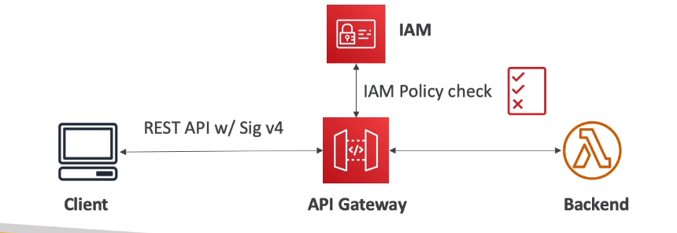
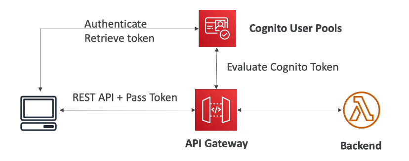
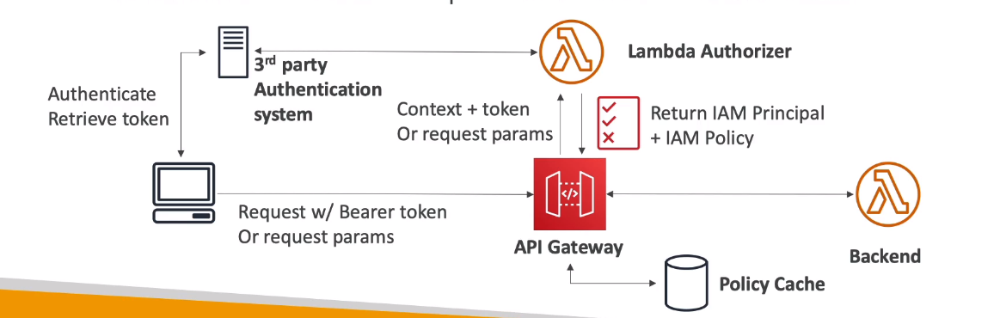
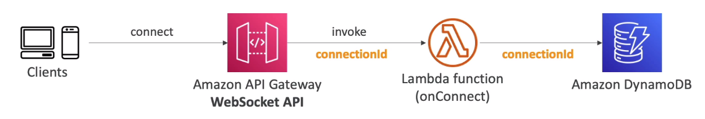
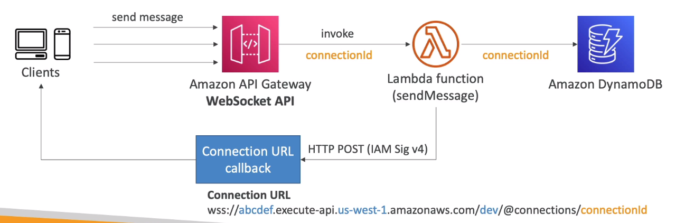
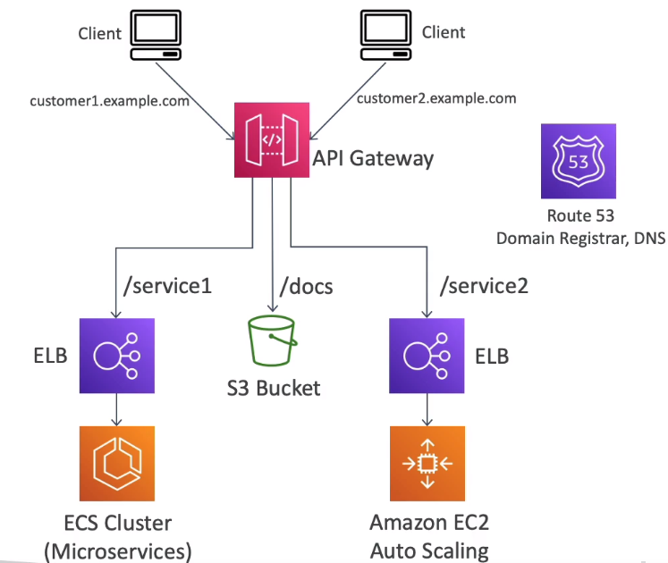
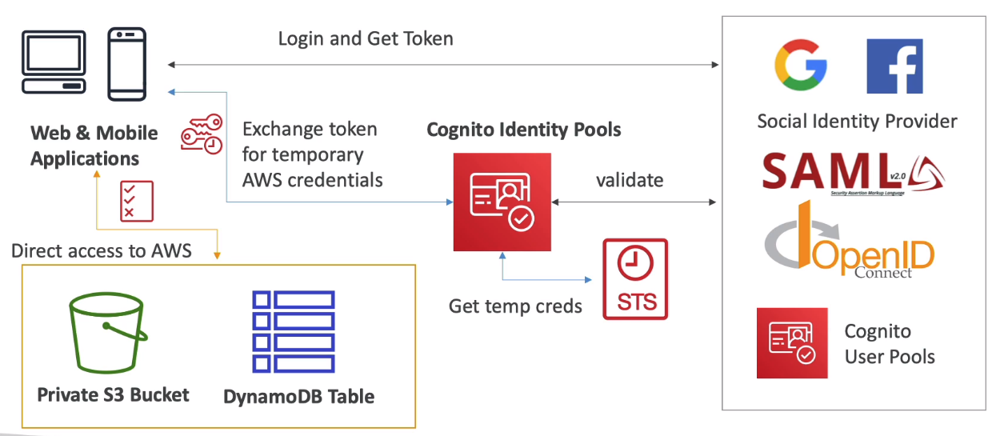
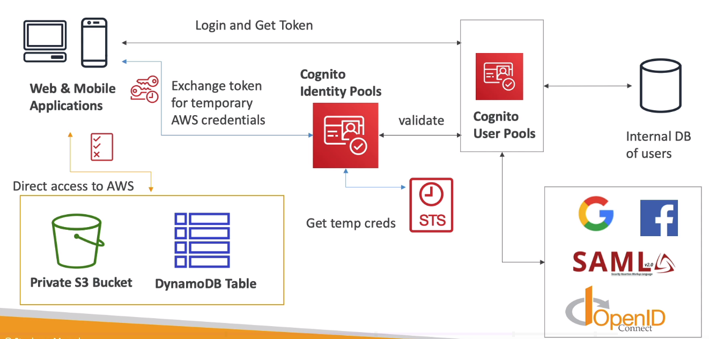
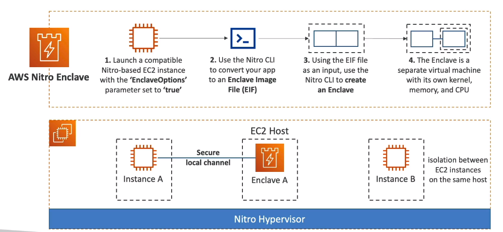

# AWS Certified Developer Associate

Amazon Web Services(AWS) is a leading cloud provider, meaning they provide you with services and servers that can scale easily and on demand.

Source:
* [udemy - aws-certified-developer-associate](https://www.udemy.com/course/aws-certified-developer-associate-dva-c01)

#### Table of contents

* [AWS Global Infrastructure](#aws-global-infrastructure)
* [AWS Billing](#aws-billing)
* [IAM](#iam)
    * [IAM Policies](#iam-policies)
    * [IAM MFA Overview](#iam-mfa-overview)
    * [IAM Best Practices](#iam-best-practices)
* [AWS CLI](#aws-cli)
    * [AWS CloudShell](#aws-cloudshell)
* [AWS SDK](#aws-sdk)
* [EC2](#ec2)
    * [EC2 User Data](#ec2-user-data)
    * [EC2 Instance Types](#ec2-instance-types)
    * [Security Groups](#security-groups)
    * [Classic Ports](#classic-ports)
    * [EC2 Purchasing Options](#ec2-purchasing-options)
* [EC2 Instance Storage](#ec2-instance-storage)
    * [AMI](#ami)
    * [EBS](#ebs)
    * [EFS](#efs)
* [Amazon FSx](#amazon-fsx)
* [Scalability & High Availability](#scalability-&-high-availability)
    * [ELB](#elb)
        * [ELB - Sticky Sessions](#elb---sticky-sessions)
        * [ELB - Cross Zone Load Balancing](#elb---cross-zone-load-balancing)
        * [ELB - SSL Certificates](#elb---ssl-certificates)
        * [ELB - Connection Draining](#elb---connection-draining)
    * [ASG](#asg)
        * [ASG Scaling Policies](#asg-scaling-policies)
* [RDS](#rds)
* [Aurora](#aurora)
* [ElastiCache](#elasticache)
    * [Amazon MemoryDB for Redis](#amazon-memorydb-for-redis)
* [DNS](#dns)
* [Route 53](#route-53)
* [VPC](#vpc)
    * [Network ACL vs SGs](#network-acl-vs-sgs)
* [S3](#S3)
    * [S3 Storage Classes](#s3-storage-classes)
    * [Athena](#athena)
    * [S3 Advanced Features](#s3-advanced-features)
    * [S3 Advanced Security](#s3-advanced-security)
* [CloudFront](#cloudfront)
* [Docker in AWS](#docker-in-aws)
    * [Docker](#docker)
    * [ECS](#ecs)
    * [Fargate](#fargate)
    * [ECR](#ecr)
    * [AWS Copilot](#aws-copilot)
    * [EKS](#eks)
* [Elastic Beanstalk](#elastic-beanstalk)
* [CICD](#cicd)
    * [CodeCommit](#codecommit)
    * [CodePipeline](#codepipeline)
    * [CodeBuild](#codebuild)
        * [buildspec.yml](#buildspec.yml)
    * [CodeDeploy](#codedeploy)
        * [appspec.yml](#appspec.yml)
    * [CodeStar](#codestar)
    * [CodeArtifact](#codeartifact)
    * [CodeGuru](#codeguru)
    * [Cloud9](#cloud9)
* [CloudFormation](#cloudformation)
    * [YAML](#yaml)
    * [CloudFormation Resources](#cloudformation-resources)
    * [CloudFormation Parameters](#cloudformation-parameters)
    * [CloudFormation Mappings](#cloudformation-mappings)
    * [CloudFormation Outputs](#cloudformation-outputs)
    * [CloudFormation Conditions](#cloudformation-conditions)
    * [CloudFormation Intrinsic Functions](#cloudformation-intrinsic-functions)
    * [CloudFormation Rollbacks](#cloudFormation-rollbacks)
* [Monitoring in AWS](#monitoring-in-aws)
    * [CloudWatch](#cloudwatch)
    * [EventBridge](#eventbridge)
    * [X-Ray](#x-ray)
        * [Example sampling rules](#example-sampling-rules)
    * [CloudTrail](#cloudtrail)
* [Integration & Messaging](#integration-&-messaging)
    * [SQS](#sqs)
    * [SNS](#sns)
    * [Kinesis](#kinesis)
        * [Kinesis Data Streams](#kinesis-data-streams)
        * [Kinesis Data Firehose](#kinesis-data-firehose)
        * [Kinesis Data Analytics](#kinesis-data-analytics)
* [Serverless](#serverless)
    * [Lambda](#lambda)
        * [Integration with ALB](#integration-with-alb)
        * [Lambda at Edge](#lambda-at-edge)
        * [Integration with S3](#integration-with-s3)
        * [Event Source Mapping](#event-source-mapping)
        * [Lambda Destinations](#lambda-destinations)
        * [Lambda Permissions](#lambda-permissions)
        * [Lambda Environment Variables](#lambda-environment-variables)
        * [Lambda Monitoring](#lambda-monitoring)
        * [Lambda in VPC](#lambda-in-vpc)
        * [Lambda Performance](#lambda-performance)
        * [Lambda Concurrency](#lambda-concurrency)
        * [Lambda External Dependencies](#lambda-external-dependencies)
        * [Lambda and CloudFormation](#lambda-and-cloudFormation)
        * [Lambda Layers](#lambda-layers)
        * [Lambda File System Monitoring](#lambda-file-system-monitoring)
        * [Lambda Container Images](#lambda-container-images)
        * [Lambda Versions and Aliases](#lambda-versions-and-aliases)
        * [Lambda CodeDeploy Integration](#lambda-codedeploy-integration)
        * [Lambda Function URL](#lambda-function-url)
        * [Lambda CodeGuru Integration](#lambda-codeguru-integration)
        * [Lambda Limits and Best Practices](#lambda-limits-and-best-practices)
    * [DynamoDB](#dynamodb)
        * [Read and Write Capacity Modes](#read-and-write-capacity-modes)
        * [Basic Operations](#basic-operations)
        * [DynamoDB Conditional Writes](#dynamodb-conditional-writes)
        * [DynamoDB Indexes](#dynamodb-indexes)
        * [PartiQL](#partiql)
        * [DynamoDB Optimistic Locking](#dynamodb-optimistic-locking)
        * [DAX](#dax)
        * [DynamoDB Streams](#dynamodb-streams)
        * [DynamoDB TTL](#dynamodb-ttl)
        * [DynamoDB CLI](#dynamodb-cli)
        * [DynamoDB Transactions](#dynamodb-transactions)
        * [DynamDB Session State](#dynamodb-session-state)
        * [DynamoDB Partitioning Strategies](#dynamodb-partitioning-strategies)
        * [DynamoDB Write Types](#dynamodb-write-types)
        * [DynamoDB Patterns with S3](#dynamodb-patterns-with-s3)
        * [DynamoDB Operations](#dynamodb-operations)
        * [DynamoDB Security & Other](#dynamodb-security-&-other)
    * [API Gateway](#api-gateway)
        * [API Gateway - Stages and Deployments](#api-gateway---stages-and-deployments)
        * [API Gateway - Integration Types & Mappings](#api-gateway---integration-types-&-mappings)
        * [API Gateway - OpenAPI](#api-gateway---openapi)
        * [API Gateway - Caching](#api-gateway---caching)
        * [API Gateway - Usage Plans & API Keys](#api-gateway---usage-plans-&-api-keys)
        * [API Gateway - Monitoring, Logging, Tracing](#api-gateway---monitoring,-logging,-tracing)
        * [API Gateway - CORS](#api-gateway---cors)
        * [API Gateway - Authentication and Authorization](#api-gateway---authentication-and-authorization)
        * [API Gateway - REST API vs HTTP API](#api-gateway---rest-api-vs-http-api)
        * [API Gateway - Websocket API](#api-gateway---websocket-api)
        * [API Gateway - Architecture](#api-gateway---architecture)
    * [SAM](#sam)
        * [SAM - API Gateway](#sam---api-gateway)
        * [SAM - DynamoDB](#sam---dynamodb)
        * [SAM - Policy Templates](#sam---policy-templates)
        * [SAM - CodeDeploy](#sam---codedeploy)
        * [SAR - Serverless Application Repository](#sar---serverless-application-repository)
    * [Step Functions](#step-functions)
    * [AppSync](#appsync)
    * [AWS Amplify](#aws-amplify)
* [Cloud Development Kit](#cloud-development-kit)
* [Cognito](#cognito)
    * [Cognito User Pools (CUP)](#cognito-user-pools-(cup))
    * [Cognito Identity Pools(CIP)](#cognito-identity-pools(cip))
* [Advanced Identity](#advanced-identity)
    * [STS](#sts)
    * [Advanced IAM](#advanced-iam)
    * [AWS Directory Services](#aws-directory-services)
* [AWS Security & Encryption](#aws-security-&-encryption)
    * [KMS](#kms)
    * [CloudHSM](#cloudhsm)
    * [SSM](#ssm)
    * [Secrets Manager](#secrets-manager)
    * [AWS Nitro Enclaves](#aws-nitro-enclaves)
* [Other Services](#other-services)
* [Useful](#useful)
    * [Lambda](#lambda-1)
    * [SQS](#sqs-1)
    * [S3](#s3-1)

&nbsp;
# AWS Global Infrastructure
* **Regions**
    * have codes like `us-east-1`
    * a cluster of data centers
    * most services are bound to regions - https://aws.amazon.com/about-aws/global-infrastructure/regional-product-services
    * how to choose a region:
        * *Compliance* - data governance, legal requirements, data never leaves a region without explicit permissions
        * *Proximity* - closer to customers means lower latency
        * *Service Availability* - new services/features aren't available in all regions
        * *Pricing* - pricing varies across regions
* **Availability Zones**
    * one or more discrete data centers with redundant power, networking and connectivity
    * each region has availability zone, usually 3, min 2, max 6
    * each AZ has a code like `us-east-1a`, `us-east-1b`
    * AZ's are isolated from disasters
    * AZ's are connected with high bandwidth, ultra-low latency networking
* **Edge Locations / Points of Presents**
    * Amazon has 205 Edge Locations and 11 Regional Caches in 84 cities across 42 countries
    * content is delivered to users with lower latency

More under https://infrastructure.aws/

&nbsp;
# AWS Billing
* accessible from `My Account` > `My Billing Dashboartd`
    * the root account needs to set if access to Billing Information can be controlled through an IAM policy - `My Account` > `IAM User and Role Access to Billing Information`
* **Budgets** enables setting a budget to control and get notified when costs exceed a specified threshold
* **Bills** you can find very specific information on what you are paying for
* **AWS Free tier** shows all services that are free to use

&nbsp;
# IAM
* Identity and Access Management
* **Global** service
* **Users** are people withing your organization
    * you should download credentials in CSV after creating a user
* **Groups** are collection of users with shared identity and access settings
    * users can belong to multiple groups but dont have to belong to any 
    * groups cannot contain other groups
* **IAM Policies** are JSON documents that specify what a user or group is allowed to do
* **Least privilege principle** means you don't give a user more permissions than he needs
* **Account Alias** is a unique name of the account that you can set and use instead of the number during log in
* **IAM Roles** are policies applied to services. Common roles:
    * EC2 Instance Roles
    * Lambda Function Roles
    * Roles for CloudFormation
* **IAM Security** comprise of MFA and Password Policies
* **IAM Secutiy Tools** various tools for checking how secure your IAM configuration is:
    * *IAM Credentials Report* - list of account's users and various credential status - `account level`
    * *IAM Access Advisor* - list of service permissions granted to user and when they where last accessed. Very handy to revise policies assigned to user - `user level`
* **AWS CLI** used to manage AWS services with a command line
* **AWS SDL** used to manage AWS services with a programming language
* **Access Keys** enable access to AWS using CLI or SDK
* **IAM Audit** can be done through IAM Credential Reports & IAM Access Advisor

## IAM Policies
* **inline** policy is one that is only attached to a user
* **IAM Policy structure**
    * *Version* - policy language version, always select `2012-10-17`
    * *Id* - idenitifier for the policy [`optional`]
    * *Statement* - one or more individual statement
        * *Sid* - statement identifier [`optional`]
        * *Effect* - whether statement allows or denies access [`Allow`, `Deny`]
        * *Principal* - account/user/role to which this policy is applied to
        * *Action* - list of actions the policy allows or denies
        * *Resource* - list of resources the policy is applied to
        * *Condition* - conditions for when the policy is in effect [`optional`]
* custom policies can be created either through JSON format or Visual Editor

```JSON
{
    "Version": "2012-10-17",
    "Id": "S3-Investor-Permissions",
    "Statement": [
        {
            "Sid": "1",
            "Effect": "Allow",
            "Principal": {
                "AWS": ["arn:aws:iam:123456789012:root"]
            },
            "Action": [
                "s3:GetObject",
                "s3:PutObject"
            ],
            "Resource": ["arn:aws:s3:::inv-*"]
        }
    ]
}
```

## IAM MFA Overview
* **Password Policies**
    * set minimum length
    * require specific characters like: uppercase/lowercase letters, number, non-alphanumeric characters
    * allow all IAM users to change their own passwords
    * password expiration
    * prevent password re-use
* **Multi Factor Authentication**
    * a combination of a *password that you know* and a *device that you own*
    * a hacker would need access to physical device:
        * *Virtual MFA device* - Google Authenticator(phone-only) or Authy(multi-device)
            * supports multiple tokens on a single device
        * *Universal 2nd Factor (U2F) Security Key* - YubiKey by Yubico (3rd party)
            * supports multiple root and IAM users on a single security key
            * looks like a usb drive
        * *Hardware Key Fob MFA Device* - a small device that shows and refreshes MFA code
        * *Hardware Key Fob MFA Device for AWS GovCloud (US)* - special key fob provided by SurePassID

## IAM Best Practices
* only use root account for AWS account setup
* **one** physical user = **one** AWS user
* assign users to groups and assign permissions to groups
* create a strong password policy
* enforce MFA
* create and use `Roles` for giving permissions to AWS services
* use and protect access keys for programmatic access (CLI / SDK)
* use IAM Credentials Report to audit credentials of accounts
* **never** share IAM users & access keys

&nbsp;
# AWS CLI
* Command Line Interface
* alternative to using the AWS Management Console
* protected by access keys
    * generated through AWS Console
    * contains an *Access Key ID* which is like a username and *Secret Access Key* which is like a password
* enables direct access to *public APIs of AWS services* and allows writing *scripts to manage your resources*
* is open-source https://github.com/aws/aws-cli
* is effected by IAM policies
* **Dry Run** - run commands to check if we have permissions without actually executing them - `--dry-run`
    * output specifies exactly which permission is missing
* **STS Decode** - allows decoding error messages to get meaningful data
    * `decode-authorization-message --encoded-message <value>`
    * you need an IAM Policy attached to your user to use this
* **Profiles** - use profiles to use multiple AWS CLI accounts side by side - `aws configure -profile some-profile-name`, then `aws s3 ls --profile some-profile-name`
* **MFA** - to use MFA with CLI, you nmust create a temporary session by calling the STS GetSessionToken API
    * `aws sts get-session-token --serial-number {arn-of-the-mfa-device} --token-code {code-from-token} --duration-seconds 3600` -> return credentials
    * **arn-of-the-mfa-device** is available in AWS Console after configuring the device (scanning QR code)
    * **code-from-token** is available in the authenticator app on the device
    * in `.aws/credentials` file add the token as a value for the key `aws_session_token`
* **Credentials Provider Chain**:
    * **CLI** will look for credentials in this order:
        1. *Command line options* -> --region, --output and --profile
        1. *Environment variables* -> AWS_ACCESS_KEY_ID, AWS_SECRET_ACCESS_KEY, AWS_SESSION_TOKEN
        1. *CLI credentials file* -> `aws configure ~/.aws/credentials`
        1. *CLI configuration file* -> `aws configure ~/.aws/config`
        1. *Container credentials* -> for ECS task
        1. *Instance profile credentials* -> for EC2 Instance Profiles
    * **SDK**
        1. *Java system properties* - `aws.accessKeyId` and `aws.secretKey`
        1. *Environment variables* -> AWS_ACCESS_KEY_ID, AWS_SECRET_ACCESS_KEY, AWS_SESSION_TOKEN
        1. *Default credentials profiles file* -> `aws configure ~/.aws/credentials`
        1. *Container credentials* -> for ECS task
        1. *Instance profile credentials* -> for EC2 Instance Profiles
    * BEST PRACTICE:
        * credentials should be inherited from the credentials chain
        * use IAM Roles where possible when working within AWS:
            * EC2 -> EC2 Instances Roles
            * ECS tasks -> ECS Roles
            * Lambda functions -> Lambda Roles
        * use ENV Variables and named profiles when working outside of AWS
* **Signing AWS API requests**
    * AWS HTTP API request are signed for identification purposes
    * some requests to S3 dont need to be signed
    * SDK/CLI sign requests for you
    * if you need to sign a request do it using `Signature v4 (SigV4)`. Two ways to do this:
        1. compute it and include it in an `HTTP Authorization Header`
        1. compute it and include in `Query String` option -> X-Amz-Signature for s3 pre-signed URLs

``` bash
# configure the CLIby adding access keys
aws configure

# IAM
aws iam list-users
```

## AWS CloudShell
* a browser based environment with AWS CLI and other tools installed
* persists files
* easily download and upload files between local environment and AWS CloudShell
* only available in some regions

&nbsp;
# AWS SDK
* Software Developer Kit
* used for accessing AWS APIs from code and protected by access keys 
* SDK's are language specific
* allows managing AWS services programmatically
* the SDK is embedded within your applications
* supports:
    * *SDKs* - JavaScript, Python, PHP, .NET, Ruby, Java, Go, Node.js, C++ and more
    * *Mobile SDKs* - Android, iOS and more
    * *IOT Device SDKs* - Embedded C, Arduino and more
* if you dont specify a default region for SDK, `us-east-1` is chosen by default
* **AWS Limits (Quotas)** - the limit of SDK operations that you can performs
    * **API Rate Limits**
        * `DescribeInstances` API for EC2 -> 100 calls per seconds
        * `GetObject` on S3 -> 5500 GET per second per prefix
        * for Intermittent Errors implement `Exponential Backoff`: 
            * use retry mechanism already included in AWS SDK API calls
            * or implement own retry mechanism
            * should only implement retry for `5xx server error` and throttling
            * **how it works** - on each retry we double the wait time
        * for Consistent Errors: request an API throttling limit increase
    * **Service Quotas**
        * on-demand standard isntances: 1152 vCPU limit
        * can increase by opening a ticket
        * can request increase through **Service Quotas API**


&nbsp;
# EC2
* Elastic Compute Cloud
* Infrastructure as a Service
* consists of the following capabilities:
    * *EC2* - renting virtual machines
    * *EBS* - storing data on virtual drives
    * *ELB* - distributing load across machines
    * *ASG* - scaling the services using an auto-scaling group
* *EC2 Instance Store* - high-performance ephemeral storage connected directly to the EC2 hardware
    * better I/O performance than network drives
    * losses storage on instance termination(ephemeral)
    * good for buffer/cache/scratch data/temporary content
    * risk of data loss if hardware fails -> Backup and Replication is your responsiblity
* Sizing and configuration:
    * *OS* - Linux, Windows, Mac OS, Amazon OS
    * *CPU* - how much power and cores
    * *RAM* - how much volatile memory
    * *Storage* - network attached through *EBS & EFS* or hardware *EC2 Instance Store*
        * you can set volumes to be deleted on instance termination
    * *Network* - speed of network card, public IP address
    * *Firewall rules* - inbound and outbound rules defined in a **Security Group**
        * You need to create a key pair and assign it to an instance in order to SSH into it
            * `.pem` for newer OS like MacOS or Windows - make sure to run `chmod 0400 test.pem` before using it
            * `.ppl` for older OS like Windows 7/8
        *  when connecting via `SSH` make sure the `pem` file is in `cwd` - `ssh -i test.pem ec2-user@3.250.11.10`
    * *Bootstrap script* - configure an EC2 instance at launch through *EC2 User Data*
* On creation an instance gets:
    * *Instance ID* unique identifier of the EC2 instance
    * *Public IPv4 address* if it is configured for public access
    * *Private IPv4 adresses* which enable access internally by other AWS services
* `EC2 Instance Connect` allows connecting with EC2 through your browser, only available for `Amazon Linux 2`
    * default user is named `ec2-user`
    * dont use AWS Account credentials in EC2 instance to configure access to resources
* **Summary**:
    * *EC2 Instance* - AMI(OS) + Instance Size (CPU + RAM) + Storage + SG + EC2 User Data
    * *Security Groups* - firewall attached to the ec2 instance
    * *EC2 User Data* - script launch on first start up of instance
    * *SSH* - start a terminal into EC2 instance on port 22
    * *EC2 Instance Role* - set instance permissions based on IAM role
    * *Purchasing Options* - On-Demand, Spot, Reserved, (Standard + Convertible + Scheduled), Dedicated Host, Dedicated Instance
* **EC2 Instance Metadata** - a url that can be used within an EC2 Instance to get information about the EC2 instance:
    * url: http://169.254.169.254/latest/meta-data
    * CAN retrieve IAM Role
    * CANNOT retrieve IAM Policy
    * can get many different information -> metrics, iam, hostname, ami-id and much much more
    * useful for automation
    * http://169.254.169.254/latest/meta-data/security-credentials/{EC2Role} -> return EC2 security credentials

## EC2 User Data
* a script that allows bootstrapping an EC2 instance
* launches commands on startup
* the script is only run once on startup
* automates boot tasks such as:
    * installing updates
    * installing software
    * downloading common files form the internet
* runs with the root user (`sudo` rights)

``` bash
#!/bin/bash
# Use this for your user data
# install httpd
yum update -y
yum install -y httpd
systemctl start httpd
systemctl enable httpd
echo "<h1>Hello World from $(hostname -f)</h1>" > /var/www/html/index.html
```

## EC2 Instance Types
* a good reference is https://aws.amazon.com/ec2/instance-types/
* instance types are separated into classes:
    * *General Purpose* - the `t` class is good for diveristy of workloads like `web servers` or `code repositories`. Balance between Compute, Memory, Networking
    * *Compute Optimized* - the `c` class is good for workloafds that require high performance processors like:
        * `batch processing`
        * `media transcoding`
        * `high performance web servers`
        * `(HPC) high performance computing`
        * `scientific modeling & machine learning`
        * `dedicated gaming servers`
    * *Memory Optimized* - the `m` class is good for processing large data sets in memory like:
        * `high performance for relational/non-relational databases`
        * `distributed web scale cache stores (ElastiCache)`
        * `in-memory databases optimized for BI`
        * `Application performing real-time processing of big unstructered data`
    * *Storage Optimized* - `i`, `d` and `h1` class is great for storage-intensive tasks that require high, sequential read and write access to large data sets on local storage like:
        * `high frequency online transaction processing (OLTP) systems`
        * `Relational & NoSQL databases`
        * `Cache for in-memory databases (Redis)`
        * `Data warehousing applications`
        * `Distributed file systems`
* instance naming convention following an example `m5.2xlarge`
    * `m` - instance class
    * `5` - generation, the hardware of the instance which is improved over time
    * `2xlarge` - size within the instance class, the bigger the higher hardware specs

Tool for comparing instances: https://instances.vantage.sh


## Security Groups
* a firewall on EC2 instances
* fundamental of network security in AWS
* control inbound and outbound traffice of a EC2 instances
* only contain `allow` rules
* can reference by IP or by other security groups
    * which means you can `authorise` specific security groups and traffic comming from EC2 instances with that group is allowed
* they regulate:
    * access to ports
    * authorised IP ranges - IPv4 and IPv6
    * control of inbound network (from other to the instance)
    * control of outbound network (from the instance to other)
* can be attached to multiple instances and vice versa
* locked down to a region / VPC combination
* live outside of the EC2 instance
* **Good Practice** - maintain one separate security group for SSH access
* a `time out` is usually a security group issue
* a `connection refused` error means you got through and got an application error
* all inbound is `blocked` by default - `Source 0.0.0.0/0`
* all outbound is `autherized` by default - `Destination 0.0.0.0/0`
* you can attach `IAM` roles to EC2 instances to give them access to resources (like using the AWS CLI in them)
    * Instance > Actions > Modify IAM role


## Classic Ports
* `22` = **SSH** (Secure Shell) - log into a Linux instances
* `21` = **FTP** (File Transfer Protocol) - upload files into a file share
* `22` = **SFTP** (Secure File Transfer Protocol) - upload files using SSH
* `80` = **HTTP** - access unsecured websites
* `443` = **HTTPS** - access secured websites
* `3389` = **RDP** (Remote Desktop Protocol) - log into a Windows instance

## EC2 Purchasing Options
* **Tenancy** defines how EC2 instances are distributed across physical hardware and affect pricing
* purchase options include:
    * **On-Demand Instances** - short workload, predictable pricing, pay by second
        * billing per second after first minute for Linux or Windows
        * billing per hour for other OS
        * *highest cost* but no *upfront payment*
        * best if: 
            * *short* workload
            * *uninterrupted* workload
            * *cant predict* application behavior
    * **Reserved** (1 & 3 years)
        * types:
            * **Reservecd Instances** - long workloads
            * **Convertible Reserved Instances** - long workloads with flexible instances
        * Up to 72% discount compared to On-demand
        * reserve specific instance attributes (Type, Region, Tenancy, OS)
        * the higher the *reservation period* the higher the discount
        * *payment options* - no upfront, partial upfront, all upfront
        * *scope* - region or zonal
        * can by and sell in the `Reserved Instance Marketplace`
        * best for:
            * steady-state usage applications (like DB)
    * **Savings Plan** (1 & 3 years) - commitment to an amount of usage
        * discount based on long-term usage
        * commit to a type of usage (like $/hour for 1 or 3 years)
        * usage beyond Saving Plans is billed at On-Demand price
        * **locked** to *instance family* and *AWS region*
        * **flexible** across *instance size*, *os*, *tenancy*(Host, Dedicated, Default)
    * **Spot Instances** - short workloads, can lose instances (less reliable)
        * up to 90% disount compared to on-demand
        * can lose at any point of time if your max price is less then current spot price
        * *most cost-efficient* instances
        * useful for workloads that are *resilient to failure* like:
            * *batch jobs*
            * *data analysis*
            * *image processing*
            * *distributed workkloads*
            * *workloads with flexible start and end time*
        * *not suitable* for critical jobs or databases
    * **Dedicated Hosts** - book an entire **physical server**, control instance placement
        * physical server with EC2 capacity fully dedicated to your use
        * allows addressing *compliance requirements* and *existing server-bound software licenses*(per-socket, per-core, per-VM software licenses)
        * purchasing options: *On-demand*, *Reserved (No Upfront, Partial Upgront, All Upfront)*
        * characteristics:
            * enables the use of dedicated physical servers
            * per host billing
            * visibility of sockets, cores, host ID
            * affinity between a host and instance
            * targeted or automatic instance placement
            * add capacity using an allocation request
    * **Dedicated Instances** - no other customers will share your hardware
        * runs on **hardware* that is dedicated to you, but may share it with other instances you control
        * you have no control over instance placement
        * per instance billing (subject to 2$ per region fee)
    * **Capacity Reservations** - reserve capacity in a specific AZ for any duration
        * reserve On-Demand instances capacity in an AZ for any duration
        * always have access to that capacity
        * pay hourly rates even if you dont use it
        * *not time commitment* and *no billing discounts*
        * sutiable for *short-term uninterrupted workloads* that need to be in a specific AZ

&nbsp;
# EC2 Instance Storage
* **EBS** vs **EFS**
    * **EBS**: 
        * one instance (except io1/io2 multi-attach)
        * locked at AZ level
        * `gp2`: IOPS increases with disk size
        * `io1`: provisioned IOPS
        * to migrate across AZ take a snapshot and restore in other AZ
        * backups use IPS, shouldnt run while application handling high traffic
        * root EBS volume for EC2 instance terminated by defualt (can disable)
    * **EFS**:
        * network filesystem that can be attached to 100s of EC2 isntances
        * not bound to AZ level
        * share files
        * only for Linux instances (POSIX)
        * higher price
        * can leverage EFS-IA for cost savings
* **EC2 Instance Store** - high-performance ephemeral storage connected directly to the EC2 hardware
    * better IOPS performance than network drives
    * losses storage on instance termination(ephemeral)
    * good for buffer/cache/scratch data/temporary content
    * risk of data loss if hardware fails -> Backup and Replication is your responsiblity

## AMI
* **AMI** - **Amazon Machine Image** - *customization* of an EC2 instance:
    * add own software. configuration, OS, monitoring
    * faster boot thx to pre-packaged software
* region specific and can be copied across regions
* you can launch EC2 instances from:
    * *A public AMI* - provided by AWS
    * *Your own AMI* - you make and maintain them
    * *AWS Marketplace AMI* - an AMI someone else made and potentially sells
* you can:
    * build an AMI from an existing EC2 instance(which creates EBS snapshot)
* **EC2 Image Builder** - automate creation of VM or container images
    * a regional service
    * free service, only pay for underlying resources(EC2 instances, storage of AMI)
    * automate the creation/maintenance/validation/testing of EC2 AMIs
    * steps:
        * creates a *Builder EC2 Instance* - build components applied like custom software
        * creates a new AMI from the Builder EC2 instance
        * creates a *Test EC2 Instance* from the AMI - runs test suite to check if its working/secure/app running
        * distributes the AMI - allows distribution to multiple regions
    * can run on a schedule like weekly/triggers(package updates)/manually
    * *Recipe* - how source image is customized
    * *Infrastructure Configuration* - ec2 instance type and configs(like IAM)
    * *Distribution Settings* - what regions the AMI will be distributed to


## EBS
* **EBS** - **Elastic Block Store** - a network drive you can attach to an instance while they run
    * persist data even when instance is terminated
    * can only mount to 1 instance at a time (CCP level, CCA level "multi-attach" feature for some possible)
    * bound to AZ
        * to move across AZ first need to *snapshot* a volume
    * think of them as *network USB stick*
    * is a *network drive*:
        * can cause latency
        * easily attached and detached
    * capacity(GB, IOPS) needs to be provisioned in advance
* **parameters**
    * *Delete on Termination* - deletes the EBS volume on EC2 instance termination
        * by default `on` for root volumes
        * by default `off` for non-root volumes
        * use case: disable for root volume to preserve on ec2 termination
* **EBS Snapshot** - a backup of an EBS volume at any point of time
    * not necessary to detach volume (but recommended)
    * can copy across AZ or Region
    * Features:
        * *EBS Snapshot Archive* - allows moving to an "archive tier" that is 75% cheaper, takes 24-72h to restore
        * *Recycle Bin for EBS Snapshots* - rules to retain deleted snapshots, specify retention 1d-1y, find deleted snapshots
        * *FSR* - Fast Snapshot Restore - force full initialization of snapshot for now latency on first use, cost extra, useful with very big snapshots if you need them available fast
* **Volume Types**
    * *gp2 / gp3 (SSD)* - general purpose SSD, balances price and performance for wide variaty of workloads
        * cost effective, low latency
        * **use cases**: system boot, virtual desktops, development/test envs
        * 1 GiB - 16 TiB
        * **gp3**: 
            * baseline of 3000 IOPS and throughput of 125 MiB/s
            * can increase IOPS to 16000 and throughput to 1000 MiB/s independently
        * **gp2**:
            * small volumes can burst to 3000 IOPS
            * size of volume and IOPS linked, 3 IOPSa per GB, max of 16000 IOPS at 5334 GB
    * *io1 / io2 (SSD)* - highest-performance SSD, mission-critical low-latency or high-throughput workloads
        * highest performance, throughput and lowest latency
        * **PIOPS** - provisioned IOPS SSD
        * **use cases**: critical business applications, apps that need more than 16000 IOPS, database workloads
        * 4 GiB - 16 TiB
        * Max PIOPS -> 64000 for Nitro EC2 Instances, 32000 for other
        * can increase PIOPS independently of storage size
        * io2 -> more durability, more IOPS per GiB at same price as io1
        * **io2 Block Express** - 4 GiB - 64 Gib, sub-ms latency, max PIOPS: 256000, IOPS:GIB ratio of 1000:1
        * supports EBS Multi-Attch
    * *st 1 (HDD)* - lowest costs HDD, designed for frequently accessed, throughput-intensive workloads
        * 125 GiB to 16 TiB
        * throughput optimized HDD: max throughput -> 500 MiB / s, max IOPS 500
    * *sc1 (HDD)* - lowest cost HDD volume designed for less frequently accessed workloads
        * Cold HDD
        * scenario for lowest cost
        * max throughput 250 MiB/s, max IOPS 250
    * **EBS Volumes** are characterized in Size / Throughput / IOPS
    * only *gp2/gp3* and *io1/io2* can be used aas boot volumes
* **EBS Multi-Attach** -  attach same EBS volume to multiple EC2 instances in the same AZ
    * only compatible with io1/io2 volume types
    * each instance has read & write permissions
    * **use case** : 
        * higher application availability in clustered Linux applications (ex: Teradata)
        * applications must manage concurrent write operations
    * **limitations**: same AZ, max of 16 EC2 Instances, must use cluster-aware file system(not XFS, EX4, etc...)


## EFS
* **EFS** - **Elastic File System** - is a *managed NFS*(network file system) that can be mounted on many EC2(EFS mount targets)
    * an EFS can work in multi-AZ (regional, for durability and availability)
    * highly available, scalable, expensive, pay per use
    * uses *NFSv4.1 protocol*
    * access controlled by *security group*
    * only compatible with Linux based AMI
    * encryption at rest using KMS
    * *POSIX* file system with a standard API
    * scales automatically (no capacity planning!)
* use cases:
    * content management
    * web serving
    * data sharing
    * wordpress
* performance and storage classes:
    * **Scale** - 1000s of concurrent NFS clients, 10 GB+ throughput, grow to Petabyte-scale NFS automatically
    * **Performance mode** - set at EFS creation time:
        * *General purpose* (default) - latency-sensitive use cases (web server, CMS, etc...)
        * *Max I/O* - higher latency, throughput, highly parallel (big data, media processing)
    * **Throughput mode** set at EFS creation time:
        * *Bursting* - 1 TB = 50MiB/s + burst of up to 100MiB/s, the more space you use the more throughput
        * *Provisioned* -  set throughput regardless of storage size
* storage classes:
    * **Storage Tiers** - lifecycle management features, can set to rules to transition between IA and out of it
        * *Standard* - for frequently accessed files
        * *Infrequent access* (EFS-IA) - cost to retrieve files, lower price to store 
            * enable with a Lifecycle policy, which moves from standard automatically based on last access time 
            * optimal for non-frequent access(up to 92% lower costs compared to standard)
    * **Availability and Durability**
        * *Regional* - multi-AZ, great for prod
        * *One Zone* - one AZ, cheaper, compatible with IA (EFS One Zone-IA), backup enabled by default, good for dev
* network access: setup groups of: `AZ` -> `Subnet ID` -> `IP address` -> `SG`


&nbsp;
# Scalability & High Availability
* **Scalability** - can handle greater loads by adapting
    * *Vertical Scalability* - increasing the size of an instance, `scale up / down`
        * common for non-distributed systems like a DB ( RDS, ElastiCache )
        * limited by hardware
    * *Horizontal Scalability* (elasticity) - increasing number of instances / systems for application, `scale out / in`
        * implies distributed systems like a web application / modern application
        * not everything can be distributed
        * made simple by cloud services like [ASG](#asg), [ELB](#elb)
* **High Availability** - running your application in at least 2 data centers(2 AZ)
    * goal is to survive a data center loss
    * *Passive* - a resource that can take over when an active resource fails (like DB replica in another AZ) 
    * *Active* - multiple replicas of the resource are in use(like horizontally scaled architecture)
    * facilitated by services like [ASG](#asg) with multi AZ enabled or [ELB](#elb) with multi AZ enabled
* **Definitions**
    * *Scalibility* - ability to accommodate a larger load by making the hardware stronger, or by adding nodes
    * *Elasticity* - the system can automatically scale based on the load it is receiving 
    * *Agility* - how easily available new IT resources are ( 1 week, 1 minute, etc.)

## ELB
* **Load Balances** - servers that forward traffic to multiple servers downstream. Used to:
    * `spread load` across instances
    * expose a `single point of access` (DNS) to your application
    * seamlessly `handle` downstream instance `failure` 
    * perform `healthchecks`
    * provide `SSL termination` (HTTPS) for your websites => decrypting SSL-encrypted data traffic before offloading it to a web server
    * enforce `stickiness` with cookies => assign identification(through cookies or IP details) and fix routing based on it
        * *Stickiness* - the ability to route traffic from a client to a single destination, instead of balancing traffic across multiple destinations
    * enable `HA` across zones
    * separate `public` from `private traffic`
* **ELB** - **Elastic Load Balancing** - a managed load balancer 
    * *managed* means:
        * AWS guarentees it will be working
        * AWS takes care of upgrades, maintenance and HA
        * AWS provides only a few configuration knobs
    * cheaper to setup own LB but a lot more effort
    * integrated with AWS services:
        * [EC2](#ec2), [ASG](#asg), [ECS](#ecs)
        * [ACM](#other-services), [CloudWatch](#cloudwatch)
        * [Route 53](#route-53), WAF, AWS Global Accelarator
    * need to configure security groups on load balancers to specify rules for incoming/outgoing traffic
* **Health Checks** are crucial for loadbalancers
    * enable to know if instances handling traffic can reply to requests 
    * are done on a specific port and a specific route like `/health` for example:
        * Protocol: `HTTP`
        * Port: `4567`
        * Endpoint: `/health`
    * if response to health check is not `200 (OK)` then labeled `unhealthy`
* **4 kinds** of LB are available on AWS:
    * **CLB** - *Classic Load Balancer* - `v1`, old generation, LB available from 2009 
        * operates on Layer 4 and Layer 7
        * for `protocols` HTTP, HTTPS, TCP, SSL (secure TCP)
        * **retired in 2023**
    * **ALB** - *Application Load Balancer* - `v2`, new generation, LB available from 2016
        * Layer 7 (HTTP)
        * HTTP routing features
            * load balancing to multiple HTTP applications across machines(target groups)
            * can load balance to multiple apps on one EC2 instance(like Docker containers)
            * support redirects (like HTTP -> HTTPS)
        * Routing Tables to multiple target groups:
            * routing based on path in URL (example.com/`users`)
            * routing based on hostname in URL (`one`.example.com, `other`.example.com)
            * routing based on query string, headers (example.com/users?`id=123&order=false`)
        * Static DNS (URL)
        * for `protocols` HTTP, HTTPS, WebSocket, gRPC
        * **use cases**: micro services & container-based apps (ex. Docker & Amazon ECS)
        * Port mapping feature -> redirect to a dynamic port in ECS
        * **target group**:
            * can be:
                * EC2 Instances -> HTTP
                * ECS tasks -> HTTP
                * Lambda functions -> HTTP -> JSON event
                * IP Addresses -> only  Private IP Address, like a Data Center
            * can route to multiple target groups
            * health checks are at target group level (not instance, or container)
        * **good to know**:
            * get fixed hostname
            * app server doesnt see IP of client directly
                * true IP is inserted in the header `X-Forwarded-For`
                * port in `X-Forwarded-Port`
                * proto in `X-Forwarded-Proto`
    * **NLB** - *Network Load Balancer* - `v2`, new generation, LB available from 2017
        * ultra-high performance (millions of requests per second)
        * Static IP through Elastic IP
            * has one static IP per AZ
            * Elastic IP is good foro whitelisting specific IP
        * not included in AWS Free Tier
        * Layer 4 (TCP/UDP)
        * for `protocols` TCP, TLS (secure TCP), UDP  
        * **target groups**:
            * can be:
                * EC2 Instances
                * IP Addresses -> must be private IPS 
                * Application Load Balancer
        * health checks suupprot TCP, HTTP, HTTPS protocols
    * **GWLB** - *Gateway Load Balancer* - modern LB available from 2020, used to deploy/scale/manage a fleet of 3rd part network virtual appliances in AWS
        * operates at layer 3 (Network layer) - IP Protocol for IP Packets
        * combines functions:
            * **Transparent Network Gateway** - single entry/exit for all traffic
            * **Load Balancer** - distributes traffic to your virtual appliances
        * uses the `GENEVE protocol` on port **6081** on IP Packets
        * Route Traffic to Firewalls that you manage on EC2 Instances
        * **Use cases**: Firewall, Intrusion detection and prevention systems, Deep packet inspection, payload manipulation
        * sends traffic through 3rd Party Security Virtual Appliances before routing it to the destination(application)
            * after traffic is accepted it is resent to GLB
            * once accepted GLB forwards traffic to application 
        * **target groups**: 
            * EC2 isntances -> with for example third party security appliances
            * IP addresses -> must be private IPs
    * newer generation load balancers have more features and are recommended
* load balancer can be setup as:
    * **private** - for your internal network
    * **public** - for public facing applications (ELBs)
* **security groups** for loadbalancers should be such that:
    * allow all inbound and outbound traffic for the **LB** on the pertinent protocols like:
        1. Type: `HTTP` \ Protocol: `TCP` \ Port Range: `80` \ Source: `0.0.0.0/0`
        1. Type: `HTTPS` \ Protocol: `TCP` \ Port Range: `443` \ Source: `0.0.0.0/0`
    * on connected **instances** only allow traffic to and from the LB:
        1. Type: `HTTP` \ Protocol: `TCP` \ Port Range: `80` \ Source: `sg-1231231theloadbalancersSecurityGroup`

### ELB - Sticky Sessions
* **Sticky Session** or **Session Affinity** - allow load balancer to redirect the same client to the same instance behind the load balancer
    * works for CLB & ALB
    * "cookie" used has expiration date which you set
    * **use case**: make sure user doesnt lose his session data
    * may bring inbalance to load over backend EC2 instances
    * **cookie names**
        * `Application-based Cookies`:
            * Custom cookie
                * generated by target
                * can inlude custom attributes required by application
                * cookie name specified individually for each target group
                * *reserved cookie names*: AWSALB, AWSALBAPP, AWSALBTG (reserved by ELB)
            * Application cookie
                * generated by LB
                * name is AWSALBAPP
            * expiration based on duration set in application
        * `Duration-based cookies`
            * generated by LB
            * name is: 
                * *AWSALB* for ALB
                * *AWSELB* for CLB
            * expiration based on duration set on LB

### ELB - Cross Zone Load Balancing
* **Cross Zone Load Balancing** - allows LB to distirbute traffic evenly across all registered instances in all AZs
    * without this traffic is distirbuted evenly amongs nodes of LB in all AZs (not targets)
    * ALB:
        * enabled by default
        * can be disabled at Target Group level
        * no charges for inter AZ data
    * NLB & GLB
        * disabled by default
        * pay for inter AZ data if enabled

### ELB - SSL Certificates
* SSL / TLS - Basics
    * **SSL Certificate** - allows client -> LB traffic to be encrypted in transit(in-flight encryption)
        * issued by CA (Certificate Authorities), like Comodo, Symantec, GoDaddy, GlobalSign, Digicert, Letsencrypt
        * have an expiration date and must be renewed
    * **SSL** - Secure Socket Layer - used to encrypt connections
    * **TLS** - Transport Layer Security - newer version of SSL, mainly used nowadays but still referred to as SSL
* SSL For LB
    * client <-> LB : encrypted (HTTPS)
    * LB <-> EC2 Instances : unencrypted (HTTP)
    * LB uses X.509 certificate (SSL/TLS server certificate)
    * can manage certificates using ACM (AWS Certificate Manager)
    * can create/upload own certs
    * HTTPS listener:
        * must specify default certificate
        * can add optional list of certs to support multiple domains
        * clients can use **SNI** (Server Name Indication) to specify hostname they reach
            * solves problem of loading **multiple SSL cers onto one web server** to support multiple websites
            * a newer protocol that requires client to indicate hostname of target server in the initial SSL handshake
            * server will then find correct cert or return default
            * only works for ALB & NLB, CloudFront
        * ability to specify a security policy to support older version of SSL / TLS (legacy clients)
* ALB & NLB -> support multiple listeners with multiple SSL certs through SNI

### ELB - Connection Draining
* **Connection Draining** or **Deregistration Delay** - a delay when de-registering instance(for example when flagged as unhealthy) to provide time to complete "in-flight requests"
    * can configure the delay to between 1 - 3600s, default 300s
    * can be disabled
    * lower delay good for short requests


## ASG
* **ASG** - **Auto Scaling Groups** - a group of EC2 isntances that is treated as a logical grouping for the purpose of automatically scalling
    * work hand in hand with [ELB](#elb)
* the goal of an ASG is to:
    * *Scale out* - add instances to match increased load
    * *Scale in* - remove instances to match a decreased load
    * ensure there is a `min` and `max` of machines running
    * automatically register new instances to a load balancer
* parameters include:    
    * *minimum size* - the minimum amount of running instances
    * *actual size / desired capacity* the actual ammount of running instances at a given moment
    * *maximum size* - the maximum amount of running instances
* attributes:
    * *launch configuration* or *launch templates* (newer - recommended) - how a new instance is launched and attached configurations such as:
        * AMI + Instance Type
        * EC2 User Data
        * EBS Volumes
        * Security Groups
        * SSH Key Pair
        * `IAM roles` -> are attached to each instance
    * *Mix Size* 
    * *Max Size*
    * *Initial Capacity*
    * *Network + Subnets* information
    * *Load Balancer* information
    * *Scaling Policies* what will trigger a scale out and scale in
* you update an ASG by providing a new launch configuration | template
* ASG is free, you pay for the launched resources
* if an instance within ASG is terminated, ASG will *automatically* create new replacements 
    * example: a LB marks instance as unhealthy
* **Scaling Strategies**:
    * *Manual Scaling* - update size of ASG manually
    * *Dynamic Scaling* - respond to changing demand
        * *Simple / Step Scaling* - when an alarm is triggered add/remove n units
        * *Target Tracking Scaling* - scale so that average CPU usage is around 40%
        * *Scheduled Scaling* - anticipate scaling based on known usage patterns, like increase capacity between 2PM-4PM on Friday
    * *Predictive Scaling* - use machine learning to scale ahead of time based on traffic forcasts
        * automatically provision based on prediction
        * useful when your load has predictable time-based patterns
    * Good metrics: `CPUUtilization`, `RequestCOuntPerTarget`, `Average Network In / Out` (if app is network bound), `Custom Metrics` (push using CloudWatch)
    * **Scaling Cooldown** - after scaling activity happens a cooldown period is triggers (default 300s), ASG will not launch / terminate instances during the cooldown (this allows for metrics to stabilize)
        * **Advice** - use ready-to-use AMI to reduce cooldown period
* **Clean-up** - delete ASG > delete ALB > delete EC2 instances
* **ASG Instance Refresh** - a feature that allows gradually removing EC2 instances and reacreating them with a new launch template
    * set *minimum healthy percentage* which specifies the min % of healthy instances that should be available during instance refresh
    * set *warm up time* to specify how long until instance is ready to use

## ASG Scaling Policies
* **Auto Scaling Alarms** - can scale an ASG based on [CloudWatch](#cloudwatch) alarms
    * alarms monitor system metrics
    * metrics are computed for the overall ASG instances
    * the alarm can trigger:
        * scale-out policies
        * scale-in policies
* **Auto Scaling New Rules** - easy to setup rules for scale-out and scale in like:
    * target avg cpu usage
    * number of requests on ELB per instance
    * average network in/out
* **Auto Scaling Custom Metric** - can control scaling based on custom metric, which is defined and emitted from your application
    * can be based on a schedule
    * can be transferred from the application to CloudWatch, which can have alarms configured


&nbsp;
# RDS
* **RDS** - **Relational Database Service** - a managed DB service for databases that use SQL as query language, like:
    * Postgres
    * MySQL
    * MariaDB
    * Oracle
    * SQL Server
    * Aurora
* managed means:
    * automated `provisioning`
    * automated `OS patching`
    * continuous `backups`
    * `Point in Time Restore` - restore to specific timestamp
    * `monitoring` dashboards
    * **Read Replicas** for improved read performance
        * up to 5
        * within AZ, Cross AZ, Cross Region
        * ASYNC replication -> reads are eventually consistent
        * replicas can be promoted to own DB
        * application must update connection string to leverage read replicas
        * use case: Reporting, Analytics Application
        * Network Cost: 
            * dont pay for data transfer across the same region between instance and replicas
            * pay for data transfer across region with cross region replicas
    * **Multi AZ** setup for DR
        * SYNC replication
        * One DNS name -> automatic app failover to standby instance
        * increase availability
        * failover in case of loss of AZ/network/instance/storage
        * no manual intervention
        * NOT USED for scaling
        * can setup Read Replicas as Multi AZ for DR
    * **Transition RDS from Signle-AZ to Multi-AZ**
        * zero downtime operation
        * a snapshot of DB is taken and new DB is restored from the snapshot in new AZ
        * synchronization established between two DBs
    * `maintenance` windows for upgrades
    * `scaling` capability (vertical and horizontal)
    * storage backed by `EBS` (gp2 or io1)
    * `CANNOT SSH` into your instances
* **RDS Backups**
    * automatically enabled in RDS
    * daily full backup during maintenance window
    * transaction logs backed-up every 5 minutes
    * Point in Time Restore from up to 5 minutes ago
    * 7 day retention that can be increased to 35 days
    * **DB Snapshots**
        * manually triggered backup by user
        * retention as long as you want
* **RDS Storage Autoscaling**
    * increases storage on instance dynamically and automatically
    * triggered when RDS detects that DB is running out of storage
    * *Maximum Storage Threshold* - a setting that describes that maximum allowed storage
    * autoscaling can be triggered if:
        * free storage is `less than 10%` of allocated storage
        * low-storage lasts for at least `5 min`
        * `6 hours` have passed since last modification
    * useful for applications with unpredictable workload
    * supports all databases
* **Security**:
    * encryption at rest using KMS - must be defined at launch time
    * replicas cant be encrypted if master isnt
    * automated backups
    * to encrypt an unecrypted DB: take a DB snapshot -> restore as encrypted
    * encryption in flight using SSL by default -> use AWS TLS root cedrtificates provided on client-side
    * possible to `authenticate using IAM roles` (only for open-source databases)
    * YOU configure Security Groups
    * YOU CAN'T SSH into it unless using RDS Custom service
    * Audit logs can be enabled and sent to CloudWatch Logs for longer retention
    * to enforce SSL run `REQUIRE SSL` to all your DB users
* **RDS Proxy** - managed database proxy for RDS
    * rds connection pooling
    * improves DB efficiency by reducing the stress on DB resources and minimize open connections (and timeouts)
    * serverless, autoscaling, HA (multi-AZ)
    * reduced RDS & Aurora failover time by up to 66%
    * supports RDS(MySQL, PostgreSQL, MariaDB) and Aurora (MySQL, PostgreSQL)
    * no code changes required
    * can *enforce IAM Authenctication* for DB and securily store credentials in *AWS Secrets Manager*
    * only available in VPC (never public)


&nbsp;
# Aurora
* **Aurora** - a cloud-native optimized relational database service
    * `proprietary` technology from AWS 
    * compatible with `MySQL` and `Postgres` (same drivers will work)
    * claims huge `performance` improvement:
        * 5x over MySQL on RDS
        * 3x over Posgres on RDS
    * `Auto Expanding` - shared storage automatically grows from `10 GB` to `128 TB`
        * sysops dont need to monitor
    * `Self Replicating` can have `15 replicas` with `faster replication` process (sub 10ms replica lag)
        * MySQL can have 5
    * `instantaneous failover`
        * HA native
    * costs about 20% more than RDS
* **Aurora HA and Read Scaling**
    * 6 copies of data across 3 AZ
        * 4 needed for writes/reads
        * 3 needed for reads
        * `Self Healing` with peer-to-peer replication
            * easily handles corrupted data
        * storage is striped across 100s of volumes
            * `Striped` - segmenting logically sequential data, so that consecutive segments are stored on different physical storage devices
    * One Aurora instances takes `writes` called the `master`
        * automatic failover for master in 30 seconds
        * only the master can write to the database
    * Up to 15 Aurora Read Replicas serve `reads`
        * a `read` replica can be transformed into a `master`
    * support for cross region replication
* **Aurora DB Cluser**
    * `Writer Endpoint` - DNS name that always points to the master, so client can maintain connection on failover
    * `Read Replicas` - 1 to 15 replicas that handle read operations, with Auto Scaling possible
    * `Reader Endpoint` - DNS name on top of a Connection Load Balancer that always point to the cluster of read replicas
* **Features** - remember for exam:
    * `Self Replicating` - numerous and fast replication
    * `Self Healing` - easily handles corrupted data
    * `Auto Expanding` - storage automatically grows without the need of monitoring or provisioning
    * `Automatic fail-over` - endpoints with single DNS, fail-over handled underneath
    * `Backup and Recovery` - read and write multi-AZ replicas natively
    * `Isolation and security` - safely process multiple transactions thx to replication
    * `Industry compliance` - ACID-compliant
    * `Push-button scaling` - can scale without incurring downtime
    * `Automatic Patching with Zero Downtime`
    * `Advanced Monitoring`
    * `Routing Maintenance` - handles routing traffic between replicas for zero downtime during maintenance
    * `Backtrack` - restore data at any point of time without using backups
* **Aurora Security**
    * uses same engine as RDS 
    * encryption at rest using KMS
    * automated backups, snapshots and replicas are also encrypted
    * encryption in flight using SSL
    * possible to `authenticate using IAM token`
    * YOU configure Security Groups
    * YOU CAN'T SSH into it


&nbsp;
# ElastiCache
* **ElastiCache** - fully managed in-memory data store on top of Redis or Memcached
    * **Cache** - an in-memory database with really high performance and low-latency
        * `cache invalidating` - a strategy to make sure most current data is used in cache
    * helps:
        * `query caching` - reduce load off database for read intensive workloads 
        *  make your application `stateless`
    * AWS manages:
        * OS maintenance
        * patching
        * optimizations
        * setup
        * configuration
        * monitoring
        * failure recovery
        * backups
    * usage involves *heavy application code changes*
    * configuration options:
        * **Cluster Mode**: enables replication across multiple shards for scalability and availability
            * if disabled Redis will have single shard with one primary node and up to *5 replicas*
        * **Multi-AZ** - provide enhanced HA, automatic failover to read replica, cross AZs
        * encryption at rest
        * encryption in flight -> can use Redis AUTH which requires a Redis AUTH token
        * can enable automatic backups
        * maintenance window with topic for SNS notifications
* **Solution Architecture Example**
    * `APP` <-> `Amazon Elasticache`
        * first queries cache
        * *Cache hit* - if requested data is stored in the Cache
        * saves a call to DB
    * `APP` <-> `Amazon RDS`
        * *Cache miss* - if requested data is NOT stored in the Cache
        * app reads the data from the DB
    * `APP` -> `Amazon Elasticache`
        * on *Cache miss* the application can write the data into the cache
    * can also be used to store user session so he doesn't have to log in all the time if different instances handling his requests
* **Redis** vs **Memcached**
    * **Redis**
        * multi AZ with Auto-Failover
        * read replicas to scale reads and have high availability
        * Data Durability using AOF persistence
            * `AOF persistence` - Append Only File - logs every write operation received by the server
        * backup and restore features
        * good for: HA and DR
    * **Memchached**
        * `sharding` - multi-node for partitioning data
        * `no HA(replication)`
        * non persistent
        * no backup and restore
        * multi-threaded architecture
        * good for: performance on big data-sets
* **Strategies**:
    * **Questions**:
        * *Is it safe to cache data?* -> yes, but data may be out of date, eventually consistent
        * *Is caching effective for that data?*
            * YES -> data changing slowly, few keys frequently needed
            * NO -> data changing rapidly, large key space frequently needed
        * *Is data structure well for caching?*
            * YES -> key value caching, caching of aggregations results
    * **Caching Design Patters**
        * `Lazy Loading` / `Cache-Aside` / `Lazy Population` -> populate cache on cache miss only
            * PROS: only requested data cached -> no unused data in cache, resilient to node failures(just latency to warm the cache)
            * CONS: cache miss penalty(read penalty) results in 3 round trips (read cache, read db, write cache), stale data -> updated in DB but not in cache
            * ADVICE: great for read side and easy to implement
        * `Write Through` -> add/update cache when DB is updated
            * PROS: no stale data, write penalty vs read penalty(users expect writes to take longer then reads)
            * CONS: missing data (can mitigate by implementing Lazy Loading strategy as fallback), *cache churn* - a lot of data that is never read
            * ADVICE: usually combined with Lazy Loading for queries/workloads that benefit from it
        * `Cache Evictions and Time-to-live (TTL)` -> removing data due to limited size of cache
            * Cache Eviction has 3 forms:
                * delete item explicitly in cache
                * item evicted because memory full and item not recently used (LRU)
                * set item time-to-live (or TTL)
            * TTL helpful for any kind of data (ex. leaderboards, comments, activity streams)
            * TTL can range from few sec to hours / days
            * too many evictions means you need to scale up/out
            * ADVICE: setting TTL usually not a bad idea, except for Write-Through
    * ADVICE: only cache data that makes sense (user profiles, blogs, etc)

## Amazon MemoryDB for Redis
* Redis-compatible, durable, in-memory database service
* ultra-fast performance with over 160 mil req/s
* durable in-memory data storage with Multi-AZ transactional log
* scale seamlessly 10s GBs - 100 TBs of storage 
* use cases: web/mobile apps, online gaming, media streaming


&nbsp;
# DNS
* **DNS** - **Domain Name System** - translates human-friendly hostnames into machine IP addresses
    * backbone of the internet
    * example: www.google.com => 172.217.18.36
* **Hierarchical naming structure**
    * `.com`
    * `example.com`
    * `www.example.com`
    * `api.example.com`
* **Terminology**
    * *Domain Registrar* - handles reservation of domain names and IP address assignments
        * Amazon Route 53, GoDaddy, ...
    * *DNS Records* - configure how the DNS server routes traffic
        * A, AAAA, CNAME, NS, ...
    * *Zone file* - contains all DNS records
    * *Name servers* - servers that resolve DNS queries 
        * *Authoritative* - the customer can update DNS records
        * *Non-Authoritative* - the customer can NOT udpate DNS records
    * *TLD* - *Top Level Domain* - highest level domain
        * .com, .us, .in, .gov, .org
    * *SLD* - *Second Level Domain* - second highest level domain
        * .amazon.com, google.com
    * example `https://api.www.example.com.` from the right:
        * `.` - root of all domain names
        * `.com` - the TLD
        * `.example` - the SLD
        * `.www` - sub domain
        * `.api` sub domain
        * `api.www.example.com.` - domain name
        * `http` - used protocol
        * `https://api.www.example.com.` - **FQDN** - **Fully Qualified Domain Name**
* **How it works**
    1. `Web Browser` -> `Local DNS Server` -> resolve `example.com`
        * `Local DNS Server` - assigned and managed by your company or ISP dynamically
    1. `Local DNS Server` -> `Root DNS Server` -> resolve `example.com`
        * `Root DNS Server` - managed by ICANN
    1. `Root DNS Server` -> `Local DNS Server` -> i don't know but i know the `.com` TLD DNS server which is `.com NS 1.2.3.4`
    1. `Local DNS Server` -> `TLD DNS Server(.com)` -> resolve `example.com`
        * `TLD DNS Server` - managed by IANA(branch of ICANN)
    1. `TLD DNS Server(.com)` -> `Local DNS Server` -> i don't know but i know the `example.com` SLD domain server which is `.com NS 5.6.7.8`
    1. `Local DNS Server` -> `SLD DNS Server(example.com)` -> resolve `example.com`
        * `SLD DNS Server` - managed by Domain Registrar
    1. `SLD DNS Server(example.com)` -> `Local DNS Server` -> it is `example.com IP 9.10.11.12`
    1. `Local DNS Server` -> `Web Browser` -> i cached the IP for `example.com`, use `IP 9.10.11.12` to access it


## Route 53
* **Route 53** - a highly available, scalable, fully managed and Authoritative DNS and Domain Registrar
    * ability to check the health of resources
    * only AWS service which provides 100% availability SLA
    * *53* is a reference to traditional DNS port used by DNS services
    * a global service
* **Records** - define how you want to route traffic for a domain
    * each record contains:
        * *Domain/subdomain Name* - the domain or subdomain the rule is applied to
        * *Record Type* - a key that represents a parameter of the DNS 
            * `A` (must know) - maps a hostname to IPv4
            * `AAAA` (must know) - maps a hostname to IPv6
            * `CNAME` (must know) - maps a hostname to another hostname
                * target domain name must have an A or AAAA record
                * cant create CNAME for top node(root domain) of a DNS namespace like `example.com` (Zone Apex = root domain = top node)
            * `NS` (must know) - Name Servers for the Hosted Zone, they can respond to your DNS querries
                * controls how traffic is routed to domain
            * `CAA` - specify which Certification Authorities (CA) are authorized to deliver SSL certificates for your domain
            * `DS` - used to secure delegations
            * `MX` - indicates what domain email messages in accordance with SMTP are routed to
            * `NAPTR` - allows setting dynamic rules for how a website processes requests (useful for internet telecommunicatioin services)
            * `PTR` - a piece of information attached to an email to verify that sender matches ip address it claims to be. Known as *reverse DNS lookup*
            * `SOA` - *start of authority* record includes administrative information about your DNS zone
            * `TXT` - contains text information for sources outside of your domain, that can be used in various ways
            * `SPF` - contains list of all IP addresses that are permitted to send emails on behalf of your domain
            * `SRV` - a resource record which is used to identify computers hosting specific services. Used to locate domain controller for Active Directory
            * **Alias** - like CNAME allows a hostname to point to another hostname but:
                * works for root domain and non root domain
                * free of charge
                * native health check
                * maps hostname to AWS resource
                * extension to DNS functionality
                * automatically recognizes changes in the resources IP address
                * always record of type A or AAAA
                * use cases: ELB, CLoudFront Distributions, API Gateway, Elastic Beanstalk envs, S3 Websites, VPC Interface Endpoints, Global Accelerator accelerator, Route 53 in record in the same hosted zone
                * CANNOT set ALIAS record for an EC2 DNS name
        * *Value* - the value in the record
        * *Routing Policy* - how Route 53 responds to DNS queries
            * DNS routing does not route traffic, just responds to queries
        * **TTL** - amount of time record is cached
            * if a DNS request is made the client caches this request for the amount of time specified in the TTL
            * high TTl -> less traffic on Route 53, but possibly outdated records
            * low TTL -> high traffic on Route 53, but less possible to get outdated records
            * mandatory for all records, but Alias
* **Hosted Zones** - a container for records that define how to route traffic to domain/subdomains
    * **Public Hosted Zones** - contain records that specify how to route internet traffic (public domain names)
    * **Private Hosted Zones** - contain records the specify routing for traffic within VPC/s (private domain names)
    * cost in AWS is $0.50 per month per hosted zone
* **Routing Policies**
    * **Simple Routing Policy** - no HC, route traffic to single resource
        * can specify multiple values in single record -> a random one is chosen by client
        * specify only one AWS resource in Alias
    * **Weighted Routing Policy** - assign weights to host servers which determine the % of routed traffic that is redirected to each one. Allows health checks. Similiar to a load balancer
        * traffic (%) = [weight for record] / [sum of all the weights for all records]
        * weights dont need to sum up to 100
        * records must have same name and type
        * use cases: load balancing across regions, testing new application versions
        * assign weight of 0 to a record to stop sending traffic to a resource
    * **Latency Routing Policy** - routes traffic to the server with lowest latency
        * latency is based on traffic between users and AWS Regions
        * can be associated with HC (failover capability)
        * create multiple records where an IP is mapped to a region
    * **Failover Routing Policy** - configure a primary and failover host, in case of failed healthcheck on primary DNS record points to the failover
    * **Geolocation Routing Policy** - routing based on user location
        * can specify locaiton by Continent, Country, US State
        * in case of overlapping most precise location is selected
        * should create **Default** record in case of no matching location
        * use cases: website localization, restrict content distribution, load balancing,...
        * can be associated with HC
    * **Geoproximity Routing Policy** - route traffic to resources based on geographic location of users and resources
        * shift more traffic to resources based on defined bias
        * to change size of geographic region, specify bias values
            * to expand (1 to 99) - more traffic to resource
            * to shrink (-1 to -99) - less traffic to resource
        * resources can be:
            * AWS resources
            * Non-AWS resources (specify Latitude and Longitude)
        * must use **Route 53 Traffic Flow** to use this feature
        * useful to shift traffic from one region to another based on defined bias
    * **Multi-Value Routing Policy** - use to route traffic to multiple resources
        * Route 53 will return multiple values/resources and one will be chosen
        * can be associated with HC (only return values for healthy resources)
        * up to 8 healthy records for each Multi-Value query
        * not a substitute for ELB
* **Route 53 Traffic Flow**
    * visual editor to manage complex routing decision trees
    * simplify creating and maintaining records in large complex configurations
    * configurations can be saved as *Traffic Flow Policy*
        * can be applied to different Hosted Zones
        * supports versioning
* **Health Checks** - Route 53 healthchecks are only available for *public resources*. This provides automated DBS failover. 
    * 3 types:
        * monitor an **endpoint** (app, server, other AWS resource)
            * 15 global health checkers check endpoint health
            * healthy/unhealthy `threshold` -> default = 3
            * `interval` 30 sec (can set lower like 10s but higher cost)
            * support HTTP, HTTPS, TCP
            * if > 18% checkers report Healthy, then Route 53 considers it healthy
            * can choose locations Route 53 uses for HC
            * HC only pass if responds with 2xx and 3xx status codes
            * HC can be setup to fail based on text in first 5120 bytes of response
            * must configure router/firewall to allow incoming requests from Route 53 Health Checkers
        * monitor other health checks (**calculated health checks)**
            * combine result of multiple HC into a single HC
            * allows OR, AND, NOT
            * can monitor up to 256 child HC
            * specify how many child HC need to pass for parent to pass
            * usage: perform maintenance to website without causing all health check to fail
        * monitor **CloudWatch Alarms** -> eg. throttles of DynamoDB, alarms on RDS, custom metrics (good for private resources)
            * Route 53 is outside of VPC so cant access private endpoints
            * can create CW metric, associate with CW Alarm, create HC for that alarm
    * HC are integrated with CW metrics
* **3rd Party Domains** -  you can use Route 53 as DNS Service for domains hosted by a different registrat then AWS Registrar
    * setting up a Public Hosted Zone you get a collection of name servers associated -> change the nameservers of the 3rd party Domain to these to start using the domain in Route 53
    * Domain Registrar != DNS Service


&nbsp;
# VPC
* **VPC** - **Virtually Private Cloud** - provisions a logically isolated section of the AWS cloud. A `private network` to deploy resources. Regional meaning each region has its own. One and only one `default VPC` is created for each **region**.
    * **Subnets** - allows partitioning your VPC network (**AZ resource**)
        * `public subnet` - accessible from the internet
        * `private subnet` - not accessible from the internet
        * `Route Tables` - define access to the internet and between subnets
    * **VPC CIDR Range** - a range of ips allowed within the VPC
        * https://cidr.xyz - helpful page for checking ip ranges available for specific CIDR blocks
    * **Internet Gateways** - helps VPC instances connect with the internet through a gateway. Two-way communication - inbound and outbound. Defined at VPC level
        * horizontally scaled, redundant, HA
    * **NAT Gateways** - AWS-managed NAT that provide internet access to the internet for `private subnets` while allowing them to remain private
        * **NAT Instance** - self-managed NAT
        * this works by creating a NAT gateway in a `public subnet` and providing a route to the NAT gateway to a `private subnet`
    * **Security Groups** - firewall that controls traffic to and from an **ENI**(Elastic Network Interface) or an [EC2](#ec2) instance
        * can only have `ALLOW` rules
        * can reference ip addresses or other SG's
        * general:
            * `operates` at instance level
            * `supports` allow rules only
            * `stateful` - return traffic is automatically allowed
            * `evaluate all rules` before deciding whether to allow traffic
            * `applies` only if associated with specifically associated with instance
    * **Network ACL (NACL)** - a firewall which controls traffic from and to a subnet
        * contains `ALLOW` and `DENY` rules
        * are attached to **Subnets**
        * rules only include IP addresses
        * general:
            * `operates` at subnet level
            * `supports` allow and deny rules
            * `stateless` - return traffic must be explicitly allowed by rules
            * `evaluate rules in number order` before deciding whether to allow traffic
            * `applies` automatically to all instances in subnet
    * **VPC Flow Logs** - captures information about all traffic going into interface
        * types:
            * `VPC` Flow Logs
            * `Subnet` Flow Logs
            * `Elastic Network Interface` Flow Logs
        * helps monitoring and troubleshooting connectivity
            * subnets to internet
            * subnets to subnets
            * internet to subnets
        * captures network information from AWS managed interfaces like: ELB, ElastiCache, RDS, Aurora, etc.
        * can be stored in [S3](#s3) or [CloudWatch](#cloudwatch) logs
    * **VPC Peering** - connect two VPC, privately using AWS network, to make them behave as if they where in the same network
        * `must not` have overlapping CIDR (IP address range)
        * `not transitive` - requires establishing for each VPC-to-VPC connection seperatly
        * this can work `cross-Region`
    * **VPC Endpoints** - allow to connect AWS Services using `private network` in place of public network
        * enhanced security and lower latency for AWS services
        * enables private access from within a VPC to AWS services
        * `Amazon S3` and `DynamoDB` are the only services that have a `VPC Gateway Endpoint` - all the other services have `VPC Gateway Inteface (ENI)`(with a private IP)
        * **AWS PrivateLink** - allows establishing a private connection between a `Service VPC` that requires a `NLB` and a `Customer VPC` that requires an ENI
            * does not require VPC peering, Internet Gateway, NAT, route tables
            * most secure & scalable way to expose a service to 1000s of VPCs
            * each new customer only has to create a new PrivateLink to the Service VPC which is easy
    * **Site to Site VPN** - connect on-premise VPN to AWS
        * *VPN* - automatically encrypted connection over the `public internet`
        * does not have access to VPC Endpoints from VPN
        * take away: `quick to establish but less security`
        * to setup:
            * **Customer Gateway (CGW)** must be setup on-premise
            * **Virtual Private Gateway (VGW)** must be setup on AWS side
            * once CGW and VGW are provisioned they can be connected via Site-to-Site VPN
    * **Direct Connect (DX)**
        * physical connection between on-premise and AWS
        * private, secure and fast
        * over `private network`
        * takes at least a month to establish
        * does not have access to VPC Endpoints from DX
        * take away: `slow to establish but fast and secure`
    * **AWS Client VPN** - connect from you computer using OpenVPN to a private network in AWS and on-premises
        * over the internet
    * **Transit Gateway** - a service that creates a transitive peering connection between thousands of VPC and on-premises networks
        * `hub-and-spoke (star)` architecture - each network is connected through the AWS Transit Gateway (star like architecture diagram with Transit Gateway in the middle)
        * facilitates managing complicated network topology
        * all configuration like, VPC Peering, Direct Connect, Site to Site VPN is done with the Transit Gateway isntead of between specific network components
        * works with: Direct Connect Gateway, VPN connections
* a typical **3-tier architecture** would include:
    * `Public Subnet` - that manages traffic to and from end users through for example an [ELB](#elb)
    * `Private Subnet` - that manages computing requests in for example [EC2](#ec2) instances within an ASG
    * `Data Subnet` - a private subnet that contains any data used by the instances like session and cached data in an [ElastiCache](#elasticache) and read and write data available in an [RDS](#rds)
    * **LAMP** stack on EC2 would look like:
        * **L** - Linux - OS for EC2 instances
        * **A** - Apache - web server that run on Linux (EC2)
        * **M** - MySQL - database on RDS
        * **P** - PHP - application logic running on EC2
        * can add [Elasticache](#elasticache) for caching
        * can attach [EBS](#ebs) for storing local application data & software: EBS drive (root)
    * **Wordpress** on AWS
        * `Loadbalancer Tier` - images are sent through ELB to the application tier after resolving DNS queries through [Route 53](#route-53)
        * `Application Tier` - the application tier computes the images
            * the images are stored on a shared [EFS](#efs) to which communication is done over an ENI for each EC2 instance
        * a full WordPress on AWS example visible on https://aws.amazon.com/blogs/architecture/wordpress-best-practices-on-aws/


## Network ACL vs SGs
|Security Group|Netowrk ACL|
|--------------|-----------|
|Instance levbel|Subnet level|
|`ALLOW` rules|`ALLOW` and `DENY` rules|
|`stateful` - return traffic automatically allowed|`stateless` - return traffic explicitly allows|
|`All rules` evaluated before allowing traffic|Rules processed in `number order` to allow traffic|
|Requires specifying the SG on launch or afterwards|Automatically applied to all instances|


&nbsp;
# S3
* **S3** - **Simple Cloud Storage** - infinitely scaling storage
* one of the main building blocks of AWS
* use cases: backup/storage/disaster recovery/archive/hybrid cloud storage/application hosting/media hosting/data lakes/big data analytics/software deleviry/static websites
* buckets names are unique accross all AWS
* **Buckets** - directories containing objects
* **Objects** - files within buckets
    * each one has a **key** which is the full path composed of *prefix* + *object name*. Example: 
        * `s3://my-bucket/some_key.txt` -> some_key.txt
        * `s3://my-bucket/some_folder/some_key.txt` -> some_folder/some_key.txt
    * no directories, but objects can behave as directories
    * **value** is the content of the body
    * **type** is the objects mime type
    * max size 5TB
    * if uploading more than 5GB, must use `multi-part upload`
    * **metadata** - list of text key/value pairs, system/user metadata
    * **tags** - up to 10 unicode key/value pair, good for security/lifecycle
    * **version id** - if versioning enabled
    * a public url gives access to the S3 object, a pre-signed public url contains auth information on the user which is trying to view the object
* buckets defined at region level
* naming convention: no uppercase, no underscore, 3-62 chars, not an ip, starts with lowercase letter/number, no prefix xn--, no suffix -s3alias
* **Security**
    * **User-Based** - IAM Policies
    * **Resource Based**
        * *Bucket Policies* - bucket wide rules from the S3 console - allows cross account access
            * used for:
                * grant public access
                * force object encryption on upload
                * grant cross account access
            * JSON document
                * Resource -> buckets and objects
                * Action -> allow or deny
                * Actions -> set of api to allow or deny
                * Principal -> the account or user to apply the policy to
        * *Object Access Control List (ACL)* - finer grain (can be disabled)
        * *Bucket Access Control List (ACL)* - less common (can be disabled)
    * an IAM principal can access S3 object if:
        * user IAM perm ALLOW it OR resource policy ALLOWS it
        * AND there's no explicit DENY
    * IAM policies take precedence over S3 bucket policies
    * **Encryption** - encrypt object using encryption keys. Different types of encryption available:
        * *Server Side Encryption* - the server storing the object encrypts it after receiving it (encryption at rest)
        * *Client Side Encryption* - file is encrypted before it is uploaded ( encryption in flight)
    * new buckets are configured by default to block all public access even if you allow it through a bucket policy - disable this in settings
* **Static Webstie Hosting** - S3 can host static websites
    * url examples:
        * http://bucket-name.s3-website-aws-region.amazonaws.com
        * http://bucket-name.s3-website.aws-region.amazonaws.com
    * enable this in S3 settings
    * bucket must be made public
* **Versioning** - makes uploading objects with existing key create a new version without deleting the old version
    * enabled at bucket level
    * a good practice, easy to restore on delete, easy roll-back
    * any file not versioned prior to enabling versioning has version `null`
    * suspending versioning does not delete previous versions
    * deleting a file does a soft delete by applying a `delete marker` to it, deleting a `delete marker` file type will permanently delete it
* **Replication** - allows replicating objects across buckets in the same or cross region
    * must enable versioning on both source and destination buckets
    * replication types:
        * *Cross-Region Replication (CRR)* - compliance, lower latency access, replication across account
        * *Same-Region Replication (SRR)* - log aggregation, live replication between prod and test accounts
    * buckets can be in different AWS account
    * copying is asynchronous
    * requires proper IAM permissions on S3
    * only new objects are replicated
    * to replicate existing objects you must use S3 Batch Replication
    * DELETE operations
        * can replicate delete markers (optional)
        * deletions with a version ID are not replicated
    * no replication chaining -> bucket 1 replicates to bucket 2 and bucket 2 to bucket 3, then bucket 1 IS NOT replicated to bucket 3
* **AWS Storage Gateway** - bridge between on-premise data and cloud data in S3 for use with hybrid cloud architecture
    * hybrid storage service to allow on-premises to seamlessly use AWS Cloud
    * uses Amazon EBS, Amazon S3, Amazon Glacier to achieve this
    * use cases: disaster recivery, backup & resotre, tiered storage
    * types:
        * *File Gateway*
        * *Volume Gateway*
        * *Tape Gateway*

## S3 Storage Classes
* **Durability** - how often objects can be lost
    * S3 is highly durable - 99.999999999% across multiple AZs
    * example: store 10,000,000, incur loss of 1 object once every 10000 years
    * `same` for all storage classes
* **Availability** - how readily available a service is
    * S3 standard is 99.99% available, which means its not available 53 minutes a year
    * `varies` depending on storage class
* object storage classes can be changed: 
    * manually or through *S3 Lifecycle configurations*
* **Amazon S3 Standard**
    * **General Purpose** - 99.99% availability, frequently accessed data, low latency, high throughput, sustains 2 concurrent facility failures
        * use cases: big data analytics, mobile & gaming applications, content distribution
    * **Infrequent Access (IA)** - less frequent acces, but requires rapid access when needed
        * lower cost than standard
        * 99.9% Availability
        * use cases: disaster recovery, backups
    * **One Zone-Infrequent Access** - high durability within a single AZ, data lost if AZ destroyed
        * 99.5% Availability
        * use cases: secondary backup copies of on-premise data, or data you can recreate
* **Amazon S3 Glacier** - low-cost object storage meant for archiving / backup, price for storage + object retrieval
    * **Instant Retrieval** - ms retreival, great for data accessed once a quarter, minimum 90 day storage duration
    * **Flexible Retrieval** - minimum storage duration is 90 days. 3 flexibility options:
        * Expedited -> retrieval in 1 to 5 min
        * Standard -> retrieval in 3 to 5 h
        * Bulk -> retrieval in 5 to 12 h, is free
    * **Deep Archive** - min storage duration 180 days. 2 flexibility options:
        * Standard -> retrieval in 12 h
        * Bulk -> retrieval in 48 h
* **Amazon S3 Intelligent Tiering** - move objects automatically between access tiers based on usage
    * costs a small fee
    * no retrieval charges
    * tiers:
        * *Frequent Access tier* - default tier, enabled automatically
        * *Infrequent Access tier* - objects not accessed for 30 days, enabled automatically
        * *Archive Instant Access tier* - objects not accessed for 90 days, enabled automatically
        * *Archive Access tier* - objects not accessed for a configurable amount of 90 to 700+ days, enabled optionally
        * *Deep Archive Access tier* - objects not accessed for a configurable amount of 180 to 700+ days, enabled optionally


## Athena
* serverless query service to perform analytics against S3 Objects
* use standard SQL to query files on S3
* supports `CSV`, `JSON`, `ORC`, `Avro`, and `Parquet` (built on Presto)
* can build reporting on top of Atherna through `Amazon QuickSight`
* **pricing** - around $5.00 per TB of data scanned
* use compressed or columnar data for cost-savings due to less scanning
* use cases include: `BI`, `Analytics`, `Reporting`, `Analyze & Query VPC Flow logs`, `ELB logs`, `CloudTrail trails` 

## S3 Advanced Features
* **Lifecycle Rules** - allow setting rules for automatic transitioning S3 objects between storage classes
    * infrequently access -> Standard IA
    * dont need fast access -> Glacier / Glacier Deep Archive
    * **Actions**:
        * *Transition Actions* - rules to transition object to different storage class
            * use cases: old objects
        * *Expiration Actions* - rules to expire(delete) objects after some time
            * use cases: old versions of files, incomplete Multi-Part upload, log files
    * rules can target prefix, tags, versions
* **S3 Analytics** - tool to help decide when to transition objects to the right storage class
    * does not work for One-Zone IA or Glacier
    * recommended for *Standard* and *Standard IA*
    * generates a report that is updated daily
    * takes 24-48h to see data analysis
    * good first step to create or improve Lifecycle Rules
* **S3 Event Notifications** - events are any operations like Created, Removed, Replication, etc... on the S3 bucket
    * possible to filter based on object name, or **Advanced Filtering** with JSON rules(metadata, object size, name,...)
    * use case: generate thumbnails of images
    * events can be sent to: SNS, SQS, Lambda
    * events can take up to a minute or longer to propagate
    * all events end up in Amazon EventBridge from where they can be sent to 17 AWS services and destinations 
    * can send events to multiple destinations
    * events come with all EventBridge capabilities like Archive, Replay Events, Reliability
* **S3 Baseline Performance**
    * scales to high request rates 100-200 ms latency
    * can achieve at least 3500 PUT/COPY/POST/DELETE or 5500 GET/HEAD requests per second per prefix in a bucket
    * no limit to number of prefixes in buckets
    * **Multi-Part upload**
        * recommended for files > 100 MB
        * must use for files > 5GB
        * helps parallelize uploads
    * **S3 Transfer Acceleration** - transfer to edge locationi which then forwards data to s3 bucket, compatible with multi-part upload, maximizes private AWS network traffic
    * **S3 Byte-Range Fetches** - parallelize GETs by requesting specific byte ranges
        * better resilience in case of failures
        * use cases:
            * speed up downloads due to parallelization
            * retrieve only partial data (like first 20 records of file)
* **S3 Select & Glacier Select** - allows retrieving less data using SQL by performing **server-side filtering**
    * can filter by rows/columns
    * less network transfer, less CPU cost client-side
    * get CSV with S3 Select using SQL
* **S3 Object Tags & Metadata**
    * **S3 User-Defined Object Metadata** - key-value pairs that can be attached to uploaded data
        * names must begin with `x-amz-meta-`
        * s3 stores keys in lowercase
        * metadata can be retrieved with object
    * **S3 Object Tags** - key-value pairs for objecy in S3
        * useful for fine-grained permissions
        * useful for analytics (use S3 Analytics to group by tags)
    * CANNOT SEARCH THE OBJECT METADATA OR OBJECT TAGS
    * to search using tags/metadata must use an external DB as search index such as DynamoDB

## S3 Advanced Security
* **Encryption** - encrypt object using encryption keys. Different types of encryption available:
    * **Server Side Encryption (SSE)** - the server storing the object encrypts it after receiving it (encryption at rest)
        * three flavors:
            * use keys handled, owned and managed by AWS (Amazon S3-Managed Keys (**SSE-S3**))
                * encryption type AES-256
                * must set header **"x-amz-server-side-encryption": "AES256"**
                * enabled by default for new buckets & new objects
            * KMS Keys stored in AWS KMS (**SSE-KMS**) - AWS Key Management Service
                * user control over key
                * audit key usage using CloudTrail
                * must set header **"x-amz-server-side-encryption": "aws:kms"**
                * KMS limitations: 
                    * on upload it calls `GenerateDataKey` KMS API
                    * on download it calls `Decrypt` KMS API
                    * each call counts towards KMS quota per second (5500, 10000, 30000 req/s based on region)
            * use Customer-Provided Keys (SSE-C) to use own keys
                * AWS never stores the key
                * HTTPS must be used
                * key must be provided in HTTP headers for every HTTP request made
                * this is not supported in AWS Console, only SDK and CLI
    * **Client Side Encryption** - file is encrypted before it is uploaded
        * decryption also happens on client side
        * customer fully manages keys and encryption lifecycle
    * **Encryption in transit (SSL/TLS)**
        * two exposed S3 endpoints -> HTTP and HTTPS
        * HTTPS is encrypted and recommended
        * most clients use HTTPS by default
    * you can force encruption using a bucket policy -> refuse API call PUT on S3 object without encryption headers(`SSE-KMS` or `SSE-C`)
* **S3 CORS** - web browser based mechanism to allow requests to other origins while visiting the main origin
    * *Origin* = scheme (protocol) + host (domain) + port
    * CORS stands for Cross-Origin Resource Sharing
    * same origin: http://example.com/app1 & http://example.com/app2
    * different origin: http://www.example.com & http://other.example.com
    * req to different origin wont be allowed unless the other origin allows with CORS Headers (ex. `Access-Control-Allow-Origin`) 
    * ex. flow:
        1. **Web Browser** needs an image from a **Web Server** at another origin (https://www.other.com)
        1. **Web Browser** send **preflight request** [Options /, Host: www.other.com, Origin: https://www.example.com]
        1. **Web Server** return **preflight response** [`Access-Control-Allow-Origin`: https://www.example.com, `Access-Control-Allow-Methods`: GET, PUT, DELETE]
    * if client wants to make CORS request on S3 you need to enable correct CORS on S3
* **S3 MFA Delete** - way to force authenticating with a device before performing destructive S3 operations
    * will be required to(for destructive operations):
        * permanently delete an object version
        * suspend versioning on bucket
    * MFA wont be required for(non-destructive operations):
        * enable versioning
        * list deleted versions
    * to use this feature versioning must be enabled
    * only bucket owner (root account) can enable/disable MFA delete
    * this can only be enabled via AWS CLI
* **S3 Access Logs** - for audit purposes all access to S3 buckets (authorized and denied) can be logged
    * data can be analyzed using data analysis tools
    * logging bucket must be in same region
    * do not set logging bucket same as monitored bucket -> `logging loop`, bucket will grow exponentially
* **S3 Pre-signed URLs** - generate pre-signed URL using S3 Console, AWS CLI, SDK
    * can set URL Expiration:
        * **S3 Console** - 1 - 720 min
        * **AWS CLI** - use `--expires-in` parameter to specify value in seconds, default 3600, max 604800 (168 hours)
    * users given pre-signed URL inherit permissions of the user that generated the URL for GET / PUT
    * use case: 
        * allow user to upload file to specific location in bucket
        * allow dynamic list of users to download files by generating URLs dynamically
        * allow only logged-in users to download a premium video
* **S3 Access Points** - an access point to specific prefix in S3 bucket that specifies permissionis to files with that prefix based on a policy that looks just like a bucket policy
    * makes managing access to specific resources for specific groups of users easier
    * attach IAM policies to access points
    * access points simplify security management for S3 Buckets
    * each Access Point has:
        * own DNS name (Internet or VPC origin)
            * VPC origin:
                *only accessible from within the VPC
                * must create VPC Endpoint to access the Access Point (Gateway or Interface Endpoint)
                * endpoint must allow access to target bucket and Access Point
        * access point policy
* **S3 Object Lambda** - combine S3 Access Point and S3 Object Lambda Access Points to perform operations defined in Lambda on S3 files in flight
    * use cases: 
        * redacting or enriching data from S3 Bucket before it is sent to requesting application
        * adding watermarks
        * converting between data formats

Example CORS configuration:
```json
[
    {
        "AllowedHeaders": [
            "Authorization"
        ],
        "AllowedMethods": [
            "GET"
        ],
        "AllowedOrigins": [
            "<url of some bucket without slash at the end>"
        ],
        "ExposeHeaders": [],
        "MaxAgeSeconds": 3000
    }
]
```

&nbsp;
# CloudFront
* **AWS CloudFront** - a distributed CDN with features like:
    * improves `read performance`, through caching content on edge locations
        * edge location include 216 Point of Presence globally (new ones are added constantly)
    * `DDOS protection` 
    * integration with `Shield`
    * `AWS Web Application Firewall`
    * can expose external HTTPS and can talk to internal HTTPS backends
    * `GEO Restriction` - allows restricting access to your distribution based on country of requestor
        * **Allowlist** - whitelist approved countries
        * **Blocklist** - blacklist users from specific countries
        * country is determined using a 3rd party Geo-IP database
        * use case: Copyright Laws to control access to content
* **CloudFront Origins**
    * *S3 Bucket*:
        * for distributing files and caching at edge
        * enhanced security with CloudFront **Origin Access Identity** = **OAI**
            * **OAI** - an IAM role for CloudFront origin
        * CloudFront as an ingress (to upload files to S3)
    * *Custom Origin (HTTP)* - can be anything that support HTTP
        * ALB
            * EC2 allows SG of ALB
            * ALB must be public
            * SG for ALB must allow public IP of edge locations - find all on https://d7uri8nf7uskq.cloudfront.net/tools/
        * EC2
            * must be public
            * security group must allow IP of edge locations - find all on https://d7uri8nf7uskq.cloudfront.net/tools/list-cloudfront-ips
        * S3 website - an S3 bucket enabled as a static S3 website
        * any HTTP backend
* **How it works**
    * `Client` ---- `HTTP Request` ----> `CloudFront (Edge Location)`
    * `CloudFront (Edge Location)` ---- Forwards request with query strings / headers ----> `Origin`
    * `Origin` ---- Sends response ----> `CloudFront (Edge Location)`
    * `CloudFront (Edge Location)` - caches response
    * `CloudFront (Edge Location)` ----> sends response ----> `Client`
* **CloudFront vs S3 Cross Region Replication**
    * *CloudFront*
        * global edge network
        * files are cached for a TTL (maybe a day)
        * great for static content that must be available everywhere
    * *S3 Cross Region Replication*
        * must be setup for each region you want replication to happen
        * files are updated in near real-time
        * read only
        * great for dynamic content that needs to be available at low-latency in few regions
* **Caching** - a cache lives at each CloudFront Edge Location where objects are identified using a **Cache Key**
    * you want to maximize Cache Hit ratio
    * can invalidate part of cache using `CreateInvalidation` API
    * **Cache Key** is a unique identifier for every cached object, by default `hostname + resource portion of the URL`
    * **Caching Policies** - allows adding other elements like HTTP headers, cookies, query strings to cache keys
        * use case: content that varies based on user/device/language/location
        * options:
            * *HTTP Headers*: None - Whitelist
            * *Cookies*: None - Whitelist - Include All-Except-All
            * *Query String*: None - Whitelist - Include All-Except - All
        * control he TTL (0s-1year) by using `Cache-Control` or `Expires` header
        * create own policies or use `Predefined Managed Policies`
        * all HTTP HEADER/COOKIES/QUERY STRING in Cache Key are automatically included in origin requests. This means:
            * *None* -> best caching performance cause no headers
            * *Whitelist* -> only specified cache keys are included in the req to origin
        * for performance you want to limit the amount of data sent in origin request - Caching Policies help with this
        * **Origin Request Policy** - enables including values in origin req without including them in Cache Key
            * *HTTP Headers*: None - Whitelist - All viewer headers options
            * *Cookies*: None - Whitelist - All
            * *Query String*: None - Whitelist - All
            * can add CloudFront HTTP header and Custom header even if not included in viewer request
        * **Caching Policy vs Origin Request Policy** - cache policy defines values needed for caching purposes, origin policy values needed by the origin to handle request(like User-Agent or Authorization headers)
    * **Cache Invalidation** - allows bypassing the TTL to perform entire or partial cache refresh through **CloudFront Invalidation**
        * patterns are `(*)` for all or `(/images/*)` for specific path
    * **Cache Behaviors** - allows setting different origins/origin groups based on the content type or path pattern
        * pattern examples:
            * `/images/*` -> use S3 origin
            * `/api/*` -> use ALB origin
            * `/*` -> default cache behavior
        * default cache behavior is always last to be processed and alwas `/*`
        * use cases: 
            * authorize with auth service before getitng access to resources on S3 origin
            * maximize cache hits by separating static and dynamic distributions
* **Signed URL** - allows giving access to individual files (one signed URL per file)
    * attach a policy with: `URL Expiration`, `IP Ranges to access data from`, `trusted signer` -> which AWS account can create signed URLS
    * TTL for Url:
        * short for Shared Content
        * long for Private Content
    * signed URLs can be generated by AWS SDK
    * **Cloudfront vs S3 Signed URL**
        * CloudFront provides:
            * access to a path no matter the origin
            * account wide key-pair, only root can manage it
            * filter by IP / path / date / expiration
            * leverage caching features
        * S3 provides:
            * issue a request as the person that pre-signed the URL
            * use IAM key of signing IAM principal
            * limited lifetime
* **Signed Cookies** - same as Signed URL but give access to multiple files (one cookie = multiple files)
* **Key Groups** - recommended way to sign urls by using a trusted managed key group
    * can leverage APIs to create / rotate keys (and IAM for API security)
    * *alternative* -> use AWS Account that contains a CloudFront Key Pair -> NOT RECOMMENDED
        * need to manage keys using the root account and AWS console
        * cant utilize APIs
    * can create multiple trusted key group
    * can generate:
        * **public key** - is used by CloudFront to verify the URLs
        * **private key** - used by applications to sign URL
* **Advanced Concepts**:
    * **Pricing**
        * cost of data out per edge location varies
        * **Price Classess** -> reduce number of edge locations for cost reduction
            * *Price Class All* - all regions = best performance
            * *Price Class 200* - most regions, exludes the most expensive 
            * *Price Class 100* - only least expensive regions
    * **Multiple Origin** - route to different kind of origins based on content type or path pattern
    * **Origin Groups** - increase HA and failover by specifying secondary Origin Groups in case the primary fails
    * **Field Level Encryption** - protect sensitive information by encrypting specific pieces of data at edge close to the user
        * additional layer of security along with HTTPs
        * uses asymmetric encryption
        * usage:
            1. specify set of fields in POST requests to encrypt (up to 10 fields)
            1. specify public key to encrypt them
            1. web server decrypts using a matching private key
            1. Edge Location, CloudFront and ALB will only have access to the encrypted data!
* **Real Time Logs** - can send all requests to CloudFront to log in Kinesis Data Streams
    * allow mointoring / analyzing and taking actions based on CloudFront performance
    * configuration options:
        * *Sampling Rate* - % of requests for which you want to receive logs
        * specify fields and specific Cache Behaviors

&nbsp;
# Docker in AWS

## Docker
* **Docker** - software development platform to deploy apps
    * apps are packaged in `containers` that can be run on any OS
    * apps run the same regardless of where they run
        * any machine
        * no compatibility issues
        * predictable behavior
        * less work
        * easier to maintain and deploy
        * works with any language, any OS, any technology
    * use cases: microservices, lift-and-shift apps from on-premises to Cloud
    * `containers` are build from `images` which are application like templates
    * `images` are stored on Docker Repositories like:
        * **Docker Hub** - https://hub.docker.com
            * public repository
            * contains base images for many technologies
        * **Amazon ECR**
            * private repository
            * public repository also available on *Amazon ECR Public Gallery* https://gallery.ecr.aws
    * works similar to virtualization technology:
        * **VM:** -> `Infrastructure` -> `Host OS` -> `Hypervisor` -> [`Guest OS` -> `Apps`, `Guest OS` -> `Apps`, `Guest OS` -> `Apps`]
        * **Docker:** -> `Infrastructure` -> `Host OS` -> `Docker Daemon` -> [`Container`, `Container`, `Container`, `Container`]
* how to get started:
    1. Write a `Dockerfile` which defines how an image should be built
    1. Build the docker image
    1. Push the image to a `Docker Registry`
    1. Pull images from repositories
    1. Run the image creating a container
* AWS Services for Docker containers are:
    * [ECS](#ecs) - a docker container management platform
    * [ECR](#ecr) - managed docker registry
    * [EKS](#eks) - managed kubernetes
    * [AWS Fargate](#fargate) - serverless container platform that works with ECS and EKS


## ECS
* **Elastic Container Service** - a docker container management platform
    * when you launch an Docker container on AWS you launch an **ECS Task** on an **ECS Cluster**
    * can be combined with ASG to provide autoscaling capabilities
* **Launch Types**
    * **EC2 Launch Type**
        * **ECS Cluster** is a collection of `EC2` instances that you must `provision` and `maintain` 
        * each instances must run the `ECS Agent` to register in the cluster 
        * AWS starts / stops containers
    * **Fargate Launch Type**
        * you do `not provision` the infrastructure (no EC2 instances to manage)
        * its all `serverless`
        * create **Task Definitions** - how a new task should be created
        * AWS runs ECS Tasks based on `CPU / RAM` you need
        * to scale just increase number of tasks
* **IAM Roles**
    * *EC2 Instance Profile* for EC2 launch type, used by `ECS Agent`. Allows:
        * make API calls to ECS service
        * send container logs to CloudWatch Logs
        * Pull Docker image from ECR
        * Reference sesitive data in [Secrets Manager](#secrets-manager) or [SSM Parameter Store](#ssm)
    * *ECS Task Role* used both in EC2 and Fargate Launch Type and allows each task to have specific role
        * each role allows linking different ECS Services
        * task role is defined in task definition
* **Load Balancer Integrations**
    * [Application Load Balancer](#elb) supports and works for most use cases
    * [Network Load Balancer](#elb) good for high throughput / high performance use cases, or to pair with AWS Private Link
    * [Elastic Load Balancer](#elb) supported bu not recommended, no advanced features and doesn't work with [Fargate](#fargate)
* **Data Volumes (EFS)**
    * mount [EFS](#efs) file systems onto ECS tasks
    * works with both launch types
    * this way multi-AZ tasks share the same data in EFS
    * `Fargate` + `EFS` = `Serverless`
    * use case: persistent multi-AZ shared storage for containers
        * FSx For Lustre is not supported
        * [S3](#s3) cannot be mounted as a file system
* **Capacity Provider** - services responsible for provisioning servers for tasks
    * FARGATE
    * FARGATE_SPOT
    * ASG
* **ECS Service Auto Scaling** - autmatically increase / decrease number of ECS tasks
    * uses AWS Application Auto Scaling
    * can use metrics like:
        * service average CPU utilization
        * average RAM 
        * ALB request count per target
    * types of Auto Scaling:
        * **Target Tracking** - based on value for CloudWatch metric
        * **Step Scaling** - nased on CloudWatch Alarm
        * **Scheduled Scaling** - based on specific date/time
    * ECS Service Auto Scaling (task level) != EC2 Auto Scaling (EC2 instance level)
    * Fargate Auto Scaling much easier to setup (Serverless)
* **EC2 Launch Type - Auto Scaling** - accomodate ECS Service Scaling on instance level
    * options:
        * *ASG* - scale based on metrics, over time or any other options available in ASG
        * *ECS Cluster Capacity Provider* - automatically provision and scale the infrastructure for ECS Tasks
            * paired with ASG
            * add instances when missing capacity
            * recommended
* **ECS Rolling Updates** - based on min healthy percent and max percent run a rolling update of tasks
    * Scenario 1: min = 50%, max = 100% -> terminate 2, update 2, terminate 2, update 2 -> running at 100%
    * Scenario 2: min = 100%, max = 150% -> launch 2, terminate 2, update 2 -> running at 100%
* **ECS - Solutions Architectures**
    * *ECS Tasks Invoked by Event Bridge Event* -> ECS task role linked to EventBridge that runs tasks based on event. Fully serverless
    * *ECS Tasks Invoked by Event Bridge Schedule* -> ECS task role linked to scheduled event that performs some operations at specified schedule. Fully serverless
    * *SQS Queue Invoked* -> task are launched based on tasks in queue and can scale along with the number of messages
* **Task Definitions** - metadata in JSON form telling ECS how to run a Docker container
    * Options:
        * image URI
        * port mappings
        * environment variables
            * hardcoded
            * SSM Parameter Store
            * Secrets Manager
            * Environment Files -> **Bulk** including through file in S3
        * environment -> Fargate (serverless) or EC2 Instances
        * vCPU, RAM per task
        * OS
        * IAM Roles inherited by tasks
        * bind mounts -> mount volumes to share data, allows containers to comunicate with eachother
        * Ephemeral storage
        * logging configuration
        * data volumes -> to share data across volumes
            * EC2 Tasks -> data tied to lifecycle of EC2 instances
            * Fargate Tasks -> use ephemeral storage, data tied to containers using them - 20 GiB - 200 GiB
            * use cases: 
                * share ephemeral data between containers
                * `Sidecar` container pattern - sidecar container used to send metrics/logs to other destinations
    * can define a max of 10 containers in a Task Definition
        * a container can be marked as `Essential` -> if it crashes cluster crashes
    * **Dynamic Port Mapping(EC2 Launch Type)** - ALB linked to ECS Cluster can dynamically map ports to task ports
        * this is useful when you only define the container port in task definition -> each task will get a random port, ALB automatically maps to thos ports
        * only works with ALB
        * must allow on EC2 instances SG any port from ALB Security Group
    * **Load Balancing (Fargate)** - each task get unique private IP, only define container port (host port not applicable)
        * ALB will connect to each task on the same port on the specific private IP
        * Example: ECS ENI SG -> allow port 80 from ALB, ALB SG -> allow port 80/443 from the web
* **Task Placement** - helps define where task are placed regarding ec2 instances and determine which tasks to terminate upon scaling
    * are a best effort, no guarentee
    * Process:
        1. ECS identifies instances that staisfy CPU, memory, port requirements in task definitions
        1. identify instances that satisfy task placement constraints
        1. identify instances that satisfy task placement strategies
        1. select instances for task placement
    * **Task Placement Strategy** - strategies for how tasks are placed on EC2 isntances
        * *Binpack* - place tasks based on least available amount of CPU/RAM - minimze number of instances(cost savings)
        * *Random* - place tasks randomly
        * *Spread* - place task evenly based on specified value like instancId, AZ
        * can mix placement strategies together
    * **Task Placement Constraints** - constraints on how tasks are placed
        * *distinctInstance* - place each task on a different container instance
        * *memberOf* - place task on instances that satisfy an expression. Uses the **Cluster Query Language**
    * only applicable for ECS with EC2 (Fargate does this for you)

**BinPack** Placement Strategy with **distinctInstance** Placement Constraint:
```json
{
    "placementStrategy": [
        {
            "field": "memory",
            "type": "binpack"
        }
    ],
    "placementConstraints": [
        {
            "type": "distinctInstance"
        }
    ]
}
```

**Random** Placement Strategy with **memberOf** Placement Constraint:
```json
{
    "placementStrategy": [
        {
            "type": "random"
        }
    ],
    "placementConstraints": [
        {
            "expression": "attribute:ecs.instance-type =~ t2.*"
            "type": "memberfor"
        }
    ]
}
```

Spread Placement Strategy
```json
{
    "placementStrategy": [
        {
            "field": "attribute:ecs.availability-zone",
            "type": "spread"
        }
    ]
}
```

## Fargate
* **AWS Fargate** - an ECS launch type with the following characteristics:
    * you do `not provision` the infrastructure (no EC2 instances to manage)
    * its all `serverless`
    * create `task` definitions
    * AWS runs ECS Tasks based on `CPU / RAM` you need
    * to scale just increase number of tasks

## ECR
* **Elastic Container Registry** - managed docker registry
    * `stores` and `manages` Docker `images` on AWS
    * `private` and `public` repositories on Amazon ECR Public Gallery (https://gallery.ecr.aws)
    * fully integrated with `ECS`
    * backed by Amazon `S3`
    * access controlled though `IAM Roles`
    * suports image vulnerability scanning, versioning, image tags, image lifecycle
* **Commands**
    * *Login* -> login to ECR
    * *Docker* commands -> pull and push images
    * need IAM policies for commands

``` bash
# command to get credentials to login ECR
aws ecr get-login-password --region {eu-west-1} | docker login --username AWS --password-stdin {aws_account_id}.dkr.ecr.{eu-west-1}.amazonaws.com

# docker commands
docker push {aws_account_id}.dkr.ecr.{region}.amazonaws.com/demo:
docker pull {aws_account_id}.dkr.ecr.{region}.amazonaws.com/demo:
```

## AWS Copilot
* CLI tool to build/rlease/operate production ready containerized apps
* run apps on AppRunner, ECS, Fargate
* helps focus on building apps, rather than setting up infrastructure
* provisions all required infrastructure (ECS, VPC, ELB, ECR)
* automated deployment with one command using CodePipeline
* deploy to multiple environments
* troubleshooting, logs, health status...
* use CLI or YAML to describe architecture of applications and send to AWS Copilot
    * creattes Well-architected infrastructure setup
    * deployment pipeline
    * effective operations and troubleshooting
* can deploy to AWS ECS, AWS Fargate, AWS App Runner
* need to: 
    * install Copilot CLI on local env
    * initialize copilot in project
    * specify architecture type
* uses CloudFormation to build infrastructure

## EKS
* **Elastic Kubernetes Service** - is managed Kubernetes cluster
    * **Kubernetes** - open-source system for automatic deployment, scaling and management of containerized applications
    * alternative to [ECS](#ecs) with a different API
    * support [EC2 Launch Type](#ecs) and [Fargate](#fargate) Launch Type
    * use case: company already using Kubernetes and wants to migrate
    * Kubernetes is cloud-agnostic
    * example -> deploy `eks nodes` on multi-AZ. Nodes can be managed by ASG. Each node runs `eks pods` which run containerized applications. Can attach a private or public load balancer to `eks worker node`
* **EKS Node Type**:
    * **Managed Node Groups** - creates and manages nodes(EC2 instances) for you, nodes are part of ASG managed by EKS, support for on-demand and spot instances
    * **Self Managed Nodes** - nodes created by you and registered to EKS cluster, nodes managed by an ASG, can use prebuilt AMI or use `Amazon EKS Optimized AMI`, support on-demand and spot instances
    * **Fargate Mode** - no maintenance, no nodes managed
* **Data Volumes** - specify `StorageClass` manifest on EKS cluster, leverages `Container Storage Interface (CSI)` compliant driver
    * supports:
        * EBS
        * EFS (works with Fargate)
        * FSx for Lustre
        * FSx for NetApp ONTAP


&nbsp;
# Elastic Beanstalk
* **AWS Elastic Beanstalk** - a managed orchestration service for deploying applications allong with many AWS services and features
    * developer problems on AWS include:
        * managing infrastructure
        * deploying code
        * configuring DB, load balancers and other services
        * scaling concerns
        * most web apps have the same architecture
        * just want to run code possibly, consistently across different applications and environments
    * uses all popular AWS services such as EC2, ASG, ELB, RDS and more
    * managed so:
        * automatically handles capacity provisioning
        * load balancing
        * scaling
        * application health monitoring
        * instance configuration
        * and more
    * focus on the code but still have full control over configuraiton of services
    * Elastic Beanstalk is free, but you pay for bundled services
* **Components**
    * **Application** - collection Elastic Beastalk components (env, versions, configurations,...)
    * **Application Version** - iteration of application code
    * **Environment** - collection of AWS resources running an application version 
        * only one version per environment
        * *Tiers*
            * `Web Server Environment` - consists of ELB sending traffic to EC2 instances hosting web servers, controlled by ASG
            * `Worker Environment` - consists of SQS queue coupled with EC2 instances hosting workers, controlled by ASG
                * scales based on number of SQS messages
                * can push messages to SQS queue from a Web Server Tier
        * can create multiple environments
* **Deployment Modes** - what environment is set up
    * *Single Instance* - 1 Elastic IP, 1 EC2 Instance, 1 RDS Master
        * good for dev env
    * *High Availability with Load Balancer* - ALB, ASG with RDS Master and Standby
        * good for production
* **Process**
    1. Create Application
    1. Upload Version
    1. Launch Environment
    1. Manage Environments -> Upload Version
* **Supported Platforms**
    * Go
    * Java SE
    * Java with Tomcat
    * .NET Core on Linux
    * Node.js
    * PHP
    * Python
    * Ruby
    * Packet Builder
    * Single Container Docker
    * Multi-container Docker
    * Preconfigured Docker
    * if not supported you can write a custom platform (advanced)
* **Deployment Options for Updates** - how Beansalk manages deploying updated versions
    * *All at once* - fastest, but cause downtime
        - stop -> update -> start
        - no additional cost
        - good for development
    * *Rolling* - few at a time, move on to next element once previous is healthy
        * `bucket` -> group of instances terminated and updated, can set(like 2 = 2 instances are brought down, started up, then another 2)
        * application runs below capacity for some time
        * no additional cost
        * at some point there are 2 different versions running at the same time
    * *Rolling with additional batches* - spins up new instances to move the batch 
        * additional cost
        * never below capacity
        * running both versions simultanuously
        * longer deployment
        * good for prod
        * can set `bucket` size
        * zero downtime
    * *Immutable* - spins up new instances in new ASG, deploys version to new instances, swaps instances when everything is healthy
        * zero downtime
        * new code deployed to new instances on temp ASG
        * longest deployment
        * high cost, double capacity
        * quick rollback in case of failure
        * great for prod
    * *Blue Green* - create new environment and switch over when ready
        * not a direct feature of Elastic Beanstalk
        * zero downtime and release facility
        * create new Beanstalk Environment -> deploy v2 there -> use Route 53 to weight some traffic to new env -> "swap URLs" using Beanstalk when done
        * can swap environment urls from Beanstalk view (this takes some time)
    * *Traffic Splitting* - canary testing - send small % fo traffic to temporary ASG for new deployment
        * can configure to trigger automated rollbacak (very quick) on failed deployment
        * no app downtime
* **CLI** - a special CLI is available for Beanstalk called **EB CLI** 
    *  Basic commands: `eb create`, `eb status`, `eb health`, `eb events`, `eb logs`, `eb open`, `eb deploy`, `eb config`, `eb terminate`
    * helpful for automated deployment pipelines
* **Deployment Process**:
    * describe dependencies (package.json)
    * package code as zip
    * *Console* - upload zip file in AWS Console and deploy
    * *CLI* - create new app version using CLI(uploads zip) an deploy
    * Beanstalk takes zip and deploys to every EC2 instances and start the app
* **Lifecycle Policy** - allows phasing out old application to make room for new ones
    * Beanstalk can store at most 1000 application versions
    * if you dont remove old versions, cant deploy new ones
    * phase out based on:
        * `Time` - old versions are removed
        * `Space` - removes old versions if you exceed a threshold of app versions
    * used versions arent deleted
    * option not to delete source bundle from S3 to prevent data loss
* **Extensions** - files containing code that define Beanstalk parameters that are normally configured in the UI
    * requirements:
        * code in the `.ebextensions/` diectory in root of source code
        * YAML / JSON format
        * file must end in `.config`
        * can modify default settings using `option_settings` - like environment variables
        * can add resources like `RDS`, `ElastiCache`, `DynamoDB`
    * resource managed by .ebextensions are deleted if the Beanstalk Environment is deleted
* **Beanstalk & CloudFormation** - ElasticBeanstalk relies on CloudFormatioin under the hood
    * you can define CloudFormation resources in `.ebextensions`
* **Beanstalk Cloning** - clone existing environment into new environment
    * useful for deploying test version
    * all configured resources are preserved (along with their configurations)
    * can change settings after cloning
* **Beanstalk Migrations**
    * Elastic Load Balancer
        * cannot change ELB type after creating environment(can only change config), need to migrate
        * steps:
            1. create new env with same configuration except LB (cant use clone, would also clone LB)
            1. deploy application to new env
            1. perform a CNAME swap or Route 53 update to point traffic to new env
    * Decouple RDS
        * RDS for prod environment should live outside of ElasticBeanstalk so that its lifecycle is not tied to environment lifecycle
        * should create seperate RDS and provide connection string to EB app
        * steps to decouple RDS from EB:
            1. create snapshot of RDS DB (as safeguard)
            1. Protect RDS from deletion in console
            1. Create new EB, without RDS, point app to RDS
            1. Shift traffic to new env using CNAME swap or Route 53 update
            1. terminate old env
            1. Delete CloudFormation stack in case of DELETE_FAILED state
* **Beanstalk with Docker** - can run app as single docker container or multi docker container
    * Single Docker Container
        * options:
            * `Dockerfile` - EB will build and run the Docker container
            * `Dockerrun.aws.json (v1)` - describe where already build image is
                * Image
                * Ports
                * Volumes
                * Logging
                * etc.
        * Beanstalk in Single Docker Container does not use ECS
    * Multi Docker Container
        * run multiple container per ec2 instance in EB
        * will create: ECS Cluster, ASG, EC2 Instances, Load Balancer, Task definition and execution
        * requires a config: `Dockerrun.aws.json (v2)` at root of source code
        * `Dockerrun.aws.json` used to generate ECS task definition
        * Docker images must be prebuilt and stored in ECR
        * maps beanstalk urls to container ports
* **Advanced Concepts**
    * **HTTPS with Beanstalk** - to load SSL cert onto LB in beanstalk
        * from Console -> EB console, LB configuration
        * from `.ecextensions/securelistener-alb.config`
        * SSL Cert can be provisioned using ACM or CLI
        * must ocnfigure SG that allows HTTPS
    * **Beanstalk redirect HTTP to HTTPS** - configure instances to redirect or configure ALB with a rule
        * make sure healthchecks arent redirected
    * **Web Server vs Worker Environment** - if app performs tasks that take long to complete, offload to dedicated worker environment
        * decouples app into two tiers
        * use case: processing video, generating zip
        * can define periodic tasks in `cron.yaml` file
    * **Custom Platform** - can define from scratch OS, Additional Software, Scripts that Beanstalk runs on these platforms
        * use case: app language is incompatible with Beanstalk & doesnt use Docker
        * to create:
            * define AMI using `Platform.yaml` file
            * build that platform using the `Packet software` -> open source tool to create AMIs
        * **Customer Image (AMI)** -> tweak an exisitng Beanstalk Platform

&nbsp;    
# CICD
* **CICD** is essential because it allows:
    * automatic deployment
    * error-free deployment
    * testing before deployment
    * control over which environments it ends up in
    * manual approval where needed
* **Continuous Integration** - developers `push code` to a repository which `triggers` a testing / build server to `check the code` as soon as its pushed. Developer gets `feedback` on any `test | checks` that have `passed | failed`
    * find bugs early, fix bugs early
    * deliver faster as code is tested
    * deploy often
    * developers are unblocked
* **Continuous Delivery** - ensures software can be `released reliably` whenever needed. When software passes tests it is deployed to a `deployment server` which deploys it to target environments
    * ensure deployments happen often and quick
    * release often thanks to automation
    * this requires automatic deployment tools
* technology stack for CICD:
    1. `Code` -> [AWS CodeCommit](#codecommit) or [Github](https://github.com/)
    1. `Build` -> [AWS CodeBuild](#codebuild) or [Jenkins CI](https://www.jenkins.io/)
    1. `Test` -> [AWS CodeBuild](#codebuild) or [Jenkins CI](https://www.jenkins.io/)
    1. `Deploy` -> [AWS CodeDeploy](#codedeploy)
    1. `Orchestrate` the above services with [AWS CodePipeline](#codepipeline)

## CodeCommit
* **AWS CodeCommit** - distributed git server
    * `version control` allows understanding various changes that happened to code over time
    * allows code roll back
    * benefits are:
        * collaborate with other developers
        * makse sure the code is backed-up somewhere
        * make sure its fully viewable and auditable
    * why use:
        * `private` git repositories
        * `no size limit` on repositories
        * fully `managed`, `highly available`
        * code only in AWS Cloud account which increases `security` and `compliance`
        * secured through encryption and access control
        * integrated with Jenkins, AWS CodeBuild, and other CI tools
* **Security**
    * interact using git
    * authentication:
        * *SSH Keys* - configured SSH keys from IAM Console
        * *HTTPS* - with AWS CLI Credential helper or Git Credentials for IAM User
    * authorization:
        * IAM policies to manage users/roles permission to repositories
    * encryption
        * repositories encrypted at rest using AWS KMS
        * encrypted in transit(only HTTPS or SSH access)
    * cross-account access
        * DO NOT share SSH keys or Git credentials
        * use IAM Role or AWS STS (AssumeRole API)
    * **Monitoring** - can configure SNS topics to get notifications on any actions that happen within CodeCommit
* **Trigger** - can trigger operations based on different operations performed on the repository like adding tags

## CodePipeline
* **AWS CodePipeline** - visual workflow tool for orchestrating CICD
    * a typical workflow involves services for the following stages:
        * *Source* - use CodeCommit, ECR, S3, Bitbucket, GitHub for a pipeline source
        * *Build* - integrate with CodeBuild, Jenkins, CloudBees, TeamCity or more to build your code
        * *Test* - integrate with CodeBuild, AWS Device Farm and 3rd party tools to test your software
        * *Deploy* - deploy to CodeDeploy, ElasticBeanstalk, CloudFormation, ECS, S3 and more
    * each stage can have sequential actions and/or parallel actions
    * manual approval can be defined at any stage
* **Artifacts** - different software items created during the pipeline and stored in S3 Buckets
* **Troubleshooting**:
    * state changes are visible in console 
    * configure CloudWatch Events (Amazon EventBridge) for failed pipelines, cancelled stages
    * make sure pipeline has the appropriate `IAM Service Role` attached
    * if CodePipeline fails at any stage, the pipeline is stopped and you are informed in console
    * AWS CloudTrail can be used to audit AWS API calls
* **Triggers**:
    * **Events** - preferred way of triggering CodePipeline based on events:
        * CodeCommit [commit to branch] -> send event to EventBridge -> trigger CodePipeline
        * GitHub [commit to branch] -> send event through `CodeStar Source COnnection` -> trigger CodePipeline
    * **Webhooks** - CodePipeline exposes an HTTP endpoint and you can use a script along with the endpoint to trigger CodePipeline
    * **Polling** - CodePipeline regulary checks a resource like Github repo to check for changes and triggers if criteria are met (not efficient)
* **Action Types Constraints**
    * **Owner**
        * AWS - for AWS services
        * 3rd party - Github, Alexa Skills Kit
        * Custom - Jenkins
    * **Action Type**
        * Source -> S3, ECR, Github, ...
        * Build -> CodeBuild, jenkins
        * Test -> CodeBuild, DeviceFarm, Jenkins
        * Approval -> Manual
        * Invoke -> Lambda
        * Deploy -> S3, CloudFormation, CodeDeploy, Elastic Beanstalk, OpsWorks, ECS, Service Catalog
* **Manual Approval Stage** - can configure Manual Approval at a CodePipeline stage
    * a typical flow would be to configure an SNS topic which sends an email to an IAM User that has permission to Approve the step
    * IAM User Permission -> `codepipeline:GetPipeline*`, `codepipeline:PutApprovalResult`
* **CloudFormation Integration** - can use CodePipeline to build a CloudFormation stack for testing purposes, run tests on it, delete the test environment on pass and build the target stack
    * `CREATE_UPDATE` - mode for CloudFormation to create or update an existing stack
    * `DELETE_ONLY` - mode for CloudFormation that deletes a stack if it exists


## CodeBuild
* **AWS CodeBuild** - tool for building and testing our code
    * *build instructions* - a series of instructions that are performed to build the target artifact. Defined in a `buildspec.yml` which needs to be in the root of the project
        * you can also defined build instructions in Console but its not a best practice
    * build output logs can be stored in Amazon S3 & CloudWatch Logs
    * `CloudWatch Metrics` allow monitoring build statistics
    * `CloudWatch Events` allow detecting failed build and triggering notifications
    * `CloudWatch Alarms` allow notifying when "thresholds" for fails are important
    * *build projects* - can be defined either in CodePipeline or CodeBuild
    * supported environments:
        * Java
        * Ruby
        * Python
        * Go
        * Node.js
        * Android
        * .NET Core
        * PHP
        * Docker - extend any environments you like
    * CodeBuild runs in a `CodeBuild Container` which runs instructions from the `buildspec.yml`
    * a `CodeBuild Container` requires a Docker Image
    * you can store `reusable` build artifacts in an `S3 Bucket Cache`
* **Local Build** - can be run locally
    * for deep troubleshooting
    * requires Docker to run locally
    * leverage the `CodeBuild Agent`
    * https://docs.aws.amazon.com/codebuild/latest/userguide/use-codebuild-agent.html
* **Build inside VPC**
    * by default CodeBuild containers are launched outside of your VPC
    * cannot access resources in VPC
    * specify a VPC configuration with:
        * VPC ID
        * Subnet IDs
        * Security Group IDs
    * the build can access resources in VPC like RDS, ElastiCache, EC2, etc
* **Parameters** CodeBuild can pull environment variables from:
    * parameter store parameters
    * secrets manager secrets

### buildspec.yml
* `builspec.yml` must be at the root of your code
* **env** - environment variables pulled from:
    * `variables` - plaintext variables
    * `parameter-store` - variables stored in [SSM Parameter Store](#ssm)
    * `secrets-manager` - variables stored in [AWS Secrets Manager](#secrets-manager)
* **phases** - specify commands to run in groups called phases
    * `install` - install dependencies
    * `pre_build` - final commands to execute before build
    * `build` - actual build commands
    * `post_build` - finishing touches (e.g., zip output)
* **artifacts** - what to upload to S3 (encrypted with KMS)
* **cache** - files to cache to S3 for future build speedup

``` yml
version: 0.2

env:
    variables:
        JAVA_HOME: "/usr/lib/jvm/java-8-openjdk-amd64"
    parameter-store:
        LOGIN_PASSWORD: /CodeBuild/dockerLoginPassword

phases:
    install:
        runtime-versions:
            nodejs: latest
        commands:
            - echo "Entered the install phase..."
            - apt-get update -y
            - apt-get install -y maven
    pre_build:
        commands:
            - echo "Entered the pre_build phase..."
            - docker login -u User -p $LOGIN_PASSWORD
    build:
        commands:
            - echo "Entered the build phase..."
            - echo "Build started on `date`"
            - mvn install
    post_build:
        commands:
            - echo "Entered the post_build phase..."
            - echo "Build completed on `date`"
artifacts:
    files:
        - target/messageUtil-1.0.jar

cache:
    paths:
        - "/root/.m2/**/*
```


## CodeDeploy
* **AWS CodeDeploy** - managed service for deploying your code automatically
    * similar tools: Ansible, Terraform, Chef, Puppet
* **To make it work**
    * each EC2 instance or On-premise server to which you deploy MUST be running the `CodeDeploy Agent`
        * `CodeDeploy Agents` are continuously polling AWS CodeDeploy for work to do
        * if there is work to do the Application and `appspec.yml` is pulled
        * target environmentrun the deployment instructions in `appspec.yml`
        * agents reports of success/failure of the deployment 
    * `appspec.yml` is a specification for how code should be deployed that should be present in root directory of project
* **Primary components**
    * *Application* - a unique name that functions as a container (revision, deployment configuration, etc)
    * *Compute Platform* - target to which it is deployed like EC2, On-premise server, AWS Lambda, Amazon ECS 
    * *Deployment Configuration* - rules for success/failure
        * `EC2/On-premise` - specify the minimum number of healthy instances for the deployment
        * `AWS Lambda or Amazon ECS` - specify how traffic is routed to your updated versions
    * *Deployment Group* - group of tagged resources like EC2 instances (gradual deployment, or dev/test/prod)
    * *Deployment Type* - how the application is deployed to Deployment Groups
        * `In-place Deployment` - supports EC2/On-premises/ASG
            * ASG works same as EC2, but new EC2 instances created by ASG automatically get a deployment from CodeDeploy
            * Example `Half At A Time` in-place deployment:
                1. Take down half the target EC2 instances
                1. Deploy to those that are taken down
                1. Take the other half down and start the previous hald
                1. Deploy to other half
        * `Blue/Green Deployment` - only supports EC2 instances, AWS Lambda, Amazon ECS. 
            * for ASG choose how long to keep old EC2 instances(old ASG) - MUST BE USING ELB
            * Example:
                1. Deploy to a new ASG (settings are coppied)
                1. If successful deploy reroute ALB to new ASG
    * *IAM Instance Profile* - give EC2 permissions to access artifacts in S3 or GitHub
    * *Application Revision* - combination of `application code` and `appspec.yml`
    * *Service Role* - an IAM Role for CodeDeploy to perform operations on AWS Services
    * *Target Revision* - the most recent revision you want to deploy to a Deployment Group
* **Deployment Configuration**
    * *Configurations*:
        * `One At A Time` - one EC2 instance at a time is stopped, if one fails then deployment stops
        * `Half At A Time` - half are stopped for deployment
        * `All At Once` - all are stopped for deployment, faster but downtime, good for dev
        * `Custom` - min. health host = 75%
    * *Failures*:
        * EC2 instances stay in "Failed" state
        * new deployments prioritize failed instances
        * to rollback:
            * redeploy old deployment
            * enable automated rollback for failures
    * *Deployment Groups*
        * set of tagged EC2 instances
        * directly to an ASG
        * mix of ASG / Tags to build deployment segments
        * customization in scripts with DEPLOYMENT_GOUP_NAME environment variable
* **Redeploys / Rollbacks** - deployments can be rolled back:
    * on rollback CodeBuild redeploys the last known good revision as new deployment (not a restored version)
    * roll backs can be performed:
        * *Automatically* - on CloudWatch Alarm threshold or on failed deploy
        * *Manually*
    * can disable rollbacks
* **TroubleShooting**:
    * `Deployment Error: "InvalidSignatureException - Signature expired:` - if date and time not set properly on EC2 instances and dont match signature date of deployment request CodeDeploy might reject
    * Check log files to unerstand deployment issues -> available under `/opt/codedeploy-agent/`

### appspec.yml
* must be in root directory of project
* **files** - how to source and copy from S3 / GitHub to a filesystem
    * `source`
    * `destination`
* **hooks** - set of instructions to do to deploy the new version. Can check status of various hooks in CodeDeploy console. The order of hooks is:
    1. `ApplicationStop`
    1. `DownloadBundle`
    1. `BeforeInstall`
    1. `Install`
    1. `AfterInstall`
    1. `ApplicationStart`
    1. `ValidateService` -> run at the end to make sure the service is properly deployed

``` yml
version: 0.0
os: linux

files:
    - source: Config/config.txt
      destination: /webapps/Config
    - source: source
      destination: /webapps/myApp

hooks:
    BeforeInstall:
        - location: Scripts/UnzipResourceBundle.zip
        - location: Scripts/UnzipDataBundle.zip
    AfterInstall:
        - location: Scripts/RunResourceTests.sh
          timeout: 180
    ApplicationStart:
        - location: Scripts/RunFunctionalTests.sh
          timeout: 3600
    ValidateService:
        - location: Scripts/MonitorService.sh
          timeout: 3600
          runas: codedeployuser
```

## CodeStar
* **AWS CodeStar** - tool for managing software development activities in one place
    * integrates GitHub, CodeCommit, CodeBuild, CodeDeploy, CloudFormation, CodePipeline, CloudWatch and more
    * allows quickly creating CICD ready projects for EC2, Lambda, ElasticBeanstalk
    * supported languages: `C#`, `Go`, `HTML5`, `Java`, `Node.js`, `PHP`, `Python`, `Ruby`
    * has an `issue tracking` tool that integrates with `Jira` and `GitHub Issues`
    * integrates with `Cloud9` to obtain a web IDE (not in all regions)
    * one dashboard to view all components
    * free service, only pay for used services
    * limited customization in codestar, but can customize the tools in their dedicated dashboards
    * backe dby CloudFormation stack


## CodeArtifact
* **AWS CodeArtifact** - tool to store, publish and share software packages
    * software packages depend on each other to be build(code dependencies)
    * **Artifact management** is storing and retrieving code dependencies
    * CodeArtifact makes setting up artifact management easier. It is:
        * secure
        * scalable
        * cost-effective
    * integrates with other dependency management tools like: `Maven`, `Gradle`, `npm`, `yarn`, `twine`, `pip`, `NuGet`
    * `developers` and `CodeBuild` can retrieve artifacts straight from `CodeArtifact`
    * artifacts live within your VPC
    * **Domains** are sets of repositories within CodeArtifact
        * **Deduplicated Storage** - asset only needs to be stored once in a domain, even if its available in many repositories
        * **Fast Copying** - only metadata record is updated when you pull packages from Upstream repo to Downstream repo
        * **Easy Sharing Across Repositories and Teams** - all assets and metadata in domain encrypted with single AWS KMS Key
        * **Apply Policy Across Multiple Repositories** - domain administrator can apply policy across the domain like:
            * restrict account access to repos in domain
            * who can configure connections to public repositories to use as sources of packages
    * when integrating with other artifact management tools CodeArtifact: 
        * works as a proxy enhancing security
        * dependencies are cached so they are available even if deleted from the source tool
    * example: you can make an `npm install` directly from CodeArtifact
    * caches dependencies - available to install even after deletion
    * can publish/approve packages
* **EventBridge Integration** - events triggered when package version created/modified/delete. You can consume, propagate these events to various AWS services to perform specific operations:
    * invoke Lambda Functions
    * activate Step Functions
    * message SNS
    * message SQS
    * start CodePipeline -> rebuild & redeploy an Application with the latest security fixes!
* **Resource Policy** - use to authorize another account to access CodeArtifact
    * principal can read all packages or none
* **Upstream Repositories** - create linked CodeArtifact repositories with a single repository endpoint
    * up to 10 Upstream Repositories
    * provides a single endpoint to clients
    * an upstream repository can be linked to many downstream repositories
    * **External Connection** - provides access to an external public repository like NPM/Maven
        * only one per repository
        * allows fetching and caching packages that are not already available in CodeArtifact Repository
        * for many external connection create many repositories
    * **Retention** - if a package is found in US repo the DS repo stores a reference to it which retains the package(reference is not affected by delete/update in US repo)
        * intermediate repositories do not keep the package

## CodeGuru
* **AWS CodeGuru** - tool for `automating code reviews` and providing `application performance recommendations` using Machine Learning and automated reasoning based
    * based on millions of code reviews on 1000s of open-source and Amazon repositories
    * provides two functionalities:
        * **CodeGuru Reviewer** - automatic code reviews for static code analysis (development). This happens when the code is pushed to the repository. Identifies:
            * critical issues
            * security vulnerabilities
            * hard-to-find bugs
            * coding best practices
            * resource leaks
            * input validation
        * **CodeGuru Profiler** - visibility/recommendations about application performance during runtime (production)
            * helps understand `runtime behavior`
            * detects and optimizes expensive lines of code (`code innefficiencies`) `pre-prod` in terms of key resources like CPU, RAM, Storage
            * `measures` performance and cost `indicators` in `prod` and suggests improvements
            * improves application `performance`
            * `decrease` compute `costs`
            * provides `heap summary` (identify which objects use up memory)
            * anomaly detection
            * supports applications running on AWS or on-premise
            * minimal overhead
            * instance running CodeGuru must have an Agent installed to run Profiling
    * supports: `Java` and `Python`
    * integrates with `GitHub`, `BitBucket`, `AWS CodeCommit`
* **Agent Configuration**
    * `MaxStackDepth` - maximum depth of the stacks in the code that is represented in the profile
        * value 2 means if `A() -> B() -> C()` only `A()` and `B()` will be profiled
    * `MemoryUsageLimitPercent` - RAM % the profile can use
    * `MinimumTimeForReportingInMilliseconds` - minimum time between sending reports
    * `ReportingIntervalInMilliseconds` - reporting interval used to report profiles (ms)
    * `SamplingIntervalInMilliseconds` - sampling interval that is used to profile samples
        * reduce to have a higher sample rate

## Cloud9
* **CLoud9** - cloud-based Integrated Development Environment
    * code editor
    * debugger
    * terminal in a browser
    * work on projects from anywhere in the world
    * prepackaged with essential tools for popular progamming languages
    * share dev env with team (pair programming)
    * fully integrated with AWS SAM & Lambda to easily build serverless apps


&nbsp;
# CloudFormation
* **AWS CloudFormation** - an IaC solution that gives developers and businesses an easy way to automate creation, provisioning and management of AWS or third-party compute resources
    * a declarative way of outlining AWS Infrastructure for any resources
    * benefits:
        * no resources are manually created
        * code can be version controlled
        * knows in what order resources should be created / updated /deleted
        * changes to infrastructure are reviewed through code
        * cost:
            * CloudFromation in itself is free
            * stacks of resources are tagged which allows `easily identifying costs`
            * `estimate costs` of resources using the CloudFormatioin template
            * `savings strategy`: you can fe. automate deletion of templates at 5 PM and reacreate at 8 AM
        * productivity:
            * ability to destroy and re-create infrastructure on the fly
            * automatic generation of Diagram for your templates
            * declarative programming
        * `separation of concern` - create many stacks for many apps / layers:
            * VPC stacks
            * Network stacks
            * App stacks
    * lots of templates are available so DONT REINVENT THE WHEEL
* **Infrastructure as Code** - code that can deploy / create / update / delete our infrastructure
* **How it works**
    1. templates have to be uploaded in S3 and referenced in CloudFormation
    1. to update we have to reupload a new version of the template (no editing)
    1. stacks are identified by name
    1. deleting a stack results in all resources created by it being deleted
* **Template deployment**
    * `Manual`
        * editing templates in the CLoudFormation Designer
        * using console to input parameters and making other changes
    * `Automatic`
        * editing templates in a YAML file
        * using the AWS CLI to deploy the templates
        * recommended for full flow automation
* **Building Blocks**
    * **Templates**
        * `Resources` AWS resources declared in the template (MANDATORY)
        * `Parameters` dynamic inputs for your template
        * `Mappings` static variables for your template
        * `Outputs` references to what has been created
        * `Conditionals` list of conditions to perform resource creation
        * `Metadata`
    * **Template helpers**
        * `References` linking resources in templates
        * `Functions` transform data within templates
* **Uploading Changes** - when uploading new stack(YAML) CloudFormation doesnt replace everything but figures out was is missing and configures it
    * this can be viewed in `Change set preview` section in AWS Console
* **CloudFormation Stack Notifications** - send stack events to SNS Topic (Email, Lambda, ...) by enabling *SNS Integration* using *Stack Options*
* **ChangeSets** - information on what is changed before a stack is updated. Can view, execute and optionally create additional change sets for greater confidence
    * does not inform if update successful
* **Nested stacks** - stacks that are parts of other stacks
    * isolate repeated patters / common components, like:
        * LB configuration
        * SG
    * considered BEST PRACTICE
    * to update nested stack -> update the parent (root stack)
    * Cross Stacks vs Nested Stacks:
        * *Cross Stacks* -> use when stacks have different lifecycles, use Outputs Export and !ImportValue when you need to pass export to many stacks
        * *Nested Stacks* -> helpful when components must be reused, only important to higher level stack, not shared across stacks
* **StackSets** - create / update / delete across multi account and regions with single operation
    * need admin account to create StackSets
    * trusted account to create / update / delete StackSets
    * updating one stack updates all stacks in set throughout all regions and account
* **CloudFormation Drift** - tool for managing manual configuration changes to created resources which cause `drift`
    * Action -> Detect Drift -> checks resources for changes that dont adhere to YAML configuration
* **CloudFormation Stack Policies** - a JSON document that defines the update actions allowed on specific resources during stack updates
    * by default update actions are allowed on all resources
    * looks like IAM policy
    * specify explicity ALLOW for resources

## YAML
* CloudFormation supports YAML and JSON for CloudFormation
* supports:
    * key:value pairs
    * nested objects
    * support arrays
    * multi line strings
    * comments

```yaml
invoice :   12324
date    :   2001-01-23
bill-to :
    given   :   Chris
    family  :   Dumars
    address:
        lines:  |
            Ul. Zenczykowskiego 458
            m 258
        city:   Warsaw
        state:  NA
        postal: 00-101
product:
    -   sku : 123132
        quantity: 5
        description: adasdsa
        price: 450.0
    -   sku : adasdad
        quantity: 10
        description: adsadsa
        price: 2123.00
```

## CloudFormation Resources
* resources included in a stack created based on a template
* core of CF template (mandatory )
* resources are declaredc and can reference eachother
* AWS figures out creation / updates / deletes of resources for us
* over 224 types of resources -> ALMOST every service
    * you can use `AWS Lambda Custom Resources` for resources that are not available
* resource types indentifiers are of the form `AWS::aws-product-name::data-type-name`
* cannot create dynamic resources - cant perform code generation in CF YAML

## CloudFormation Parameters
* way to provide inputs to your CF template
* important for reusability and inputs that cant be determined ahead of time
* can prevent errors in templates thx to types
* is CF Resource configuration likely to change? If YES -> make it a parameter
* **Parameter Settings**:
    * `Type`: String, Number, CommaDelimitedList, List<Type>, AWS Parameter (match against values in AWS Account to validate)
    * `Description`
    * `Constraints`
    * `ConstrainDescription` (String)
    * `Min Length` / `Max Length`
    * `Min Value` / `Max Value`
    * `Defaults`
    * `AllowedValues` (array)
    * `AllowedPattern` (regexp)
    * `NoEcho` (Boolean) - for secret values
* **Reference Patterns** using the `Fn::Ref` function -> `VpcId: !Ref MyVPC` -> shorthand syntax in YAML is `!Ref`
* **Pseudo Parameters** - parameters made available by default by AWS
    * `AWS:AccountId`
    * `AWS::NotificationARNs`
    * `AWS::NoValue`
    * `AWS::Regioni`
    * `AWS::StackId`
    * `AWS::StackName`

## CloudFormation Mappings
* fixed hardcoded variables within CF template
* handy to differentiate between environments (dev/stage/prod), regions, AMI types, etc 
* good for values you know beforehand and will be reused across resources
* allow for safer control over the template
* when values are very user specific use parameters
* **Accessing Mapping Value** - `Fn::FindInMap` to return named value from specific key
    * shorthand: `!FindInMap`
    * example: `!FindInMap [ MapName, TopLevelKey, Sec]`

```yaml
Mappings:
    Mapping01:
        Key01:
            Name: Value01
        Key02:
            Name: Value02
        Key03:
            Name: Value03
```

## CloudFormation Outputs
* declare optional output values that, if exported, can be impoted by other stacks
* outputs are available in AWS Console and through AWS CLI
* useful for collaboration cross stack
    * experts handle their own stacks and provide output for others
    * example: network CF stack outputs VPC ID
* **Reference** by using `Fn::ImportValue` function
* cant delete the underlying stack until all the references are deleted too

```yaml
Outputs:
    StackSSHSecurityGroup:
        Description: THE SSH Security Group for our Company
        Value: !Ref MyCompanyWideSSHSecurityGroup
        Export:
            Name: SSHSecurityGroup
```

```yaml
Resources:
    MySecurityInstance:
        Type: AWS::EC2::Instance
        Properties:
            AvailabilityZone: us-east-1a
            ImageId: ami-a4c7edb2
            InstanceType: t2.micro
            SecurityGroups:
                - !ImportValue SSHSecurityGroup
```

## CloudFormation Conditions
* conditions control creation of resources or output based on a condition
* can be whatever you want but common ones are:
    * Environment
    * AWS Region
    * Any parameter value
* a condition can reference another condition
* intrinsic functions: `Fn::And`, `Fn::Equals`, `Fn::If`, `Fn::Not`, `Fn::Or`

``` yaml
Conditions:
    CreateProdResource: !Equals [ !Ref EnvType, prod ]
```

```yaml
Resources:
    MountPoint:
        Type: "AWS::EC2::VolumeAttachement"
        Condition: CreateProdResources
```

## CloudFormation Intrinsic Functions
* available functions with a CF template:
    * `Ref` - leveraged to reference a **parameter** to gets its value or a **resource** to get its physical ID
        * shorthand: `!Ref`
    * `Fn::GetAtt` - get values of attributes of resources, check documentation for list of available attributes  
        * shorthand: `!GetAtt`
    * `Fn::FindInMap` - accessing mapping values
        * shorthand: `!FindInMap`
    * `Fn::ImportValue` - import values that have been exported by other templates
        * shorthand: `!ImportValue`
    * `Fn::Join` - join values with a delimiter
        * shorthand: `!Join`
        * syntax: `!Join [ delimiter, [ comma-delimited list of values]]`
    * `Fn::Sub` - substitute variables from a text (string interpolation)
        * shorthand: `!Sub`
    * `Condition Functions` - And, Equals, If, Not, Or

```yaml
!Sub
    - String
    - { Var1Name: Var1Value, Var2Name: Var2Value}

!Sub String
```

## CloudFormation Rollbacks
* Stack Creation Fails
    - default: everything rolls back (gets deleted)
    - disable rolback and troubleshoot what happened
    - get details in logs
* Stack Update Fails:
    * stack automatically rolls back to previous known working state
    * check logs to view error message and debug


&nbsp;
# Monitoring in AWS
* **CloudTrail**
    * Audit API calls made by users / services / AWS Console
    * useful to detect anauthorized calls or root cause of changes
* **CloudWatch**
    * metrics over time for monitoring
    * logs for storing application logs
    * alarms to send notification in case of unexpected metrics
* **X-Ray**
    * automated trace analysis
    * central service map visualization
    * latency, errors, fault analysis
    * debugging
    * request tracking across distributed systems

## CloudWatch
* **AWS CloudWatch** - a monitoring and management service that provides insights on AWS, hybrid, on-premise infrastructure and resources. Provides:
    * **Metrics** - collect and track key metrics
        * a Metric is a `variable` to monitor
        * are provided for `every service` in AWS
        * have `timestamps`
        * belong to `namespaces`
        * **Dimensions** are an attribut of a metric (instance id, environment, etc)
        * can create a CloudWatch `dashboard` for Metrics
        * examples:
            * **EC2** - CPU Utilizations, Status Check, Network
                * default sampled every 5 minutes
                * can enable `detailed metrics` - sampled every 1min (extra cost)
                    * good if you want to scale faster for ASG
                    * 10 detailed monitoring metrics in Free Tier
                * EC2 Memory usage is not pushed by default (must be pushed from instance as Custom Metric)
            * **EBS volumes** - disk read/writes
            * **S3 buckets** - BucketSizeBytes, NumberOfObjects, AllRequests
            * **Billing** - total estimated charge (only in us-east-1)
            * **Service Limits** - how much a service API has been used
        * **Custom Metrics** - deinfe and send your own CloudWatch metrics
            * example: RAM, disk space, number of logged users...
            * **PutMetricData** - API to upload custom metrics
            * **StorageResolution** - API parameter for metric resolution:
                * `Standard` - 1 minute sampling
                * `High Resolution` - 1/5/10/30 sec sampling - higher cost
            * can use dimensions
            * accepts metric data points *two weeks in the past* or *two hours in the future*
                * make sure to configure time in EC2 for integrity between CloudWatch data and EC2 data
    * **Logs** - collect, monitor, analyze, store log files
        * **Collect** from:
            * `SDK`
            * `Elastic Beanstalk` - colleciton from application
            * `ECS` - collection from containers
            * `AWS Lambda` - collection from function logs
            * `CloutTrail` - filter based
            * **CloudWatch Logs Agents**(EC2 / on-premises)
                * need to run on EC2 or on-premises to push log files to CloudWatch
                * EC2 must have IAM permission to do this
                * comes in two flavors:
                    * **CloudWatch Logs Agent**
                        * old version
                        * only sends to CloudWatch Logs
                    * **CloudWatch Unified Agent**
                        * new version
                        * collect additional system-level metrics (RAM, processes, etc..)
                            * `CPU` - active / guest / idle / system / user / steal
                            * `Disk metrics` - free / used / total, Disk IO -> wrties / reades / bytes / iops
                            * `RAM` - free / inactive / used / total / cached
                            * `Netstat` - TCP, UDP connection count / net packets / bytes
                            * `Processes` -  total / dead / bloqued / idle / running / sleep
                            * `Swap Space` - free / used / used %
                        * collect logs and send to CloudWatch logs
                        * centralized configuration using SSM Parameter Store
                    * out-of-the box metrics for EC2 -> disk, CPU, network (high level)
            * `Route 53` - DNS queries
            * `VPC Flow Logs` - VPC specific logs
            * `API Gateway` - traffic logs
        * **Send** to: 
            * **Amazon S3**
                * can take up to `12 hours` for log data to be available for export
                * **CreateExportTask** - API for exporting
                * not suitable for near-real time or real-time
            * **CloudWatch Logs Subscriptions** - filter set up on CloudWatch logs. 
                * good for near-real time or real-time
                * filtered logs can be sent to destination, like:
                    * `Kinesis Data Streams`
                    * `Kinesis Data Firehouse`
                    * `AWS Lambda`
                    * `OpenSearch`
                * can be used for `Multi-Account` / `Multi-Region` **Logs Aggregation**
        * enables `real-time` monitoring
        * adjustable log `retention`
            * by default logs never expire
            * log retention policy can be defined at `Log Groups` level
        * **Log Groups** - arbitrary name, usually representing an application
            * can create 2 subscription filters per log group
        * **Log Stream** - instances within application / log files / containers
        * **Metric Filters** - use filter expression, mount CloudWatch alarms on the metric filters
            * do **not retroactively** filter data, only publish metric data for events that occur after filter was created
            * use cases: 
                * find specific IP inside log
                * count occurences of ERROR in logs
                * trigger alarms
            * example: `EC2 Instance [CloudWatch Logs Agent]` --(`stream`)--> `CW Logs` ----> `Metric Filters` ----> `CW Alarm` ----> `SNS`
        * **CloudWatch Logs Insights** - used to query logs and add queries to **CloudWatch Dashboard**
    * **Events** - send notifications when certain events happen in your AWS -> replaced by [EventBridge](#eventbridge)
    * **Alarms**- trigger notifications for any metric
        * **Period** - length of time in seconds to evaluate the metric
            * high resolution custom metrics: 10s / 30s / n * 60s
        * **Options** - for triggering alarms( sampling, %, max, min, etc...)
            * alarms are mounted on a single metric
        * **Alarm States**:
            * `OK` - metric is below threshold and alarm should not be triggered
            * `INSUFFICIENT_DATA` - not enough data to evaluate if alarm should be triggered or not
            * `ALARM` - threshold has been reached and alarm is triggered
        * **Targets**:
            * `Auto Scaling` - increase or decrease EC2 instances "desired" count
            * `EC2 Actions` - stop, terminate, reboot, recover an EC2 instance
            * `SNS notifications` - send a notification into an SNS topic
            * `Systems Manager Action`
        * **Composite Alarms** - allows monitoring the states of multiple other alarms
            * specify `AND` and `OR` conditions
            * helps reduce `alarm noise` - example: only get alarm if CPU and IOPS is high
        * **EC2 Instance Recovery**
            * *Status Check* - `Instance Status` -> check the EC2 VM, `System status` -> check the underlying hardware
            * *Recovery* - if checks fail instance is recovered with same Private / Public / Elastic IP / metadata / placement group
        * **Good to Know**:
            * alarms can be created based on CloudWatch Logs Metrics Filters to trigger for example SNS notifications
            * to test alarms and notification, set the alarm state to `Alarm` using CLI
                * `aws cloudwatch set-alarm-state --alarm-name "myalarm" --state-value ALARM --state-reason "testing purposes"`
* **Why is monitoring important**
    * `application latency`: is it increasing over time?
    * `application outages`: customer experience should never be degraded
    * `troubleshooting` and `remediation`
    * prevent issues before they happen
    * enhance `performance` and `cost`
    * `trends` - scaling patterns
    * learning how your system works in real-time and improving it
* **CloudWatch Synthetics** - configurable script to monitor APIs, URLs, Websites,...
    * reproduce what customers do programatically to find issues before customers are impacted - `E2E tests`
    * `check availability / latency` of endpoints
    * store `load time data` and `screenshots` of the UI
    * integrates with `CloudWatch Alarms` - this allows integration with Lambda to perform actions based on script output
    * write scripts in `Node.js / Python`
    * programmatic access to a `headless Google Chrome browser`
    * run `once`, or on a regular `schedule`
    * **Blueprints**
        * *Heartbeat Monitor* - load URL, store screenshot and an HTTP archive file
        * *API Canary* - test basic read / write functions of REST APIs
        * *Broken Link Checker* - chceck all links inside the URL that you are testing
        * *Visual Monitoring* - compare screenshot taken during canary run with baseline screenshot - `Visual Regression Testing`
        * *Canary Recorder* - integrates with **CloudWatch Synthetics Recorder** which records actons on a website and automatically generates a script for that
        * *GUI Workflow Builder* - verifies that actions can be taken on your webpage (ex. test login form)


## EventBridge
* service for scheduling jobs that replaces CloudWatch Events
* events can perform a wide variety of tasks like triggering lambda or publishing to SQS/SNS
* **Event Bus** - a mediator that transfers an message from a sender to a receiver
    * **Default Event Bus** - generated by AWS services, same as CloudWatch Events
    * **Partner Event Bus** - receive events from SaaS service or applications(Zendesk, DataDog, Segment, Auth0 ...)
    * **Custom Event Buses** - for own applications
    * an Event Bus can be accessed by other AWS accounts
    * can `archive events`(all/filter) sent to an event bus(indefinitely or set period)
    * can `replay archived events`
* **Rules** - define how to process events
* **Schema Registry** - define models(schema) for events
    * EventBridge can analyze events in bus and `infer the schema`
    * can `generate code` for your application that will know in advance how data is structured in the event bus
    * schema can be `versioned`
* **Resource-based Policy** - manage permissions for specific Event Bus
    * allow/deny events from `another AWS account / region`
    * use case: aggregate all events from AWS Organization in a single AWS account or AWS region
* **Event Types**
    * *Schedule* - cron-like scheduled scripts
    * *Event Pattern* - event rules to react to a service doing something
* **Events Source**
    * *AWS Services*
    * *Other* - customer and partner events
    * *All Events* - centralize all events in multiple accounts
* **EventBridge vs CloudWatch Events**:
    * builds upon CloudWatch Events - same service API / endpoint / underlying service infrastructure
    * extra: event bus for custom apps and 3rd party SaaS apps / Schema Registry
    * different name to mark new capabilities
* **Sandbox** - test event rules on sample JSON events provided by you or choose sample events
* **Multi-Account Aggregation** - allows aggregating events from multiple accounts within a single account. To do this create events rules in Source Accounts that send events to an Event Bus in the Target Account


Resource-based policy:
``` json
{
    "Version": "2012-10-17",
    "Statement": [
        {
            "Effect": "Allow",
            "Action": "events:PutEvents",
            "Principal": { "AWS": "111222333" },
            "Resource": "arn:aws:events:us-east-1:123456789012:event-bus/central-event-bus"
        }
    ]
}
```

## X-Ray
* **AWS X-Ray** - service for analyzing and debugging distributed applications
    * provides:
        * troubleshooting application performance(bottlenecks) and errors
        * distributed tracing of microservices
        * understand dependencies in microservice architecture
        * pinpoint service issues
        * review request behavior
        * find errors and exceptions
        * are we meeting SLA?
        * where am i throttled?
        * identify users that are impacted
        * visual analysis of our applications
    * compatibility:
        * [AWS Lambda](#lambda)
        * [Elastic Beanstalk](#elastic-beanstalk)
        * [ECS](#ecs)
        * [ELB](#elb)
        * [API Gateway](#api-gateway)
        * [EC2 Instances](#ec2)
        * on-premise servers
    * security:
        * IAM for authorization
        * KMS for encryption at rest
    * enabling:
        * code is written in `Java`, `Python`, `Go`, `Node.js` or `.NET` and must import `AWS X-Ray SDK`
            * requires little code modification to import to SDK
            * the application SDK will then capture:
                * calls to AWS services
                * HTTP / HTTPS requests
                * database calls (MySQL, PostgreSQL, DynamoDB)
                * queue calls (SQS)
        * install the `X-Ray daemon` or enable `X-Ray AWS Integration`
            * the daemon is a low level UDP packet interceptor 
            * [AWS Lambda](#lambda) and other AWS services run the X-Ray daemon by default (except EC2 instance)
            * each application must have `IAM rights` to write data to X-Ray
            * captures data every second
* **How it works** - leverages **Tracing** which is an `E2E` way to follow requests. 
    * each component dealing with the request adds its own `trace`
    * a trace is made of `segments` and `sub-segments`
    * `annotations` can be added to traces to provide extra information
    * ability to trace:
        * every request
        * sample request - like a % or rate per minute
    * if X-Ray is properly configured it:
        * collects data from all configured services
        * a `Service Map` is computed from all the segments and traces
        * a `Graphical` representation is rendered making it easy to troubleshoot even for non-technical people 
* **Troubleshooting**
    * `EC2`
        * ensure instance has proper IAM roles
        * ensure instance is running the X-Ray Daemon
    * `Lambda`
        * ensure it has IAM execution role with proper policy (`AWSX-RayWriteOnlyAccess)
        * ensure the X-Ray is imported in the code
        * enable Lambda X-Ray **Active Tracing**
* **Concepts**
    * **Instrumentation** - the measure of products performance, diagnose error, and to write trace information
        * instrument app code by using `X-Ray SDK`
        * SDK usually only requires configuration change
        * can modify app code to customize, annotate data that SDK sends to X-Ray bu using interceptors / filters / handlers / middleware
    * **Segments** - each app / service sends a segment for an E2E operation performed by it
    * **Subsegments** - add details in segment for more granularity
    * **Trace** - groups segments together to form an E2E trace for distributed flow
    * **Sampling** - decrease the amount of requests sent to X-Ray to reduce cost
    * **Annotations** - key-value pairs use to `index` traces and use with filters
    * **Metadata** - key-value pairs, `not indexed`, not used for searching
    * can config X-Ray daemon / agent to send traces `cross account`
        * make sure IAM permission are correct - agent will assume the role
        * allows for central account for all apps traces
* **Sampling Rules** - control the amount of data that you record
    * modify without changing your code
    * **default**: X-Ray SDK records first req each second, 5% of any additional requests
        * **reservoir** - one req / s ensures at least one trace is recorded each second as long as service is serving requests
        * **rate** - the rate at which additional requests beyond the reservoir are sampled
    * can create own rules with the reservoir and rate
* **X-Ray APIs**
    * write:
        * `PutTraceSegments` - uploads segment document to AWS X-Ray - required to write traces to X-Ray
        * `PutTelemetryRecords` - used by AWS X-Ray daemon to upload telemetry (`SegmentsReceivedCount, SemgentsRejectedCounts, BackendConnectionErrors)
        * `GetSamplingRules` - retrieve all sampling rules (to know what/when to send)
        * `GetSamplingTargets` - retrieve sampling targets
        * `GetSamplingStatisticSummaries` - retrieve sampling statistic summaries (advanced)
    * read:
        * `GetSamplingRules` - explained in writes
        * `GetSamplingTargets` - explained in writes
        * `GetSamplingStatisticsSummaries` - explained in writes
        * `BatchGetTraces` - get list of traces specified by ID (allow getting full traces)
        * `GetServiceGraph` - get graph visualizing summary stats for services which is visible in the console
        * `GetTraceGraph` - get service graph for one or more specific trace IDs
        * `GetTraceSummaries` - retrieve IDs and annotationis for traces available for a specified time frame using an optional filter(not for full traces)
        * `GetGroups`
        * `GetGroup`
        * `GetTimeSeriesServiceStatistics`
* **Beanstalk Integration** - AWS EB platforms include X-Ray Daemon. To run:
    * set optioin in EB console or in configuration file (`.ebextensions/xray-daemon.config`)
    * make sure to give instance profile correct IAM for XRay APIs
    * make sure app code is instrumented with XRay SDK
* **ECS Integration** - X-Ray Daemon is not available by default in multi-container apps. 3 options to integrate with ECS:
    * **ECS Cluster - X-Ray Container as a Daemon** - run X-Ray Daemon Container in each EC2 instance running your ECS tasks
    * **ECS Cluster - X-Ray Container as a "Side Car"** - run X-Ray Daemon container alongside each app container
    * **Fargate Cluster - X-Ray Container as a "Side Car"** - no control over underlying EC2 instances in Fargate (Serverless), must use "Side Car" pattern

Example of Node.js & express Instrumentation
```javascript
const app = express()

const AWSXRay = require('aws-xray-sdk')
app.use(AWSXRay.express.openSegment('MyApp'))

app.get('/', (req, res) => {
    res.render('index');
});

app.use(AWSXRay.express.closeSegment());
```

Example ECS + X-Ray Task Definition for "Side Car" pattern:
```json
{
    "name": "xray-daemon",
    "image": "123456789012.dkr.ecr.us-east-2.amazonaws.com/xray-daemon",
    "cpu": 32,
    "memoryReservation": 256,
    "portMappings" : [
        {
            "hostPort": 0,
            "containerPort": 2000,
            "protocol": "udp"
        }
    ],
},
{
    "name": "scorekeep-api",
    "image": "123456789012.dkr.ecr.us-east-2.amazonaws.com/scorekeep-api",
    "cpu": 192,
    "memoryReservation": 512,
    "environment": [
        { "name" : "AWS_REGION", "value": "us-east-2" },
        { "name" : "NOTIFICATION_TOPIC", "value": "arn:aws:sns:us-east-2:123456789012:scorekeep-notifications" },
        { "name" : "AWS_XRAY_DAEMON_ADDRESS", "value": "xray-daemon:2000" },
    ],
    "portMappings" : [
        {
            "hostPort": 5000,
            "containerPort": 5000,
        }
    ],
    "links": ["xray-daemon"]
}
```

### Example sampling rules
* Example – Debugging rule to trace all requests for a problematic route
    * `Rule name`: DEBUG – history updates
    * `Priority`: 1
    * `Reservoir`: 1
    * `Rate`: 100 (1 if configured using a JSON document)
    * `Service name`: Scorekeep
    * `Service type`: *
    * `Host`: *
    * `HTTP method`: PUT
    * `URL path`: /history/*
    * `Resource ARN`: *
* Example – Higher minimum rate for POSTs
    * `Rule name`: POST minimum
    * `Priority`: 100
    * `Reservoir`: 10
    * `Rate`: 10 (.1 if configured using a JSON document)
    * `Service name`: *
    * `Service type`: *
    * `Host`: *
    * `HTTP method`: POST
    * `URL path`: *
    * `Resource ARN`: *
    
## CloudTrail
* **AWS CloudTrail** - service that enables auditing, security monitoring, operational troubleshooting by tracking user activity and API usage
    * provides:
        * `governance`, `compliance` and `audit` for AWS Account
        * is enabled by default
        * get history of events / API calls made with your AWS Account:
            * Console
            * SDK
            * CLI
            * AWS Services
        * put logs from CloudTrail into CloudWatch Logs or S3
        * trails can be applied to all regions(by default) or a single region
        * if a resource is deleted look into CloudTrails
        * **CloudTrail Insights** which provide an automated analysis of your CloudTrail Events
* **CloudTrails Events**
    * **Management Events** - operations performed on resources in your AWS account
        * examples: configuring security, rules for routing data, logging setup
        * by default Trails are configured to log management events
        * types:
            * `Read Events` - events that don't modify resources
            * `Write Events` - events that modify resources
    * **Data Events**
        * examples: S3 object level activity, AWS Lambda function execution activity
        * by default data events are not logged(high volume)
        * can seperate Read and Write Events
    * **Insights Events** - detect unusual activity in your account
        * requires enabling and is payed
        * examples:
            * inaccurate resource provisioning
            * hitting service limits
            * bursts of AWS IAM actions
            * gaps in periodic maintenance activity
        * analyzes normal management events to create a baseline
        * after analysis continuously analyzes WRITE events to detect unusual patterns
        * `Insights` can be visible in `CloudTrail Console`, dumped to S3 Buckets or create an EventBridge event
    * **Events Retention**
        * by default 90 day event retention in CloudTrail
        * to keep events for longer periods: Log to S3 and use Athena to analyze them


&nbsp;
# Integration & Messaging
* **SQS** - fully managed queu service
    * consumer pull data
    * data is deleted after being consumed
    * can have as many consumers as we want
    * no need to provision throughput
    * ordering guarentess only on FIFO
    * individual message delay capability
* **SNS** - fully managed pub / sub service
    * push data to many subscribers
    * up to 12 500 000 subscribers
    * data is not persisted
    * pub / sub
    * up to 100 000 topics
    * no need to provision throughput
    * integrates with SQS for fan-out architecture pattern
    * FIFO capability for SQS FIFO
* **Kinesis** - service to collect / process / analyze real-time data streams
    * standard pull data: 2 MB per shard
    * enchanced-fan out push data - 2 MB per shard per consumer
    * possibility to replay data
    * meant for real-time big data analytics and ETL
    * ordering at the shard level
    * data expires after X days
    * provisioned mode or on-demand capacity mode

## SQS
* **SQS** - **Simple Queue Service** - a queue messaging service for asynchronous communication
    * oldest offering - over 10 years
    * unlimited throughput -> # of msgs in queue
    * default retention of messages -> 4days, max -> 14 days
    * low latency -> <10 ms on publish and recieve
    * max 256KB per msg sent
    * can have duplicate messages (at least once delivery, occasionally)
    * can have out of order messages (best effort ordering)
* **Messaging** - a method for peer-to-peer communication between software components. Communication can be:
    * *Synchronous* - when one application directly communicates with another
    * *Asynchronous / Event based* - applications communicate with one another through a middleware that queues and transports data
* a **Queue** contains **Messages**
    * a **Producer** sends messages into the Queue
        * you can have multiple producers
        * use SDK (`SendMessage API`)
        * message is `persisted` in SQS until consumer deletes it
    * a **Consumer** will poll messages from a queue
        * you can have multiple consumers that poll and process messages in parallel
        * run on EC2 instances, servers, AWS Lambda
        * can receive up to 10 messages at a time
        * polls and processes messages
        * deletes the messages using `DeleteMessage API` to make sure other Consumers dont poll it
        * can be integrated with [ASG](#asg)
            * scaling can be done based on metric controlled by CloudWatch -> `QueueLength` -> `ApproximateNumberOfMessages` which then uses a CloudWatch Alarm to scale the ASG
        * SQS is great for decoupling between application tiers
        * consumers receive and process messages in parallel -> increase throuput of processing by scaling out
    * a queue decouples producers from consumers
* **Security**
    * **Encryption**
        * in-flight encryption using HTTPS API
        * at-rest encryption using KMS keys
        * client-side encryption if the client want to perform enc/dec itself
    * **Access Controls**: IAM policies to regulate access to the SQS API
* **SQS Access Policies**: 
    * for cross-account access to SQS Queus
        * specify the external AWS Account in the `Principal` key:value pair in the `Statement`
        * example below
    * for allowing other services (SNS, S3) to write to an SQS queue
        * for example if you want a message produced upon upload to S3 Bucket
        * example policy below
* **DLQ (Dead-Letter Queue)**
    * if a consumer fails to process a message it goes back into the Queue -> but what if the message cant be processed?
    * a `threshold` can be sent of how many times a message can go back to the queue -> `MaximumReceives`
    * if `MaximumReceives` is exceeded, the msg goes to DLQ
    * messages are stored in the DLQ for debugging
    * DLQ should have a very high retention period
    * **Redrive to Source** -> allows to redrive the messages from the DLQ to Source queue after fixing the Consumer code, for reprocessing
* two types of queues:
    * **Standard Queue**:
        * fully managed
        * unlimited throughput, unlimited number of messages in queue
        * retention: 
            * default: `4 days`
            * max: `14 days`
        * message size: max `256KB`
        * at least once delivery -> on occasion can have duplicate messages
        * best effort ordering -> can have out of order messages
    * **FIFO Queue**:
        * FIFO -> First In First Out
        * ordering is guarenteed
        * limited throughput: 300 msgs/s without batching, 3000 msgs/s with batching
        * exactly-once send capability -> `deduplication`
            * deduplication interval = 5min -> if you send the same message twice within 5 minutes the second one will be deleted
            * two deduplication methods:
                * `Content-based deduplication` - creates SHA-256 hash of the message body and compares message hashes
                * `Message Deduplication ID` - explicitly provide an ID and if same ID is encountered the duplicate is deleted
        * name must end in `.fifo`
        * `Message Grouping` -> if you specify the same value of `MessageGroupID` in an SQS FIFO message, only one consumer will handle a given `MessageGroupID`
            * messages the share MessageGroupId will be in order within the group
            * each Group ID can have a different consumer (parallel processing)
            * ordering across group is not guarenteed
* Concepts:
    * **Delay Queue**
        * delay a message, meaning consumers dont see it immediately, up to 15 minutes
        * default is 0 seconds
        * can set default at queue level
        * can override default on send using `DelaySeconds` parameter
    * **Message Visibility Timeout**
        * after message is polled it becomes invisible to other consumers - how long this lasts is the `Visiblity Timeout`
        * by default `Visibility Timeout` is 30 seconds
        * if the message is not processed within 30 seconds it becomes visible to other Consumers
        * a consumer could call the `ChangeMessageVisiblity API` to extend Visibility Timeout
        * if `high` Visibility Timeout and consumer crashes, re-processing will take a lot of time
        * if `low` Visiblity Timeout, risk of duplicates
    * **Long Polling** -> a Consumer can wait for messages to arrive if the are none in the queue
        * reduces latency
        * decreases the number of API calls to SQS
        * can be set between 1 sec - 20 sec
        * preferred to Short Polling
        * can be enabled at API level using `WaitTimeSeconds`
        * can be enabled at queue level
    * **SQS Extended Client** -> how to send messages larger than 256 KB into a queue?
        * SQS Extended Client (Java Library)
        * uses S3 bucket to store the large message payload
        * the actual payload is a `metadata` message that contains a reference to the large payload in S3
    * **Need-to-know SQS API**
        * `CreateQueue(MessageRetentionPeriod)` -> create Queue and optionally set how long a message should be retained
        * `DeleteQueue` -> deletes an existing queue
        * `PurgeQueue` -> deletes all messages in a queue
        * `SendMessage(DelaySeconds)` -> put a message into the queue and optionally set a delay for consumers
        * `ReceiveMessage` -> poll a queue
        * `DeleteMessage` -> delete a message from the queue
        * `MaxNumberOfMessages` -> set the batch size of received messages(effects ReceiveMessage API) - default 1, max 10
        * `ReceiveMessageWaitTimeSeconds` -> sets long polling in seconds
        * `ChangeMessageVisibility` -> changes the visibility timeout for a message
        * Batch APIs for `SendMessage`, `DeleteMessage` and `ChangeMessageVisibility` helps decrease your costs


### Access Policy For Cross Account Access
``` json
{
    "Version": "2012-10-17",
    "Statement": [
        {
            "Effect": "Allow",
            "Principal": {"AWS": ["1234567890123"]},
            "Action": ["sqs:ReceiveMessage"],
            "Resource": "arn:aws:sqs:us-east-1:444455556666:queue1"
        }
    ]
}
```

### Access Policy For S3 Bucket
``` json
{
    "Version": "2012-10-17",
    "Statement": [
        {
            "Effect": "Allow",
            "Principal": { "AWS": "*" },
            "Action": ["sqs:SendMessage"],
            "Resource": "arn:aws:sqs:us-east-1:444455556666:queue1",
            "Condition": {
                "ArnLike": { "aws:SourceArn": "arn:aws:s3:*:*:bucket1" },
                "StringEquals": {"aws:SourceAccount": "<bucket1_owner_account_id>"}
            }
        }
    ]
}

```


## SNS
* **Simple Notification Service (SNS)** - serverless pub/sub solution service for creating topics
    * cloud native
    * **Event Publishers** - send messages to one SNS topic
        * many AWS services can publish messages to SNS:
            * `CloudWatch Alarms`
            * `ASG` (Notifications)
            * `CloudFormation` (State Changes)
            * `AWS Budgets`
            * `S3 Buckets` (Events)
            * `AWS DMS` (New Replica)
            * `Lambda`
            * `DynamoDB`
            * `RDS Events`
            * more
        * to publish:
            * **Topic Publish** - using SDK
                1. Create topic
                1. Create 1 or more subscriptions
                1. Publish to topic
            * **Direct Publish** - for mobile apps SDK. Work with Google GCM, Apple APNS, Amazon ADM
                1. Create a platform application
                1. Create a platform endpoint
                1. Publish to the platform endpoint
    * **Event Subscribers** - no limit to how many can listen to an SNS topic notifications
        * each subscriber will get all the messages in a topic
        * up to 12 500 000 subscriptions per topic
        * subscribers can be: `SQS`, `Lambda`, `Kinesis Data Firehose`, `Emails`, `SMS / Mobile Notifications`, `HTTP(S) Enpoints`
        * you can filter messages
        * up to 12 500 000 subscriptions per topic
    * soft limit of 100 000 topics
* **SNS Security**
    * **Encryption**
        * in-flight encryption using HTTPS API
        * at-rest encryption using KMS keys
        * client-side encryption  if the client wants to perform encryption/decryption itself
    * **Access Controls** - IAM policies to regulate access to the SNS API
    * **SNS Access Policies** - specify access in JSON policy format
        * useful for cross-account access to SNS topics
        * useful for allowing other services to write to an SNS topic
* **Fan Out Pattern** - push once into SNS, subscribe and receive messages with as many SQS queues as you want
    * fully decoupled
    * no data loss
    * SQS allows for: data persistence, delayed processing, retries
    * ability to add more SQS subscribers over time (scales well)
    * make sure your SQS queue `access policy` allows for SNS to write
    * cross-region delivery -> works with SQS Queues in other regions
    * use case: 
        * send S3 events to multiple queues
        * send through KDF to any KDF supported destination
* **FIFO Topic** - a topic in which messages are orders and subscribers consume messages in order they where placed in the topic
    * ordering by `Message Group ID`
    * deduplication using `Deduplication ID` or `Content Based Deduplication`
    * can only have SQS FIFO queues as subscribers
    * limited throughput(same as FIFO queues)
* **Message Filtering** - JSON policy used to filter messages sewnt to SNS topics subscriptions
    * by default no policy is attached and subscribers receive all messages
    * can have separate filter policies for each consumer


## Kinesis
* **AWS Kinesis** - managed service to collect, process, and analyze real-time streaming data at any scale
    * used mostly for big data - like Kafka
    * ingest real time data such as:
        * app logs
        * metrics
        * website clickstreams
        * IoT telemetry data
    * no free tier
    * service suite that forms AWS Kinesis includes:
        * `Kinesis Data Streams` - streaming service for ingesting data at scale
            * write custom code (producer / consumer)
            * real time (~200ms)
            * manage scaling (shard splitting / merging)
            * data storage for 1-365 days
            * supports replay capability
        * `Kinesis Data Firehose` - load streaming data into destinations
            * fully managed
            * near real-time (buffer time min. 60 sec)
            * automatic scaling
            * no data storage
            * doesnt support replay
        * `Kinesis Data Analytics`
        * `Kinesis Video Streams` - monitor real-time video streams for analytics or ML
    * Data Source -> `Streams` > `Analytics` > `Firehose`


### Kinesis Data Streams
* **Kinesis Data Streams** - low latency streaming to ingest data at scale from 100000s sources
    * **Shards** - numbered collections of data that make up a Data Stream
        * ingested data is distributed over available shards
        * need to be provisioned ahead of time
        * define stream capacity in iterm of `ingestion` and `consumption rates`
    * **Producers** - send data into Data Streams
        * can be:
            * `Apps`, `Clients`, 
            * `SDK` - simple producer
            * `KPL(Kinesis Producer Library)` - C++, JAva, batch, compression, retries
            * `Kinesis Agent` - monitor log files and stream into KDS
        * throughput: 1 MB /sec or 1000 msg/sec per shard
        * **Producer Records** - a piece of data produced by a Producer that contains a `PartitionKey` and `Data Blob`(up to 1MB)
            * **Partition Key** - defines which shard the record will go into
                * a hash function is used to hash the partition key and figure out which shard it should go into
                * use highly distributed partition key to avoid `hot partition` (takes a lot more records then other partitions)
            * **Sequence no.** - additional grouping within partition-key, must be unique within partition-key within shard 
            * **Data Blob** - the value itself
        * `PutRecord` API to send records to stream
        * can use `batching` with PutRecords API to reduce costs & increase throughput
        * `ProvisionedThroughputExceeded` - exception if you are exceeding the throughput for a single shard. Solutions:
            * highly distributed parition key
            * exponential backoff
            * increase shards (scaling)
    * **Consumers** - consume data from Data Streams
        * can be: 
            * Write your own Consumer with AWS SDK or **KCL - Kinesis Client Library**
            * Managed Consumers -> `Lambda`, `Kinesis Data Firehouse`, `Kinsesis Data Analytics`
        * **Consumer Records** - a piece of data consumed by a Consumer that contains a `Partition Key`, `Sequence no.`, `Data Blob`
            * **Partion Key** - which shard the record was consumed from
            * **Sequence no.** - where the record was in the shard
            * **Data Blob** - the value itself
        * **Consumption Modes**
            * *Shared* - 2 MB / s per shard for all consumers
                * `GetRecords` API to poll data from KDS shard in classic mode - `pull mode`
                * max 5 `GetRecords` API calls per sec
                * good for low number of consuming applications
                * latency ~200 ms
                * minimize costs
                * return up to 10 MB ( then throttle for 5s) or up to 10000 records
            * *Enhanced* - 2 MB / s per shard per consumer
                * `SubscribeToShard` API to create a push-based flow where each subscribing consumer get to new data pushed to it at a 2 MB /sec rate - `push mode`
                * multiple consumers from same stream
                * 2 MB/sec per consumer per shard
                * latency ~70 ms
                * hgiher cost
                * data is pushed over HTTP/2 (`SubscribeToShard` API)
                * soft limit of 5 consumer applications (KCL) per data stream (default)
                    * can increase by writing a ticket to AWS Support
        * **Lambda Consumers** - fully serverless solution by polling for data with Lambdas and loading it into Amazon DynamoDB
            * support classic & enhanced fan-out consumers
            * read records in batches
            * can configure `batch size` and `batch window`
            * can retry in case of error until success or data expired
            * can process up to 10 batches per shard simultaneously
    * **Capacity Modes**
        * **Provisioned mode**
            * choose number of shards provisioned
            * scale manually or using API
            * each shard -> 1 MB/s in (or 1000 records / s)
            * each shard -> 2 MB/s out (classic or enhanced fan-out consumer)
            * pay per shard provisioned per hour
        * **On-demand mode**
            * no provisioning or managing capacity
            * default capacity: 4 MB/s or 4000 records per second
            * scales automatically based on observed throughput peak during last 30 days
            * pay per stream per hour & data in/out per GB
    * **Security**
        * deployed within a region
        * control access / auth using IAM policies
        * encryption in flight using HTTPS endpoints
        * encryption at rest using KMS
        * optional encryption/decryption of data on client side(harder to implement)
        * VPC Endpoints available for Kinesis
        * monitor API calls using CloudTrail
    * properties:
        * retention 1d - 365d
        * ability to reprocess data (replay)
        * inserted data cannot be deleted (immutability)
        * data that shares same partition goes to the same shard (ordering)
* **Client Library** - a Java library that helps read records from Kinesis Data Stream with distirbuted applications sharing the read workload
    * each shard can be read by only one KCL instance
    * progress is **checkpointed** into `DynamoDB` (needs IAM access)
        * this allows resuming in case of failure / shutdown
        * allows distributing workloads across KCL apps
    * track other workers and share the work amongst shards using DynamoDB
    * KCL can run on `EC2`, `Elastic Beanstalk`, `on-premises`
    * records are read in order at the shard level
    * versions:
        * `KCL 1.x` - supports shared consumer
        * `KCL 2.x` - suppors shared & enhanced fan-out consumer
* **Kinesis Operations**
    * **Shard Splitting** - split a shard into two shards
        * used to increase Stream capacity ( + 1 MB/s data in per shard)
        * used to divide `hot shard` which are shards with high traffic
        * old shard is closed and will be deleted once the data is expired
        * no automatic scaling of Kinesis DataStreams (manually increase / decrease capacity)
        * cant split shard into more then two shards within a single operation
    * **Merging Shards** - merge two shards into one shard
        * decrease Streamn capacity and save costs
        * can group `cold shards` which are shards with low traffic
        * old shards are closed and will be deleted once the data is expired
        * cant merge more than two shards in one operation

### Kinesis Data Firehose
* **Kinesis Data Firehose** - load streams into S3, Redshift, ElasticSearch, etc.
    * KDF requires no code to write, to propagate data
    * fully managed service, no administration, automatic scaling, serverless
    * pay for data going through Firehose
    * **Near Real Time** - `60s latency minimum` for non full batches, or `minimum 1 MB` of data at a time
    * can optionally perform custom transformations on the data using Lambda function
    * **Producers** - push records into Kinesis Data Firehose
        * can be:
            * **Direct PUT**
                * `Apps`, `Clients`, 
                * `SDK` - simple producer
                * `KPL(Kinesis Producer Library)` - C++, JAva, batch, compression, retries
                * `Kinesis Agent` - monitor log files and stream into KDS
                * `Amazon CloudWatch`
                * `AWS IoT`
            * `Kinesis Data Streams`
        * a record can be up to 1 MB large
    * **Destinations** - targets to which data is loaded from KDF with batch writes
        * can be:
            * `Amazon S3`
            * `Amazon Redshift` - copy through S3
            * `Amazon OpenSearch`
            * `3rd party Parner Destinations` - splunk, Datadog, New Relic, mongoDB
            * `Custom Destinations` - can implement HTTP endpoint to push data to
        * failed or all data can be pushed to an `S3 backup bucket`
    * **Buffer** - allows accumulating data before sending it to destination
        * `size`: 1 MiB - 128 MiB
            * lower -> faster, higher cost, less latency
            * higher -> lower cost, higher latency
        * `interval`: 60s - 900s
            * lower -> smaller data size, shorter cycles
            * higher -> larger data, more time to collect data


### Kinesis Data Analytics
* **Kinesis Data Analytics** - perform real-time analytics on streams using SQL
    * **KDA for SQL apps** - can read data from `Kinesis Data Streams` and `Kinesis Data Firehose` and query that data using SQL statements
        * also allows adding *reference data* thats stored in `S3`
        * can send the results of the queries to **Sinks** which can be:
            * `Kinesis Data Streams` and `Kinesis Data Firehose`
        * real-time analytics using SQL
        * fully managed and serverless
        * automatic scaling
        * pay for actual consumption
        * Output:
            * KDS -> create streams out of real-time analytics queries
        * Use cases:
            * time-series analytics
            * real-time dashboards
            * real-time metrics
    * **KDA for Apache Flink** - use Flink (Java, Scala, SQL) to prcoess and analyze streaming data
        * *Sources*: `KDS`, `Amazon MSK`
        * run any Apache Flink application on a managed cluster on AWS
        * provisioning compute resources
        * parallel computation
        * automatic scaling
        * much more powerful then just SQL -> use any Apache Flink programming features
        * does not read from `Firehose`


&nbsp;
# Serverless
* **Serverless** - a new paradigm in which developers dont have to manage servers, since they are provisioned for them
    * originally called **FaaS**(Function as a Service) since only functions were deployed
    * was pioneered by AWS Lambda
    * now also includes databases, messaging, storage, etc. 
* serverless services in AWS include:
    * [Lambda](#lambda)
    * [DynamoDB](#dynamodb)
    * [AWS Cognito](#cognito)
    * [AWS API Gateway](#api-gateway)
    * [Amazon S3](#s3)
    * [AWS SNS & SQS](#sns)
    * AWS Kinesis Data Firehose
    * [Aurora Serverless](#aurora)
    * [Step functions](#step-functions)
    * [Fargate](#fargate)

## Lambda
* **AWS Lambda** - computing service that runs code in response to events and automatically provisions infrastructure required by that code
    * virtual functions
    * no servers to manage
    * short executions -> limited by time
    * run on demand
    * scaling is automated
    * benefits:
        * pay per request and compute time
        * very generous free-tier
        * integrated with whole suite of AWS services
        * integrated with many programming languages
        * easy monitoring through CloudWatch
        * easy to get more resources per function (up to 10GB of RAM)
        * increasing RAM improves CPU and network
    * compatible languages:
        * `Node.js`
        * `Python`
        * `Java`
        * `C# (.NET Core)`
        * `C# / Powershell`
        * `Golang`
        * `Ruby`
        * `Custom Runtime API` - community supported, like Rust
        * `Lambda Container Image` - must implement the Lambda Runtime API, ECS / Fargate preffered for running arbitrary Docker images
    * integrated services:
        * `API Gateway` - to create REST API that invokes Lambda functions
        * `Kinesis` - data transformations on the fly
        * `DynamoDB` - create triggers that invoke Lambda functions on specific database operations
        * `S3` - trigger Lambda functions on specific bucket operations
        * `CloudFront` - Lmabda at edge computing
        * `CloudWatch Events` - react to infrastructure specific events
        * `CloudWatch Logs` - streaming logs
        * `SNS` - react to notifications in SNS
        * `SQS` - process messages from SQS
        * `Cognito` - react to AWS user actions
    * pricing:
        * per calls: 1kk requests free, then $0.20 per 1kk requests
        * per duration: 400k GB/sec of compute time free, then $1.00 for 600k GB/sec in 1 ms increments
    * you can test your lambda withing the AWS console
    * lambda settings:
        * `Code` - contains the code that is run, allows making changes and deploying them
            * information on the runtime
            * the **Lambda Handler** which is the function within the code that is invoked when the lambda is run
                * **Event Object** - an JSON-formatted document passed to the lambda handler function that contains data for the function to process
                    * information on invoking service
                    * based on the used runtime it is converted to an object
                    * example: input arguments, invoking service arguments
                * **Context Object** - a JSON-formatted document containing method / properties that provide information about the invocation / function / runtime environment
                    * passed to function at runtime
                    * example: `aws_request_id`, `function_name`, `memoty_limit_in_mb`
        * `Test` - allows running the lambda with a preset input and presents output and metrics(runtime, memory used)
        * `Monitor` - aggregated metrics presented on graphs, logs per invocation(stored in CloudWatch Logs), errors with stacktrace
            * to make this possible make sure the assigned IAM Role has:
                * `Allow: logs:CreateLogGroup`
                * `Allow: logs:CreateLogStream`
                * `Allow: logs:PutLogEvents`
        * `Configuration` - allows setting max memory(CPU scales with memory), timeout(max 15min),  execution role(IAM role that defines function permissions)
* **Synchronous Invocation** - direct invocation where you wait for the result
    * services that use synchronous invocation:
        * user invoked:
            * ELB (Application Load Balancer)
            * API Gateway
            * Cloudfront
            * Amazon S3 Batch
            * CLI
        * services invoked:
            * Cognito
            * Step Functions
            * Amazon Lex
            * Amazon Alexa
            * Amazon Kinsesis Data Firehose
            * SDK
    * error handling must be done on client side (retries, exponential backoff, etc...)
* **Asynchronous Invocations** - invocation based on events placed in an `Event Queue`
    * services that use asynchronous invocation:
        * S3
        * SNS
        * CloudWatch Events / EventBridge
        * CodeCommit
        * CodePipeline
        * CloudWatch Logs (log processing)
        * Amazon Simple Email Service
        * AWS CloudFormation
        * AWS Config
        * AWS IoT
        * AWS IoT Events
    * Lambda retries 2 times on error
        * 1 minute wait after 1st fail
        * 2 minutes wait after 2nd fail
    * Lambda function should be idempotent(in case of retries) - in case of retries the result is the same
    * retries result in duplicate logs entries in CloudWatch Logs
    * Can define a DLQ (dead-letter queue) - SNS or SQS - for failed processing
        * this requires IAM permissions
    * allows to speed up processing but running multiple lambdas in parallel

``` bash
# list lambda functions
aws lambda list-functions

# synchronous invocation
aws lambda invoke --function-name {name} --cli-binary-format raw-in-base64-out --payload '("some": "example payload)' --region eu-west-2 response.json

# asynchronous invocation
aws lambda invoke --function-name {name} --cli-binary-format raw-in-base64-out --payload '("some": "example payload)' --invocation-type Event --region eu-west-2 response.json
```


### Integration with ALB
* to expose lambda as HTTP(S) endpoint
* Lambda must be registered in target group
* HTTP request gets transformed into a JSON document. This includes:
    * query string parameters as key value pairs
    * headers as key-value pairs
    * body and encoding
* lambda returns a JSON document that is converted to HTTP by ALB. It includes:
    * status code and description
    * headers as key/value pairs
    * body & isBase64Encoded
* multi-header values can be set on ALB settings which will convert multiheader values into an array
    * `http://example.com/path?name=foo&name=bar` -> `"name": ["foo", "bar"]`

#### Request
``` json
{
    "requestContext": {
        "elb": {
            "targetGroupArn": "arn:aws:elasticloadbalancing:us-east-2:12312314124"
        }
    },
    "httpMethod": "GET",
    "path": "/lambda",
    "queryStringParameters": {
        "query": "1234ABCD"
    },
    "header": {
        "connection": "keep-alive",
        "host": "lambda-alb-123456.us-east-2.elb.amazonaws.com",
        "user-agent": "Mozilla/5.0 (Windows NT 10.0; Win64; x64)",
        "x-amzn-trace-id": "Root=1-1231213-123123asda13123",
        "x-forwarded-for": "72.12.153.123",
        "x-forwarded-port": "80",
        "x-forwarded-proto": "http"
    },
    "body": "",
    "isBase64Encoded": false
}
```

#### Response
``` json
{
    "statusCode": 200,
    "statusDescription": "200 OK",
    "headers": {
        "Content-Type": "text/html; charset=utf-8"
    },
    "body": "<h1>Hello world!</h1>",
    "isBase64Encoded": false
}
```

### Lambda at Edge
* Lambda@Edge allows deploying Lambda function alongside your CloudFront CDN to perform **Customization at the Edge**
* **Edge Function** - a code that you write / attach to CloudFront distributions, runs close to user to minimize latency
    * change CloudFront requests and responses:
        * `Viewer Request` after CloudFront recieves a request from a viewer
        * `Origin Request` before CloudFront forwards the request to the origin
        * `Origin Response` after CloudFront receives the response from the origin
        * `Viewer Response` before CloudFront forwards the response to the viewer
        * can generate responses to the viewer without sending request to origin
    * two types:
        * **CloudFront Functions** - lightweight function written in JavaScript
            * for high-scale, high-performance -> latency-sensitive CDN customizations
            * sub-ms startup time, `millions of requests/s`
            * used to change `viewer requests` and `viewer responses`
            * native feature of CloudFront (code managed entirely within CF)
            * max execution time: < 1 ms
            * max memory: 2MB
            * total package size: 10KB
            * no network access, no file system access
            * no access to request body
            * free tier availabe, 1/6 price of Lambda@Edge
            * *use cases*:
                * `cache key normalization` -> transform req attributes (headers, cookies, query strings, URL) to create an optimal cache key
                * `header manipulation` -> insert/modify/delete HTTP headers in the req or res
                * `url rewrites or redirects`
                * `request authentication & authorization`-> create / validate user-generated tokens (like JWT) to allow/deny requests
        * **Lambda@Edge** - Lambda function written in NodeJS or Python
            * scales to `1000s of requests / s`
            * used to change all CloudFront requests and responses
            * author functions in one AWS Region (`us-east-1`), then CloudFront replicates to its location
            * max execution time: 5-10s
            * max memory: 128 MB - 10GB
            * total package size: 1 MB - 50 MB
            * network access, file system access
            * access to request body
            * no free tier, charged per request & duration
            * adjustable CPU / memory
            * can use 3rd party libs (like AWS SDK)
* this allows:
    * building more responsive applications
    * you dont manage ser vers, lambda is deployed globally
    * customize the CDN content
    * pay only for what you use
    * fully serverless
* use cases:
    * Website Security and Privacy
    * Dynamic Web Application at the Edge
    * Search Engine Optimization
    * Intelligently Route Across Origins and Data Center
    * Bot Mitigation at the Edge
    * Real-time Image Transformation
    * A/B Testing
    * User Authentication and Authorization
    * User Prioritization
    * User Tracking and Analytics

### Integration with S3
* Lambdas can be hooked into specific S3 events such as:
    * S3:ObjectCreated
    * S3:ObjectRemoved
    * S3:ObjectRestore
    * S3:Replication
* its possible to react only to a filtered list of objects like `*.csv`
* 3 approaches:
    * event -> S3 -> SNS -> SQS -> Lambda
    * event -> S3 -> SQS -> Lambda
    * event -> S3 -> async Lambda -> SQS (DLQ)
* S3 events notification usually deliver events in seconds by sometimes can take a minute or longer
* if two writes are to single `non-versioned` object this might produce only one event notification
* to ensure that each event produces a notification make sure to enable `versioning` on your bucket
* should know:
    * lambda needs to be in same region as bucket
    * producing events is done in the `event notification` section of S3 configurations
    * need to allow S3 bucket to invoke lambda function


### Event Source Mapping
* lambda can poll event sources to retrieve records from:
    * Kinesis Data Streams
    * SQS & SQS FIFO queue
    * DynamoDB Streams
* Lambda is invoked synchronously
* internally Lambda uses an `event source mapper` to `poll` and get the `batch` from the source. Two types of mappers:
    * `Streams` - applies to Kinesis Data Streams and DynamoDB Streams
        * creates an iterator for each shard
        * processes items in order at shard level
        * can configure to start: with new items, from the beginning of the shard or from a timestamp
        * processed items `are not` removed from the stream
        * `low traffic stream` use case: use batch window to accumulate records before processing
        * `high traffic steam` use case: process multiple batche sin parallel:
            * up to 10 batches per shard
            * in order processing guarenteed for each partition key
        * **Error Handling** if function returns error, the entire batch is reprocessed until success or items in batch expire
            * to ensure in-order processing, affected shard processing is paused until error is resolved
            * you can manage this by configuring event source mapping to:
                * discard old events
                * restrict the number of retries
                * split batch on error (to workaround Lambda timeout issues)
            * discarded events can go to a Destination
    * `Queues` - applies to SQS & SQS FIFO
        * event source mapping will poll SQS (`Long Polling` - holds a connection until information becomes available)
        * you can specify a batch size (1-10 messages)
        * **recommendation**: Set the queue visibility timout to 6x the timout of you Lambda function
        * **recommnedation**: use `DLQ` - but set it up on the SQS queue, not lambda (only for async invocation), OR use `Lambda destination` for failures
        * Lambda suppports in-order processing for FIFO queues
            * scaling up to the number of active message groups
        * standard queue does not guarentee in-order processing
            * lambda scales up to process a standard queue as quicky as possible
        * **Error Handling** - batches are returned to queue as individual items and might be processed in different grouping(different batches)
            * on occasion event source mapping might receive the same item twice, even if no function error occured -> have INDEPOTENT processing
        * successfully processed items are deleted from the queue
        * you can configure a Queue to send items to DLQ if cant be processed
* **Event Source Mapper Scaling**
    * `Streams` -> 1 Lambda invocation per stream shard OR up to 10 batches processed per shard simultaneously with parallelization
    * `SQS Standard` -> Lambda adds 60 more instances per minute to scale up, with up to 1000 batches processed simultaneously
    * `SQS FIFO` -> messages with the same GroupID will be processed in order, scales to the number of active message groups
* to integrate Lambda with Event Source add a `Trigger` in the Lambda function overview
* give the Lambda the `AWSLambdaSQSQueueExecutionRole` to give access to SQS queues

### Lambda Destinations
* can configure Lambda to send result to a destination
    * **Asynchronous invocation** - define destinations for `success` and `fail` as:
        * SNS
        * SQS
        * Lambda
        * Amazon EventBridge bus
    * **Event Source mapping** - only for discarded event batches. Targets are:
        * SQS
        * SNS
* use Lambda Destinations instead of the DLQ for failures on async invocations
    * Destinations allow for more target services and are enabled for success as well

### Lambda Permissions
* Lambda Execution Role: IAM roles:
    * grants Lambda permission to invoke other services
    * `AWSLambdaBasicExecutionRole` - upload logs to CloudWatch
    * `AWSLambdaKinesisExecutionRole` - Read from Kinesis
    * `AWSLambdaDynamoDBExecutionRole` - Read from DynamoDB Streams
    * `AWSLambdaSQSQueueExecutionRole` - Read from SQS
    * `AWSLambdaVPCAccessExecutionRole` - deploy lambda funciton in VPC
    * `AWSXRayDaemonWriteAccess` - upload trace data to X-Ray
    * using `event source mapping` to invoke Lambda functions, the execution role is used to read event data
    * **best practice**: create one Lambda Execution Role per function
* Lambda Resource Based Policies
    * give account and services permission to use your Lambda
    * an IAM principal can access Lambda:
        * if policy attached to principal authorizes it(user access)
        * if resource-based policy authorizes it(service access)
    * when AWS Service like Amazon S3 calls your Lambda function, the resource based policy gives it access

### Lambda Environment Variables
* allows adjusting function behavior based on `string` key-value pairs without changing code
* env variables are available inside the code
* lambda service adds its own system environment variables as well
* environemnt variables can be encrypted with KMS -> `secret values`
    * can use a Lmabda service key or own CMK for encryption
* in python use the `os` library to `os.getenv("env_name")` like in any other Python project

## Lambda Monitoring
* all Lambda execution logs are stored in CloudWatch Logs if authorized by IAM policy in execution role
* **CloudWatch Metrics**:
    * Lambda metrics displayed in AWS CloudWatch Metrics
    * metrics include: `Invocations`, `Durations`, `Concurrent Executions`, `Error count`, `Success Rates`, `Throttles`, `Async Delivery Failures`, `Iterator Age (Streams)`(lag time for stream reading)
* **X-Ray**
    * enable *Active Tracing* in Lambda Function
    * runs X-Ray daemon for you
    * use AWS X-Ray SDK in Code
    * ensure Lambda Function has appropriate IAM Execution Role - `AWSXRayDaemonWriteAccess`
    * if needed set environment variables to communicate with X-Ray:
        * `_X_AMZN_TRACE_ID` - contains the tracing header
        * `AWS_XRAY_CONTEXT_MISSING` - by default, LOG_ERROR
        * `AWS_XRAY_DAEMON_ADDRESS` - the X-Ray Daemon IP_ADDRESS:PORT


## Lambda in VPC
* by default Lambda functions are launched in an AWS-owned VPC which is outside of your VPC - they don't have access to resources within your VPC
* to enable access to VPC you must:
    * define VPC ID
    * Subnets
    * Security Groups
    * attach `AWSLambdaVPCAccessExecutionRole` to Lambda
* Lambda creates an ENI in your subnets
    * behind the scenes the Lambda function will go through the ENI to connect to resources
* internet access:
    * Lambda functions `outside of VPC` have access to public internet
    * Lambda functions `within VPC` don't have access to public internet
    * deploying a Lambda function in a public subnet does not grant it access to public internet acess or a public IP
    * to give a Lambda `within VPC` access to public internet you must deploy in a `private subnet` and give it access through a `NAT Gateway / Instance`
* you can use VPC endpoints to privately access AWS services without a NAT
* CloudWatch logs work irrespective of Lambda network configurations

## Lambda Performance
* **RAM**:
    * from 128MB to 10GB in 1MB increments
    * vCPU cannot be set separately, it scales with RAM
    * at 1792 MB a function has the equivalent of one full VCPU
    * after 1792 MB, you get more than one CPU and need to use multi-threading to benefit from it
* **CPU**:
    * if app is computation heavy(CPU-bound) must increase RAM
* **Timeout**: by default 3 sec, with maximum of 900 sec(15minutes)
    * its good to get this right to make sure you can retry and analyze error without using unnecessary compute power
* **Lambda Execution Context**:
    * temporary runtime env that initializes any external dependencies of your lambda code
    * good for database connections, HTTP clients, SDK clients...
    * is maintained in anticipation of another Lambda function invocation
    * next function invocations can "re-use" an execution context improving performance
    * execution context includes `/tmp` directory which is a space where you can write files accessible throughout executions
    * **Best practice** - anything that takes time to initialize should be put *outside of the function handler*
* **/tmp**
    * if lambda function requires big files to work store here
    * if disk space is required use `/tmp`
    * max size is 512 MB
    * directory content remains when execution context is frozen, providing transient cache
    * for persistent storage use for example S3

```python
import os

# this establishes the db connection once and reuses it accross invocations!!
DB_URL = os.getenv("DB_URL")
db_client = db.connect("DB_URL")

def get_user_handler(event, context):
    user = db_client.get(user_id = event["user_id"])
    return user

```

### Lambda Concurrency
* Concurrency limit by default 1000 for a region
    * to get a higher limit you need to create a Support Ticket requesting it
* **reserved concurrency** at function level is a limit for concurrent executions
    * each invocation over the limit wil trigger a `Throttle`
    * Throttle behavior:
        * sync invocation -> return `ThrottleError` - `429`
        * async invocation -> retry automatically and then go to DLQ
* concurrency issues(if not reserved)
    * sync: all executions reserved for one invoker, other invokers will get throttled
    * async: 
        * for throttling errors(429) and system errors(5**) lambda returns event to queue and attempts to run for up to 6h
        * retry interval increases exponentially from 1s to up to 5min
* **Cold Starts** - new instance, run for the first time
    * code needs to be loaded and code outside the handler run(init)
    * if init is large(deps, SDK, code) process can take some time
    * first request served by new instances has higher latency then the rest
* **Provisioned Concurrency**
    * concurrency is allocated in advance
    * cold start never happens and all invocations have low latency
    * Application Auto Scaling can manage concurrency (schedule or target utilization)
* Note: cold starts in VPC have been dramatically reduced in Oct & Nov 2019

## Lambda External Dependencies
* you need to install packages alongside your code and zip it together 
* depending on language:
    * `Node.js` -> npm & "node_modules" directory
    * `Python` -> pip --target options
    * `Java` -> include .jar files
* upload straight to Lambda if less than 50MB, else to S3 first
* `native libraries` need to be compiled on Amazon Linux first
* `AWS SDK` comes by default with every lambda function
* can upload the lambda with dependencies from ZIP file or S3 object

``` bash
# have nodejs / npm isntall beforehand
npm install aws-xray-sdk

# set proper permissions for project files
chmod a+r *

# you need to have the zip command available
zip -r function.zip .

# create the Lambda function using the CLI
aws lambda create-function --zip-file fileb://function.zip --function-name lambda-xray-with-dependencies --runtime nodejs14.x --handler index.handler --role arb:aws:iam::123132:role/BasicLambdaPolicy
```

### Lambda and CloudFormation
* inline in CloudFormation template
    * use `Code.ZipFile` property
    * cannot include function dependencies
* through S3
    * must store Lambda zip in S3
    * must refer zip location in CloudFromation template:
        * S3 Buket
        * S3Key: full path to zip
        * S3ObjectVersion: if versioned bucket (`recommended`)
    * if you update the code in S3, but don't update S3 Bukcer, S3 Key or S3ObjectVerion, CloudFormation wont update your function -> why versioning is recommended
* sharing Lambda in S3 across accounts:
    * enable on bukcet through **Bucket Policy** -> Allow Principal: [Accounts ID...]
    * create Execution Role for CloudFormation in another account that allows get & list to S3 Bucket

#### Inline example
``` yaml
AWSTemplateFormatVerions: '2010-09-09'
Description: Lambda function inline
Resources:
    primer:
        Type: AWS::Lambda::Function
        Properties:
            Runtime: python3.x
            Role: arn:aws:iam::123456789012:role/lambda-role
            Handler: index.handler
            Code:
                ZipFile: |
                    import os

                    DB_URL = os.getenv("DB_URL)
                    db_client = db.connect(DB_URL)
```

#### S3 Example
``` yaml
AWSTemplateFormatVerions: '2010-09-09'
Description: Lambda from S3
Resources:
    Function:
        Type: AWS::Lambda::Function
        Properties:
            Handler: index.handler
            Role: arn:aws:iam::123456789012:role/lambda-role
            Code:
                S3Bucket: my-bucket
                S3Key: function.zip
                S3ObjectVersion: String
            Runtime: nodejs12.x
```

### Lambda Layers
* enable Custom Runtimes:
    * C++ -> https://github.com/awslabs/aws-lambda-cpp
    * Rust -> https://github.com/awslabs/aws-lambda-rust-runtime
* `Externalize Dependencies` for reusing -> funciton can reference layers which contain deps
    * layers can be referenced by multiple lambda functions

### Lambda File System Monitoring
* Lambda function can access EFS file systems if they are running in a VPC
* configure Lambda to mount EFS to local directory during initialization
* must leverage EFS Access Points
* **Limitations**: one function instance = one connection so watch out for EFS connection limits and connection burst limits
* **Comparison of Lambda Storage Options**:
    * `Ephemeral` -> 10240 MB, ephemeral, dynamic, file system storage type, no additional costs, fastest, not shared across all invocations
    * `Layers` -> 5 layers per function(up to 250 MB), Durable, Static, Archive Storage Type, Immutable, no additional cost, IAM sharing/permissions, fastest, shared across all invocations
    * `Amazon S3` -> elastic size, durable, dynamic, object storage type, atomic operations, additional costs, IAM based sharing, fast, shared across all invocations
    * `Amazon EFS` -> elastic size, durable, dynamic, file system storage type, file system operations, additional costs, IAM + NFS based sharing, Very Fast, shared across all invocations

### Lambda Container Images
* allows deploying Lambda functions as container images of up to 10GB from ECR
* pack complex and/or large dependencies in a container
* base image must implement `Lambda Runtime API`
* can create own lambda base image
* base images available for Python, Node.js, Java, .NET, Go, Ruby
* test containers locally using the `Lambda Runtime Interface Emulator`
* unified workflow to build apps
* use when uploading a large Lambda Function (up to 10GB)
* **Best Practices**
    * **Use AWS-provisioned Base Images** - stable, built on Amazon Linux 2, cached by Lambda service
    * **Use Multi-Stage Builds** - build your code in larger preliminary images, copy only artifacts you need in your final container image, discard preliminary steps
    * **Build from Stable to Frequently Changing** - make your most frequently occuring changes as late in `Dockerfile` as possible
    * **Use a Single Repository for Functions with Large Layers** - ECR compares each layer when it is pushed to avoid uploading and storing duplicates

``` Dockerfile
FROM amazon/aws-lambda-nodejs:12

COPY app.js package*.json ./
RUN npm install
CMD ["app.lambdaHandler"]
```

### Lambda Versions and Aliases
* when you work on a Lambda function we work on $LATEST
* when a Lambda function is published we create a **version**
    * versions are immutable
    * version have increasing version numbers
    * each version has its own ARN
    * a version containers `code` and `configuration`
    * each version of the Lambda function can be accessed
* an **alias** is a pointer to a Lambda function version
    * for example a `dev`, `test` `prod` alias and have them point at different lambda versions
    * aliases are mutable
    * enable Blue / Green deployment by assigning weights to lambda functions
    * enable stable configuration of our event triggers / destinations
    * an alias has its own ARN
    * an alias cannot reference another alias


## Lambda CodeDeploy Integration
* helps automate traffic shift for Lambda aliases
* feature integrated with `SAM Framework`
* deploy strategies:
    * **Linear** - grow traffic every N minutes until 100%
        * `Linear10PercentEvery3Minutes`
        * `Linear10PercentEvery10Minutes`
    * **Canary** - try X percent then 100%
        * `Canary10Percent5Minutes`
        * `Canary10Percent30Minutes` 
    * **AllAtOnce** - immediate but risky
* can create `Pre Traffic` and `Post Traffic` hooks to check the health of the Lambda function
* **AppSpec.yml**
    * `Name` - required, name of Lambda function to deploy
    * `Alias` - required, name of alias to the Lambda function
    * `CurrentVersion` - required, version of the Lambda function traffic currently points to
    * `TargetVersion` - required, the version of the Lambda function traffic is shifted to

Example AppSpec.yml:
```yaml
version: 0.0

Resources:
    - myLambdaFunction:
        Type: AWS::Lambda::Function
        Properties:
            Name: myLambdaFunction
            Alias: myLambdaFunctionAlias
            CurrentVersion: 1
            TargetVersion: 2
```

## Lambda Function URL
* dedicated HTTP(S) endpoint for your Lambda function
* A unique URL endpoint is generated for you (never changes)
* supports IPv4 and IPv6
* invoke via a web browser, curl, Postman, HTTP client
* access only through `public internet`
* doesnt support PrivateLink(Lambda functions do support)
* supports `Resource-based Policies` & `CORS configurations`
* can be `applied` to any function `alias` or to `$LATEST` (cant be applied to other function versions)
* can `create/configure` using AWS Console or AWS API
* `throttle` function by using Reserved Concurrency
* **Security**
    * **Resource-based Policy** - auhtorize other accounts / specific CIDR / IAM principals
        * `AuthType None` - allow public and unauthenticated access
            * Resource-based Policy is always in effect (must grant public access)
        * `AuthType AWS_IAM` - IAM is used to authenticate and authorize requests
            * Principals Identity-based Policy & Resource-based Policy are evaluated
            * Principal must have `lambda:InvokeFunctionUrl` permissions
            * **Same account** - Identity-based Policy OR Resource-based Policy as ALLOW
            * **Cross account** - Identity-based Policy AND Resource-based Policy as ALLOW
    * **CORS** - if invoked from a different domain

Example Resource-based policy:
```json
{
    "Version": "2012-10-17",
    "Statement": [
        {
            "Effect": "Allow",
            "Principal": "*",
            "Action": "lambda:InvokeFunctionUrl",
            "Resource": "arn:aws:lambda:us-east-1:123456789012:function:my-function",
            "Condition": {
                "StringEquals": {
                    "lambda:FunctionUrlAuthType": "NONE"
                }
            }
        }
    ]
}
```

## Lambda CodeGuru Integration
* Gain insights into runtime performance of Lambda functions using `CodeGuru Profiler`
* CodeGuru create a `Profiler Group` for your Lambda function
* supported for Java and Python runtimes
* activate from AWS Lambda COnsole
* when activate, Lambda adds:
    * CodeGuru Profile layer to your function
    * Envrionment variables to your function
    * `AmazonCodeGuruProfilerAgentAccess` policy to your function


### Lambda Limits and Best Practices
* **Limits**:
    * are per region
    * execution:
        * *memory allocation*: 128 MB - 10 GB (1 MB increments)
        * *maximum execution time*: 900 sec (15 min)
        * *environment variables*: up to 4 KB
        * *disk capacity in function container* (/tmp): 512 MB
        * *concurrency executions*: 1000 (can be increased)
    * deployment:
        * *compressed deployment size* (.zip): 50 MB
        * *uncompressed deployment size* (code + deps): 250 MB
        * can load other files at startup from /tmp
        * *environment variables*: 5 KB
* **Best Practices**:
    * perform heavy-duty work outside of your function handler
        * initialize AWS SDK
        * connect to databases
        * pull in dependencies or datasets
    * use environment variables:
        * database connection strings
        * S3 bucket conecction string
        * don't put these values in the code 
        * encrypt with KMS for `passwords` and other sensitive values
    * minimize deployment package size to its runtime necessities
        * break down function if need be
        * remember Lambda limits
        * use Layers where necessary
    * avoid using recursive code -> never have a Lambda function call itself


## DynamoDB
* **DynamoDB** - fully managed, highly available NoSQL database with replication across 3 AZ
    * scales to massive workloads -> millions of req / s, trillions of row, 100s of TB storage
    * serverless (no provisioning of EC2 instance type)
    * fast and consistent in performance -> single-digit millisecond latency, low latency retrieval
    * integrated with IAM for security, auth, administration
    * low cost and autoscaling capabilities
    * **Table Classes** - Standard / Infrequent Access (IA)
* **Basic Building Blocks**
    * tables - have primary keys, inifinite number of items, items have attributes, each item is max 400 KB
    * key/value
    * *Primary Key*
        * types of primary keys:
            * **Partition Key** - a hash that must be unique and diverse so data is distributed - `user_id: 1`
            * **Partition Key + Sort Keys** - combination must be unique, data is grouped by partition key - `user_id: 1, game_id: 1`
        * choose a partition key that has the best cardinality to maximize data distribution
    * *Atrributes* -> schema defined per item, can be null
* **Data Types**:
    * *Scalar Types* -  String, Number, Binary, Boolean, Null
    * *Document Types* - List, Map
    * *Set Type** - String Set, Number Set, Binary Set
* **DynamoDB Accelerator (DAX)** - fully managed in-memory cache for DynamoDB
    * cache most frequently read objects
    * 10x performace improvement -> microseconds latency on read operations
    * secure / highly scalable / highly available
    * only used for DynamoDB
* only create tables -> through CLI or Console
* no joins/relations
* **Global Tables** -> way to make DynamoDB accessible with low latency in multiple regions by creating 2-way read-write replicas
    * *Active-Active* replication - read/write to any AWS Region
* **NOSQL DB** - do not support joins or aggregations, but scale horizontally

### Read and Write Capacity Modes
* control how to manage tables capacity
* **Read Capacity Units (RCU)** - throughput for reads. 
    * two Read Modes under the hood:
        * *Strongly Consistent Read* - no stale data, set `ConsistentRead` parameter to True in API calls - consumes 2 x the RCU 
        * *Eventually Consistent Read* - default, reading just after write can result in stale data due to incomplete propagation to replica 
    * one `RCU` represent either of:
        * 1 SCR per second for item up to 4 KB
        * 2 ECR per second for item up to 4 KB
* **Write Capacity Units (WCU)** - throughput for writes, 1 WCU = 1 write per seconds / 1 KB  
* modes:
    * **Provisioned Mode** - default, specify number of reads/writes per second, plan capacity beforehand, pay for provisioned RW capacity units
        * can set `auto-scaling` of throughput to meet demand
        * *Burst Capacity* - temporary exceeding of throughput to meet demand
        * `ProvisionedThroughputExceededException` - if Burst Capacity has been consumed, best practice is to perform exponential backoff
    * **On-Demand Mode** - autoamtically scale RW with workloads, no capacity planning, pay for what you use, more expensive
        * no throttle
        * charged for `RRU (Read Request Units)` and `WRU (Write Request Units)`
        * 2.5x more expensive then provisioned
        * use cases: unknown workloads, upredictable application traffic
* can switch between modes once every 24h
* **Partitions** - data is stored in partitions, partition keys with hashing algorithm decides in which partition data is stored, WCUs and RCUs are spread evenly across paritions
* **Throttling** - if we exceed provisioned RCU or WCU we get `ProvisionedThroughputExceededException`. 
    * reasons:
        * **Hot Keys** - one partition key is being read too many times
        * **Hot Partitions** - one partition is getting too many reads
        * **Very large items** - because RCU / WCU depends on size of items
    * solutions:
        * **Exponential backoff** - when exception is encountered (SDK)
        * **Distribute partition keys** as much as opssible, choose those with high cardinality, use sort keys
        * if RCU issue, can use DynamoDB Accelerator (DAX)

### Basic Operations
* WRITE
    * `PutItem` - creates new item or fully replace old item (based on Primary Key), consumes WCUs
    * `UpdateItem` - edits existing item or adds new item if doesnt exist. Can use to implement  **Atomic Counters** - numeric attribute that is unconditionally incremented
    * `Conditional Writes` - write/update/delete only if conditions are met, otherwise returns error. Helps with concurrent access to items and has no performance impact
* READ
    * `GetItem` - read based on Primary Key. Used for *one item*
        * Primary Key can be **HASH** or **HASH + RANGE**
        * eventually consistent read (default)
        * option to use Strongly Consistent Reads (more RCU - might take longer)
        * **ProjectionExpression** - can be specified to retrieve only certain attributes
    * `Query` - returns items within partition based on conditions. Used for a *whole partition*
        * options:
            * **KeyConditionExpression** - Partition Key value (must be = operator) - required, sort key value (=, <, <=>, >, >=, Between, Begins with) - optional
            * **FilterExpression** - filter after query operation (before data is returned to you). Can only use with non-key attributes (does not allow HASH or RANGE attributes)
        * returns: number of items specified in **Limit** OR up to 1 MB of data
        * can do pagination on results
        * can query `Table`, a `Local Secondary Index`, or a `Global Secondary Index`
    * `Scan` -  returns items from an entire table with filtering capabilities(inefficient)
        * returns up to 1MB of data
        * pagination possible
        * consumes a lot of RCU
        * limit RCU usage with **Limit** or reduce the size of the result and pause
        * for better performance use **Parallel Scan**
            * multiple workers scan multiple data segments at the same time
            * increases throughput and RCU consumed
            * limit the impact of parallel scans just like you would for Scans
        * can use **ProjectionExpression** and **FilterExpression** - no changes to RCU
* DELETE
    * `DeleteItem` - delete an individual item, can use conditions
    * `DeleteTable` - delete a whole table and all its items, much quicker then scan and DeleteItem on each item
* BATCH OPERATIONS
    * allows you to save in latency by reducing the number of API calls
    * operations are done in parallel for better efficiency
    * part of a batch can fail -> returns failed items and can retry only for them
    * `BatchWriteItem`
        * up to 25 `PutItem` and/or `DeleteItem` in one call
        * up to 16 MB of data written
        * up to 400 KB data per item
        * can't `UpdateItem`
        * **UnprocessedItems** - for failed write operations, handle by adding WCU(if consistent) or exponential backoff
    * `BatchGetItem`
        * return items from 1 or more tables
        * up to 100 items or 16 MB of data
        * parallel retrieval for minimum latency
        * **UnprocessedKeys** for failed read operations, handle by adding RCU(if consistent) or exponential backoff
* **PartiQL** - SQL-compatible query language for DynamoDB
    * can select / insert / update / delete
    * can run queries across multiple DynamoDB tables
    * cannot JOIN
    * can run PartiQL queries from:
        * AWS Management Console
        * NoSQL Workbench for DynamoDB
        * DynamoDB APIs
        * AWS CLI
        * AWS SDK

### DynamoDB Conditional Writes
* can specify Condition expression to determine which items should be modified with `PutItem`, `UpdateItem`, `DeleteItem` and `BatchWriteItem`
* expressions include:
    * `attribute_exists`
    * `attribute_not_exists`
        * `attribute_not_exists(partition_key)` - helpful when you dont want to overwrite an existing item
        * `attribute_not_exists(partition_key) and attribute_not_exists(sort_key)` - same as above but with sort key
    * `attribute_type` - check whether attr exists and is of correct type
    * `contains` - for string comparison
    * `begins_with` - for string comparison
    * `IN` - keyword to check if it contains in a set of values
    * `and` - to join conditions
    * `between x and y` - check if value is between to values
    * `size` - string length
* **Filter Expression** filters the results of read queries while **Condition Expressions** help select specific items for write operations

Example: `attribute_not_exists`
```bash
aws dynamodb update-item \
    --table-name ProductCatalog \
    --key '{ "Id": { "N": "456" } }' \
    --condition-expression "attribute_not_exists(Price)"
```

Example: `attribute_exists`
```bash
aws dynamodb update-item \
    --table-name ProductCatalog \
    --key '{ "Id": { "N": "456" } }' \
    --condition-expression "attribute_exists(ProductReviews.OneStar)"
```

Example: `IN` keyword wiht `and`, `between x and y` operators
```bash
aws dynamodb delete-item \
    --table-name ProductCatalog \
    --key '{ "Id": { "N": "456" } }' \
    --condition-expression "(ProductCategory IN (:cat1, :cat2)) and (Price between :lo and :hi)" \
    --expression-attribute-values file://values.json
```

Example: load parameter values from `values.json`
```bash
aws dynamodb update-item \
    --table-name ProductCatalog \
    --key '{ "Id": { "N": "456" } }' \
    --update-expression "SET Price = Price - :discount" \
    --condition-expression "Price > :limit" \
    --expression-attribute-values file://values.json
```

values.json
```json
{
    "discount": {
        "N": "150"
    },
    ":limit":  {
        "N": "500"
    }
}
```

### DynamoDB Indexes
* indexing enables more efficient query operations on tables:
* two flavors:
    * **Local Secondary Index (LSI)**
        * alternative sort key for your table
        * sort key consists of one scalar attribute(String, Number, Binary)
        * up to 5 LSI per table
        * must be defined at table creation
        * **Atrribute Projections** - can contain some or all attributes of the base table (`KEYS_ONLY`, `INCLUDE`, `ALL`)
    * **Global Secondary Index (GSI)** -
        * alternative primary key (HASH or HASH + RANGE) from base table
        * speed up queries on non-key attributes
        * the index key consist of scalar attributes (String, Number or Binary)
        * **Atrribute Projections** - can contain some or all attributes of the base table (`KEYS_ONLY`, `INCLUDE`, `ALL`)
        * must provision RCUs & WCUs for the index
        * can be added / modified after table creation
        * sort of like a views in RDS - creates a new table with the Alternative Partition Key and rows
* throttling:
    * `GSI`
        * if writes are throttled on the GSI, then the main table will be throttled
        * event if WCU on the main tables are fine
        * choose GSI partition key carefully!
        * assign your WCU capacity carefully!
    * `LSI`
        * uses WCU and RCU of main table
        * no special htrottling considerations

### PartiQL
* use SQL-like syntax to manipulate DynamoDB tables
* support INSET, UPDATE, SELECT, DELETE and BATCH operations
* cannot use JOINS
* all this can be done from the Console 

### DynamoDB Optimistic Locking
* a strategy to ensure an item hasnt changed before you update/delete it
* each item has an attribute that works as a `version number`
* can use these versions in Conditional Writes
* this is to help with race conditions cause by **Concurrent Writes**

### DAX
* **DynamoDB Accelerator (DAX)** - fully managed, HA, seamless in-memory cache fo DynamoDB
* microseconds latency for cached reads & queries
* compatible with existing DynamoDB APIs
* doesnt require app logs modification
* solves the `Hot Key` problem (too many reads)
* 5 minutes TTL for cache (default)
* DAX creates a `cluster` of nodes with up to 10 nodes in the cluster
* **Node Type Family**
    * `t-type family` - each node with baseline CPU performance and burstable. Good for lower throughput
    * `r-type family` - each node with fixed resources, always-ready capacity
* DynamoDB interacts with the DAX Cluster
* multi-az (3 nodes minimum recommended for production)
* secure -> encryption at rest with KMS, VPC, IAM, CloudTrail, more
* **DAX** -> great for:
    * individual objects cache
    * query & scan cache
* **Amazon ElastiCache** -> great for storing aggregation results
    * can be used with DAX

### DynamoDB Streams
* **Streams** - ordered stream of item-level modifications (create/update/delete) in a table
    * can stream all operations on DynamoDB to get history
    * can integrate to perform ETL operations or send notifications
    * **View Type** - determines which information will be written to the stream:
        * `KEYS_ONLY` - only the key attributes of the modified item
        * `NEW_IMAGE` - the entire item, as it appears after it was modified
        * `OLD_IMAGE` - the entire item, as it appeared before it was modified
        * `NEW_AND_OLD_IMAGES` - both the new and old images of the item
    * are made of `shards` just like `Kinesis Data Streams`
    * shard are provisioned automatically by AWS
* Stream records can be:
    * sent to `Kinsesis Data Streams`
    * read by `AWS Lambda`
    * read by `Kinesis Client Library applications`
* data retention for up to 24 hours
* use cases:
    * react to changes in real-time (welcome email to users)
    * analytics
    * insert into derivative tables
    * insert into `ElasticSearch`
    * implement cross-region replication
* **Lambda Integration**
    1. define an **Event Source Mapping** to read from a DynamoDB Streams
    1. ensure Lambda function has appropriate permissions
    1. Lambda function is invoked **synchronously**

### DynamoDB TTL
* automatically delete items after an expiry timestamp
* doesnt consume any WCUs (i.e., no extra cost)
* TTL attribute must:
    * be `Number` data type
    * have `Unix Epoch timestamp` value
* expired items deleted within 48 hours of expiration
* process:
    * **Expiration Process** - checks epoch timestamp against expiration timestamp and expires items with lower expiration timestamp
    * **Deletion Process** - scans for expired items and deletes them
* expired items that havent been deleted still appear in reads/queries/scans - can filter them out
* expired items are also deleted from LSI and GSI
* delete operations enter `DynamoDB Streams` - helps recover expired items
* use cases:
    * reduce stored data
    * adhere to regulatory obligations

### DynamoDB CLI
* good to know CLI options for DynamoDB:
    * `--projection-expression` - specify one or more attribute to retrieve to get a subset of data(not all columns)
    * `--filter-expression` - filter items returned to you
    * `--page-size` - specify amount of items retreived with one API Call (default: 1000 items), allows avoiding timeouts(with more API calls)
    * `--max-items` - max number of items to show in the CLI (returns `NextToken`)
    * `--starting-token` - specify the last `NextToken` to retrieve the next set of items


### DynamoDB Transactions
* a group of operations to multiple items across one or more tables that rollback if any fails
* provides ACID capabilities to DynamoDB - Atomicity, Consistency, Isolation, Durability
* **Read Modes**:
    * Eventual Consistency
    * Strong Consistency
    * Transactional - either all reads are a success and consistent or fail all
* **Write Modes**
    * Standard - many writes across many tables but some may fail
    * Transactional - all writes work across all tables or none work
* transactions consume `twice` the `RCU` and `WCU` -> DynamoDB performs 2 operations for every item(prepare + commit)
* Two operations:
    * `TransactGetItems` - one or more `GetItem` operations
    * `TransactWriteItems` - one or more `PutItem` / `UpdateItem` / `DeleteItem`
* use cases: financial transactions, managing orders, multiplayer games
* **Capacity Computation**
    * 3 Transactional `writes` per seconds with item size 5 KB = 3 * 5 * 2 = 30 WCUs
    * 5 Transactional `reads` per seconds with item zie 5 KB = 5 * 8 / 4 * 2 = 20 RCUs
        * 5KB is rounded up to 8KB

### DynamDB Session State
* DynamoDB can used to store session state
* **vs ElastiCache**
    * `ElastiCache` fully in-memory, `DynamoDB` is serverless
    * both are key/value stores
    * scale automatically -> choose `DynamoDB`
* **vs EFS**
    * `EFS` must be attached to EC2 isntances as a network driver
    * `DynamoDB` is a DB, while `EFS` is filesystem
    * if a file system is needed -> `EFS`
* **vs EBS & Instance Store**
    * `EBS & Instance Store` can only be used for local caching(attached to one EC2), not shared
* **vs S3**
    * `S3` is meant for big files
    * `S3` has much higher latency

### DynamoDB Partitioning Strategies
* **Write Sharding** - strategy for making sure partitions keys have a higher cardinality and items are evenly distributed across paritions to avoid `Hot Partition`
    * add a random suffix to Partition Key value: `Candidate_A` -> `Candidate_A-11`
    * two approaches: 
        * Sharding using Random Suffix
        * Sharding Using Calculated Suffix

### DynamoDB Write Types
* **Concurrent Writes** - two writes to same record, can create a race condition. 
* **Conditional Writes** - [Optimistic Locking](#dynamodb-optimistic-locking)
* **Atomic Writes** - writes that are treated as a single Transaction
* **Batch Writes** - write / update many items at a time

### DynamoDB Patterns with S3
* **Large Objects Pattern**
    * solves problem if you want to exceed maximum size of data in record(400KB)
    * WRITE: store large object(like image) in `AWS S3` and then store the url in the products table in `DynamoDB`
    * READ: read url from `DynamoDB`, fetch object from `AWS S3`
* **Indexing S3 Object Metadata** - store S3 objects metadata in DynamoDB. 
    * much easier to query DynamoDB then S3
    * use cases:
        * search S3 object by date
        * total storage used by a customer
        * list all objects with certain attributes
        * find all objects uploaded within a date range

### DynamoDB Operations
* **Table Cleanup**
    * *Option 1* - `Scan` + `DeletItem` -> very slow, expensive, consumes RCU & WCU
    * *Option 2* - `Drop Table` + `Recreate Table` -> fast efficient, cheap
* **Copying a DynamoDB Table**
    * *Option 1* - use `AWS Data Pipeline`
        1. launches EMR cluster that reads from DynamoDB Table and writes to S3 Bucket
        1. next the EMR cluster reads from S3 Bucket and inserts into new DynamoDB table
    * *Option 2* - Backup and resote into a new table -> takes some time
    * *Option 3* - `Scan` + `PutItem` or `BatchWriteItem` - need to write your own code, not recommended way

### DynamoDB Security & Other
* **Security**
    * VPC Endpoints available to access DynamoDB without using the Internet
    * access controlled by IAM
    * encryption at rest using KMS and in-transit using SSL/TLS
* **Backup and Restore feature available**
    * point in time recovery (PITR) like RDS
    * no perfomance impact
* **Global Tables**
    * multi-region, multi-active, fully replicated, high performance
* **DynamoDB Local**
    * can run simulation of DynamoDB on local computer to test apps without accessing the DynamoDB web service
* **AWS Database Migration Service (AWS DMS)** - can be used to migrate from MongoDB, ORacl, MySQL, S3 and more into DynamoDB
* **Fine-Grained Access Control** - to limit permissions for client/apps interacting with DynamoDB so that for example they only have access to their own data
    * process:
        * use `Identity Providers` like `Amazon Cognito User Pools` / `Google` / `Facebook` / `OpenID Connect`
        * users login through identity provider
        * user get temporary AWS credentials
        * user uses credentials to obtain IAM Role
        * IAM role only allows access to specific data
    * how:
        * use `Web Identity Federation` or `Cognito Identity Pools` to provide AWS crdentials
        * assing IAM Role to these users with a `Condition` to limit their API access
        * `LeadingKeys` are a feature that can be specified as condition in IAM policy to limit access for users on the `Primary Key`
        * can also specify conditions on `Attributes`

Sample IAM Policy for Fine-Grained Access Control:
```json
{
    "Version": "2012-10-17",
    "Statement": [
        {
            "Effect": "Allow",
            "Action": [
                "dynamodb:GetItem", "dynamodb:BatchGetItem", "dynamodb:Query",
                "dynamodb:PutItem", "dynamodb:UpdateItem", "dynamodb:DeleteItem",
                "dynamodb:BatchWriteItem"
            ],
            "Resource": "arn:aws:dynamodb:us-east-1:123456789012:table/MyTable",
            "Condition": {
                "ForAllValues:StringEquals": {
                    "dynamodb:LeadingKeys": ["${cognito-identity.amazonaws.com:sub}"]
                }
            }
        }
    ]
}
```


## API Gateway
* **AWS API Gateway** - serverless service for createing / publishing / maintaining / monitoring and securing REST / HTTP / WebSocket APIs at scale
    * proxy for client side requests
    * integrate with `lambda` and `dynamodb` for fully serverless architecture
    * maximum time API Gateway can perform a request is `29s` -> beyond that results in TimeOutError
    * **Features**:
        * handle api versioning
        * handle various environments
        * handles authentications and authorization
        * create API keys, handle request throttling
        * swagger / Open API import to quicky define APIs
        * transform and validate requests and responses
        * generate SDK and API specifications
        * cache API responses
    * **Integrations**:
        * `Lambda Function` - invoke lambda function, easy way to expost REST API by AWS Lambda, Resource Policy on Lambda must allow(added automatically when attaching to API Gateway)
        * `HTTP` - expose HTTP endpoints to add rate limiting, caching, user auth, api keys, etc
        * `AWS Service` - any AWS API through API Gateway like AWS Step Function workflow or post a message to SQS
    * **Endpoints Types**:
        * **Edge-Optimized** - requests are routed through CloudFront Edge locations, for global clients, API Gateway still lives in only one region, `default`, improves latency
        * **Regional** - for clients within the same region, can manually combine with CloudFront (more control over caching strategies and distribution)
        * **Private** - can only be accessed from your VPC using an interface VPC endpoint (ENI), define access with resource policy
    * **Security**
        * **User Auth** -> `IAM` roles(for internal apps), `Cognito` (identity for external users), `Custom Authorizer`(write own logic)
        * **Custom Domain Name HTTPS** - through itnegration with AWS Certificate Manager (ACM)
            * for Edge-Optimized Endpoint certificate must be in `us-east-1`
            * for Regional endpoint, cert must be API Gateway region
            * must setup CNAM or A-alias record in Route 53


### API Gateway - Stages and Deployments
* changes to API Gateway need to be deployed before they take effect
* **Stages** - points to which changes are deployed
    * configured by you
    * can have as many as you want
    * each has its own name (like dev, test, prod)
    * each has its own config parameters
    * can be rolled back as a history of deployments is kept
* **Stage Variables** - environment variables for API Gateway
    * use to change often changing configuration values
    * can be used in:
        * Lambda function ARN
        * HTTP Endpoint
        * parameter mapping templates
    * use cases:
        * configure which HTTP endpoints map to which stages
        * pass configruation parameters to AWS Lambda through mapping templates
    * are passed to the `context` object in AWS Lambda
    * format: `${stageVariables.variableName}`
        * use stage variable to indicate Lambda alias -> API gateway will automatically invoke the correct Lambda function
        * example: `Lambda Function: lambda-api-gateway-proxy-root-get:${stageVariables.lambdaAlias}`
        * you get a CLI script with which you can upload Resource Policies to specific Lambda Function Alias versions
        * then you create different `Stages` and in each one define the `lambdaAlias` Stage Variable to point to the appropriate alias (like `dev`, `test`, `prod`)
* **Stage Configurations**
    * `Settings` -> method throttling, cache, WAF, cerificate
    * `Logs & Tracing` -> CloudWatch Logs, CloudWatch Detailed Metrics, Custom Access Logging, X-Ray Tracing
    * `Stage Variables`
    * `Export` -> export auto-docsfor the the API like OpenAPI specification
    * more
    * **Canary Deployments** - can enable for any stage, choose the % traffic the canary channel receives
        * you can promote the canary channel to move all traffic to it
        * separate metrics / logs
        * can override stage variables for canary
        * equivalent of blue/green deployment with AWS Lambda & API Gateway
 

### API Gateway - Integration Types & Mappings
* **Integration Types** - different ways to integrate API Gateway with backend
    * `MOCK` -> returns response without sending req to backend, useful during development of API to test it
    * `HTTP / AWS` (Lambda & AWS Services) -> must configure both the integration request and integration response
        * setup data mapping using mapping templates for req & res
        * allows changing:
            * req before it goes to backend
            * res before it goes to client 
        * useful when you want to change the res / req so it can be consumed by downstream entities - like SQS for req, or React App for res
    * `AWS_PROXY` (Lambda Proxy) -> req from client is the input for Lambda which serves as a proxy
        * Lambda function is responsible for the log of req / res
        * cant use `mapping template`, `headers`, `query string parameters` -> these are passed as args to lambda function
    * `HTTP_PROXY` -> req from is client is the input for http api which serves as a proxy
        * no mapping templates
        * HTTP req is passed to the backend
        * HTTP resonse from the backed is forwarded by API Gateway
        * can add HTTP Headers (like API key)
* **Mapping Templates** - allows modify res / req before it is consumed by downstream entities
    * only applicable for `HTTP / AWS` integration type
    * can:
        * rename / modify query string params
        * modify body content
        * add headers
        * use **Velocity Template Language** - scripting language that gives basic programmatic capabilities like `for loop`, `if`, etc.
        * filter output results(remove unnecessary data)
    * must set `Content-Type` to `application/json` or `application/xml`
    * example: can use to transform a `REST API` payload(JSON) to XML before feeding it to a **SOAP API** (XML-based)

Example req consumed by Lambda in `AWS_PROXY` integration type:
```json
{
    "resource" : "Resource path",
    "path": "Path parameter",
    "httpMethod": "Incoming requests method name",
    "headers": "String containing request headers",
    "multiValueHeaders": "List of string containing multivalue headers",
    "queryStringParameters": "query string params",
    "multiValueQueryStringParameters": "list of query string params",
    "pathParameters": "path params",
    "stageVariables": "Applicable stage vars",
    "requestContext": "req contezxt including authorization",
    "body": "JSON string of req payload",
    "isBase64Encoded": "A boolean flag"
}
```


### API Gateway - OpenAPI
* **OpenAPI** - autodoc solution for defining REST APIs, using API definition as code
    * can `import` existing OpenAPI 3.0 spec to API Gateway:
        * Method
        * Method Request
        * Integration Request
        * Method Response
        * + AWS extensions for API gateway and setup every single option
    * can `export` current API as OpenAPI spec
    * can be written in YAML or JSON
    * can generate SDK for our applications
* **REST API - Request Validation** - configure API Gateway to perform validation of API request before proceeding with integration request
    * if validation fals, API Gateway immediately fails the request - return `400-error` res to caller
    * reduces unnecessary calls to backend
    * checks:
        * req params
        * query string
        * headers
        * req payload adheres to configured JSON Schema request model of the method
    * to enable import OpenAPI definitions file

Example validator definition:
```json
{
    "openapi": "3.0.0",
    "info": {
        "title": "ReqValidation Sample",
        "version": "1.0.0"
    },
    "servers": [...],
    "x-amazon-apigateway-request-validators": {
        "all": {
            "validateRequestBody": true,
            "validateRequestParameters": true,
        },
        "params-only": {
            "validateRequestBody": false,
            "validateRequestParameters": true
        }
    }
}
```

params-only Validator on all API methods:
```json
{
    "openapi": "3.0.0",
    "info": {
        "title": "ReqValidation Sample",
        "version": "1.0.0"
    },
    "servers": [...],
    "x-amazon-apigateway-request-validators": "params-only"
}
```

All validator on specific HTTP method(override params-only validator inherited from the API):
```json
{
    "openapi": "3.0.0",
    "info": {
        "title": "ReqValidation Sample",
        "version": "1.0.0"
    },
    "servers": [...],
    "paths": {
        "/validation": {
            "post": {
                "x-amazon-apigateway-request-validator": "all"
            }
        }
    }
}
```

### API Gateway - Caching
* caching reduces the numbe rof calls made to backend
* **TTL**:
    * default -> 300s
    * min -> 0s
    * max -> 3600s
* caches are defined at `stage level`
* possible to override cache settings `per method`
* cache encryption possible
* capacity between 0.5 GB - 237 GB
* EXPENSIVE - makes sense in production, may not make sense in dev / test
* **Cache Invalidation** - able to flush the entire cache (invalidate it) immediately
    * client can invalidate with header: `Cache-Control: max-age=0` - requires proper IAM authorization
    * if you dont impose `InvalidateCache` policy or choose `Require authorization` checkbox in console -> ANY CLIENT CAN INVALIDATE THE API CACHE

Example invalidate cache policy:
```json
{
    "Version": "2012-10-17",
    "Statement": [
        {
            "Effect": "Allow",
            "Action": [
                "execute-api:InvalidateCache"
            ],
            "Resource": [
                "arn:...:api-id/stage-name/GET/resource-path-specifier"
            ]
        }
    ]
}
```

### API Gateway - Usage Plans & API Keys
* use this feature to make an API available as an offering ($) to customers
* **Usage Plan**
    * who can access API stages and methods
    * how many / how often call API
    * use API keys to identify API clients and meter access
    * configure throttling limits and quota limits that are enforced on individual client
* **API Keys**
    * alphanumeric string values to distribute to customers
    * ex: `zaCELgL0imfnc8mVLWwsAawjYr4RxAf50DDqtlx`
    * can use with usage plans to control access
    * throttling limits are applied to the API keys
    * quotas limits is the overall number of maximum requests
* Configuration process:
    1. Create 1-n APIs
    1. Configure methods to require API key
    1. Deploy APIs to stages
    1. Generate or import API keys to distribute to customers
    1. Create usage plan with desired throttle and quota limits
    1. Associate API stages and API keys with the usage plan
    1. Callers of the API must supply:
        * assigned API key
        * `x-api-key` header in req to API

### API Gateway - Monitoring, Logging, Tracing
* Options:
    * `CloudWatch Logs`
        * log contains info about req/es body
        * enable at Stage level (with severity level - `ERROR`, `DEBUG`, `INFO`)
        * can ovveride settings on a per API basis
    * `X-Ray`
        * enable tracing to get extra information about requests
        * X-Ray API Gateway + AWS Lambda give you the full picture(full trace)
    * `CloudWatch Metrics`
        * metrics are by stage
        * can enable detailed metrics
        * `CacheHitCount` & `CacheMissCount` -> efficiency of the cache
        * `Count` - total number of API reqs in a given period
        * `IntegrationLatency` - time between API Gateway relays req to backend and when it receives a response from the backend
        * `Latency` - time between API Gateway receives a req from a client and when it returns a response to the client
        * `4XXError` - client-side error metric
        * `5XXError` - server-side error metric
* **Throttling**
    * **Acount Limit**
        * API Gateway throttles reqs at 10000 rps across all APIs
        * soft limit -> can be increased upon request
    * `429 Too Many Requests` - retriable error, when too many requests are being performed on the API
        * indicates you should do exponential backoff
    * can set `Stage limit` & `Method limits` to improve performance - make sure a Stage or Method doesnt use up all quotas
    * can use `Usage Plans` to throttle per customer
    * just like with Lambda COncurrency - an overloaded API that has no limits can cause throttling on other APIs
* **Errors**
    * `4xx` - Client errors
        * `400` - Bad Request
        * `403` - Access Denied, WAF filtered
        * `429` - Quota exceeded, Throttle
    * `5xx` - Server errors
        * `502` - Bad Gateway Exception
            * usually incompatible output returned from a Lambda proxy integration
            * occasionally for out-of-order invocations due to heavy loads
        * `503` - Service Unavailable Exception
        * `504` - Integration Failure
            * endpoint request time-out exception after 29 seconds limit passed

### API Gateway - CORS
* CORS settings supported by API Gateway
* CORS must be enabled to receive API calls from another domain
* `OPTIONS` pre-flight request must contain the following headers which can be set from AWS Console:
    * `Access-Control-Allow-Methods`
    * `Access-Control-Allow-Headers`
    * `Access-Control-Allow-Origin`
* CORS can be enabled through the console
* for `PROXY` integration types the proxy needs to respond with a header that contains `Access-Control-Allow-Origin`

### API Gateway - Authentication and Authorization
* **IAM**
    * most simple approach
    * create IAM policy authorization and attach to User / Role
    * `IAM` = Authentication
    * `IAM Policy` = Authorization
    * good to provide access within AWS (Lambda, EC2, IAM Users)
    * leverages `Sig v4` capability where IAM credential are in headers
    * 
* **Resource Policies**
    * JSON form policy to specify access
    * most used to allow `Cross Account Access` combined with IAM security
    * can allow a specific source IP address
    * allow for a VPC Endpoint
* **Cognito User Pools** - a database of users managed by Cognito
    * Cognito manages user lifecycle - token expires autoamtically
    * API gateway verifies identity automatically from AWS Cognito
    * no custom implementation required
    * `Cognito User Pools` = Authentication
    * `API Gateway Methods` = Authorization
    * 
* **Lambda Authorizer** - formerly called Custom Authorizers
    * most flexible
    * incurs most development overhead
    * **Token-based authorizer** - bearer token - looks like a JWT or Oauth
    * a request parameter-based Lambda authorizer (headers, query string, stage var)
    * Lambda must return an IAM policy for the user, result policy is cached
    * `External` = Authentication
    * `Lambda function` = Authorization
    * 
* Summary:
    * **IAM** -> great for user / roles within AWS account or resource policy for cross account, handles authentication and authorization, leverages Signature v4
    * **Custom Authorizer** -> great for 3rd part tokens, very flexible in terms of returns IAM policy, handle authentication verification + authorization in the lambda function, pay per Lambda invocation, results are cached
    * **Cognito User Pool** - manage own user pool (can be backed by Facebook, Google, etc..), no custom code, must implement authorization in the backend

```json
{
    "Version": "2012-10-17",
    "Statement": [
        {
            "Effect": "Allow",
            "Principal": {
                "AWS": [
                    "arn:aws:iam::account-id:user/Alice",
                    "account-id-2"
                ]
            },
            "Action": "execute-api::Invoke",
            "Resource": [
                "arn:aws:execute-api:region:account-id-1:api-id/stage/GET/pets"
            ]
        }
    ]
}
```


### API Gateway - REST API vs HTTP API
* `HTTP APIs`
    * low latency
    * cost-effective
    * Lambda proxy / HTTP proxy APIs
    * private integration (no mapping)
    * support OIDC(lets you login with supported providers like Facebook) and OAuth 2.0 authorization
    * built-in support for CORS
    * no usage plans and API keys
    * much cheaper
    * compatible with AWS Lambda, IAM, Amazon Cognito, Native OpenID Connect / OAuth 2.0 / JWT
* `REST APIs`
    * doesnt support resource policies
    * more expensive
    * compatible with AWS Lambda, IAM, Resource Policies, Cognito


### API Gateway - Websocket API
* **WebSocket** - two-way interactive communication between a users browser and a server
    * servers can push information to the client
    * enables stateful application use cases
    * often used in real-time applications such as chat applications, collaboration platforms, multiplayer games, financial trading platforms
    * uses a persistent connection
    * works with any AWS Servie integration (Lambda, DynamoDB) or HTTP endpoints
* **Connecting to the API** - Client uses WebSocket URL to establish persistent connection with a WEbScoket API on API Gateway
    * example url: `wss://[some-uniqueid].execute-api.[region].amazonaws.com/stage-name`
    * 
* **Client-Server Messaging**
    * **Client to Server Messaging** - ConnectionID is re-used
        * example url: `wss://abcdef.execute-api.us-west-1.amazonaws.com/dev`
        * **Frames** - header and application data transfered via a WebSocket connection
        * frames are sent via the persistent connection using the connection id
    * **Server to Client Messaging** - server uses connection URL callback to send data to the client
        * example url: `wss://abcdef.execute-api.us-west-1.amazonaws.com/dev/@connections/connectionId`
        * uses HTTP POST (IAM Sig v4)
        * can be for example a lambda
    * 
* **Callback URL Operations**
    * `POST` - Sends a message from the Server to the connected WS Client
    * `GET` - Gets the latest connection status of the connected WS Client
    * `DELETE` - Disconnect the connected Client from the WS connection
* **WebSocket Routing** - incoming frames are routed to different backends
    * if no route specified -< send to `$default`
    * create a **Route Selection Expression** to select the field on JSON requests based on which routing is performed
    * a **Route Key Table** defined on API Gateway maps route expression values to specific backend integrations
    * example: 
        1. Route selection expression: `$request.body.action`
        1. Route key table: `{"join": "some lambda arn", "quit": "some other lamda arn"}`
        1. JSON request `{"a": "5", "b": 10, "action": "join"}`
        1. maps value `join ` in request to `"some lambda arn"` in route key table and routes frame to it
* useful:
    * `wscat` - CLI for testing websockets
    * `wscat -c <webscoet-connect-url>`
    * once connection is established you can write json frame and send it throught the websocket connection
    * you also receive responses
    * you can launch n instances, each in a different tab, invoking in one will send response to all!

Example routing:
```json
{
    "service": "chat",
    "action": "join",
    "data": {
        "room": "room1234"
    }
}
```

### API Gateway - Architecture
* can create a single interface for all the microservices in your company
* use API endpoints with various resource
* apply a simple domain name and SSL certificates using Route 53
* can apply forwarding and transformation rules at the API Gateway level



## SAM
* **SAM** - **Serverless Application Model** - foramework for developing and deploying serverless applications
    * in a nutshell:
        * built on CloudFormation
        * requires  `Transform` and `Resource` sections in configuration
        * important commands: 
            * `sam build` - fetch dependencies and create local deployment artifacts
            * `sam package` - package and upload to Amazon S3, generate CF template
            * `sam deploy` - deploy to CloudFormation
        * Policy templates for easy IAM policy definition
        * integrated with CodeDeploy to deploy to Lambda aliases
    * configuration is YAML code
    * can generate complex CloudFormation from simple SAM YAML file
    * backed by CloudFormation so supports its constructs like: `Output`, `Mappings`, `Parameters`, `Resources`
    * only two commands required to deploy to AWS
    * can use `CodeDeploy` to deploy `Lambda Functions`
    * can help you run Lambda, API Gateway, DynamoDB locally
* **Recipe**
    * **HEADER** - identify a SAM template
        * header at the top of YAML config file indicates to CloudFormation that it is a `SAM template`
        * CF will then know how to transform it into a CloudFormation template
        * `Transform: 'AWS::Serverless-2016-10-31`
    * **Write Code Constructs** - create servless elements faster
        * `AWS::Serverless::Function` - a Lambda function
        * `AWS::Serverless::Api` - API in API Gateway
        * `AWS::Serverless::SimpleTable` - DynamoDB table
    * **Package & Deploy** - use CLI to package and deploy to AWS
        * AWS CLI: `aws cloudformation package` or with SAM CLI: `sam package`
        * AWS CLI: `aws cloudformation deploy` or with SAM CLI: `sam deploy`
* **Process**
    1. SAM Template (YAML) + Application Code
    1. `sam build` - translate to CF YAML locally
    1. CloudFormation Template (YAML) + Application Code
    1. `sam package` - zip and upload
    1. S3 Bucket containing zipped CF YAML and app code
    1. `sam deploy` - create or execute ChangeSet in CloudFormation
    1. CloudFormation deploys our serverless apps in CloudFormation Stack
* **SAM CLI**  - tool to locally build, test, debug your serverless applications that are defined using AWS SAM templates
    * provides lambda like execution environment locally
    * SAM CLI + AWS Toolkits => step-through and debug your code
    * supports:
        * `AWS Cloud9`
        * `Visual Studio Code`
        * `JetBrains`
        * `PyCharm`
        * `IntelliJ`
    * **AWS Toolkits** - IDE plugins which allow you to build / debug / deploy / invoke Lambda function built using AWS SAM

```shell
# initializes a SAM project, creating a lot of files for a selected runtime
sam init

# create an S3 bucket to which your artifacts will be uploaded
aws s3 mb s3://bucket-for-sam-artifacts

# package
#   * can be done with aws cloudformation or sam package
#   * will upload any lambda functions to S3
#   * will transform to CF YAML
#   * replaces references to local resources with references to uploaded(to s3) resources
#   * dumps new CF YAML to location under --output-template-file in this case ./gen/template-generated.yaml
aws cloudformation \
    package --s3-bucket bucket-for-sam-artifacts \
    --template-file template.yaml \
    --output-template-file gen/template-generated.yaml

# deploy
#   * deploys to CloudFormation and creates a stack
#   * need to provide capability to create IAM Role for example for created Lambda function
aws cloudformation deploy \
    --template-file gen/template-generated.yaml \
    --stack-name hello-world-sam \
    --capabilities CAPABILITY_IAM

# sam cli deploy
#   - the --guided flag runs a interactive cli that walks you through the deployment process
sam deploy --guided

# locally start AWS Lambda
#   - start a local endpoint that emulates AWS Lambda
#   - run automated tests against this local endpoint
#   - 
sam local start-lambda

# locally invoke Lambda function
#   - can invoke with paylaod
#   - invoke once and quit after invocation completes
#   - helpful for generating test cases
#   - if the function make API calls to AWS, make sure you are using the correct --profile option
sam local invoke

# locally start an API Gateway Endpoint
#   - starts local HTTP server that hosts all your functions
#   - changes to functions are automatically reloaded - WOW!
sam local start-api

# generate AWS Events for Lambda Functions
#   - like an S3 put event
#   - generate sample payloads for event sources
#   - integrations: S3, API Gateway, SNS, Kinesis, DynamoDB, ...
sam local generate-event
sam local generate-event \
    s3 put --bucket <bucket> |
    sam local invoke -e - <function_logical_id>
```

Example SAM template:
```yaml
AWSTemplateFormatVersion:  '2019-09-09'
Transform: 'AWS::Serverless-2016-10-31'         # indicates that its a SAM config file
Description: A starter AWS Lambdas function
Resources:
    helloworldpython3:                          # this will be the name of the function in AWS
        Type: 'AWS::Serverless::Function'
        Properties:
            Handler: app.lambda_handler         # the module name without extension and function that is called on invocation
            Runtime: python3.6
            CodeUri: src/                       # where in our local project structure the function module resides
            Description: A starter AWS Lambda function
            MemorySize: 128
            Timeout: 3
```

### SAM - API Gateway
You can create an API Gateway and link an endpoint with your Lambda function with a very simple change to the SAM config.

```yaml
AWSTemplateFormatVersion:  '2019-09-09'
Transform: 'AWS::Serverless-2016-10-31'         
Description: A starter AWS Lambdas function
Resources:
    helloworldpython3:
        Type: 'AWS::Serverless::Function'
        Properties:
            Handler: app.lambda_handler
            Runtime: python3.6
            CodeUri: src/
            Description: A starter AWS Lambda function
            MemorySize: 128
            Timeout: 3
            Events:
                HelloWorldSAMAPI:
                    Type: Api
                    Properties:
                        Path: /hello
                        Method: GET
```

### SAM - DynamoDB
You can create a DynamoDB table, link it with your AWS Lambda and provide a policy to connect with the DynamoDb table with very little coding overhead.

```yaml
AWSTemplateFormatVersion:  '2019-09-09'
Transform: 'AWS::Serverless-2016-10-31'
Description: A starter AWS Lambdas function
Resources:
    helloworldpython3:
        Type: 'AWS::Serverless::Function'
        Properties:
            Handler: app.lambda_handler
            Runtime: python3.6
            CodeUri: src/
            Description: A starter AWS Lambda function
            MemorySize: 128
            Timeout: 3
            Environment:
                Variables:
                    TABLE_NAME: !Ref Table 
                    REGION_NAME: !Ref AWS::Region
            Events:
                HelloWorldSAMAPI:
                    Type: Api
                    Properties:
                        Path: /hello
                        Method: GET
            Policies:
                - DynamoDBCrudPolicy:
                    TableName: !Ref Table
    
    Table:
        Type: AWS::Serverless::SimpleTable
        Properties:
            PrimaryKey:
                Name: user_id
                Type: String
            ProvisionedThroughput:
                ReadCapacityUnits: 2
                WriteCapacityUnits: 2
```

### SAM - Policy Templates
* **SAM Templates** or **Serverless Model Policy Templates** - list of templates to apply permissions to your Lambda Functions
* a lot of policies available -> can find them in aws hosted developer guides
* important examples:
    * `S3ReadPolicy` - gives read only permissions to objects in S3
    * `SQSPollerPolicy` - allows to poll an SQS queue
    * `DynamoDBCrudPolicy` - perform CRUD operations on DynamoDB table
* makes provisioning IAM roles much easier so you can focus on what the function should do

Example:
```yaml
MyFunction:
    Type: 'AWS::Serverless::Function'
    Properties:
        CodeUri: ${codeuri}
        Handler: hello.handler
        Runtime: python3.9
        Policies:
            - SQSPollerPolicy:
                QueueName:
                    !GetAtt MyQueue.QueueName
```


### SAM - CodeDeploy
* SAM framework natively uses CodeDeploy to update Lambda functions
* enables:
    * Traffic Shfiting features
    * pre and post traffic hooks
    * easy & automated rollback using CloudWatch Alarms
* can inject codedeploy configurations from a `codedeploy.yaml` directly as is into SAM config

```yaml
AWSTemplateFormatVersion:  '2019-09-09'
Transform: 'AWS::Serverless-2016-10-31'
Description: A starter AWS Lambdas function
Resources:
    helloworldpython3:
        Type: 'AWS::Serverless::Function'
        Properties:
            Handler: app.lambda_handler
            Runtime: python3.6
            CodeUri: src/
            Description: A starter AWS Lambda function
            MemorySize: 128
            Timeout: 3
            AutoPublishAlias: live
            DeploymentPreference:
                Type: Canary10Percent10Minutes  # uses CodeDeploy under the hood
```

### SAR - Serverless Application Repository
* **SAR** - **Serverless Application Repository** - managed repository for serverless applications
    * applications are packaged using **SAM**
    * allows building and publishing applications that can be re-used by organizations
        * share publically
        * share with specific AWS accounts
    * prevents duplicate work
    * application settings and behaviour can be customized using `Environment variables`

## Step Functions
* **Step Functions** - service for visual modeling workflows as state machines (one per workflow) and orchestrating these workflows
    * use cases: order fullfillment, data processing, web apps, any workflow
    * a workflow is defined in JSON
    * visualize the workflow / execution of the workflow / history of the workflow
    * start workflow with SDK, API Gateway, Event Bridge
    * **Workflow Types**
        * **Standard** - the default
            * `max duration`: 1 year
            * `execution model`: exactly-once execution
            * `execution rate`: over 2000 / s
            * `execution history`: up to 90 days or use CloudWatch
            * `pricing`: # of state transitions
            * `use cases`: non-idempotent actions(e.g., processing Payments)
        * **Express**
            * `max duration`: 5 min
            * `execution model`:
            * `execution rate`: over 1000 000 / s
            * `execution history`: CloudWatch logs
            * `pricing`: # of executions / duration / memory consumption
            * `use cases`: IoT data ingestion, streaming data, mobile app backend, ...
            * flavors:
                * `Asynchronous`
                    * `execution model`: at-least-once
                    * doesnt wait for workflow to complete
                    * find result in CloudWatch logs
                    * must manage idempotence (same action can happen more then once due to execution model)
                    * use case: messaging services
                * `Synchronous`
                    * `execution model`: at-most-once
                    * waits for workflow to complete
                    * when you need an immediate response
                    * use case: orchestrate microservices
                    * can be invoked from API Gateway and Lambda function
                    * up to you to try again
    * **Task** - a unit within a workflow that does some work
        * the Step Function invokes an AWS Service like:
            * `Lambda function`
            * `AWS Batch Job` 
            * insert data from `DynamoDB`
            * publish message to `SNS`/`SQS`
            * launch another `Step Function` workflow
        * an **Activity** polls a Step Function
            * enables to have Task work performed by an `Activity Worker`
            * an activity worker can run on:
                * `EC2`
                * `Amazon ECS`
                * `on-premises`
                * `Lambda`
                * `mobile device`
            * an activity worker polls for a Task using `GetActivityTask` API
            * after it completes its works send response to step function -> `SendTaskSuccess` / `SnedTaskFailure`
            * process:
                1. polls task for work
                1. task has work
                1. task send `input` and `TaskToken`
                1. Activity Worker performs task
                1. sends back `output` & `TaskToken` & task status(success / failure)
            * to keep task active:
                * `TimeoutSeconds` - how long task can wait
                * `SendTaskHeartBeat` and `HeartBeatSeconds` to periodically send a heartbeat from your Activity Worker
                * by configuring long TimoutSeconds and actively sending a heartbeat, Activity Task can wait up to 1 year!
    * **States**
        * `Choice State` - test for a condition to send to a branch (or default branch)
        * `Fail or Succeed State` - stop execution with failure or success
        * `Pass State` - simply pass its input to its output or inject some fixed data, without performing work
        * `Wait State` -  provide a delay for a certain amount of time or until a specified time/date
        * `Map State` - dunamically iterate steps
        * `Parallel State` - begin parallel branches of execution
* **Error Handling** - errors should not be handled by invoked services but by step functions themselves. Special mechanism for this
    * common runtime errors:
        * state machine definition issues (like no matching rule in a Choice state)
        * task failures (like Lambda function has an uncaught exception)
        * transient issues (like network partition events)
    * special constructs for handling errors in step functions:
        * **Retry** - to retry failed state
            * retry is a list of operations that are performed depending on the Error
            * evaluated from top to bottom
            * important keys in operation definition:
                * `ErrorEquals` - specify kind of error
                * `InvervalSeconds` - initial delay before retrying
                * `BackoffRate` - multiple the delay after each retry (exponential backoff)
                * `MaxAttempts` - how many times to retry, default is 3, set to 0 to never retry
            * `Catch` block kicks in when max attempts are reached
        * **Catch** - transition to failure path
            * list of operations that are performed depending on the caught Error
            * evaluated from top to bottom
            * important keys in operation definition:
                * `ErrorEquals` - specify kind of error
                * `Next` - state to send to
                * `ResultPath` - a path that determines what input is sent to the state specified in the Next field, like `$.error`
    * this simplifies building application
    * can visualize unhappy paths withing the step function console
    * predefined error codes:
        * `States.ALL` - matches any error name
        * `States.Timeout` - task ran longer than TimeoutSeconds or no heartbeat received
        * `States.TaskFailed` - execution failure
        * `StatesPermissions` - insufficient privileges to execute code
    * the state may report its own errors
* **Wait For Task Token** - allows pausing Step Functions during a Task until a `Task Token` is returned
    * task might wait for:
        * AWS services
        * human approval
        * 3rd party integration
        * call legacy systems
    * append `.waitForTaskToken` to the `Resource` field to tell Step Functions to wait for the Task Token to be returned
    * ex.: `"Resource": "arn.aws.states:::sqs:sendMessage.watForTaskToken`
    * task will pause until a `Task Token` is received with a `SendTaskSuccess` or `SendTaskFailure` API call


Example JSON task definition for Step Function workflow
```json
{
    "Invoke Lambda function": {
        "Task": "Task",
        "Resource": "arn:aws:states:::lambda:invoke",
        "Parameters": {
            "FunctionName": "arn:aws:lambda:us-east1:123456789012:function:mylambdafunction",
            "Payload": {
                "Input.$": "$"
            }
        },
        "Next": "NEXT_STATE",
        "TimeoutSeconds": 300
    }
}
```

Example of Retry in Step Function:
```json
{
    "HelloWorld": {
        "Task": "Task",
        "Resource": "arn:aws:states:::lambda:invoke",
        "Retry": [
            {
                "ErrorEquals": ["CustomError"],
                "IntervalSeconds": 1,
                "MaxAttempts": 2,
                "BackoffRate": 2.0
            },
            {
                "ErrorEquals": ["States.TaskFailed"],
                "IntervalSeconds": 30,
                "MaxAttempts": 2,
                "BackoffRate": 2.0
            },
            {
                "ErrorEquals": ["States.ALL"],
                "IntervalSeconds": 5,
                "MaxAttempts": 5,
                "BackoffRate": 2.0
            }
        ],
        "End": true
    }
}
```

Example task with Task Token
```json
{
    "Resource": "arn.aws.states:::sqs:sendMessage.watForTaskToken",
    "Parameters": {
        "QueueUrl": "https://sqs.eu.west-1.amazonaws.com/123456789012/MyQueue",
        "MessageBody": {
            "Input.$": "$",
            "TaskToken.$": "$$.Task.Token"
        }
    }
}
```

## AppSync
* **AppSync** - managed service that uses GraphQL
    * **GraphQL** - makes it easy for applications to get exactly the data they need
        * include combining data from one or more sources
        * can include: NoSQL dat stores, RDBs, HTTP APIs
        * in AppSync integrates with DynamoDB, Aurora, OpenSearch & others
        * custom sources with AWS Lambda
    * retrieve data in real-time with WebSocket or MQTT on WebScoket
    * for mobile apps: local data access & data synchronization
    * to get started all you need is to upload one GraphQL schema
    * **Core** of AppSync comprises of:
        * `GraphQL Schema`
        * `Resolvers` - determine how to fetch data. Direct integration with:
            * `DynamoDB`
            * `Aurora`
            * `OpenSearch`
            * `Lambda` -> Anything
            * `HTTP` -> Public HTTP APIs
* Useful for:
    * web apps
    * mobile apps
    * real-time dashboards
    * offline sync
* **Security** - four ways to authorize apps to interacs with AWS AppSync GraphQL API:
    * `API_KEY` - generate keys(like with API Gateway) and give them to users
    * `AWS_IAM` - IAM users / roles / cross-account access
    * `OPENID_CONNECT` - integration with OpenID Connect provider, auth through JWT
    * `AMAZON_COGNITO_USER_POOLS` - integrate with existing user pool
    * for custom domain & HTTPS, use CloudFront in front of AppSync

Example GraphQL Schema:
```javascript
type Query {
    human(id: ID!): Human
}

type Human {
    name: String
    appearsIn: [Episode]
    starships: [Starship]
}

enum Episode {
    NEWHOPE
    EMPIRE
    JEDI
}

type StarShip {
    name: String
}
```

Example GraphQL query:
```javascript
{
    human(id: 1002) {
        name
        appearsIn
        starships {
            name
        }
    }
}
```

GraphQL response retrieved through DynamoDB Resolver:
```json
{
    "data": {
        "human": {
            "name": "Han Solo",
            "appearsIn": [
                "NEWHOPE",
                "EMPIRE",
                "JEDI"
            ]
            "starships": [
                {
                    "name": "Millenium Falcon"
                },
                {
                    "name": "Imperial shuttle"
                }
            ]
        }
    }
}
```


## AWS Amplify
* **AWS Amplify** - a suite of tools for creating mobile and web applications
    * like an `Elastic beanstalk` for mobile and web apps
    * provides:
        * must have features such as `data storage`, `authentication`, `storage`, `machine-learning` all powered by AWS Services
        * `front-end libraries` with ready-to-use components for `React.js`, `Vue`, `Javascript`, `iOS`, `Android`, `Flutter`
        * incorporates AWS best practices for reliability, security, scalability
        * build and deploy with `Amplify CLI` or `Amplify Studio`
    * tools:
        * **Amplify Studio** - visually build a full-stack app, both FE UI and BE
        * **Amplify CLI** - configure an amplify backend with a guided CLI workflow
        * **Amplify Libraries** - connect your app to existing AWS services (Cognito, S3, more)
        * **Amplify Hosting** - host secure, reliable, fast web apps or websites via the AWS content delivery network
* important features:
    * authentication out-of-the-box
        * leverages Amazon Cognito
        * user registration, auth, account recovery, other operations
        * support MFA, Social Sign-in, etc..
        * pre-built UI components
        * fine-grained authorization
    * datastore
        * leverages Amazon AppSync and Amazon DynamoDB
        * work with local data and have automatic synchronization to the cloud without complex code
        * powered by GraphQL
        * offline and real-time capabilities
        * visual data modeling with Amplify Studio
    * hosting
        * build and host modern web apps
        * cicd
        * pull request rpeviews
        * custom domains
        * monitoring
        * redirect and custom headers
        * password protection
    * testing
        * run unit tests before build
        * run e2e tests in the `test phase` in amplify.yml once app is deployed
        * catch regressions before pushing code to prod
        * use test step to run any test commands at build time - define in `amplify.yml`
        * integrate with Cypress testing framework
            * simulate web user operations
            * generate UI report for your tests 

```bash
# initialize amplify app
amplify init

# integrate with Cognito 
amplify add auth

# integrate with AppSync & DynamoDB
amplify add api

# integrate app with version control, pipelines and CDN and backend infrastructure
amplify add hosting
```

tests in `amplify.yml`:
```yaml
test:
    phases:
        commands:
            - npm ci
            - npm install -g pm2
            - npm install -g wait-on
            - npm install mocha mochawesome ...
            - pm2 start npm -- start
            - wait-on http://localhost:3000
        test:
            commands:
                - 'npx cypress run --reporter ...'
            postTest:
                commands:
                    - npx mochawesome-merge cypress/...
                    - pm2 kill
    
    artifacts:
        baseDirectory: cypress
        configFilePath: "**/mochawesome.json"
        files:
            - "**/*.png"
            - "**/*mp4"
```


&nbsp;
# Cloud Development Kit
* **AWS Cloud Development Kit (CDK)** - an IaC solution that allows defining cloud infrastructure using a programming language
    * supports JavaScript/TypeScript, Python, Java and .NET
    * code is compiled into a CloudFormation template (JSON/YAML) using the CDK CLI
    * allows deploying infrastructure and application runtime code together
    * use cases: Lambda functions, Docker containers in ECS / EKS
    * benefits: type safety, reusability, familiar constructs, loops
* **Constructs** - high level components that encapsulate eveyrthing CDk needs to create the final CloudFormation stack
    * can represent single AWS resource, or multiple related resources
    * abailable in the **AWS Construct Library**:
        * a collection of Constructs in AWs CDK
        * contains Constructs for every AWS reource
        * contains 3 different levels of Constructs (`L1`, `L2`, `L3`)
    * **Construct Hub** - contains additional Constructs from AWS, 3rd parties, open-source CDK community
    * levels of constructs:
        * `L1` - **CFN Resources** represnt all resource direftly available in CloudFormation
            * periodically generated from CloudFormation Resource Specification
            * names start wiith `Cfn` (e.g. `CfnBucket`)
            * you ust explicitly configure all resource properties
        * `L2` - AWS resources but with higher level abstraction (intent-based API)
            * similar to L1 but with convenient default and boilerplate
            * dont need to know all details of resource properties
            * provides methods that make working with resources easier (e.g., `bucket.addLifeCycleRule()`)
        * `L3` - **Patterns** which represent multiple related resources
            * helps complete common tasks in AWS
            * e.g. `aws-apigateway.LambdaRestApi` -> an API Gateway backed by a Lambda function
* **CDK vs SAM**:
    * `SAM` -> serverless focused, write template declaratively in JSON / YAML, great for quick start with Lambda, leverages CloudFormation
    * `CDK` -> all AWS services, write infrastructure in programming language, leverages CloudFormation
* **Commands**:
    * `cdk init app` -> create new CDK project from a specified template(python, javascript etc.)
    * `cdk synth` -> synthesize and print the CloudFormation template
    * `cdk bootstrap` -> deploy the CDK Toolkit staging Stack
        * proces of provisioning resources for CDK before you can deploy CDk apps into AWS envrionment
        * **AWS Envrionment** - account & region
        * CloudFormation stack called **CDKToolkit** is created and contains:
            * `S3 Bucket` - to store files
            * `IAM Roles` - to grant permissions to perform deployments
        * for each new env must run `cdk bootstrap aws://<aws_account>/<aws_region>`
        * if you do not bootstrap youll get an error: `Policy contains a statement with one or more invalid principal` when tring to deploy
    * `cdk deploy` -> Deploy the Stack(s)
    * `cdk diff` -> view figerences of local CDK and deployed Stack
    * `cdk destroy` -> Destroy the Stack(s)
* **Unit Testing** - the **CDK Assetions Module** can be combined with popular test frameworks such as `Jest` or `Pytest`
    * verify we have specific resources, rules, conditions, parameters
    * two types of test:
        * `Fine-grained Assertions (common)` - test specific aspects of the CloudFormation template(e.g. resource has specific properties)
        * `Snapshot Tests` - test the synthesized CloudFormation template against a previously stored baseline template
    * to import a template:
        * `Template.fromStack(MyStack)` - stack built in CDK
        * `Template.fromString(aFile)` - stack build outside CDK


Example CDK for ECS script:
```javascript
export class MyEcsConstructStack extends core.Stack {
    coonstructor(scope: coore.App, id: string, props?: core.StackProps) {
        super(scope, id, props);

        const vpc = new ec2.Vpc(this, "MyVpce", {
            maxAzs: 3   // Default is all AZd in region
        });

        const cluster = new ecs.Cluster(this, "MyCluster", {
            vpc: vpc
        });

        // Create a load-balanced Fargate service and make it public
        new ecs_patters.ApplicationLoadBalancedFargateService(this, "MyFargateECS", {
            cluster: cluster,   // Required
            cpu: 512, // Default is 256
            desiredCount: 6,    // Default is 1
            taskImageOptions: { image: ecs.ContainerImage.fromRegistry("some_image")},
            memoryLimitMiB: 2048, // Default is 512
            publicLoadBalancer: true    // Default is false
        });
    }
}
```

Example CDK CLI script:
```bash
# install CDK
sudo npm install -g aws-cdk-lib

# create dir for cdk project
mkdir cdk-app
cd cdk-app

# init the cdk app
cdk init app -language javascript

# write your IaC in for example cdk-app-stack.js and copy into lib/

# setup the lambda function
mkdir lambda && touch index.py

# bootstrap CDK application
#   - done once per region per account
#   - requires a cdk.yaml configuration file
cdk bootstrap

# (optional) synthesize as a CloufFormation template
cdk synth

# deploy CDK stack
cdk deploy

# destroy the stack
cdk destroy
```

Example CDK unit test written with Jest:
```javascript
describe("StateMachineStack", () => {
    test("synthesizes the way we expect", () => {
        // ...

        // Prepare the stack for assertions
        const template = Template.fromStack(MyStack);

        template.hasResourceProperties("AWS::Lambda::Function", {
            Handler: "handler",
            Runtime: "nodejs14.x"
        })

        // ASsert it creates the SNS subscription...
        template.resourceCountIs("AWS::SNS::Subscription", 1);

        // Assert the synthesized CloudFormation template
        // against a previously stored baseline template
        expect(template.toJSON()).toMatchSnapshot();
    })
});
```


&nbsp;
# Cognito
* **AWS Cognito** - managed service that gives users an identity to interact with our web or mobile app
* **Cognito vs IAM** - `Cognito` is for users that live outside of AWS, like mobile and web app users, can authenticate with SAML
* **Concepts**:
    * `OIDC` -> open authentication protocol that works on top of OAuth 2, enables SSO
    * `SAML` -> *Security Assertion Markup Language* is an XML-based open-standard for transferring identity data between two parties: `IdP`(identity provider) and `SP`(service provider)
    * `LDAP` -> vendor neutral, open protocol for accessing and maintaining distributed directory information services over IP network
    * `Microsoft AD` -> directory service developed by Microsoft
* **CUP vs CIP**:
    * `CUP` -> for authentication (identity verifiaction), database of users, federate logins, hosted UI, trigger lambda, addapt sign-in experience to different risk levels
    * `CIP` -> for authorization (access control), obtain aws credentials for your users, users can login through Public Social/OIDC/SAML/CUP, users can be unauthenticated, users are mapped to IAM roles & policies
    * `CUP + CIP` -> authentication + authorization
* **Cognito Sync** - service and client library that makes it possible to sync app-related user data across devices(used to be AppSync)


## Cognito User Pools (CUP)
* **Cognito User Pools (CUP)** - sign in functionality for app users
    * create a serverless database of users for your web & mobile apps
    * users can:
        * login using username(or email) and password
        * reset password
        * email & phone number verification
        * set password requirements
        * MFA
        * `Federated identities`: users from Facebook, Google, SAML..., federation through 3rd party identity providers
            * if you only need federated identities use Cognito Identity Pools
        * block users if credentials are compromised elsewhere
        * login sends back a JWT
    * send emails through SNS or Cognito -> Cognito good for development, SNS is a must for production 
    * **Integrations**:
        * `API Gateway`
        * `ALB`
            * can securely authenticate users to LB
            * apps can focus on business logic
            * auth users through: 
                * `Identity Provider(IdP)` -> OIDC compliant
                * `Cognito User Pools` -> for social IdPs(like Amazon, Facebook, Google) or corporate identityes using SAML, LDAP, Microsoft AD
            * must use an `HTTPS`(443) listener to set authenticate-oidc & authenticate-cognito rules
            * `OnUnauthenticatedRequest` -> authenticate(default), deny, allow
            * process for CUP auth:
                1. create Cognito User Pool, Client and Domain
                1. make sure an ID token is returned
                1. add the social or corporate IdP if needed
                1. several URL redirections are necessary
                1. allow your Cognito User Pool Domain on your IdP apps callback URL
                    * examples: 
                        * `https://domain-prefix.auth.region.amazoncognito.com/saml2/idresponse`
                        * `https://user-pool-domain/oauth2/idpresponse`
            * process for IdP auth:
                1. configure a `Client ID` & `Client Secret`
                1. allow redirect from OIDC to your `ALB DNS name` (AWS provided) and `CNAME`(DNS Alias of app)
                    * `https://DNS/oauth2/idpresponse`
                    * `https://CNAME/oauth2/idpresponse`
    * **Hosted Authentication Page** - optionally provides a hosted UI for authenticating users
        * foundation for integration with social logins, OIDC, SAML
        * can customize logo and custom CSS
        * can host on custom domain:
            * must create ACM certificate in `us-east-1`
            * must be defined in the **App Integration** section during CUP configuration
    * **Adaptive Authentication** - allows blocking sign-in or requiring MFA if login appears suspicious
        * Cognito examines sign-in attemp and generates a `risk score`(low, medium, high) fir likeliness of malicious attacker
        * user prompted for MFA only if risk is detected
        * risk score is based on various factors:
            * using same device
            * location
            * IP address
            * more
        * checks for compromised credentials, account takeover protection, phone and email verification
        * integration with CloudWatch Logs
    * **CUP JWT**
        * Base64 encoded - easily transferred across network
        * contains:
            * `headers`
            * `payload`
            * `signature`
        * the signature must be verified to ensure the JWT can be trusted
        * payload will contain user information:
            * `sub UUID` - User ID in Cognito DB
            * `give_name`
            * `email`
            * `phone_number`
            * `attributes`
            * `expire` - when JWT expires
            * `iat` - when JWT was issued
            * more
    * **Lambda Triggers** - can integrate with AWS Lambda to perform operations during different events within CUP
        * synchronous invocation triggers:
            * `Authentication Events`:
                * `pre-auth` -> custom validation to accept/deny sign-in request
                * `post-auth` -> event logging for custom analytics
                * `pre token gen` -> augment or suppress token claims
            * `Sign-up`:
                * `pre sign-up` -> custom validation to accept/deny sign up
                * `post confirmation` -> custom welcome messages or event logging for custom analytics
                * `migrate user` -> migrate user from existing user directory to user pools
            * `Messages` -> advanced customization and localization of messages
            * `Token Creation` -> add/remove attributes in Id tokens


## Cognito Identity Pools(CIP)
* **Cognito Identity Pools** - provide AWS credentials to users so they can access AWS resources directly
    * used to be called `Federated Identity`
    * integrate with Cognito User Pools as an identity provider 
    * get identities for "users" so the obtain temporary AWS credentials
    * solves problems of:
        * too many users to configure all with IAM
        * limited trust
        * need an auth mechanism that scales
    * identity pool can include:
        * `Public Providers` -> amazon, facebook, google, apple
        * users in `Amazon Cognito User Pool` -> allows for unathenticated(`guest`) access
        * `OpenID Connect` Providers & `SAML` Identity Providers
        * `Developer Authenticated` Identities (custom login server)
    * once identities are provided users can access AWS services from SDK / CLI / API Gateway
    * obtained credentials are associated with `IAM policies` 
        * defined in Cognito
        * can be customized based on the user_id for fine grained control
* **IAM Roles** - various options for mapping IAM roles to identified users
    * `Default` -> setup default IAM role for autnenticated and guest users
    * `Rules` -> define rules to choose which role for each user based on users ID
    * `Variables` -> partition users access using **policy variables**
    * IAM credentials are obtained by Cognito Identity Pools through STS
    * roles must have a `trust` policy of Cognito Identity Pools
* **Options**
    * `Push synchronization` -> if user settings change these changes can be pushed to all devices
    * `Cognito Streams` -> push each dataset change to Kinesis stream you own in real time.
    * `Cognito Events` -> run AWS Lambda function in response to important events in Cognito

Example guest user policy:
```json
{
    "Version": "2012-10-17",
    "Statement": [
        {
            "Action":: [
                "s3:GetObject"
            ],
            "Effect": "Allow",
            "Resource": [
                "arn:aws:s3:::mybucket/assets/my_picture.jpg"
            ]
        }
    ]
}
```

Policy variables on S3:
```json
{
    "Version": "2012-10-17",
    "Statement": [
        {
            "Action": ["s3:ListBucket"],
            "Effect": "Allow",
            "Resource": ["arn:aws:s3:::mybucket"],
            "Condition": {
                "StringLike": {"s3:prefix": ["${cognito-identity.amazonaws.com:sub}/*"]}
            }
        },
        {
            "Action":: [
                "s3:GetObject",
                "s3:PutObject"
            ],
            "Effect": "Allow",
            "Resource": ["arn:aws:s3:::mybucket/${cognito-identity.amazonaws.com:sub}/*"]
        }        
    ]
}
```

Policy variables on DynamoDB:
```json
{
    "Version": "2012-10-17",
    "Statement": [
        {
            "Effect": "Allow",
            "Action": [
                "dynamodb:GetItem", "dynamodb:BatchGetItem", "dynamodb:Query",
                "dynamodb:PutItem", "dynamodb:UpdateItem", "dynamodb:DeleteItem",
                "dynamodb:BatchWriteItem"
            ],
            "Resource": [
                "arn:aws:dynamodb:us-west-2:123456789012:table/MyTable"
            ],
            "Condition": {
                "ForAllValues:StringEquals": {
                    "dynamodb:LeadingKeys": [
                        "${cognito-identity.amazonaws.com:sub}"
                    ]
                }
            }
        }
    ]
}
```

    
CIP with Public Providers:


CIP with CUP:



&nbsp;
# Advanced Identity

## STS
* **Security Token Service** - service that allows granting limited and temporary access to AWS resources (up to 1 hour)
    * API:
        * `AssumeRole` - assume roles wihin your account
        * `AssumeRoleWithSAML` - return credentials for users logged with SAML
        * `AssumeRoleWithWebIdentity` - return creds for IdP users, AWS recommends using Cognito User Pools over this
        * `GetSessionToken` - for MFA, from a user or AWS account root user
            * return `Access Id`, `Secret Key`, `Session Token`, `Expiration date`
        * `GetFederationToken` - obtain temporary creds for a federated user
        * `GetCallerIdentity` - return details about the IAM user or role used in the API call
        * `DecodeAuthorizationMessage` - decode error message when an AWS API is denied
    * using STS to Assume a Role:
        1. define an IAM Role within your account or cross-account
        1. define which principals can access this IAM Role
        1. use AWS STS to retreive credentials and impersonate te IAM Role (`AssumeRole API`)
        1. temporary credentials valid 15min - 1h are provided
    * STS with MFA
        1. use `GetSessionToken` from STS
        1. appropriate IAM policy using IAM conditions
        1. in IAM Policy add `aws:MultiFactorAuthPresent:true`


Example MFA policy:
```json
{
    "Version": "2012-10-17",
    "Statement": [
        {
            "Effect": "Allow",
            "Action": [
                "ec2:StopInstances",
                "ec2:TerminateInstances"
            ],
            "Resource": [
                "*"
            ],
            "Condition": {
                "Bool": {
                    "aws:MultiFactorAuthPresent": "true"
                }
            }
        }
    ]
}
```

## Advanced IAM
* **Authorization Model** - how policies are evaluated (simplified)
    1. If theres an explicit `DENY`, end decision and `DENY`
    1. If theres an `ALLOW`, end decision and `ALLOW`
    1. Else `DENY`
* **IAM Policies & S3 Bucket Policies**
    * IAM policies attached to users / roles / groups
    * Bucket policies attached to S3 buckets
    * when evaluating if IAM Pricnipal can perform operation on bucket - the `UNION` of IAM and Bucket policies will be evaluated
* **Dynamic Policies with IAM** - leverage special policy variable `${aws:username}` which is replaced at runtime with the aws username to better scale a policy
* Policy types:
    * **AWS Managed Policy**
        * maintained by AWS
        * good for power users and administrators
        * updated in case of new services / new APIs
    * **Customer Managed Policy**
        * best practice, re-usable, can be applied to many principals
        * version controlled + rollback
        * central change management
    * **Inline Policy**
        * strict 1-to-1 relationship between policy and principal
        * policy is deleted if you delete the IAM principal
* **Granting User Permission to Pass a Role to an AWS Service**
    * to configure many AWS services, you must pass an IAM role to the service (only once during setup)
    * this service will alter assume the role and perform actions
    * example of passing a role:
        * to an EC2 instance
        * to a Lambda function
        * to an ECS task
        * to CodePipeline to allow it to invoke services
    * roles can only be passed to what their `trust` allows
        * a `trust policy` specifies what entity can assume the role

Dynamic Policy example:
```json
{
    "Sid": "AllowAllS3ActionsInUserFolder",
    "Action": ["s3:*"],
    "Effect": "Allow",
    "Resource": ["arn:aws:s3:::my-company/home/${aws:username}/*"]
}
```

IAM PassRole example, only pass passing S3Access role:
```json
{
    "Version": "2012-10-17",
    "Statement": [
        {
            "Effect": "Allow",
            "Action": ["ec2:*"],
            "Resource": "*"
        },
        {
            "Effect": "Allow",
            "Action": "iam:PassRole",
            "Resource": "arn:aws:iam::123456789012:role/S3Access"
        }
    ]
}
```

Example trust policy:
```json
{
    "Version": "2012-10-17",
    "Statement": [
        "Sid": "",
        "Effect": "Allow",
        "Principal": {
            "Service": "codepipeline.amazonaws.com"
        },
        "Action": "sts:AssumeRole"
    ]
}
```

## AWS Directory Services
* **Microsoft Active Directory**
    * found on any windows server with AD Domain Services
    * database of objects:
        * user accounts
        * computers
        * printers
        * file shares
        * security groups
    * centralized security management
    * objects are organized into `trees`
    * a group of trees is a `forest`
* **AWS Directory Services**
    * **AWS Managed Microsoft AD**
        * create your own AD in AWS
        * manage users locally
        * supports MFA
        * establish `trust` connection with your on-premise AD
        * users are available both in AWS and on-premises AD and can be authenticated in both
        * `GOOD for`: you want to have users both in AWS and on-premises and share resources across them
    * **AD Connector**
        * `Directory Gateway` - a proxy to redirect to on-premise AD
        * support MFA
        * users are managed on the on-premise AD
        * users are available only in on-premise AD and AD connector serves as a proxy to that
        * `GOOD for`: you only want to have users in on-premises AD but want to let them auth through AWS
    * **Simple AD**
        * AD-compatible managed directory on AWS
        * cannot be joined with on-premise AD


&nbsp;
# AWS Security & Encryption
* **Encryption** - 
    * **Encryption in flight** - data is encrypted before sending and decrypted after receiving
        * SSL certificates help with encryption (HTTPS)
        * encryption in flight ensures no MITM (man in the middle attack) can happen 
    * **Encryption at rest** - encryption by server after receiving the data
        * data is decrypted before being sent
        * stored in an encrypted form thanks to a key (usually a data key)
        * the encryption / decryption keys must be managed somewhere and the server must have access to it
    * **Client side encryption** - data is encrypted by the client and never decrypted by the server
        * data will be decrypted by a receiving client
        * the server should not be able to decrypt the data
        * could leverage `Envelope Encryption`
* **SSM vs Secrets Manager**
    * `Secrets Manager`
        * more expensive
        * out-of-the-box automatic rotation of secrets for RDS / Redshift / DocumentDB with AWS Lambda
        * KMS encryption mandatory for secrets
        * integration with CloudFormation
    * `SSM Parameter Store`
        * cheaper
        * simple API
        * no secret rotation (can enable using Lambda & CW Events)
        * KMS encryption optional
        * CloudFormation integration
        * can pull a Secrets Manager secret using the SSM Parameter Store API


## KMS
* **Key Management Service (KMS)** -> AWS manages encryption keys, while user decides who/what has access to them
    * aws manages encryption keys for us
    * fully integrated with IAM for authorization
    * can audit KMS Key usage using CLoudTrail
    * GOOD PRACTICE: never store secrets in plaintext, especially in code
    * seamlessly integrated into most AWS Services
    * KMS Key Encryption available through API calls (SDK, CLI)
    * encrypted secrets can be stored in the code / environment variables
    * encryption per AWS Service:
        * opt-in:
            * EBS volumes
            * RDS database
            * S3 buckets
            * Redshift database
            * EFS drives
        * automatically:
            * CloudTrail logs
            * S3 Glacier
            * Storage Gateway
* **Encryption types**
    * *Data at rest* -> data stored on a device
        * EFS, RDS, S3 Glacier Deep Archive
    * *Data in transit* (or in motion) -> data that is being transferred on the `network` from a source to a target
        * on-premises -> AWS, EC2 -> DynamoDB
    * ideally we want to encrypt data in both states
* **Encryption keys Types**
    * `Symmetric (AES-256 keys)` - single encryption key that is used to Encrypt and Decrypt
        * AWS services that are integrated with KMS use Symmetric CMKSs
        * must call KMS API to use - never get access to the KMS Key unencrypted
        * API:
            * `Encrypt` - encrypt up to 4KB of data through KMS
            * `GenerateDataKey` - generate unique symmetric data key (DEK)
                * returns plaintext copy of DEK
                * AND a copy that is encrypted under the CMK that you specify
            * `GenerateDataKeyWithoutPlaintext` - generate DEK to use at some point and stores an encrypted DEK at CMK you specify
            * `Decrypt` - decrypt up to 4 KB of data (include DEK)
            * `GenerateRandom` - returns a random byte string
    * `Asymmetric (RSA & ECC key pairs)` - use public key to encrypt and private key to eecrypt
        * used for Encrypt / Decrypt, or Sign/Verify operations
        * the public key is downloadable, but you cant access the Private Key unencrypted
        * use case: encryption outside of AWS by users who cant call the KMS API
* **Types of Encryption Keys within AWS** - various kinds of encryption keys available in AWS:
    * *AWS Owned Keys* -> collection of CMKs that an AWS service owns and manages for multiple accounts
        * are free
        * include: `SSE-S3`, `SSE-SQS`, `SSE-DDB` (default key)
        * aws can use to protect resources
        * customer does not have access or any type of control over these keys
    * *AWS Managed KMS Key* -> created/managed/used by AWS on the customer's behalf, only used by AWS services
        * form: `aws/s3`, `aws/ebs`, `aws/redshift`
        * free to use
        * rotate automatically every 1 year
    * *Customer Managed CMK* -> create/manage/used by client and can be enabled/disabled, define rotation policy, bring own key
        * created in KMS cost; 1$ / month
        * imported symmetric key: 1$ / month
        * pay for API call to KMS: 0.03$ / 10000 calls
        * if enabled automatic rotation every 1 year
        * for imported keys only manual rotation possible using alias
    * *CloudHSM Keys (custom keystore)* -> keys generated from own CloudHSM hardware device
        * cryptographic operations happen within the CloudHSM cluster
* **Copying Snapshots across regions**
    1. You have an EBS Volume Encrypted with KMS `KMS Key A`
    1. Create a snapshot of the EBS, will also be encrypted with  KMS `KMS Key A`
    1. Copy the snapshot and `ReEncrypt` with new key in new region `KMS Key B`
    1. The same KMS Key cannot live in two regions
* **Key Policies and IAM**
    * control access to KMS keys use a Key Policy (like an S3 buket policy)
    * you cannot control access without them
    * policy types:
        * `Default KMS Key Policy`
            * create if you dont provide a specific KMS Key Policy
            * complete access to the key to the root user = entire AWS account
        * `Custom KMS Key Policy`
            * define users / roles that can access the KMS key
            * define who can administer the key
            * useful for cross-account access of your KMS Key
    * **Principal Options** in Key Policy:
        * `AWS Account and Root User`
            * `"Principal": { "AWS": "123456789012" }`
            * `"Principal": { "AWS": "arn:aws:iam::123456789012:root" }`
        * `IAM Roles`
            * `"Principal": { "AWS": "arn:aws:iam::123456789012:role/role-name" }`
        * `IAM Role Sessions` - for assumed roles for Cognito Identity Pool or SAML
            * `"Principal": { "AWS": "arn:aws:sts::123456789012:assumed-role/role-name/role-session-name" }`
            * `"Principal": { "Federated": "cognito-identity.amazonaws.com" }`
            * `"Principal": { "Federated": "arn:aws:iam::123456789012:saml-provider/provider-name" }`
        * `IAM Users`
            * * `"Principal": { "AWS": "arn:aws:iam::123456789012:user/user-name" }`
        * `Federated User Sessions`
            * `"Principal": { "AWS": "arn:aws:sts::123456789012:federated-user/user-name" }`
        * `AWS Services`
            * `"Principal": { "Service": ["ecs:amazonaws.com", "elasticloadbalancing.amazonaws.com"] }`
        * `All Principals`
            * `"Principal": "*"`
            * `"Principal": { "AWS": "*"}`
* **Encryption Patterns**:
    * **Envelope Encryption** - encryption pattern used if you want to encrupt data that is more than 4 KB in size
        * KMS Encrypt API call has a limit of 4 KB
        * this encryption pattern uses `GenerateDataKey` API which can encrypt over 4 KB of data
        * encryption process:
            1. `GenerateDataKey` API call sends back a Plaintext DEK (Data Encryption Key) and Encrypted DEK
            1. Encrypt big file client side using the `Plaintext DEK`
            1. Build `Envelope` around file containing the Encrypted DEK and Encrypted File
        * decryption process:
            1. Call `Decrypt` API with Encrypted DEK
            1. Returns `Plaintext DEK`
            1. Decrypt Encrypted Data File using the `Plaintext DEK`
        * `Encryption SDK` - implement Envelope Encryption, also exists as CLI, implements Java / Python / C / Javascript
        * **Data Key Caching** - feature that allows caching and reusing the DEK across files
            * lower security - reused DEK
            * lower cost - less number of calls to KMS
            * `LocalCryptoMaterialsCache` - defines attributes of the cached keys like, max age, max bytes, max number of messages encrypted by DEK before creating a new one
* `ThrottlingException` - when exceeding KMS Request Quotas
    * all cryptiographic operations share a quota - across regions, includes requests made by AWS(ex. SSE-KMS)
    * quotas are different depending on region
    * solutions:
        * use exponential backoff
        * for `GenerateDataKey` consider DEK caching
        * can request a Request Quotas increase through API or AWS Support
* **Integrations**
    * **Lambda** - can encrypt environment variables and decrypt at runtime, provides easy to use snippet, IAM role must have permission to `Decrypt`
    * **S3 Bucket Key** - new encryption setting for buckets using SSE-KMS encryption
        * can decrease number of API calls to KMS from S3 by 99% 
        * can decrease costs of KMS encryption on S3 by 99%
        * leverages data keys - generates an `S3 bucket key` that is used to encrypt objects
        * will see less KMS CloudTrail events
    * **CloudWatch** - can encrypt CloudWatch logs with KMS keys
        * enabled at log group level, by associating CMK
        * can be done when creating log group or after creation
        * can only be done using CloudWatch Logs API:
            * `associate-kms-key` - if the log group exists
            * `create-log-group` - if log group doesnt exist yet


## CloudHSM
* **CloudHSM** -> AWS provisions encryption `hardware`, by providing dedicated hardware (HSM - Hardware Security Module)
    * AWS manages the hardware
    * you manage your own encryption keys
    * HSM is tamper resistant (FIPS 140-2 level 3 compliance)
    * compliant with `FIPS 140-2 Level 3` security standard
    * the `AWS CloudHSM Service` communicates with an `AWS CloudHSM Client` through SSL to manage keys securely
    * support both `symmetric` and `asymmetric` encryption (SSL / TLS keys)
    * no free tier
    * must use the `CloudHSM Client Software`
    * Redshift support CloudHSM for database encryption and key management
    * Good option to use with `SSE-C encryption` on top of S3 when managing own encryption keys
    * if you want to import on-premise assymetric keys -> only possible through CloudHSM
* access:
    * `IAM permissions` - allow CRUD on HSM Cluster at a high level
    * `CloudHSM Software` - manage keys, users, access to keys
* **High Availability**
    * CloudHSM clusters are spread across Multi AZ
    * great for availability and durability
* **Integration** - can intergrate with KMS, configure custom KMS Key Store with CloudHSM, AWS Service use HSM keys that are stored in AWS KMS
* **CloudHSM vs KMS**
    * `CloudHSM`
        * `tenancy`: single-tenant
        * `standard`: FIPS 140-2 Level 3
        * `master keys`: Customer Managed CMK
        * `key types`: Symmetric / Asymettric / digital signing / hashing
        * `key accessiblity`: deployed / managed in VPC, can be shared across VPCs with VPC Peering(so across multiple regions)
        * `cryptographic acceleration`: SSL / TLS Acceleration, Oracle TDE Acceleration
        * `access & authentication`: you create users and manage permissions
        * `high availability`: add multiple HSMs over AZs
        * `audit capability`: CloudTrail, CloudWatch, MFA support
        * `free tier`: no
    * `KMS`:
        * `tenancy`: multi-tenant
        * `standard`: FIPS 140-2 Level 2
        * `master keys`: AWS Owned / AWS Managed / Customer Managed CMK
        * `key types`: Symmetric / Asymettric / digital signing
        * `key accessiblity`: in multple regions
        * `cryptographic acceleration`: none
        * `access & authentication`: AWS IAM
        * `high availability`: AWS Managed Service
        * `audit capability`: CloudTrail, CloudWatch
        * `free tier`: yes


## SSM
* **SSM** - **Systems Manager Parameter Store** - secure storage for configuration and secrets
    * optional seamless encryption using KMS
    * serverless, scalable, durable
    * easy SDK
    * version tracking of configurations / secrets
    * security through IAM
    * notifications with Amazon EventBridge
    * integration with CloudFormation
    * enables hierarchical organization of keys:
        * `/finance/`
            * `app/`
                * `dev/`
                    * `db-url`
                    * `db-password`
                * `prod/`
                    * `db-url`
                    * `db-password`
    * can access secrets in `Secrets Manager` through `/aws/reference/secretsmanager/secret_ID_in_Secrets_Manager`
    * public parameters included by aws like `/aws/service/ami-amazon-linux-latest/amzn2-ami-hvm-x86_64-gp2`
* **Tiers**
    * `Standard`: 
        * 10000 params allowed per account & region
        * max 4 KB parameter size
        * no parameter policies available
        * no additional charge
        * free storage
    * `Advanced`:
        * 100000 params allowed per account & region
        * max 8 KB parameter size
        * parameter policies available
        * charges apply
        * 0.05 $ per advanced parameter per month
* **Parameter Policies**
    * allow assigning a TTL to a parameter
    * allows forcing updating or deleting sensitive data such as passwords
    * can assign multiple policies at a time

Expiration Parameter Policy example:
```json
{
    "Type": "Expiration",
    "Version": "1.0",
    "Attributes": {
        "Timestamp": "2020-12-02T21:34:33.000Z"
    }
}
```

Expiration Notification:
```json
{
    "Type": "ExpirationNotification",
    "Version": "1.0",
    "Attributes": {
        "Before": "15",
        "Unit": "Days"
    }
        
}
```

## Secrets Manager
* **Secrets Manager** - newer service meant for storing secrets
    * can force rotation of secrets every X days
    * automate rotating of secrets
    * integration with Amazon RDS
    * secrets are encrypted using KMS
    * mostly for RDS integration
    * more expensive than SSM
    * Lambda function provided for RDS, Redshift, DocumentDB
*  **Types of secrets**
    * most consist of name and password and are used for *Databases*
        * links the user and pass to the DB
        * rotates 
    * *Other type of secrets* are JSON files containing multiple key:value pairs
* seamless integration with CloudFormation for RD & Aurora through `ManageMasterUserPassword` attribute in CF template

Example CF template:
```yml
Resources:
    MyCluster:
        Type: AWS::RDS::DBCluster
        Properties:
            Engine: aurora-mysql
            MasterUsername: masteruser
            ManageMasterUserPassword: true

Outputs:
    Secret:
        Value: !GetAtt MyCluster.MasterUserSecret.SecretArn
```


## AWS Nitro Enclaves
* **AWS Nitro Enclaves** are fully isolated virtual machines, hardened and highly constrained
    * used for procedssing highly sensitive data in an isolated compute environment
    * helps reduce attack surface for sensitive data processing apps
    * **Cryptographic Attestation** - only authorized code can be running in your Enclave
    * only Enclaves can access sesitive data (integration with KMS)
* sensitive data examples: PII (Personally Identifiable Information), healthcase, financial
* use cases: securing private keys, processing credit cards, secure multi-part computation




&nbsp;
# Other Services
* **AWS SES (Simple Email Service)** - send emails to people using SMTP / AWS SDK, can receive emails based on integration with S3 / SNS / Lambda, integrated with IAM for allowing to send emails
* **Amazon OpenSearch Service**
    * successor to `Amazon ElasticSearch`
    * allows searching any field, even partial matches (not like DynamoDB)
    * common to use OpenSearch as a complement to another database
    * opensearch requires a cluster of instances (not serverless)
    * own query language
    * SQL can be supported via a plugin
    * ingestion from Kinesis Data Firehose, AWS IoT, Cloudwatch Logs, custom application
    * security through Cognito & IAM, KMS encryption, TLS
    * can perform visualization with OpenSearch Dashboards
    * usually used with other databases 
* **Amazon Athena** - serverless query service to analyze data stored in Amazon S3
    * uses SQL (built on Presto)
    * supports CSV, JSON, ORC, Avro, Parquet
    * pricing: $5.00 per TB of data scanned
    * commonly used with Amazon Qusicksight for reporting / dashboards
    * use cases: BI / analytics / reporting / query VPC Flow Logs / ELB logs / CloudTrail trails
    * **Performance Improvement**
        * use columnar data for cost-savings (less scan)
            * `Apache Parquet` or `ORC` recommended for huge performance improvement
            * use `Glue` to convert your data to Parquet or ORC
        * compress data for smaller retrievals
            * `bzip2`, `gzip`, `lz4`, `snappy`, `zlip`, `zstd`
        * partition datasets in S3 for easy querying on virtual columns
            * ex: `s3://athena-examples/flight/parquet/year=1991/month=1/day=1/
        * use larger files ( > 128 MB) to minimize overhead
    * **Federated Query** - can query data anywhere 
        * including relational, non-relational, object, custom data sources, AWS and on-premises
        * uses `Data Souce Connectors` that run on AWS Lambda to run Federated Queries (e.g. CloudWatch Logs, DynamoDB, RDS, ...)
    * can store results of query in S3 Bucket
* **Amazon MSK** - managed streaming for apache kafka
    * alternative to Amazon Kinesis
    * fully managed Apache Kafka on AWS
        * allow you to create, update, delete clusters
        * MSK creates / manages Kafka brokers nodes & Zookeeper nodes for you
        * deploy MSK cluster in your VPC, multi-AZ (up to 3 for HA)
        * automatic recovery from common Apache Kafka failures
        * data is stored on EBS volumes for as long as you want
    * **MSK Serverless** - run Apache Kafka on MSK without managing the capacity, MSK automatically provisions resources and scales compute / storage
    * **Apache Kafka** - producers write to topics in Brokers which are part of an MSK Cluster. Topics are replicated across brokers. Consumers poll from topics on brokers
    * **Kinesis Data Streams vs Amazon MSK**
        * `Kinesis Data Streams` - 1 MB message size limit, Data Stream with Shards, to scale Shard Splitting & Merging, TLS in-flight encryption, KMS at-rest encryption, can keep data 365 days
        * `Amazon MSK` - 1 MB default, configure for higher(ex: 10MB), Kafka Topics with Partitions, to scale add partitions to topic, PLAINTEXT or TLS in-flight Encryption, KMS at-rest encryption, can keep data as long as you want
    * **Use Cases**
        * consume topics in `Kinesis Data Analytics for Apache Flink`
        * consumer in `AWS Glue` for streaming ERL Jobs powered by Apache Spark Streaming
        * consume topics with `Lambda Function`
        * consume topics in applications running in `Amazon EC2`, `ECS`, `EKS`
* **Amazon Certificate Manager (ACM)** - lets you easily provision / manage / deploy SSL / TLS certificates, support both public / private TLS certificates, free of charge for public TLS certs, automatic TLS cert renewal, integration with: `ELB`, `CloudFront Distributions`, APIs on `API Gateway`
* **ACM Private CA** - managed service that allows creating a private Certification Authority (CA), including root and subordinaries CAs
    * can issue and deploy end-entity X.509 certifications
    * certificates are trusted only by your Organization(not public internet)
    * works for AWS services that are integrated with ACM
    * integrates with: `CloudFront`, `API GW`, `ELB`, `EKS`
    * issue certificates for : `User`, `Computer`, `APIs`, `IoT Device`
    * use cases:
        * encrypted TLS communication
        * cryptographically signing code
        * authenticate users / computer / API endpoint and IOT devices
        * enterprise customers building a Public Key Infrastructure (PKI)
* **AWS AppConfig** - configure, validate, deploy dynamic configurations
    * deploy dynamic configuration changes to your applications independently of any code deployments
    * config changes don require restarting app
    * feature flags / application tuning / allow-block IP listing
    * use with apps on EC2 isntances, Lambda, ECS, EKS
    * gradually deploy the configuration changes and rollback if issues occur
    * stores configurations in sources such as `Parameter Store`, `SSM Documents`, `S3 Bucket`
    * validate configuration changes:
        * `JSON Schema` - syntactic check
        * `Lambda Function` - run code to perform validation (semantic check)

&nbsp;
# Useful

## Lambda

### Checklist
* naming convention
* base image
* vpc
* tags -> {department, environment, app}
* layers
* triggers and destinations
* environment variables (S3, SQS, DB?)
* role
* repo
* boilerplate with buildspec.yml
* pipelines
* test event
* code
* benchmark -> timeout / tmp size

### Create Lambda Layer
``` bash
# create directory which contains binaries
mkdir python

# download binaries for linux OS and target python version 
pip3.9 install --platform=manylinux1_x86_64 --only-binary=:all: psycopg2-binary --target ./python

# zip layer and upload to AWS Lambda
zip -r psycopg2-lbd-layer.zip python
```

### Lambda buildspec.yml
``` yaml
version: 0.2

phases:
  build:
    commands:
      - echo Creating zip file with lambda source code...
      - zip -r mix-calculations-$ENVIRONMENT-mix-processor-lbd.zip lib/ src/ lambda_function.py
  post_build:
    commands:
      - echo Updating lambda code...
      - > 
        aws lambda update-function-code 
        --function-name "mix-calculations-$ENVIRONMENT-mix-processor-lambda" 
        --zip-file fileb://./mix-calculations-$ENVIRONMENT-mix-processor-lbd.zip
```

## SQS

## Access Policy
```json
{
  "Version": "2012-10-17",
  "Statement": [
    {
      "Effect": "Allow",
      "Principal": {
        "AWS": "*"
      },
      "Action": "SQS:SendMessage",
      "Resource": "arn:aws:sqs:eu-west-1:220289754093:mix-calculations-dev-mix-process-queue",
      "Condition": {
        "StringEquals": {
          "aws:SourceAccount": "220289754093"
        },
        "ArnLike": {
          "aws:SourceArn": "arn:aws:lambda:eu-west-1:220289754093:function:mix-calculations-dev-mix-orchestrator-lambda"
        }
      }
    },
    {
      "Effect": "Allow",
      "Principal": {
        "AWS": "*"
      },
      "Action": "SQS:ReceiveMessage",
      "Resource": "arn:aws:sqs:eu-west-1:220289754093:mix-calculations-dev-mix-process-queue",
      "Condition": {
        "StringEquals": {
          "aws:SourceAccount": "220289754093"
        },
        "ArnLike": {
          "aws:SourceArn": "arn:aws:lambda:eu-west-1:220289754093:function:mix-calculations-dev-mix-processor-lambda"
        }
      }
    }
  ]
}
```

## S3 

### Endpoint Access Policy
```json
{
    "Version": "2012-10-17",
    "Statement": [
        {
            "Effect": "Allow",
            "Principal": {
                "AWS": "*"
            },
            "Action": "s3:PutObject",
            "Resource": "arn:aws:s3:::mix-calculations-dev-switches-bucket/*",
            "Condition": {
                "StringEquals": {
                    "aws:sourceVpce": "vpce-025f9dbb1d9169201"
                }
            }
        }
    ]
}
```

### IAM Policy
```json
{
    "Version": "2012-10-17",
    "Statement": [
        {
            "Sid": "VisualEditor0",
            "Effect": "Allow",
            "Action": "s3:ListBucket",
            "Resource": "*"
        },
        {
            "Sid": "VisualEditor1",
            "Effect": "Allow",
            "Action": [
                "s3:PutObject",
                "s3:GetObject"
            ],
            "Resource": "arn:aws:s3:::mix-calculations-dev-mix-pnl-bucket/*"
        }
    ]
}
```