# AWS Certified Machine Learning Specialist

Amazon Web Services(AWS) is a leading cloud provider, meaning they provide you with services and servers that can scale easily and on demand.

## Source
* udemy
* https://explore.skillbuilder.aws/learn
* https://www.whizlabs.com/aws-certified-machine-learning-specialty/
* https://www.youtube.com/watch?v=uQc8Itd4UTs&list=PLhr1KZpdzukcOr_6j_zmSrvYnLUtgqsZz&ab_channel=AmazonWebServices


#### Table of contents

* [Data Engineering](#data-engineering)
    * [S3](#s3)
        * [S3 - Storage Classes](#s3---storage-classes)
        * [S3 - Lifecycle Rules](#s3---lifecycle-rules)
        * [S3 - Security](#s3---security)
    * [Kinesis](#kinesis)
        * [Kinesis - Data Streams](#kinesis---data-Streams)
        * [Kinesis - Data Firehose](#kinesis---data-firehose)
        * [Kinesis - Data Analytics](#kinesis---data-analytics)
        * [Kinesis - Video Streams](#kinesis---video-streams)
        * [Kinesis - ML](#kinesis---ml)
    * [Glue](#Glue)
        * [Glue - Data Catalog](#glue---data-catalog)
        * [Glue - ETL](#glue---etl)
    * [Athena](#athena)
    * [AWS Data Stores in ML](#aws-data-stores-in-ml)
    * [AWS Data Pipelines](#aws-data-pipelines)
    * [AWS Batch](#aws-batch)
    * [DMS](#dms)
    * [Step Functions](#step-functions)
    * [Full Data Engineering Pipelines](#full-data-engineering-pipelines)
    * [AWS DataSync & MQTT](#aws-dataSync-&-mqtt)
* [Exploratory Data Analysis](#exploratory-data-analysis)
    * [Python in Data Science and Machine Learning](#python-in-data-science-and-machine-learning)
    * [Types of Data](#types-of-data)
    * [Data Distributions](#data-distributions)
    * [Time Series: Trends and Seasonality](#time-series:-trends-and-seasonality)
    * [Amazon Athena](#amazon-athena)
    * [Amazon Quicksight](#amazon-quicksight)
    * [QuickSight Visualization Types](#quicksight-visualization-types)
    * [EMR](#emr)
        * [EMR - Apache Spark](#emr---apache-spark)
        * [EMR - Notebooks, Security & Instance Types](#emr---notebooks,-security-&-instance-types)
    * [Feature Engineering & Dimensionality](#feature-engineering-&-dimensionality)
    * [Imputing Missing Data](#imputing-missing-data)
    * [Dealing with Unbalanced Data](#dealing-with-unbalanced-data)
    * [Handling Outliers](#handling-outliers)
    * [Binning, Transforming, Encoding, Scaling & Shuffling](#binning,-transforming,-encoding,-scaling-&-shuffling)
    * [SageMaker - Ground Truth & Label Generation](#sagemaker---ground-truth-&-label-generation)
    * [Preparing Data for TF-IDF with Spark and EMR](#preparing-data-for-tf-idf-with-spark-and-emr)
* [Modeling - General Deep Learning and Machine Learning](#modeling---general-deep-learning-and-machine-learning)
    * [Introduction to Deep Learning](#introduction-to-deep-learning)
    * [Activation Functions](#activation-functions)
    * [Convolutional Neural Networks](#convolutional-neural-networks)
    * [Recurrent Neural Networks](#recurrent-neural-networks)
    * [Modern NLP with BERT & GPT & Transfer Learning](#modern-nlp-with-bert-&-gpt-&-transfer-learning)
    * [Deep Learning on EC2 and EMR](#deep-learning-on-ec2-and-emr)
    * [Tuning Neural Networks](#tuning-neural-networks)
    * [Regularization - Dropout & Early Stopping](#regularization---dropout-&-early-stopping)
    * [Regularization - L1 & L2](#regularization---l1-&-l2)
    * [Grief with Gradients: The Vanishing Gradient Problem](#grief-with-gradients:-the-vanishing-gradient-problem)
    * [The Confusion Matrix](#the-confusion-matrix)
    * [Precision, Recall, F1, AUC](#precision,-recall,-f1,-auc)
    * [Ensemble Methods: Bagging & Boosting](#ensemble-methods:-bagging-&-boosting)
* [Modeling - Amazon SageMaker](#modeling---amazon-sagemaker)
    * [SageMaker - Introduction](#sagemaker---introduction)
    * [SageMaker - Linear Learner](#sagemaker---linear-learner)
    * [SageMaker - XGBoost](#sagemaker---xgboost)
    * [SageMaker - Seq2Seq](#sagemaker---seq2seq)
    * [SageMaker - DeepAR](#sagemaker---deepar)
    * [SageMaker - BlazingText](#sagemaker---blazingtext)
    * [SageMaker - Object2Vec](#sagemaker---object2vec)
    * [SageMaker - Object Deletion](#sagemaker---object-deletion)
    * [SageMaker - Image Classification](#sagemaker---image-classification)
    * [SageMaker - Semantic Segmentation](#sagemaker---semantic-segmentation)
    * [SageMaker - Random Cut Forest](#sagemaker---random-cut-forest)
    * [SageMaker - Neural Topic Model](#sagemaker---neural-topic-model)
    * [SageMaker - Latent Dirichlet Allocation (LDA)](#sagemaker---latent-dirichlet-allocation-(lda))
    * [SageMaker - K-Nearest-Neighbors (KNN)](#sagemaker---k-nearest-neighbors-(knn))
    * [SageMaker - K-Means Clustering](#sagemaker---k-means-clustering)
    * [SageMaker - Principal Component Analysis](#sagemaker---principal-component-analysis)
    * [SageMaker - Factorization Machines](#sagemaker---factorization-machines)
    * [SageMaker - IP Insights](#sagemaker---ip-insights)
    * [SageMaker - Reinforcement Learning](#sagemaker---reinforcement-learning)
    * [Automatic Model Tuning](#automatic-model-tuning)
    * [SageMaker - Apache Spark](#sagemaker---apache-spark)
    * [SageMaker - Studio & Experiments](#sagemaker---studio-&-experiments)
    * [SageMaker - Debugger](#sagemaker---debugger)
    * [SageMaker - Autopilot & AutoML](#sagemaker---autopilot-&-automl)
    * [SageMaker - Model Monitor](#sagemaker---model-monitor)
    * [Deployment Guardrails & Shadow Tests](#deployment-guardrails-&-shadow-tests)
    * [JumpStart, Data Wrangler, Features Store & Edge Manager](#jumpstart,-data-wrangler,-features-store-&-edge-manager)
    * [SageMaker - Canvas](#sagemaker---canvas)
    * [SageMaker - Bias Measures in Canvas](#sagemaker---bias-measures-in-canvas)
    * [SageMaker - Training Compiler](#sagemaker---training-compiler)
* [Modeling - High-Level ML Services](#modeling---high-level-ml-services)
    * [Amazon Comprehend](#amazon-comprehend)
    * [Amazon Translate](#amazon-translate)
    * [Amazon Transcribe](#amazon-transcribe)
    * [Amazon Polly](#amazon-polly)
    * [Amazon Rekognition](#amazon-rekognition)
    * [Amazon Forecast](#amazon-forecast)
    * [Amazon Forecast Algorithms](#amazon-forecast-algorithms)
    * [Amazon Lex](#amazon-lex)
    * [Amazon Personalize](#amazon-personalize)
    * [Textract, DeepLens, DeepRacher, Lookout & Monitron](#textract,-deeplens,-deepRacher,-lookout-&-monitron)
    * [TorchServe, AWS Neuron & AWS Panorama](#torchServe,-aws-neuron-&-aws-panorama)
    * [Deep Composer, Fraud Detection, CodeGuru & Contact Lens](#deep-composer,-fraud-detection,-codeguru-&-contact-lens)
    * [Amazon Kendra & Amazon Augmented AI (A2I)](#amazon-kendra-&-amazon-augmented-ai-(a2i))
* [Tuning a Convolutional Neural Network on EC2](#tuning-a-convolutional-neural-network-on-ec2)
* [ML Implementation and Operations](#ml-implementation-and-operations)
    * [SageMaker - Inner Details and Production Variants](#sagemaker---inner-details-and-production-variants)
    * [SageMaker - Edge: SageMaker Neo and IoT Greengrass](#sagemaker---edge:-sagemaker-neo-and-iot-greengrass)
    * [SageMaker - Security: Encryption at Rest & In Transit](#sagemaker---security:-encryption-at-rest-&-in-transit)
    * [SageMaker - Security: VPC, IAM, Logging, Monitoring](#sagemaker---security:-vpc,-iam,-logging,-monitoring)
    * [SageMaker - Resource Management: Instance Types & Spot Training](#sagemaker---resource-management:-instance-types-&-spot-training)
    * [SageMaker - Resource Management: Elastic Interference, Automatic Scaling & AZs](#sagemaker---resource-management:-elastic-interference,-automatic-scaling-&-azs)
    * [SageMaker - Serverless Inference & Inference Recommender](#sagemaker---serverless-inference-&-inference-recommender)
    * [SageMaker - Inference Pipelines](#sagemaker---inference-pipelines)
    * [MLOPs with SageMaker, Kubernetes, SageMaker Projects & SageMaker Pipelines](#mlops-with-sagemaker,-kubernetes,-sagemaker-projects-&-sagemaker-pipelines)
    * [Lab - Tuning, Deploying & Predicting with Tensorflow on SageMaker](#lab---tuning,-deploying-&-predicting-with-tensorflow-on-sagemaker)


&nbsp;
# Data Engineering
* `S3` - object storage for your data
* `VPC Endpoint Gateway` -  privately access your S3 bucket without going through the public internet
* `Kinesis Data Streams` - real-time data streams, need capacity planning, real-time applications
* `Kinesis Data Firehose` - near real-time data ingestion to S3, Redshift, ElasticSearch, Splunk
* `Kinesis Data Analytics` - SQL transformations on streaming data
* `Kinesis Video Streams` - real-time video feeds
* `Glue Data Catalog & Crawlers` - metadata repositories for schemas & datasets in your account
* `Glue ETL` - ETL Jobs as Spark programs, run on serverless Spark cluster
* `DynamoDB` - NoSQL serverless store
* `Redshift` - data warehousing for OLAP, SQL language
* `Redshift Spectrum` - Redshift on data in S3 withouting first loading into Redshift
* `RDS / Aurora` - Relational Data Store for OLTP, SQL language
* `ElastiSearch` - index for your data, search capability, clickstream analytics
* `ElastiCache` - data cache technology
* `Data Pipelines` - rochestration of ETL jobs between RDS / DynamoDB / S3. Runs on EC2 instances
* `Batch` - batch jobs run as Docker containers, not just for data, mnanages EC2 instances for you
* `DMS` - database migration service, 1-to-1 CDC replication, no ETL
* `Step Functions` - orchestration of workflows, audit, retry mechanisms
* `EMR` - managed hadoop clusters
* `QuickSight` - data visualization tool
* `Rekognition` - ML Service
* `SageMaker` - ML Service
* `DeepLens` - camera by Amazon
* `Athena` - serverless query of your data


## S3
* **S3** - **Simple Cloud Storage** - infinitely scaling storage
    * one of the main building blocks of AWS
    * use cases: backup/storage/disaster recovery/archive/hybrid cloud storage/application hosting/media hosting/data lakes/big data analytics/software delivery/static websites
    * buckets names are unique accross all AWS
    * **Buckets** - directories containing objects
    * **Objects** - files within buckets
        * each one has a **key** which is the full path composed of *prefix* + *object name*. Example: 
            * `s3://my-bucket/some_key.txt` -> some_key.txt
            * `s3://my-bucket/some_folder/some_key.txt` -> some_folder/some_key.txt
        * no directories, but objects can behave as directories
        * **value** is the content of the body
        * **type** is the objects mime type
        * **max size** 5TB
        * **metadata** - list of text key/value pairs, system/user metadata
        * **tags** - up to 10 unicode key/value pair, good for security/lifecycle
        * **version id** - if versioning enabled
        * if uploading more than 5GB, must use `multi-part upload`
        * a public url gives access to the S3 object, a pre-signed public url contains auth information on the user which is trying to view the object
    * buckets defined at region level
    * naming convention: no uppercase, no underscore, 3-62 chars, not an ip, starts with lowercase letter/number, no prefix xn--, no suffix -s3alias
* **S3 - Machine Learning**
    * backbone for many AWS ML services
    * benefits of S3 for ML:
        * **Data Lake**
            * inifinite size
            * no provisioning
            * 99.999999999% durability
            * decoupling of storage from compute -> `EC2`, `Athena`, `Redshift Spectrum`, `Rekognition`, `Glue`
        * **Centralized Archtiecture** - all data in one place
        * **Object Storage** - supports any file format
            * popular ML formats: CSV, JSON, Parquet, ORC, Avro, Protofbuf
    * **Data Partitioning**
        * pattern for speeding up range queries (ex. AWS Athena)
        * example: 
            * `By Date` -> `s3://bucket/my-data-set/year/month/day/hour/data_00.csv`
            * `By Product` -> `s3://bucket/my-data-set/product-id/data_32.csv`
        * can define whatever partitioning strategy you like
        * some tools perform data partitioning for us (eg. AWS Glue)


### S3 - Storage Classes
* **Durability** - how often objects can be lost
    * S3 is highly durable - 99.999999999% across multiple AZs
    * example: store 10,000,000, incur loss of 1 object once every 10000 years
    * `same` for all storage classes
* **Availability** - how readily available a service is
    * S3 standard is 99.99% available, which means its not available 53 minutes a year
    * `varies` depending on storage class
* object storage classes can be changed: 
    * manually or through *S3 Lifecycle configurations*
* **Storage Classes**
    * **Amazon S3 Standard**
        * **General Purpose** - 99.99% availability, frequently accessed data, low latency, high throughput, sustains 2 concurrent facility failures
            * use cases: big data analytics, mobile & gaming applications, content distribution
        * **Infrequent Access (IA)** - less frequent acces, but requires rapid access when needed
            * lower cost than standard
            * 99.9% Availability
            * use cases: disaster recovery, backups
        * **One Zone-Infrequent Access** - high durability within a single AZ, data lost if AZ destroyed
            * 99.5% Availability
            * use cases: secondary backup copies of on-premise data, or data you can recreate
    * **Amazon S3 Glacier** - low-cost object storage meant for `archiving` / backup, price for storage + object retrieval
        * **Instant Retrieval** - ms retreival, great for data accessed once a quarter, minimum 90 day storage duration
        * **Flexible Retrieval** - minimum storage duration is 90 days. 3 flexibility options:
            * Expedited -> retrieval in 1 to 5 min
            * Standard -> retrieval in 3 to 5 h
            * Bulk -> retrieval in 5 to 12 h, is free
        * **Deep Archive** - min storage duration 180 days. 2 flexibility options:
            * Standard -> retrieval in 12 h
            * Bulk -> retrieval in 48 h
* **Amazon S3 Intelligent Tiering** - move objects automatically between access tiers based on usage
    * costs a small fee
    * no retrieval charges
    * tiers:
        * *Frequent Access tier* - default tier, enabled automatically
        * *Infrequent Access tier* - objects not accessed for 30 days, enabled automatically
        * *Archive Instant Access tier* - objects not accessed for 90 days, enabled automatically
        * *Archive Access tier* - objects not accessed for a configurable amount of 90 to 700+ days, enabled optionally
        * *Deep Archive Access tier* - objects not accessed for a configurable amount of 180 to 700+ days, enabled optionally


### S3 - Lifecycle Rules
* **Lifecycle Rules** - allow setting rules for automatic transitioning S3 objects between storage classes
    * infrequently access -> Standard IA
    * dont need fast access -> Glacier / Glacier Deep Archive
    * **Actions**:
        * **Transition Actions** - rules to transition object to different storage class
            * use cases: old objects
        * **Expiration Actions** - rules to expire(delete) objects after some time
            * use cases: old versions of files, incomplete Multi-Part upload, log files
    * rules can target `prefix`, `tags`, `versions`
* **S3 Analytics** - tool to help decide when to transition objects to the right storage class
    * does not work for One-Zone IA or Glacier
    * recommended for *Standard* and *Standard IA*
    * generates a report that is updated daily
    * takes 24-48h to see data analysis
    * good first step to create or improve Lifecycle Rules


### S3 - Security
* **Encryption** - encrypt object using encryption keys. Different types of encryption available:
    * **Server Side Encryption (SSE)** - the server storing the object encrypts it after receiving it (encryption at rest)
        * three flavors:
            * use keys handled, owned and managed by AWS (Amazon S3-Managed Keys (**SSE-S3**))
                * encryption type AES-256
                * must set header **"x-amz-server-side-encryption": "AES256"**
                * enabled by default for new buckets & new objects
                * object available if public
            * KMS Keys stored in AWS KMS (**SSE-KMS**) - AWS Key Management Service
                * user control over key
                * audit key usage using CloudTrail
                * object - even if made public - CAN NEVER BE READ BY ANONYMOUS USERS
                * on `s3:PutObject` make the permission `kms:GenerateDataKey` allowed
                * must set header **"x-amz-server-side-encryption": "aws:kms"**
                * KMS limitations: 
                    * on upload it calls `GenerateDataKey` KMS API
                    * on download it calls `Decrypt` KMS API
                    * each call counts towards KMS quota per second (5500, 10000, 30000 req/s based on region)
            * use Customer-Provided Keys (**SSE-C**) to use own keys
                * AWS never stores the key
                * HTTPS must be used
                * key must be provided in HTTP headers for every HTTP request made
                * this is not supported in AWS Console, only SDK and CLI
    * **Client Side Encryption** - file is encrypted before it is uploaded
        * decryption also happens on client side
        * customer fully manages keys and encryption lifecycle
    * **Encryption in transit (SSL/TLS)**
        * two exposed S3 endpoints -> HTTP and HTTPS
        * HTTPS is encrypted and recommended
        * most clients use HTTPS by default
    * you can force encryption using
        * `bucket policy` -> refuse API call PUT on S3 object without encryption headers(`SSE-KMS` or `SSE-C`)
        * `default encryption` -> setting that will cause all new objects to be encrypted with selected method in bucket properties
    * **Glacier** - all data is AES-256 encrypted, key under AWS control
* **Access**
    * **User-Based** - IAM Policies
        * an IAM principal can access S3 object if:
            * user IAM perm ALLOW it OR resource policy ALLOWS it
            * AND there's no explicit DENY
    * **Resource Based**
        * **Bucket Policies** - bucket wide rules from the S3 console - allows cross account access
            * used for:
                * grant public access
                * force object encryption on upload
                * grant cross account access
            * JSON document
                * `Resource` -> buckets and objects
                * `Action` -> allow or deny
                * `Actions` -> set of api to allow or deny
                * `Principal` -> the account or user to apply the policy to
        * **Object Access Control List (ACL)** - finer grain (can be disabled)
        * **Bucket Access Control List (ACL)** - less common (can be disabled)
    * IAM policies take precedence over S3 bucket policies
* **Networking**
    * use `VPC Endpoint Gateway` to ensure traffic remains within VPC
    * enables private services like `AWS SageMaker` to access `S3`
    * very important for AWS ML Exam
* **Logging & Audit**
    * S3 access logs stored in another S3 bucket
    * api calls logged in AWS CloudTrail
* **Tag Based Security**
    * use object tags combined with IAM policies and bucket policies to classify data (like PHI or PII)


## Kinesis
* **AWS Kinesis** - managed service to collect, process, and analyze real-time streaming data at any scale
    * used mostly for big data - like Kafka
    * ingest real time data such as:
        * app logs
        * metrics
        * website clickstreams
        * IoT telemetry data
    * no free tier
    * service suite that forms AWS Kinesis includes:
        * `Kinesis Data Streams` - low latency streaming service for ingesting data at scale
            * write custom code (producer / consumer)
            * real time (~200ms)
            * manage scaling (shard splitting / merging)
            * data storage for 1-365 days
            * supports replay capability
        * `Kinesis Data Firehose` - load streaming data into destinations
            * fully managed
            * near real-time (buffer time min. 60 sec)
            * automatic scaling
            * no data storage
            * doesnt support replay
        * `Kinesis Data Analytics` - perform real-time analytics on streams using SQL
        * `Kinesis Video Streams` - monitor real-time video streams for analytics or ML
    * Data Source -> `Streams` > `Analytics` > `Firehose`


### Kinesis - Data Streams
* **Kinesis Data Streams** - low latency streaming to ingest data at scale from 100000s sources
    * properties:
        * retention 1d - 365d
        * ability to reprocess data (replay)
        * multiple apps can consume same stream
        * inserted data cannot be deleted (immutability)
        * data that shares same partition goes to the same shard (ordering)
        * records up to `1MB` in size
    * streams are divided into **Shards** / **Partitions**
    * **Shards** - numbered collections of data that make up a Data Stream
        * ingested data is distributed over available shards
        * need to be provisioned ahead of time
        * define stream capacity in iterm of `ingestion` and `consumption rates`
    * **Capacity Modes**
        * **Provisioned mode**
            * choose number of shards provisioned
            * scale manually or using API
            * each shard -> 1 MB/s in (or 1000 records / s)
            * each shard -> 2 MB/s out (classic or enhanced fan-out consumer)
            * pay per shard provisioned per hour
        * **On-demand mode**
            * no provisioning or managing capacity
            * default capacity: 4 MB/s or 4000 records per second
            * scales automatically based on observed throughput peak during last 30 days
            * pay per stream per hour & data in/out per GB
* **Limits**
    * **Producer**
        * `1 MB / s` or `1 000 messages / s` at write PER SHARD
        * `ProvisionedThroughputException` otherwise
    * **Consumer Classic**
        * `2 MB / s` at read PER SHARD across all consumers
        * `5 API calls / s` PER SHARD across all consumers
    * **Data Retention**
        * 24 h data retention by default
        * can extend to 365 days


### Kinesis - Data Firehose
* **Kinesis Data Firehose** - load streams into S3, Redshift, ElasticSearch, etc.
    * features:
        * KDF requires no code to write / propagate data
        * fully managed service, no administration, `automatic scaling`, serverless
        * pay for amount of data going through Firehose
        * **Near Real Time** - `60s latency minimum` for non full batches, or `minimum 1 MB` of data at a time
        * can optionally perform custom transformations on the data using Lambda function
        * supportts many data formats
        * `data conversions` from `CSV / JSON` to `Parquet / ORC` (only for S3)
        * `data transformation` through AWS Lambda
        * supports compression when target is S3 (GZIP, ZIP & SNAPPY)
    * **Producers** - push records into Kinesis Data Firehose
        * can be:
            * **Direct PUT**
                * `Apps`, `Clients`, 
                * `SDK` - simple producer
                * `KPL(Kinesis Producer Library)` - C++, JAva, batch, compression, retries
                * `Kinesis Agent` - monitor log files and stream into KDS
                * `Amazon CloudWatch`
                * `AWS IoT`
            * `Kinesis Data Streams`
        * a record can be up to 1 MB large
    * **Destinations** - targets to which data is loaded from KDF with batch writes
        * can be:
            * `Amazon S3`
            * `Amazon Redshift` - copy through S3
            * `Amazon OpenSearch`
            * `3rd party Parner Destinations` - splunk, Datadog, New Relic, mongoDB
            * `Custom Destinations` - can implement HTTP endpoint to push data to
        * failed or all data can be pushed to an `S3 backup bucket`
        * creates batch of writes before writing -> why its NEAR-real time
    * **Buffer** - allows accumulating data before sending it to destination
        * `size`: 1 MiB - 128 MiB
            * lower -> faster, higher cost, less latency
            * higher -> lower cost, higher latency
        * `interval`: 60s - 900s
            * lower -> smaller data size, shorter cycles
            * higher -> larger data, more time to collect data


### Kinesis - Data Analytics
* **Kinesis Data Analytics** - perform real-time analytics on streams using SQL
    * use cases:
        * `Streaming ETL` -> select columns, make simple transformations on streaming data
        * `Continuous metric generation` -> live leaderboard for a mobile game
        * `Responsive analytics` -> look for specific criteria and build alerting (filtering)
    * features:
        * pay only for consumed resources (but expensive)
        * serverless / scales automatically
        * IAM permission for access to streaming source / destination(s)
        * SQL or Flink to write computation
        * schema discovery
        * lambda for pre-processing
    * **KDA for SQL apps** - can read data from `Kinesis Data Streams` and `Kinesis Data Firehose` and query that data using SQL statements
        * also allows adding *reference data* thats stored in `S3`
        * can send the results of the queries to **Sinks** which can be:
            * `Kinesis Data Streams` and `Kinesis Data Firehose`
        * real-time analytics using SQL
        * fully managed and serverless
        * automatic scaling
        * pay for actual consumption
        * Output:
            * KDS -> create streams out of real-time analytics queries
        * Use cases:
            * time-series analytics
            * real-time dashboards
            * real-time metrics
    * **KDA for Apache Flink** - use Flink (Java, Scala, SQL) to process and analyze streaming data
        * *Sources*: `KDS`, `Amazon MSK`
        * run any Apache Flink application on a managed cluster on AWS
        * provisioned compute resources
        * `parallel` computation
        * `automatic scaling`
        * application `backups` (implemented as checkpoints and snapshots)
        * much more powerful then just SQL -> use any Apache Flink programming features
        * does not read from `Firehose`
* **Machine Learning on KDA**
    * `RANDOM_CUT_FOREST` 
        * SQL function used for **anomaly detection** on numeric columns in a streama
        * uses **recent history** to compute model
    * `HOTSPOTS`
        * locate and return information about relatively **dense areas** in your data
        * example: collection of overheated servers in a data center


### Kinesis - Video Streams
* **Kinesis Video Streams** - monitor real-time video streams for analytics or ML
    * **Producers**
        * security camera, body-worn camera, `AWS DeepLens`, smartphone camera, audio feeds, images, RADAR data, `RTSP camera`
        * uses `Producer SDK`
        * convention -> 1 producer = 1 video stream
    * **COnsumers**
        * build your own (`MXNet`, `Tensorflow`)
        * `AWS SageMaker`
        * `Amazon Rekognition Video`
    * video playback capability
    * data retention -> 1h to 10 years

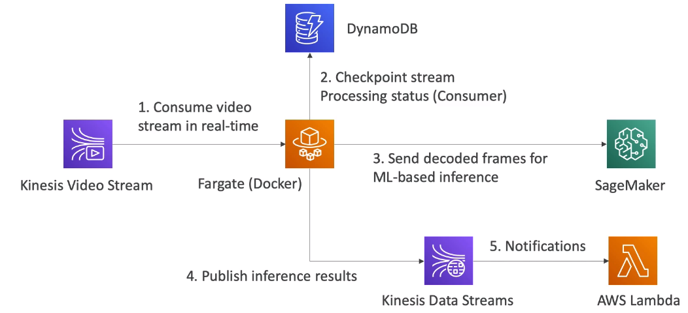


### Kinesis - ML
* **KDS** - create real-time machine learning applications
* **KDF** - ingest massive data near-real time
* **KDA** - real-time ETL / ML algorithms on streams
* **KVS** - real-time video stream to create ML applications


## Glue
* managed **ETL (Extract, transform, load)** service
* useful to prepare and transform data for analytics
* fully serverless
* example:
    * pull data from RDS / S3 into glue
    * execute scripts on data
    * load data into RedShift


### Glue - Data Catalog
* **Glue Data Catalog** - catalog of datasets that are available on your AWS account
    * metadata repository for all your tables:
        * automated schema inference
        * schemas are versioned
    * can be used with Athena/Redshift/EMR for `Schema & Data Discovery`
    * integrates with:
        * S3
            * `Partitions` -> will extract partitions base don how S3 data is organized 
            * think up fron how you will be querying data lake in S3
            * example:
                * devices send sensor data every hour
                * query by time ranges? -> `s3://my-bucket/dataset/yyyy/mm/dd/device`
                * query by device? -> `s3://my-bucket/dataset/device/yyyy/mm/dd`
        * RDS
        * DynamoDB
        * JDBC
    * **AWS Glue Data Crawler**
        * **runs on**: S3 / Redshift / RDS
        * **performs**: schema and partition inference
        * **formats**: JSON, Parquet, CSV, relational store
        * **when**: schedule or on demand
        * **auth**: IAM role / credentials to access data stores


### Glue - ETL
* framework for building ETL pipelines
    * generate ETL code in Python / Scala
    * provide own Spark / PySpark scripts
    * targets can be `S3` / `JDBC` (RDS, Redshift) / `Glue Data Catalog`
* fully managed / cost-effectuve / pay only for consumed resources
* jobs are run on a serverless Spark platform
* run with:
    * **Glue Scheduler** - schedule jobs
    * **Glue Triggers** - automate job runs based on events
* **Transformations** - built in transformation scripts
    * `Bundled Transformations`
        * `DropFields` / `DropNullFields` -> remove (null) fields
        * `Filter` - specify a function to filter records
        * `Join` - enrich data
        * `Map` - add fields / delete fields / perform external lookups
    * `Machine Learning Transformations`
        * `FindMatches ML` - identify duplciate / matching records in datasets
            * works even if records have `no common unique identifier` and `no fields match exactly`
    * `Format Conversions` - CSV / JSON / Avro / Parquet / ORC / XML
    * `Apache Spark` transformations (example: K-Means)


## Athena
* **Amazon Athena** - serverless query service to analyze data stored in Amazon S3
    * uses SQL (built on Presto)
    * supports `CSV`, `JSON`, `ORC`, `Avro`, and `Parquet` (built on Presto)
    * **pricing** - around $5.00 per TB of data scanned
    * can build reporting / dashboards on top of Athena through `Amazon QuickSight`
    * use cases include: `BI`, `Analytics`, `Reporting`, `Analyze & Query VPC Flow logs`, `ELB logs`, `CloudTrail trails` 
    * **Performance Improvement**
        * use **columnar data** for cost-savings (less scan)
            * `Apache Parquet` or `ORC` recommended for huge performance improvement
            * use `Glue` to convert your data to Parquet or ORC
        * **compress** data for smaller retrievals
            * `bzip2`, `gzip`, `lz4`, `snappy`, `zlip`, `zstd`
        * **partition** datasets in S3 for easy querying on virtual columns
            * ex: `s3://athena-examples/flight/parquet/year=1991/month=1/day=1/`
        * use **larger files** ( > 128 MB) to minimize overhead
    * **Federated Query** - can query data anywhere 
        * including relational, non-relational, object, custom data sources, AWS and on-premises
        * uses `Data Souce Connectors` that run on AWS Lambda to run Federated Queries (e.g. CloudWatch Logs, DynamoDB, RDS, ...)
    * can store results of query in S3 Bucket


## AWS Data Stores in ML
* `Redshift`
    * Data Warehousing
    * SQL Analytics
    * OLAP
    * import from S3
    * Redshift Spectrum to query S3 directly without importing
    * provision in advance
* `RDS / Aurora`
    * relational store
    * SQL -> OLTP
    * must provision servers in advance
* `DynamoDB`
    * NoSQL data store
    * serverless
    * provision read / write capacity
    * useful for storing machine learning model server by your application
* `S3`
    * object storage
    * serverless / inifite storage
    * integration with most AWS Services
* `OpenSearch`
    * indexing of data
    * search amongst data points
    * clickstream analytics
* `ElastiCache`
    * caching mechanism
    * not really used for ML


## AWS Data Pipelines
* **AWS Data Pipeline** - service to move data from a soruce to a target - ETL service
    * **Destinations** - S3, RDS, DynamoDB, Redshift, EMR
    * manages task dependencies
    * retries / notifies on failures
    * highly available
    * data sources may be on-premises
* **AWS Data Pipeline vs Glue**
    * `Glue`
        * apache spark code / scala / python -> focus on the ETL
        * do not worry about configuring / managing resources
        * data catalog helps make data available to other services -> Athena / Redshift Spectrum
        * uses AWS resources (does not create resources in youru account)
    * `Data Pipeline`
        * orchestration service
        * more control over the environmnet / compute resources that run code / code 
        * allows access to EC2 or EMR instances (creates resources in own account)


## AWS Batch
* **AWS Batch** - fully managed batch processing at any scale
    * good for cost optimization and less focus on infrastructure
    * **Batch Job** is a job that has a start and an end
        * you only submit / schedule batch jobs
        * efficiently run 100000s computing batch jobs
        * batch jobs are docker images that run on ECS
        * start with:
            * `Schedule` - using CloudWatch Events
            * `Orchestrate` - using AWS Step Functions 
    * **Provisioning** - load is accommodated by dynamically launching EC2 Instances or Spot Instances
        * AWS Batch is responsible for provisioning resources for executing batch jobs
        * optimal qunatity and type based on volume / requirements
        * only pay for underlying EC2 instances
    * **Batch vs Lambda vs Glue**
        * `Lambda` -> time limit, limited runtimes, limited temp disk space, serverless
        * `Batch` -> no time limit, **any runtime** that can be packaged in Docker, rely on EBS for disk space, managed service that relies on EC2
            * better for any non-ERL related work
        * `Glue`-> focus on ETL, no configuring / managing resources, make data available using Data Catalog


## DMS
* **DMS (Database Migration Service)** - allows migrating a *source DB* into a *target DB*
    * quick / secure / resilient / self healing tool for migrating DBs into AWS
    * source DB remains available during migration
    * Supports:
        * `homogeneous` migrations: Oracle to Oracle
        * `heterogeneous` migrations: MS SQL to Aurora
    * must create an EC2 instance to perform the replication tasks
    * **Sources**
        * on-premise and EC2 instance dbs: Oracle, MS SQL Server, MySQL, MariaDB, PostgreSQL, MongoDB, SAP, DB2
        * Azure: Azure SQL Database
        * Amazon RDS: all including Aurora
        * Amazon S3
        * Document DB
    * **Targets**
        * on-premise and ec2 instance dbs: Oracle, MS SQL Server, MySQL, MariaDB, PostgreSQL, MongoDB, SAP, DB2
        * RDS
        * Redshift, DynamoDB, S3
        * Kinesis Data Streams
        * Apache Kafka
        * DocumentDB & Amazon Neptune
        * Redis & Babelfish
    * **AWS Schema Conversion Tool (SCT)**
        * convert your Database Schema from one engine to another
        * example OLTP: SQL Server to MySQL / PostgreSQL / Aurora
        * example OLAP: Teradata to Amazon Redshift
        * do not need SCT if migrating to same DB engine
    * **Continuous Data Replication (CDC)**
        1. Perform Schema conversion from target to source
        1. setup AWS DMS Replication Instance in Public Subnet
        1. setup data migration from on premise to AWS DMS Replication Instance
* **AWS DMS vs Glue**
    * Continuous Data Replications
    * No data transformation
    * once data is in AWS, can use Glue to transform it


## Step Functions
* **Step Functions** - service for visual modeling workflows as state machines (one per workflow) and orchestrating these workflows
    * **key features**:
        * visually design workflows
        * advanced error handling & retry mechanism outside the code
        * audit history of workflows
        * ability to `Wait`
        * max execution time -> 1 year
    * **use cases**: 
        * order fullfillment
        * data processing
        * web apps
        * any workflow
    * **Workflow**
        * a workflow is defined in JSON
        * visualize the workflow / execution of the workflow / history of the workflow
        * start workflow with SDK, API Gateway, Event Bridge
    * **Workflow Types**
        * **Standard** - the default
            * `max duration`: 1 year
            * `execution model`: exactly-once execution
            * `execution rate`: over 2000 / s
            * `execution history`: up to 90 days or use CloudWatch
            * `pricing`: # of state transitions
            * `use cases`: non-idempotent actions(e.g., processing Payments)
        * **Express**
            * `max duration`: 5 min
            * `execution model`:
            * `execution rate`: over 1 000 000 / s
            * `execution history`: CloudWatch logs
            * `pricing`: # of executions / duration / memory consumption
            * `use cases`: IoT data ingestion, streaming data, mobile app backend, ...
            * flavors:
                * `Asynchronous`
                    * `execution model`: at-least-once
                    * doesnt wait for workflow to complete
                    * find result in CloudWatch logs
                    * must manage idempotence (same action can happen more then once due to execution model)
                    * use case: messaging services
                * `Synchronous`
                    * `execution model`: at-most-once
                    * waits for workflow to complete
                    * when you need an immediate response
                    * use case: orchestrate microservices
                    * can be invoked from API Gateway and Lambda function
                    * up to you to try again
    * **Task** - a unit within a workflow that does some work
        * the Step Function invokes an AWS Service like:
            * `Lambda function`
            * `AWS Batch Job` 
            * insert data from `DynamoDB`
            * publish message to `SNS`/`SQS`
            * launch another `Step Function` workflow
        * an **Activity** polls a Step Function
            * enables to have Task work performed by an `Activity Worker`
            * an activity worker can run on:
                * `EC2`
                * `Amazon ECS`
                * `on-premises`
                * `Lambda`
                * `mobile device`
            * an activity worker polls for a Task using `GetActivityTask` API
            * after it completes its works send response to step function -> `SendTaskSuccess` / `SnedTaskFailure`
            * process:
                1. polls task for work
                1. task has work
                1. task send `input` and `TaskToken`
                1. Activity Worker performs task
                1. sends back `output` & `TaskToken` & task status(success / failure)
            * to keep task active:
                * `TimeoutSeconds` - how long task can wait
                * `SendTaskHeartBeat` and `HeartBeatSeconds` to periodically send a heartbeat from your Activity Worker
                * by configuring long TimoutSeconds and actively sending a heartbeat, Activity Task can wait up to 1 year!
    * **States**
        * `Choice State` - test for a condition to send to a branch (or default branch)
        * `Fail or Succeed State` - stop execution with failure or success
        * `Pass State` - simply pass its input to its output or inject some fixed data, without performing work
        * `Wait State` -  provide a delay for a certain amount of time or until a specified time/date
        * `Map State` - dunamically iterate steps
        * `Parallel State` - begin parallel branches of execution


## Full Data Engineering Pipelines

### Real-Time Layer
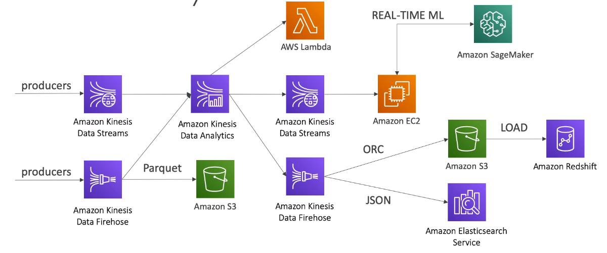

### Video Streaming Layer
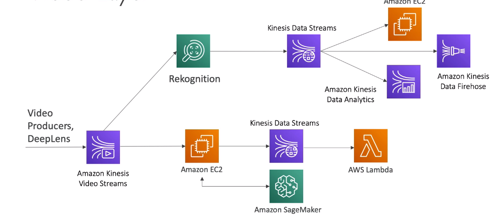

### Batch Layer
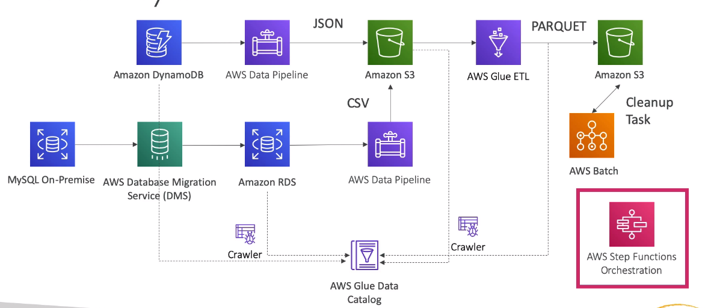

### Analytics Layer
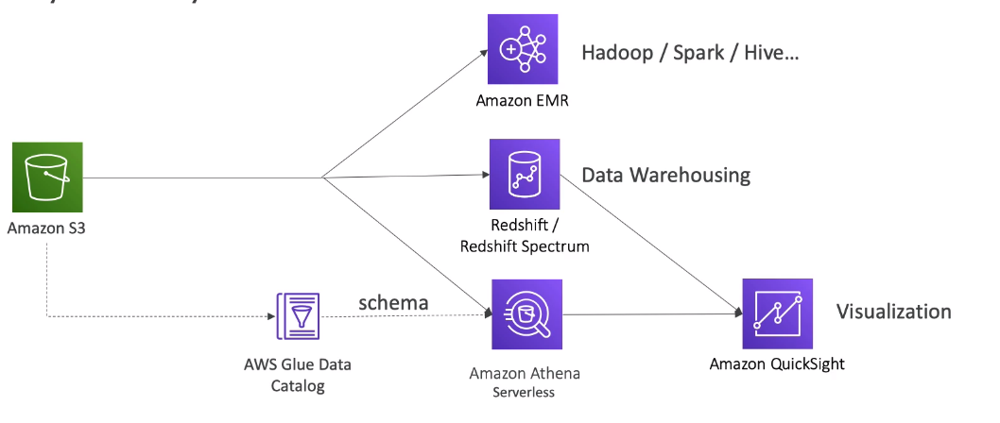


## AWS DataSync & MQTT
* **AWS DataSync** - move large amounts of data from on-premises to AWS
    * can synchronize on-premise other-cloud to AWS (NFS, SMB, HDFS, S3 API,...) -> agent needed
    * can synchronize AWS to AWS (different storage services) -> no agent needed
    * can synchronize to:
        * Amazon S3
        * Amazon EFS
        * Amazon FSx (Windows, Lustre, NetApp, OpenZFS)
    * replication can be `scheduled` hourly / daily / weekly
    * replication tasks are **incremental** after the first full load
    * **Unique for this service** -> file permissions and metadata are preserved (NFS POSIX, SMB, ...)
    * one agent task can use `10 Gbps`, can setup bandwidth limit
    * data is encrypted and validated - dont need to worry about corruption
    * setup: DC Server connects through *AWS DataSync Agent* which conects to *AWS DataSync* which moves data into various AWS Storage Resources
    * `AWS Snowcone` has DataSync agent pre-installed
* **MQTT**
    * standard lightweight messaging protocol used for IOT
    * AWS IoT Device SDK can connect via MQTT
    * large anmounts of sensor data from peripheral devices could be sent using MQTT to your ML models


&nbsp;
# Exploratory Data Analysis
Understand your data before training with it


## Python in Data Science and Machine Learning
* **Pandas** - python library for slicing and dicing your data
    * `DataFrames` - a table
    * `Series` - a one dimenional array
    * interoperates with `numpy`
* **Matplotlib** - python library for visualizing data
* **Seaborn** - python library built on matplotlib with enhanced capabilities
* **scikit_learn** - python library for machine learning models
* **jupyter notebook** - tool for running code and documenting it


## Types of Data
* **Numerical**
    * represents some sort of quantitative measurement
    * example: heights of people, page load times, stock prices, etc.
    * `Discrete Data` -> integer based, often counts of some event
        * how many purchases in a year>
        * how many time di I flip heads?
    * `Continuous Data` -> has an inifinite number of possible values
        * how much time did it take for user to check out?
        * how much rain fell on a given day
* **Categorical**
    * qualitative data that has no inherent mathematical meaning
        * gender, binary data, Race, State of Residence, Product Category, Political Party, etc
    * can assign numbers to catagories in order to represent more compactly
* **Ordinal**
    * categorical data that has mathematical meaning
    * example: ratings of a movie on a 1-5 scale


## Data Distributions
* the likelihood your data falls into a specific range
* `normal distribution` - bell curve distribution centered around the mean of your data set
* `probability distribution function` - the probabilities of a data point falling within some given range of given values when dealing with continuous data
* `probability mass function` - the probabilities of given discrete values happening in a data set
* `poisson distribution` - specific discrete distribution based on poisson experiments
* `poisson experiments` - series of events that results in success or failure, where average of success over time/distance is known, allowing to calculate the probability of success/failure in following days
* `binomial distribution` - descrete probability distribution that describes the number of successes in a sequence of experiments with a yes / no question
    * like flipping a coin
* `bernoulli distribution` - special case of binomial distribution
    * has a single trial ( n = 1 )
    * can think of a binomial distribution as the sum of Bernoulli distributions


## Time Series: Trends and Seasonality
* `time series` -> discrete samples taken over discrete points in time over a period of time
* `trends` -> a direction in which discrete values within a time series will go
* `seasonality` -> fluctuations of discrete values during recurring periods within a time series
* `noise`
    * some variations are jsut random in nature
    * `seasonality` + `trends` + `noise` = `time series`
        * additive model
        * seasonal variation is constant
    * sometimes -> `seasonality` * `trends` * `noise` -> trends sometimes amplify seasonality and noise
        * multiplicative model
        * seasonal variation increases as the trend increases


## Amazon Athena
* **Amazon Athena** - serverless query service to analyze data stored in Amazon S3
    * **features**:
        * uses SQL (built on Presto)
        * supports `CSV`, `JSON`, `ORC`, `Avro`, and `Parquet` (built on Presto)
        * works with unstructered / semi-structured / structured data
        * can store results of query in S3 Bucket
    * **use cases**:
        * can build reporting / dashboards on top of Athena through `Amazon QuickSight`
        * use cases include: `BI`, `Analytics`, `Reporting`, `Analyze & Query VPC Flow logs`, `ELB logs`, `CloudTrail trails`
        * ad-hoc queries of web logs
        * querying staging data before loading to Redshift
        * analyze CloudTrail / CloudFront / VPC / ELB etc logs in S3
        * integration with Jupyter / Zeppelin / RStudio notebooks
        * integration with QuickSight
        * integration via ODBC / JDBC with other visualization tools
    * **pricing**
        * `pay-as-you-go` -> around $5.00 per TB of data scanned
        * `success` / `cancelled` queries -> `cost`
        * `failed` queries -> `no cost`
        * `DDL` -> `no cost`
        * big savings by compressing data
        * big saving swith columnar fomats -> ORC / Parquet -> 30-90% savings & better performance
        * Glue & S3 have their own charges
    * **security**
        * `access control`
            * IAM / ACLs / S3 Bucket Policies
            * `AmazonAthenaFullAccess` / `AWSQuicksightAthenaAccess`
        * `encryption`
            * at rest in S3 staging dir -> options are SSE-S3 / SSE-KMS / CSE-KMS
            * in transit -> TLS between Athena & S3
        * `cross-account` -> specify access for other accounts in S3 bucket policy
    * **Performance Improvement**
        * use **columnar data** for cost-savings (less scan)
            * `Apache Parquet` or `ORC` recommended for huge performance improvement
            * use `Glue` to convert your data to Parquet or ORC
        * **compress** data for smaller retrievals
            * `bzip2`, `gzip`, `lz4`, `snappy`, `zlip`, `zstd`
        * **partition** datasets in S3 for easy querying on virtual columns
            * ex: `s3://athena-examples/flight/parquet/year=1991/month=1/day=1/`
        * use **larger files** ( > 128 MB) to minimize overhead
        * use with Glue to get data schema and transform data to columnar types for cost optimization
    * **NOT FOR**:
        * highly formatted reports -> use QuickSight for that
        * ETL -> use Glue instead


## Amazon QuickSight
* **Amazon QuickSight** - serverless machine learning powered BI service for creating interactive dashboards
    * **features**:
        * fast / automatically scalable / embeddable / per-session pricing
        * easily used by non-technical users
        * **ML insights**
            * anomaly detection (uses random cut forest)
            * auto-narratives (build stories about data)
            * forecasting (seasonality / trends)
        * **Quicksight Q**
            * answers business questions with NLP, like "what are top-selling items in Florida?"
            * offered as an add-on for given regions
            * personal traiing on how to use it is required
            * you need to tell quicksight which data points represent what(ex. this is the sales column) 
            * setup `topics` associated with `datasets`
                * datasets and fields must be NLP-friendly
                * how to handle dates must be deifned
        * **QuickSight Pagianted Reports**
            * reports designed to be printed
            * may span many pages
            * can be base don existing QuickSight dashboards
            * new feature - introduced in Nov 2022
        * **Enterprise Edition**
            * encryption at rest
            * MS AD integration
            * column level security
    * **use cases**: 
        * Business analytics
        * building visualizations
        * perform interactive ad-hoc analysis & exploration
        * dashboards & KPIs
        * get business insights using data
        * use on any device (browsers / mobile)
    * **integrations**: 
        * AWS
            * RDS, Aurora
            * Athena
            * Redshift
            * S3
            * OpenSearch
            * Timestream
            * EC2 hosted DBs
            * AWS IoT Analytics
        * SAAS -> `Jira`, `Salesforce`
        * 3rd Party DBs -> `teradata`, `JDBC`
        * File imports -> `XLSX`, `CSV`, `JSON`, `.TSV`, `ELF & CLF`  
        * allows limited ETL for data preparation
    * **security**:
        * MFA
        * VPC connectivity -> add QuickSights IP address range to your database security groups
        * row-level security
        * `Enterprise Edition` - possibility to setup `Column-Level security (CLS)` - access rights to specific columns
        * Private VPC access
            * ENI
            * AWS Direct Connect
    * **users**
        * can define users via IAM or email signup
        * define `Users` (standard version) and `Groups`(enterprise version)
        * Users and Groups only exist within QuickSight (not IAM)
        * SAML-based SSO
        * Active Directory integration (Enterprise Edition)
        * MFA
    * **SPICE Engine**
        * in-memory computation for data imported into QuickSight
        * super-fast / parallel
        * uses columnar storage
        * accelerates interactive queries on large datasets
        * 10 GB of SPICE memory per user
        * highly available / durable
        * scales to 100 000 users at once
    * **Dashboard** -> shareable read-only snapshot of an analysis, preserves configuration of analysis(filtering, parameters, controls, sort)
        * can share with Users and Groups
        * must publish before sharing
        * users who see the dashboard can also see underlying data
    * **pricing**
        * `annual subscription` -> standard / enterprise / enterprise with Q -> payed $ / per user / per month
        * `month to month` -> standard / enterprise / enterprise with Q -> payed $ / per user / per month
        * `extra SPICE capacity (beyond 10 GB)` -> standard / enterprise / GB / month
        * additional charges for:
            * paginated reports
            * alerts
            * anomaly detection
            * Q capacity
            * readers
            * reader session capacity


## QuickSight Visualization Types
* includes:
    * `AutoGraph`
    * `Bar Charts`
    * `Line Graphs & Area Line Graphs`
    * `Scatter Plots` & `Heat Maps`
    * `Pie Graphs` & `Tree Maps` - for visualizing aggregation
    * `Pivot Tables` - aggregate tabular data in arbitrary ways
    * `KPIs` - comparing key value to its target value
    * `Geospatial Charts`
    * `Donut Charts`
    * `Guage Charts` - for showing how much of a single value -> like MPH in car
    * `Word Clouds` - frequency of words or phrases in dataset

### AutoGraph
Selects best type of visualization based on the data and relationships -> doesnt always get it right

### Bar Charts
For visualizing comparison and distribution (histograms)

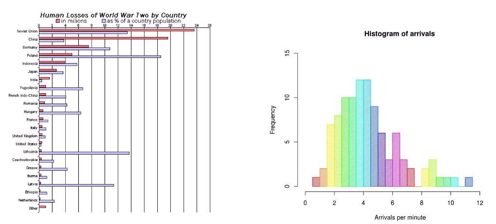

### Line Graphs & Area Line Graphs
For visualizing changes over time

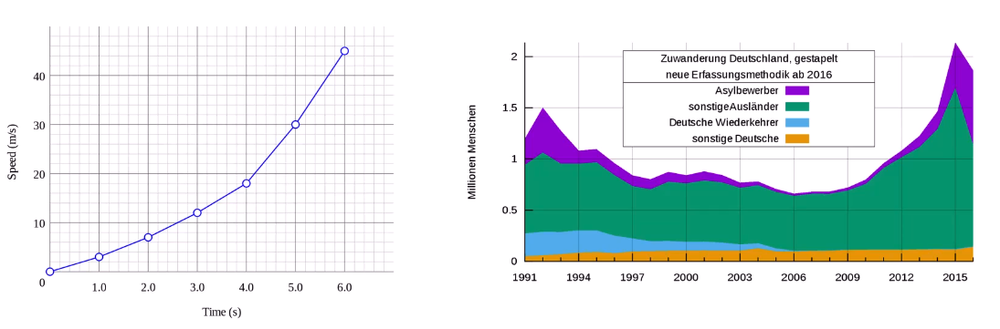

### Scatter Plots && Heat Maps
For visualizing correlation

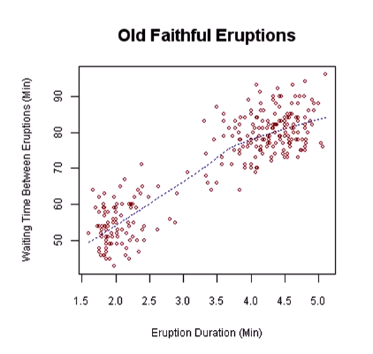
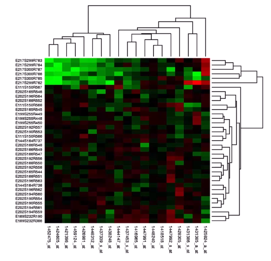

### Donut Charts
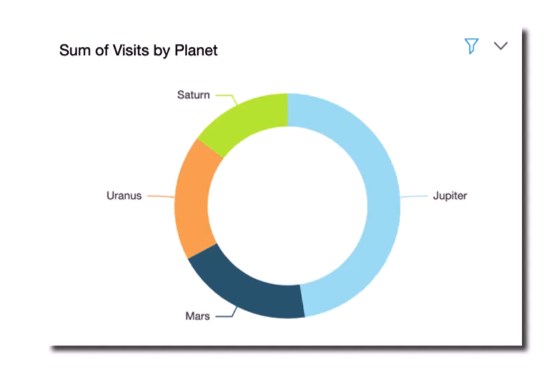

### Tree Maps
For visualizing aggregation. Like what webpack presents

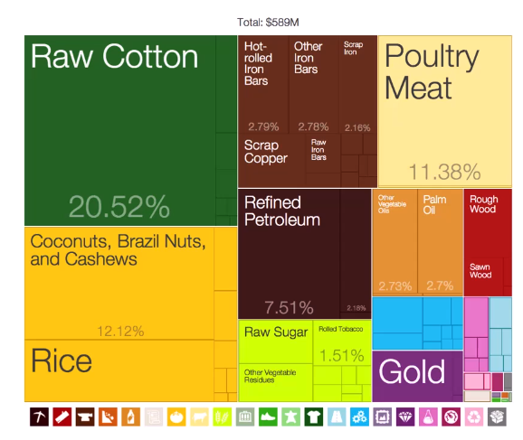

### Pivot Tables
Visualizing aggregate tabular data in arbitrary ways

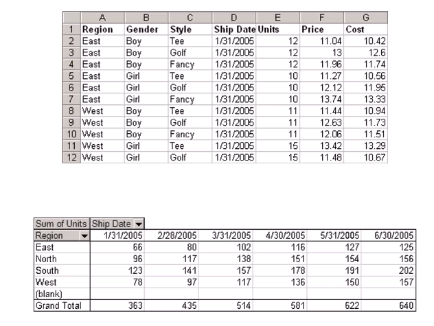

### KPI
Visualizing how a key value compares to its target value (like 80% of target sales per month)

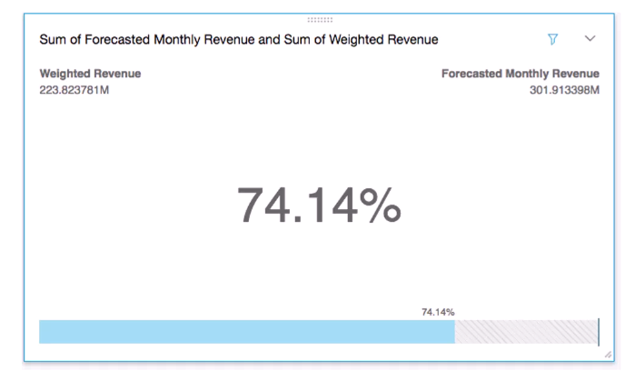

### Geospatial Charts
Visualize data based on geospatial information

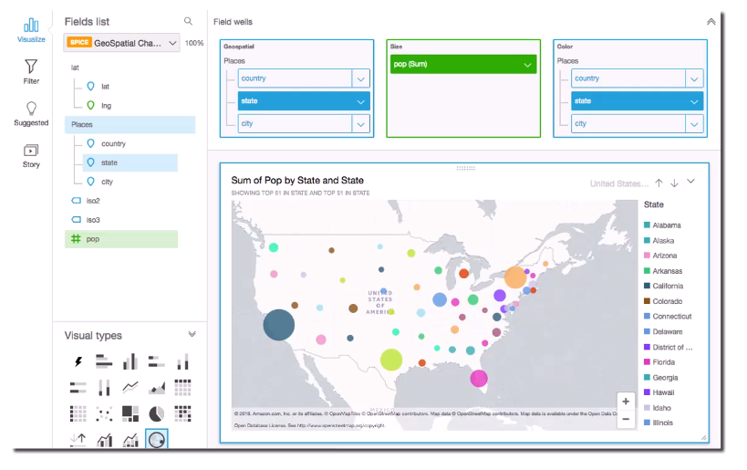


### Word Clouds
Visualize frequency of words or phrases in dataset

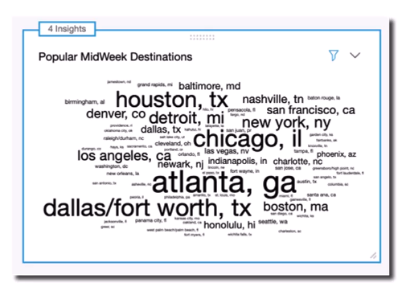


## EMR
* **EMR** - stands for `Elastic MapReduce` and is a managed Hadoop framework on EC2 instances
    * includes `Spark`, `HBase`, `Presto`, `Flink`, `Hive` & more
    * EMR Notebooks
    * several integration points with AWS
* **EMR Cluster**
    * collection of EC2 instances
    * consists of 3 types of nodes that communicate with eachother:
        * **Master Node** or **Leader Node** - manages the cluster -> single EC2 instaces
        * **Core Node** -  hosts HDFS (Hadoop Distributive File System) data and runs tasks
            * can be scaled up / down -> with some risk
        * **Task Node** - runs tasks, does not host data
            * no risk of data loss when removing
            * good use of `spot instances`
* **EMR Usage**
    * **Transient Cluster** - terminated once all steps defined on the cluster are completed
        * good use of spot instances for $ savings
        * use cases:
            * loading input data
            * processing input data
            * storing result of output
            * shutting down cluster
    * **Long-Running Cluster** - allows interacting with applications on cluster directly, need to terminate manually
        * good use of reserved isntances for $ savings
        * use cases:
            * ad hoc queries
            * experimenting with datasets
    * when running a cluster select `applications` & `frameworks` you need for data processing at the time
    * **run jobs**
        * by connecting to master node directly
        * by submitting ordered steps via the console
* **Integrations**
    * `EC2` -> for instances that comprise nodes in the cluster
    * `VPC` -> to configure the virtual network in which you launch your instances
    * `S3` -> store input & output data
    * `CloudWatch` -> monitor cluster performance and configure alarms
    * `IAM` -> configure permissions
    * `CloudTrail` -> audit requests made to the service
    * `Data Pipeline` -> schedule / start clusters
* **EMR Storage**
    * `HDFS`
        * default storage
        * distributed scalable file system for hadoop
        * distributes stored data across every instance in your cluster
        * stores `multiple copies` of data on different instances - for failure resilience
        * every file stored as `blocks`
        * default block size = 128 MB
        * `ephemeral` storage
        * much faster
    * `EMRFS`
        * access S3 as if it were HDFS
        * `EMRFS Consisten View` -> optional for S3 consistency
        * uses `DynamoDb` to track consistency
        * durable storage
        * slower than HDFS but also fast
    * `Local File System`
        * not distributed
        * ephemeral
        * most good for staging data on the master node
    * `EBS for HDFS` - provide durability for HDFS with EBS
* **EMR promises**
    * charges by the hour -> plus EC2 charges
    * provisions new nodes if a core node fails
    * can add and remove task nodes on the fly
    * can resize a running cluster's core nodes


### EMR - Apache Spark
* **Hadoop**
    * `Hadoop Core` or `Hadoop Common` - libraries and utilities that Hadoop Modules run on top off that allow abstracting the Hadoop Cluster from the OS
    * `HDFS`
        * Hadoop Distributed File System
        * distribtues stored data across the cluster
        * provides multiple copies of the data
        * ephemeral
        * great for caching temp results
    * `YARN`
        * Yet Another Resource Negotiator
        * centrally manages cluster resources from multiple data processing frameworks
        * enables us to use things other than MapReduces
    * `MapReduce`
        * software framework for easily writing applications that:
            * process vasts amounts of data
            * work in parallel
            * work on large clusters
            * work in a reliable manner
        * **map** functions
            * `transform` / `prepare` data
            * do things like:
                * transform data
                * reformat data
                * extract needed data
            * relevant for exploratory data analysis
        * **reduce** functions:
            * `aggregate` data
            * combine intermediate results
            * apply additional algorithms on combined data
            * produce final output
* **Apache Spark** - opensoruce distributed processing system used for big data workloads
    * can sit on top of Hadoop Cluster and use YARN to provide faster alternative to MapReduce
    * **utilizes**:
        * in-memory caching
        * optimized query execution for fast analytical queries
        * uses acyclic graph which provides increased speed over MapReduce 
    * **APIs** for:
        * Java
        * Scala
        * Python
        * R
    * **supports**:
        * code reuse across multiple workloads
    * **not used** - for OLTP and batch processing
    * **used for**:
        * transforming data as it comes in
    * **how it works**
        * `Driver Program / Spark Context` - code that you run to make spark job run
            * connects to different Cluster Managers & directly to Executors
        * `Cluster Manager` - allocate resources across applications
        * `Executors` - processes that run computation and store data for applications (Cache + Tasks)
            * run on nodes
            * are required by Cluster Manager
            * Spark Context sends tasks to Executors to run
    * **components**
        * **Spark Core** - foundation for platform
            * responsible for:
                * memory management
                * fault recovery
                * scheduling
                * distributing jobs
                * monitoring jobs
                * interacting with storage systems
                * contains APIs
            * uses `RDD - Resilient Distributed Dataset`
                * represents a logical collection of data
                * paritioned across compute nodes
        * **Spark Streaming** - real-time solution or streaming analytics
            * data ingested in mini batches on which you can run analytics code -> use code creatd for batch processing!
            * leverages Spark Core's  fast scheduling capabilities
            * support ingestion from:
                * `Twitter`
                * `Kafka`
                * `Flume`
                * `HDFS`
                * `ZeroMQ`
                * `AWS Kinesis` - can build a Spark dataset built on top of KDS
            * creates an unbounded Input Table that can be queried with a specific timeframe 
        * **Spark SQL** - distributed querying engine up to 100 times faster than MapReduce
            * **features**:
                * cost based optimizer
                * columnar storage
                * code generation for fast queries
                * support querying Hive tables using HiveQL
            * supported **data sources**:
                * JDBC
                * ODBC
                * JSON
                * HDFS
                * Hive ORC
                * Parquet
            * **exposes**:
                * `dataframe` for Python
                * `dataset` for Scala
        * **MLLib** - machine learning library for Spark
            * offers many popular ML algorithms all built in a way that is `distributed` & `scalable`
            * not all algorithms are compatible with parallel processing
            * **tools for**:
                * `Classification` -> logistic regression, naive Bayes
                * `Regression`
                * `Decision Trees`
                * `Recommendation engine (ALS)`
                * `Clustering (K-Means)`
                * `LDA (topic modeling)`
                * `ML workflow utilities` -> pipelines / feature transformation / persistence
                * `SVD, PCA, statistics`
        * **GraphX** - distributed graph data structure processing framework (like social network)
            * provides:
                * ETL
                * exploratory analysis
            * iterative graph computation to enable interactive building / transforming of graphs
        * **Zeppelin** - browser based notebook environment in which you can run Spark code interactively
            * speed up dev lifecycle
            * allows easy experimentation / exploration of big data
            * can execute SQL queries directly against SparkSQL
            * query results may be visualized in charts / graphs
            * makes spark feel like a DS tool


### EMR - Notebooks, Security & Instance Types
* **EMR - Notebook** - browser based notebook environmnet for big data with AWS integrations
    * notebooks `backed up` in S3
    * `provision clusters` from the notebook
    * hosted `inside` a `VPC`
    * only available in AWS console
    * supports: `Python`, `PySpark`, `Spark SQL`, `SparkR`, `Scala`
    * prepackaged with open-source graphical libraries from Anaconda
    * notebook itself does not run on cluster
    * allows multiple users to collaborate on a an Apache Spark Cluster
    * no additional charge
* **EMR - Security**
    * `IAM Policies` -> can combine with tagging to authorize on a per-cluster basis
    * `Kerberos` -> ensures credentials arent sent over network in unencrypted format -> EMR 5 and later support
    * `SSH` -> connect to CLI in cluster nodes, use Kerberos or EC2 key pairs for authentication
    * `IAM Roles` -> control how EMR accesses other AWS services
        * every cluster must have `service role`
        * every EC2 node must have `instance profile` role
        * roles fro `EMRFS` acces to `S3`
    * `Lake Formation` - if cluster automatically created through Lake Formation, can you JSON snippet for security configurations
    * `Apache Ranger` - open-source tool for security on Hadoop / Hive that can be natively integrated with EMR
* **EMR - Instance Types**
    * **Master node** -> `m4.large` < 50 nodes; `m4.xlarge` > 50 nodes
    * **Core & Task nodes**
        * `m4.large` usually optimal
        * `t2.medium` - if waits a lot on external dependencies
        * `m4.xlarge` for improved performance
        * considerations:
            * `Computation-intensive applications` -> high CPU instances
            * `Database, memory-caching applications` -> high memory instances
            * `Network / CPU-intensive (NLP / ML)` - cluster computer instances
            * `Accelerated Computing / AI` - GPU instances (g3, g4, p2. p3)
    * **Spot instances**
        * good for task nodes
        * can use for `core` & `master` if:
            * `cost-sensitive`
            * `testing`
            * accept possible `partial data loss`


## Feature Engineering & Dimensionality
* **Feature Engineering** - applying your knowledge of the data / model to create better features to train your model with
    * **example** - How much money do ppl make? Features:
        * height
        * age
        * social status
        * weight
        * what kind of car they drive
    * **questions**
        * Which features should I use?
        * Do I need to transform these features in some way?
        * How do I handle missing data?
        * Should I create new features from the existing ones?
    * **quote** - "Applied machine learning is basically feature engineering" ~ Andrew Ng
    * **considerations**
        * cant throw in raw data and expect good results
        * art of machine learning -> where expertise is applied
* **The Curse of Dimensionality**
    * too many features = sparse data
    * every feature = new dimension
    * feature engineering = selecting features relevant to problem
    * can use `unsupurvised dimensionality reduction` techniques to distill features
        * `PCA`
        * `K-Means`
    * from a performance standpoint -> new dimensions create a lot of new possible combinations


## Imputing Missing Data
* **Inpute** - assign to something by inference
* multiple techniques of handling missing data:
    * **Mean Replacement** - replace missing values with the mean value from rest of `column`
        * `column` represents a single feature
        * **benefits** - fast / easy / wont affect mean / sample size
        * **downside** - generally considered poor technique because:
            * only works on column lelvel -> missees correlations between features
            * cant use on categorical features (median can work in this case)
            * not accurate
        * **Median Replacement** - replace missing values with the median value from rest of `column`
            * better then mean replacement if outliers are present
    * **Dropping** - remove rows with missing data
        * might be ok if:
            * small amount of rows with missing data
            * dropping doesnt bias data
            * need a quick solution
        * never going to be the best approach
        * almost any technique is better
    * **Machine Learning Techniques**
        * `KNN` -> Find K `nearest` (most similar) rows and average their values
            * `K` is a collection of the most similar rows to the one with missing data
            * best for numerical data
            * `Hamming distance` - way to handle categorical data but not as good as other methods
        * `Deep Learning`
            * build ML model to impute data for your ML model
            * works really well for categorical data
            * complicated approach
            * lot of computational effort
        * `Regression`
            * find linear or non-linear relationships between the missing feature and other features
            * `MICE` -> Multiple Imputation by Chained Equations -> most advanced technique
    * **Get More Data** - collect more data to replace rows with missing data


## Dealing with Unbalanced Data
* **Unbalanced Data** - large discrepancy bewtween `positive` and `negative` cases in data
    * **example** - fraud detection, most rows will not be fraudulent
    * **meaning** - `positive` is containing the thing you are testing for, like fraud in the example
    * bug problem for Neural Networks
* solutions:
    * **Oversampling** - duplicate samples from minority class, can be done at random
    * **Undersampling** - remove samples from majority class
        * throwing data away is usually not the way to go
        * useful when specifically trying to avoid `big data scaling issues`
    * **SMOTE** - Synthetic Minority Over-sampling TEchnique
        * artificially generate new samples of the minority class using nearest neighbors
            * run KNN of each sample of the minority class
            * create new sample from the KNN result (mean of the neighbors)
        * generates new samples & undersamples majority class
        * generally bettern than oversampling
    * **Adjusting thresholds** - change thresholds that determine whether a case is positive
        * `increase threshold` = helps fix if too many false positives
        * `decrease threshold` = helps fix if too many false negatives


## Handling Outliers
* **Variance** - measures how `spread-out` the data is
    * `σ2` -> the average of the squared differences from the mean
* **Standard Deviation** - the square root of the variance
    * often used to identify outliers
    * data points that lie one or more standard deviation from the mean can be considered unusual
    * how `extreme` a data point is = how many `sigmas` away from the mean it is
* **Outlier** - remove or leave outliers responsibly -> understand why
    * **examples**
        * `leave` - web log data, outlier is bot
        * `remove` - single user who rates thousands of movies
        * `leave` - billionaires for mean income
* **Handling Outliers**
    * classify outliers using `standard deviation`
    * find data points more than some multiple of standard deviation in training data
    * `AWS Random Cut Forest algorithm` -> available feature in many AWS services to remove outliers
        * QuickSight
        * Kinesis Analytics
        * SageMaker
        * more

Variance and standard deviation in python:
```python
import statistics
import math

def variance(data):
    # Number of observations
    n = len(data)
    # Mean of the data
    mean = sum(data) / n
    # Square deviations
    deviations = [(x - mean) ** 2 for x in data]
    # Variance
    variance = sum(deviations) / n
    return variance

def variance(data, ddof=0):
    n = len(data)
    mean = sum(data) / n
    return sum((x - mean) ** 2 for x in data) / (n - ddof)

# variance of population ~ 5.7600000001
statistics.pvariance([4, 8, 6, 5, 3, 2, 8, 9, 2, 5])

# variance of sample -> uses n -1 isntead of n -> 6.4
statistics.variance([4, 8, 6, 5, 3, 2, 8, 9, 2, 5])

def std(var):
    return math.sqrt(var)
```

Handling outliers in python:
```python
import numpy as np

incomes = np.random.normal(27000, 15000, 10000)
incomes = np.append(incomes, [10000000000])

import matplotlib.pyplot as plt
plt.hist(incomes, 50)
plt.show()

def reject_outliers(data):
    u = np.median(data)
    s = np.std(data)
    filtered = [e for e in data if (u - 2 * s < e < u + 2 * s)]
    return filtered

filtered = reject_outliers(incomes)

plt.hist(filtered, 50)
plt.show()
```

## Binning, Transforming, Encoding, Scaling & Shuffling
* **Binning** - group observations together base don ranges of values into `buckets`
    * **example**: by age, 2x in one, 3x in another
    * `quantile binning` - categorize data by their place in the data distribution -> ensures even sizes of bins
    * transforms `numeric` data -> `ordinal` data
    * **use cases**
        * dealing with uncertainty -> like 20.37 years old and 20.78 years old -> both to 20 bin    
        * whn you want to use ordinal data in place of numerical -> but at cost of precision
* **Transforming** - apply functions to features to make them better suited for training
    * feature data with `exponential trend` -> may benefit from `logarithmic transform`
    * sometimes you can create new features with transformations
* **Encoding** - transfor
* **Scaling** - 
* **Shuffling** - 

## SageMaker - Ground Truth & Label Generation


## Preparing Data for TF-IDF with Spark and EMR


&nbsp;
# Modeling - General Deep Learning and Machine Learning


## Introduction to Deep Learning


## Activation Functions


## Convolutional Neural Networks


## Recurrent Neural Networks


## Modern NLP with BERT & GPT & Transfer Learning


## Deep Learning on EC2 and EMR


## Tuning Neural Networks


## Regularization - Dropout & Early Stopping
* **Dropout** - 
* **Early Stopping** - 


## Regularization - L1 & L2


## Grief with Gradients: The Vanishing Gradient Problem


## The Confusion Matrix


## Precision, Recall, F1, AUC


## Ensemble Methods: Bagging & Boosting


&nbsp;
# Modeling - Amazon SageMaker


## SageMaker - Introduction


## SageMaker - Linear Learner


## SageMaker - XGBoost


## SageMaker - Seq2Seq


## SageMaker - DeepAR


## SageMaker - BlazingText


## SageMaker - Object2Vec


## SageMaker - Object Deletion


## SageMaker - Image Classification


## SageMaker - Semantic Segmentation


## SageMaker - Random Cut Forest


## SageMaker - Neural Topic Model


## SageMaker - Latent Dirichlet Allocation (LDA)


## SageMaker - K-Nearest-Neighbors (KNN)


## SageMaker - K-Means Clustering


## SageMaker - Principal Component Analysis


## SageMaker - Factorization Machines


## SageMaker - IP Insights


## SageMaker - Reinforcement Learning


## Automatic Model Tuning


## SageMaker - Apache Spark


## SageMaker - Studio & Experiments


## SageMaker - Debugger


## SageMaker - Autopilot & AutoML


## SageMaker - Model Monitor


## Deployment Guardrails & Shadow Tests


## JumpStart, Data Wrangler, Features Store & Edge Manager


## SageMaker - Canvas


## SageMaker - Bias Measures in Canvas


## SageMaker - Training Compiler


&nbsp;
# Modeling - High-Level ML Services


## Amazon Comprehend


## Amazon Translate


## Amazon Transcribe


## Amazon Polly


## Amazon Rekognition


## Amazon Forecast


## Amazon Forecast Algorithms


## Amazon Lex


## Amazon Personalize


## Textract, DeepLens, DeepRacher, Lookout & Monitron


## TorchServe, AWS Neuron & AWS Panorama


## Deep Composer, Fraud Detection, CodeGuru & Contact Lens


## Amazon Kendra & Amazon Augmented AI (A2I)


&nbsp;
# Tuning a Convolutional Neural Network on EC2


&nbsp;
# ML Implementation and Operations


## SageMaker - Inner Details and Production Variants


## SageMaker - Edge: SageMaker Neo and IoT Greengrass


## SageMaker - Security: Encryption at Rest & In Transit


## SageMaker - Security: VPC, IAM, Logging, Monitoring


## SageMaker - Resource Management: Instance Types & Spot Training


## SageMaker - Resource Management: Elastic Interference, Automatic Scaling & AZs


## SageMaker - Serverless Inference & Inference Recommender


## SageMaker - Inference Pipelines


## MLOPs with SageMaker, Kubernetes, SageMaker Projects & SageMaker Pipelines


## Lab - Tuning, Deploying & Predicting with Tensorflow on SageMaker