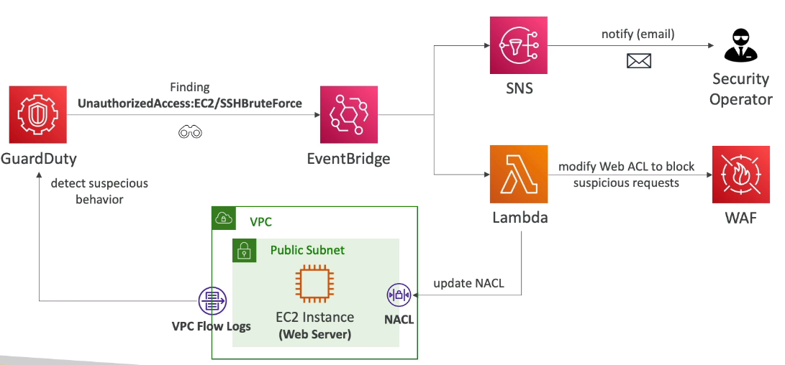
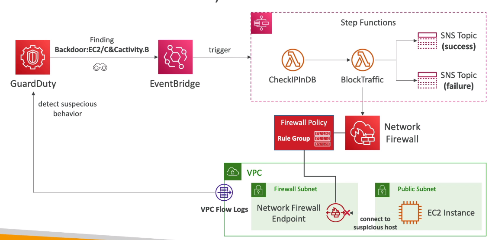
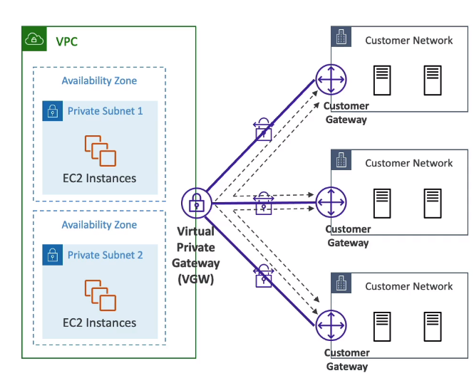
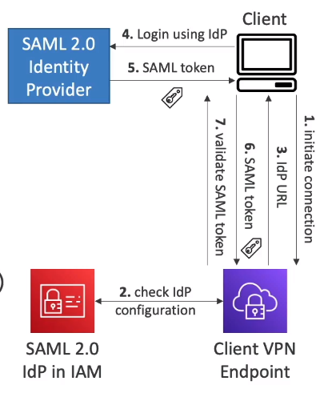
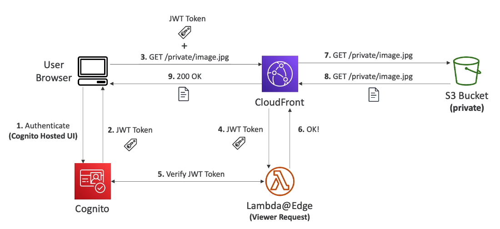
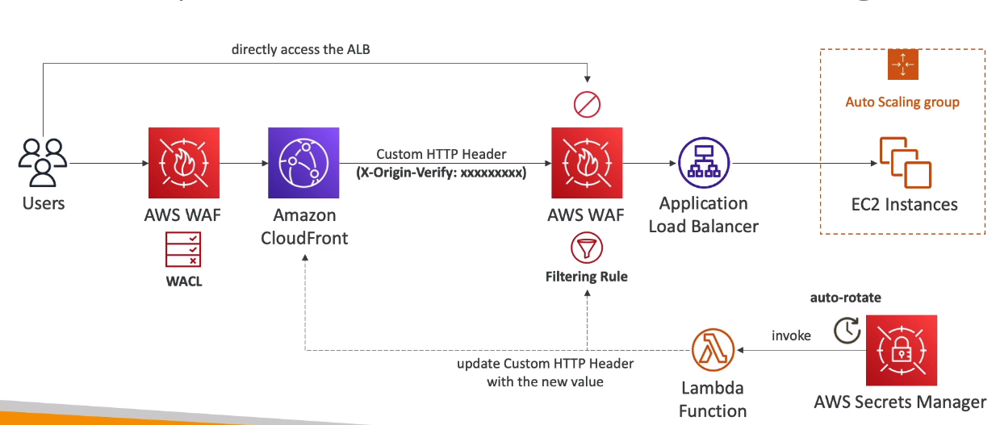
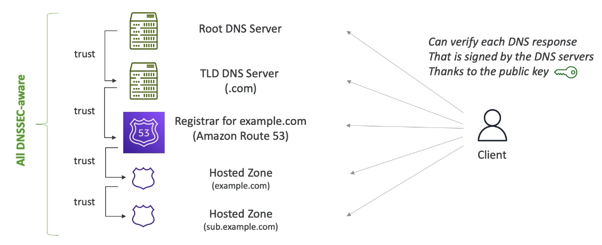
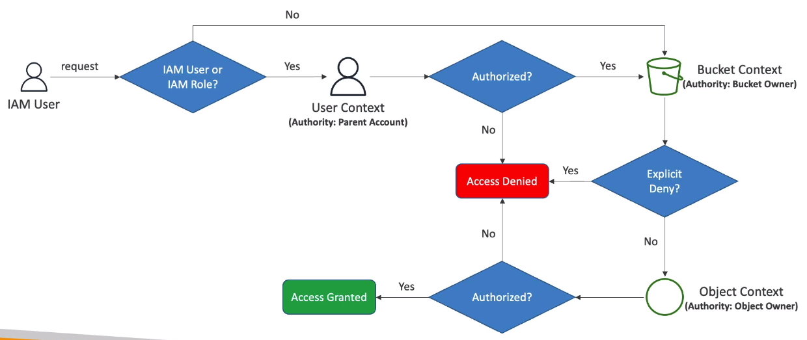
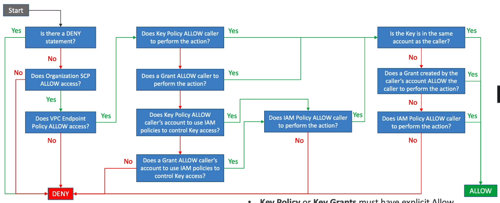
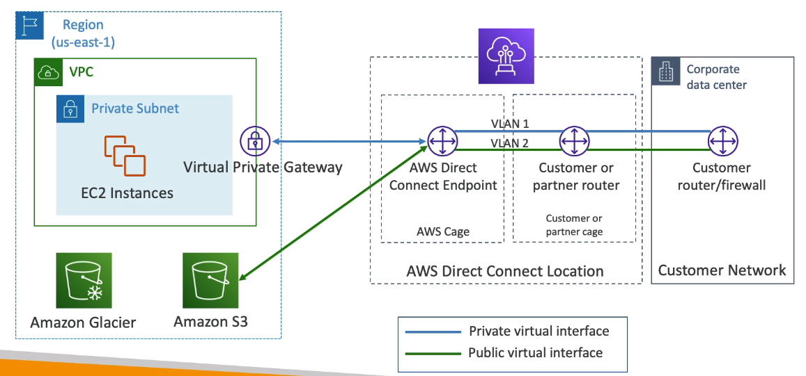

# AWS Certified Security Specialty

#### Table of contents

* [Terminology](#terminology)
* [Incident Response](#incident-response)
    * [GuardDuty](#guardduty)
        * [GuardDuty - Advanced](#guardduty---advanced)
        * [GuardDuty - Architectures](#guardduty---architectures)
    * [Security Hub](#security-hub)
        * [Security Hub - Advanced](#security-hub---advanced)
    * [Detective](#detective)
    * [Penetration Testing](#penetration-testing)
    * [Compromised AWS Resources](#compromised-aws-resources)
    * [Compromised AWS Credentials](#compromised-aws-credentials)
    * [EC2 - Key Pairs](#ec2---key-pairs)
    * [EC2 - Instance Connect](#ec2---instance-connect)
    * [EC2 - Serial Console](#ec2---serial-console)
    * [EC2 - Lost Key Pair](#ec2---lost-key-pair)
    * [EC2 - Resource Tool](#ec2---resource-tool)
    * [Acceptable Use Policy (AUP)](#acceptable-use-policy-(aup))
    * [AWS Abuse Report](#aws-abuse-report)
* [Logging And Monitoring](#logging-and-monitoring)
    * [Amazon Inspector](#amazon-inspector)
    * [Logging in AWS](#logging-in-aws)
    * [Systems Manager (SSM)](#systems-manager-(ssm))
        * [SSM - Resource Groups](#ssm---resource-groups)
        * [SSM - Documents](#ssm---documents)
        * [SSM - Run Command](#ssm---run-command)
        * [SSM - Automations](#ssm---automations)
        * [SSM - Inventory & State Manager](#ssm---inventory-&-state-manager)
        * [SSM - Patch Manager](#ssm---patch-manager)
        * [SSM - Session Manager](#ssm---session-manager)
        * [SSM - Parameter Store](#ssm---parameter-store)
    * [CloudWatch - Unified CloudWatch Agent](#cloudwatch---unified-cloudWatch-agent)
    * [CloudWatch - Logs](#cloudwatch---logs)
    * [CloudWatch - Alarms](#cloudwatch---alarms)
    * [CloudWatch - Contributor Insights](#cloudwatch---contributor-insights)
    * [EventBridge](#eventbridge)
    * [Athena](#athena)
    * [Config](#config)
        * [Config - Aggregators](#config---aggregators)
    * [Trusted Advisor](#trusted-advisor)
    * [CloudTrail](#cloudtrail)
        * [CloudTrail - SysOps](#cloudtrail---sysops)
    * [Monitoring Account Activity](#monitoring-account-activity)
    * [Amazon Macie](#amazon-macie)
    * [S3 - Event Notifications](#s3---event-notifications)
    * [VPC Flow Logs](#vpc-flow-logs)
    * [VPC Traffic Monitoring](#vpc-traffic-monitoring)
    * [OpenSearch](#opensearch)
    * [Audit Manager](#audit-manager)
* [Infrastructure Security](#infrastructure-security)
    * [Bastion Hosts](#bastion-hosts)
    * [Site-to-Site VPN and Gateways](#site-to-site-vpn-and-gateways)
    * [Client VPN](#client-vpn)
    * [VPC Peering](#vpc-peering)
    * [VPC - DNS Resolution](#vpc---dns-resolution)
    * [VPC - Endpoints](#vpc---endpoints)
    * [AWS PrivateLink](#aws-privatelink)
    * [NACL & Security Groups](#nacl-&-security-groups)
    * [CloudFront](#cloudfront)
        * [CloudFront - OAC & OAI](#cloudfront---oac-&-oai)
        * [CloudFront - Other](#cloudfront---other)
    * [WAF](#waf)
    * [Shield](#shield)
    * [Firewall Manager](#firewall-manager)
    * [DDOS Protection](#ddos-protection)
    * [API Gateway](#api-gateway)
        * [API Gateway - Advanced](#api-gateway---advanced)
    * [AWS Artifact](#aws-artifact)
    * [Route 53 - Query Logging](#route-53---query-logging)
    * [Route 53 - DNSSEC](#route-53---dnssec)
    * [AWS Network Firewall](#aws-network-firewall)
        * [AWS Network Firewall - Advanced](#aws-network-firewall---advanced)
    * [Amazon SES](#amazon-ses)
* [Identity & Access Management](#identity-&-access-management)
    * [IAM - Policies In Depth](#iam---policies-in-depth)
    * [IAM - Condition Operators](#iam---condition-operators)
    * [IAM - Global Condition Context Keys](#iam---global-condition-context-keys)
    * [IAM - Permission Boundaries](#iam---permission-boundaries)
    * [IAM - Policy Evaluation Logic](#iam---policy-evaluation-logic)
    * [IAM - Identity-Based vs Resource-Based Policies](#iam---identity-based-vs-resource-based-policies)
    * [IAM - ABAC](#iam---abac)
    * [IAM - MFA](#iam---mfa)
    * [IAM - Credentials Report](#iam---credentials-report)
    * [IAM - Roles and PassRole to Services](#iam---roles-and-passrole-to-services)
    * [STS & Cross Account Access](#sts-&-cross-account-access)
        * [STS - Version 1 & 2](#sts---version-1-&-2)
        * [STS - External ID](#sts---external-id)
        * [STS - Revoking IAM Role Temporary Security Credentials](#sts---revoking-iam-role-temporary-security-credentials)
    * [Organizations](#organizations)
        * [Organizations - IAM Policies & Tag Policies](#organizations---iam-policies-&-tag-policies)
        * [Organizations - Sample SCPs](#organizations---sample-scps)
    * [EC2 - Instance Metadata](#ec2---instance-metadata)
    * [S3 - Authorization Evaluation Process](#s3---Authorization-Evaluation-Process)
    * [S3 - Cross Account Access and Canned ACL](#s3---cross-account-access-and-canned-acl)
    * [S3 - Sample S3 Bucket Policies](#s3---sample-s3-bucket-policies)
    * [S3 - VPC Endpoint Strategy](#s3---vpc-endpoint-strategy)
    * [S3 - Regain Access to Locked S3 Bucket](#s3---regain-access-to-locked-s3-bucket)
    * [S3 - Block Public Access Settings](#s3---block-public-access-settings)
    * [S3 - Access Points](#s3---access-points)
    * [S3 - Glacier Vault Lock and Object Lock](#s3---glacier-vault-lock-and-object-lock)
    * [S3 - CORS](#s3---cors)
    * [Cognito User Pools](#cognito-user-pools)
    * [Cognito Identity Pools](#cognito-identity-pools)  
        * [Cognito User Pools - User Groups](#cognito-user-pools---user-groups)
        * [Cognito & Identity Federation](#cognito-&-identity-federation)
    * [IAM Identity Center](#iam-identity-center)
    * [AWS Directory Services](#aws-directory-services)
    * [AWS Control Tower](#aws-control-tower)
* [Data Protection](#data-protection)
    * [Encryption](#encryption)
    * [CloudHSM](#cloudhsm)
        * [CloudHSM - Advanced](#cloudhsm---advanced)
    * [KMS](#kms)
        * [KMS - Multi Region Key](#kms---multi-region-key)
        * [KMS - Envelope Encryption](#kms---envelope-encryption)
        * [KMS - Key Rotation](#kms---key-rotation)
        * [KMS - Key Deletion](#kms---key-deletion)
        * [KMS - Key Policies](#kms---key-policies)
        * [KMS - Grants](#kms---grants)
        * [KMS - Condition Keys](#kms---condition-keys)
        * [KMS - Key Policies Evaluation Process](#kms---key-policies-evaluation-process)
        * [KMS - Key Cross-Account Access](#kms---key-cross-account-access)
        * [KMS - Asymmetric Encryption](#kms---asymmetric-encryption)
        * [KMS - API Calls Limits and Data Key Caching](#kms---api-calls-limits-and-data-key-caching)
        * [KMS - EBS](#kms---ebs)
        * [KMS - ABAC](#kms---abac)
        * [KMS - Parameter Store](#kms---parameter-store)
    * [Secrets Manager](#secrets-manager)
        * [Secrets Manager - Advanced](#secrets-manager---advanced)
    * [S3 - Encryption](#s3---encryption)
    * [S3 - Default Encryption](#s3---default-encryption)
    * [S3 - Bucket Key](#s3---bucket-key)
    * [S3 - Large File Upload with KMS](#s3---large-file-upload-with-kms)
    * [S3 - Batch Encryption](#s3---batch-encryption)
    * [ELB](#ELB)
        * [ELB - NLB](#elb---nlb)
        * [ELB - NLB - Advanced](#elb---nlb---advanced)
        * [ELB - Sticky Sessions](#elb---sticky-sessions)
        * [ELB - SSL Certificates](#elb---ssl-certificates)
        * [ELB - SSL Certificates - Advanced](#elb---ssl-certificates---advanced)
        * [NLB - TLS Listeners](#nlb---tls-listeners)
    * [ACM](#acm)
        * [ACM - Advanced](#acm---advanced)
* [Other Services](#other-services)
    * [Direct Connect](#direct-connect)
    * [ECR](#ecr)
        * [ECR - Security](#ecr---security)
    * [ECS - Secret Management](#ecs---secret-management)
    * [EKS - Concepts](#eks---concepts)
    * [Lambda - Security](#lambda---security)
    * [Lambda - VPC](#lambda---vpc)
    * [AWS Signer](#aws-signer)
    * [Glue](#glue)
        * [Glue - Security](#glue---security)
    * [Workspaces Security](#workspaces-security)
    * [ASG - Instance Refresh](#asg---instance-refresh)
    * [EBS - Data Volume Wiping](#ebs---data-volume-wiping)
    * [CloudShell](#cloudshell)
    * [RDS & Aurora Security](#rds-&-aurora-security)
    * [IoT Core Security](#iot-core-security)
    * [EC2 - Image Builder](#ec2---image-builder)
    * [EC2 - Image Builder - Troubleshooting](#ec2---image-builder---troubleshooting)
    * [Redshift - Security](#redshift---security)


&nbsp;
# Terminology
* **Vulnerability** - weakness in system / security procedures / internal controls / implementation that could be taken advantage of by malicious actors
* **Exploit** - code that takes advantage of software vulnerability or security flaws
* **Payload** - a malware that an attacker wants to deliver to victim
* **Automated Vulnerability Scanner** - a tool that automatically scans an IT environment to find vulnerabilities
* **Common Vulnerabilities and Exposures (CVE)** - a list of publicly known security flaws
* **Common Vulnerability Scoring System (CVSS)** - a system for producing a numerical score of the severity of a vulnerability


&nbsp;
# Incident Response

## GuardDuty
* **AWS GuardDuty** - intelligent threat discovery to protect AWS Account 
    * uses ML, anomaly detection, 3rd party data
    * 30 day trial
    * enabling is only one click
    * looks at:
        * `CloudTrail Events Logs` - unusual API calls, unauthorized deployments
            * `Cloudtrail Management Events` -> create VPC subnet, create trail, ...
            * `CloudTrail S3 Data Events` -> get object, list object, delete object
        * `VPC Flow Logs` - unusual traffic / ip address
        * `DNS Logs` - compromised EC2 instances sending encoded data within DNS queries
        * `Kubernetes Audit Logs` - suspicious activites / potential EKS cluster compromises
    * can setup EventBridge rules to be notified in case of findings - target Lambda/SNS
    * can protect against CryptoCurrency attacks (dedicated "finding" for it)


### GuardDuty - Advanced
* **Multi-Account**
    * manage multiple accounts in GuardDuty
    * associate `Member` accounts with the `Administrator` account
        * through AWS Organization
        * sending invitation through GuardDuty
    * `Administrator` account can:
        * add / remove member accounts
        * manage GuardDuty within member accounts
        * manage findings / supression rules / trusted IP lists / threat lists
    * in AWS Organization -> can specify member account as `Delegated administrator for GuardDuty`
* **Findings Automated Response**
    * **GuardDuty Findings** - potential security issues for malicious events happening in your AWS account
    * automate response to findings using EventBridge
    * send alerts to SNS (email, Lambda, Slack, Chime, ...)
    * events are published to both:
        * admin account
        * origin member account
* **Findings**
    * GuardDuty generates findings by pulling independent `streams` of data directly from
        * `CloudTrail Events Logs` - unusual API calls, unauthorized deployments
        * `Cloudtrail Management Events` -> create VPC subnet, create trail, ...
        * `CloudTrail S3 Data Events` -> get object, list object, delete object
        * `VPC Flow Logs` - unusual traffic / ip address
        * `DNS Logs` - compromised EC2 instances sending encoded data within DNS queries
        * `Kubernetes Audit Logs` - suspicious activites / potential EKS cluster compromises
    * do not have to enable GuardDuty for each stream
    * findings have `severity values` 0.1 - 8+
    * **Naming Conventions** - `ThreatPurpose`:`ResourceTypeAffected`/`ThreatFamilyName`.`DetectionMechanism`!`Artifact`
        * `ThreatPurpose` - primary purpose of threat like `Backdoor` / `CryptoCurrency`
        * `ResourceTypeAffected` - which AWS resource is targeted like `EC2` / `S3`
        * `ThreatFamilyName` - describes potential malicious activity like `NetworkPortUnusual`
        * `DetectionMechanism` - method used by GaurdDuty to detect finding like `TCP`, `UDP`
        * `Artifact` - describes resource used in malicious activity like `DNS`
    * **Test Automations** - can generate sample findings in GuardDuty for testing purposes
* **Findings Types**
    * **EC2**
        * `UnauthorizedAccess:EC2/SSHBruteForce`
        * `CryptoCurrency:EC2/BitcoinToo.B!DNS`
    * **IAM**
        * `Stealth:IAMUser/CloudTrailLoggingDisabled`
        * `Policy:IAMUser/RootCredentialUsage`
    * **Kubernetes Audit Logs**
        * `CredentialAccess:Kubernetes/MaliciousIPCaller`
    * **Malware Protection Finding Types**
        * `Execution:EC2/SuspiciousFile`
        * `Execution:ECS/SuspiciousFile`
    * **RDS**
        * `CredentailAccess:RDS/AnomalousBehavior.SuccessfulLogin`
    * **S3**
        * `Policy:S3/AccountBLockPublicAccessDisabled`
        * `PenTest:S3/KaliLinux`
* **Trusted and Threat IP Lists**
    * works only for public IP address
    * `Trusted IP List`
        * list of IP addresses and CIDR ranges that you trust
        * no findings generated for these addresses
    * `Threat IP List`
        * list of known malicious IP addresses and CIDR ranges
        * findings generated based on these addresses
        * can be supplied by 3rd party or custom
    * in multi-account setup on GuardDuty administrator can manage trusted / threat ip lists


### GuardDuty - Architectures
Notify and block suspicious IP on SSHBruteForce finding


Use StepFunctions to perform various operations when backdoor is detected



## Security Hub
* **AWS Security Hub** - central security tool to manage security over several AWS account and automate security checks
    * provides automated dashboards to quickly provide information on security checks
    * aggregates reports in predefined or personal format from multiple AWS Services & AWS partner tools:
        * GuardDuty
        * Inspector
        * Macie
        * IAM Access Analyzer
        * AWS Systems Manager
        * AWS Firewall Manager
        * AWS Partner Network Solutions
    * must enable **AWS Config Service** to enable AWS Security Hub
    * can investigate findings in [Amazon Detective](#amazon-detective)
    * payed service


### Security Hub - Advanced
* **Cross-Region Aggregation**
    * aggregate findings / insights / security scores from `multiple` regions -> `aggregation` region
* **AWS Organizations Integration**
    * manage all accounts in the `Organizations`
    * Security Hub `automatically detects` new accounts
    * by default -> Organization management account = Security Hub administrator
    * can designate Securty Hub administrator
* **AWS Config must be enabled**
    * is used by Securty Hub to perform its security checks
    * must be enabled on all account
    * Security Hub does NOT manage AWS Config
* **Securty Standards**
    * findings / continuous checks generated against rules in set of supported `security standards`
    * following standards supported:
        * `CIS AWS Foundations`
        * `PCI DSS`
        * `AWS Foundational Securty Best Practices`
    * standards can be enabled / disabled
* **Integrations with Security Hub** - can be enabled / disabled
    * consumes findings from:
        * `GuardDuty`
            * findings sent in `AWS Securty Finding Format (ASFF)`
            * findings sent in 5 minutes
            * archiving GuardDuty finding will NOT update the finding in Security Hub - so manage finding in SecurityHub
        * AWS Firewall Manager
        * AWS Config
        * Inspector
        * Macie
        * AWS Health
        * IAM Access Analyzer
        * SSM Patch Manager
        * IoT Device Defender
        * 3rd Party - 3CoreSec, Alert Logic, aqua
    * send findings to:
        * Audit Manager
        * AWS Chatbot
        * Amazon Detective
        * Trusted Advisor
        * SSM Explorer
        * SSM OpsCenter
        * 3rd Party - Atlassian, fireeye, fortinet
    * update findings -> Atlassian, servicenow
* **Findings**
    * consumes findings in `ASFF` format
    * security hub automatically update / deletes findings
    * 90 day retention
    * filter by Region / Integration / Security Standard / Insights
* **Insights**
    * collection of related findings that identify a security area that requires attention / intervention
    * brings findings from across finding providers
    * each insight is defined by `Group By` statement and optional Filters
    * **Built-in Managed Insights** - return results only if you enabled related product integration or security standard (cant edit / delete)
    * **Custom Insights** - track issues specific to your environment
        * example: track critical findings affecting member accounts
* **Custom Actions**
    * helps automate Security Hub with EventBridge
    * allows responding with remediation to findings within Security Hub Console
    * EventBridge event type = `Security Hub Findings - Custom Action`
    * example flow:
        1. `Detect` - aggreagte tenant account findings in admin account and trigger custom acctions
        1. `Ingest` - custom action triggers events in EventBridge
        1. `Remediate` - Trigger Step Functions or Lambda that runs an SSM Automatioin on target tenant, remediates findings, sets as resolved in member Securty Hub account


## Detective
* **Amazon Detective** - analyze, investigate, quickly identify root causes of security issues or suspicious activities (using ML and graphs)
    * GuardDuty, Macie, Security Hub only help identify potential security findings/issues
    * security finding can take a lot of time to analyze and are a complex process
    * automatically collects and processes events from VPC Flow Logs, CloudTrail, GuardDuty
    * creates a unified view for all processed events
    * provides `visualizations` with details
* **Architecture**
    1. Detective receives finding from GuardDuty
    1. `Triage` -> determine whether the activity is true positive or false positive
    1. `Scoping` -> define scope of malicious activity, compromised systems / users, attack origin, how long has attack been going on
    1. `Response` -> stop the attack / minimize the damage / prevent similar attacks
* examples usage:
    * find if CloudTrail was disabled and who disabled it

## Penetration Testing
* **Penetration Testing** - attacking own infrastructure to test security
* customers *ARE ALLOWED* to perform pentest for the following services:
    * EC2
    * NAT Gateways
    * ELB
    * RDS
    * CloudFront
    * Aurora
    * API Gateways
    * Lambda
    * Lambda Edge Functions
    * Lightsail resources
    * Elastic Beanstalk environments
* customer *ARE NOT ALLOWED**
    * `DNS Zone` walking via Amazon Route 53 Hosted Zones
    * `DoS` (Denial of Service), `DDoS`,`Simulated DoS`, `Simulated DDoS`
    * `Port flooding`
    * `Protocol flooding`
    * `Request flooding` (login request flooding, API request flooding)
    * these would look like real attacks and would result in counter-measures by AWS employees


## Compromised AWS Resources
* how to deal with compromised resources:
    * **EC2**
        * steps:
            1. capture the instances metadata
            1. enable Termination Protection
            1. isolate the instance
                * replace SG -> no outbound traffic authorized
            1. detach instance from any ASG (suspend process)
            1. deregister the instance from any ELB
            1. snapshot the EBS volumes (deep analysis)
            1. tag the EC2 instace (e.g. investigation ticket)
        * `Offline investigation`: shutdown instance
        * `Online investigation`: snapshot memory / capture network traffic
        * automation:
            * `Lambda` -> for isolation process
            * `SSM Run Command` -> memory capture
    * **S3 Bucket**
        * identify compromised bucket using `GuardDuty`
        * identify source of malicious activity and APi calls using `CloudTrail` or `Amazon Detective`
        * identify whether source was authorized to make API calls
        * secure S3 buckket:
            * S3 Block Public Access Settings
            * S3 Bucket Policies and User Policies
            * VPC Endpoints for S3
            * S3 Pre-signed URLs
            * S3 Access Points
            * S3 ACLs
    * **ECS Cluster**
        * identify compromised ECS Cluster using `GuardDuty`
        * identify the source of the malicious activity (like container image or tasks)
        * isolate impacted tasks -> deny ingress/egress using SG
    * **Standalone Container**
        * identify malicious container using `GuardDuty`
        * isolate the malicious container -> deny ingress/egress using SG
        * suspend all process in the container (pause it)
        * **GuardDuty Snapshots Retention Feature** - stop container and look at EBS snapshots retained in GuardDuty
        * evaluate the presence of malicious activity (like malware)
    * **RDS**
        * identify affected `DB Instance` and `DB User` using `GuardDuty`
        * if not malicious behavior:
            * restrict network access (SGs & NACL)
            * restrict DB access for suspected user
        * rotate the suspect DB users passwords
        * review `DB Audit Logs` to identify leaked data
        * secure RDS instance:
            * use secrets manager to rotate the DB password
            * use IAM DB Authentication to manage DB users access without passwords


## Compromised AWS Credentials
* how to deal with compromised credentials
    * **IAM user**
        * identify the affected IAM user using `GuardDuty`
        * rotate the exposed AWS Credentials
        * invalidate temporary credentials by attaching an `explicit Deny policy` to affected IAM user with STS date condition(more in other sections)
        * check `CloudTrail` for unauthorized activty
        * review used resources based on `CloudTrail` logs
        * verify your AWS account information
    * **IAM role**
        * invalidate temporary credentials by attaching an `explicit Deny policy` to affected IAM role with STS date condition(more in other sections)
        * revoke access fo the identity to the linked AD if any
        * check `CloudTrail` for unauthorized activty
        * review used resources based on `CloudTrail` logs
        * verify your AWS account information
    * **Account**
        * rotate and delete exposed AWS Access Keys
        * rotate and delete unauthorized IAM user credentials
        * rotate and delete all EC2 Key Pairs
        * check `CloudTrail logs` for other unauthorized activity
        * review AWS resources
        * verify AWS account information


## EC2 - Key Pairs
* when generating an ec2 key pair, the public key is uploaded to the root ebs volume in `authorized keys`
* you get the private key
* no way to restore -> AWS does not store private key
* can create key pairs outside of AWS and upload them
* both `ED25519` and `2048-bit SSH-2 RSA` keys are supported
* removing key pair dont delete the public key in EC2
* launching EC2 with prebuilt AMI -> old Key Pair will exist alongside new Key Pair
* **Exposed Key Remediation**
    * remove all public keys in `~/.ssh/authorized_keys` file on EC2 instancaes
    * create new Key Pair and add public keys to `authorized_keys` on all instances
    * use `SSM Run Command` to automate the process add / delete public keys on EC2 Instances


## EC2 - Instance Connect
* **EC2 Instance Connect** allows connecting with EC2 through your browser, only available for `Amazon Linux 2`
    * default user is named `ec2-user`
    * dont use AWS Account credentials in EC2 instance to configure access to resources
    * creares temporary private key and pushes temporary public key to EC2 instance, then establishes SSH connection
        * private key is created by EC2 Instance Connect API
        * public key is valid 60sec
    * all connections
    * SG should allow AWS IP Range on SSH port
    * find aws ip ranges under: https://ip-ranges.amazonaws.com/ip-ranges.json

Connection details:
```json
{
    "ip_prefix": "18.206.107.24/29",
    "region": "us-east-1",
    "service": "EC2_INSTANCE_CONNECT",
    "network_border_group": "us-east-1"
}
```


## EC2 - Serial Console
* **Serial Console** - allow direct access to EC2 instances serial port (same port that is used for old keyboards / monitors)
    * does not require network capabilities
    * use with supported Nitro-based EC2 isntances
    * **use cases**: troubleshoot boot / troubleshoot network configuratioin / analyze reboot issues
    * must setup OS User and Password before using
    * only one active session per EC2 instance
    * disabled by default (enable at AWS account level)


## EC2 - Lost Key Pair
* how to connect to EC2 Instance if lost key-pair?
    * LINUX
        * `User Data`
            1. create new key pair
            1. stop instance
            1. update User Data to load public key to `authorized-keys` - this will only add public keys, not delete
            1. start instance
        * `Systems Manager` - must have SSM Agent installed on target instance
            1. use `AWSSupport-ResetAccess` Automation Document
            1. creates new key-pair and stores in SSM Parameter Store
                * at `/ec2rl/openssh/instance_id/key`
            1. applies public key to EC2
            1. retrieve private key from SSM Parameter Store and then delete it
        * `EC2 Instance Connect` - EC2 Instance Connect agent must be installed 
            * connect using EC2 Instance Connect temporary session
            * store permanent new public SSH key in authorized_keys
        * `EC2 Serial Console` - only available for Nitro-based EC2 Instances
            * connect without working network connection
            * login using OS user & pass
            * store new key in authorized_keys
        * `EBS Volume Swap`
            1. create new key pair
            1. stop original EC2 instance
            1. detach EBS root volume
            1. attach the EBS volume to a temp EC2 instance as secondary volume
            1. connect to temp EC2 and upload new pub key to authorized_keys
            1. re-attach the volume to the original instance, then restart
    * WINDOWS
        * `EBS Volume Swap` - only available if EC2Launch v2 service is running (`Windows AMIs with the EC2Launch v2 service`)
            1. create new key pair
            1. stop original EC2 instance
            1. detach EBS root volume
            1. attach the EBS volume to a temp EC2 instance as secondary volume
            1. delete file `%ProgramData%/Amazon/EC2Launch/state/.run-once`
            1. Reattach the volume to the original instance
            1. will be able to set a new password
        * `Using EC2Config` - for older AMIs before Windows Server 2016
            1. step 1-4 same as EBS Volume Swap method
            1. modify file `\Program File\Amazon\Ec2ConfigService\Settings\config.xml`
            1. in xml set `EC2SetPassword` tag value to `Enabled`
            1. will be able to set a new passwordc
        * `Using EC2Launch` - for Windows Server 2016 and later AMIs that dont include EC2Launch v2
            1. step 1-4 same as EBS Volume Swap method
            1. Download and install EC2Rescure Tool for Windows Server
            1. Select `Offline Instance Option` -> `Diagnose and Rescue` -> `Reset Administrator Password`
            1. Reattach volume to old EC2
            1. New admin password available
        * `Systems Manager`
            * **Method 1** -> use `AWSSupport-RunEC2RescueForWindowsTool` Run Command Document
                * installs and run EC2Rescue Tool for Windows Server
                * command is set to `ResetAccess`
            * **Method 2** -> use `AWSSupport-ResetAccess` Automation Document
                * works for windows and linux
            * **Method 3** ->  manually run `AWS-RunPowerShellScript` Run Command Document
                * command: `net user Administrator Password@123`


Example user data:
```yaml
...
# cloud-config
cloud_final_modules:
- [users-groups, once]
users:
    - name: ec2-user
      ssh-authorized-keys:
      - ssh-rsa some public key

```


## EC2 - Resource Tool
* LINUX
    * tool that is manually or automatically installed on EC2 isntances
        * diagnose and troubleshoot common issues
        * gather syslog logs / diagnose problematic kernel parameters / diagnose common OpenSSH issues
        * supports over 100 modules
        * available only for Linux OS
        * install autoamtically with `AWSSupport-TroubleshootSSH` Automation Document
            * also tries to fix issues with SSH connections to the instance
        * upload results to `AWS Support` or `S3`
    * use cases:
        * `Collect System Utilization Reports` - vmstate, iostat, mpstat, ...
        * `Collect Logs and Details` - syslog, dmesg, application error logs, SSM logs
        * `Detect System Problems` - assymetric routing or duplicate root device labels
        * `Automatically Remediate System Problems` - correcting OpenSSH file permissions, disabling known problematic kernel problems
        * can create own custom module
* WINDOWS
    * diagnose and troubleshoot common issues
    * support 2 modules -> data collector / analyzer
    * available on `Windows Server 2008 R2` or later
    * install automatically with `AWSSupport-RunEC2RescueForWindowsTool` Run Command Document
        * commands: `CollectLogs`, `FixAll`, `ResetAccess`
    * use `AWSSupport-ExecuteEc2Rescue` Automation Document to troubleshoot connectivity issues
    * use cases:
        * `Instance Connectivity Issues` - Firewall, RDP, network interface configuration
        * `OS Boot Issues` - blue screen / stop error / boot loop / corrupted registry
        * `Gather OS Logs and Configuration Files` - advanced log analysis and troubleshooting
        * `Common OS Issues` - disk signature collision
        * `Perform a restore`


## Acceptable Use Policy (AUP)
* governs yse of the service offered by AWS:
    * no illegal, harmful, offensive use/content
    * cant violate rights of others
    * cant threaten / terrorism / violence or other serious harm
    * no child sexual abuse content or activity
    * no security violations
    * no network abuse
    * no email/message abuse
* AWS will remove or disable any content that violates this policy


## AWS Abuse Report
* **AWS Abuse** - allows reporting suspected AWS resources used for abusive/illegal activity
    * abusive/prohibited behavior include:
        * `Spam` - undesired emails from AWS resources
        * `Port scanning` - sending packets to ports to discover unsecure ones
        * `DDoS`
        * `Intrusion attempts` - logging into your resources
        * `Hosting objectionable or copyrighted content`
        * `Distributing malware`
    * contact `AWS Trust & Safety Team` with details -> logs / email headers
* if you receive email that AWS resource are used illegally -> must respond in 24h how youre preventing this or AWS might suspend your Account


&nbsp;
# Logging And Monitoring

## Amazon Inspector
* **AWS Inspector** - service for running automated security assessments
    * works on:
        * `EC2 Instances` - leverages the `AWS SSM` agent to analyze against *unintended network accessibility* and analyzes the running OS for *vulnerabilities*
        * `ECR container images` - assesses vulnerabilities as containers are pushed
        * `Lambda Functions` - software vulnerabilities, package deps, works when deployed
    * reporting & integration with [AWS Security Hub](#security-hub)
    * can send finding to `AWS EventBridge`
    * evaluates only:
        * running EC2, Lambda Functions, Container Images
        * scanning when needed
    * looks at a database of vulnerabilities (EC2, ECR, Lambda) -> `database of CVE`
        * runs again when CVE is updated
    * network reachability (EC2)
    * `risk score` is associated with all vulnerabilities for prioritization


## Logging in AWS
* for compliance requirements -> AWS provides many service-specific security / audit logs:
* **Service Logs**
    * `CloudTrail trails` -> trace all API calls
    * `Config Rules` -> for config & compliance over time
    * `CloudWatch Logs` -> for full data retention
    * `VPC Flow Logs` -> IP traffic within your VPC
    * `ELB Access Logs` -> metadata of requests made to your load balancers
    * `CloudFront Logs` -> web distribution access logs
    * `WAF Logs` -> full logging of all requests analyzed by the service
* logs can be analyzed using AWS Athena if theyre stored in S3
* should:
    * encrypt logs in S3
    * control access using IAM & Bucket Policies
    * enable MFA
* move logs to glacier for cost savings


## Systems Manager (SSM)
* **AWS Systems Manager (SSM)** - helps manage EC2 and On-Premises systems at scale
    * `Hybrid Service` - allows managing both AWS and On-Premises resources
    * get operational insights about the state of your infrastructure
    * easily detect problems
    * free service
    * patching automation for enhanced compliance
    * suite of 10+ products:
        * `Resource Groups`
        * `Operations Management`
            * Explorer
            * OpsCenter
            * CloudWatch Dashboard
            * PHD
            * Incident Manager
        * `Shared Resources` -> Documents
        * `Change Management`
            * Change Manager
            * Automation
            * Change Calendar
            * Maintenance Windows
        * `Application Management`
            * Application Manager
            * AppConfig
            * Parameter Store
        * `Node Management`
            * Fleet Manager - view fleet of EC2 Instances
            * Compliance
            * Inventory
            * Hybrid Activations
            * Session Manager
            * Run Command
            * State Manager
            * Patch Manager
            * Distributer
    * works with Windows and Linux OS
    * integrated with:
        * `CloudWatch metrics / dashboards
        * AWS Config
* **How it works**
    * install SSM agent onto the systems we control - default on Amazon Linux 2 AMI & some Ubuntu AMI
    * if an instance cant be controlled with SSM -> most likely an SSM issue
    * make sure EC2 isntances have proper IAM role
        * create IAM instance profile
        * provide it with `AmazonSSMManagedInstanceCore` - enough permissions for it to be managed by SSM


### SSM - Resource Groups
* **AWS Tags** - key-value pairs called `Tags` attached to many AWS resource, commonly used in EC2
    * free naming
    * common tags are: `Name`, `Environment`, `Team`
    * used for:
        * resource grouping
        * automation
        * cost allocation
    * better to have too many tags than too few
* **SSM - Resource Groups** - create / view / manage logical group of resources based on tags
    * regional service
    * works with EC2, S3, DynamoDB, Lambda, etc.
    * allows creation of logical groups like:
        * apps
        * different layers of an app stack
        * production versus development environments


### SSM - Documents
* **SSM - Documents** - define parameters and actions to perform on 
    * can be JSON or YAML
    * prebuilt documents exist in AWS
    * can:
        * perform `Run Command`
        * run actions in `State Manager`, `Patch Manager`, `Automation`
        * get parameters from `Parameter Store`

Example Document
```yaml
---
schemaVersion: '2.2'
description: State Manager Bootstrap Example
parameters: {}
mainSteps:
    - action: aws:runShellScript
      name: configureServer
      inputs:
        runCommand:
            - sudo yum install -y httpd
            - sudo yum --enablerepo=epel install -y clamav
```


### SSM - Run Command
* **SSM - Run Command** - execute document (script) or just run a command
    * run command `across multiple instances` (using resource groups)
    * run `inside` EC2 instances
    * `Rate` Control / `Error` Control
        * useful when running on a lot of instances 
        * rate -> how many to run on
        * error -> what to do in case of error 
    * `no` need for `SSH`
    * Command `Output` can be:
        * shown in the `AWS Console`
        * sent to `S3 Bucket`
        * sent to `CloudWatch Logs`
    * send notifications to `SNS` about command status (In progress, Success, Failed)
    * intergrated with `IAM` & `CloudTrail`
    * can be invoked by `EventBridge`


### SSM - Automations
* **SSM - Automations** - simplifies common maintenance and deployment tasks of EC2 isntances and other AWS resources
    * examples: restart instances, create an AMI, EBS snapshot
    * runs `outside` of EC2 instances
    * `Automation Runbook` - SSM Documents to define actions performed on your EC2 isntances or AWS resources (pre-defined or custom)
    * can be triggered using:
        * manually using AWS Console, AWS CLI or SDK
        * Amazon EventBridge
        * on a schedule using maintenance windows
        * by AWS Config for rules remediations
    * execute options:
        * `simple execution` -> execute on specific targets all at once
        * `rate control` -> define concurrency and error thresholds
        * `multi-account and region` -> execute across accounts and regions
        * `manual execution` -> step by step manual


### SSM - Inventory & State Manager
* **SSM - Inventory** - collect metadata from your managed instances (EC2 / On-premises)
    * metadata: `installed software`, `os drivers`, `configurations`, `installed updates`, `running services`
    * view data in:
        * AWS Console
        * store in `S3`
        * query and analyze with `Athena` and `QuickSight`
    * specify metadata collection interval (minutes, hours, days)
    * query data from multiple AWS accounts and regions
    * create `Custom Inventory` for your custom metadata (e.g. rack location of each managed instance)
* **SSM - State Manager** - automate the process of keeping your managed isntances in a state that you define
    * use cases: `bootstrap` instances with software, `patch` OS / `software updates` on a `schedule`
    * **State Manager Association** - defines the state that you want to maintain to your managed instances
        * example: port 22 must be closed, antivirus must be installed
        * specify schedule when configuration is applied
    * uses `SSM Documents` to create an `Association`
* **Resource Data Sync** - synces inventory data into S3 or Athena, can query installed packages etc


### SSM - Patch Manager
* **SSM - Patch Manager** - automates process of patching managed instances
    * OS updates, applications updates, security updates
    * supports EC2 instances and on-premises servers
    * supports Linux, macOS, Windows
    * patch on-demand or on a schedule using `Maintenance Windows`
    * scan instances and generate patch compliance reports
    * **Patch Baseline** - defines which patches should / shouldnt be installed on your instances
        * ability to create custom Patch Baselines (approved / rejected patches)
        * patches can be auto-approved within days of their release
        * by default -> install only critical patches / security patches
    * **Patch Group** - associate set of instances with specific Patch Baseline
        * example: `dev`, `test`, `prod`
        * instances should be defined with `tag` key `Patch Group`
        * an instance can only be in one Patch Group
        * Patch Group can be registered with only one Patch Baseline
    * process:
        * uses `Run command` to run `Document` -> `AWS-RunBatchBaseline` on each configured EC2 Instance
        * SSM Agent on each instances queries `Patch Manager` to get the list of patches that need to be installed
* **Maintenance Windows**
    * defines a schedule for when to perform actions on your instances
    * example: OS Patch, updating drivers, installing software
    * maintenance window contains:
        * schedule
        * duration
        * set of registered instances
        * set of registered tasks
        * rate control


### SSM - Session Manager
* **SSM - Session Manager** - start SSH on EC2 and on-premises servers without SSH access / bastion hosts / SSH keys
    * access through AWS Console, AWS CLI, Session Manager SDK 
    * no port 22 needed
    * support for Linux / macOS / Windows
    * send all commands as log data to S3 or CloudWatch Logs -> more compliance and security
    * `CloudTrail` integration to itnercept `StartSession` events
    * **Managed Nodes** - EC2 instances and other servers configured to work with SSM Session Manager
* **IAM Persmissions**
    * control which users / groups on which can use Session Manager on which instances
    * use tags to restrict access to only specific EC2 instances
    * access SSM + wrtie to S3 + write to CloudWatch
    * optionally: restrict commands a user can run in a session

IAM Permission that allows starting session only on dev resources
```json
{
    "Version": "2012-10-17",
    "Statement": [
        {
            "Effect": "Allow",
            "Action": "ssm:StartSession",
            "Resource": "arn:aws:ec2:us-east-1:123456789012:instance/*",
            "Condition": {
                "StringLike": {
                    "ssm:resourceTag/Environment": ["Dev"] 
                }
            }
        }
    ]
}

```


### SSM - Parameter Store
* **SSM - Parameter Store** - secure storage for configuration and secrets
    * optional seamless `encryption` using `KMS`
    * serverless, scalable, durable
    * easy SDK
    * `version tracking` of configurations / secrets
    * security through `IAM`
    * notifications with `Amazon EventBridge`
    * integration with `CloudFormation`
    * enables hierarchical organization of keys:
        * `/finance/`
            * `app/`
                * `dev/`
                    * `db-url`
                    * `db-password`
                * `prod/`
                    * `db-url`
                    * `db-password`
    * can access secrets in `Secrets Manager` through `/aws/reference/secretsmanager/secret_ID_in_Secrets_Manager`
    * public parameters included by aws like `/aws/service/ami-amazon-linux-latest/amzn2-ami-hvm-x86_64-gp2`
* **Tiers**
    * `Standard`: 
        * 10000 params allowed per account & region
        * max 4 KB parameter size
        * no parameter policies available
        * no additional charge
        * free storage
    * `Advanced`:
        * 100000 params allowed per account & region
        * max 8 KB parameter size
        * parameter policies available
        * charges apply
        * 0.05 $ per advanced parameter per month
* **Parameter Policies**
    * allow assigning a TTL to a parameter
    * allows forcing updating or deleting sensitive data such as passwords
    * can assign multiple policies at a time

Expiration Parameter Policy example:
```json
{
    "Type": "Expiration",
    "Version": "1.0",
    "Attributes": {
        "Timestamp": "2020-12-02T21:34:33.000Z"
    }
}
```

Expiration Notification:
```json
{
    "Type": "ExpirationNotification",
    "Version": "1.0",
    "Attributes": {
        "Before": "15",
        "Unit": "Days"
    }
        
}
```

## CloudWatch - Unified CloudWatch Agent
* **Agent** - needs to run on EC2 or on-premises to push log files to CloudWatch
* EC2 must have IAM permission to do this
    * CloudWatch Logs
    * CloudWatch Metrics
* IAM policies for Agent specific operations also available:
    * CloudWatch Agent Server
    * CloudWatch Agent Administrator -> enables storing config in SSM Parameter Store
* **CloudWatch Unified Agent**
    * new version
    * collect additional system-level metrics (RAM, processes, etc..)
        * `CPU` - active / guest / idle / system / user / steal
        * `Disk metrics` - free / used / total, Disk IO -> writes / reades / bytes / iops
        * `RAM` - free / inactive / used / total / cached
        * `Netstat` - TCP, UDP connection count / net packets / bytes
        * `Processes` -  total / dead / bloqued / idle / running / sleep
        * `Swap Space` - free / used / used %
    * collect logs and send to CloudWatch logs
     * centralized configuration using SSM Parameter Store
* out-of-the box metrics for EC2 -> disk, CPU, network (high level)
* default namespace for metrics is `CWAgent` - can be configured / changed
* **procstat Plugin** - collect metrics and monitor system utilization of individual processes
    * supports Linux and Windows
    * example metrics:
        * process use of CPU
        * process use of memory
    * select which processes to monitor by:
        * `pid_file` -> name of process identification number (PID) files they create
        * `exe` -> process name that match string you specify (RegEx)
        * `pattern` -> command lines used to start the processes (RegEx)
    * namespace for procstat metrics is `procstat`
        * `procstat_cpu_time`
* **Troubleshooting**
    * `Fails to start`
        * might be wrong configuration file
        * check config file logs at `/opt/aws/amazon-cloudwatch-agent/logs/configuration-validation.log`
    * `Cant find collected metrics`
        * check if you're using the correct namespace
        * check config file `amazon-cloudwatch-agent.json`
    * `Agent not pushing log events`
        * update to latest CloudWatch Agent version
        * test connectivity to ClouWatch Logs endpoint `logs.<region>.amazonaws.com` - SGs, NACLs
        * review account / region / log group configs
        * check IAM permissions
        * verify the system time on the instance is correctly configured
    * check CloudWatch Agent logs at `/opt/aws/amazon-cloudwatch-agent/logs/amazon-cloudwatch-agent.log`


Example config
```json
{
    "agent": {
        "metrics_collection_interval": 60,
        "region": "us-east-1",
        "logfile": "/opt/aws/amazon-cloudwatch-agent/logs/amazon-cloudwatch-agent.log",
        "debug": false,
        "run_as_user": "cwagent"
    }
}
```

Example shell scripts for setting up CloudWatch Unified Agent
```shell
# enable server to send some content over http
echo "hello world" > /var/www/html/index.html
sudo systemctl start httpd
sudo systemctl enable httpd

# various logs are available for the httpd process
cat /var/log/httpd/access_log
cat /var/log/httpd/error_log

# install the CloudWatch agent
sudo yum install amazon-cloudwatch-agent

# run the install wizard
#   - stores configs in SSM Parameter Store
#   - prints thew config in json at the end
#   - can specify log file to monitor like /var/log/httpd/access_log
sudo /opt/aws/amazon-cloudwatch-agent/bin/amazon-cloudwatch-agent-config-wizard

# create required files
sudo mkdir -p /usr/share/collectd
sudo touch /usr/share/collectd/types.db

# set options
#   - can fetch configs from SSM Parameter Store
#   - in example below the config id is: AmazonCloudWatch-linux
#   - can provide reference to ssm parameter store: -c ssm:<name of parameter>
#   - can also provide flat file path: -c file:/path/to/file/config.json
sudo /opt/aws/amazon-cloudwatch-agent/bin/amazon-cloudwatch-agent-ctl \
    -a fetch-config \
    -m ec2 \
    -c ssm:AmazonCloudWatch-linux -s

sudo /opt/aws/amazon-cloudwatch-agent/bin/amazon-cloudwatch-agent-ctl \
    -a fetch-config \
    -m ec2 \
    -c file:/opt/aws/amazon-cloudwatchagent/bin/config.json -s
```


## CloudWatch - Logs
* **Logs** - collect, monitor, analyze, store log files
    * **Log Groups** - arbitrary name, usually representing an application
        * can create 2 subscription filters per log group
    * **Log Stream** - instances within application / log files / containers
    * enables `real-time` monitoring
    * adjustable log `retention`
        * by default logs never expire
        * log retention policy can be defined at `Log Groups` level 
    * **Collect** from:
        * `SDK`
        * `Elastic Beanstalk` - collection from application
        * `ECS` - collection from containers
        * `AWS Lambda` - collection from function logs
        * `CloutTrail` - filter based
        * **CloudWatch Logs Agents**(EC2 / on-premises)
            * need to run on EC2 or on-premises to push log files to CloudWatch
            * EC2 must have IAM permission to do this
            * comes in two flavors:
                * **CloudWatch Logs Agent**
                    * old version
                    * only sends to CloudWatch Logs
                * **CloudWatch Unified Agent**
                    * new version
                    * collect additional system-level metrics (RAM, processes, etc..)
                        * `CPU` - active / guest / idle / system / user / steal
                        * `Disk metrics` - free / used / total, Disk IO -> writes / reades / bytes / iops
                        * `RAM` - free / inactive / used / total / cached
                        * `Netstat` - TCP, UDP connection count / net packets / bytes
                        * `Processes` -  total / dead / bloqued / idle / running / sleep
                        * `Swap Space` - free / used / used %
                    * collect logs and send to CloudWatch logs
                    * centralized configuration using SSM Parameter Store
                * out-of-the box metrics for EC2 -> disk, CPU, network (high level)
        * `Route 53` - DNS queries
        * `VPC Flow Logs` - VPC specific logs
        * `API Gateway` - traffic logs
    * **Send** to: 
        * **Amazon S3**
            * can take up to `12 hours` for log data to be available for export
            * **CreateExportTask** - API for exporting
            * not suitable for near-real time or real-time
        * **CloudWatch Logs Subscriptions** - filter set up on CloudWatch logs. 
            * good for near-real time or real-time
            * filtered logs can be sent to destination, like:
                * `Kinesis Data Streams`
                * `Kinesis Data Firehouse`
                * `AWS Lambda`
                * `OpenSearch`
            * can be used for `Multi-Account` / `Multi-Region` **Logs Aggregation**
    * **Metric Filters** - use filter expression, mount CloudWatch alarms on the metric filters
        * does **not retroactively** filter data, only publishes metric data for events that occur after filter was created
        * use cases: 
            * find specific IP inside log
            * count occurences of ERROR in logs
            * trigger alarms
        * example: `EC2 Instance [CloudWatch Logs Agent]` --(`stream`)--> `CW Logs` ----> `Metric Filters` ----> `CW Alarm` ----> `SNS`
    * **CloudWatch Logs Insights** - used to query logs and add queries to **CloudWatch Dashboard**


## CloudWatch - Alarms
* **Alarms**- trigger notifications for any metric
    * **Period** - length of time in seconds to evaluate the metric
        * high resolution custom metrics: 10s / 30s / n * 60s
    * **Options** - for triggering alarms( sampling, %, max, min, etc...)
        * alarms are mounted on a single metric
    * **Alarm States**:
        * `OK` - metric is below threshold and alarm should not be triggered
        * `INSUFFICIENT_DATA` - not enough data to evaluate if alarm should be triggered or not
        * `ALARM` - threshold has been reached and alarm is triggered
    * **Targets**:
        * `Auto Scaling` - increase or decrease EC2 instances "desired" count
        * `EC2 Actions` - stop, terminate, reboot, recover an EC2 instance
        * `SNS notifications` - send a notification into an SNS topic
        * `Systems Manager Action`
    * **Composite Alarms** - allows monitoring the states of multiple other alarms
        * specify `AND` and `OR` conditions
        * helps reduce `alarm noise` - example: only get alarm if CPU and IOPS is high
    * **EC2 Instance Recovery**
        * *Status Check* - `Instance Status` -> check the EC2 VM, `System status` -> check the underlying hardware
        * *Recovery* - if checks fail instance is recovered with same Private / Public / Elastic IP / metadata / placement group
        * can send alarm to SNS 
    * **Good to Know**:
        * alarms can be created based on CloudWatch Logs Metrics Filters to trigger for example SNS notifications
        * to test alarms and notification, set the alarm state to `Alarm` using CLI
            * `aws cloudwatch set-alarm-state --alarm-name "myalarm" --state-value ALARM --state-reason "testing purposes"`


## CloudWatch - Contributor Insights
* **Contributor Insights** - analyze log data and create time series that display contributor data
    * example: metrics about `top-N` contributors, total number of unique contributors and their usage
    * helps you find top talkers and understand who or what is impacting system performance
    * works for `any AWS-generated logs` (VPC, DNS, etc..)
    * use case: 
        * find *bad hosts* which are the heaviest network users
        * find URLs that generate the most errors
    * `sample` rules and `custom` rules available
    * builtin rules include rules that you can use to analyze metrics from other AWS services


## EventBridge
* service for scheduling jobs that replaces CloudWatch Events
* events can perform a wide variety of tasks like triggering lambda or publishing to SQS/SNS
* **Event Bus** - a mediator that transfers a message from a sender to a receiver
    * **Default Event Bus** - generated by AWS services, same as CloudWatch Events
    * **Partner Event Bus** - receive events from SaaS service or applications(Zendesk, DataDog, Segment, Auth0 ...)
    * **Custom Event Buses** - for own applications
    * an Event Bus can be accessed by other AWS accounts
    * can `archive events`(all/filter) sent to an event bus(indefinitely or set period)
    * can `replay archived events`
* **Rules** - define how to process events
* **Schema Registry** - define models(schema) for events
    * EventBridge can analyze events in bus and `infer the schema`
    * can `generate code` for your application that will know in advance how data is structured in the event bus
    * schema can be `versioned`
* **Resource-based Policy** - manage permissions for specific Event Bus
    * allow/deny events from `another AWS account / region`
    * use case: aggregate all events from AWS Organization in a single AWS account or AWS region
* **Event Types**
    * *Schedule* - cron-like scheduled scripts
    * *Event Pattern* - event rules to react to a service doing something
* **Events Source**
    * *AWS Services*
    * *Other* - customer and partner events
    * *All Events* - centralize all events in multiple accounts
* **EventBridge vs CloudWatch Events**:
    * builds upon CloudWatch Events - same service API / endpoint / underlying service infrastructure
    * extra: event bus for custom apps and 3rd party SaaS apps / Schema Registry
    * different name to mark new capabilities
* **Sandbox** - test event rules on sample JSON events provided by you or choose sample events
* **Multi-Account Aggregation** - allows aggregating events from multiple accounts within a single account. To do this create events rules in Source Accounts that send events to an Event Bus in the Target Account


Resource-based policy:
``` json
{
    "Version": "2012-10-17",
    "Statement": [
        {
            "Effect": "Allow",
            "Action": "events:PutEvents",
            "Principal": { "AWS": "111222333" },
            "Resource": "arn:aws:events:us-east-1:123456789012:event-bus/central-event-bus"
        }
    ]
}
```

## Athena
* **Amazon Athena** - serverless query service to analyze data stored in Amazon S3
    * uses SQL (built on Presto)
    * supports `CSV`, `JSON`, `ORC`, `Avro`, and `Parquet` (built on Presto)
    * **pricing** - around $5.00 per TB of data scanned
    * can build reporting / dashboards on top of Athena through `Amazon QuickSight`
    * use cases include: `BI`, `Analytics`, `Reporting`, `Analyze & Query VPC Flow logs`, `ELB logs`, `CloudTrail trails` 
    * **Performance Improvement**
        * use **columnar data** for cost-savings (less scan)
            * `Apache Parquet` or `ORC` recommended for huge performance improvement
            * use `Glue` to convert your data to Parquet or ORC
        * **compress** data for smaller retrievals
            * `bzip2`, `gzip`, `lz4`, `snappy`, `zlip`, `zstd`
        * **partition** datasets in S3 for easy querying on virtual columns
            * ex: `s3://athena-examples/flight/parquet/year=1991/month=1/day=1/`
        * use **larger files** ( > 128 MB) to minimize overhead
    * **Federated Query** - can query data anywhere 
        * including relational, non-relational, object, custom data sources, AWS and on-premises
        * uses `Data Source Connectors` that run on AWS Lambda to run Federated Queries (e.g. CloudWatch Logs, DynamoDB, RDS, ...)
    * can store results of query in S3 Bucket
* **Troubleshooting**
    * `Insufficient Permissions when using QuickSight with Athena`
        * validate QuickSight can access S3 buckets used by Athena
        * if data encrypted with sse-kms, IAM role to decrypt must be provided to QuickSight
            * `arn:aws:iam::<account_id>:role/service-role/aws-quicksight-s3-consumers-role-v0` - default
            * `arn:aws:iam::<account_id>:role/service-role/aws-quicksight-service-role-v0`


## Config
* **AWS Config** - service that records configurations and changes over time to help auditing compliance of your AWS resources
    * provides a list of all changes that can be stored in S3, analyzed by Athena
    * questions solved by Config:
        * unrestricted SSH access to SGs
        * do buckets have public access
        * how ALB config changed over time
    * receive alerts for changes -> SNS notifications
    * per region service
    * can combine logs from various regions in a single S3 bucket
    * provides a *Configuration* timeline and *Compliance* timeline to easily visualize what changes where made at what point in time and how/when that effected compliance
    * tags resources as compliant/non-compliant
* **Config Rules**
    * AWS managed (over 75)
    * custom rules
    * rules can be evaluated / triggered
    * does not prevent actions from happening (no deny)
* **Pricing** - no free tier, $0.003 per configuration item recorded per region, $0.001 per config rule evaluation per region
* **Config Resource**
    * view compliance of a resource over time
    * view configuration of a resource over time
    * view CloudTrail API calls of a resource over time
* **Remediations** - automate remediation of non-compliant resource using `SSM Automation Documents`
    * use AWS-Managed Automation Document or create custom Automation Document
    * can invoke Lambda function from custom Automation Documents (and do pretty much anything)
    * can set `Remediation Retries` up to 5 times if resource still non-compliant after auto-remediation
* **Notifications**
    * use EventBridge to trigger notifications
    * ability to send configuration changes and compliance state notification to SNS(can filter using SNS Filtering or client-side filtering)
* use cases:
    * `IAM` -> audit IAM policies
    * `CloudTrail` -> detect if CloudTrail has been disabled
    * `EC2` -> detect if instances created with unapproved AMIs, detect if SG open to public
    * `IGW` -> detect if intenet gateway is added to unauthorized VPC
    * `EBS` -> detect if volumes are encrypted
    * `RDS` -> detect if DB is public


### Config - Aggregators
* **Aggregators** - an Aggregator Account is one that centralizes all configurations from multiple accounts
    * **Aggregated View** shows compliant & non-compliant resources across all accounts
    * **Aggregator Account** - aggregator is created in a central Aggregator account, not on each account
    * **Aggregator Rules** - set rules across account and regions
    * no need for individual Authorization if using AWS Organizations
    * if not using AWS Organizations must authorize Aggregator to collect data form each account individually
    * rules are created in each individual source AWS account
    * can deploy rules ot multiple target accounts using CloudFormation StackSets


## Trusted Advisor
# AWS Trusted Advisor
* high level AWS account assessment
* analyzes your AWS accounts and provides recommendation on 5 categories:
    * **Cost optimization**
        * low utilization EC2 instances
        * idle load balancers
        * under-utilized EBS volumes
        * reserved instances & savings plans optimizations
    * **Performance**
        * high utilization EC2 instances
        * CloudFront CDN optimizations
        * EC2 to EBS throughput optimizations
        * Alias records recommendations
    * **Security**
        * MFA enabled on Root Account
        * IAM key rotation
        * exposed Access Keys
        * S3 Bucket Permissions for public access
        * security groups with unrestricted ports
    * **Fault Tolerance**
        * EBS snapshots age
        * AZ balance
        * ASG Multi-AZ
        * RDS Multi-AZ
        * ELB configutation
    * **Service limits**
* **Support Plans**
    * **7 Core Checks** -> Basic & Developer Support Plan (FREE)
        * S3 Bucket Permissions
        * SG - Specific Ports Unrestricted
        * IAM Use (one IAM user minimum)
        * MFA on Root Account
        * EBS Public Snapshots
        * RDS Public Snapshots
        * Service Limits
    * **Full checks** -> Business & Enterprise Support Plan (PAYED)
        * full checks available on the 5 categories
        * ability to set CloudWatch alarms when reaching limits
        * Programmatic access using the AWS Support API


## CloudTrail
* **AWS CloudTrail** - service that enables auditing, security monitoring, operational troubleshooting by tracking user activity and API usage
    * provides:
        * `governance`, `compliance` and `audit` for AWS Account
        * is enabled by default
        * get history of events / API calls made with your AWS Account:
            * Console
            * SDK
            * CLI
            * AWS Services
        * put logs from CloudTrail into CloudWatch Logs or S3
        * trails can be applied to all regions(by default) or a single region
        * if a resource is deleted look into CloudTrails
        * **CloudTrail Insights** which provide an automated analysis of your CloudTrail Events
* **CloudTrails Events**
    * **Management Events** - operations performed on resources in your AWS account
        * examples: configuring security, rules for routing data, logging setup
        * by default Trails are configured to log management events
        * types:
            * `Read Events` - events that don't modify resources
            * `Write Events` - events that modify resources
    * **Data Events**
        * examples: S3 object level activity, AWS Lambda function execution activity
        * by default data events are not logged(high volume)
        * can seperate Read and Write Events
    * **Insights Events** - detect unusual activity in your account
        * requires enabling and is payed
        * examples:
            * inaccurate resource provisioning
            * hitting service limits
            * bursts of AWS IAM actions
            * gaps in periodic maintenance activity
        * analyzes normal management events to create a baseline
        * after analysis continuously analyzes `WRITE` events to detect unusual patterns
        * generates `Insights Events`
        * `Insights` can be visible in `CloudTrail Console`, dumped to S3 Buckets or create an EventBridge event
    * **Events Retention**
        * by default 90 day event retention in CloudTrail
        * to keep events for longer periods: Log to S3 and use Athena to analyze them
* **Intercept API Calls** - combine with Amazon EventBridge and SNS to get notified of any destructive operations and quickly react


### CloudTrail - SysOps
* **Log File Integrity Validation** - helps you validate whether the log file has been tampered with since it was written
    * `Digest Files`
        * references the log files for the last hour and contains a hash of each
        * stored in the same S3 bucket as log files (different folder)
        * hashing using SHA-256, Digital Signing using SHA-256 with RSA
        * protect the S3 bucket using `bucket policy`, `versioning`, `MFA Delete protection`, `encryption`, `object lock`
    * helps determine whether a log was modified / deleted after CloudTrail delivered it
    * protect CloudTrail using IAM to make sure nobody disables Digest Files
* **Integration with EventBridge**
    * used to react to any API call being made in your account
    * CloudTrail is not real-tiime:
        * delivers an event within `15 min` of an API call
        * delivers log files to an S3 bucket every `5 min`
* **Organization Trails**
    * setup CloudTrail on organization level
    * logs trails from all organizaitons accounts into a target S3 bucket
    * log events for management and member accounts
    * trail with the same name will be created in every AWS account (IAM permissions)
    * member accounts cant remove or modify the organization trail (view only)
* **CloudTrail with CloudWatch** - good for aggregating trails by streaming them into CW, then triggering CW Alarms based on CW Metric Filters - detecting thresholds


## Monitoring Account Activity
* `AWS Config` -> must have AWS Config Configuration Recorder on
* `CloudTrail` -> search API history for past 90 days, filter by resource name / type, event name, IAM user, assumed IAM role session or AWS Access Key
* `CloudWatch Logs Insights` -> store data from CloudTrail, search API history beyond 90 days
* `Athena Queries` -> search API history beyond past 90 days with advanced querying for statistics


## Amazon Macie
* **AWS Macie** - fully managed data security/privacy service that utilizes ML/pattern matching to discover and protect your sensitive data in AWS
    * alerts about sensitive data like **Personally Identifiable Information (PII)**
    * example flow: [S3 Bucket] --[analyze]--> [Macie] --[notify]--> [AWS EventBridge] --> [integrations]
    * one click to enable
* **Advanced**
    * **Data Identifiers**
        * used to analyze and identify sensitive data in S3 buckets
        * `Managed Data Identifier`
            * a set of built-in criteria for specific types of sensitive data
            * example: credit cards numbers / AWS Credentials / bank accounts
        * `Custom Data Identifier`
            * critera defined by you
            * can be regular expression / keywords / proximity rule
            * example: employee IDs, customer account number
        * `Allow Lists` - define text pattern that is ignored by Macie, like a public phone number
    * **Findings**
        * a report of a potential issue or sensitive data found by Macie
        * have `severity ratings` / `affected resource` / `datetime` and more params
        * stored for 90 days
        * review findings using:
            * AWS Console
            * EventBridge
            * Security Hub
        * **Sensitive Data Discovery Result**
            * a record with details about the analysis of an S3 object
            * store record in S3
            * analyze with Athena
        * **Suppression Rules** - set of attribute-based filter criteria to archive findings automatically
        * **Finding Types**
            * `Policy Findings`
                * detailed report of policy violation or issue with security of S3 bucket
                * example: default encryption disabled, bucket is public
                * `Policy:IAMUser/S3BucketEncryptionDisabled`, `Policy:IAMUser/S3BucketPublic`
                * detect changes only after Macie is enabled
            * `Sensitive Data Findings`
                * detailed report of sensitive data found in S3 buckets
                * examples: Credentials (private keys), Financial (credit card numbers)
                * `SensitiveData:S3Object/Credentials`, `SensitiveData:S3Object/Financial`
                * for custom data identifier finding format is: `SensitiveData:S3Object/CustomIdentifier`
    * **Multi-Account Strategy**
        * can manage multiple accounts using Macie
        * associate member accounts with admin account
            * through AWS Organization
            * sending invitation through Macie
            * supports Delegated Administrator in an AWS Organization
        * admin account can:
            * add / remove member accounts
            * have access to all S3 sensitive data and settings for all accounts
            * manage `Automated Sensitive Data Discovery` and run `Data Discovery jobs`
            * manage `Data Identifiers` and `Findings`


## S3 - Event Notifications
* **S3 Event Notifications** - events are any operations like Created, Removed, Replication, etc... on the S3 bucket
    * possible to filter based on object name, or **Advanced Filtering** with JSON rules(metadata, object size, name,...)
    * use case: generate thumbnails of images
    * events can be sent to: SNS, SQS, Lambda
    * events can take up to a minute or longer to propagate
    * all events end up in Amazon EventBridge from where they can be sent to 17 AWS services and destinations 
    * can send events to multiple destinations
    * events come with all EventBridge capabilities like Archive, Replay Events, Reliability


## VPC Flow Logs
* **VPC Flow Logs** - captures information about all IP traffic going into interfaces
    * types:
        * `VPC` Flow Logs
        * `Subnet` Flow Logs
        * `Elastic Network Interface` Flow Logs
    * helps monitoring and troubleshooting connectivity issues
        * subnets to internet
        * subnets to subnets
        * internet to subnets
    * captures network information from AWS managed interfaces like: ELB, ElastiCache, RDS, Aurora, etc.
    * logs can be sent to [S3](#s3), [CloudWatch](#cloudwatch) or `Kinesis Data Firehose`
    * captures network information from AWS managed interfaces too: ELB, RDS, ElastiCache, Redshift, WorkSpaces, NATGW, Transit Gateway, ...
* flow log syntax:
    * example: `2 123456789010 eni-1235b8ca123456789 172.31.16.139 172.31.17.21 20641 22 6 20 4249 14148530010 1417890070 ACCEPT OK`
    * from left to right in example:
        * `2` -> **version**
        * `123456789010` -> **account-id**
        * `eni-1235b8ca123456789` -> **interface-id**
        * `172.31.16.139` -> **srcaddr** - helps identify problematic IP
        * `172.31.17.21` -> **dstaddr** - helps identify problematic IP
        * `20641` -> **srcport** - helps identify problematic ports
        * `22` -> **dstport** - helps identify problematic ports
        * `6` -> **protocol**
        * `20` -> **packets**
        * `4249` -> **bytes**
        * `1418530010` -> **start**
        * `1418530070` -> **end**
        * `ACCEPT` -> **action** - success or failure of the request due to SG / NACL
            * INCOMING: inbound `REJECT` -> NACL or SG
            * INCOMING: inbound `ACCEPT`, outbound `REJECT` -> NACL
            * OUTGOING: outbound `REJECT` -> NACL or SG
            * OUTGOING: outbound `ACCEPT`, inbound `REJECT` -> NACL
        * `OK` -> **log-status**
    * can be used for analytics on usage patterns, or malicious behavior
    * `query VPC flow logs` using `Athena` on S3 or `CloudWatch Logs Insights`
* **Advanced** - following traffic is NOT logged:
    * to `Amazon DNS server` (custom DNS server traffic is logged)
    * for `Amazon Windows license activation`
    * to and from `169.254.169.254` for `EC2 instance metadata`
    * to and from `169.254.169.123` for `Amazon Time Sync service`
    * `DHCP` traffic
    * `Mirrored` traffic
    * traffic to the `VPC router reserved IP address` (10.0.0.1)
    * traffic between `VPC Endpoint ENI` and `Network Load Balancer ENI`


## VPC Traffic Monitoring
* allows capturing and monitoring network traffic within VPC
* route the traffic to security appliances that you manage
* capture traffic:
    * `From (Source)` -> ENIs
    * `To (Targets)` -> ENI / NLB
* capture:
    * all packets
    * packets of interest
    * truncate packets
* `Source` and `Target` can be in same VPC or different VPC
* use cases:
    * content inspection
    * threat monitoring
    * troubleshooting
* **Architectures**
    * `Distributed Security Monitoring with ASG` -> ...(`EC2` -> `ENI`) --Traffic Mirroring--> `NLB` --> `ASG` --> ...(`EC2`) = each one has the same security appliances
    * `All traffic to EC2 instances with different appliances` -> ...(`EC2` -> `ENI`) --Traffic Mirroring--> `Cloud Packet Broker` --> ...(`EC2`) = each one running different security appliances
        * Cloud Packet Broker is a 3rd party appliance that allows redirecting the correct traffic to the correct appliance
    * can have a separate monitoring appliance per VPC
    * can have a centralized monitoring appliance which checks traffic from multiple vpcs
    * **Automation**
        1. `GuardDuty` -> creates finding alert
        1. `EventBridge` -> gets Finding Alert and invokes a Lambda function
        1. `Lambda` -> matches alert, identifies EC2 isntance and ENI that needs monitoring
        1. `Lambda` -> launch monitoring EC2 instance which runs Virutal Monitoring Appliance
        1. `Lambda` -> enable VPC Mirroring on compromised EC2 instance
        1. `Compromised EC2 Instance` -> mirrors traffic to monitoring EC2 instance
        1. `Virtual Monitoring Appliance` -> send logs to `S3 Bucket`
        1. `Athena` -> analuze logs in S3 bucket
    * can use Transit Gateway which takes traffic from n VPCs and sends it centralized VPC for secuirty monitoring
        * higher data transfer costs


## OpenSearch
* **Amazon OpenSearch Service**
    * successor to `Amazon ElasticSearch`
    * allows searching any field, even `partial matches` (not like DynamoDB)
    * common to use OpenSearch as a `complement to another database`
    * opensearch requires a cluster of instances (`not serverless`)
    * `own query language`
    * `SQL` can be supported via a `plugin`
    * `ingestion` from Kinesis Data Firehose, AWS IoT, Cloudwatch Logs, custom application
    * `security` through Cognito & IAM, KMS encryption, TLS
    * can perform visualization with OpenSearch `Dashboards`
* **Patterns**
    * `DynamoDB Table` -> `DynamoDB Stream` -> `Lambda Function` -> `Amazon OpenSearch` -> partial search -> retrieve data from DynamoDB
    * `CloudWatch Logs` -> `Subscription Filter` -> `Lambda` -> `OpenSearch`
    * `CloudWatch Logs` -> `Subscription Filter` -> `Kinesis Data Firehose` -> `OpenSearch`
    * near real time: `KDS` -> `KDF` -> `Lambda Transformation` -> `KDF` -> `OpenSearch`
    * real time: `KDS` -> `Lambda` -> `OpenSearch`
* **Advanced**
    * **Public Access**
        * accessible from Internet with a public endpoint
        * restrict access using `Access policies`, `Identity-based Policies`, `IP-based Policies`
        * auth flow:
            1. Client sends `HTTP` req with basic creds
            1. Does Access policy require `IAM signing`? - if YES -> request denied
            1. Are HTTP basic `creds valid`? - if NO -> request denied
            1. Does `fine-grained access control` let user perform action -> if NO -> request denied
            1. Based on user permissions OpenSearch return full or partial data
    * **VPC Access**
        * specify VPC / Subnets / SGs / IAM Role
        * VPC endpoints and ENIs will be created
        * need to yse VPN / Transit Gateway / managed network / proxy server to connect to the domain
        * restrict access using `Access Policies` and `Identity-based Policies`
        * auth flow:
            1. Client send request with `IAM` credentials
            1. Client connect to `VPC`? -> if NO -> request timeout
            1. `SG` permits request to reach domain? -> if NO -> request timeout
            1. IAM `Credentials` are valid? -> if NO -> request denied
            1. `Access Policy` allow user to to reach URI? -> if NO -> request denied
            1. Does `fine-grained access control` let user perform action -> if NO -> request denied
            1. Based on user permissions OpenSearch return full or partial data
        * `Domain Access Policy` - specify which actions a principal can perform on the domains subresources (indexes, APIs)

Domain Access Policy -> full access on all OpenSearch domain sub-resources
```json
{
    "Version": "2012-10-17",
    "Statement": {
        "Effect": "Allow",
        "Principal": {
            "AWS": "arn:aws:iam::123456789012:user/test-user"
        },
        "Action": "es:*",
        "Resource": "arn:aws:es-us-west-1:987654321098:domain/test-domain/*" 
    }
}
```


## Audit Manager
* **Audit Manager** - helps `assess risk` and `compliance` of `AWS workloads` and `continuously audit` AWS services usage and `prepare audits`
    * prebuilt frameworks include:
        * `CIS AWS FOundation Benchmark 1.2.0 & 1.3.0`
        * `General Data Protection Regulation (GDPR)`
        * `Health Insurance Portability and Accountability Act (HIPAA)`
        * `Payment Card Industry Data Security Standard (PCI DSS) v3.2.1`
        * `Service Organization Control 2 (SOC 2)`
    * generates reports of compliance alonside evidence folders
    * integrates with:
        * `Security Hub`
        * `Config`
        * `Control Tower`
        * `CLoudTrail`
        * `License Manager`
    * run over multi-account via integration with AWS Organizations
    * setup flow:
        1. Select Framework -> prebuilt or custom
        1. Define Scope -> specify account and services in region for assessment
        1. Activate Assessment -> audit manager will continuously gather evidence
        1. Conduct Control Reviews -> or delete to resource owners to validate
        1. Identify Root Causes -> filter / group data to deep dive into causality
        1. Generate Reports -> create audit-ready assessment report with links to evidence


&nbsp;
# Infrastructure Security


## Bastion Hosts
* **Bastion Hosts** - an EC2 instance that is in a public subnet and works as a gateway for interacting with private subnets
    * way to SSH into private resources
    * should have own SG
    * `Bastion SG` -> must allow `inbound` from the internet on port `22` from `restricted CIDR` (like public CIDR of your corporation)
    * `Private EC2 SG` -> allow `private IP` of Bastion host

## Site-to-Site VPN and Gateways
* **Site to Site VPN** - connect on-premise VPN to AWS
    * *VPN* - automatically encrypted connection over the `public internet`
    * does not have access to VPC Endpoints from VPN
    * take away: `quick to establish but less security`
    * to setup:
        * **Customer Gateway (CGW)**
            * software application or physcial device on the `customer side` of the VPN connection
        * **Virtual Private Gateway (VGW)**
            * VPN concentrator on the `AWS side` of the VPN connection
            * VGW is created and attached to the VPC from which you want to create the Site-to-Site VPN connection
            * possibility to customize the ASN (Autonomous System Number)
        * once CGW and VGW are provisioned they can be connected via Site-to-Site VPN
* **Connections**
    * `Customer Gateway Device`
        * use public internet-routable IP address for your Customer Gateway device
        * if its behind a NAT devices thats enabled for NAT traversal (NAT-T) -> use publc IP of the NAT device
    * **important step**: enable `Route Propagation` for the Virtual Private Gateway in the route table that is associated with your subnets
    * if you need to ping EC2 - enable ICMP protocol on inbound SG
* **AWS VPN CloudHub** - provide secure communication between multiple sites, if you have multiple VPN connections
    * low cost `hub-and-spoke` model for priamry or secondary network connectivity between different locations (VPN only)
    * goes over public internet
    * to setup:
        1. configure multiple VPN connections on the same `VGW`
        1. setup dynamic routing
        1. configure route tables



## Client VPN
* **AWS Client VPN** - connect from you computer using OpenVPN to a private network in AWS and on-premises
    * allows connecting to EC2 over a private IP
    * goes over the public internet
* **Authentication Types**
    * `Active Directory Authentication`
        * authenticate against MS AD (**User-Based**)
        * `AWS Managed Microsoft AD` or on-premises AD through `AD Connector`
        * supports MGA
    * `Mutual Authentication`
        * use certs to perform the authentication (**Certificate-Based**)
        must upload server certificate to AWS Certificate Manager (ACM)
        * recommended to have one client certificate for each user
    * `Single Sign-On`
        * supports IAM Identity Center / AWS SSO
        * auth against SAML 2.0-based identity providers (User-based)
        * establish trust relationship between AWS and the identity provider
        * only one identity provider at a time




## VPC Peering
* **VPC Peering** - connect two VPC, privately using AWS network, to make them behave as if they where in the same network
    * `must not` have overlapping CIDR (IP address range)
    * `not transitive` - requires establishing for each VPC-to-VPC connection seperatly
    * this can work `cross-region` & `cross-account`
    * can reference SG in a peered VPC (works cross accounts / regions) - `HTTP -> TCP -> 80 -> 1234567890123/sg-ad71239asduai12`
* to peer:
    1. Create `Peering Connection`
    1. Edit Route Table in both VPCs to allow eachothers CIDR block


## VPC - DNS Resolution
* **DNS Resolution**
    * setting: `enableDnsSupport`
    * decides if DNS resolution from Route 53 Resolver server is supported for the VPC
    * `True` - default, queries the Amazon Provider DNS Server at `169.254.169.253` or the reserved IP address at the base of the VPC IPv4 network range plus two (.2)
        * can use Route 53 Resolver or Custom DNS Server
* **DNS Hostnames**
    * setting: `enableDnsHostnames`
    * by default: `True` -> default VPC, `False` -> newly create VPCs
    * wont do anything unless `enableDnsSupport = true`
        * if True, assigns public hostname to EC2 instance if it has a public IPv4
    * variations:
        * `enableDnsSupport = True; enableDnsHostname = False` -> EC2 Instance gets only private DNS
        * `enableDnsSupport = True; enableDnsHostname = True` -> EC2 Instance gets public and private DNS
* if you use `custom DNS domain names` in a `Private Hosted Zone` in `Route 53` - must set both enableDnsSupport & enableDnsHostname to true


## VPC - Endpoints
* **VPC Endpoints** - allow to connect AWS Services using `private network` in place of public network
    * enhanced security and lower latency for AWS services
    * enables private access from within a VPC to AWS services
    * no need for IGW, NAT, etc to access AWS Services
    * `Amazon S3` and `DynamoDB` are the only services that have a `VPC Gateway Endpoint` - all the other services have `VPC Gateway Inteface (ENI)`(with a private IP)
    * every service is publicly exposed (public URL)
    * redundant and scale horizontally
    * in case of issues:
        * check DNS Settings Resolution in your VPC
        * check Route Tables
* types of endpoints:
    * **Interface Endpoints** - powered by PrivateLink
        * provisions an ENI (private IP address) as an entry points
        * leverage SG for securit
        * supports most AWS services
        * to setup Private DNS setting
            * public hostname of service will resolve to private Endpoint Interface hostname
            * DNS hostname & DNS support must be true on VPC
        * can be extended out of VPC(DX, Site-to-Site VPN)
        * $ per hour + $ per GB of data processed
        * works for every service but DynamoDB
    * **Gateway Endpoints**
        * defined at VPC level
        * DNS resolution must be enabled at VPC level
        * provisions a gateway and must be used as a target in a route table (does not use SG)
        * does not leverage IP
        * public hostname for S3 can be used
        * Gateway endpoint CANNOT be extended out of a VPC (VPN, DX, TGW, peering)
        * supports both S3 and DynamoDB
        * free
    * gateway always preferrable over endpoints unless connecting from:
        * `on-premises` (Site to site VPN / Direct Connect)
        * different VPC
        * different region
* **VPC Endpoint Policies**
    * control which AWS principals can use the VPC Endpoint
    * works with `Interface / Gateway` Endpoints
    * can restrict specific API calls on specific resources
    * DOES NOT override / replace Identity-based Policies or service-specific policies -> all are evaluated for ALLOW / DENY
    * can use `aws:PrincipalOrgId` to restrict access within Organization
* Examples:
    * `CodeDeploy`
        * EC2 -> must have access to two endpoints `com.amazonaws.region.codedeploy` and `com.amazonaws.regioin.codedeploy-commands-secure`
        * ECS | Lambda -> must have access to one endpoint `com.amazonaws.region.codedeploy`
    * `Secrets Manager`
        * Lambda -> in private subnet must have access to `com.amazonaws.<region>.secretsmanager` endpoint
    * `SSM Session Manager`
        * EC2 -> connect to EC2 isntance in private subnets without Internet access
            * SG on EC2 must `ALLOW Outbound 443`
            * for SSM two endpoint `com.amazonaws.<region>.ssm` and `com.amazonaws.<region>.ssmmessages` with SG `ALLOW Inbound 443`
            * optionally for KMS encryption endpoint `com.amazonaws.<region>.kms`
            * optionally for CloudWatch Logs endpoint `com.amazonaws.<region>.logs`
            * optionally to store logs in S3 gateway `com.amazonaws.<region>.s3` and update Route Tables for EC2 suubnet
    * `SSM Patch Manager`
        * SG on EC2 must `ALLOW Outbound 443`
        * for SSM two endpoint `com.amazonaws.<region>.ssm` and `com.amazonaws.<region>.ec2messages` with SG `ALLOW Inbound 443`
        * optionally to get patches from S3 gateway `com.amazonaws.<region>.s3` and update Route Tables for EC2 suubnet
            * VPC endpoint policy must allow access to buckets required by patch manager like:
                * `arn:aws:s3:::patch-baseline-snapshot-<region>/*`
                * `arn:aws:s3:::aws-ssm-<region>/*` 
        * optionally for CloudWatch Logs endpoint `com.amazonaws.<region>.logs`
    * `API Gateway`
        * private REST APIs can only be access using VPC Interface Endpoint - `com.amazonaws.<region>.execute-api`
        * VPC Endpoint Policies can be use din conjunction with API Gateway resource policies
        * can restrict access to private API from VPC and VPC Endpoints using resource policies(`aws:SourceVpc` and `aws:SourceVpce`)

Allow specific role to access VPC Endpoint
```json
{
    "version": "2012-10-17",
    "Statement": {
        "Effect": "Allow",
        "Principal": "*",
        "Action": [
            "s3:ListBucket",
            "s3:GetObject",
            "s3:PutObject"
        ],
        "Resource": [
            "arn:aws:s3:::bucket_name",
            "arn:aws:s3:::bucket_name/*"
        ],
        "Condition": {
            "ArnEquals": {
                "aws:PrincipalArn": "arn:aws:iam::123456789012:role/test-role"
            }
        }
    }
}
```


## AWS PrivateLink
* **AWS PrivateLink** - allows establishing a private connection between a `Service VPC` that requires an `NLB` and a `Customer VPC` that requires an ENI
    * does not require VPC peering, Internet Gateway, NAT, route tables
    * most secure & scalable way to expose a service to 1000s of VPCs
    * each new customer only has to create a new PrivateLink to the Service VPC which is easy


## NACL & Security Groups
* **Security Groups** - firewall that controls traffic to and from an **ENI**(Elastic Network Interface) or an [EC2](#ec2) instance
    * can only have `ALLOW` rules
    * can reference ip addresses or other SG's
    * general:
        * `operates` at instance level
        * `supports` allow rules only
        * `stateful` - return traffic is automatically allowed
        * `evaluate all rules` before deciding whether to allow traffic
        * `applies` only if associated with specifically associated with instance
    * **Outbound Rules**
        * default allowed 0.0.0.0/0 -> anywhere
        * can just allow specific prefixes -> `pl-63a5400a (com.amazonaws.us-east-1.s3)` -> only to Amazon S3
    * **Managed Prefixes**
        * a set of one or more CIDR blocks
        * makes it easier to configure and maintain SG and Route Tables
        * **Custom-Managed Prefix List**
            * set of CIDRs that you define and manage
            * can be shared with other AWS accounts or AWS Organizations
            * modify to update many SG at once
        * **AWS-Managed Prefix List**
            * set of CIDRs for AWS services
            * cant create / modify / share / delete
            * S3, CloudFront, DynamoDB, GroundStation
* **Network ACL (NACL)** - a firewall which controls traffic from and to a subnet
    * contains `ALLOW` and `DENY` rules
    * are attached to **Subnets**
    * 1 NACL per Subnet
    * define **NACL Rules**:
        * rules only include IP addresses
        * rules have a number (1-32766) -> higher precenedence with a lower number
        * last rule is asterisk and denies a request in case of no rule match
        * AWS recommends adding rules by increment of 100
        * newly created NACL will deny everything
        * NACL are a great way of blocking a specific IP address at subnet level
    * **Default NACL** - accepts everything inbound / outbound for associated subnet
    * general:
        * `operates` at subnet level
        * `supports` allow and deny rules
        * `stateless` - return traffic must be explicitly allowed by rules
        * `evaluate rules in number order` before deciding whether to allow traffic
        * `applies` automatically to all instances in subnet
* rule evaluation:
    * `Inbound`
        1. Check NACL Inbound Rules for Allow
        1. Check SG Inbound Rules for Allow
        1. Check NACL Outbound Rules for Allow
    * `Outbound`
        1. Check SG Outbound Rules for Allow
        1. Check NACL Outbound Rules for Allow
        1. Check NACL Inbound Rules for Allow
* **Ephemeral Ports**
    * for any two endpoints to establish a connection - they must use ports
    * clients connect to a `defined port` and expect a response on an `ephemeral port`
    * the `ephemeral port` is a random port within a OS specific range that is allocated temporarily by the underlying OS for the connection
    * different OS use different port ranges:
        * `IANA & MS Windows 10` -> 49152 - 65535
        * `Many Linux Kernels` -> 32768 - 60999
    * **NACL & Ephemeral Ports** - must allow port ranges for ephemeral ports for each subnets CIDR when communicating between subnets


&nbsp;
# CloudFront
* **AWS CloudFront** - a distributed CDN with features like:
    * improves `read performance`, through caching content on edge locations
        * edge location include 216 Point of Presence globally (new ones are added constantly)
    * `DDOS protection` 
    * integration with `Shield`
    * `AWS Web Application Firewall`
    * can expose external HTTPS and can talk to internal HTTPS backends
    * `GEO Restriction` - allows restricting access to your distribution based on country of requestor
        * **Allowlist** - whitelist approved countries
        * **Blocklist** - blacklist users from specific countries
        * country is determined using a 3rd party Geo-IP database
        * use case: Copyright Laws to control access to content
* **CloudFront Origins**
    * *S3 Bucket*:
        * for distributing files and caching at edge
        * enhanced security with CloudFront **Origin Access Identity** = **OAI**
            * **OAI** - an IAM role for CloudFront origin
        * CloudFront as an ingress (to upload files to S3)
    * *Custom Origin (HTTP)* - can be anything that support HTTP
        * ALB
            * EC2 allows SG of ALB
            * ALB must be public
            * SG for ALB must allow public IP of edge locations - find all on https://d7uri8nf7uskq.cloudfront.net/tools/
        * EC2
            * must be public
            * security group must allow IP of edge locations - find all on https://d7uri8nf7uskq.cloudfront.net/tools/list-cloudfront-ips
        * S3 website - an S3 bucket enabled as a static S3 website
        * any HTTP backend
* **How it works**
    * `Client` ---- `HTTP Request` ----> `CloudFront (Edge Location)`
    * `CloudFront (Edge Location)` ---- Forwards request with query strings / headers ----> `Origin`
    * `Origin` ---- Sends response ----> `CloudFront (Edge Location)`
    * `CloudFront (Edge Location)` - caches response
    * `CloudFront (Edge Location)` ----> sends response ----> `Client`
* **CloudFront vs S3 Cross Region Replication**
    * *CloudFront*
        * global edge network
        * files are cached for a TTL (maybe a day)
        * great for static content that must be available everywhere
    * *S3 Cross Region Replication*
        * must be setup for each region you want replication to happen
        * files are updated in near real-time
        * read only
        * great for dynamic content that needs to be available at low-latency in few regions
* **Caching** - a cache lives at each CloudFront Edge Location where objects are identified using a **Cache Key**
    * you want to maximize Cache Hit ratio
    * can invalidate part of cache using `CreateInvalidation` API
    * **Cache Key** is a unique identifier for every cached object, by default `hostname + resource portion of the URL`
    * **Caching Policies** - allows adding other elements like HTTP headers, cookies, query strings to cache keys
        * use case: content that varies based on user/device/language/location
        * options:
            * *HTTP Headers*: None - Whitelist
            * *Cookies*: None - Whitelist - Include All-Except-All
            * *Query String*: None - Whitelist - Include All-Except - All
        * control the TTL (0s-1year) by using `Cache-Control` or `Expires` header
        * create own policies or use `Predefined Managed Policies`
        * all HTTP HEADER/COOKIES/QUERY STRING in Cache Key are automatically included in origin requests. This means:
            * *None* -> best caching performance cause no headers
            * *Whitelist* -> only specified cache keys are included in the req to origin
        * for performance you want to limit the amount of data sent in origin request - Caching Policies help with this
        * **Origin Request Policy** - enables including values in origin req without including them in Cache Key
            * *HTTP Headers*: None - Whitelist - All viewer headers options
            * *Cookies*: None - Whitelist - All
            * *Query String*: None - Whitelist - All
            * can add CloudFront HTTP header and Custom header even if not included in viewer request
        * **Caching Policy vs Origin Request Policy** - cache policy defines values needed for caching purposes, origin policy values needed by the origin to handle request(like User-Agent or Authorization headers)
    * **Cache Invalidation** - allows bypassing the TTL to perform entire or partial cache refresh through **CloudFront Invalidation**
        * patterns are `(*)` for all or `(/images/*)` for specific path
    * **Cache Behaviors** - allows setting different origins/origin groups based on the content type or path pattern
        * pattern examples:
            * `/images/*` -> use S3 origin
            * `/api/*` -> use ALB origin
            * `/*` -> default cache behavior
        * default cache behavior is always last to be processed and alwas `/*`
        * use cases: 
            * authorize with auth service before getting access to resources on S3 origin
            * maximize cache hits by separating static and dynamic distributions
* **Signed URL** - allows giving access to individual files (one signed URL per file)
    * attach a policy with: `URL Expiration`, `IP Ranges to access data from`, `trusted signer` -> which AWS account can create signed URLS
    * TTL for Url:
        * short for Shared Content
        * long for Private Content
    * signed URLs can be generated by AWS SDK
    * **Cloudfront vs S3 Signed URL**
        * CloudFront provides:
            * access to a path no matter the origin
            * account wide key-pair, only root can manage it
            * filter by IP / path / date / expiration
            * leverage caching features
        * S3 provides:
            * issue a request as the person that pre-signed the URL
            * use IAM key of signing IAM principal
            * limited lifetime
* **Signed Cookies** - same as Signed URL but give access to multiple files (one cookie = multiple files)
* **Key Groups** - recommended way to sign urls by using a trusted managed key group
    * can leverage APIs to create / rotate keys (and IAM for API security)
    * *alternative* -> use AWS Account that contains a CloudFront Key Pair -> NOT RECOMMENDED
        * need to manage keys using the root account and AWS console
        * cant utilize APIs
    * can create multiple trusted key group
    * can generate:
        * **public key** - is used by CloudFront to verify the URLs
        * **private key** - used by applications to sign URL
* **Advanced Concepts**:
    * **Pricing**
        * cost of data out per edge location varies
        * **Price Classess** -> reduce number of edge locations for cost reduction
            * *Price Class All* - all regions = best performance
            * *Price Class 200* - most regions, exludes the most expensive 
            * *Price Class 100* - only least expensive regions
    * **Multiple Origin** - route to different kind of origins based on content type or path pattern
    * **Origin Groups** - increase HA and failover by specifying secondary Origin Groups in case the primary fails
    * **Field Level Encryption** - protect sensitive information by encrypting specific pieces of data at edge close to the user
        * additional layer of security along with HTTPs
        * uses asymmetric encryption
        * usage:
            1. specify set of fields in POST requests to encrypt (up to 10 fields)
            1. specify public key to encrypt them
            1. web server decrypts using a matching private key
            1. Edge Location, CloudFront and ALB will only have access to the encrypted data!
* **Real Time Logs** - can send all requests to CloudFront to log in Kinesis Data Streams
    * allow mointoring / analyzing and taking actions based on CloudFront performance
    * configuration options:
        * *Sampling Rate* - % of requests for which you want to receive logs
        * specify fields and specific Cache Behaviors


### CloudFront - OAC & OAI
* **OAC** - Origin Access Control
    * newer version of OAI
    * support SSE-KMS natively (cause req signed with Sigv4)
    * only need to add statement to KMS Key Policy to authorize OAC
* **OAI** - Origin Access Identity
    * does not support SSE-KMS natively
    * use Lambda@Edge to sign request from CloudFront to S3
        * make sure to disable OAI for this to work

Key Policy to authorize OAC:
```json
{
    "Version": "2012-10-17",
    "Statement": {
        "Effect": "Allow",
        "Principal": {
            "AWS": "arn:aws:iam::111122223333:root",
            "Service": "cloudfront.amazonaws.com"
        },
        "Action": [
            "kms:Decrypt",
            "kms:Encrypt",
            "kms:GenerateDataKey*"
        ],
        "Resource": "*",
        "Condition": {
            "StringEquals": {
                "AWS:SourceArn": "arn:aws:cloudfron::111222333:distribution/EDFDVBD6EXAMPLE"
            }
        }
    }
}
```


### CloudFront - Other
* **Authorization Header** - configure CF distribution to forward Authorization header using `Cache Policy`, not supported for S3 Origins
* **Restrict access to ALB**
    * prevent direct access to ALB or Custom Origin (only allow access through CF)
    * process:
        1. configure CF to add `Custom HTTP Header` to req to ALB
        1. configure ALB to only forward req that contain that Custom HTTP Header
        1. keep the custom header name / value a secret
    * additional security -> restrict ALB access only to CF Public IP addresses

CF integration with Cognito flow:



## WAF
* **AWS WAF** - the Web Application Firewall allows filtering specific requests based on rules
    * protects from common web exploits (`Layer 7`)
    * NOT for DDoS protection
    * deploy to:
        * `ALB` -> localized rules
        * `API Gateway` -> rules running at the regional or edge level
        * `CloudFront` -> rules globally on edge locations
            * used to front other solutions: CLB, EC2 instances, custom origins, S3 websites
        * `AppSync GraphQL API` -> protect GraphQL APIs directly
        * `Cognito User Pool`
    * define **Web ACL** `(Web Access Control List)`
        * rules can include `IP addresses`, `HTTP headers`, `HTTP body` or `URI strings` 
        * set up to 10 000 IP addresses - use multiple rules for more IPs
        * protects from common attacks like `SQL Injection` or `Cross-Site Scripting (XSS)`
        * set `size constraints` to make sure requests arent too big
        * set `geo-match` to block certain countries
        * set `rate based rules` to limit count of occurrences of events - for DDoS protection
        * are regional, except for CloudFront
        * **Rule Actions** - Count / Allow / Block / CAPTCHA
        * **Managed Rules**
            * library of 190 managed rules
            * ready-to-use rules that are managed by AWS and AWS Marketplace Seller
            * `Baseline Rule Groups`
                * general protection from common threats
                * AWSManagedRulesCommonRuleSet, AWSManagedRulesAdminProtectionRuleSet, ...
            * `Use-case Specific Rule Groups`
                * protection for many AWS WAF use cases
                * AWSManagedRulesSQLiRuleSet, AWSManagedRulesWindowsRuleSet, AWSManagedRulesPHPRuleSet
            * `IP Reputation Rule Groups`
                * block requests based on source
                * `AWSManagedRulesAmazonIpReputationList` - AWS managed list of malicious IPs
            * `Bot Control Managed Rule Group`
                * block and manage requests from bots
                * AWSManagedRulesBotControlRuleSet
        * **Rule Group** - reusable set of rules that you can add to a web ACL
            * has built-in rules
            * can create own rules
        * cannot exceed 1500 Web ACL rule capacity units (WCUs) because it would take too long to process
            * amount of used WCU depends on the rule
        * **Logging** - can perform logging with:
            * `CW Logs` log group - 5MB per second
            * `S3` bucket - 5 minutes interval
            * `KDF` - limited by Firehose quotas
* **Fixed IP with WAF and Load Balancer**
    * `WAF` (Layer 7) does not support `NLB` (Layer 4)
    * can use `Global Accelerator` for fixed IP and WAF on the `ALB`
    * `Web ACL` must be in same region as ALB




## Shield
* **AWS Shield** - DDoS protection service
    * two flavors:
        * **Standard** protects against DDOS for website and applications for all customers at no additional costs
        * **Advanced** gives premium DDOS protection
    * **AWS Shield Standard**
        * free service
        * activated for every AWS customer
        * provides protection from attacks such as `SYN/UDP Floods`, `Reflection attack` and other `Layer 3/4 attacks`
    * **AWS Shield Advanced**
        * optional DDoS mitigation service (3 000 $ per month per organization)
        * protect against more sophisticated attack on `EC2`, `ELB`, `CloudFront`, `AWS Global Accelerator`, `Route 53`
        * 24/7 access to AWS DDoS response team (`DRP`)
        * protect against higher fees during usage spikes due to DDoS
        * Shield Advanced automatic application layer DDoS mitigation - auto create / evaluate / deploy AWS WAF rules to mitigate layer 7 attacks
        * **Metrics**
            * `DDoSDetected` - indicates whethter a DDoS event is happening for a specific resource
            * `DDoSAttackBitsPerSecond` - number of bits per second during a DDoS event for specific resource
            * `DDoSAttackPacketsPerSecond` - number of packets per second during a DDoS event for a specific resource
            * `DDoSAttackRequestsPerSecond` - # req / s during DDOS on specific resource
            * combined these metrics allow understanding what is happening during a DDoS attack


## Firewall Manager
* **Firewall Manager** - manage rules in all account of an AWS Organization
    * **Security policy** - common set of security rules
        * examples:
            * `WAF` rules (ALB, API Gateways, CloudFront)
            * AWS `Shield` Advanced (ALB, CLB, NLB, Elastic IP, CloudFront)
            * `Security Groups` (ALB, CLB, NLB, Elastic IP, CloudFront)
            * `AWS Network Firewall` (VPC level)
            * `Route 53` Resolver DNS Firewall
            * `Policies` are created at the region level
    * rules are applied to new resources as they are created (good for compliance) across all and future accounts in your organization


## DDOS Protection
* **CloudFront**
    * protect from DDoS Common Attacks -> `Shield`
* **Global Accelerator**
    * DDoS protection  -> `Shield`
    * helpful if backend not compatible with CloudFront
* **Route 53**
    * DDoS Protection mechanism
* **Infrastructure layer defense**
    * protect EC2 against high trafic
    * use Global Accelerator / Route 53 / CloudFront to create an easily protected and minimal attack surface
    * use ELB to scale and spread traffic in case of sudden traffic surges due to flash crowd or DDoS attack
* **Application layer defense**
    * detect and filter malicious web requests using:
        * `CloudFront` cache static content and serve from edge protecting backend
        * `WAF` filter and block requests based on request signature
        * `WAF` rate-based rules can auto block IP of bad actors
        * `WAF` managed rules block attack based on IP reputation or block ananymous IPs
        * `CloudFront` can block specific geographies
    * `Shield Advanced` automatic application layer DDOS mitigation, auto deploys WAF rules to mitigate layer 7 attacks
* **Attack Surface Reduction**
    * obfuscating AWS resource -> `CloudFront`, `API Gateway`, `ELB`
    * SG and Network ACLS:
        * filter traffic based on specific IP at the subjet or ENI-level
        * elastic IP are protected by AWS Shield Advanced
    * protect API endpoints
        * hide EC2, Lambda, elsewhere
        * edge-optimized mode - CloudFron + regional mode (more control for DDoS)
        * WAF + API Gateway: burst limits, headers filtering, use API keys
* **Architecture for DDoS Protection** -> users -> `AWS Shield([Route 53])` -> `AWS Shield([CloudFront Distribution])` -- `AWS WAF` -> `VPC`(`Public Subnets`(`Security Group`(`AWS Shield`[ALB])) -> `Private Subnets`(`Security Group`[ASG]))


## API Gateway
* **AWS API Gateway** - serverless service for createing / publishing / maintaining / monitoring and securing REST / HTTP / WebSocket APIs at scale
    * proxy for client side requests
    * integrate with `lambda` and `dynamodb` for fully serverless architecture
    * maximum time API Gateway can perform a request is `29s` -> beyond that results in TimeOutError
    * **Features**:
        * handle api versioning
        * handle various environments
        * handles authentications and authorization
        * create API keys, handle request throttling
        * swagger / Open API import to quicky define APIs
        * transform and validate requests and responses
        * generate SDK and API specifications
        * cache API responses
    * **Integrations**:
        * `Lambda Function` - invoke lambda function, easy way to expose REST API by AWS Lambda, Resource Policy on Lambda must allow(added automatically when attaching to API Gateway)
        * `HTTP` - expose HTTP endpoints to add rate limiting, caching, user auth, api keys, etc
        * `AWS Service` - any AWS API through API Gateway like AWS Step Function workflow or post a message to SQS
    * **Endpoints Types**:
        * **Edge-Optimized** - requests are routed through CloudFront Edge locations, for global clients, API Gateway still lives in only one region, `default`, improves latency
        * **Regional** - for clients within the same region, can manually combine with CloudFront (more control over caching strategies and distribution)
        * **Private** - can only be accessed from your VPC using an interface VPC endpoint (ENI), define access with resource policy
    * **Security**
        * **User Auth** -> `IAM` roles(for internal apps), `Cognito` (identity for external users), `Custom Authorizer`(write own logic)
        * **Custom Domain Name HTTPS** - through itnegration with AWS Certificate Manager (ACM)
            * for Edge-Optimized Endpoint certificate must be in `us-east-1`
            * for Regional endpoint, cert must be API Gateway region
            * must setup CNAME or A-alias record in Route 53


### API Gateway - Advanced
* **Resource Policy**
    * can specify policies for finegrained access control on endpoints
    * allows:
        * restricting usage to specific IPs
        * deny specific IPs
        * restrict access only to specific VPC Interface Endpoint (required for private api)
* **Cross VPC Same-Region Access**
    * API Gateway lives outside of subnet so all thats needed is:
        1. Define VPC Interface Endpoint in external VPC
        1. Give access to EC2 or whatever ot that endpoint
        1. Define Resource Policy on API Gateway that allows access to that endpoint
    * no VPC Peering is needed
* **Throttling**
    * `Account Limit` -> throttles reqs 10 000 RPS across all APIs - soft limit
    * in case of throttling -> `429 Too Many Requests` retriable error
    * can set `Stage Limit` & `Method Limits` to improve performance
    * can define `Usage Plans` to throttle per customer
    * one API Gateway overloaded can effect all other API Gateways on account


Example API Gateway Resource Policy:
```json
{
    "Version": "2012-10-17",
    "Statement": [
        {
            "Effect": "Allow",
            "Principal": "*",
            "Action": "execute-api:Invoke",
            "Resource": "execute-api:/*"
        },
        {
            "Effect": "Deny",
            "Principal": "*",
            "Action": "execute-api:Invoke",
            "Resource": "execute-api:/*",
            "Condition": {
                "IpAddress": {
                    "aws:SourceIp": ["192.0.2.0/24", "198.51.100.0/24"]
                }
            }
        },
        {
            "Effect": "Deny",
            "Principal": "*",
            "Action": "execute-api:Invoke",
            "Resource": "execute-api:/*",
            "Condition": {
                "StringNotEquals": {
                    "aws:SourceVpce": "vpce-1a2b3c4d"
                }
            }
        }
    ]
}
```


## AWS Artifact
* **Artifact** - portal that provides customers on-demand access to AWS compliance documentation and AWS agreements
    * *Artifact Reports* - download AWS security/compliance documents from third-party auditors
        * AWS ISO certifications
        * Payment Card Industry (PCI)
        * System and Organization Control (SOC)
    * *Artifact Agreements* - review/accept/track status of AWS agreements
        * Business Associate Addendum (BAA)
        * Health Insurance Portability and Accountability Act (HIPAA)
        * works for individual account or organization
    * used to support internal audit or compliance
    * global service


## Route 53 - Query Logging
* **DNS Query Logging** - log information about public DNS queries Route 53 Resolver receives
    * only for `Public Hosted Zones`
    * logs are sent to `CloudWatch Logs` only
    * example: `1.0 2017-12-13T08:16:02.130Z Z111122223333 example.com AAAA NOERROOR TCP IAD12 192.168.3.1 192.168.222.0/24`
        * `1.0` -> log format version
        * `2017-12-13T08:16:02.130Z` -> query timestamp
        * `Z111122223333` -> hosted zone ID
        * `example.com` -> query name
        * `AAAA` -> query type
        * `NOERROR` -> response code
        * `TCP` -> query protocol
        * `IAD12` -> edge location
        * `192.168.3.1` -> resolver ip address
        * `192.168.222.0/24` -> edns client subnet
* **Resolver Query Logging**
    * logs queries:
        * made by resources within a VPC
        * from on-premises resources that are usiong `Resolver Inbound Endpoints`
        * leveraging `Resolvers Outbound Endpoints`
        * using Resolver DNS Firewall
    * can send logs to:
        * CloudWatch Logs
        * S3 bucket
        * KDF
    * configurations can be `shared` with other `AWS Accounts` using `AWS Resource Access Manager` (AWS RAM)
    * logs are json documents with a lot of information
    * use case:
        * find specific data with CW Logs Insights
        * find most common DNS queries with CW Contributor Insights


## Route 53 - DNSSEC
* **DNS Poisoning (Spoofing)** - attack injects the wrong IP for a specific domain in Local DNS Server
    * possible becuase DNS works on `UDP` protocol(easy to hack) and no cyrptographic DNS verification process
* **DNSSEC** - DNS Security Extensions - a protocol for securing DNS traffic. `Verifies` DNS data `integrity` and `origin`
    * works only with `Public Hosted Zones`
    * Route 53 supports `DNSSEC` for `Domain Registration` and `Signing`
    * **DNSSEC Signing**
        * validate the DNS response came from Route 53 and has not been tampered with
        * Route 53 cryptographically signs each record in the Hosted Zone (asymmetric)
        * two keys:
            * `Managed by you` -> Key-signing Key (KSK) -> based on an asymmetric CMK in AWS KMS
            * `Managed by AWS` -> Zone-signing Key(ZSK)
        * when enabled Route 53 enforces a TTL of at least one week for all records in the Hosted Zone
        * process:
            1. Prepare for DNSSEC signing
                * monitor zone availability (through customer feedback)
                * lower TTL for records (recommended 1 h)
                * lower SOA minimum for 5 minutes
            1. Enable DNSSEC signing and create a KSK
                * enable DNSSEC in Route 53 for hosted zone (console or CLI)
                * make Route 53 create a KSK in the console and link it to a CMK
            1. Establish chain of trust
                * create a chain of trust between teh hosted zone and the parent hosted zone
                * do this by creating `Delegation Signer` (DS) record in the parent zzone
                * DS contains has of pub key used to sign DNS records
                * registrar can be Route 53 or 3rd party
            1. (optional) Monitor for errors using CloudWatch Alarms for:
                * `DNSSECInternalFailure`
                * `DNSSECKeySigningKeysNeedingAction`

DNSSEC - Chain of Trust



## AWS Network Firewall
* for fine-grained protection network on AWS:
    * `NACL`
    * `SG`
    * `WAF`
    * `Shield`
    * `Firewall Manager` 
* **Network Firewall** - sophisticated protection for entire Amazon VPC
    * from Layer 3 - Layer 7
    * any direction you can inspect
        * VPC to VPC traffic
        * Outbound to internet
        * Inbound from internet
        * To / from Direct Connect & Site-to-Site VPN
    * internally uses AWS GLB
    * rules can be centrally managed cross-account to apply to many VPCs
    * support 1000s of rules:
        * `IP & port` -  example: 10000s of IPs filtering
        * `Protocol` - block SMB protocol for outbound communcations
        * `Stateful domain list rule groups` - only allow outbound *.mycorp.com
        * `General pattern matching using regex`
    * **Traffic filtering** - allow / drop / alert for the traffic that matches rules
    * **Active flow inspection** - protect against network threats with intrusion-prevention capabilities (like GLB but managed by AWS)
    * send logs of rule matches to S3, CloudWatch Logs, Kinesis Data Firehose


### AWS Network Firewall - Advanced
* **Encrypted Traffic** - AWS Network Firewall does not currently support `deep packet inspection` for encrypted traffic
    * can first decrypt traffic using an NLB
    * NLB would perform TLS termination, then forward unencrypted traffic to AWS Network Firewall
    * if using HTTPS with SNI -> can block based on SNI Hostname Content (which is unecnrypted)


## Amazon SES
* **AWS SES (Simple Email Service)** - fully managed service to send emails securely, globally and at scale
    * allows inbound / outbound emails
    * reputation dashboard, performance insights, anti-spam feedback
    * provides statistics such as:
        * email deliveries
        * bounces
        * feedback loop results
        * email open
    * support `DomainKeys Identified Mail(DKIM)` and `Sender Policy Framework (SPF)`
    * flexible IP deployment:
        * shared
        * dedicated
        * customer-owned IPs
    * send emails to people using SMTP / AWS SDK / AWS Console
    * can receive emails based on integration with S3 / SNS / Lambda, integrated with IAM for allowing to send emails
    * use cases: transactional, marketing, bulk email communications
* **Configuration Sets** - help you customize and analyze your email send events
    * `Event Destinations`
        * KDF -> receives metrics: # sends / deliveries / opens / clicks / bounces / complaints for each email
        * SNS -> immediate feedback on bounce and complaint information
    * `IP pool management` - use IP pools to send particular types of emails


&nbsp;
# Identity & Access Management

## IAM - Policies In Depth
* an IAM Policy consist of the following fields:
    * **Policy Lnaguage Version** - key `Version`, value always `"2012-10-17"`
        * example: `"Version": "2012-10-17"`
    * **Policy Identifier** - optional
    * **Statements** - a statment or list of individual statements - key: `Statement`
        * **Statement Identifier** - key `Sid`, optional
        * **Effect** - whether statement allows or denies access [`Allow`, `Deny`]
        * **Principal** - account/user/role to which this policy is applied to
            * AWS Account -> `"Principal": { "AWS": "123456789012" }`
            * Root User -> `"Principal": { "AWS": "arn:aws:iam::123456789012:root" }`
            * IAM Roles -> `"Principal": { "AWS": "arn:aws:iam::123456789012:role/role-name" }`
            * IAM Role Sessions
                * -> `"Principal": { "AWS": "arn:aws:sts::123456789012:assumed-role/role-name/role-session-name" }`
                * -> `"Principal": { "Federated": "cognito-identity.amazonaws.com" }`
                * -> `"Principal": { "Federated": "arn:aws:iam::123456789012:saml-provider/provider-name" }`
            * IAM Users -> `"Principal": { "AWS": "arn:aws:iam::123456789012:user/user-name" }`
            * Federated User Sessions -> `"Principal": { "AWS": "arn:aws:sts::123456789012:federated-user/user-name" }`
            * AWS Services -> `"Principal": { "Service": ["ecs.amazonaws.com", "elasticloadbalancing.amazonaws.com"] }`
            * All Principals -> `"Principal": "*"`, or `"Principal": { "AWS": "*" }`
        * **Action** - list of actions the policy allows or denies
            * `NotAction` -> take effect on all actions except the specified action
                * with ALLOW good to specify specific resource
                * with DENY does not implictly ALLOW -> still must ALLOW seperatly
                    * can deny everything if no MFA
                    * can deny everything outside of specific region
                    * deny everything outside specific region but S3
        * **Resource** - list of resources the policy is applied to
        * **Condition** - conditions for when the policy is in effect [`optional`]

Policy that does not allow using AWS without MFA
```json
{
    "Version": "2012-10-17",
    "Statement": [
        {
            "Effect": "Deny",
            "NotAction": "iam:*",
            "Resource": "*",
            "Condition": {
                "BoolIfExists": {
                    "aws:MultiFactorAuthPresent": "false"
                }
            }
        }
    ]
}
```


## IAM - Condition Operators
* **IAM Condition Operators**
    * `StringEquals` - case sensitive, exact matching
    * `StringLike` / `StringNotLike` - case sensitive, optional Partial Matching using * , ?
    * `DateEqauls` / `DataLessThan` / `DateGreaterThan`
    * `ArnLike` / `ArnNotLike` - like string operators but used specifically for ARN
    * `Bool` - check for Boolean value
    * `IpAddress` / `NotIpAddress` -> CIDR format, resolves to the IP address that the request originates from
        * public IP only
        * does not apply to requests through VPC Endpoints


## IAM - Global Condition Context Keys
* **IAM Context Keys**
    * `aws:RequestedRegion` - restrict the region the API calls are made to
        * careful! global AWS service the AWS region is always us-east-1
        * use NotAction and Deny for global resources
    * `aws:PrincipalArn` - compare ARN of principle that made request
        * for IAM roles - request context returns ARN of the role, not of user that assumed the role
        * principal types allowed: `IAM role`, `IAM user`, `AWS Root User`, `AWS STS federated user session`
    * `aws:SourceArn` - compare ARN of the resource making a service-to-service request
    * `aws:CalledVia` - look at service that made request on behalf of the IAM user or role
        * contains an ordered list of each AWS service in the chain that made requests on principals behalf
        * supports:
            * athena.amazonaws.com
            * cloudformation.amazonaws.com 
            * dynamodb.amazonaws.com
            * kms.amazonaws.com
    * `aws.SourceIp` - restrict the client IP from which teh API calls are being made
        * public requester IP
        * not present in requests through VPC Endpoints
    * `aws:VpcSourceIP` - requester IP through VPC Endpoints (private IP)
    * `aws:SourceVpce` - restrict access to a specific VPC Endpoint
    * `aws:SourceVpc` - specific vpc request was made from
        * restrict to specific VPC ID
        * request MUST be made through a VPC Endpoint 
    * `ec2:ResourceTag/<tag_key>` - restrict based on tags on EC2 Instance
    * `aws:ResourceTag/<tag_key>` - restrict based on tag on Resource
    * `aws:PrincipalTag/<tag_key>` - restrict based on tags on principal
    * `aws:MultiFactorAuthPresents` - force MFA
    * `arn:aws:s3:::test` - `s3:ListBucket` listing a bucket must be a bucket level permission
    * `arn:aws:s3:::test/*` - put, get, delete object are obejct level permissions hence the star
    * `aws:PrincipalOrgId` - can be used in any resource policies to restrict access to account that are member of an AWS Organization


## IAM - Permission Boundaries
* **IAM Permission Boundaries** - allows settings a managed policy to set the maximum permissions an IAM entity can get
    * supported for users and roles(not groups)
    * can be used in combinations of AWS Organizations SCP
    * use case: 
        * delegate responsibilities to non administrators within their permissions boundaries
        * allow devs to self-assign policies and manage their own permissions, while making sure they cant escalate their priviliges
        * restrict one specific user

```json
{
    "Version": "2012-10-17",
    "Statement": [
        {
            "Effect": "Allow",
            "Action": [
                "s3:*",
                "cloudwatch:*",
                "ec2:*"
            ],
            "Resource": "*"
        }
    ]
}
```


## IAM - Policy Evaluation Logic
* **Simplified Logic**
    1. be default - all request implictly denied except root use which has full access
    1. an explicit allow in identity-based or resource-based policy ovveride 1)
    1. if permissions boundary / Organizations SCP / session policy is present -> explicit allow used to limit actions. 
        * anything not explicitly allowed is an implicit deny and may override 2)
    1. an explicit deny overrides any allows
* **Authorization Model** - how policies are evaluated
    * evaluation steps:
        1. Evaluate all applicable policies
        1. Evaluate Organizations SCPs
        1. Evaluate Resource-based policies
        1. Evaluate Identity-based policies
        1. Evaluate IAM permission boundaries
        1. Evaluate session policies (either a role session or an IAM federated user session)
    * for each step
        1. If theres an explicit `DENY`, end decision and `DENY`
        1. If theres an `ALLOW`, end decision with `ALLOW`
        1. If last evaluation step: `DENY`
        1. Move to next evaluation step
* **Cross-Account Access Policy Evaluation Logic**
    * request from Account A -> Account B
        * requester must have an identity-based policy
        * the identity-based policy must allow requester to make a request to the resource
        * the resource-based policy must allow the requester

IAM Permission Boundary:
```json
{
    "Version": "2012-10-17",
    "Statement": [
        {
            "Effect": "Allow",
            "Action": [
                "s3:*",
                "cloudwatch:*",
                "ec2:*"
            ],
            "Resource": "*"
        }
    ]
}
```


## IAM - Identity-Based vs Resource-Based Policies
* **Cross account** access to resources can be accomplished through:
    * attaching a resource-based policy to a resource (like S3 bucket policy)
    * OR using a role as a proxy
* when you assume a role (user, application or service), you give up your original permission and take the permissions assigned to the role
* when using a `resource-based policy` -> principal doesnt assume role = doesnt give up permissions
* EventBridge Security:
    * for service with resource-based policies enable access for EventBridge rules through `Resource based policy` - SNS, SQS, CloudWatch Logs, API Gateway
    * for services with NO resource-based policies use IAM role: Kinesis stream, Systems Manager Run Command, ECS task...
* **IAM Roles**
    * helpful to give temp permissions for specific task
    * allow user / application to perform many actions in a different account
    * permissions expire over time
* **Resource-based Policies**
    * used to control access to specific resources
    * allow cross-account access
        * `aws:PrincipalOrgId` -> used in policy to restrict access only to member of AWS Organization
    * permanent authorization


## IAM - ABAC
* **ABAC = Attribute based access control** - fine-grained permissions based on user attributes
    * example: department, job, team name
    * instead of creating IAM roles for every team -> use ABAC to group attributes to identify which resources a set of users can access
    * allow operations when the `principal tags` match `resource tag`
    * helpful in rapidly-growing environments
* **RBAC = Role-Based Access Control** - defines fine-grained permissions based on user role or job function
    * example: Administrator, DB Admins, DevOps
    * create different policies for different job functions
    * DISADVANTAGE: must update policies when resources are added
* **ABAC**
    * scale permission easily
    * permissions automatically granted based on attributes
    * require fewer policies (dont create different policies for different job functions)
    * ability to use users attributes from corporate directory (SAML 2.0-based or Web IdP)


Example ABAC
```json
{
    "Version": "2012-10-17",
    "Statement": [
        {
            "Effect": "Allow",
            "Action": [
                "ec2:StartInstances",
                "ec2:StopInstances"
            ],
            "Resource": "arn:aws:ec2:*:123456789012:instance/*",
            "Condition": {
                "StringEquals": {
                    "aws:ResourceTag/Owner": "${aws:username}",
                    "aws:ResourceTag/AccessProject": "${aws:PrincipalTag/AccessProject}"
                }
            }
        }
    ]
}
```


## IAM - MFA
* MFA = password you know + securty device you own
* MFA devices options:
    * `Virtual MFA device` - Google Authenticator(phone-only) or Authy(multi-device)
        * supports multiple tokens on a single device
    * `Universal 2nd Factor (U2F) Security Key` - YubiKey by Yubico (3rd party)
        * supports multiple root and IAM users on a single security key
        * looks like a usb drive
    * `Hardware Key Fob MFA Device` - a small device that shows and refreshes MFA code
    * `Hardware Key Fob MFA Device for AWS GovCloud (US)` - special key fob provided by SurePassID
* **MFA Delete** - force generating code on a device before performing important operations on S3
    * MFA will be required to:
        * perma delete an object version
        * suspend versioning on bucket
    * MFA wont be required to:
        * enable versioning
        * list deleted versions
    * must enable versioning on bucket
    * only bucket owner can enable / disable MFA delete
* **IAM Conditions** - can deny operations to users based on whether they have MFA enabled with `aws:MultiFactorAuthPresent` condition
    * compatible with console and cli
* **Not Authorized to Perform iam:DeleteVirtualMFADevice**
    * error happens even if user has correct IAM permissions
    * happens if someone began assigning MFA device and aborted during the process
    * must delete existing MFA device and associate a new device
    * `AWS recommends`: policy that allows user to delete their own virtual MFA device only if authenticated using MFA
    * admin must use the AWS CLI or AWS API to remove the existing but deactivated device


## IAM - Credentials Report
* **IAM Credentials Report** - list of account's users and various credential status - `account level`
    * status of password / access keys / MFA devices
    * download using IAM Console / AWS API / AWS CLI / AWS SDK
    * helps in auditing and compliance
    * generated as often as once every 4h
* **better way** to manage aged access keys:
    1. Setup `AWS Config` -> `access-keys-rotated`
    1. This should run an `SSM Automation` to Rotate Access Keys
    1. Sned to Jira / slack / API Endpoints / SNS Topic for admin email


## IAM - Roles and PassRole to Services
* can gran users permissions to pass IAM role to an AWS service
* ensure that only approved users can configure an AWS service with an IAM role
* grant `iam:PassRole` permission to the users IAM user / role / group
* `PassRole` is not an API call -> no CloudTrail logs generated
    * but can find log about created / modified resource receiving an IAM role

IAM PassRole example, only pass passing S3Access role:
```json
{
    "Version": "2012-10-17",
    "Statement": [
        {
            "Effect": "Allow",
            "Action": [
                "iam:GetRole",
                "iam:PassRole"
            ],
            "Resource": "arn:aws:iam::123456789012:role/EC2-roles-for-*"
        }
    ]
}
```


## STS & Cross Account Access
* **Security Token Service** - allow to grant limited and temporary access to AWS resources
    * token is valid for up to one hour (must be refreshed)
    * `AssumeRole` - API call to STS
        * within your own account -> for enhanced security
        * cross acount access -> assume role in target account to perform actions there
    * `AssumeRoleWithSAML`
        * return cred for users logged with SAML
    * `AssumeRoleWithWebIdentity`
        * return creds for users logged with an IdP (Facebook, Google, OIDC compatible)
        * deprecated -> use Cognito instead
    * `GetSessionToken`
        * for MFA, from a user or AWS account root user
* **Assume Role Process**
    1. define IAM Role within your account or cross-account
    1. define which principals can access this IAM Role
    1. use AWS STS to retrieve creds and impersonate IAM Role you have access to (`AssumeRole API`)
    1. temporary creds can be valid between 15min - 1h


### STS - Version 1 & 2
* **STS Version 1**
    * by default STS available as a `Global` single endpoint - https://sts.amazonaws.com
    * only supports AWS Regions that are enabled by default
    * option to enable "All Regions"
* **STS Version 2**
    * STS `Regional` Endpoint is available in all AWS Regions
    * regional endpoint give:
        * reduced latency
        * built-in redundancy
        * increase session token validity
    * tokens obtained in a specific region ARE VALID in other regions
* can configure STS global endpoint to issue STS Tokens Version 2


### STS - External ID
* **External ID** - piece of data that can be passed to `AssumeRole API`
    * allows granting acccess to 3rd Party
    * allows IAM role to be assumed only if a certail value is present
    * solves **Confused Deputy problem**
        * prevents any other customer from tricking 3rd party into unwittingly accessing your resources
        * `ExternalId` is generated by deputy and passed with each `AssumeRole API`
        * this problem can happen for SaaS company that has access to other AWS accounts
        * a malicious AWS Account could ask this SaaS company to assume an role with a guessed ARN - but it wont guess the external ID

```json
{
    "Version": "2012-10-17",
    "Statement": {
        "Effect": "Allow",
        "Principal": { "AWS": "3rd Party Account ID" },
        "Action": "AssumeRole",
        "Condition": {
            "StringEquals": { "sts:ExternalId": "53212" }
        }
    }
}
```


### STS - Revoking IAM Role Temporary Security Credentials
* users usually have a long session duration time - like 12h
* if creds exposed - they can be used for the duration of the session
* remediation:
    * immediately revoke all permissions to the IAM roles credentials issued before a certain time
    * AWS attaches new inline IAM policy to the role that denis all permissions if token is too old
    * doesnt affect users who assume IAM role after revoke -> dont need to worry about deleting the policy

Example **AWSRevokeOlderSessions** policy
```json
{
    "Version": "2012-10-17",
    "Statement": {
        "Effect": "Deny",
        "Action": "*",
        "Resource": "*",
        "Condition": {
            "DateLessThan": { 
                "aws:TokenIssueTime": "2022-12-13T10:00:00.000Z" 
            }
        }
    }
}
```


## Organizations
* **AWS Organizations** - `global service` that allows managing multiple AWS Accounts by a `master account`
    * `management account` - the master account
    * `member accounts` - part of one organizatioinal unit
    * Cost benefits:
        * provides **consolidated billing** across all account that is payed by the `master account`
        * price benefits from **combined usage** (volume discount fror EC2, S3)
            * share volume pricing
            * share savings plan discounts
            * one bill for all AWS Accounts in Organization
            * pooling of Reserved EC2 instances for optimal savings
                * this can be turned off for any OU
    * API available to automate account creation
    * restrict account priviliges using **Service Control Policies (SCP)**
* **Multi Account Strategy** - separate accounts for different departments
    * better resource isolation
    * separate per account service limits
    * isolated account for logging
* **Multi-VPC** - separate departments through VPCs instead of multi-accounts
* can use tagging standards for billing purposes
* GOOD PRACTICE: enable CloudTrail on all accounts, send logs to central S3 account
* GOOD PRACTICE: send CloudWatch logs from all accounts to a central logging account
* **Organization Untis (OU)** - a logical group that could be seperated into its own Account with an Organization. 
    * strategies:
        * `business unit` - master ou -> [sales ou, retail ou, finance ou]
        * `environmental lifecycle` - master ou -> [dev ou, test ou, production ou]
        * `project-based` - master ou -> [project 1 ou, project 2 ou, project 3 ou]
        * https://aws.amazon.com/answers/account-management/aws-multi-account-billing-strategy
* **Advantages**:
    * multi account vs one account multi vpc
    * use tagging standards for billing purposes
    * enable CloudTrail on all account, send logs to central S3 account
    * send CloudWatch Logs to central logging account
    * establish cross account roles for admin purposes
    * enhance security with Service Control Policies (SCP)
* **Service Control Policies (SCP)** - allows whitelist/blacklist IAM actions on OU or Account
    * does not apply to Master Account
    * applied to all users/roles including the root
    * does not apply to **Service Linked Roles** - roles that enable AWS services to integrate with AWS Organizations
    * must have explicit ALLOW - by default does not allow anything
    * use cases:
        * restrict access to certain services
        * enforce PCI compliance by explicitly disabling services which are not compliant
    * DENY rules flow down the Organization Unit Hierarchy tree
    * SCP looks just like an IAM Policy -> JSON with specific format
    * you can easily check which policies are applied to which OU's in the AWS Console
    * strategies:
        * `Blocklist` - first allow all actions on all services, then block specific ones
        * `Allowlist` - first block all actions on all services, then allow specific ones

```json
{
    "Version": "2012-10-17",
    "Statement": [
        {
            "Sid": "AllowAllActions",
            "Effect": "Allow",
            "Action": "*",
            "Resource": "*"
        },
        {
            "Sid": "DenyDynamoDB",
            "Effect": "Deny",
            "Action": "danymodb:*",
            "Resource": "*"
        }        
    ]
}
```


### Organizations - IAM Policies & Tag Policies
* **IAM Policies** - 
* `aws:PrincipalOrgId` - condition key in your resource-based policies to restrict access to IAM principals from accounts in an AWS Organization
    * easy to give access to whole organization and not one OU at a time
* **Tag Policies** - helps standardize tags across resources in an AWS Organization
    * ensure `consistent` tags, `audit` tagged resources, maintain proper resource `categorization`
    * helps with `AWS Cost Allocation Tags` and `Attribute based Access Control`
    * prevent any non-comliant tagging operations on specified services and resources
    * generate a report that lists all tagged/non-compliant resources

Example tag policy:
```json
{
    "tags" : {
        "costcenter": {
            "tag_key": {
                "@@assign": "CostCenter"
            },
            "tag_value": {
                "@@assign": ["100", "200"]
            },
            "enforce_for": {
                "@@assign": ["secretsmanager:*"]
            }
        }
    }
}
```

### Organizations - Sample SCPs
Restrict EC2 Instance Types in Account:
```json
{
  "Version": "2012-10-17",
  "Statement": [
    {
      "Sid": "RequireMicroInstanceType",
      "Effect": "Deny",
      "Action": "ec2:RunInstances",
      "Resource": [
        "arn:aws:ec2:*:*:instance/*"
      ],
      "Condition": {
        "StringNotEquals": {
          "ec2:InstanceType": "t2.micro"
        }
      }
    }
  ]
}
```

Deny access to AWS based on the requested AWS Region
```json
{
    "Version": "2012-10-17",
    "Statement": [
        {
            "Sid": "DenyAllOutsideEU",
            "Effect": "Deny",
            "NotAction": [
                "a4b:*",
                "acm:*",
                "aws-marketplace-management:*",
                "aws-marketplace:*",
                "aws-portal:*",
                "budgets:*",
                "ce:*",
                "chime:*",
                "cloudfront:*",
                "config:*",
                "cur:*",
                "directconnect:*",
                "ec2:DescribeRegions",
                "ec2:DescribeTransitGateways",
                "ec2:DescribeVpnGateways",
                "fms:*",
                "globalaccelerator:*",
                "health:*",
                "iam:*",
                "importexport:*",
                "kms:*",
                "mobileanalytics:*",
                "networkmanager:*",
                "organizations:*",
                "pricing:*",
                "route53:*",
                "route53domains:*",
                "s3:GetAccountPublic*",
                "s3:ListAllMyBuckets",
                "s3:PutAccountPublic*",
                "shield:*",
                "sts:*",
                "support:*",
                "trustedadvisor:*",
                "waf-regional:*",
                "waf:*",
                "wafv2:*",
                "wellarchitected:*"
            ],
            "Resource": "*",
            "Condition": {
                "StringNotEquals": {
                    "aws:RequestedRegion": [
                        "eu-central-1",
                        "eu-west-1"
                    ]
                },
                "ArnNotLike": {
                    "aws:PrincipalARN": [
                        "arn:aws:iam::*:role/Role1AllowedToBypassThisSCP",
                        "arn:aws:iam::*:role/Role2AllowedToBypassThisSCP"
                    ]
                }
            }
        }
    ]
}
```

## EC2 - Instance Metadata
* **AWS EC2 Instance Metadata Service (IMDS)** - get information about an EC2 instance from within the instance
    * available under url - http://169.254.169.254/latest/meta-data
    * http://169.254.169.254/latest/meta-data/security-credentials/{EC2Role} -> return EC2 security credentials
    * CAN retrieve IAM Role
    * CANNOT retrieve IAM Policy
    * can get many different information -> metrics, iam, hostname, ami-id and much much more
    * useful for automating tasks such as: 
        * setting up instances hostname
        * configuring networking
        * installing software
    * metadata is stored in key-value pairs
    * can be accessed using EC2 API or CLI tools (`curl` / `wget`)
    * **metadata**
        * `ami-id`
        * `block-device-mapping/`
        * `instance-id`
        * `instance-type`
        * `network/`
        * `hostname`
        * `local-hostname`
        * `local-ipv4`
        * `public-hostname`
        * `public-ipv4`
        * `IAM` -> InstanceProfileArn, InstanceId
        * `iam/security-credentials/role-name` -> temporary credentials for the role attached to your instance
        * `placement/` -> launch Region, launch AZ, placement group name
        * `security-groups` -> names of SGs
        * `tags/instance` -> tags attached to instance
    * **how it works** - makes call to IMDS Service Endpoint to retreive metadata
    * **restrict access**
        * local firewall rules to disable access for some / all processes
            * `iptables` - Linux
            * `PF` or `IPFW` for FreeBSD
        * turn of access using AWS Console or CLI -> `HttpEndpoint=disabled`
* **IMDSv1 vs IMDSv1**
    * `IMDSv1` - accessing http://169.254.169.254/latest/meta-data directly
    * `IMDSv2`
        * more secure
        * done in 2 steps:
            1. `Get Session Token` - with limited validity using headers & PUT
            1. Use Session Token in IMDSv2 calls - using headers
    * both are enabled by default
    * CW Metric -> `MetadataNoToken` provides info on how much `IMDSv1` is being used
    * can `force IMDSv2`:
        * at Instance Launch using AWS Console
        * at Instance Launch with AWS CLI setting `HttpTokens:required`
        * when registering AMI `--imds-support v2.0`
        * in IAM policies and SCP with condition and context key `ec2RoleDelivery`, that takes values:
            * `1.0` -> IMDSv1
            * `2.0` -> IMDSv2
        * prevent launch of instance using old metadata with IAM Policy or SCP -> context key: `ec2:MetadataHttpTokens`
        * prevent modifying instance metadata on running instance by denying `ec2:ModifyInstanceMetadataOptions` action


Shell scripts for working with IMDS
```bash
# restrict access to Instance Metadata in Linux OS
sudo iptables --append OUTPUT --proto tcp --destination 169.254.169.254 \
    --match owner --uid-owner apache --jump REJECT

# Get Session Token for IMDSv2 with curl
TOKEN = `curl -X PUT "http://169.254.169.254/latest/api/token" -H "X-aws-ec2-metadata-token-ttl-seconds: 21600"`

# Use Session Token in IMDSv2 calls
curl http://169.254.169.254/latest/meta-data/profile -H "X-aws-ec2-metadata-token: $TOKEN"
```

Policy restricting access only to IMDSv2
```json
{
    "Version": "2012-10-17",
    "Statement": [
        {
            "Effect": "Deny",
            "Action": "*",
            "Resource": "*",
            "Condition": {
                "NumericLessThan": {
                    "ec2:RoleDelivery": "2.0"
                }
            }
        }
    ]
}
```

Policy that:
* denies launch of EC2 instance using old metadata
* denies modifying instance metadata on running EC2
```json
{
    "Version": "2012-10-17",
    "Statement": [
        {
            "Effect": "Deny",
            "Action": "ec2:RunInstances",
            "Resource": "arn:aws:ec2:*:*:instance/*",
            "Condition": {
                "StringNotEquals": {
                    "ec2:MetadataHttpTokens": "required"
                }
            }
        }
    ]
}
```


## S3 - Authorization Evaluation Process
* **User Context**
    * is IAM principal authorized by parent AWS account?
    * parent owns `bucket`
        * bucket policy / ACL evaluated
        * parent can grat permission to its IAM principals with Identity-Based Policy and Resource-Based Policy
    * parent owns `object`
        * object ACL evaluated
        * parent can grat permission to its IAM principals with Identity-Based Policy and Resource-Based Policy
* **Bucket Context** - evaluates policies of the AWS account that owns the bucket (check for explicit DENY)
* **Object Context**
    * requester must have permission from object owner -> Object ACL
    * bucket owner = object owner -> access granted using Bucket Policy
    * bucket owner != object owner -> access granted using object owner ACL
    * `Bucket Owner Enforced Setting for Object Ownership`
        * own all objects in your bucket
        * only use Bucket / IAM-Based Policies
        * bucket / object ACLs cant be edited and are no longer considered for access
* **Bucket Operations** -> permissions set on bucket-specific operations like `s3:ListBucket` on `arn:aws:s3:::test`
* **Object Operations** -> permissions set on object-specific operations like `s3:PutObject` on `arn:aws:s3:::test/*`




## S3 - Cross Account Access and Canned ACL
* 3 ways of providing cross-account access to object in S3 Buckets
    * **IAM Policies and S3 Bucket Policy**
    * **IAM Policies and Access Control Lists (ACLs)**
        * only works if `Bucket Owner Enforce = Disabled`
        * considered deprecated
        * by default `Bucket Owner Enforce = Enabled`
    * **Cross-Account IAM Roles**
        * can be used to centralize permission management when providing cross-account access to multiple services
        * access to S3 objects that are stored in multiple S3 buckets
        * Bucket Policy not required as API calls to S3 come from within the account (assumed IAM role)
* when using ACL object ownership is important and complicated
* ACL are NOT recommended & disabled by default since Apr 2023
* by default enable "Objecy Ownership" so that only the following control access to S3 Objects:
    * `Bucket Policies`
    * `IAM Policies`
    * `SCP`
    * `VPC Enpoint Policies`
    * bucket owner owns all the objects

**ACCOUNT A**: IAM Role with trust policy for `sts:AssumeRole`:
```json
{
    "Version": "2012-10-17",
    "Statement": [
        {
            "Effect": "Allow",
            "Action": [
                "s3:GetObject",
                "s3:PutObject"
            ],
            "Resource": "arn:aws:s3:::some-bucket/*",
        }
    ]
}
```

**ACCOUNT B**: IAM Role that give access to `sts:AssumeRole` in another account:
```json
{
    "Version": "2012-10-17",
    "Statement": {
        "Effect": "Allow",
        "Action": "sts:AssumeRole",
        "Resource": "arn:aws:iam::AccountA:role/AccountARole",
    }
}
```


## S3 - Sample S3 Bucket Policies
Force HTTPS in Flight:
```json
{
    "Version": "2012-10-17",
    "Statement": [
        {
            "Effect": "Deny",
            "Principal": "*",
            "Action": "s3:GetObject",
            "Resource": "arn:aws:s3:::my-bucket/*",
            "Condition": {
                "Bool": {
                    "aws:SecureTransport": "false"
                }
            }
        }
    ]
}
```

Restrict by Public IP Address:
```json
{
    "Version": "2012-10-17",
    "Statement": [
        {
            "Effect": "Deny",
            "Principal": "*",
            "Action": "s3:*",
            "Resource": "arn:aws:s3:::my-bucket/*",
            "Condition": {
                "NotIpAddress": {
                    "aws:SourceIp": ["11.11.11.11/24"]
                }
            }
        }
    ]
}
```

Restrict access by User ID / Role ID / Account ID:
```json
{
    "Version": "2012-10-17",
    "Statement": [
        {
            "Effect": "Deny",
            "Principal": "*",
            "Action": "s3:*",
            "Resource": "arn:aws:s3:::my-bucket/*",
            "Condition": {
                "StringNotLike": {
                    "aws:userId": [
                        "RoleIDExample:*",
                        "UserIDExample",
                        "123456789012"
                    ]
                }
            }
        }
    ]
}
```


## S3 - VPC Endpoint Strategy
* Gateway Endoint:
    * no cost
    * only by resources in VPC where its created
    * `DNS Support` on VPC is enabled
    * use public DNS of Amazon S3
    * make sure Outbound rules of SG of EC2 isntance allow traffic to S3
* Interface Endpoint:
    * ENI(s) are deployed in Subnet and can have SGs
    * can access from on-premises (VPN / DX)
    * costs $0.01 per hour per AZ
    * public hostname of service will resolve to `private Endpoint Interface hsotname`
    * `Enable DNS hostnames` & `Enable DNS Support` on VPC must be `true`
    * no `Private DNS name` option for VPC Interface Endpoint for S3 -> can only use public DNS name of S3
    * `aws:SourceVpc` & `aws:SourceVpce` -> restrict access to specific VPC or VPC Endpoint
    * `aws:SourceIp` - restrict access from Public IP addresses
    * `aws:VpcSourceIp` - restrict access from Private IP addresses 


## S3 - Regain Access to Locked S3 Bucket
* can get locked out -> if you incorrectly configured S3 bucket policy to deny access to everyone(DENY -> s3:*, Principal: *)
* **remediation** - delete S3 bucket policy using root user
* DENY statement in IAM policies do not affect root user


## S3 - Block Public Access Settings
* **Block Public Access** settings
    * created to prevent company data leaks
    * leave these on if bucket should never be public
    * can be set at account level


## S3 - Access Points
* **S3 Access Points** - an access point to specific prefix in S3 bucket that specifies permissions to files with that prefix based on a policy that looks just like a bucket policy
    * makes managing access to specific resources for specific groups of users easier
    * attach IAM policies to access points
    * access points simplify security management for S3 Buckets
    * each Access Point has:
        * own DNS name (Internet or VPC origin)
            * VPC origin:
                * only accessible from within the VPC
                * must create VPC Endpoint to access the Access Point (Gateway or Interface Endpoint)
                * endpoint must allow access to target bucket and Access Point
                * 3 layers of protection:
                    1. VPC Endpoint Policy
                    1. `Bucket Policy` -> enforce access to bucket only through access points
                    1. `Access Point Policy` -> allow only specific user access to specific prefix
        * access point policy
* **Multi-Region Access Points** - provide global endpoint that span S3 buckets in multiple AWS regions
    * dynamically route requests to the nearest S3 Bucket (lowest latency)
    * bi-directional S3 bucket replication rules are created automatically to keep data in sync across regions
    * **Failover Controls** - allows you to shift requests across S3 buckets in different AWS regions within minutes
        * `Active-Active`
        * or `Active-Passive`
    * can define Multi-Region Access Point Access Policy


## S3 - Glacier Vault Lock and Object Lock
* **Glacier Vault Lock** - enforce a WORM (Write Once Read Many) model, where object cant be deleted by anyone
    * requires a `Vault Lock Policy`
    * lock the policy for future edits
    * helpful for compliance and data retention
* **S3 Object Lock** - adopt WORM model for object verision for a specified amount of time
    * versioning must be enabled
    * **Retention mode - Compliance**
        * object version cant be overwritten or deleted by any user, including the root user
        * objects retention modes cant be changed
        * retention periods cant be shortened
    * **Retention Mode - Governance**
        * most cant delete / overwrite / alter lock settings of an object
        * some users have special permissions to change the retention or delete the object
    * **Retention Period** - must set in both modes, protect object for fixed period, can be extended
    * **Legal Hold**
        * protect the object indefinitely, independent from retention period
        * can be freely placed and remove using the `s3:PutObjectLegalHold` IAM permission

Example Vault Lock Policy
```json
{
    "Version": "2012-10-17",
    "Statement": [
        {
            "Sid": "deny-based-on-archive-age",
            "Principal": "*",
            "Effect": "Deny",
            "Action": "glacier:DeleteArchive",
            "Resource": [
                "arn:aws:glacier:us-west-2:123456789012:vaults/examplevault"
            ],
            "Condition": {
                "NumericLessThan": {
                    "glacier:ArchiveAgeInDays": "365"
                }
            }
        }
    ]
}
```

## S3 - CORS
* **S3 CORS** - web browser based mechanism to allow requests to other origins while visiting the main origin
    * *Origin* = scheme (protocol) + host (domain) + port
    * CORS stands for Cross-Origin Resource Sharing
    * same origin: http://example.com/app1 & http://example.com/app2
    * different origin: http://www.example.com & http://other.example.com
    * req to different origin wont be allowed unless the other origin allows with CORS Headers (ex. `Access-Control-Allow-Origin`) 
    * ex. flow:
        1. **Web Browser** needs an image from a **Web Server** at another origin (https://www.other.com)
        1. **Web Browser** send **preflight request** [Options /, Host: www.other.com, Origin: https://www.example.com]
        1. **Web Server** return **preflight response** [`Access-Control-Allow-Origin`: https://www.example.com, `Access-Control-Allow-Methods`: GET, PUT, DELETE]
    * if client wants to make CORS request on S3 you need to enable correct CORS on S3

Example CORS configuration:
```json
[
    {
        "AllowedHeaders": [
            "Authorization"
        ],
        "AllowedMethods": [
            "GET"
        ],
        "AllowedOrigins": [
            "<url of some bucket without slash at the end>"
        ],
        "ExposeHeaders": [],
        "MaxAgeSeconds": 3000
    }
]
```


## Cognito User Pools
* **Cognito User Pools (CUP)** - sign in functionality for app users
    * create a serverless database of users for your web & mobile apps
    * users can:
        * login using username(or email) and password
        * reset password
        * email & phone number verification
        * set password requirements
        * MFA
        * `Federated identities`: users from Facebook, Google, SAML..., federation through 3rd party identity providers
            * if you only need federated identities use Cognito Identity Pools
        * block users if credentials are compromised elsewhere
        * login sends back a JWT
    * send emails through SNS or Cognito -> Cognito good for development, SNS is a must for production 
    * **Integrations**:
        * `API Gateway`
        * `ALB`
            * can securely authenticate users to LB
            * apps can focus on business logic
            * auth users through: 
                * `Identity Provider(IdP)` -> OIDC compliant
                * `Cognito User Pools` -> for social IdPs(like Amazon, Facebook, Google) or corporate identityes using SAML, LDAP, Microsoft AD
            * must use an `HTTPS`(443) listener to set authenticate-oidc & authenticate-cognito rules
            * `OnUnauthenticatedRequest` -> authenticate(default), deny, allow
            * process for CUP auth:
                1. create Cognito User Pool, Client and Domain
                1. make sure an ID token is returned
                1. add the social or corporate IdP if needed
                1. several URL redirections are necessary
                1. allow your Cognito User Pool Domain on your IdP apps callback URL
                    * examples: 
                        * `https://domain-prefix.auth.region.amazoncognito.com/saml2/idresponse`
                        * `https://user-pool-domain/oauth2/idpresponse`
            * process for IdP auth:
                1. configure a `Client ID` & `Client Secret`
                1. allow redirect from OIDC to your `ALB DNS name` (AWS provided) and `CNAME`(DNS Alias of app)
                    * `https://DNS/oauth2/idpresponse`
                    * `https://CNAME/oauth2/idpresponse`
    * **Hosted Authentication Page** - optionally provides a hosted UI for authenticating users
        * foundation for integration with social logins, OIDC, SAML
        * can customize logo and custom CSS
        * can host on custom domain:
            * must create ACM certificate in `us-east-1`
            * must be defined in the **App Integration** section during CUP configuration
    * **Adaptive Authentication** - allows blocking sign-in or requiring MFA if login appears suspicious
        * Cognito examines sign-in attempt and generates a `risk score`(low, medium, high) fir likeliness of malicious attacker
        * user prompted for MFA only if risk is detected
        * risk score is based on various factors:
            * using same device
            * location
            * IP address
            * more
        * checks for compromised credentials, account takeover protection, phone and email verification
        * integration with CloudWatch Logs
    * **CUP JWT**
        * Base64 encoded - easily transferred across network
        * contains:
            * `headers`
            * `payload`
            * `signature`
        * the signature must be verified to ensure the JWT can be trusted
        * payload will contain user information:
            * `sub UUID` - User ID in Cognito DB
            * `give_name`
            * `email`
            * `phone_number`
            * `attributes`
            * `expire` - when JWT expires
            * `iat` - when JWT was issued
            * more
    * **Lambda Triggers** - can integrate with AWS Lambda to perform operations during different events within CUP
        * synchronous invocation triggers:
            * `Authentication Events`:
                * `pre-auth` -> custom validation to accept/deny sign-in request
                * `post-auth` -> event logging for custom analytics
                * `pre token gen` -> augment or suppress token claims
            * `Sign-up`:
                * `pre sign-up` -> custom validation to accept/deny sign up
                * `post confirmation` -> custom welcome messages or event logging for custom analytics
                * `migrate user` -> migrate user from existing user directory to user pools
            * `Messages` -> advanced customization and localization of messages
            * `Token Creation` -> add/remove attributes in Id tokens


## Cognito Identity Pools
* **Cognito Identity Pools** - provide AWS credentials to users so they can access AWS resources directly
    * used to be called `Federated Identity`
    * integrate with Cognito User Pools as an identity provider 
    * get identities for "users" so they obtain temporary AWS credentials
    * solves problems of:
        * too many users to configure all with IAM
        * limited trust
        * need an auth mechanism that scales
    * identity pool can include:
        * `Public Providers` -> amazon, facebook, google, apple
        * users in `Amazon Cognito User Pool` -> allows for unathenticated(`guest`) access
        * `OpenID Connect` Providers & `SAML` Identity Providers
        * `Developer Authenticated` Identities (custom login server)
    * once identities are provided users can access AWS services from SDK / CLI / API Gateway
    * obtained credentials are associated with `IAM policies` 
        * defined in Cognito
        * can be customized based on the user_id for fine grained control
* **IAM Roles** - various options for mapping IAM roles to identified users
    * `Default` -> setup default IAM role for authenticated and guest users
    * `Rules` -> define rules to choose which role for each user based on users ID
    * `Variables` -> partition users access using **policy variables**
    * IAM credentials are obtained by Cognito Identity Pools through STS
    * roles must have a `trust` policy of Cognito Identity Pools
* **Options**
    * `Push synchronization` -> if user settings change these changes can be pushed to all devices
    * `Cognito Streams` -> push each dataset change to Kinesis stream you own in real time.
    * `Cognito Events` -> run AWS Lambda function in response to important events in Cognito

Example guest user policy:
```json
{
    "Version": "2012-10-17",
    "Statement": [
        {
            "Action":: [
                "s3:GetObject"
            ],
            "Effect": "Allow",
            "Resource": [
                "arn:aws:s3:::mybucket/assets/my_picture.jpg"
            ]
        }
    ]
}
```

Policy variables on S3:
```json
{
    "Version": "2012-10-17",
    "Statement": [
        {
            "Action": ["s3:ListBucket"],
            "Effect": "Allow",
            "Resource": ["arn:aws:s3:::mybucket"],
            "Condition": {
                "StringLike": {"s3:prefix": ["${cognito-identity.amazonaws.com:sub}/*"]}
            }
        },
        {
            "Action":: [
                "s3:GetObject",
                "s3:PutObject"
            ],
            "Effect": "Allow",
            "Resource": ["arn:aws:s3:::mybucket/${cognito-identity.amazonaws.com:sub}/*"]
        }        
    ]
}
```

Policy variables on DynamoDB:
```json
{
    "Version": "2012-10-17",
    "Statement": [
        {
            "Effect": "Allow",
            "Action": [
                "dynamodb:GetItem", "dynamodb:BatchGetItem", "dynamodb:Query",
                "dynamodb:PutItem", "dynamodb:UpdateItem", "dynamodb:DeleteItem",
                "dynamodb:BatchWriteItem"
            ],
            "Resource": [
                "arn:aws:dynamodb:us-west-2:123456789012:table/MyTable"
            ],
            "Condition": {
                "ForAllValues:StringEquals": {
                    "dynamodb:LeadingKeys": [
                        "${cognito-identity.amazonaws.com:sub}"
                    ]
                }
            }
        }
    ]
}
```

    
CIP with Public Providers:


CIP with CUP:


### Cognito User Pools - User Groups
* **Cognito User Pool Groups** - collection of users in a logical group in Cognito User Pool
    * define permissions for users in groupus by assigning IAM roles to groups
    * users can be in multiple groups:
        * assign `precedence` value to each group - lower value = higher precedence when applying IAM role
        * choose from available IAM roles by specifying the IAM role ARN
    * cant create nested groups


### Cognito & Identity Federation
* **Identity Federation** -  lets users outside of AWS to assume temporary role for accessing AWS resources
    * these users assume identity provided access role
    * federation assumes a form of 3rd party authentication:
        * LDAP
        * MS AD (~=SAML)
        * Single Sign On
        * Open ID
        * Cognito
    * need to establish a `trust relationship` between the IdP and AWS Account
    * using federation -> dont need to create IAM users (user management is outside of AWS)
    * use cases:
        * corporate has its own identity system
        * web/mobile app that needs access to AWS
* **SAML 2.0 Federation**
    * **SAML 2.0** - Securty Assertion Markup Language - open standard used by many IdP
    * for enterprises
    * directly integrated with AWS
    * to integrate `AD` / `ADFS` with AWS (or any `SAML 2.0`)
        * `AFDS` -> MS Active Directory Federation Services - SSO access to system and apps located across organizational boundaries
        * `AD` -> MS Active Directory - stores user credentials
    * provides acces to AWS Console or CLI (through temporary creds)
    * no need to create an IAM user for each of your employees
    * need to setup `trust` between `AWS IAM` and `SAML 2.0 IdP` both ways
    * uses STS API `AssumeRoleWithSAML` under the hood
    * SAML 2.0 is `the old way`, while `Amazon SSO` Federation is the new managed / simpler way
    * sign in to console through `https://signin.aws.amazon.com/saml`
* **Custom Identity Broker Application**
    * for enterprises that dont have identity provider compatible with SAML 2.0
    * identity broker must determine the appropriate IAM policy
    * identity broker needs to communicate with STS directly to get temporary creds
    * use STS API `AssumeRole` or `GetFederationToken`
* **Web Identity Federation - Without Cognito**
    * not recommended by AWS
    * client login with `3rd pary IdP` (Google, amazon, ...) to get `Web Identity Token`
    * uses STS API `AssumeRoleWithWebIdentity` API to get temporary credentials from STS
* **AWS Cognito - Federated Identity Pools**
    * preffered over Web Identity Federation:
        * create IAM Roles using Cognito with least privilege needed
        * build trust between the OIDC IdP and AWS
    * Cognito benefits:
        * supports anonymous users
        * supports MFA
        * data synchronization
    * Cognito replaces a `Token Vending Machine (TVM)`
    * for public applications
    * `How`:
        * log in to `3rd party IdP` ( google, fb, amazon, ..,) - or remain `anonymous`
        * get `ID Token` from 3rd party IdP
        * make call to `Amazon Cognito` with `ID Token` to get `Cognito Token`
        * make call with `Cognito Token` to `STS` to get `Temporary Security Credentials`
        * these credentials come with a pre-defined IAM policy stating their permissions
    * **IAM Policy**
        * can use `IAM policy variables` to identify users in IAM policies based on federated identities
        * `cognito-identity/amazonaws.com:sub`
        * `www.amazon.com:user_id`
        * `graph.facebook.com:id`
        * `accounts.google.com:sub`


## IAM Identity Center
* **IAM Identity Center** - SSO for multiple AWS accounts & applications
    * one login for all your:
        * AWS Account in AWS Organizations
        * Business cloud applications (e.g. Salesforce, Box, Microsoft 365,...)
        * SAML2.0-enabled applications
        * EC2 Windows Instances
* **Identity providers**
    * built-in identity store in IAM Identity Center
    * 3rd party: AD, OneLogin, Okta,...
* **Permission Sets** - specify which users have access to what
* **Fine-grained Permissions and Assignments**
    * `Multi-Account Permissions`
        * manage access across AWS accounts in your AWS Organization
        * permission sets - a collection of one or more IAM Policies assigned to users / groups to define AWS Access
    * `Application Assignments`
        * SSO access to many SAML 2.0 business applications
    * `Attribute-Based Access Control (ABAC)`
        * fine-grained permissions based on users attributes stored in IAM Identity Center Identity Store
        * example: cost center, title, locale
        * use case: define permissions once, then modify AWS access by changing the attributes


## AWS Directory Services
* **Microsoft Active Directory**
    * found on any windows server with AD Domain Services
    * database of `objects`:
        * user accounts
        * computers
        * printers
        * file shares
        * security groups
    * centralized security management
    * objects are organized into `trees`
    * a group of trees is a `forest`
* **Microsoft ADFS**
    * AD Federation Services
    * provides SSO across apps
    * SAML across 3rd party: AWS Console / Dropbox / Office365 / etc...
* **AWS Directory Services**
    * **AWS Managed Microsoft AD**
        * create your own AD in AWS
        * manage users locally
        * supports MFA
        * establish `trust` connection with your on-premise AD
        * users are available both in AWS and on-premises AD and can be authenticated in both
        * `GOOD for`: you want to have users both in AWS and on-premises and share resources across them
        * features:
            * Microsoft AD in your AWS VPC
            * EC2 Windows Instances:
                * can join domain
                * run traditional AD apps (sharepoint, .NET apps, SQL Server)
                * seamlessly Domain Join Amazon EC2 Instances from Multiple Accounts & VPCs
            * integrations:
                * RDS for SQL Server
                * AWS Workspaces
                * Quicksight
                * AWS SSO
            * standalone repository in AWS or **Forest Trust** -> join to on-premises AD
            * Multi-AZ deployment in 2 AZ
            * \# of Domain Controllers can be increased for scaling
            * automated backups
            * automated Multi-Region replication of directory
        * **Forest Trust** - connect AWS Managed Microsoft AD to on-premises AD
            * must establish DX or VPN connection
            * can setup three kinds of forest trust:
                * `One-way trust` -> AWS => On-Premise
                * `One-way trust` -> On-Premise => AWS
                * `Two-way forest trust` -> AWS <=> On-Premise
            * `different than synchronization!`
                * replication is not supported
                * a user can live on one AD and not on the other
                * thanks to trust can import user from one AD to another if needed
        * **Active Directory Replication**
            * replica to minimize latency in case DX or VPN goes down
            * must run `AWS Managed Microsoft AD` on AWS
            * must run `Microsoft AD on EC2 Self Managed Replica` in VPC
            * must establish `two-way forest trust` between AWS Managed Microsoft AD and EC2
            * must configure replication from `On-premise AD` to `EC2`
    * **AD Connector**
        * `Directory Gateway` - a proxy to redirect to on-premise AD
        * users are managed solely on the on-premise AD
        * supports MFA
        * supports Multi-AZ
        * requires VPN or DX between on-premise DC and AWS Cloud
        * uses LDAP Authentication to authenticate with on-premise AD
        * disadvantages:
            * no caching capability
            * no SQL Server
            * no seamless joining
            * cant share directory
            * if connection goes down -> its useless
        * `GOOD for`: you only want to have users in on-premises AD but want to let them auth through AWS
    * **Simple AD**
        * AD-compatible API managed directory on AWS
        * simpler / cheaper alternative / small scale / basic AD compatible / LDAP compatiblity
        * supports joining EC2 instances / manage users & groups
        * does not support MFA / RDS SQL Server / AWS SSO / joining with on-premise AD
        * Small: 500 users / Large: 5000 users
        * powered by Samba 4, compatible with Microsoft AD
* **IAM Identity Center Integrations**
    * connect to `AWS Managed Microsoft AD` out of the box
    * connect to `Self-Managed AD` - create two-way trust relationship using AWS Managed Microsoft AD, or use AD Connector


## AWS Control Tower
* **AWS Control Tower** - `easy` way to `setup`(few clicks) and govern `secure` and compliant `multi-account` AWS environment based on `best practices`
    * `automated setup` in few clicks
    * `automated` ongoing `policy management` using Guardrails
    * detect and remediate policy violations
    * `monitor` compliance through interactive dashboard
    * runs on top of `AWS Organizations` - automatically sets up to organize account / SCP
    * a Control Tower setup is called a **Landing Zone**
* it sets up things such as:
    * OUs
    * shared accounts
    * native cloud directory with preconfigured groups and SSO access
    * preventive guardrails to enforce policies
    * detective guardrails to detect configuration violations
* **Account Factory**
    * automate account provisioning and deployments
    * enables creating `pre-approved baaselines` and `configuration options` for AWS accounts, like:
        * VPC default configuration
        * subnets
        * regions
    * uses `AWS Service Catalog` to provision new AWS Accounts
* **Guardrails** - rules that can be enabled on OUs to enforce policies or detect violations
    * provides ongoing governance for your Control Tower environment
    * `Preventive Guardrail - using SCPs`
        * restrict regions across all your account
        * disallw creation of access keys for root user
    * `Detective Guardrail - using AWS Config`
        * identify untagged resources
        * detect whether MFA for Root User is enabled
        * identify non-compliant resources
    * **Guardrails Levels**
        * `Mandatory`
            * automatically enabled and enforced by AWS Control Tower
            * example: disallow public read access to the log archive account
        * `Strongly Recommended`
            * based on AWS best practices (optional)
            * example: enable encryption for EBS volumes attaced to EC2 instances
        * `Elective`
            * commonly used by enterprises (optional)
            * example: disallow delete actions without MFA in S3 buckets


&nbsp;
# Data Protection


## Encryption
* **Encryption**
    * **Encryption in flight** - data is encrypted before sending and decrypted after receiving
        * SSL certificates help with encryption (HTTPS)
        * encryption in flight ensures no MITM (man in the middle attack) can happen 
    * **Encryption at rest** - encryption by server after receiving the data
        * data is decrypted before being sent
        * stored in an encrypted form thanks to a key (usually a data key)
        * the encryption / decryption keys must be managed somewhere and the server must have access to it
    * **Client side encryption** - data is encrypted by the client and never decrypted by the server
        * data will be decrypted by a receiving client
        * the server should not be able to decrypt the data
        * could leverage `Envelope Encryption`


## CloudHSM
* **CloudHSM** -> AWS provisions encryption `hardware`, by providing dedicated hardware (HSM - Hardware Security Module)
    * AWS manages the hardware
    * you manage your own encryption keys
    * HSM is tamper resistant (FIPS 140-2 level 3 compliance)
    * compliant with `FIPS 140-2 Level 3` security standard
    * the `AWS CloudHSM Service` communicates with an `AWS CloudHSM Client` through SSL to manage keys securely
    * support both `symmetric` and `asymmetric` encryption (SSL / TLS keys)
    * no free tier
    * must use the `CloudHSM Client Software`
    * Redshift support CloudHSM for database encryption and key management
    * Good option to use with `SSE-C encryption` on top of S3 when managing own encryption keys
    * if you want to import on-premise assymetric keys -> only possible through CloudHSM
    * if you lose encryption keys -> AWS cannot recover them
* access:
    * `IAM permissions` - allow CRUD on HSM Cluster at a high level
    * `CloudHSM Software` - manage keys, users, access to keys
* **High Availability**
    * CloudHSM clusters are spread across Multi AZ
    * great for availability and durability
* **Integration** - can intergrate with KMS, configure custom KMS Key Store with CloudHSM, AWS Service use HSM keys that are stored in AWS KMS
* **CloudHSM vs KMS**
    * `CloudHSM`
        * `tenancy`: single-tenant
        * `standard`: FIPS 140-2 Level 3
        * `master keys`: Customer Managed CMK
        * `key types`: Symmetric / Asymettric / digital signing / hashing
        * `key accessiblity`: deployed / managed in VPC, can be shared across VPCs with VPC Peering(so across multiple regions)
        * `cryptographic acceleration`: SSL / TLS Acceleration, Oracle TDE Acceleration
        * `access & authentication`: you create users and manage permissions
        * `high availability`: add multiple HSMs over AZs
        * `audit capability`: CloudTrail, CloudWatch, MFA support
        * `free tier`: no
    * `KMS`:
        * `tenancy`: multi-tenant
        * `standard`: FIPS 140-2 Level 2
        * `master keys`: AWS Owned / AWS Managed / Customer Managed CMK
        * `key types`: Symmetric / Asymettric / digital signing
        * `key accessiblity`: in multple regions
        * `cryptographic acceleration`: none
        * `access & authentication`: AWS IAM
        * `high availability`: AWS Managed Service
        * `audit capability`: CloudTrail, CloudWatch
        * `free tier`: yes


### CloudHSM - Advanced
* **Integration with AWS Services**
    * done through integration with AWS KMS
    * configure `KMS Custom Key Store` with CloudHSM
    * through KMS:
        * can integrate with EBS, S3, RDS
        * supports Oracle TDE
    * benefits:
        * API calls in CloudHSM logged in CloudTrail
* **Integration with 3rd Party Services**
    * allows creating and storing keys in CloudHSM
    * use cases:
        * SSL / TLS Offload
        * Windows Server Certificate Authority (CA)
        * Oracle TDE
        * Microsoft SignTool
        * Java Keytool
* **Sharing Cluster Across-Accounts**
    * can `share private subnets` CloudHSM clusters reside in using `AWS RAM`
    * `cannot share cluster` itself
    * share VPC subnets with:
        * Organization
        * specific OU
        * AWS accounts
    * configure CloudHSM SGs to allow traffic from clients


## KMS
* **Key Management Service (KMS)** -> AWS manages encryption keys, while user decides who/what has access to them
    * `aws manages` encryption keys for us
    * fully integrated with `IAM` for `authorization`
    * can `audit` KMS Key usage using `CloudTrail`
    * GOOD PRACTICE: never store secrets in plaintext, especially in code
    * KMS Key Encryption available through `API calls` (SDK, CLI)
        * can perform encryption using KMS in apps and scripts
        * encrypted secrets can be stored in the code / environment variables
    * encryption per AWS Service:
        * `seamlessly integrated` into most AWS Services
        * opt-in:
            * `EBS` volumes -> encrypted volumes
            * RDS database
            * `S3` buckets -> server-side encryption of objects
            * `Redshift` database -> encryption of data
            * EFS drives
        * automatically:
            * CloudTrail logs
            * S3 Glacier
            * Storage Gateway
* **Encryption types**
    * *Data at rest* -> data stored on a device
        * EFS, RDS, S3 Glacier Deep Archive
    * *Data in transit* (or in motion) -> data that is being transferred on the `network` from a source to a target
        * on-premises -> AWS, EC2 -> DynamoDB
    * ideally we want to encrypt data in both states
* **Encryption keys Types**
    * `Symmetric (AES-256 keys)` - single encryption key that is used to Encrypt and Decrypt
        * AWS services that are integrated with KMS use Symmetric CMKSs
        * must call KMS API to use - never get access to the KMS Key unencrypted
        * API:
            * `Encrypt` - encrypt up to 4KB of data through KMS
            * `GenerateDataKey` - generate unique symmetric data key (DEK)
                * returns plaintext copy of DEK
                * AND a copy that is encrypted under the CMK that you specify
            * `GenerateDataKeyWithoutPlaintext` - generate DEK to use at some point and stores an encrypted DEK at CMK you specify
            * `Decrypt` - decrypt up to 4 KB of data (include DEK)
            * `GenerateRandom` - returns a random byte string
    * `Asymmetric (RSA & ECC key pairs)` - use public key to encrypt and private key to eecrypt
        * used for Encrypt / Decrypt, or Sign / Verify operations
        * the public key is downloadable, but you cant access the Private Key unencrypted
        * use case: encryption outside of AWS by users who cant call the KMS API
        * only private key can decrypt the data
* **Types of Encryption Keys within AWS** - various kinds of encryption keys available in AWS:
    * `AWS Owned Keys` -> collection of CMKs that an AWS service owns and manages for multiple accounts
        * are free
        * include: `SSE-S3`, `SSE-SQS`, `SSE-DDB` (default key)
        * aws can use to protect resources
        * customer does not have access or any type of control over these keys
        * cant directly use / view / audit these keys
    * `AWS Managed KMS Key` -> created/managed/used by AWS on the customer's behalf, only used by AWS services
        * form: `aws/s3`, `aws/ebs`, `aws/redshift`
        * free to use
        * rotate automatically every 1 year
    * `Customer Managed CMK` -> create/manage/used by client and can be enabled/disabled, define rotation policy, bring own key
        * created in KMS cost; 1$ / month
        * imported symmetric key: 1$ / month
        * pay for API call to KMS: 0.03$ / 10000 calls
        * if enabled automatic rotation every 1 year
        * for imported keys only manual rotation possible using alias
    * `CloudHSM Keys (custom keystore)` -> keys generated from own CloudHSM hardware device
        * cryptographic operations happen within the CloudHSM cluster
* **Key Material Origin**
    * identifies the source of the key material in the KMS key
    * cant be changed after creation
    * options:
        * `KMS (AWS_KMS)` - default
            * AWS KMS creates and manages the key material in its own key store
        * `External (EXTERNAL)`
            * you import the key material into the KMS key
            * youre responsible for securing / managing / availability / durability of key material outside of AWS
            * must be 256-bit `Symmetric` key (Assymetric NOT supported)
            * cant be used with Custom Key Store (CloudHSM)
            * must manually rotate KMS key
        * `Custom Key Store (AWS_CLOUDHSM)`
            * AWS KMS creates / stores / manages the key material in a custom key store (CloudHSM Cluster)
            * cryptographic operations are performed in the HSMs
            * use case:
                * need `direct control` over the HSMs
                * KMS keys needs to be stored in a `dedicated HSM`
                * HSMs must be validated at `FIPS 140-2 Level 3` (KMS validated at FIPS 140-2 Level 2)
* **Copying Snapshots across regions**  
    1. You have an EBS Volume Encrypted with KMS `KMS Key A`
    1. Create a snapshot of the EBS, will also be encrypted with  KMS `KMS Key A`
    1. Copy the snapshot and `ReEncrypt` with new key in new region `KMS Key B`
    1. The same KMS Key cannot live in two regions
* **Copying Snapshots across accounts**
    1. create a Snapshot, encryptec with your own KMS Key (Customer Managed Key)
    1. attach a KMS Key Policy to authorize cross-account access
    1. share the encrypted snapshot
    1. in target account create a copy of the snapshot
    1. encrypt the copied snapshot with a CMK in target account
    1. create a volume from the snapshot
* `ThrottlingException` - when exceeding KMS Request Quotas
    * all cryptiographic operations share a quota - across regions, includes requests made by AWS(ex. SSE-KMS)
    * quotas are different depending on region
    * solutions:
        * use exponential backoff
        * for `GenerateDataKey` consider DEK caching
        * can request a Request Quotas increase through API or AWS Support
* **Integrations**
    * **Lambda** - can encrypt environment variables and decrypt at runtime, provides easy to use snippet, IAM role must have permission to `Decrypt`
    * **S3 Bucket Key** - new encryption setting for buckets using SSE-KMS encryption
        * can decrease number of API calls to KMS from S3 by 99% 
        * can decrease costs of KMS encryption on S3 by 99%
        * leverages data keys - generates an `S3 bucket key` that is used to encrypt objects
        * will see less KMS CloudTrail events
    * **CloudWatch** - can encrypt CloudWatch logs with KMS keys
        * enabled at log group level, by associating CMK
        * can be done when creating log group or after creation
        * can only be done using CloudWatch Logs API:
            * `associate-kms-key` - if the log group exists
            * `create-log-group` - if log group doesnt exist yet


### KMS - Multi Region Key
* a featue that allows a `Primary Key` in a specific region to be replicated into other regions as `Replica Keys`
* **Multi-Region Keys** 
    * are not global
    * each one is managed independently (own Key Policies)
    * onlt one primary key at a time
    * have the same:
        * `key ID`
        * `key material`
        * `automatic rotation`
* removes the need for:
    * encrypt in one Region and decrypt in other Regions
    * no need to re-encrypt or making cross-Region API calls
* **use cases**: 
    * `global` client-side encryption
    * encryption on Global DynamoDB, Global Aurora
    * DR
    * Global Data Management
    * Active-Active Applications that span multiple Regions
    * distributed signing applications
* integrations:
    * **DynamoDB**:
        * can encrypt specific attributes client-side in DynamoDB table using `Amazon DynamoDB Encryption Client`
        * combined with `Global Tables`, encrypted data is replicated across regions
        * multi-region key enable low-latency API calls to KMS in their region to decrypt this data client-side
        * benefits:
            * protect `specific fields`
            * guarentee only decryption if client has API key
            * no cross-region API calls
    * **Global Aurora**
        * encrypt specific attributes client-side in Aurora using `AWS Encryption SDK`
        * combined with `Aurora Global Tables`, encrypted keys are replicated to other regions
        * multi-region key enable low-latency API calls to KMS in their region to decrypt this data client-side
        * benefits: same as for DynamoDB + can protect specific fields even from database admins


### KMS - Envelope Encryption
* **Envelope Encryption** - encryption pattern used if you want to encrypt data that is more than 4 KB in size
    * use symmetric keys
    * KMS Encrypt API call has a limit of 4 KB
    * this encryption pattern uses `GenerateDataKey` API which can encrypt over 4 KB of data
    * encryption process:
        1. `GenerateDataKey` API call sends back a Plaintext DEK (Data Encryption Key) and Encrypted DEK
        1. Encrypt big file client side using the `Plaintext DEK`
        1. Build `Envelope` around file containing the Encrypted DEK and Encrypted File
    * decryption process:
        1. Call `Decrypt` API with Encrypted DEK
        1. Returns `Plaintext DEK`
        1. Decrypt Encrypted Data File using the `Plaintext DEK`
    * `Encryption SDK` - implement Envelope Encryption, also exists as CLI, implements Java / Python / C / Javascript
    * **Data Key Caching** - feature that allows caching and reusing the DEK across files
        * lower security - reused DEK
        * lower cost - less number of calls to KMS
        * `LocalCryptoMaterialsCache` - defines attributes of the cached keys like, max age, max bytes, max number of messages encrypted by DEK before creating a new one


### KMS - Key Rotation
* **Automatic Rotation**
    * can enable automatic key rotation for `CMK` (customer-managed key)
    * if enabled -> key rotation happens `every 1 year`
    * `previous key` is `kept active` so you can decrypt old data
    * new key has the `same CMK ID` (only backing key is changed)
* **Manual Rotation**
    * if you want to rotate every 90 / 180 / etc days
    * new key has a `different CMK ID`
    * `keep` the `previous key` active so you can decrypt old data
    * better to `use aliases` in this case (to hide change of key for the application)
    * good solution to rotate CMK that are not eligible for automatic rotation (like asymetric CMK)
* **KMS Alias Updating** - better to use aliases in this case - to hide the change of key for the application


### KMS - Key Deletion
* **KMS Key Deletion**
    * schedule CMK deletion - waiting period of `7 - 30 days`
    * CMK goes into status `Pending Deletion` while waiting
    * during waiting -> CMK `cant` be used for `cryptographic operations`
    * after waiting key AND key material is deleted
    * the key is `not rotated` even if planned
    * can `cancel deletion`
* **Imported Keys**
    * may set expiration period on Key
        * KMS will delete key material
        * can choose to delete key material on demand
        * the metadata is kept so you can re-import in the future
    * may manually disable it and schedule for deletion (everything is deleted)
* AWS managed keys or AWS owned keys cannot be deleted
* **Notifications**:
    * can use `CloudTrail` -> `CloudWatch Logs` -> `CloudWatch Alarms` -> `SNS` -> to be notified if someone tries to perform cryptographic operations with key in Pending Deletion state
    * can use `CloudTrail`  -> `EventBridge` -> to get notified if user calls `DisableKey` or `ScheduleKeyDeletion`
        * can run `SYstems Manager Automation` to run `AWSConfigRemediation-CancelKeyDeletion` to disable key deletion
* **Multi Region Key Deletion**
    * `Deleting Replica Key` 
        * less risky - can always be recreated
        * must be schedule (7 to 30 days)
    * `Deleting Primary Key`
        * must delete all replicas first
        * can promote replica to primary and delete original primary
        * must be schedule (7 to 30 days)


### KMS - Key Policies
* **Key Policies and IAM**
    * control access to KMS keys use a Key Policy (like an S3 buket policy)
    * you cannot control access without them -> **must create one**
    * policy types:
        * `Default KMS Key Policy`
            * create if you dont provide a specific KMS Key Policy
            * complete access to the key to the root user = entire AWS account
            * gives owner account itself full access
            * does not give owner account USERS access automatically -> must use `IAM policies`
        * `Custom KMS Key Policy`
            * define users / roles that can access the KMS key
            * define who can administer the key
            * useful for cross-account access of your KMS Key
            * roles 
                * `KMSAdminUser` - use Key directly
                * `KMSAdminRole` - manage keys but not use them(no `kms:Decrypt` or `kms:Encrypt`)
                * can give any role access in key policy, then doesnt need to be done in iam policy
    * key types:
        * `AWS Owned Keys` - cannot view or change Key Policy
        * `AWS Managed Keys` - can view but cannot change the Key Policy
        * `Customer Owned Keys` - can view and change Key Policy
    * **Principal Options** in Key Policy:
        * `AWS Account and Root User`
            * `"Principal": { "AWS": "123456789012" }`
            * `"Principal": { "AWS": "arn:aws:iam::123456789012:root" }`
        * `IAM Roles`
            * `"Principal": { "AWS": "arn:aws:iam::123456789012:role/role-name" }`
        * `IAM Role Sessions` - for assumed roles for Cognito Identity Pool or SAML
            * `"Principal": { "AWS": "arn:aws:sts::123456789012:assumed-role/role-name/role-session-name" }`
            * `"Principal": { "Federated": "cognito-identity.amazonaws.com" }`
            * `"Principal": { "Federated": "arn:aws:iam::123456789012:saml-provider/provider-name" }`
        * `IAM Users`
            * * `"Principal": { "AWS": "arn:aws:iam::123456789012:user/user-name" }`
        * `Federated User Sessions`
            * `"Principal": { "AWS": "arn:aws:sts::123456789012:federated-user/user-name" }`
        * `AWS Services`
            * `"Principal": { "Service": ["ecs:amazonaws.com", "elasticloadbalancing.amazonaws.com"] }`
        * `All Principals`
            * `"Principal": "*"`
            * `"Principal": { "AWS": "*"}`
    
Default Key Policy:
```json
{
    "Effect": "Allow",
    "Action": "kms:*",
    "Principal": {
        "AWS": "arn:aws:iam::123456789012:root"
    },
    "Resource": "*"
}
```

### KMS - Grants
* **KMS Key Grants** - allow to grant access to specific keys to other AWS accounts / IAM Users / Roles within your AWS account
    * used for temporary permissions
    * can be created for encrypt / decrypt / sign / verify / create more grants
    * 1 grant = 1 KMS Key = 1 or more IAM Principal
    * once granted -> principal can perform any operations specified in the grant
    * do NOT expire automatically -> must delete manually -> make sure to do this once you stop using it
    * no need to change KMS Key Policy or IAM Policy
    * **Create** using CLI, no support in AWS Console
* **Usage**
    * grants are very commonly used by AWS services to encrypt at rest
    * AWS services create a `Grant` on behalf of a user, uses it, immediately retires it
    * users must have the `CreateGrant` IAM permission
* **Troubleshooting** - cant use encrypted volumes (like starting an EC2 instance on encrypted EBS)
    * KMS key might be disabled / deleted
    * EBS service might not have the permissions to use KMS key
    * **Resolution**
        * make sure key exists
        * make sure service has required permissions to create KMS Grant on behalf of the specified principal


Key Policy for allowing AWS services to create grants on behalf of use:
```json
{
    "Sid": "Allow attachment of persistent resources",
    "Effect": "Allow",
    "Principal": {
        "AWS": "arn:aws:iam::123456789012:user/JohnSmith"
    },
    "Action": [
        "kms:CreateGrant",
        "kms:ListGrants",
        "kms:RevokeGrant"
    ],
    "Resource": "*",
    "Condition": {
        "Bool": {
            "kms:GrantIsForAWSResource": true
        }
    }
}
```


### KMS - Condition Keys
* **Condition Keys**
    * `kms:ViaService` - limits use of key to requests from specified AWS service
        * example: `"StringEquals": { "kms:ViaService": [ "ec2.us-west-2.amazonaws.com" ] }`
        * can be used with AWS Managed Keys
    * `kms:CallerAccount` - allow / deny access to all identities in an AWS account
        * example: `"StringEquals": { "kms:CallerAccount": [ "123456789012" ] }`
        * restrict use of AWS Managed Keys as well


### KMS - Key Policies Evaluation Process
* main takeaway:
    * `Key Policy` or `Key Grants` must have an explicit `ALLOW`
    * `IAM Policies`, `SCP` and `VPC Endpoint Policies` also need to `ALLOW`
    * an explicit DENY trumps all ALLOWs




### KMS - Key Cross-Account Access
* to give access to a KMS Key in an account to a **user** in another account:
    1. ACCOUNT 111122223333 -> Has KMS Key with Key Policy that allows kms actions for:
        * `"Principal": { "AWS": "arn:aws:iam::123456789012:root}`
    1. ACCOUNT 123456789012 -> Has User or Role with IAM Policy that allows kms actions for:
        * `"Resource": "arn:aws:kms:us-east-1:111122223333:key/1234abcd-12ab-34cd-56ef-123456789ab"`
* to give access to **service** must also allow the following actions on both Key Policy and Iam Policy:
    * `kms:CreateGrant`
    * `kms:ListGrants`
    * `kms:RevokeGrant`
* alternative for providing access cross-account is by **assuming** a role that gives access


### KMS - Asymmetric Encryption
* `Public Key` can be shared, `Private Key` must be kept secret
* `Public Key` can encrypt data, but ONLY `Private Key` can decrypt the data
* **3 types** of assumetric KMS keys:
    * `RSA KMS Keys` - encryption / decryption or signing/verification
    * `Elliptic Curve (ECC) KMS Keys` - signing and verification
    * `SM2 KMS Keys (China Regions only)` - encryption / decryption or signing/verification
* `Private Keys` never leaves AWS KMS unencrypted
* **Digital Signing**
    * helps verify the integrity of messages or files across different systems
    * verify that file has not been tampered with in transit
    * `Public Key` -> used to verify the signature
    * `Private Key` -> used in the signing process
    * process:
        1. `AWS KMS` has `pub` & `private` key
        1. An `App` wants to securely `send` a `file` -> cannot send entire file into KMS(too much data)
        1. App creates a **digest** of the file, which is a hashing mechanism that creates a string that is a fingerprint of the file
            * digest is small enough to be sent to KMS
        1. **Sign API Call** - API call to KMS with digest attached that returns a signature
        1. `App` send file and digest to another app
        1. The other app  computes the digest of the file and makes a **Verify API Call** to AWS KMS which determines whether file was tampered with or not
    * use cases:
        * document e-signing
        * secure messaging
        * authentication / authorization tokens
        * trusted source code
        * e-commerce transactions


### KMS - API Calls Limits and Data Key Caching
* KMS has service limits and too many requests can be throttled
* **Data Key Caching** - allows reuse of data keys that protect your data
    * instead of generating new data key for each operation -> reuse old one to perform multiple encrypts / decrypts
    * implemented using `AWS Encryption SDK`
    * benefits:
        * reduce latency
        * improve throughput
        * reduce costs
        * stay within service limits
    * BEST PRACTICES discourage reuse of data keys ( tradeoff cost vs security )


### KMS - EBS
* **Chaning Key for Encrypted EBS Volume**
    * cant change key used by EBS volume directly
    * create EBS snapshot -> create new volume -> specify new KMS key upon creation
* **Automate Cross-Account EBS KMS-Encrypted Snapshot Copies**
    * process is:
        1. share encrypted snapshot Account A -> Account B
        1. give permissions to KMS Key to Account B
        1. give grant permissions in Account B to KMS Key in Account A and own KMS Key with condition `kms:GrantIsForAWSResource`
        1. give other kms permission to both keys in Account B
* **Account Level Settings**
    * new EBS volumes arent encrypted by default
    * can set at account level to automatically encrypt EBS volumes and Snapshots
    * this setting needs to be enabled `per region`
    * need to `define default key` to encrypt with


### KMS - ABAC
* control access to your KMS Keys based on `tags` and `aliases` of the keys

Example IAM Policy
```json
{
    "Version": "2012-10-17",
    "Statement": [
        {
            "Effect": "Allow",
            "Action": [
                "kms:Decrypt",
                "kms:Encrypt",
                "kms:GenerateDataKey*",
                "kms:DescribeKey"
            ],
            "Resource": "arn:aws:kns:*:123456789012:key/*",
            "Condition": {
                "StringEquals": {
                    "aws:ResourceTag/Environment": "Prod"
                }
            }
        }
    ]
}
```


### KMS - Parameter Store
* SSM Parameter Store uses KMS to encrypt / decrypt parameter values of type `Secure String`
* two types of `Secure String Parameters`:
    * `Standard` - all params encrypted using the same KMS key
    * `Advanced` - each param encrypted with a unique data key (ENvelope Encryption)
* specify the KMS key or use AWS Managed Key (`aws/ssm`)
* works `only` with `Symmetric KMS Keys`
* encryption happens in AWS KMS
* must have acces to BOTH:
    * KMS Key
    * SSM Parameter Store parameter


## Secrets Manager
* **Secrets Manager** - newer service meant for storing secrets
    * can force rotation of secrets every X days
    * automate rotating of secrets
    * integration with Amazon RDS
    * secrets are encrypted using KMS
    * mostly for RDS integration
    * more expensive than SSM
    * Lambda function provided for RDS, Redshift, DocumentDB
*  **Types of secrets**
    * most consist of name and password and are used for *Databases*
        * links the user and pass to the DB
        * rotates 
    * *Other type of secrets* are JSON files containing multiple key:value pairs
* seamless integration with CloudFormation for RD & Aurora through `ManageMasterUserPassword` attribute in CF template

Example CF template:
```yml
Resources:
    MyCluster:
        Type: AWS::RDS::DBCluster
        Properties:
            Engine: aurora-mysql
            MasterUsername: masteruser
            ManageMasterUserPassword: true

Outputs:
    Secret:
        Value: !GetAtt MyCluster.MasterUserSecret.SecretArn
```


### Secrets Manager - Advanced
* **KMS with Secrets Manager**
    * uses KMS to encrypt/decrypt every version of every Secret value
    * each secret value is encrypted with `unique data key` (Envelope Encryption)
    * specify key or use AWS Managed Key -> `aws/secretsmanager`
    * works `only` with `Symmetric KMS Keys`
    * encryption takes place in KMS
    * must have access to:
        * KMS key
        * Secrets Manager secret
* **Secrets Rotation**
    * automatically periodically updating a Secret
    * automated password rotation for integrated databases
    * integrated with: RDS, Redshifft, DocumentDB, other databases
    * credentials changed in the Secret and the database
    * Secrets Manager uses `Lambda` function to rotate Secrets
    * when you Enable Secret Rotation -> **Secret is rotated immediately**
    * Lambda function must have access to:
        * Secrets Manager
        * Database - if Lambda in VPC private subnet use `VPC Endpoints` or `NAT Gateway`
* **Lambda Integration**
    * Lambda can inject secret as Environment Variables during runtime
    * Lambda must have `access to secret` and proper `IAM Policy`
* **ECS Integration**
    * at boot inject secret as environment variables in ECS Task
    * must properly configure ECS Task with an IAM Role and Policy that allow this
* **Resource Policy**
    * specify who can access Secret and what actions an IAM identity can perform
    * use cases:
        * grant access to single Secret for multiple users
        * enforce permissions (like adding explicit deny)
        * sharing secret between AWS accounts


## S3 - Encryption
* **Encryption** - encrypt object using encryption keys. Different types of encryption available:
    * **Server Side Encryption (SSE)** - the server storing the object encrypts it after receiving it (encryption at rest)
        * three flavors:
            * use keys handled, owned and managed by AWS (Amazon S3-Managed Keys (**SSE-S3**))
                * encryption type AES-256
                * must set header **"x-amz-server-side-encryption": "AES256"**
                * enabled by default for new buckets & new objects
                * object available if public
            * KMS Keys stored in AWS KMS (**SSE-KMS**) - AWS Key Management Service
                * user control over key
                * audit key usage using CloudTrail
                * object - even if made public - CAN NEVER BE READ BY ANONYMOUS USERS
                * on `s3:PutObject` make the permission `kms:GenerateDataKey` allowed
                * must set header **"x-amz-server-side-encryption": "aws:kms"**
                * KMS limitations: 
                    * on upload it calls `GenerateDataKey` KMS API
                    * on download it calls `Decrypt` KMS API
                    * each call counts towards KMS quota per second (5500, 10000, 30000 req/s based on region)
            * use Customer-Provided Keys (**SSE-C**) to use own keys
                * AWS never stores the key
                * HTTPS must be used
                * key must be provided in HTTP headers for every HTTP request made
                * this is not supported in AWS Console, only SDK and CLI
    * **Client Side Encryption** - file is encrypted before it is uploaded
        * decryption also happens on client side
        * customer fully manages keys and encryption lifecycle
    * **Encryption in transit (SSL/TLS)**
        * two exposed S3 endpoints -> HTTP and HTTPS
        * HTTPS is encrypted and recommended
        * most clients use HTTPS by default
    * you can force encryption using a bucket policy -> refuse API call PUT on S3 object without encryption headers(`SSE-KMS` or `SSE-C`)
    * **Galcier** - all data is AES-256 encrypted, key under AWS control


## S3 - Default Encryption
* use keys handled, owned and managed by AWS (Amazon S3-Managed Keys (**SSE-S3**))
    * this is default - so it is automatically applied
    * you can change it to SSE-KMS or SSE-C
    * encryption type AES-256
    * must set header **"x-amz-server-side-encryption": "AES256"**
    * enabled by default for new buckets & new objects
    * you can force encryption using a bucket policy -> refuse API call PUT on S3 object without encryption headers(`SSE-KMS` or `SSE-C`)
        * `"StringNotEquals": { "s3:x-amz-server-side-encryption": "aws:kms" } ` -> enforce SSE-KMS
        * `"Null": { "s3:x-amz-server-side-encryption-customer-algorithm": "true" } ` -> enforce SSE-C
* Bucket Policies are evaluated before Default Encryption!


## S3 - Bucket Key
* **S3 Bucket Key** - new encryption setting for buckets using SSE-KMS encryption
    * can decrease number of API calls to KMS from S3 by 99% 
    * can decrease costs of KMS encryption on S3 by 99%
    * leverages data keys - generates an `S3 bucket key` that is used to encrypt objects
    * will see less KMS CloudTrail events


## S3 - Large File Upload with KMS
* when uploading large file with KSM encryption to S3: 
    * must use `S3 multi-part upload`
    * must have following permissions to KMS Key:
        * `kms:GenerateDataKey` - allows encrypting each object part with unique Data Key
        * `kms:Decrypt` - decrypt object parts before they can be assembled -> then re-encrypt with KMS Key


## S3 - Batch Encryption
* **S3 Batch** - perform builk operations on existing S3 object with single request
    * possible for encrypted and un-encrypted objects
* **S3 Inventory** - get list of all objects and its associated metadata
    * select `Encryption Status` from optional fields
* **S3 Select or Athena** - filter and list only un-encrypted objects
* batch encryption:
    1. Use S3 Inventory to get object list
    1. Filter list with S3 Select
    1. Run S3 Batch Operations to encrypt
        * operation must have permission to perform `s3:PutObject` and to use the KMS key 


## ELB
* **Load Balances** - servers that forward traffic to multiple servers downstream. Used to:
    * `spread load` across instances
    * expose a `single point of access` (DNS) to your application
    * seamlessly `handle` downstream instance `failure` 
    * perform `healthchecks`
    * provide `SSL termination` (HTTPS) for your websites => decrypting SSL-encrypted data traffic before offloading it to a web server
    * enforce `stickiness` with cookies => assign identification(through cookies or IP details) and fix routing based on it
        * *Stickiness* - the ability to route traffice from a client to a single destination, instead of balancing traffic across multiple destinations
    * enable `HA` across zones
    * separate `public` from `private traffic`
* **ELB** - **Elastic Load Balancing** - a managed load balancer 
    * *managed* means:
        * AWS guarentees it will be working
        * AWS takes care of upgrades, maintenance and HA
        * AWS provides only a few configuration knobs
    * cheaper to setup own LB but a lot more effort
    * integrated with AWS services:
        * [EC2](#ec2), [ASG](#asg), [ECS](#ecs)
        * [ACM](#other-services), [CloudWatch](#cloudwatch)
        * [Route 53](#route-53), WAF, AWS Global Accelarator
* **Health Checks** are crucial for loadbalancers
    * enable to know if instances handling traffic can reply to requests 
    * are done on a specific port and a specific route like `/health` for example:
        * Protocol: `HTTP`
        * Port: `4567`
        * Endpoint: `/health`
    * if response to health check is not `200 (OK)` then labeled `unhealthy`
* **4 kinds** of LB are available on AWS:
    * **CLB** - *Classic Load Balancer* - `v1`, old generation, LB available from 2009 
        * operates on Layer 4 and Layer 7
        * for `protocols` HTTP, HTTPS, TCP, SSL (secure TCP)
        * retired in 2023
    * **ALB** - *Application Load Balancer* - `v2`, new generation, LB available from 2016
        * Layer 7
        * HTTP routing features
        * Static DNS (URL)
        * for `protocols` HTTP, HTTPS, WebSocket, gRPC
    * **NLB** - *Network Load Balancer* - `v2`, new generation, LB available from 2017
        * ultra-high performance (millions of requests per second)
        * Static IP through Elastic IP
        * Layer 4
        * for `protocols` TCP, TLS (secure TCP), UDP
    * **GWLB** - *Gateway Load Balancer* - modern LB available from 2020
        * operates at layer 3 (Network layer) - IP Protocol
        * for `GENEVE protocol` on IP Packets
        * Route Traffic to Firewalls that you manage on EC2 Instances
        * Use cases: Intrusion detection, Deep packet inspection
        * sends traffic through 3rd Party Security Virtual Appliances before routing it to the destination(application)
    * newer generation load balancers have more features and are recommended
* load balancer can be setup as:
    * **private** - for your internal network
    * **public** - for public facing applications (ELBs)
* **security groups** for loadbalancers should be such that:
    * allow all inbound and outbound traffic for the **LB** on the pertinent protocols like:
        1. Type: `HTTP` \ Protocol: `TCP` \ Port Range: `80` \ Source: `0.0.0.0/0`
        1. Type: `HTTPS` \ Protocol: `TCP` \ Port Range: `443` \ Source: `0.0.0.0/0`
    * on connected **instances** only allow traffic to and from the LB:
        1. Type: `HTTP` \ Protocol: `TCP` \ Port Range: `80` \ Source: `sg-1231231theloadbalancersSecurityGroup`


### ELB - NLB
* **NLB** - *Network Load Balancer* - `v2`, new generation, LB available from 2017
    * ultra-high performance (millions of requests per second)
    * Static IP through Elastic IP
        * has one static IP per AZ
        * Elastic IP is good for whitelisting specific IP
    * not included in AWS Free Tier
    * Layer 4 (TCP/UDP)
    * for `protocols` TCP, TLS (secure TCP), UDP  
    * **target groups**:
        * can be:
            * EC2 Instances
            * IP Addresses -> must be private IPs
            * Application Load Balancer
    * health checks support `TCP`, `HTTP`, `HTTPS` protocols


### ELB - NLB - Advanced
* **Client IP Preservation**
    * client ip addresses are forwarded to NLB targets
    * if disabled the NLB Private IP becomes the client IP that is forwarded to targets
    * default settings:
        * targets by instance ID / ECS Tasks: `Enabled`
        * targets by IP address TCP & TLS: `Disabled` (default)
        * targets by IP address UDP & TCP_UDP: `Enabled` (default)
    * CANNOT be disabled for both target by instance ID and by IP addres (UDP & TCP_UDP)
    * IMPORTANT FOR SGs:
        * NLB does not have SG
        * security is managed at target group level
        * therefore -> target SG must use IP addresses of clients to allow traffic (cant use SG for SG rules) 
    * Recommended SG Rules:
        * `Enabled` - Inbound Rules
            * Must allow client IPS -> Source: Client IP / VPC CIDR; Protocol: Listener; Port Range: Listener
            * Must allow healthchecks from NLB -> Source: VPC CIDR; Protocol: Health Check; Port Range: Health Check
        * `Disabled` - Inbound Rules
            * HC and Client IP is the same which simplifies 2 rules(same source)
* **Network ACL**
    * having NACL on NLB Subnet and Target Subnet must ensure appropraite INBOUND / OUTBOUND rules on both
    * `NLB Subnet NACL`:
        * INBOUND:
            * allow client ip / vpc cidr for listener for Client / Internet Traffic
            * allow VPC CIDR on ephemeral ports for Health Check traffic
        * OUTBOUND:
            * allow Client IP / VPC Cidr on listener to allow responses to CLient / Internet
            * allow VPC CIDR for health check port or ephemeral ports
    * `Target Subnet NACL`
        * INBOUND:
            * allow client ip and internet
            * allow health checks from NLB
        * OUTBOUND:
            * allow responses to client / internet
            * allow health check traffic on ephemeral port
* **Troubleshooting**
    * `Registered Target is NOT in Service`
        * HC can be failing
        * target SG does not allow traffic on HC port / protocol from the NLB
        * target Subnet NACL doesn not allow traffic from the NLB
    * `Requests are NOT Routed to Targets`
        * target SH does not allow traffic -> must allow Client IP or NLB IP depending on `Client IP Preservation` setting
        * target subnet NACL does not allow traffic
        * targets in AZ that is not enabled (need to enable on NLB)
        * EC2 instances in peered VPC -> MUST REGISTER instances by IP / not Instance ID


### ELB - Sticky Sessions
* **Sticky Session** or **Session Affinity** - allow load balancer to redirect the same client to the same instance behind the load balancer
    * works for CLB & ALB
    * "cookie" used has expiration date which you set
    * **use case**: make sure user doesnt lose his session data
    * may bring inbalance to load over backend EC2 instances
    * **cookie names**
        * `Application-based Cookies`:
            * Custom cookie
                * generated by target
                * can inlude custom attributes required by application
                * cookie name specified individually for each target group
                * *reserved cookie names*: AWSALB, AWSALBAPP, AWSALBTG (reserved by ELB)
            * Application cookie
                * generated by LB
                * name is AWSALBAPP
            * expiration based on duration set in application
        * `Duration-based cookies`
            * generated by LB
            * name is: 
                * *AWSALB* for ALB
                * *AWSELB* for CLB
            * expiration based on duration set on LB


### ELB - SSL Certificates
* SSL / TLS - Basics
    * **SSL Certificate** - allows client -> LB traffic to be encrypted in transit(in-flight encryption)
        * issued by CA (Certificate Authorities), like Comodo, Symantec, GoDaddy, GlobalSign, Digicert, Letsencrypt
        * have an expiration date and must be renewed
    * **SSL** - Secure Socket Layer - used to encrypt connections
    * **TLS** - Transport Layer Security - newer version of SSL, mainly used nowadays but still referred to as SSL
* **SSL For LB**
    * client <-> LB : encrypted (HTTPS)
    * LB <-> EC2 Instances : unencrypted (HTTP)
    * LB uses X.509 certificate (SSL/TLS server certificate)
    * can manage certificates using ACM (AWS Certificate Manager)
    * can create/upload own certs
    * HTTPS listener:
        * must specify default certificate
        * can add optional list of certs to support multiple domains
        * clients can use **SNI** (Server Name Indication) to specify hostname they reach
            * solves problem of loading **multiple SSL certs onto one web server** to support multiple websites
            * a newer protocol that requires client to indicate hostname of target server in the initial SSL handshake
            * server will then find correct cert or return default
            * only works for ALB & NLB, CloudFront
        * ability to specify a `SSL Security Policy` to support older version of SSL / TLS (legacy clients)
* **ALB & NLB** -> support multiple listeners with multiple SSL certs through SNI
* **CLB** - supports only one SSL cert, cert can have many `Subject Alternate Name(SAN)`, but cert must be changed each time a SAN is added / edited / removed


### ELB - SSL Certificates - Advanced
* **SSL Security Policy** - a combination of SSL `protocols`, SSL `ciphers`, and `Server Order Preference` option suupported during SSL negotiations
    * predefined Security Policies available -> `ERLBSecurityPolicy-2016-08`
    * for `ALB` and `NLB`
        * frontend connection -> can use predefined SP
        * backend connection, `ELBSecurityPolicy-2016-08` is always used
    * `ELBSecurityPolicy-TLS` policies
        * used to meet compliance / security standard that require certail TLS protocol version
        * support older version of SSL / TLS (legacy clients)
    * `ELBSecurityPolicy-FS` policies -> if you require `Forward Secrecy`
        * provides additional safeguards against eavesdropping of encrypted data
        * using `unique random session key`


### NLB - TLS Listeners
* NLB uses `Server Certificate` to terminate and decrypt the front-end connections before sending them to the targets
* to create TLS Listener -> must attach at least one `Server Certificate` from ACM on NLB
* if `Client IP Preservation = Enabled` - ip address and port is presented to BE servers -> even when TLS is terminated at the NLB
* NLB do not support `TLS re-negotation` or `Mutual TLS authentication` (mTLS) -> needs to be done between client and target
    * **resolution** - use `TCP Listener` on port 443 to pass encrypted traffic to the targets with NLB decrypting
    * dont use TLS Listener
    * responsibility of target gorup to decrypt traffic 
    * TCP Listeners also support `mTLS` -> because NLB passes traffic as is


## ACM
* **Amazon Certificate Manager (ACM)** - lets you easily provision / manage / deploy `SSL / TLS certificates`
    * provies in-flight encryption for websites (HTTPS)
    * support both public / private TLS certificates
    * free of charge for public TLS certs
    * automatic TLS cert renewal
    * integration (load TLS certs onto) with: `ELB (CLB, ALB, NLB)`, `CloudFront Distributions`, APIs on `API Gateway`
    * cannot use ACM with EC2
    * ACM is a **regional** service:
        * to use with global app -> need to issue an SSL cert in each region where app is deployed
        * cannot copy certs across regions
        * only applies to regional services like ALB, CloudFront is global and requires a single cert
* **Requesting Public Certificates**
    1. list domain names to include in the certificate
        * Fully Qualified Domain Name (FQDN): `corp.example.com`
        * Wildcard Domain: `*.example.com`
    1. Select Validation Methods
        * `DNS Validation` is preferred for automation purposes
        * `Email validatioin` will send emails to contact addresses in the WHOIS database
        * DNS Validation will leverage a CNAME record to DNS config (ex. Route 53)
    1. will take few hours to get verified
    1. the public certificate will be enrolled for automatic renewal
        * ACM auto renews ACM-generated certs 60 days before expiry
* **Importing Public Certificates**
    * option to generate the cert outside of ACM and the import it
    * no automatic renewal - must import new cert before expiration
    * ACM sends daily expiration events starting 45 days prior to expiration
        * \# of days configurable
        * events appear in EventBridge
    * `AWS Config` has a managed rule `acm-certificate-expiration-check` to check for expiring certificates 
* **Public Certs**
    * must verify public DNS
    * mus tbe issued by trusted public CA
* **Private Certs**
    * for internal apps
    * create your own private CA
    * your apps must trust your private CA
* **Integration with ALB** - can set HTTP -> HTTPS redirect rule on ALB to enforce HTTPS connection
    * also less CPU cost on EC2 because SSL termination done on ELB
* **Endpoint types API**
    * `Edge-Optimized` - for global client
        * requests are routed through the CloudFront Edge locations (improves latency)
        * the API Gateway still lives in only one region
    * `Regional` - for clients within the same region
        * can manually combine with CLoudFront (more control over `caching` strategies and distribution)
    * `Private`
        * can only be accessed from your VPC using an interface VPC endpoint (ENI)
        * use resource policy to define access
* **Integration with API Gateway**
    * create a `Custom Domain Name` in API Gateway
    * `Edge-Optimized`
        * default
        * the TLS Certificate must be in the same region as CloudFront - `us-east-1` (where CloudFront is located)
        * then setup CNAME or (better) A-Alias record in Route 53
    * `Regional`
        * TLS certs must be imported on API Gateway in the same region as the `API Stage`
        * then setup CNAME or (better) A-Alias record in Route 53


### ACM - Advanced
* **Private Certificate Authority (CA)**
    * managed service that allows to create private CA, including `root` and `subordinaries CAs`
    * can issue / deploy end-entity X.509 certs
    * certs trusted only by your Organization (not public internet)
    * integrates with any service that is integrated with ACM like:
        * CF
        * API GW
        * ELB
        * EKS
    * use cases:
        * encrypted TLS communication, cryptographically signing code
        * authentica users / computers / api endpoints / IoT devices
        * enterprise customer building a `Public Key Infrastructure (PKI)`
* **Validation Techniques**
    * must prove you own / control domain before ACM issues public cert
    * `DNS Validation`
        * recommended
        * leverages a CNAME record created in DNS config (e.g. Route 53)
        * allow for automatic renewal
        * takes a few minutes to verify
    * `Email Validation`
        * a validation email is sent to contact address in the WHOIS database
        * takes a few minutes to verify
    * public certs do not nee dto be verified (you own the CA)
* **Automatic Renewal**
    * `ACM Fails to Renew DNS Validated Cert`
        * most likely missing / inaccurate CNAME records in DNS config
        * can try Email Validation
    * ACM send renewal notices 45 days before expiration
    * renewal emails sent to WHOIS mailbox
    * email contains a link that Domain owner can click for easy renewal
    * ACM issues a renewed cert with same ARN
* **Pending Validation Resolution**
    * confirm CNAME record is added to correct DNS config
        * `dig +short _asdasnjaksdas.example.com.`
    * confirm CNAME record in your DNS config contains no extra/missing chars
    * remove bare domain from DNS record name if added by DNS Provider
    * if both CNAME & TXT record for same domain name -> delete the TXT record
* **Manually create Cert**
    * option to generate the cert outside of ACM and the import it
    * no automatic renewal - must import new cert before expiratio n
    * ACM sends daily expiration events starting 45 days prior to expiration
        * \# of days configurable
        * events appear in EventBridge
    * `AWS Config` has a managed rule `acm-certificate-expiration-check` to check for expiring certificates 


&nbsp;
# Other Services


## Direct Connect
* **Direct Connect (DX)**
    * physical dedicated and private connection between on-premise network and AWS
    * must be setup between DC and AWS Direct Connect locations
    * must setup Virtual Private Gateway on your VPC
    * does not have access to VPC Endpoints from DX
    * features:
        * access public (S3) and private (EC2) resources on same connection
        * private, secure and fast
        * over `private network`
    * take away: `slow to establish but fast and secure`
    * use cases:
        * increase `bandwidth` throughput -> lower costs with large scale data sets
        * more `consistent network` experience -> real-time data feeds
        * hybrid environments
    * **Connection Types**
        * `Dedicated Connection` - 1Gbps / 10 Gbps / 100 Gbps capacity
            * physical ehternet port dedicated to a customer
            * request made to AWS first -> completed by AWS Direct Connect Partners
        * `Hosted Connections` - 50 Mbps / 500 Mbps / 10 Gbps capacity
            * connection requests made via AWS Direct Connect Partners
            * capcity can be added or removed on demand
            * 1, 2, 5, 10 Gbps available at select AWS Direct Connect Partners
        * lead time often longer than 1 month to establish connection
* **Direct Connect Gateway** - allows setup to one or more VPC in many different regions (same account)
* **Encyrption**
    * data in-transit not encrypted, but private
    * AWS Direct Connect + VPN provides an IPsec-encrypted private connection
        * good for an extra level of security, more complex to setup
* **Resiliency**
    * `High` -> one connection at multiple locations
    * `Maximum` -> separate connections terminating on separate devices in more than one location
* **Site-to-Site VPN Integration** - can setup Site-to-Site VPN connection as backup to DX
    * cheaper than DX backup




## ECR
* **Elastic Container Registry** - managed docker registry
    * `stores` and `manages` Docker `images` on AWS
    * `private` and `public` repositories on Amazon ECR Public Gallery (https://gallery.ecr.aws)
    * fully integrated with `ECS`
    * backed by Amazon `S3`
    * access controlled though `IAM Roles`
    * suports image vulnerability scanning, versioning, image tags, image lifecycle
* **Commands**
    * *Login* -> login to ECR
    * *Docker* commands -> pull and push images
    * need IAM policies for commands
* **Repository Policies** - allow specifying fine-grained access to Repository - sueful for Cross-Account access

``` bash
# command to get credentials to login ECR
aws ecr get-login-password --region {eu-west-1} | docker login --username AWS --password-stdin {aws_account_id}.dkr.ecr.{eu-west-1}.amazonaws.com

# docker commands
docker push {aws_account_id}.dkr.ecr.{region}.amazonaws.com/demo:
docker pull {aws_account_id}.dkr.ecr.{region}.amazonaws.com/demo:
```


### ECR - Security
* ECR Repositories can be encrypted at rest using KMS Keys
    * container iamge encrypted using unique Data Encryption Key(`Envelope Encryption`)
    * encryption can `only` be `enabled` at `Repository Creation`
    * ECR create KMS Grant on your behalf to interact with KMS
    * KMS Grant has:
        * `kms:DescribeKey`
        * `kms:Decrypt`
        * `kms:GenerateDataKey`
        * `kms:RetireGrant` -> when you delete the repository
* **Cross-Account Access** requires Repository Policy and user must authenticate before performing docker command
* **Troubleshooting** - `HTTP 403 (Forbidden)` or `No Basic AUth Credentials` -> possible reasons:
    * authenticated to a different AWS region
    * dont have permissions for docker command
    * auth token has expired (valid for 12h)


## ECS - Secret Management
* **Integration with SSM Parameter Store & Secrets Manager**
    * ECS can inject sensitive data into your containers as env variables
    * use SSM Paramter Store or Secrets Manager to store sensitive data
    * reference data in `container definition`
    * ECS at boot time will load data
    * task requires permissions for SSM / Secrets Manager and underlying KMS Key


## EKS - Concepts
* **Logging**
    * pod events / node events / ...
    * EKS default event TTL is 60 min (cant be changed)
    * to keep K8 events beyond 60 minutes -> send them to CW Logs
    * **Amazon EKS Control Plane Logging**
        * send EKS COntrol Plane logs to CW Logs
        * Aduit logs / diagnostic logs / controller logs / ...
        * ability to select the exact log types to send to CW Logs


## Lambda - Security
* **Lambda Execution Role**
    * grants lambda permission to AWS services / resources
    * some mamnaged policies:
        * `AWSLambdasBasicExecutionRole` - upload logs to CW
        * `AWSLambdasKinesisExecutionRole` - read from Kinesis
        * `AWSLambdasDynamoDBExecutionRole` - read from DynbamoDB Streams
        * `AWSLambdasSQSQueueExecutionRole` - read from SQS Queue
        * `AWSLambdasVPCAccessExecution` - deploy Lambda in VPC
        * `AWSXRayDaemonWriteAccess` - upload trace data to X-Ray
    * when using `event source mapping` to invoke Lambda function -> function uses the execution role to read event data
* best practice: one Lambda Execution Role per Lambda function
* **Lambda Resource Based Policies**
    * use resource-based policies to give other account and AWS services permission to use your Lambda
        * if IAM policy attached to principal authorizes it (user access)
        * if resource-based policy authorizes (service access)
 


## Lambda - VPC
* by default Lambda functions are launched in an AWS-owned VPC which is outside of your VPC - they don't have access to resources within your VPC
* to enable access to VPC you must:
    * define VPC ID
    * Subnets
    * Security Groups
    * attach `AWSLambdaVPCAccessExecutionRole` to Lambda
* Lambda creates an ENI in your subnets
    * behind the scenes the Lambda function will go through the ENI to connect to resources
* internet access:
    * Lambda functions `outside of VPC` have access to public internet
    * Lambda functions `within VPC` don't have access to public internet
    * deploying a Lambda function in a public subnet does not grant it access to public internet acess or a public IP
    * to give a Lambda `within VPC` access to public internet you must deploy in a `private subnet` and give it access through a `NAT Gateway / Instance`
* you can use VPC endpoints to privately access AWS services without a NAT
* CloudWatch logs work irrespective of Lambda network configurations


## AWS Signer
* **AWS Signer** - fully manaed `Code-Signing` service to ensure trust & integrity of your code
    * manages code-signing certificate public and private keys
    * code is validated against a digital signature to confirm code is unaltered and from a trusted publisher
    * **AWS Lambda Integration**
        * digitally sign code packages for Lambda
        * enforce only trusted code run in Lambda functions
        * not supported for Container Lambda Functions
    * **AWS IoT Integration**
        * sign code you create for `AWS IoT` and `Amazon FreeRTOS`
        * integrated with ACM to generate / import certs
* **Revoking Signing Profile**
    * invalidate signature of deployment package
    * causes deplyment package to fail signature checks
    * either revok:
        * individual signature - `RevokSignature API`
        * a Signing Profile - `RevokeSigningProfile API`
    * only use in critical scenarios -> `IRREVERSIBLE`


## Glue
* managed **ETL (Extract, transform, load)** service
* useful to prepare and transform data for analytics
* fully serverless
* example:
    * pull data from RDS / S3 into glue
    * execute scripts on data
    * load data into RedShift
* **Glue Data Catalog** - catalog of datasets that are available on your AWS account
    * can be used with Athena/Redshift/EMR
    * integrates with:
        * S3
        * RDS
        * DynamoDB
        * JDBC
    * uses the `AWS Glue Data Crawler` that crawls DBs and writes metadata to AWS Glue Data Catalog
    * can then perform `Data Discovery` with Athena, Redhisft Spectrum, EMR
* **Convert data into Parquet format**
    * import `CSV` from `Source S3` to `Glue ETL` and transfer result into  `Output S3` for analysis with `Amazon Athena`
    * can automate process using Lambda or EventBridge which triggers Glue ETL Job
* **Glue Job Bookmarks** - prevents re-processing old data
* **Glue Elastic Views**
    * combine and replicate data across multiple data stores using SQL
    * no custom code
    * serverless
    * Glue monitors for changes in teh source data
    * leverages a "virtual table" (materialized view)
* **Glue DataBrew** - clean and normalize data using pre-built transformation
* **Glue Studio** - new GUI to create / run / monitor ETL jobs in Glue
* **Glue Streaming ETL** - allows running ETL jobs as streams (instead of batches)
    * built on Apache Spark Structured Streaming
    * compatible with Kinesis Data Streaming, Kafka, MSK (managed Kafka)


### Glue - Security
* Encryption:
    * `At rest` - using KMS for databases, tables, Job Bookmarks
    * `In transit` - using TLS
* Policies:
    * `Identity-Based` - grant access to GLue resource by attaching policies to IAM identities
    * `Resource-Based` - policy attached to Glue Data Catalog to gran access to IAM identities
* **Centralized Data Cataalog**
    * `Consumer Account` - account that consumes data from Glue in another account
    * `Producer Account` - account that has:
        * Glue Data Catalog - must have `Data Catalog Policy` that allows Consumer Account to perform operations on catalog / databse / tables
        * S3 Bucket - must allow consumer account to perform ListBucket and GetObject operation through Bucket Policy


## Workspaces Security
* **IP Access Control Groups**
    * similar to SG but for WorkSpaces
    * list of IP / CIDR ranges that users are authorized to conenct from
    * if access through VPC / NAT -> must authorize there public IP
* **Access Control Options and Trusted Devices**
    * manage which client devices can access WorkSpaces
    * `WorkSpaces Certificate-based Authentication`
        * limit access only to trusted devices using Digital Certificates
        * only Windows / MacOS / Android clients


## ASG - Instance Refresh
* **ASG Instance Refresh** - a feature that allows gradually removing EC2 instances and reacreating them with a new launch template
    * set *minimum healthy percentage* which specifies the min % of healthy instances that should be available during instance refresh
    * set *warm up time* to specify how long until instance is ready to use


## EBS - Data Volume Wiping
* when you delete EBS volume - physical block storage used by deleted EBS volume overwritten with zeros before its allocated to a new volume
* no need to manually wipe data


## CloudShell
* a browser based environment with AWS CLI and other tools installed
* persists files
* easily download and upload files between local environment and AWS CloudShell
* only available in some regions
* pre-installed common libraries and CLI tools:
    * AWS CLI
    * ECS CLI
    * SAM CLI
    * AWS SDKs for Python & Node.js
    * bad
    * powershell
    * zsh / vi / git / npm /pip
* preconfigure AWS Credentials (inherit from logged user)
* runs on AMazon Linux 2
* CANT ACCESS RESOURCES IN A VPC!


## RDS & Aurora Security
* **RDS Security**:
    * encryption `at rest` using KMS - must be defined at launch time
        * replicas cant be encrypted if master isnt
        * automated backups
        * to encrypt an unecrypted DB: take a DB snapshot -> restore as encrypted
    * encryption `in flight` using SSL by default -> use AWS TLS root certificates provided on client-side
    * possible to `authenticate using IAM roles` (only for open-source databases)
        *  only for MariaDB / MySQL / PostgreSQL
        * dont need a password - just auth token obtained through IAM & RDS API calls
        * token lifetime = 15minutes
        * benefits:
            * network in/out must be encrypted using SSL
            * IAM to centrally manage users instead of DB
            * can leverage IAM Roles and EC2 Instance profiles for easy integration
    * YOU configure `Security Groups`
    * YOU CAN'T SSH into it unless using RDS Custom service
    * Audit logs can be enabled and sent to CloudWatch Logs for longer retention
    * to enforce SSL run `REQUIRE SSL` to all your DB users
* **Aurora Security**
    * uses same engine as RDS 
    * encryption at rest using KMS
    * automated backups, snapshots and replicas are also encrypted
    * encryption in flight using SSL
    * possible to `authenticate using IAM token`
    * YOU configure Security Groups
    * YOU CAN'T SSH into it
    * **Encrypt un-encrypted Snapshot**
        * when you encrypt Aurora cluster -> all DB isntances / snapshots / logs / backups are encrypted
        * to encrypt un-encrytped -> Restore DB Snapshot -> specify KMS key -> create snapshot from restored DB Cluster
        * **CANT**:
            * create encrypted snapshot of unencrypted DB cluster
            * encrypt while you copy the snapshot


## IoT Core Security
* **IoT Core Policies**
    * JSON documents allow you to control access to IoT Core Control Plane
    * IoT Core message broker -> send/receive MQTT messages
    * attached to `IoT Certificate` or `Cognito Identities` (IoT Thing)
    * example:
        * allow access to all MQTT topics
        * restrict access to a single topic
* **IoT Thing Policy Variable**
    * allow to write IoT Core Policies with permission based on IoT Thing properties lie:
        * thing name
        * thing type
        * thing attribute values
    * replaced when an IoT Thing connect to AWS IoT


## EC2 - Image Builder
* **EC2 Image Builder** - automate creation of VM or container images
    * a regional service
    * free service, only pay for underlying resources(EC2 instances, storage of AMI)
    * automate the creation/maintenance/validation/testing of EC2 AMIs
    * steps:
        * creates a *Builder EC2 Instance* - build components applied like custom software
        * creates a new AMI from the Builder EC2 instance
        * creates a *Test EC2 Instance* from the AMI - runs test suite to check if its working/secure/app running
        * distributes the AMI - allows distribution to multiple regions
    * can run on a schedule like weekly/triggers(package updates)/manually
    * *Recipe* - how source image is customized
    * *Infrastructure Configuration* - ec2 instance type and configs(like IAM)
    * *Distribution Settings* - what regions the AMI will be distributed to


## EC2 - Image Builder - Troubleshooting
* `403: AccessDenied` - on S3 Bucket, reasons:
    * instance Profile Role doesnt have the required permissions
    * instance Profile Role missing permissionis required to logging to Amazon S3
    * **Resolution** - make sure following Managed Policies added to your instance Profile Role:
        * `AmazonSSMManagedInstanceCore`
        * `EC2InstanceProfileForImageBuilder`
        * `EC2InstanceProfileForImageBuilderECRContainerBuilds`
        * add a policy to you Instance Profile Role that grants `PutObject` permissions to write to your S3 Bucket


## Redshift - Security
* **DataBase Hierarchy**
    * `Superusers`
        * have the same permission as DB owners fro all databases
        * example: `admin` created when you launch Redshift Cluster
        * must be superuser to create superuser
    * `Users`
        * can only be created / dropped by `superuser`
        * can own database / database objects
        * can grant permission on owned obejct other users / groups / schemas
        * user is granted permissions in 2 ways:
            * explicitly - permissions assigned directly to acocunt
            * implicitly - being a member of a group
    * `Groups`
        * colelciton of users with permissions
        * good for streamlined security maintenance
    * `Database`
        * collection of schemas
        * the creator becomes the owner
        * superusers have same permissions as owners
    * `Schema`
        * colelctions of db tables and other objects
        * used to group db objects under a common name
        * users can have access to single / multiple schemas
* **In-DB Security**
    * commonly -> users log in to DB by provided `username` and `password`
    * however -> dont need to maintain usernames and passwords in your oRedshift DB
        * can configure system to permit log in based on IAM credentials
        * `GetClusterCredentials` API provided by Redshift to generate temp database user credentials
    * can force user to log in with temporary credentials
    * `GetClusterCredentials Autocreate` option to automatically create a new db user each time you connect
    * **Read-only users**
        * add user to a group that only has read access to specific Schemas
        * still have to initially manually spcefiy all of the schema names & subsequently modify the group for any new schema you may create