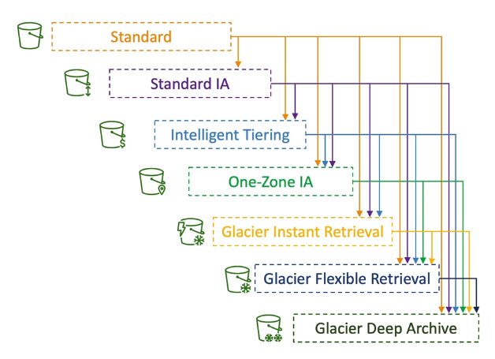
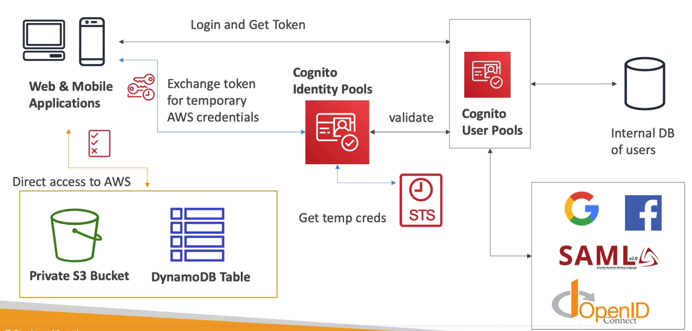
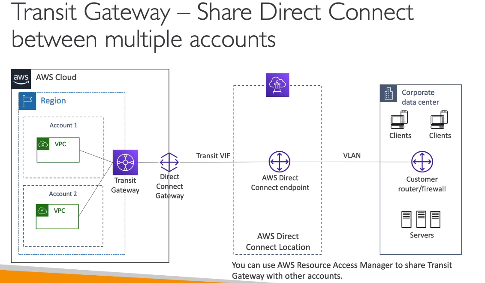

# AWS Certified Solution Architect Associate

Amazon Web Services(AWS) is a leading cloud provider, meaning they provide you with services and servers that can scale easily and on demand.

#### Table of contents

* [AWS Global Infrastrucure](#aws-global-infrastrucure)
* [AWS Shared Responsiblity](#aws-shared-responsiblity)
* [Ports List](#ports-list)
* [IAM](#iam)
    * [IAM Policies](#iam-policies)
    * [IAM MFA Overview](#iam-mfa-overview)
    * [IAM Best Practices](#iam-best-practices)
* [AWS CLI](#aws-cli)
* [EC2](#ec2)
    * [EC2 User Data](#ec2-user-data)
    * [EC2 Instance Types](#ec2-instance-types)
    * [Security Groups](#security-groups)
    * [EC2 Purchasing Options](#ec2-purchasing-options)
    * [AMI](#ami)
    * [EC2 - IP Types](#ec2---ip-types)
    * [EC2 - Placement Groups](#ec2---placement-groups)
    * [ENI - Elastic Network Interfaces](#eni---elastic-network-interfaces)
    * [EC2 - Hibernate](#ec2---hibernate)
* [EC2 Instance Storage](#ec2-instance-storage)
    * [AMI](#ami)
    * [EBS](#ebs)
        * [EBS - Encryption](#ebs---encryption)
    * [EFS](#efs)
* [Scalability & High Availability](#scalability-&-high-availability)
    * [ELB](#elb)
        * [ELB - Sticky Sessions](#elb---sticky-sessions)
        * [ELB - Cross Zone Load Balancing](#elb---cross-zone-load-balancing)
        * [ELB - SSL Certificates](#elb---ssl-certificates)
        * [ELB - Connection Draining](#elb---connection-draining)
    * [ASG](#asg)
        * [ASG Scaling Policies](#asg-scaling-policies)
* [RDS](#rds)
    * [RDS Custom - for Oracle and MS SQL Server](#rds-custom---for-oracle-and-ms-sql-server)
* [Aurora](#aurora)
    * [Aurora - Advanced Concepts](#aurora---advanced-concepts)
* [RDS & Aurora - Backup and Monitoring](#rds-&-aurora---backup-and-monitoring)
* [ElastiCache](#elasticache)
    * [ElastiCache - Solution Architect](#elasticache---solution-architect)
    * [Amazon MemoryDB for Redis](#amazon-memorydb-for-redis)
* [DNS](#dns)
* [Route 53](#route-53)
* [Elastic Beanstalk](#elastic-beanstalk)
* [S3](#S3)
    * [S3 Storage Classes](#s3-storage-classes)
    * [S3 Advanced Features](#s3-advanced-features)
    * [S3 Advanced Security](#s3-advanced-security)
* [CloudFront](#cloudfront)
    * [AWS Global Accelerator](#aws-global-accelerator)
* [AWS Storage Extras](#aws-storage-extras)
    * [AWS Snow Family](#aws-snow-family)
    * [Amazon FSx](#amazon-fsx)
    * [Amazon Storage Gateway](#amazon-storage-gateway)
    * [AWS Transfer Family](#aws-transfer-family)
    * [AWS DataSync](#aws-datasync)
* [Integration & Messaging](#integration-&-messaging)
    * [SQS](#sqs)
    * [SNS](#sns)
    * [Kinesis](#kinesis)
        * [Kinesis Data Streams](#kinesis-data-streams)
        * [Kinesis Data Firehose](#kinesis-data-firehose)
    * [Amazon MQ](#amazon-mq)
* [Docker in AWS](#docker-in-aws)
    * [Docker](#docker)
    * [ECS](#ecs)
    * [ECR](#ecr)
    * [EKS](#eks)
    * [AWS App Runner](#aws-app-runner)
* [Serverless](#serverless)
    * [Lambda](#lambda)
        * [Lambda Limits and Best Practices](#lambda-limits-and-best-practices)
        * [Lambda at Edge](#lambda-at-edge)
        * [Lambda in VPC](#lambda-in-vpc)
        * [Lambda - RDS Invocation & Event Notifications](#lambda---rds-invocation-&-event-notifications)
    * [DynamoDB](#dynamodb)
    * [API Gateway](#api-gateway)
    * [Step Functions](#step-functions)
* [Cognito](#cognito)
    * [Cognito User Pools (CUP)](#cognito-user-pools-(cup))
    * [Cognito Identity Pools(CIP)](#cognito-identity-pools(cip))
* [Databases](#databases)
* [Data & Analytics](#data-&-analytics)
    * [Athena](#athena)
    * [Redshift](#redshift)
    * [OpenSearch](#opensearch)
    * [EMR](#emr)
    * [QuickSight](#quicksight)
    * [Glue](#glue)
    * [Lake Formation](#lake-formation)
    * [Kinesis Data Analytics](#kinesis-data-analytics)
    * [MSK](#msk)
    * [Big Data Ingestion Pipeline](#big-data-ingestion-pipeline)
* [Machine Learning](#machine-learning)
    * [Rekognition](#rekognition)
    * [Transcribe](#transcribe)
    * [Polly](#polly)
    * [Translate](#translate)
    * [Lex + Connect](#lex-+-connect)
    * [Comprehend](#comprehend)
    * [SageMaker](#sagemaker)
    * [Forecast](#forecast)
    * [Kendra](#kendra)
    * [Personalize](#personalize)
    * [Textract](#textract)
* [AWS Monitoring & Audit](#aws-monitoring-&-audit)
    * [CloudWatch](#cloudwatch)
    * [EventBridge](#eventbridge)
    * [CloudTrail](#cloudtrail)
    * [AWS Config](#aws-config)
* [IAM Advanced](#iam-advanced)
    * [AWS Organizations](#aws-organizations)
    * [IAM - Advanced Policies](#iam---advanced-policies)
    * [IAM - Resource-based Policies vs Roles](#iam---resource-based-policies-vs-roles)
    * [IAM - Policy Evaluation Logic](#iam---policy-evaluation-logic)
    * [IAM - Identity Center](#iam---identity-center)
    * [AWS Directory Services](#aws-directory-services)
    * [AWS Control Tower](#aws-control-tower)
* [AWS Security & Encryption](#aws-security-&-encryption)
    * [KMS](#kms)
        * [KMS - Multi-Region Keys](#kms---multi-region-keys)
        * [S3 Replication with Encryption](#s3-replication-with-encryption)
        * [Encrypted AMI Sharing](#encrypted-ami-sharing)
    * [SSM](#ssm)
    * [Secrets Manager](#secrets-manager)
    * [ACM](#acm)
    * [WAF](#waf)
    * [Shield](#shield)
    * [Firewall Manager](#firewall-manager)
    * [DDOS Protection](#ddos-protection)
    * [Amazon GuardDuty](#amazon-guardduty)
    * [Amazon Inspector](#amazon-inspector)
    * [Amazon Macie](#amazon-macie)
* [Networking - VPC](#networking---vpc)
    * [VPC](#vpc)
    * [Subnet](#subnet)
    * [Internet Gateways & Route Tables](#internet-gateways-&-route-tables)
    * [Bastion Hosts](#bastion-hosts)
    * [NAT Instances](#nat-instances)
    * [NAT Gateways](#nat-gateways)
    * [NACL & Security Groups](#nacl-&-security-groups)
    * [VPC Peering](#vpc-peering)
    * [VPC Endpoints](#vpc-endpoints)
    * [VPC Flow Logs](#vpc-flow-logs)
    * [Site-to-Site VPN and Gateways](#site-to-site-vpn-and-gateways)
    * [Direct Connect](#direct-connect)
    * [Transit Gateway](#transit-gateway)
    * [VPC Traffic Monitoring](#vpc-traffic-monitoring)
    * [IPv6 for VPC](#ipv6-for-vpc)
    * [Egress Only Internet Gateway](#egress-only-internet-gateway)
    * [Networking Costs](#networking-costs)
    * [AWS Network Firewall](#aws-network-firewall)
* [Disaster Recovery & Migrations](#disaster-recovery-&-migrations)
    * [Database Migration Service (DMS)](#database-migration-service-(dms))
    * [RDS & Aurora Migrations](#rds-&-aurora-migrations)
    * [On-premises Strategies with AWS](#on-premises-strategies-with-aws)
    * [AWS Backup](#aws-backup)
    * [Application Migration Service (MGN)](#application-migration-service-(mgn))
    * [Transferring Large Datasets into AWS](#transferring-large-datasets-into-aws)
    * [VMWare Cloud on AWS](#vmware-cloud-on-aws)
* [Solution Architectures](#solution-architectures)
    * [Event Processing in AWS](#event-processing-in-aws)
    * [Caching Strategies in AWS](#caching-strategies-in-aws)
    * [Blocking an IP Address in AWS](#blocking-an-ip-address-in-aws)
    * [High Performance Computing (HPC) on AWS](#high-performance-computing-(hpc)-on-aws)
    * [AWS Well-Architected Framework](#aws-well-architected-framework)
* [Other Services](#other-services)
    * [CloudFormation](#cloudformation)
    * [Amazon SES](#amazon-ses)
    * [Amazon Pinpoint](#amazon-pinpoint)
    * [SSM - Session Manager](#ssm---session-manager)
    * [SSM - Other Services](#ssm---other-services)
    * [AWS Cost Explorer](#aws-cost-explorer)
    * [Elastic Transcoder](#elastic-transcoder)
    * [AWS Batch](#aws-batch)
    * [Amazon AppFlow](#amazon-appflow)
* [AWS Trusted Advisor](#aws-trusted-advisor)


&nbsp;
# AWS Global Infrastrucure Overview
https://infrastructure.aws/
* **AWS Regions** - all around the world, have codes(us-east-1), cluster of datacenters, most services scoped to region. How to choose an AWS region:
    * *Compliance* - with data governance and legal requirements, data does not leave region without explicit permission
    * *Proximity* - to customers to reduce latency
    * *Available services** - not all Regions have all services available
        * Region table: https://aws.amazon.com/about-aws/global-infrastructure/regional-product-services/
    * *Pricing* - varies region to region
* **AWS Availability Zones** - 3-6 in each region, isolated from each other, connected with high bandwidth/ultra-low latency networking, have codes(ap-southeast-2a), one or more discrete data centers with redundant power/networking/connecitvity
* **AWS Data Centers**
* **AWS Edge Locations/Points of Presence** - 216 PoP ( 205 edge locations & 11 Regional Caches) in 84 cities across 42 countries, content delivered to users with lower latency

&nbsp;
# AWS Shared Responsiblity
* https://aws.amazon.com/compliance/shared-responsibility-model/
* **Customer Responsiblity** - security `in` the cloud:
    * customer data
    * platform/applications/identity & access management
    * operating system/network/firewall configuration
    * client-side data encryption/data integrity authentication
    * server-side encryption (file system/data)
    * networking traffic protection (encryption/integrity/identity)
    * **IAM**:
        * users, groups, roles, policies management and monitoring
        * enable MFA on all accounts
        * rotate your keys often
        * use IAM tools to apply appropriate permissions
        * analyze access patterns & review permissions
    * **EC2**:
        * security groups rules
        * O/S patches and updates
        * software and utilities install on the EC2 instance
        * IAM roles for EC2 & IAM user access management
        * data security on instance - firewall / network configuration
    * **EC2 Storage**:
        * setting up backup / snapshot procedures
        * setting up data encryption
        * data on the drives
        * risk of using EC2 Instance Store(ephemeral, hardware failure)
    * **S3**:
        * versioning
        * bucket configuration
        * bucket policies / public settings
        * replication setup
        * logging and monitoring
        * optimal storage classes
        * data encryption at rest and in transit
        * IAM user and roles
    * **Databases**
        * if run on EC2 must handle all things that are done by AWS in managed db (see AWS database responsibility model)
        * check the ports / IP / security group inbound rules in DB's SG
        * in-database user creation and permissions
        * creating a database with or without public access
        * ensure parameter groups or DB is configured to only allow SSL connections
* **AWS Responsiblity** - security `of` the cloud
    * software - compute/storage/database/networking
    * hardware/global infrastructure - regions/az/edge locations, global network security
    * configuration and vulnerability analysis
    * compliance validation
    * **Security**:
        * protecting infrastructure (hardware, sotware, facilities, networking) that runs all the AWS services
        * protecting services like S3, DynamoDB, RDS, etc
    * **EC2**:
        * infrastructure (global network security)
        * isolation on physical hosts
        * replacing faulty hardware
        * compliance validation
    * **EC2 Storage**:
        * infrastructure
        * replication for data for EBS volumes/EFS drives
        * replacing faulty hardware
        * ensuring employees cannot access your data
    * **S3**:
        * infrastructure -> global security, durability, availability, sustain concurrent loss of data in two facilities
        * configuration and vulnerability analysis
        * compliance validation
        * guarentee unlimied storage
        * guarentee encryption
        * ensure separation of data between different customers
        * ensure AWS employees cant access your data
    * **Databases**
        * manage underlying EC2 instances, disable SSH access
        * automated DB patching
        * automated OS patching
        * audit the underlying instance and disks & guarentee it functions
        * offers to manage databases which makes them:
            * quickly provisioned
            * highly available
            * fault tolerance
            * easy vertical and horizontal scaling
            * automated backup & restore
            * automated operations / upgrades
            * automated operating system patching
            * monitoring/alerting out of the box
* **Shared Responsibility**
    * patch management
    * configuration management
    * awareness & training

&nbsp;
# Ports List
List of ports worth remembering:
* `21` = **FTP** (File Transfer Protocol) - upload files into a file share
* `22` = **SSH** (Secure Shell) - log into a Linux instances
* `22` = **SFTP** (Secure File Transfer Protocol) - upload files using SSH
* `80` = **HTTP** - access unsecured websites
* `443` = **HTTPS** - access secured websites
* `3389` = **RDP** (Remote Desktop Protocol) - log into a Windows instance
* `5432` = PostgreSQL & Aurora ofr PostgreSQL
* `3306` = MySQL & Aurora for MySQL
* `1521` = Oracle RDS
* `1433` = MS SQL Server
* `3306` = MariaDB 

&nbsp;
# IAM
* Identity and Access Management
* **Global** service
* **Users** are people withing your organization
    * you should download credentials in CSV after creating a user
* **Groups** are collection of users with shared identity and access settings
    * users can belong to multiple groups but dont have to belong to any 
    * groups cannot contain other groups
* **IAM Policies** are JSON documents that specify what a user or group is allowed to do
* **Least privilege principle** means you don't give a user more permissions than he needs
* **Account Alias** is a unique name of the account that you can set and use instead of the number during log in
* **IAM Roles** are policies applied to services. Common roles:
    * EC2 Instance Roles
    * Lambda Function Roles
    * Roles for CloudFormation
* **IAM Security** comprise of MFA and Password Policies
* **IAM Secutiy Tools** various tools for checking how secure your IAM configuration is:
    * *IAM Credentials Report* - list of account's users and various credential status - `account level`
    * *IAM Access Advisor* - list of service permissions granted to user and when they where last accessed. Very handy to revise policies assigned to user - `user level`
* **AWS CLI** used to manage AWS services with a command line
* **AWS SDK** used to manage AWS services with a programming language
* **Access Keys** enable access to AWS using CLI or SDK
* **IAM Audit** can be done through IAM Credential Reports & IAM Access Advisor

## IAM Policies
* JSON document that specifies permissions
* **inline** policy is one that is only attached to a user
* **IAM Policy structure**
    * *Version* - policy language version, always select `2012-10-17`
    * *Id* - idenitifier for the policy [`optional`]
    * *Statement* - one or more individual statement
        * *Sid* - statement identifier [`optional`]
        * *Effect* - whether statement allows or denies access [`Allow`, `Deny`]
        * *Principal* - account/user/role to which this policy is applied to
        * *Action* - list of actions the policy allows or denies
        * *Resource* - list of resources the policy is applied to
        * *Condition* - conditions for when the policy is in effect [`optional`]
* custom policies can be created either through JSON format or Visual Editor

```JSON
{
    "Version": "2012-10-17",
    "Id": "S3-Investor-Permissions",
    "Statement": [
        {
            "Sid": "1",
            "Effect": "Allow",
            "Principal": {
                "AWS": ["arn:aws:iam:123456789012:root"]
            },
            "Action": [
                "s3:GetObject",
                "s3:PutObject"
            ],
            "Resource": ["arn:aws:s3:::inv-*"]
        }
    ]
}
```

## IAM MFA Overview
* **Password Policies**
    * set minimum length
    * require specific characters like: uppercase/lowercase letters, number, non-alphanumeric characters
    * allow all IAM users to change their own passwords
    * password expiration
    * prevent password re-use
* **Multi Factor Authentication**
    * a combination of a *password that you know* and a *device that you own*
    * a hacker would need access to physical device:
        * *Virtual MFA device* - Google Authenticator(phone-only) or Authy(multi-device)
            * supports multiple tokens on a single device
        * *Universal 2nd Factor (U2F) Security Key* - YubiKey by Yubico (3rd party)
            * supports multiple root and IAM users on a single security key
            * looks like a usb drive
        * *Hardware Key Fob MFA Device* - a small device that shows and refreshes MFA code
        * *Hardware Key Fob MFA Device for AWS GovCloud (US)* - special key fob provided by SurePassID

## IAM Best Practices
* only use root account for AWS account setup
* **one** physical user = **one** AWS user
* assign users to groups and assign permissions to groups
* create a strong password policy
* enforce MFA
* create and use `Roles` for giving permissions to AWS services
* use and protect access keys for programmatic access (CLI / SDK)
* use IAM Credentials Report to audit credentials of accounts
* **never** share IAM users & access keys

&nbsp;
# AWS CLI
* Command Line Interface
* alternative to using the AWS Management Console
* protected by access keys
    * generated through AWS Console
    * contains an *Access Key ID* which is like a username and *Secret Access Key* which is like a password
* enables direct access to *public APIs of AWS services* and allows writing *scripts to manage your resources*
* is open-source https://github.com/aws/aws-cli
* is effected by IAM policies

``` bash
# configure the CLIby adding access keys
aws configure

# IAM
aws iam list-users
```


&nbsp;
# EC2
* Elastic Compute Cloud
* Infrastructure as a Service
* consists of the following capabilities:
    * *EC2* - renting virtual machines
    * *EBS* - storing data on virtual drives
    * *ELB* - distributing load across machines
    * *ASG* - scaling the services using an auto-scaling group
* *EC2 Instance Store* - high-performance ephemeral storage connected directly to the EC2 hardware
    * better I/O performance than network drives
    * losses storage on instance termination(ephemeral)
    * good for buffer/cache/scratch data/temporary content
    * risk of data loss if hardware fails -> Backup and Replication is your responsiblity
    * provides block level storage
* Sizing and configuration:
    * *OS* - Linux, Windows, Mac OS, Amazon OS
    * *CPU* - how much power and cores
    * *RAM* - how much volatile memory
    * *Storage* - network attached through *EBS & EFS* or hardware *EC2 Instance Store*
        * you can set volumes to be deleted on instance termination
    * *Network* - speed of network card, public IP address
    * *Firewall rules* - inbound and outbound rules defined in a **Security Group**
        * You need to create a key pair and assign it to an instance in order to SSH into it
            * `.pem` for newer OS like MacOS or Windows - make sure to run `chmod 0400 test.pem` before using it
            * `.ppl` for older OS like Windows 7/8
        *  when connecting via `SSH` make sure the `pem` file is in `cwd` - `ssh -i test.pem ec2-user@3.250.11.10`
    * *Bootstrap script* - configure an EC2 instance at launch through *EC2 User Data*
* On creation an instance gets:
    * *Instance ID* unique identifier of the EC2 instance
    * *Public IPv4 address* if it is configured for public access
    * *Private IPv4 adresses* which enable access internally by other AWS services
* `EC2 Instance Connect` allows connecting with EC2 through your browser, only available for `Amazon Linux 2`
    * default user is named `ec2-user`
    * dont use AWS Account credentials in EC2 instance to configure access to resources
* **Summary**:
    * *EC2 Instance* - AMI(OS) + Instance Size (CPU + RAM) + Storage + SG + EC2 User Data
    * *Security Groups* - firewall attached to the ec2 instance
    * *EC2 User Data* - script launch on first start up of instance
    * *SSH* - start a terminal into EC2 instance on port 22
    * *EC2 Instance Role* - set instance permissions based on IAM role
    * *Purchasing Options* - On-Demand, Spot, Reserved, (Standard + Convertible + Scheduled), Dedicated Host, Dedicated Instance

## EC2 User Data
* a script that allows bootstrapping an EC2 instance
* launches commands on startup
* the script is only run once on startup
* automates boot tasks such as:
    * installing updates
    * installing software
    * downloading common files form the internet
* runs with the root user (`sudo` rights)

``` bash
#!/bin/bash
# Use this for your user data
# install httpd
yum update -y
yum install -y httpd
systemctl start httpd
systemctl enable httpd
echo "<h1>Hello World from $(hostname -f)</h1>" > /var/www/html/index.html
```

## EC2 Instance Types
* a good reference is https://aws.amazon.com/ec2/instance-types/
* instance types are separated into classes:
    * *General Purpose* - the `t` class is good for diveristy of workloads like `web servers` or `code repositories`. Balance between Compute, Memory, Networking
    * *Compute Optimized* - the `c` class is good for workloafds that require high performance processors like:
        * `batch processing`
        * `media transcoding`
        * `high performance web servers`
        * `(HPC) high performance computing`
        * `scientific modeling & machine learning`
        * `dedicated gaming servers`
    * *Memory Optimized* - the `m` class is good for processing large data sets in memory like:
        * `high performance for relational/non-relational databases`
        * `distributed web scale cache stores (ElastiCache)`
        * `in-memory databases optimized for BI`
        * `Application performing real-time processing of big unstructered data`
    * *Storage Optimized* - `i`, `d` and `h1` class is great for storage-intensive tasks that require high, sequential read and write access to large data sets on local storage like:
        * `high frequency online transaction processing (OLTP) systems`
        * `Relational & NoSQL databases`
        * `Cache for in-memory databases (Redis)`
        * `Data warehousing applications`
        * `Distributed file systems`
* instance naming convention following an example `m5.2xlarge`
    * `m` - instance class
    * `5` - generation, the hardware of the instance which is improved over time
    * `2xlarge` - size within the instance class, the bigger the higher hardware specs

Tool for comparing instances: https://instances.vantage.sh

## Security Groups
* a firewall on EC2 instances
* fundamental of network security in AWS
* control inbound and outbound traffic of a EC2 instances
* only contain `allow` rules
* can reference by IP or by other security groups
    * which means you can `authorise` specific security groups and traffic comming from EC2 instances with that group is allowed
* they regulate:
    * access to ports
    * authorised IP ranges - IPv4 and IPv6
    * control of inbound network (from other to the instance)
    * control of outbound network (from the instance to other)
* can be attached to multiple instances and vice versa
* locked down to a region / VPC combination
* live outside of the EC2 instance
* **Good Practice** - maintain one separate security group for SSH access
* a `time out` is usually a security group issue
* a `connection refused` error means you got through and got an application error
* all inbound is `blocked` by default - `Source 0.0.0.0/0`
* all outbound is `autherized` by default - `Destination 0.0.0.0/0`
* you can attach `IAM` roles to EC2 instances to give them access to resources (like using the AWS CLI in them)
    * Instance > Actions > Modify IAM role
    * dont use AWS Account credentials in EC2 instance to configure access to resources


## EC2 Purchasing Options
* **Tenancy** defines how EC2 instances are distributed across physical hardware and affect pricing
* purchase options include:
    * **On-Demand Instances** - short workload, predictable pricing, pay by second
        * billing per second after first minute for Linux or Windows
        * billing per hour for other OS
        * *highest cost* but no *upfront payment*
        * best if: 
            * *short* workload
            * *uninterrupted* workload
            * *cant predict* application behavior
    * **Reserved** (1 & 3 years)
        * types:
            * **Reservecd Instances** - long workloads
            * **Convertible Reserved Instances** - long workloads with flexible instances
        * Up to 72% discount compared to On-demand
        * reserve specific instance attributes (Type, Region, Tenancy, OS)
        * the higher the *reservation period* the higher the discount
        * *payment options* - no upfront, partial upfront, all upfront
        * *scope* - region or zonal
        * can buy and sell in the `Reserved Instance Marketplace`
        * best for:
            * steady-state usage applications (like DB)
    * **Savings Plan** (1 & 3 years) - commitment to an amount of usage
        * discount based on long-term usage
        * commit to a type of usage (like $/hour for 1 or 3 years)
        * usage beyond Saving Plans is billed at On-Demand price
        * **locked** to *instance family* and *AWS region*
        * **flexible** across *instance size*, *os*, *tenancy*(Host, Dedicated, Default)
    * **Spot Instances** - short workloads, can lose instances (less reliable)
        * up to 90% disount compared to on-demand
        * can lose at any point of time if your `max spot price` is less then `current spot price`
            * in this scenario can choose to stop or terminate instance with a 2 minutes grace period
        * *most cost-efficient* instances
        * useful for workloads that are *resilient to failure* like:
            * *batch jobs*
            * *data analysis*
            * *image processing*
            * *distributed workkloads*
            * *workloads with flexible start and end time*
        * *not suitable* for critical jobs or databases
        * a **spot request** consists of:
            * max price
            * desired number of instances
            * launch specification
            * request type -> one-time | persistent
            * valid from
            * valid until
        * **Spot Fleets** - set of Spot Instance + optional On-Demand Instances
            * will try to meet the target capacity with price constraints
            * define possible launch pools: `instance type`, `OS`, `AZ`
            * can have multiple launch pools (flee can choose)
            * stop launching instances when cap reached or max cost
            * strategies to allocate Spot Instances:
                * `lowerPrice`: from the pool with lowest price (cost optimization, short workload)
                * `diversified`: distributed across all pools (good for availability, long workloads)
                * `capacityOptimized`: pool with optimal capacity for the number of instances
            * benefit: ALlot us to automatically request Spot Instances with the lowest price
    * **Dedicated Hosts** - book an entire **physical server**, control instance placement
        * physical server with EC2 capacity fully dedicated to your use
        * allows addressing *compliance requirements* and *existing server-bound software licenses*(per-socket, per-core, per-VM software licenses)
        * purchasing options: *On-demand*, *Reserved (No Upfront, Partial Upfront, All Upfront)*
        * characteristics:
            * enables the use of dedicated physical servers
            * per host billing
            * visibility of sockets, cores, host ID
            * affinity between a host and instance
            * targeted or automatic instance placement
            * add capacity using an allocation request
    * **Dedicated Instances** - no other customers will share your hardware
        * runs on **hardware* that is dedicated to you, but may share it with other instances you control
        * you have no control over instance placement
        * per instance billing (subject to 2$ per region fee)
    * **Capacity Reservations** - reserve capacity in a specific AZ for any duration
        * reserve On-Demand instances capacity in an AZ for any duration
        * always have access to that capacity
        * pay hourly rates even if you dont use it
        * *not time commitment* and *no billing discounts*
        * sutiable for *short-term uninterrupted workloads* that need to be in a specific AZ


## EC2 - IP Types
* `IPv4` -> most common format used online
    * allows for 3.7 billion different addresses in public space
    * format: [0-255].[0-255].[0-255].[0-255]
* `IPv6` -> newer and solves problem with limited amount of ip addresses for IoT
* `Public IP`
    * host can be identitifed on the public internet
    * must be unique across the whole web
    * can be geo-located easily
* `Private IP`
    * host can only be identified on the private network
    * must be unique across the private network
    * two different private networks can have same private IPs
    * machine connect to public internet through internet gateway(proxy)
    * only specified range of IPs can be used as private IP
* `Elastic IP` -> allows setting a fixed public IPv4 IP to an EC2 instance
    * wont change as long as you dont delete it
    * can attach to one instance at a time
    * allows masking the failure of an instance by rapidly remapping the address
    * can only have 5 Elastic IP in your account (can ask AWS to increase)
    * avoid using Elastic IP:
        * often reflect poor architectural decisions
        * instead -> use random public IP and register a DNS name to it
        * can also use load balancer and not use public IP at all


## EC2 - Placement Groups
* defining placement groups gives control over EC2 Instance physical placement
* **Placement Strategies**:
    * `Cluster`
        * clusters instances into a low-latency group in a single AZ on the same rack
        * pros:
            * great network (10 Gbps bandwidth between instances)
        * cons:
            * if rack fails, all instance fails at the same time
        * use case: Big Data job that needs to complete fast, app that needs extremely low latency and high network throughput
    * `Spread`
        * spreads instances across underlying hardware
        * max 7 instances per group per AZ
        * pros:
            * minimizes risk of simultaneous failure
            * can span across AZ
            * instances on different physical hardware
        cons:
            * limited to 7 instances per AZ per placement group
        * use case: HA, critical applications where instances need isolation from each other
    * `Partition`
        * spreads instances across many different partitions, which rely on different server racks within an AZ
        * scales to 100s of EC2 instances per group
        * up to 7 partitions per AZ
        * can span multiple AZs
        * instances in a partition do not hsare rack with instances in other partition
        * a partition failure can affect many EC2 but wont effect other partitions
        * EC2 instances get acess to the partition information as metadata
        * use case: Hadoop, Cassandra, Kafka, HBase, HDFS


## ENI - Elastic Network Interfaces
* logical component in a VPC that represents a **virtual network card**
* attributes:
    * primary private IPv4
    * one or more secondary IPv4
    * one Elastic IP per private IPv4
    * one public IPv4
    * one or more securit groups
    * a MAC address
* ENIs can be created independently of EC2 isntance
* can be attached to EC2 instaces on the fly
* bound to specific AZ
* enables quick network failover
* extra read: https://aws.amazon.com/blogs/aws/new-elastic-network-interfaces-in-the-virtual-private-cloud/
* use cases:
    * commercial software tied to MAC address
    * dual-homed environment where 2 ENIs connected to instance, one for public access(different SG), other for corporate access from VPN(SG for that)
    * low-budget high availability: if instances dies, launch another one and attach the dead instances ENI to the new instance 

## EC2 - Hibernate
* operations on instances:
    * `stop` -> the data on disk (EBS) is kept intact in the next start
    * `terminate` -> any EBS volumes (root) also set-up to be destroyed is lost
    * `start` -> OS boots, EC2 User Data script is run, app starts, caches get warmed up -> can take time
* **EC2 Hibernate** - the in-memory (RAM) state is preserved
    * instance boot is much faster
    * under the hood -> RAM state is written to a file in the root EBS volume
    * root EBS volume must be encrypted, not instance store and large
    * use cases: long running processing, saving the RAM state, services that take time to initialize
    * *supported instance families*: C3, C4, C5, I3, M3, M4, R3, R4, T2, T3
    * instance RAM size must be less than 150 GB
    * not supported for bare metal instances
    * **supported AMI**: Amazon Linux 2, Linux AMI, Ubuntu, RHEL, CentOS, Windows
    * available in `On-Demand`, `Reserved`, `Spot` instances
    * instance cannot be hibernated for more than `60 days`


&nbsp;
# EC2 Instance Storage
* **EBS** vs **EFS**
    * **EBS**: 
        * one instance (except io1/io2 multi-attach)
        * locked at AZ level
        * `gp2`: IOPS increases with disk size
        * `io1`: provisioned IOPS
        * to migrate across AZ take a snapshot and restore in other AZ
        * backups use IPS, shouldnt run while application handling high traffic
        * root EBS volume for EC2 instance terminated by defualt (can disable)
    * **EFS**:
        * network filesystem that can be attached to 100s of EC2 instances
        * not bound to AZ level
        * share files
        * only for Linux instances (POSIX)
        * higher price
        * can leverage EFS-IA for cost savings
* **EC2 Instance Store** - high-performance ephemeral storage connected directly to the EC2 hardware
    * better IOPS performance than network drives
    * losses storage on instance termination(ephemeral)
    * good for buffer/cache/scratch data/temporary content
    * risk of data loss if hardware fails -> Backup and Replication is your responsiblity

## AMI
* **AMI** - **Amazon Machine Image** - *customization* of an EC2 instance:
    * add own software. configuration, OS, monitoring
    * faster boot thx to pre-packaged software
* region specific and can be copied across regions
* you can launch EC2 instances from:
    * *A public AMI* - provided by AWS
    * *Your own AMI* - you make and maintain them
    * *AWS Marketplace AMI* - an AMI someone else made and potentially sells
* you can:
    * build an AMI from an existing EC2 instance(which creates EBS snapshot)
* **EC2 Image Builder** - automate creation of VM or container images
    * a regional service
    * free service, only pay for underlying resources(EC2 instances, storage of AMI)
    * automate the creation/maintenance/validation/testing of EC2 AMIs
    * steps:
        * creates a *Builder EC2 Instance* - build components applied like custom software
        * creates a new AMI from the Builder EC2 instance
        * creates a *Test EC2 Instance* from the AMI - runs test suite to check if its working/secure/app running
        * distributes the AMI - allows distribution to multiple regions
    * can run on a schedule like weekly/triggers(package updates)/manually
    * *Recipe* - how source image is customized
    * *Infrastructure Configuration* - ec2 instance type and configs(like IAM)
    * *Distribution Settings* - what regions the AMI will be distributed to
* **Instantiating Applications Quickly**
    * **Golden AMI** - an AMI that serves as a bootstrap for all EC2 instances you use within a logical group(like for ECS Cluster, or ASG), contain all applications, OS dependencies etc
    * **Bootstrap using User Data** - good for dynamic configurations like database URL
    * **Hybrid** - mix Golden AMI and User Data to setup a fleet of EC2 instances quickly and reliably


## EBS
* **EBS** - **Elastic Block Store** - a network drive you can attach to an instance while they run
    * persist data even when instance is terminated
    * can only mount to 1 instance at a time (CCP level, CCA level "multi-attach" feature for some possible)
    * bound to AZ
        * to move across AZ first need to *snapshot* a volume
    * think of them as *network USB stick*
    * is a *network drive*:
        * can cause latency
        * easily attached and detached
    * capacity(GB, IOPS) needs to be provisioned in advance
* **parameters**
    * *Delete on Termination* - deletes the EBS volume on EC2 instance termination
        * by default `on` for root volumes
        * by default `off` for non-root volumes
        * use case: disable for root volume to preserve on ec2 termination
* **EBS Snapshot** - a backup of an EBS volume at any point of time
    * not necessary to detach volume (but recommended)
    * can copy across AZ or Region
    * Features:
        * *EBS Snapshot Archive* - allows moving to an "archive tier" that is 75% cheaper, takes 24-72h to restore
        * *Recycle Bin for EBS Snapshots* - rules to retain deleted snapshots, specify retention 1d-1y, find deleted snapshots
        * *FSR* - Fast Snapshot Restore - force full initialization of snapshot for low latency on first use, cost extra, useful with very big snapshots if you need them available fast
* **Volume Types**
    * *gp2 / gp3 (SSD)* - general purpose SSD, balances price and performance for wide variaty of workloads
        * cost effective, low latency
        * **use cases**: system boot, virtual desktops, development/test envs
        * 1 GiB - 16 TiB
        * **gp3**: 
            * baseline of 3000 IOPS and throughput of 125 MiB/s
            * can increase IOPS to 16000 and throughput to 1000 MiB/s independently
        * **gp2**:
            * small volumes can burst to 3000 IOPS
            * size of volume and IOPS linked, 3 IOPS per GB, max of 16000 IOPS at 5334 GB
    * *io1 / io2 (SSD)* - highest-performance SSD, mission-critical low-latency or high-throughput workloads
        * highest performance, throughput and lowest latency
        * **PIOPS** - provisioned IOPS SSD
        * **use cases**: critical business applications, apps that need more than 16000 IOPS, database workloads
        * 4 GiB - 16 TiB
        * Max PIOPS -> 64000 for Nitro EC2 Instances, 32000 for other
        * can increase PIOPS independently of storage size
        * io2 -> more durability, more IOPS per GiB at same price as io1
        * **io2 Block Express** - 4 GiB - 64 Gib, sub-ms latency, max PIOPS: 256000, IOPS:GIB ratio of 1000:1
        * supports EBS Multi-Attch
    * *st 1 (HDD)* - lowest costs HDD, designed for frequently accessed, throughput-intensive workloads
        * 125 GiB to 16 TiB
        * throughput optimized HDD: max throughput -> 500 MiB / s, max IOPS 500
    * *sc1 (HDD)* - lowest cost HDD volume designed for less frequently accessed workloads
        * Cold HDD
        * scenario for lowest cost
        * max throughput 250 MiB/s, max IOPS 250
    * **EBS Volumes** are characterized in Size / Throughput / IOPS
    * only *gp2/gp3* and *io1/io2* can be used as boot volumes
* **EBS Multi-Attach** -  attach same EBS volume to multiple EC2 instances in the same AZ
    * only compatible with io1/io2 volume types
    * each instance has read & write permissions
    * **use case** : 
        * higher application availability in clustered Linux applications (ex: Teradata)
        * applications must manage concurrent write operations
    * **limitations**: same AZ, max of 16 EC2 Instances, must use cluster-aware file system(not XFS, EX4, etc...)


### EBS - Encryption
* encrypting an EBS give the following:
    * data at rest is encrypted
    * data in flight moving between instance and volume is encrypted
    * all snapshots are encrypted
    * volumes created from snapshot are encrypted
    * encryption - decryption is handled transparently (no extra work needed by you)
    * minimal impact on latency
    * leverages keys from KMS (AES-256)
    * copying an unencrypted snapshot allows encryption
    * can only encrypt during creation


## EFS
* **EFS** - **Elastic File System** - is a *managed NFS*(network file system) that can be mounted on many EC2(EFS mount targets)
    * an EFS can work in multi-AZ (regional, for durability and availability)
    * highly available, scalable, expensive, pay per use
    * uses *NFSv4.1 protocol*
    * access controlled by *security group*
    * only compatible with Linux based AMI
    * encryption at rest using KMS
    * *POSIX* file system with a standard API
    * scales automatically (no capacity planning!)
* use cases:
    * content management
    * web serving
    * data sharing
    * wordpress
* performance and storage classes:
    * **Scale** - 1000s of concurrent NFS clients, 10 GB+ throughput, grow to Petabyte-scale NFS automatically
    * **Performance mode** - set at EFS creation time:
        * *General purpose* (default) - latency-sensitive use cases (web server, CMS, etc...)
        * *Max I/O* - higher latency, throughput, highly parallel (big data, media processing)
    * **Throughput mode** set at EFS creation time:
        * *Bursting* - 1 TB = 50MiB/s + burst of up to 100MiB/s, the more space you use the more throughput
        * *Provisioned* -  set throughput regardless of storage size
* storage classes:
    * **Storage Tiers** - lifecycle management features, can set to rules to transition between IA and out of it
        * *Standard* - for frequently accessed files
        * *Infrequent access* (EFS-IA) - cost to retrieve files, lower price to store 
            * enable with a Lifecycle policy, which moves from standard automatically based on last access time 
            * optimal for non-frequent access(up to 92% lower costs compared to standard)
    * **Availability and Durability**
        * *Regional* - multi-AZ, great for prod
        * *One Zone* - one AZ, cheaper, compatible with IA (EFS One Zone-IA), backup enabled by default, good for dev
* network access: setup groups of: `AZ` -> `Subnet ID` -> `IP address` -> `SG`


&nbsp;
# Scalability & High Availability
* **Scalability** - can handle greater loads by adapting
    * *Vertical Scalability* - increasing the size of an instance, `scale up / down`
        * common for non-distributed systems like a DB ( RDS, ElastiCache )
        * limited by hardware
    * *Horizontal Scalability* (elasticity) - increasing number of instances / systems for application, `scale out / in`
        * implies distributed systems like a web application / modern application
        * not everything can be distributed
        * made simple by cloud services like [ASG](#asg), [ELB](#elb)
* **High Availability** - running your application in at least 2 data centers(2 AZ)
    * goal is to survive a data center loss
    * *Passive* - a resource that can take over when an active resource fails (like DB replica in another AZ) 
    * *Active* - multiple replicas of the resource are in use(like horizontally scaled architecture)
    * facilitated by services like [ASG](#asg) with multi AZ enabled or [ELB](#elb) with multi AZ enabled
* **Definitions**
    * *Scalibility* - ability to accommodate a larger load by making the hardware stronger, or by adding nodes
    * *Elasticity* - the system can automatically scale based on the load it is receiving 
    * *Agility* - how easily available new IT resources are ( 1 week, 1 minute, etc.)

## ELB
* **Load Balances** - servers that forward traffic to multiple servers downstream. Used to:
    * `spread load` across instances
    * expose a `single point of access` (DNS) to your application
    * seamlessly `handle` downstream instance `failure` 
    * perform `healthchecks`
    * provide `SSL termination` (HTTPS) for your websites => decrypting SSL-encrypted data traffic before offloading it to a web server
    * enforce `stickiness` with cookies => assign identification(through cookies or IP details) and fix routing based on it
        * *Stickiness* - the ability to route traffic from a client to a single destination, instead of balancing traffic across multiple destinations
    * enable `HA` across zones
    * separate `public` from `private traffic`
* **ELB** - **Elastic Load Balancing** - a managed load balancer 
    * *managed* means:
        * AWS guarentees it will be working
        * AWS takes care of upgrades, maintenance and HA
        * AWS provides only a few configuration knobs
    * cheaper to setup own LB but a lot more effort
    * integrated with AWS services:
        * [EC2](#ec2), [ASG](#asg), [ECS](#ecs)
        * [ACM](#other-services), [CloudWatch](#cloudwatch)
        * [Route 53](#route-53), WAF, AWS Global Accelarator
    * need to configure security groups on load balancers to specify rules for incoming/outgoing traffic
* **Health Checks** are crucial for loadbalancers
    * enable to know if instances handling traffic can reply to requests 
    * are done on a specific port and a specific route like `/health` for example:
        * Protocol: `HTTP`
        * Port: `4567`
        * Endpoint: `/health`
    * if response to health check is not `200 (OK)` then labeled `unhealthy`
* **4 kinds** of LB are available on AWS:
    * **CLB** - *Classic Load Balancer* - `v1`, old generation, LB available from 2009 
        * operates on Layer 4 and Layer 7
        * for `protocols` HTTP, HTTPS, TCP, SSL (secure TCP)
        * **retired in 2023**
    * **ALB** - *Application Load Balancer* - `v2`, new generation, LB available from 2016
        * Layer 7 (HTTP)
        * HTTP routing features
            * load balancing to multiple HTTP applications across machines(target groups)
            * can load balance to multiple apps on one EC2 instance(like Docker containers)
            * support redirects (like HTTP -> HTTPS)
        * Routing Tables to multiple target groups:
            * routing based on path in URL (example.com/`users`)
            * routing based on hostname in URL (`one`.example.com, `other`.example.com)
            * routing based on query string, headers (example.com/users?`id=123&order=false`)
        * Static DNS (URL)
        * for `protocols` HTTP, HTTPS, WebSocket, gRPC
        * **use cases**: micro services & container-based apps (ex. Docker & Amazon ECS)
        * Port mapping feature -> redirect to a dynamic port in ECS
        * **target group**:
            * can be:
                * EC2 Instances -> HTTP
                * ECS tasks -> HTTP
                * Lambda functions -> HTTP -> JSON event
                * IP Addresses -> only  Private IP Address, like a Data Center
            * can route to multiple target groups
            * health checks are at target group level (not instance, or container)
        * **good to know**:
            * get fixed hostname
            * app server doesnt see IP of client directly
                * true IP is inserted in the header `X-Forwarded-For`
                * port in `X-Forwarded-Port`
                * proto in `X-Forwarded-Proto`
    * **NLB** - *Network Load Balancer* - `v2`, new generation, LB available from 2017
        * ultra-high performance (millions of requests per second)
        * Static IP through Elastic IP
            * has one static IP per AZ
            * Elastic IP is good for whitelisting specific IP
        * not included in AWS Free Tier
        * Layer 4 (TCP/UDP)
        * for `protocols` TCP, TLS (secure TCP), UDP  
        * **target groups**:
            * can be:
                * EC2 Instances
                * IP Addresses -> must be private IPS 
                * Application Load Balancer
        * health checks suupprot TCP, HTTP, HTTPS protocols
    * **GWLB** - *Gateway Load Balancer* - modern LB available from 2020, used to deploy/scale/manage a fleet of 3rd part network virtual appliances in AWS
        * operates at layer 3 (Network layer) - IP Protocol for IP Packets
        * combines functions:
            * **Transparent Network Gateway** - single entry/exit for all traffic
            * **Load Balancer** - distributes traffic to your virtual appliances
        * uses the `GENEVE protocol` on port **6081** on IP Packets
        * Route Traffic to Firewalls that you manage on EC2 Instances
        * **Use cases**: Firewall, Intrusion detection and prevention systems, Deep packet inspection, payload manipulation
        * sends traffic through 3rd Party Security Virtual Appliances before routing it to the destination(application)
            * after traffic is accepted it is resent to GLB
            * once accepted GLB forwards traffic to application 
        * **target groups**: 
            * EC2 isntances -> with for example third party security appliances
            * IP addresses -> must be private IPs
    * newer generation load balancers have more features and are recommended
* load balancer can be setup as:
    * **private** - for your internal network
    * **public** - for public facing applications (ELBs)
* **security groups** for loadbalancers should be such that:
    * allow all inbound and outbound traffic for the **LB** on the pertinent protocols like:
        1. Type: `HTTP` \ Protocol: `TCP` \ Port Range: `80` \ Source: `0.0.0.0/0`
        1. Type: `HTTPS` \ Protocol: `TCP` \ Port Range: `443` \ Source: `0.0.0.0/0`
    * on connected **instances** only allow traffic to and from the LB:
        1. Type: `HTTP` \ Protocol: `TCP` \ Port Range: `80` \ Source: `sg-1231231theloadbalancersSecurityGroup`

### ELB - Sticky Sessions
* **Sticky Session** or **Session Affinity** - allow load balancer to redirect the same client to the same instance behind the load balancer
    * works for CLB & ALB
    * "cookie" used has expiration date which you set
    * **use case**: make sure user doesnt lose his session data
    * may bring inbalance to load over backend EC2 instances
    * **cookie names**
        * `Application-based Cookies`:
            * Custom cookie
                * generated by target
                * can include custom attributes required by application
                * cookie name specified individually for each target group
                * *reserved cookie names*: AWSALB, AWSALBAPP, AWSALBTG (reserved by ELB)
            * Application cookie
                * generated by LB
                * name is AWSALBAPP
            * expiration based on duration set in application
        * `Duration-based cookies`
            * generated by LB
            * name is: 
                * *AWSALB* for ALB
                * *AWSELB* for CLB
            * expiration based on duration set on LB

### ELB - Cross Zone Load Balancing
* **Cross Zone Load Balancing** - allows LB to distirbute traffic evenly across all registered instances in all AZs
    * without this traffic is distributed evenly amongs nodes of LB in all AZs (not targets)
    * ALB:
        * enabled by default
        * can be disabled at Target Group level
        * no charges for inter AZ data
    * NLB & GLB
        * disabled by default
        * pay for inter AZ data if enabled

### ELB - SSL Certificates
* SSL / TLS - Basics
    * **SSL Certificate** - allows client -> LB traffic to be encrypted in transit(in-flight encryption)
        * issued by CA (Certificate Authorities), like Comodo, Symantec, GoDaddy, GlobalSign, Digicert, Letsencrypt
        * have an expiration date and must be renewed
    * **SSL** - Secure Socket Layer - used to encrypt connections
    * **TLS** - Transport Layer Security - newer version of SSL, mainly used nowadays but still referred to as SSL
* SSL For LB
    * client <-> LB : encrypted (HTTPS)
    * LB <-> EC2 Instances : unencrypted (HTTP)
    * LB uses X.509 certificate (SSL/TLS server certificate)
    * can manage certificates using ACM (AWS Certificate Manager)
    * can create/upload own certs
    * HTTPS listener:
        * must specify default certificate
        * can add optional list of certs to support multiple domains
        * clients can use **SNI** (Server Name Indication) to specify hostname they reach
            * solves problem of loading **multiple SSL certs onto one web server** to support multiple websites
            * a newer protocol that requires client to indicate hostname of target server in the initial SSL handshake
            * server will then find correct cert or return default
            * only works for ALB & NLB, CloudFront
        * ability to specify a security policy to support older version of SSL / TLS (legacy clients)
* ALB & NLB -> support multiple listeners with multiple SSL certs through SNI

### ELB - Connection Draining
* **Connection Draining** or **Deregistration Delay** - a delay when de-registering instance(for example when flagged as unhealthy) to provide time to complete "in-flight requests"
    * can configure the delay to between 1 - 3600s, default 300s
    * can be disabled
    * lower delay good for short requests


## ASG
* **ASG** - **Auto Scaling Groups** - a group of EC2 instances that is treated as a logical grouping for the purpose of automatically scalling
    * work hand in hand with [ELB](#elb)
* the goal of an ASG is to:
    * *Scale out* - add instances to match increased load
    * *Scale in* - remove instances to match a decreased load
    * ensure there is a `min` and `max` of machines running
    * automatically register new instances to a load balancer
* parameters include:    
    * *minimum size* - the minimum amount of running instances
    * *actual size / desired capacity* the actual ammount of running instances at a given moment
    * *maximum size* - the maximum amount of running instances
* attributes:
    * *launch configuration* or *launch templates* (newer - recommended) - how a new instance is launched and attached configurations such as:
        * AMI + Instance Type
        * EC2 User Data
        * EBS Volumes
        * Security Groups
        * SSH Key Pair
        * `IAM roles` -> are attached to each instance
    * *Min Size* 
    * *Max Size*
    * *Initial Capacity*
    * *Network + Subnets* information
    * *Load Balancer* information
    * *Scaling Policies* what will trigger a scale out and scale in
* you update an ASG by providing a new launch configuration | template
* ASG is free, you pay for the launched resources
* if an instance within ASG is terminated, ASG will *automatically* create new replacements 
    * example: a LB marks instance as unhealthy
* **Scaling Strategies**:
    * *Manual Scaling* - update size of ASG manually
    * *Dynamic Scaling* - respond to changing demand
        * *Simple / Step Scaling* - when an alarm is triggered add/remove n units
        * *Target Tracking Scaling* - scale so that average CPU usage is around 40%
        * *Scheduled Scaling* - anticipate scaling based on known usage patterns, like increase capacity between 2PM-4PM on Friday
    * *Predictive Scaling* - use machine learning to scale ahead of time based on traffic forcasts
        * automatically provision based on prediction
        * useful when your load has predictable time-based patterns
    * Good metrics: `CPUUtilization`, `RequestCountPerTarget`, `Average Network In / Out` (if app is network bound), `Custom Metrics` (push using CloudWatch)
    * **Scaling Cooldown** - after scaling activity happens a cooldown period is triggers (default 300s), ASG will not launch / terminate instances during the cooldown (this allows for metrics to stabilize)
        * **Advice** - use ready-to-use AMI to reduce cooldown period
* **Clean-up** - delete ASG > delete ALB > delete EC2 instances
* **ASG Instance Refresh** - a feature that allows gradually removing EC2 instances and reacreating them with a new launch template
    * set *minimum healthy percentage* which specifies the min % of healthy instances that should be available during instance refresh
    * set *warm up time* to specify how long until instance is ready to use

## ASG Scaling Policies
* **Auto Scaling Alarms** - can scale an ASG based on [CloudWatch](#cloudwatch) alarms
    * alarms monitor system metrics
    * metrics are computed for the overall ASG instances
    * the alarm can trigger:
        * scale-out policies
        * scale-in policies
* **Auto Scaling New Rules** - easy to setup rules for scale-out and scale in like:
    * target avg cpu usage
    * number of requests on ELB per instance
    * average network in/out
* **Auto Scaling Custom Metric** - can control scaling based on custom metric, which is defined and emitted from your application
    * can be based on a schedule
    * can be transferred from the application to CloudWatch, which can have alarms configured


&nbsp;
# RDS
* **RDS** - **Relational Database Service** - a managed DB service for databases that use SQL as query language, like:
    * Postgres
    * MySQL
    * MariaDB
    * Oracle
    * SQL Server
    * Aurora
* managed means:
    * automated `provisioning`
    * automated `OS patching`
    * continuous `backups`
    * `Point in Time Restore` - restore to specific timestamp
    * `monitoring` dashboards
    * **Read Replicas** for improved read performance
        * up to 5
        * within AZ, Cross AZ, Cross Region
        * ASYNC replication -> reads are eventually consistent
        * replicas can be promoted to own DB
        * application must update connection string to leverage read replicas
        * use case: Reporting, Analytics Application
        * Network Cost: 
            * dont pay for data transfer across the same region between instance and replicas
            * pay for data transfer across region with cross region replicas
    * **Multi AZ** setup for DR
        * SYNC replication
        * One DNS name -> automatic app failover to standby instance
        * increase availability
        * failover in case of loss of AZ/network/instance/storage
        * no manual intervention
        * NOT USED for scaling
        * can setup Read Replicas as Multi AZ for DR
    * **Transition RDS from Signle-AZ to Multi-AZ**
        * zero downtime operation
        * a snapshot of DB is taken and new DB is restored from the snapshot in new AZ
        * synchronization established between two DBs
    * `maintenance` windows for upgrades
    * `scaling` capability (vertical and horizontal)
    * storage backed by `EBS` (gp2 or io1)
    * `CANNOT SSH` into your instances
* **RDS Backups**
    * automatically enabled in RDS
    * daily full backup during maintenance window
    * transaction logs backed-up every 5 minutes
    * Point in Time Restore from up to 5 minutes ago
    * 7 day retention that can be increased to 35 days
    * **DB Snapshots**
        * manually triggered backup by user
        * retention as long as you want
* **RDS Storage Autoscaling**
    * increases storage on instance dynamically and automatically
    * triggered when RDS detects that DB is running out of storage
    * *Maximum Storage Threshold* - a setting that describes that maximum allowed storage
    * autoscaling can be triggered if:
        * free storage is `less than 10%` of allocated storage
        * low-storage lasts for at least `5 min`
        * `6 hours` have passed since last modification
    * useful for applications with unpredictable workload
    * supports all databases
* **Security**:
    * encryption at rest using KMS - must be defined at launch time
    * replicas cant be encrypted if master isnt
    * automated backups
    * to encrypt an unecrypted DB: take a DB snapshot -> restore as encrypted
    * encryption in flight using SSL by default -> use AWS TLS root certificates provided on client-side
    * possible to `authenticate using IAM roles` (only for open-source databases)
    * YOU configure Security Groups
    * YOU CAN'T SSH into it unless using RDS Custom service
    * Audit logs can be enabled and sent to CloudWatch Logs for longer retention
    * to enforce SSL run `REQUIRE SSL` to all your DB users
* **RDS Proxy** - managed database proxy for RDS
    * rds connection pooling
    * improves DB efficiency by reducing the stress on DB resources and minimize open connections (and timeouts)
    * serverless, autoscaling, HA (multi-AZ)
    * reduced RDS & Aurora failover time by up to 66%
    * supports RDS(MySQL, PostgreSQL, MariaDB) and Aurora (MySQL, PostgreSQL)
    * no code changes required
    * can *enforce IAM Authenctication* for DB and securily store credentials in *AWS Secrets Manager*
    * only available in VPC (never public)

## RDS Custom - for Oracle and MS SQL Server
* managed Oracle and Microsoft SQL Server Database with OS and database customization
* RDS: automates setup, operation, scaling of database in AWS
* Custom: full admin access to the underlying database and OS
    * configure settings
    * install patches
    * enable native features
    * access the underlying EC2 Instance using SSH or SSM Session Manager
* de-activate automation mode to perform your customization -> good practice: table a DB snapshot before


&nbsp;
# Aurora
* **Aurora** - a cloud-native optimized relational database service
    * `proprietary` technology from AWS 
    * compatible with `MySQL` and `Postgres` (same drivers will work)
    * claims huge `performance` improvement:
        * 5x over MySQL on RDS
        * 3x over Postgres on RDS
    * `Auto Expanding` - shared storage automatically grows from `10 GB` to `128 TB`
        * sysops dont need to monitor
    * `Self Replicating` can have `15 replicas` with `faster replication` process (sub 10ms replica lag)
        * MySQL can have 5
    * `instantaneous failover`
        * HA native
    * costs about 20% more than RDS
* **Aurora HA and Read Scaling**
    * 6 copies of data across 3 AZ
        * 4 needed for writes/reads
        * 3 needed for reads
        * `Self Healing` with peer-to-peer replication
            * easily handles corrupted data
        * storage is striped across 100s of volumes
            * `Striped` - segmenting logically sequential data, so that consecutive segments are stored on different physical storage devices
    * One Aurora instances takes `writes` called the `master`
        * automatic failover for master in 30 seconds
        * only the master can write to the database
    * Up to 15 Aurora Read Replicas serve `reads`
        * a `read` replica can be transformed into a `master`
    * support for cross region replication
* **Aurora DB Cluster**
    * `Writer Endpoint` - DNS name that always points to the master, so client can maintain connection on failover
    * `Read Replicas` - 1 to 15 replicas that handle read operations, with Auto Scaling possible
    * `Reader Endpoint` - DNS name on top of a Connection Load Balancer that always point to the cluster of read replicas
* **Features** - remember for exam:
    * `Self Replicating` - numerous and fast replication
    * `Self Healing` - easily handles corrupted data
    * `Auto Expanding` - storage automatically grows without the need of monitoring or provisioning
    * `Automatic fail-over` - endpoints with single DNS, fail-over handled underneath
    * `Backup and Recovery` - read and write multi-AZ replicas natively
    * `Isolation and security` - safely process multiple transactions thx to replication
    * `Industry compliance` - ACID-compliant
    * `Push-button scaling` - can scale without incurring downtime
    * `Automatic Patching with Zero Downtime`
    * `Advanced Monitoring`
    * `Routing Maintenance` - handles routing traffic between replicas for zero downtime during maintenance
    * `Backtrack` - restore data at any point of time without using backups
* **Aurora Security**
    * uses same engine as RDS 
    * encryption at rest using KMS
    * automated backups, snapshots and replicas are also encrypted
    * encryption in flight using SSL
    * possible to `authenticate using IAM token`
    * YOU configure Security Groups
    * YOU CAN'T SSH into it

## Aurora - Advanced Concepts
* **Aurora Replicas - Auto Scaling** - can configure read replicas to scale automatically on heavy load. These new read replicas will be extended into the Reader Endpoint
* **Custom Endpoints** - can configure a subset of Aurora Instances as Custom Endpoints
    * for example run analytical queries on specific replicas (larger instances)
    * Reader Endpoint is not used after defining Custom Endpoints - you would rather create multiple Custom Endpoints
* **Aurora Serverless**
    * automated database instantiation
    * aito-scaling based on actual usage
    * good for inrequent / intermittent / upredictable workloads
    * no capacity planning needed
    * pay per second - can be more cost-effective
    * works because Client communicates with a **Proxy Fleet** that is managed by Aurora and has shared storage volume
* **Aurora Multi-Master** - gives every node Read & Write capabilities which provides immediate failover for write node (HA)
    * client has *Multiple DB Connection* for failover
* **Global Aurora**
    * `Aurora Cross Region Read Replicas` - useful for disaster recovery, simple to put in place
    * `Aurora Global Database` - which in contrast to Aurora Cross Region Read Replicas:
        * is recommended
        * 1 primary region (read / write)
        * up to 5 secondary regions (read-only), typical cross-region replication lag < 1s
        * up to 16 Read Replicas per secondary region
        * helps for decreasing latency
        * promoting another region (for disaster recovery) has an RTO of < 1 min
    * **RTO** - Recovery Time Object 
* **Aurora Machine Learning** - enables adding ML-based predictions to your applications via SQL
    * simple, optimized, secure integration of Aurora and AWS ML services
    * done need ML experience
    * supported services:
        * `Amazon SageMaker` - any ML Model
        * `Amazon Comprehend` - sentiment analysis
    * use cases: fraud detection, ads targeting, sentiment analysis, product recommendations

&nbsp;
# RDS & Aurora - Backup and Monitoring
* **RDS Backups**
    * `Automated Backups`
        * daily full backup of the db (during backup window)
        * transaction logs are backed-up by RDS every 5 minutes
        * ability to restore to any point in time (from oldest backup 5 minutes ago)
        * 1 - 35 days of retention
        * set retention to 0 to disable automated backups
    * `Manual DB Snapshots`
        * manually triggered by the user
        * retention of backup for as long as you want
    * `Trick` - if planning RDS to be down for a long time - take snapshot, terminate, restore when you need it
* **Aurora Backups**
    * `Automated Backups`
        * 1-35 days
        * cannot be disabled
        * point-in-time recovery in that timeframe
    * `Manual DB Snapshots`
        * manually triggered by the user
        * retention of backup for as long as you want
* **Restore Options**
    * restoring RDS / Aurora backup or a snapshot creates a new database
    * can restore MySQL RDS database from S3
        1. create a backup of your on-premises database
        1. store it on Amazon S3
        1. restore the backup file onto a new RDS instance running MySQL
    * can restore MySQL Aurora cluster from S3
        1. create a backup of your on-premises database using `Percona XtraBackup`
        1. store the backup file on Amazon S3
        1. restore the backup file onto a new Aurora cluster running MySQL
* **Aurora Database Cloning**
    * create a new Aurora DB Cluster from an existing on
    * faster than snapshot & restore
    * uses `copy-on-write` protocol
        * initially new DB cluster uses same data volume as the original DB cluster
        * when updates are made to the new DB cluster data, then additional storage is allocated and data is copied to be separated
        * very fast & cost-effective
        * use case: creating a `staging` db from `production` db without impacting the production database

&nbsp;
# ElastiCache
* **ElastiCache** - fully managed in-memory data store on top of Redis or Memcached
    * **Cache** - an in-memory database with really high performance and low-latency
        * `cache invalidating` - a strategy to make sure most current data is used in cache
    * helps:
        * `query caching` - reduce load off database for read intensive workloads 
        *  make your application `stateless`
    * AWS manages:
        * OS maintenance
        * patching
        * optimizations
        * setup
        * configuration
        * monitoring
        * failure recovery
        * backups
    * usage involves *heavy application code changes*
    * configuration options:
        * **Cluster Mode**: enables replication across multiple shards for scalability and availability
            * if disabled Redis will have single shard with one primary node and up to *5 replicas*
        * **Multi-AZ** - provide enhanced HA, automatic failover to read replica, cross AZs
        * encryption at rest
        * encryption in flight -> can use Redis AUTH which requires a Redis AUTH token
        * can enable automatic backups
        * maintenance window with topic for SNS notifications
* **Solution Architecture Example**
    * `APP` <-> `Amazon Elasticache`
        * first queries cache
        * *Cache hit* - if requested data is stored in the Cache
        * saves a call to DB
    * `APP` <-> `Amazon RDS`
        * *Cache miss* - if requested data is NOT stored in the Cache
        * app reads the data from the DB
    * `APP` -> `Amazon Elasticache`
        * on *Cache miss* the application can write the data into the cache
    * can also be used to store user session so he doesn't have to log in all the time if different instances handling his requests
* **Redis** vs **Memcached**
    * **Redis**
        * multi AZ with Auto-Failover
        * read replicas to scale reads and have high availability
        * Data Durability using AOF persistence
            * `AOF persistence` - Append Only File - logs every write operation received by the server
        * backup and restore features
        * good for: HA and DR
    * **Memchached**
        * `sharding` - multi-node for partitioning data
        * `no HA(replication)`
        * non persistent
        * no backup and restore
        * multi-threaded architecture
        * good for: performance on big data-sets
* **Strategies**:
    * **Questions**:
        * *Is it safe to cache data?* -> yes, but data may be out of date, eventually consistent
        * *Is caching effective for that data?*
            * YES -> data changing slowly, few keys frequently needed
            * NO -> data changing rapidly, large key space frequently needed
        * *Is data structure good for caching?*
            * YES -> key value caching, caching of aggregations results
    * **Caching Design Patters**
        * `Lazy Loading` / `Cache-Aside` / `Lazy Population` -> populate cache on cache miss only
            * PROS: only requested data cached -> no unused data in cache, resilient to node failures(just latency to warm the cache)
            * CONS: cache miss penalty(read penalty) results in 3 round trips (read cache, read db, write cache), stale data -> updated in DB but not in cache
            * ADVICE: great for read side and easy to implement
        * `Write Through` -> add/update cache when DB is updated
            * PROS: no stale data, write penalty vs read penalty(users expect writes to take longer then reads)
            * CONS: missing data (can mitigate by implementing Lazy Loading strategy as fallback), *cache churn* - a lot of data that is never read
            * ADVICE: usually combined with Lazy Loading for queries/workloads that benefit from it
        * `Cache Evictions and Time-to-live (TTL)` -> removing data due to limited size of cache
            * Cache Eviction has 3 forms:
                * delete item explicitly in cache
                * item evicted because memory full and item not recently used (LRU)
                * set item time-to-live (or TTL)
            * TTL helpful for any kind of data (ex. leaderboards, comments, activity streams)
            * TTL can range from few sec to hours / days
            * too many evictions means you need to scale up/out
            * ADVICE: setting TTL usually not a bad idea, except for Write-Through
            * usefule for **Session Storage**
    * ADVICE: only cache data that makes sense (user profiles, blogs, etc)


## ElastiCache - Solution Architect
* **Cache Security**
    * supports IAM Autentication for Redis
    * IAM policies on ElastiCache are only used for AWS API-level security
    * `Redis AUTH`
        * can set password / token when you create a Redis cluster
        * an extra level of security for your cache (on top of securit groups)
        * support SSL in flight encryption
    * `Memchached`
        * supports SASL-based authentication (advanced)
* **Redis Use Case** - Gaming Leaderboards are computationally complex
    * `Redis Sorted sets` - guarantee both uniqueness and element ordering
    * each time a new element added its raned in real time, then added in correct order

## Amazon MemoryDB for Redis
* Redis-compatible, durable, in-memory database service
* ultra-fast performance with over 160 mil req/s
* durable in-memory data storage with Multi-AZ transactional log
* scale seamlessly 10s GBs - 100 TBs of storage 
* use cases: web/mobile apps, online gaming, media streaming


&nbsp;
# DNS
* **DNS** - **Domain Name System** - translates human-friendly hostnames into machine IP addresses
    * backbone of the internet
    * example: www.google.com => 172.217.18.36
* **Hierarchical naming structure**
    * `.com`
    * `example.com`
    * `www.example.com`
    * `api.example.com`
* **Terminology**
    * *Domain Registrar* - handles reservation of domain names and IP address assignments
        * Amazon Route 53, GoDaddy, ...
    * *DNS Records* - configure how the DNS server routes traffic
        * A, AAAA, CNAME, NS, ...
    * *Zone file* - contains all DNS records
    * *Name servers* - servers that resolve DNS queries 
        * *Authoritative* - the customer can update DNS records
        * *Non-Authoritative* - the customer can NOT udpate DNS records
    * *TLD* - *Top Level Domain* - highest level domain
        * .com, .us, .in, .gov, .org
    * *SLD* - *Second Level Domain* - second highest level domain
        * .amazon.com, google.com
    * example `https://api.www.example.com.` from the right:
        * `.` - root of all domain names
        * `.com` - the TLD
        * `.example` - the SLD
        * `.www` - sub domain
        * `.api` sub domain
        * `api.www.example.com.` - domain name
        * `http` - used protocol
        * `https://api.www.example.com.` - **FQDN** - **Fully Qualified Domain Name**
* **How it works**
    1. `Web Browser` -> `Local DNS Server` -> resolve `example.com`
        * `Local DNS Server` - assigned and managed by your company or ISP dynamically
    1. `Local DNS Server` -> `Root DNS Server` -> resolve `example.com`
        * `Root DNS Server` - managed by ICANN
    1. `Root DNS Server` -> `Local DNS Server` -> i don't know but i know the `.com` TLD DNS server which is `.com NS 1.2.3.4`
    1. `Local DNS Server` -> `TLD DNS Server(.com)` -> resolve `example.com`
        * `TLD DNS Server` - managed by IANA(branch of ICANN)
    1. `TLD DNS Server(.com)` -> `Local DNS Server` -> i don't know but i know the `example.com` SLD domain server which is `.com NS 5.6.7.8`
    1. `Local DNS Server` -> `SLD DNS Server(example.com)` -> resolve `example.com`
        * `SLD DNS Server` - managed by Domain Registrar
    1. `SLD DNS Server(example.com)` -> `Local DNS Server` -> it is `example.com IP 9.10.11.12`
    1. `Local DNS Server` -> `Web Browser` -> i cached the IP for `example.com`, use `IP 9.10.11.12` to access it


## Route 53
* **Route 53** - a highly available, scalable, fully managed and Authoritative DNS and Domain Registrar
    * ability to check the health of resources
    * only AWS service which provides 100% availability SLA
    * *53* is a reference to traditional DNS port used by DNS services
    * a global service
* **Records** - define how you want to route traffic for a domain
    * each record contains:
        * *Domain/subdomain Name* - the domain or subdomain the rule is applied to
        * *Record Type* - a key that represents a parameter of the DNS 
            * `A` (must know) - maps a hostname to IPv4
            * `AAAA` (must know) - maps a hostname to IPv6
            * `CNAME` (must know) - maps a hostname to another hostname
                * target domain name must have an A or AAAA record
                * cant create CNAME for top node(root domain) of a DNS namespace like `example.com` (Zone Apex = root domain = top node)
            * `NS` (must know) - Name Servers for the Hosted Zone, they can respond to your DNS querries
                * controls how traffic is routed to domain
            * `CAA` - specify which Certification Authorities (CA) are authorized to deliver SSL certificates for your domain
            * `DS` - used to secure delegations
            * `MX` - indicates what domain email messages in accordance with SMTP are routed to
            * `NAPTR` - allows setting dynamic rules for how a website processes requests (useful for internet telecommunicatioin services)
            * `PTR` - a piece of information attached to an email to verify that sender matches ip address it claims to be. Known as *reverse DNS lookup*
            * `SOA` - *start of authority* record includes administrative information about your DNS zone
            * `TXT` - contains text information for sources outside of your domain, that can be used in various ways
            * `SPF` - contains list of all IP addresses that are permitted to send emails on behalf of your domain
            * `SRV` - a resource record which is used to identify computers hosting specific services. Used to locate domain controller for Active Directory
            * **Alias** - like CNAME allows a hostname to point to another hostname but:
                * works for root domain and non root domain
                * free of charge
                * native health check
                * maps hostname to AWS resource
                * extension to DNS functionality
                * automatically recognizes changes in the resources IP address
                * always record of type A or AAAA
                * use cases: ELB, CLoudFront Distributions, API Gateway, Elastic Beanstalk envs, S3 Websites, VPC Interface Endpoints, Global Accelerator accelerator, Route 53 in record in the same hosted zone
                * CANNOT set ALIAS record for an EC2 DNS name
        * *Value* - the value in the record
        * *Routing Policy* - how Route 53 responds to DNS queries
            * DNS routing does not route traffic, just responds to queries
        * **TTL** - amount of time record is cached
            * if a DNS request is made the client caches this request for the amount of time specified in the TTL
            * high TTL -> less traffic on Route 53, but possibly outdated records
            * low TTL -> high traffic on Route 53, but less possible to get outdated records
            * mandatory for all records, but Alias
* **Hosted Zones** - a container for records that define how to route traffic to domain/subdomains
    * **Public Hosted Zones** - contain records that specify how to route internet traffic (public domain names)
    * **Private Hosted Zones** - contain records the specify routing for traffic within VPC/s (private domain names)
    * cost in AWS is $0.50 per month per hosted zone
* **Routing Policies**
    * **Simple Routing Policy** - no HC, route traffic to single resource
        * can specify multiple values in single record -> a random one is chosen by client
        * specify only one AWS resource in Alias
    * **Weighted Routing Policy** - assign weights to host servers which determine the % of routed traffic that is redirected to each one. Allows health checks. Similiar to a load balancer
        * traffic (%) = [weight for record] / [sum of all the weights for all records]
        * weights dont need to sum up to 100
        * records must have same name and type
        * use cases: load balancing across regions, testing new application versions
        * assign weight of 0 to a record to stop sending traffic to a resource
    * **Latency Routing Policy** - routes traffic to the server with lowest latency
        * latency is based on traffic between users and AWS Regions
        * can be associated with HC (failover capability)
        * create multiple records where an IP is mapped to a region
    * **Failover Routing Policy** - configure a primary and failover host, in case of failed HC on primary DNS record points to the failover
    * **Geolocation Routing Policy** - routing based on user location
        * can specify locaiton by Continent, Country, US State
        * in case of overlapping most precise location is selected
        * should create **Default** record in case of no matching location
        * use cases: website localization, restrict content distribution, load balancing,...
        * can be associated with HC
    * **Geoproximity Routing Policy** - route traffic to resources based on geographic location of users and resources
        * shift more traffic to resources based on defined bias
        * to change size of geographic region, specify bias values
            * to expand (1 to 99) - more traffic to resource
            * to shrink (-1 to -99) - less traffic to resource
        * resources can be:
            * AWS resources
            * Non-AWS resources (specify Latitude and Longitude)
        * must use **Route 53 Traffic Flow** to use this feature
        * useful to shift traffic from one region to another based on defined bias
    * **IP-based Routing Policy** - route traffic based on clients IP addresses
        * you provide a list of CIDRs for your clients
        * map CIDR to endpoints/locations (user-IP-to-endpoint mappings)
        * use cases: optimize performance, reduce network costs
        * example: route end users from a particular ISP to a specific endpoint
    * **Multi-Value Routing Policy** - use to route traffic to multiple resources
        * Route 53 will return multiple values/resources and one will be chosen
        * can be associated with HC (only return values for healthy resources)
        * up to 8 healthy records for each Multi-Value query
        * not a substitute for ELB
* **Route 53 Traffic Flow**
    * visual editor to manage complex routing decision trees
    * simplify creating and maintaining records in large complex configurations
    * configurations can be saved as *Traffic Flow Policy*
        * can be applied to different Hosted Zones
        * supports versioning
* **Health Checks** - Route 53 healthchecks are only available for *public resources*. This provides automated DNS failover. 
    * 3 types:
        * monitor an **endpoint** (app, server, other AWS resource)
            * 15 global health checkers check endpoint health
            * healthy/unhealthy `threshold` -> default = 3
            * `interval` 30 sec (can set lower like 10s but higher cost)
            * support HTTP, HTTPS, TCP
            * if > 18% checkers report Healthy, then Route 53 considers it healthy
            * can choose locations Route 53 uses for HC
            * HC only pass if responds with 2xx and 3xx status codes
            * HC can be setup to fail based on text in first 5120 bytes of response
            * must configure router/firewall to allow incoming requests from Route 53 Health Checkers
        * monitor other health checks (**calculated health checks)**
            * combine result of multiple HC into a single HC
            * allows OR, AND, NOT
            * can monitor up to 256 child HC
            * specify how many child HC need to pass for parent to pass
            * usage: perform maintenance to website without causing all health check to fail
        * monitor **CloudWatch Alarms** -> eg. throttles of DynamoDB, alarms on RDS, custom metrics (good for private resources)
            * Route 53 is outside of VPC so cant access private endpoints
            * can create CW metric, associate with CW Alarm, create HC for that alarm
    * HC are integrated with CW metrics
* **3rd Party Domains** -  you can use Route 53 as DNS Service for domains hosted by a different registrat then AWS Registrar
    * setting up a Public Hosted Zone you get a collection of name servers associated -> change the nameservers of the 3rd party Domain to these to start using the domain in Route 53
    * Domain Registrar != DNS Service


&nbsp;
# Elastic Beanstalk
* **AWS Elastic Beanstalk** - a managed orchestration service for deploying applications allong with many AWS services and features
    * developer problems on AWS include:
        * managing infrastructure
        * deploying code
        * configuring DB, load balancers and other services
        * scaling concerns
        * most web apps have the same architecture
        * just want to run code possibly, consistently across different applications and environments
    * uses all popular AWS services such as EC2, ASG, ELB, RDS and more
    * managed so:
        * automatically handles capacity provisioning
        * load balancing
        * scaling
        * application health monitoring
        * instance configuration
        * and more
    * focus on the code but still have full control over configuraiton of services
    * Elastic Beanstalk is free, but you pay for bundled services
* **Components**
    * **Application** - collection Elastic Beastalk components (env, versions, configurations,...)
    * **Application Version** - iteration of application code
    * **Environment** - collection of AWS resources running an application version 
        * only one version per environment
        * *Tiers*
            * `Web Server Environment` - consists of ELB sending traffic to EC2 instances hosting web servers, controlled by ASG
            * `Worker Environment` - consists of SQS queue coupled with EC2 instances hosting workers, controlled by ASG
                * scales based on number of SQS messages
                * can push messages to SQS queue from a Web Server Tier
        * can create multiple environments
* **Deployment Modes** - what environment is set up
    * *Single Instance* - 1 Elastic IP, 1 EC2 Instance, 1 RDS Master
        * good for dev env
    * *High Availability with Load Balancer* - ALB, ASG with RDS Master and Standby
        * good for production
* **Process**
    1. Create Application
    1. Upload Version
    1. Launch Environment
    1. Manage Environments -> Upload Version
* **Supported Platforms**
    * Go
    * Java SE
    * Java with Tomcat
    * .NET Core on Linux
    * Node.js
    * PHP
    * Python
    * Ruby
    * Packet Builder
    * Single Container Docker
    * Multi-container Docker
    * Preconfigured Docker
    * if not supported you can write a custom platform (advanced)
* **Deployment Options for Updates** - how Beansalk manages deploying updated versions
    * *All at once* - fastest, but cause downtime
        - stop -> update -> start
        - no additional cost
        - good for development
    * *Rolling* - few at a time, move on to next element once previous is healthy
        * `bucket` -> group of instances terminated and updated, can set(like 2 = 2 instances are brought down, started up, then another 2)
        * application runs below capacity for some time
        * no additional cost
        * at some point there are 2 different versions running at the same time
    * *Rolling with additional batches* - spins up new instances to move the batch 
        * additional cost
        * never below capacity
        * running both versions simultanuously
        * longer deployment
        * good for prod
        * can set `bucket` size
        * zero downtime
    * *Immutable* - spins up new instances in new ASG, deploys version to new instances, swaps instances when everything is healthy
        * zero downtime
        * new code deployed to new instances on temp ASG
        * longest deployment
        * high cost, double capacity
        * quick rollback in case of failure
        * great for prod
    * *Blue Green* - create new environment and switch over when ready
        * not a direct feature of Elastic Beanstalk
        * zero downtime and release facility
        * create new Beanstalk Environment -> deploy v2 there -> use Route 53 to weight some traffic to new env -> "swap URLs" using Beanstalk when done
        * can swap environment urls from Beanstalk view (this takes some time)
    * *Traffic Splitting* - canary testing - send small % fo traffic to temporary ASG for new deployment
        * can configure to trigger automated rollbacak (very quick) on failed deployment
        * no app downtime
* **CLI** - a special CLI is available for Beanstalk called **EB CLI** 
    *  Basic commands: `eb create`, `eb status`, `eb health`, `eb events`, `eb logs`, `eb open`, `eb deploy`, `eb config`, `eb terminate`
    * helpful for automated deployment pipelines
* **Deployment Process**:
    * describe dependencies (package.json)
    * package code as zip
    * *Console* - upload zip file in AWS Console and deploy
    * *CLI* - create new app version using CLI(uploads zip) an deploy
    * Beanstalk takes zip and deploys to every EC2 instances and start the app
* **Lifecycle Policy** - allows phasing out old application to make room for new ones
    * Beanstalk can store at most 1000 application versions
    * if you dont remove old versions, cant deploy new ones
    * phase out based on:
        * `Time` - old versions are removed
        * `Space` - removes old versions if you exceed a threshold of app versions
    * used versions arent deleted
    * option not to delete source bundle from S3 to prevent data loss
* **Extensions** - files containing code that define Beanstalk parameters that are normally configured in the UI
    * requirements:
        * code in the `.ebextensions/` diectory in root of source code
        * YAML / JSON format
        * file must end in `.config`
        * can modify default settings using `option_settings` - like environment variables
        * can add resources like `RDS`, `ElastiCache`, `DynamoDB`
    * resource managed by .ebextensions are deleted if the Beanstalk Environment is deleted
* **Beanstalk & CloudFormation** - ElasticBeanstalk relies on CloudFormatioin under the hood
    * you can define CloudFormation resources in `.ebextensions`
* **Beanstalk Cloning** - clone existing environment into new environment
    * useful for deploying test version
    * all configured resources are preserved (along with their configurations)
    * can change settings after cloning
* **Beanstalk Migrations**
    * Elastic Load Balancer
        * cannot change ELB type after creating environment(can only change config), need to migrate
        * steps:
            1. create new env with same configuration except LB (cant use clone, would also clone LB)
            1. deploy application to new env
            1. perform a CNAME swap or Route 53 update to point traffic to new env
    * Decouple RDS
        * RDS for prod environment should live outside of ElasticBeanstalk so that its lifecycle is not tied to environment lifecycle
        * should create seperate RDS and provide connection string to EB app
        * steps to decouple RDS from EB:
            1. create snapshot of RDS DB (as safeguard)
            1. Protect RDS from deletion in console
            1. Create new EB, without RDS, point app to RDS
            1. Shift traffic to new env using CNAME swap or Route 53 update
            1. terminate old env
            1. Delete CloudFormation stack in case of DELETE_FAILED state
* **Beanstalk with Docker** - can run app as single docker container or multi docker container
    * Single Docker Container
        * options:
            * `Dockerfile` - EB will build and run the Docker container
            * `Dockerrun.aws.json (v1)` - describe where already build image is
                * Image
                * Ports
                * Volumes
                * Logging
                * etc.
        * Beanstalk in Single Docker Container does not use ECS
    * Multi Docker Container
        * run multiple container per ec2 instance in EB
        * will create: ECS Cluster, ASG, EC2 Instances, Load Balancer, Task definition and execution
        * requires a config: `Dockerrun.aws.json (v2)` at root of source code
        * `Dockerrun.aws.json` used to generate ECS task definition
        * Docker images must be prebuilt and stored in ECR
        * maps beanstalk urls to container ports
* **Advanced Concepts**
    * **HTTPS with Beanstalk** - to load SSL cert onto LB in beanstalk
        * from Console -> EB console, LB configuration
        * from `.ecextensions/securelistener-alb.config`
        * SSL Cert can be provisioned using ACM or CLI
        * must ocnfigure SG that allows HTTPS
    * **Beanstalk redirect HTTP to HTTPS** - configure instances to redirect or configure ALB with a rule
        * make sure healthchecks arent redirected
    * **Web Server vs Worker Environment** - if app performs tasks that take long to complete, offload to dedicated worker environment
        * decouples app into two tiers
        * use case: processing video, generating zip
        * can define periodic tasks in `cron.yaml` file
    * **Custom Platform** - can define from scratch OS, Additional Software, Scripts that Beanstalk runs on these platforms
        * use case: app language is incompatible with Beanstalk & doesnt use Docker
        * to create:
            * define AMI using `Platform.yaml` file
            * build that platform using the `Packet software` -> open source tool to create AMIs
        * **Customer Image (AMI)** -> tweak an exisitng Beanstalk Platform


&nbsp;
# S3
* **S3** - **Simple Cloud Storage** - infinitely scaling storage
* one of the main building blocks of AWS
* use cases: backup/storage/disaster recovery/archive/hybrid cloud storage/application hosting/media hosting/data lakes/big data analytics/software delivery/static websites
* buckets names are unique accross all AWS
* **Buckets** - directories containing objects
* **Objects** - files within buckets
    * each one has a **key** which is the full path composed of *prefix* + *object name*. Example: 
        * `s3://my-bucket/some_key.txt` -> some_key.txt
        * `s3://my-bucket/some_folder/some_key.txt` -> some_folder/some_key.txt
    * no directories, but objects can behave as directories
    * **value** is the content of the body
    * **type** is the objects mime type
    * max size 5TB
    * if uploading more than 5GB, must use `multi-part upload`
    * **metadata** - list of text key/value pairs, system/user metadata
    * **tags** - up to 10 unicode key/value pair, good for security/lifecycle
    * **version id** - if versioning enabled
    * a public url gives access to the S3 object, a pre-signed public url contains auth information on the user which is trying to view the object
* buckets defined at region level
* naming convention: no uppercase, no underscore, 3-62 chars, not an ip, starts with lowercase letter/number, no prefix xn--, no suffix -s3alias
* **Security**
    * **User-Based** - IAM Policies
    * **Resource Based**
        * *Bucket Policies* - bucket wide rules from the S3 console - allows cross account access
            * used for:
                * grant public access
                * force object encryption on upload
                * grant cross account access
            * JSON document
                * Resource -> buckets and objects
                * Action -> allow or deny
                * Actions -> set of api to allow or deny
                * Principal -> the account or user to apply the policy to
        * *Object Access Control List (ACL)* - finer grain (can be disabled)
        * *Bucket Access Control List (ACL)* - less common (can be disabled)
    * an IAM principal can access S3 object if:
        * user IAM perm ALLOW it OR resource policy ALLOWS it
        * AND there's no explicit DENY
    * IAM policies take precedence over S3 bucket policies
    * **Encryption** - encrypt object using encryption keys. Different types of encryption available:
        * *Server Side Encryption* - the server storing the object encrypts it after receiving it (encryption at rest)
        * *Client Side Encryption* - file is encrypted before it is uploaded ( encryption in flight)
    * new buckets are configured by default to block all public access even if you allow it through a bucket policy - disable this in settings
* **Static Webstie Hosting** - S3 can host static websites
    * url examples:
        * http://bucket-name.s3-website-aws-region.amazonaws.com
        * http://bucket-name.s3-website.aws-region.amazonaws.com
    * enable this in S3 settings
    * bucket must be made public
* **Versioning** - makes uploading objects with existing key create a new version without deleting the old version
    * enabled at bucket level
    * a good practice, easy to restore on delete, easy roll-back
    * any file not versioned prior to enabling versioning has version `null`
    * suspending versioning does not delete previous versions
    * deleting a file does a soft delete by applying a `delete marker` to it, deleting a `delete marker` file type will permanently delete it
* **Replication** - allows replicating objects across buckets in the same or cross region
    * must enable versioning on both source and destination buckets
    * replication types:
        * *Cross-Region Replication (CRR)* - compliance, lower latency access, replication across account
        * *Same-Region Replication (SRR)* - log aggregation, live replication between prod and test accounts
    * buckets can be in different AWS account
    * copying is asynchronous
    * requires proper IAM permissions on S3
    * only new objects are replicated
    * to replicate existing objects you must use S3 Batch Replication
    * DELETE operations
        * can replicate delete markers (optional)
        * deletions with a version ID are not replicated
    * no replication chaining -> bucket 1 replicates to bucket 2 and bucket 2 to bucket 3, then bucket 1 IS NOT replicated to bucket 3

## S3 Storage Classes
* **Durability** - how often objects can be lost
    * S3 is highly durable - 99.999999999% across multiple AZs
    * example: store 10,000,000, incur loss of 1 object once every 10000 years
    * `same` for all storage classes
* **Availability** - how readily available a service is
    * S3 standard is 99.99% available, which means its not available 53 minutes a year
    * `varies` depending on storage class
* object storage classes can be changed: 
    * manually or through *S3 Lifecycle configurations*
* **Amazon S3 Standard**
    * **General Purpose** - 99.99% availability, frequently accessed data, low latency, high throughput, sustains 2 concurrent facility failures
        * use cases: big data analytics, mobile & gaming applications, content distribution
    * **Infrequent Access (IA)** - less frequent acces, but requires rapid access when needed
        * lower cost than standard
        * 99.9% Availability
        * use cases: disaster recovery, backups
    * **One Zone-Infrequent Access** - high durability within a single AZ, data lost if AZ destroyed
        * 99.5% Availability
        * use cases: secondary backup copies of on-premise data, or data you can recreate
* **Amazon S3 Glacier** - low-cost object storage meant for archiving / backup, price for storage + object retrieval
    * **Instant Retrieval** - ms retreival, great for data accessed once a quarter, minimum 90 day storage duration
    * **Flexible Retrieval** - minimum storage duration is 90 days. 3 flexibility options:
        * Expedited -> retrieval in 1 to 5 min
        * Standard -> retrieval in 3 to 5 h
        * Bulk -> retrieval in 5 to 12 h, is free
    * **Deep Archive** - min storage duration 180 days. 2 flexibility options:
        * Standard -> retrieval in 12 h
        * Bulk -> retrieval in 48 h
* **Amazon S3 Intelligent Tiering** - move objects automatically between access tiers based on usage
    * costs a small fee
    * no retrieval charges
    * tiers:
        * *Frequent Access tier* - default tier, enabled automatically
        * *Infrequent Access tier* - objects not accessed for 30 days, enabled automatically
        * *Archive Instant Access tier* - objects not accessed for 90 days, enabled automatically
        * *Archive Access tier* - objects not accessed for a configurable amount of 90 to 700+ days, enabled optionally
        * *Deep Archive Access tier* - objects not accessed for a configurable amount of 180 to 700+ days, enabled optionally


## S3 Advanced Features
* **Lifecycle Rules** - allow setting rules for automatic transitioning S3 objects between storage classes
    * infrequently access -> Standard IA
    * dont need fast access -> Glacier / Glacier Deep Archive
    * **Actions**:
        * *Transition Actions* - rules to transition object to different storage class
            * use cases: old objects
        * *Expiration Actions* - rules to expire(delete) objects after some time
            * use cases: old versions of files, incomplete Multi-Part upload, log files
    * rules can target prefix, tags, versions
* **S3 Analytics** - tool to help decide when to transition objects to the right storage class
    * does not work for One-Zone IA or Glacier
    * recommended for *Standard* and *Standard IA*
    * generates a report that is updated daily
    * takes 24-48h to see data analysis
    * good first step to create or improve Lifecycle Rules
* **S3 Event Notifications** - events are any operations like Created, Removed, Replication, etc... on the S3 bucket
    * possible to filter based on object name, or **Advanced Filtering** with JSON rules(metadata, object size, name,...)
    * use case: generate thumbnails of images
    * events can be sent to: SNS, SQS, Lambda
    * events can take up to a minute or longer to propagate
    * all events end up in Amazon EventBridge from where they can be sent to 17 AWS services and destinations 
    * can send events to multiple destinations
    * events come with all EventBridge capabilities like Archive, Replay Events, Reliability
* **S3 Baseline Performance**
    * scales to high request rates 100-200 ms latency
    * can achieve at least 3500 PUT/COPY/POST/DELETE or 5500 GET/HEAD requests per second per prefix in a bucket
    * no limit to number of prefixes in buckets
    * **Multi-Part upload**
        * recommended for files > 100 MB
        * must use for files > 5GB
        * helps parallelize uploads
    * **S3 Transfer Acceleration** - transfer to edge locations which then forward data to s3 bucket, compatible with multi-part upload, maximizes private AWS network traffic
    * **S3 Byte-Range Fetches** - parallelize GETs by requesting specific byte ranges
        * better resilience in case of failures
        * use cases:
            * speed up downloads due to parallelization
            * retrieve only partial data (like first 20 records of file)
* **S3 Select & Glacier Select** - allows retrieving less data using SQL by performing **server-side filtering**
    * can filter by rows/columns
    * less network transfer, less CPU cost client-side
    * get CSV with S3 Select using SQL
* **S3 Object Tags & Metadata**
    * **S3 User-Defined Object Metadata** - key-value pairs that can be attached to uploaded data
        * names must begin with `x-amz-meta-`
        * s3 stores keys in lowercase
        * metadata can be retrieved with object
    * **S3 Object Tags** - key-value pairs for objects in S3
        * useful for fine-grained permissions
        * useful for analytics (use S3 Analytics to group by tags)
    * CANNOT SEARCH THE OBJECT METADATA OR OBJECT TAGS
    * to search using tags/metadata must use an external DB as search index such as DynamoDB
* **S3 Requestor Pays** - enable on bucket to offload request costs and networking costs for downloading data from S3 Bucket onto requestor
    * helpful when sharing large data serts with other accounts
    * requester must be authenticated in AWS
* **S3 Batch Operations** - perform bulk operations on existing S3 objects with a single request
    * features:
        * manage retries
        * track progress
        * send completion notifications
        * generate reports
    * use:
        1. `S3 Inventory` to get Object List Report
        1. `S3 Select` to filter your inventory
        1. `S3 Batch Operations` to process object - use can set operation and parameters
    * use cases:
        * modify object metadata & p roperties
        * copy object between S3 buckets
        * encrypt un-encrypted object
        * modify ACLs, tags
        * restore objects from S3 Glacier
        * invoke Lambda function to perform custom action on each object




## S3 Advanced Security
* **Encryption** - encrypt object using encryption keys. Different types of encryption available:
    * **Server Side Encryption (SSE)** - the server storing the object encrypts it after receiving it (encryption at rest)
        * three flavors:
            * use keys handled, owned and managed by AWS (Amazon S3-Managed Keys (**SSE-S3**))
                * encryption type AES-256
                * must set header **"x-amz-server-side-encryption": "AES256"**
                * enabled by default for new buckets & new objects
            * KMS Keys stored in AWS KMS (**SSE-KMS**) - AWS Key Management Service
                * user control over key
                * audit key usage using CloudTrail
                * must set header **"x-amz-server-side-encryption": "aws:kms"**
                * KMS limitations: 
                    * on upload it calls `GenerateDataKey` KMS API
                    * on download it calls `Decrypt` KMS API
                    * each call counts towards KMS quota per second (5500, 10000, 30000 req/s based on region)
            * use Customer-Provided Keys (SSE-C) to use own keys
                * AWS never stores the key
                * HTTPS must be used
                * key must be provided in HTTP headers for every HTTP request made
                * this is not supported in AWS Console, only SDK and CLI
    * **Client Side Encryption** - file is encrypted before it is uploaded
        * decryption also happens on client side
        * customer fully manages keys and encryption lifecycle
    * **Encryption in transit (SSL/TLS)**
        * two exposed S3 endpoints -> HTTP and HTTPS
        * HTTPS is encrypted and recommended
        * most clients use HTTPS by default
    * you can force encryption using a bucket policy -> refuse API call PUT on S3 object without encryption headers(`SSE-KMS` or `SSE-C`)
* **S3 CORS** - web browser based mechanism to allow requests to other origins while visiting the main origin
    * *Origin* = scheme (protocol) + host (domain) + port
    * CORS stands for Cross-Origin Resource Sharing
    * same origin: http://example.com/app1 & http://example.com/app2
    * different origin: http://www.example.com & http://other.example.com
    * req to different origin wont be allowed unless the other origin allows with CORS Headers (ex. `Access-Control-Allow-Origin`) 
    * ex. flow:
        1. **Web Browser** needs an image from a **Web Server** at another origin (https://www.other.com)
        1. **Web Browser** send **preflight request** [Options /, Host: www.other.com, Origin: https://www.example.com]
        1. **Web Server** return **preflight response** [`Access-Control-Allow-Origin`: https://www.example.com, `Access-Control-Allow-Methods`: GET, PUT, DELETE]
    * if client wants to make CORS request on S3 you need to enable correct CORS on S3
* **S3 MFA Delete** - way to force authenticating with a device before performing destructive S3 operations
    * will be required to(for destructive operations):
        * permanently delete an object version
        * suspend versioning on bucket
    * MFA wont be required for(non-destructive operations):
        * enable versioning
        * list deleted versions
    * to use this feature versioning must be enabled
    * only bucket owner (root account) can enable/disable MFA delete
    * this can only be enabled via AWS CLI
* **S3 Access Logs** - for audit purposes all access to S3 buckets (authorized and denied) can be logged
    * data can be analyzed using data analysis tools
    * logging bucket must be in same region
    * do not set logging bucket same as monitored bucket -> `logging loop`, bucket will grow exponentially
* **S3 Pre-signed URLs** - generate pre-signed URL using S3 Console, AWS CLI, SDK
    * can set URL Expiration:
        * **S3 Console** - 1 - 720 min
        * **AWS CLI** - use `--expires-in` parameter to specify value in seconds, default 3600, max 604800 (168 hours)
    * users given pre-signed URL inherit permissions of the user that generated the URL for GET / PUT
    * use case: 
        * allow user to upload file to specific location in bucket
        * allow dynamic list of users to download files by generating URLs dynamically
        * allow only logged-in users to download a premium video
* **S3 Access Points** - an access point to specific prefix in S3 bucket that specifies permissions to files with that prefix based on a policy that looks just like a bucket policy
    * makes managing access to specific resources for specific groups of users easier
    * attach IAM policies to access points
    * access points simplify security management for S3 Buckets
    * each Access Point has:
        * own DNS name (Internet or VPC origin)
            * VPC origin:
                * only accessible from within the VPC
                * must create VPC Endpoint to access the Access Point (Gateway or Interface Endpoint)
                * endpoint must allow access to target bucket and Access Point
        * access point policy
* **S3 Object Lambda** - combine S3 Access Point and S3 Object Lambda Access Points to perform operations defined in Lambda on S3 files in flight
    * use cases: 
        * redacting or enriching data from S3 Bucket before it is sent to requesting application
        * adding watermarks
        * converting between data formats
* **Glacier Vault Lock** - enforce a WORM (Write Once Read Many) model, where object cant be deleted by anyone
    * requires a `Vault Lock Policy`
    * lock the policy for future edits
    * helpful for compliance and data retention
* **S3 Object Lock** - adopt WORM model for object verision for a specified amount of time
    * versioning must be enabled
    * **Retention mode - Compliance**
        * object version cant be verwritten or deleted by any user, including the root user
        * objects retention modes cant be changed
        * retention periods cant be shortened
    * **Retention Mode - Governance**
        * most cant delete / overwrite / alter lock settings of an object
        * some users have special permissions to change the retention or delete the object
    * **Retention Period** - must set in both modes, protect object for fixed period, can be extended
    * **Legal Hold**
        * protect the object indefinitely, independent from retention period
        * can be freely placed and remove using the `s3:PutObjectLegalHold` IAM permission

Example CORS configuration:
```json
[
    {
        "AllowedHeaders": [
            "Authorization"
        ],
        "AllowedMethods": [
            "GET"
        ],
        "AllowedOrigins": [
            "<url of some bucket without slash at the end>"
        ],
        "ExposeHeaders": [],
        "MaxAgeSeconds": 3000
    }
]
```

&nbsp;
# CloudFront
* **AWS CloudFront** - a distributed CDN with features like:
    * improves `read performance`, through caching content on edge locations
        * edge location include 216 Point of Presence globally (new ones are added constantly)
    * `DDOS protection` 
    * integration with `Shield`
    * `AWS Web Application Firewall`
    * can expose external HTTPS and can talk to internal HTTPS backends
    * `GEO Restriction` - allows restricting access to your distribution based on country of requestor
        * **Allowlist** - whitelist approved countries
        * **Blocklist** - blacklist users from specific countries
        * country is determined using a 3rd party Geo-IP database
        * use case: Copyright Laws to control access to content
* **CloudFront Origins**
    * *S3 Bucket*:
        * for distributing files and caching at edge
        * enhanced security with CloudFront **Origin Access Identity** = **OAI**
            * **OAI** - an IAM role for CloudFront origin
        * CloudFront as an ingress (to upload files to S3)
    * *Custom Origin (HTTP)* - can be anything that support HTTP
        * ALB
            * EC2 allows SG of ALB
            * ALB must be public
            * SG for ALB must allow public IP of edge locations - find all on https://d7uri8nf7uskq.cloudfront.net/tools/
        * EC2
            * must be public
            * security group must allow IP of edge locations - find all on https://d7uri8nf7uskq.cloudfront.net/tools/list-cloudfront-ips
        * S3 website - an S3 bucket enabled as a static S3 website
        * any HTTP backend
* **How it works**
    * `Client` ---- `HTTP Request` ----> `CloudFront (Edge Location)`
    * `CloudFront (Edge Location)` ---- Forwards request with query strings / headers ----> `Origin`
    * `Origin` ---- Sends response ----> `CloudFront (Edge Location)`
    * `CloudFront (Edge Location)` - caches response
    * `CloudFront (Edge Location)` ----> sends response ----> `Client`
* **CloudFront vs S3 Cross Region Replication**
    * *CloudFront*
        * global edge network
        * files are cached for a TTL (maybe a day)
        * great for static content that must be available everywhere
    * *S3 Cross Region Replication*
        * must be setup for each region you want replication to happen
        * files are updated in near real-time
        * read only
        * great for dynamic content that needs to be available at low-latency in few regions
* **Caching** - a cache lives at each CloudFront Edge Location where objects are identified using a **Cache Key**
    * you want to maximize Cache Hit ratio
    * can invalidate part of cache using `CreateInvalidation` API
    * **Cache Key** is a unique identifier for every cached object, by default `hostname + resource portion of the URL`
    * **Caching Policies** - allows adding other elements like HTTP headers, cookies, query strings to cache keys
        * use case: content that varies based on user/device/language/location
        * options:
            * *HTTP Headers*: None - Whitelist
            * *Cookies*: None - Whitelist - Include All-Except-All
            * *Query String*: None - Whitelist - Include All-Except - All
        * control he TTL (0s-1year) by using `Cache-Control` or `Expires` header
        * create own policies or use `Predefined Managed Policies`
        * all HTTP HEADER/COOKIES/QUERY STRING in Cache Key are automatically included in origin requests. This means:
            * *None* -> best caching performance cause no headers
            * *Whitelist* -> only specified cache keys are included in the req to origin
        * for performance you want to limit the amount of data sent in origin request - Caching Policies help with this
        * **Origin Request Policy** - enables including values in origin req without including them in Cache Key
            * *HTTP Headers*: None - Whitelist - All viewer headers options
            * *Cookies*: None - Whitelist - All
            * *Query String*: None - Whitelist - All
            * can add CloudFront HTTP header and Custom header even if not included in viewer request
        * **Caching Policy vs Origin Request Policy** - cache policy defines values needed for caching purposes, origin policy values needed by the origin to handle request(like User-Agent or Authorization headers)
    * **Cache Invalidation** - allows bypassing the TTL to perform entire or partial cache refresh through **CloudFront Invalidation**
        * patterns are `(*)` for all or `(/images/*)` for specific path
    * **Cache Behaviors** - allows setting different origins/origin groups based on the content type or path pattern
        * pattern examples:
            * `/images/*` -> use S3 origin
            * `/api/*` -> use ALB origin
            * `/*` -> default cache behavior
        * default cache behavior is always last to be processed and alwas `/*`
        * use cases: 
            * authorize with auth service before getting access to resources on S3 origin
            * maximize cache hits by separating static and dynamic distributions
* **Signed URL** - allows giving access to individual files (one signed URL per file)
    * attach a policy with: `URL Expiration`, `IP Ranges to access data from`, `trusted signer` -> which AWS account can create signed URLS
    * TTL for Url:
        * short for Shared Content
        * long for Private Content
    * signed URLs can be generated by AWS SDK
    * **Cloudfront vs S3 Signed URL**
        * CloudFront provides:
            * access to a path no matter the origin
            * account wide key-pair, only root can manage it
            * filter by IP / path / date / expiration
            * leverage caching features
        * S3 provides:
            * issue a request as the person that pre-signed the URL
            * use IAM key of signing IAM principal
            * limited lifetime
* **Signed Cookies** - same as Signed URL but give access to multiple files (one cookie = multiple files)
* **Key Groups** - recommended way to sign urls by using a trusted managed key group
    * can leverage APIs to create / rotate keys (and IAM for API security)
    * *alternative* -> use AWS Account that contains a CloudFront Key Pair -> NOT RECOMMENDED
        * need to manage keys using the root account and AWS console
        * cant utilize APIs
    * can create multiple trusted key group
    * can generate:
        * **public key** - is used by CloudFront to verify the URLs
        * **private key** - used by applications to sign URL
* **Advanced Concepts**:
    * **Pricing**
        * cost of data out per edge location varies
        * **Price Classess** -> reduce number of edge locations for cost reduction
            * *Price Class All* - all regions = best performance
            * *Price Class 200* - most regions, exludes the most expensive 
            * *Price Class 100* - only least expensive regions
    * **Multiple Origin** - route to different kind of origins based on content type or path pattern
    * **Origin Groups** - increase HA and failover by specifying secondary Origin Groups in case the primary fails
    * **Field Level Encryption** - protect sensitive information by encrypting specific pieces of data at edge close to the user
        * additional layer of security along with HTTPs
        * uses asymmetric encryption
        * usage:
            1. specify set of fields in POST requests to encrypt (up to 10 fields)
            1. specify public key to encrypt them
            1. web server decrypts using a matching private key
            1. Edge Location, CloudFront and ALB will only have access to the encrypted data!
* **Real Time Logs** - can send all requests to CloudFront to log in Kinesis Data Streams
    * allow mointoring / analyzing and taking actions based on CloudFront performance
    * configuration options:
        * *Sampling Rate* - % of requests for which you want to receive logs
        * specify fields and specific Cache Behaviors


## AWS Global Accelerator
* enables leveraging the AWS internal network to optimize the route to your application (60% improvement)
* improves global application *availability* and *performance* using the AWS global network
* allows client to connect to edge locations which then connect with the target host using the AWS internal network
* 2 **Anycast IP** are created for your app which are then used by the Edge Locations to identify your app location
* **Terminology**
    * `Unicast IP` -> one server holds one IP address
    * `Anycast IP` -> all server hold the same IP address and the client is routed to the nearest one
* **Integrations**
    * `Elastic IP`
    * `EC2 instances`
    * `ALB`
    * `NLB`
    * can be public and private
* benefits:
    * `Consistent Performance`
        * intelligent routing to lwest latency and fast regional failover
        * no issue with client cache (ip doesnt change)
        * internal AWS network
    * `Health Checks`
        * Global Accelerator performs a health check of your applications
        * helps make your application global (failover less than 1 minute for unhealthy)
        * great for DR
    * `Security`
        * only 2 external IP need to be whitelisted
        * DDoS protection thank to AWS Shield
* **AWS Global Accelerator vs CloudFront**
    * both:
        * services integrate with AWS Shield for DDoS protection
        * use AWS Global network and its edge locations around the world
    * CloudFront
        * a CDN
        * improves performance for cacheable content(static: images, videos; dynamic: API acceleration and dynamic site delivery)
        * content is *served at the edge*
    * Global Accelerator
        * no caching, *proxying packets* at the edge to applications running in one or more AWS Regions
        * improves performance for a wide range of applications over TCP / UDP
        * good for:
            * non-HTTP use cases, like gaming (UDP), IoT (MQTT), Voice over IP
            * HTTP traffic that requires a static IP
            * HTTP traffic that requires deterministic, fast regional failover 
* test at: https://speedtest.globalaccelerator.aws/#/


&nbsp;
# AWS Storage Extras
Comparison of AWS Storage Options:
* `S3` - Object Storage
* `S3 Glacier` - Object Archival
* `EBS volumes` - Network storage for one EC2 instance at a time
* `Instance Storage` - physical storage for your EC2 instance (very high IOPS)
* `EFS` - Network File System for Linux instances, POSIX filesystem
* `FSx for Windows` - high performing NFS for Windows server 
* `FSx for Lustre` - High Performance Computing Linux file system
* `FSx for NetApp ONTAP` - High OS Compatiblity, high performance file system
* `FSx for OpenZFS` - managed high performance ZFS file system
* `Storage Gateway` - bridge between on-premise and AWS storage, S3 / FSx File Gateway / Volume Gateway (cached & stored) / Tape Gateway
* `AWS Transfer Family` - FTP / FTPS / SFTP interface on top of Amazon S3 or AMazon EFS
* `DataSync` - scheduled data sync from on-premise to AWS, or AWS to AWS
* `AWS Snow Family` - move large amount of data to the cloud physically
* `Database` - for specific workloads, usually with indexing and querying


## AWS Snow Family
* a highly-secure, portable device to collect and process data at the edge and/or migrate data into and out of AWS. 
* AWS sends this portable device to the user, the user loads the data and ships the device back to AWS for import/export to S3 bucket
* all devices can run EC2 Instances & AWS Lambda functions (using AWS IoT Greengrass)
* **Data Migration** - moving large volumes of data takes a lot of time and can cost a lot, especially with limited connectivity/bandwidth/instable stability. Rule of thumb: if transfer takes more then a week you should use Snow Family. Tools:
    * *Snowcone* - smaller portable computing, anywhere, rugged & secure, resistant to harsh environments
        * light -> 4.5 pounds, 2.1 kg
        * 2 CPUs, 4 GB RAM, wired/wireless access
        * `Snowcone` - 8 TB, HDD ; `SNowcone SSD` - 14 TB, SSD
        * USB-C power or battery
        * used for edge computing, storage, data transfer
        * 8 TBs of usable storage
        * must provide own batteries and cables
        * send back to AWS offline, or connect to internet and use **AWS DataSync** to send data
        * *Recommended migration size* - up to 24 TB
    * *Snowball Edge* - physical data transport solution for moving TB/PB of data in/out of AWS
        * alternative to moving data across network
        * pay per data transfer job
        * provide block storage and AWS S3 compatible object storage
        * two types:
            * *Snowball Edge Storage Optimized* -> 80 TB of HDD capacity for block volume and S3 compatible object storage
                * 40 vCPUs, 80 GiB RAM
                * object clustering available
            * *Snowball Edge Compute Optimized* -> 42 TB of HDD capacity for block volume and S3 compatible object storage
                * 52 vCPUs, 208 GiB RAM
                * Optional GPU
        * use case: large data cloud migrations, DC decommission, disaster recovery
        * *Recommended migration size* - up to petabyes
    * *Snowmobile* - an actual truck that can transfer 100 PB of data (1 EB = 1000 PB = 1000000 TB)
        * high security: temperature controlled, GPS, 24/7 video surveillance
        * *Recommended migration size* - up to exabytes
* **Edge Computing** - process data while its created on an edge location(like ship) with limited/no internet access/access to computing power.
    * Tools:
        * *Snowcone*
        * *Snowball Edge*
    * Use cases: preprocessing data, machine learning at the edge, transcoding media streams
    * long-term deployment options: 1-3 years discounted pricing
* **Usage Process**
    1. Request devices from AWS console for delivery
    1. Install snowball client / AWS OpsHub on your servers
    1. connect devices to servers and copy using client
    1. ship devices back to AWS
    1. data loaded into S3 bucket
    1. devices completely wiped
* connect through CLI or AWS OpsHub (GUI application). Allows:
    * unlocking/configuring clustered devices
    * transferring files
    * launching/managing instances running on Snow Family Devices
    * monitor device metrics
    * launch AWS services on your devices
* **Snowball into Glacier** - must use S3 first, in combination with a S3 lifecycle policy to transition into Glacier

## Amazon FSx
* 3rd-party high performance file systems on AWS
* fully managed services
* options:
    * **FSx for Lustre**
        * `Lustre` - type of parallel distributed file system, for large-scale computing
        * fully managed/high-performance/scalable file storage
        * for High Performance Computing (HPC)
        * *Luster* -> Linux + Cluster
        * good for Machine Learning/Analytics/Video Processing/Financial Modeling
        * scales up to 100s GB/s, millions of IOPS, sub-ms latencies
        * proxy that allows sharing data between corporate data center and AWS compute instances(VPN or Direct Connect)
        * stores data on AWS Storage services like S3
        * **Storage Options**
            * `SSD` - low latency, IOPS intensive workloads, small & random file operations
            * `HDD` - throughput-intensive workloads, large & sequential file operations
        * seamless integration with S3
            * can read S3 as a file system (through FSx)
            * can write the output of computation back to S3
    * **FSx for Windows File Server**
        * fully managed/highly reliable/scalable/Windows native shared file system
        * built on Windows File Server
        * supports SMB protocol & Windows NTFS
        * can integrate with a windows client in a corporate data center and serves as a proxy that enables access for cloud resources(ec2)
        * integration with Microsoft Active Directory
        * can be accessed from AWS resources and on-premise infrastructure - VPN or Direct Connect integration
        * supports Microsofts Distributed File System (DFS) Namespaces (group files across multiple FS)
        * scale up to 10s GB/s, millions IOPS, 100s PB of data
        * **Storage Options**:
            * `SSD` - latency sensitive workloads (databases, media processing, data analytics,...)
            * `HDD` - broad spectrum of workloads (home directory, CMS, ...)
        * can be configured to be Multi-AZ (HA)
        * data is backed-up daily to S3 
    * **FSx for NetApp ONTAP**
        * managed NetApp ONTAP on AWS
        * File System compatible with `NFS`, `SMB`, `iSCSI` protocol
        * move workloads running on ONTAP or NAS to AWS
        * works with:
            * Linux
            * Windows
            * MacOS
            * VMware Cloud on AWS
            * Amazon Workspaces & AppStream 2.0
            * Amazon EC2, ECS and EKS
        * storage shrinks and grows automatically
        * snapshots, replication, low-cost, compression and data de-duplication
    *** FSx for OpenZFS**
        * managed OpenZFS file system on AWS
        * File System compatible with NFS (v3, v4, v4.1, v4.2)
        * move workloads running on ZFS to AWS
        * very performance - up to 1 000 000 IOPS, < 0.5 ms latency
        * works with:
            * Linux
            * Windows
            * MacOS
            * VMware Cloud on AWS
            * Amazon Workspaces & AppStream 2.0
            * Amazon EC2, ECS, EKS
        * snapshots, compression and low-cost
        * `Point-in-time` instantaneous cloning (helpful testing new workloads)
* **File System Deployment Options**
    * `Scratch File System`
        * temporary storage
        * data is not replicated (doesnt replicate if file server fails)
        * high burst (6x faster, 200 MBps per TiB)
        * usage: short-term processing, optimize costs
    * `Persistent File System`
        * long-term storage
        * data is replicated within same AZ
        * replace failed files within minutes
        * usage: long-term processing, sensitive data


## Amazon Storage Gateway
* AWS is pushing for "hybrid cloud" due to:
    * long cloud migrations
    * security requirements
    * compliance requirements
    * IT strategy
* storage types on AWS:
    * `Block` - EBS, EC2 Instance Store
    * `File` - Amazon EFS, Amazon FSx
    * `Object` - Amazon S3, Amazon Glacier
* **AWS Storage Gateway** - bridge between on-premise data and cloud data in S3 for use with hybrid cloud architecture
    * hybrid storage service to allow on-premises to seamlessly use AWS Cloud
    * uses Amazon EBS, Amazon S3, Amazon Glacier to achieve this
    * use cases: 
        * disaster recovery
        * backup & resotre
        * tiered storage
        * on-premises cache & low-latency files access
    * types:
        * **S3 File Gateway** - works as a proxy between on-premise application server and S3
            * on-premise communciates with gateway using `NFS` / `SMB` protocols
            * gateway translates NFS / SMB requests to HTTPS requests to S3
            * most recently used data is cached in the file gateway
            * supports: `S3 Standard`, `S3 Standard IA`, `S3 One Zone A`, `S3 Intelligent Tiering`
            * transition to S3 Glacier using lifecycle policy
            * control bucket access with IAM roles linked to each File Gateway
            * SMB protocl has integration Active Directory for user authentication
        * **FSx File Gateway** - provides native access to Amazon FSx for Window File Server
            * useful for adding local cache for frequently accessed data
            * windows native compatibility (SMB, NTFS, Active Directory, ...)
            * useful for group fiel shares and home directories
        * **Volume Gateway** - blobk storage using iSCSI protocol backed by S3
            * backed by EBS snapshots which can help restore on-premises volumes
            * **Cached volumes** -  low latency access to most recent data
            * **Stored volumes** - entire dataset is on premise, scheduled backups to S3
        * **Tape Gateway** - allows sing same processes as physical tape backups in the cloud
            * `Virtual Tape Library (VTL)` backed by Amazon S3 and Glacier
            * back up data using existing tape-based processes (and iSCSI interface)
            * works with leading backup software vendors
    * **Hardware appliance**
        * usually storage gateway requires running the Gateway on your on-premises hardware
        * `Storage Gateway Hardware Appliance` allows buying hardware for Storage Gateway from Amazon
        * works with `File Gateway`, `Volume Gateway`, `Tape Gateway`
        * has required CPU, memory, network, SSD cache resources
        * helpful for daily NFS backups in small data centers


## AWS Transfer Family
* a fully managed service for file transfers into and out of S3 or EFS using FTP protocol
* supported protocols:
    * `FTP` - File Transfer Protocol
    * `FTPS` - FTP over SSL
    * `SFTP` - Secure File Transfer Protocol
* managed infrastructure, scalable, reliable, HA (multi-AZ)
* pay per provisioned endpoint per hour + data transfers in GB
* store and manage users credentials within the service
* **security** - integrate with existing authentication systems (MS AD, LDAP, Okta, Amazon Cognito, custom)
* use cases: sharing files, public datasets, CRM, ERP


## AWS DataSync
* **AWS DataSync** - move large amounts of data from on-premises to AWS
    * can synchronize on-premise other-cloud to AWS (NFS, SMB, HDFS, S3 API,...) -> agent needed
    * can synchronize AWS to AWS (different storage services) -> no agent needed
    * can synchronize to:
        * Amazon S3
        * Amazon EFS
        * Amazon FSx (Windows, Lustre, NetApp, OpenZFS)
    * replication can be `scheduled` hourly / daily / weekly
    * replication tasks are **incremental** after the first full load
    * **Unique for this service** -> file permissions and metadata are preserved (NFS POSIX, SMB, ...)
    * one agent task can use `10 Gbps`, can setup bandwidth limit
    * setup: DC Server connects through *AWS DataSync Agent* which conects to *AWS DataSync* which moves data into various AWS Storage Resources
    * `AWS Snowcone` has DataSync agent pre-installed


&nbsp;
# Integration & Messaging
* **SQS** - fully managed queue service
    * consumer pull data
    * data is deleted after being consumed
    * can have as many consumers as we want
    * no need to provision throughput
    * ordering guarentess only on FIFO
    * individual message delay capability
* **SNS** - fully managed pub / sub service
    * push data to many subscribers
    * up to 12 500 000 subscribers
    * data is not persisted
    * pub / sub
    * up to 100 000 topics
    * no need to provision throughput
    * integrates with SQS for fan-out architecture pattern
    * FIFO capability for SQS FIFO
* **Kinesis** - service to collect / process / analyze real-time data streams
    * standard pull data: 2 MB per shard
    * enchanced-fan out push data - 2 MB per shard per consumer
    * possibility to replay data
    * meant for real-time big data analytics and ETL
    * ordering at the shard level
    * data expires after X days
    * provisioned mode or on-demand capacity mode

## SQS
* **SQS** - **Simple Queue Service** - a queue messaging service for asynchronous communication
    * oldest offering - over 10 years
    * unlimited throughput -> # of msgs in queue
    * default retention of messages -> 4days, max -> 14 days
    * low latency -> < 10 ms on publish and recieve
    * max 256KB per msg sent
    * can have duplicate messages (at least once delivery, occasionally duplicates)
    * can have out of order messages (best effort ordering)
* **Messaging** - a method for peer-to-peer communication between software components. Communication can be:
    * *Synchronous* - when one application directly communicates with another
    * *Asynchronous / Event based* - applications communicate with one another through a middleware that queues and transports data
* a **Queue** contains **Messages**
    * a **Producer** sends messages into the Queue
        * you can have multiple producers
        * use SDK (`SendMessage API`)
        * message is `persisted` in SQS until consumer deletes it
    * a **Consumer** will poll messages from a queue
        * you can have multiple consumers that poll and process messages in parallel
        * run on EC2 instances, servers, AWS Lambda
        * can receive up to 10 messages at a time
        * polls and processes messages
        * deletes the messages using `DeleteMessage API` to make sure other Consumers dont poll it
        * can be integrated with [ASG](#asg)
            * scaling can be done based on metric controlled by CloudWatch -> `QueueLength` -> `ApproximateNumberOfMessages` which then uses a CloudWatch Alarm to scale the ASG
            * useful for creating a buffer for example between an ASG and DBs: `ASG [Enqueue Message]` --> SQS --> `ASG [Deqeueue message]` -> insert
        * SQS is great for decoupling between application tiers
        * consumers receive and process messages in parallel -> increase throuput of processing by scaling out
    * a queue decouples producers from consumers
* **Security**
    * **Encryption**
        * in-flight encryption using HTTPS API
        * at-rest encryption using KMS keys
        * client-side encryption if the client want to perform enc/dec itself
    * **Access Controls**: IAM policies to regulate access to the SQS API
* **SQS Access Policies**: 
    * for cross-account access to SQS Queus
        * specify the external AWS Account in the `Principal` key:value pair in the `Statement`
        * example below
    * for allowing other services (SNS, S3) to write to an SQS queue
        * for example if you want a message produced upon upload to S3 Bucket
        * example policy below
* **DLQ (Dead-Letter Queue)**
    * if a consumer fails to process a message it goes back into the Queue -> but what if the message cant be processed?
    * a `threshold` can be sent of how many times a message can go back to the queue -> `MaximumReceives`
    * if `MaximumReceives` is exceeded, the msg goes to DLQ
    * messages are stored in the DLQ for debugging
    * DLQ should have a very high retention period
    * **Redrive to Source** -> allows to redrive the messages from the DLQ to Source queue after fixing the Consumer code, for reprocessing
* two types of queues:
    * **Standard Queue**:
        * fully managed
        * unlimited throughput, unlimited number of messages in queue
        * retention: 
            * default: `4 days`
            * max: `14 days`
        * message size: max `256KB`
        * at least once delivery -> on occasion can have duplicate messages
        * best effort ordering -> can have out of order messages
    * **FIFO Queue**:
        * FIFO -> First In First Out
        * ordering is guarenteed
        * limited throughput: 300 msgs/s without batching, 3000 msgs/s with batching
        * exactly-once send capability -> `deduplication`
            * deduplication interval = 5min -> if you send the same message twice within 5 minutes the second one will be deleted
            * two deduplication methods:
                * `Content-based deduplication` - creates SHA-256 hash of the message body and compares message hashes
                * `Message Deduplication ID` - explicitly provide an ID and if same ID is encountered the duplicate is deleted
        * name must end in `.fifo`
        * `Message Grouping` -> if you specify the same value of `MessageGroupID` in an SQS FIFO message, only one consumer will handle a given `MessageGroupID`
            * messages that share MessageGroupId will be in order within the group
            * each Group ID can have a different consumer (parallel processing)
            * ordering across group is not guarenteed
* Concepts:
    * **Delay Queue**
        * delay a message, meaning consumers dont see it immediately, up to 15 minutes
        * default is 0 seconds
        * can set default at queue level
        * can override default on send using `DelaySeconds` parameter
    * **Message Visibility Timeout**
        * after message is polled it becomes invisible to other consumers - how long this lasts is the `Visiblity Timeout`
        * by default `Visibility Timeout` is 30 seconds
        * if the message is not processed within 30 seconds it becomes visible to other Consumers
        * a consumer could call the `ChangeMessageVisiblity API` to extend Visibility Timeout
        * if `high` Visibility Timeout and consumer crashes, re-processing will take a lot of time
        * if `low` Visiblity Timeout, risk of duplicates
    * **Long Polling** -> a Consumer can wait for messages to arrive if the are none in the queue
        * reduces latency
        * decreases the number of API calls to SQS
        * can be set between 1 sec - 20 sec
        * preferred to Short Polling
        * can be enabled at API level using `WaitTimeSeconds`
        * can be enabled at queue level
    * **SQS Extended Client** -> how to send messages larger than 256 KB into a queue?
        * SQS Extended Client (Java Library)
        * uses S3 bucket to store the large message payload
        * the actual payload is a `metadata` message that contains a reference to the large payload in S3
    * **Need-to-know SQS API**
        * `CreateQueue(MessageRetentionPeriod)` -> create Queue and optionally set how long a message should be retained
        * `DeleteQueue` -> deletes an existing queue
        * `PurgeQueue` -> deletes all messages in a queue
        * `SendMessage(DelaySeconds)` -> put a message into the queue and optionally set a delay for consumers
        * `ReceiveMessage` -> poll a queue
        * `DeleteMessage` -> delete a message from the queue
        * `MaxNumberOfMessages` -> set the batch size of received messages(effects ReceiveMessage API) - default 1, max 10
        * `ReceiveMessageWaitTimeSeconds` -> sets long polling in seconds
        * `ChangeMessageVisibility` -> changes the visibility timeout for a message
        * Batch APIs for `SendMessage`, `DeleteMessage` and `ChangeMessageVisibility` helps decrease your costs


### Access Policy For Cross Account Access
``` json
{
    "Version": "2012-10-17",
    "Statement": [
        {
            "Effect": "Allow",
            "Principal": {"AWS": ["1234567890123"]},
            "Action": ["sqs:ReceiveMessage"],
            "Resource": "arn:aws:sqs:us-east-1:444455556666:queue1"
        }
    ]
}
```

### Access Policy For S3 Bucket
``` json
{
    "Version": "2012-10-17",
    "Statement": [
        {
            "Effect": "Allow",
            "Principal": { "AWS": "*" },
            "Action": ["sqs:SendMessage"],
            "Resource": "arn:aws:sqs:us-east-1:444455556666:queue1",
            "Condition": {
                "ArnLike": { "aws:SourceArn": "arn:aws:s3:*:*:bucket1" },
                "StringEquals": {"aws:SourceAccount": "<bucket1_owner_account_id>"}
            }
        }
    ]
}

```


## SNS
* **Simple Notification Service (SNS)** - serverless pub/sub solution service for creating topics
    * cloud native
    * **Event Publishers** - send messages to one SNS topic
        * many AWS services can publish messages to SNS:
            * `CloudWatch Alarms`
            * `ASG` (Notifications)
            * `CloudFormation` (State Changes)
            * `AWS Budgets`
            * `S3 Buckets` (Events)
            * `AWS DMS` (New Replica)
            * `Lambda`
            * `DynamoDB`
            * `RDS Events`
            * more
        * to publish:
            * **Topic Publish** - using SDK
                1. Create topic
                1. Create 1 or more subscriptions
                1. Publish to topic
            * **Direct Publish** - for mobile apps SDK. Work with Google GCM, Apple APNS, Amazon ADM
                1. Create a platform application
                1. Create a platform endpoint
                1. Publish to the platform endpoint
    * **Event Subscribers** - no limit to how many can listen to an SNS topic notifications
        * each subscriber will get all the messages in a topic
        * up to 12 500 000 subscriptions per topic
        * subscribers can be: `SQS`, `Lambda`, `Kinesis Data Firehose`, `Emails`, `SMS / Mobile Notifications`, `HTTP(S) Enpoints`
        * you can filter messages
        * up to 12 500 000 subscriptions per topic
    * soft limit of 100 000 topics
* **SNS Security**
    * **Encryption**
        * in-flight encryption using HTTPS API
        * at-rest encryption using KMS keys
        * client-side encryption  if the client wants to perform encryption/decryption itself
    * **Access Controls** - IAM policies to regulate access to the SNS API
    * **SNS Access Policies** - specify access in JSON policy format
        * useful for cross-account access to SNS topics
        * useful for allowing other services to write to an SNS topic
* **Fan Out Pattern** - push once into SNS, subscribe and receive messages with as many SQS queues as you want
    * fully decoupled
    * no data loss
    * SQS allows for: data persistence, delayed processing, retries
    * ability to add more SQS subscribers over time (scales well)
    * make sure your SQS queue `access policy` allows for SNS to write
    * cross-region delivery -> works with SQS Queues in other regions
    * use case: 
        * send S3 events to multiple queues
        * send through KDF to any KDF supported destination
* **FIFO Topic** - a topic in which messages are orders and subscribers consume messages in order they where placed in the topic
    * ordering by `Message Group ID`
    * deduplication using `Deduplication ID` or `Content Based Deduplication`
    * can only have SQS FIFO queues as subscribers
    * limited throughput(same as FIFO queues)
* **Message Filtering** - JSON policy used to filter messages sent to SNS topics subscriptions
    * by default no policy is attached and subscribers receive all messages
    * can have separate filter policies for each consumer


## Kinesis
* **AWS Kinesis** - managed service to collect, process, and analyze real-time streaming data at any scale
    * used mostly for big data - like Kafka
    * ingest real time data such as:
        * app logs
        * metrics
        * website clickstreams
        * IoT telemetry data
    * no free tier
    * service suite that forms AWS Kinesis includes:
        * `Kinesis Data Streams` - streaming service for ingesting data at scale
            * write custom code (producer / consumer)
            * real time (~200ms)
            * manage scaling (shard splitting / merging)
            * data storage for 1-365 days
            * supports replay capability
        * `Kinesis Data Firehose` - load streaming data into destinations
            * fully managed
            * near real-time (buffer time min. 60 sec)
            * automatic scaling
            * no data storage
            * doesnt support replay
        * `Kinesis Data Analytics`
        * `Kinesis Video Streams` - monitor real-time video streams for analytics or ML
    * Data Source -> `Streams` > `Analytics` > `Firehose`


### Kinesis Data Streams
* **Kinesis Data Streams** - low latency streaming to ingest data at scale from 100000s sources
    * **Shards** - numbered collections of data that make up a Data Stream
        * ingested data is distributed over available shards
        * need to be provisioned ahead of time
        * define stream capacity in iterm of `ingestion` and `consumption rates`
    * **Producers** - send data into Data Streams
        * can be:
            * `Apps`, `Clients`, 
            * `SDK` - simple producer
            * `KPL(Kinesis Producer Library)` - C++, Java, batch, compression, retries
            * `Kinesis Agent` - monitor log files and stream into KDS
        * throughput: 1 MB /sec or 1000 msg/sec per shard
        * **Producer Records** - a piece of data produced by a Producer that contains a `PartitionKey` and `Data Blob`(up to 1MB)
            * **Partition Key** - defines which shard the record will go into
                * a hash function is used to hash the partition key and figure out which shard it should go into
                * use highly distributed partition key to avoid `hot partition` (takes a lot more records then other partitions)
            * **Sequence no.** - additional grouping within partition-key, must be unique within partition-key within shard 
            * **Data Blob** - the value itself
        * `PutRecord` API to send records to stream
        * can use `batching` with PutRecords API to reduce costs & increase throughput
        * `ProvisionedThroughputExceeded` - exception if you are exceeding the throughput for a single shard. Solutions:
            * highly distributed parition key
            * exponential backoff
            * increase shards (scaling)
    * **Consumers** - consume data from Data Streams
        * can be: 
            * Write your own Consumer with AWS SDK or **KCL - Kinesis Client Library**
            * Managed Consumers -> `Lambda`, `Kinesis Data Firehouse`, `Kinsesis Data Analytics`
        * **Consumer Records** - a piece of data consumed by a Consumer that contains a `Partition Key`, `Sequence no.`, `Data Blob`
            * **Partion Key** - which shard the record was consumed from
            * **Sequence no.** - where the record was in the shard
            * **Data Blob** - the value itself
        * **Consumption Modes**
            * *Shared* - 2 MB / s per shard for all consumers
                * `GetRecords` API to poll data from KDS shard in classic mode - `pull mode`
                * max 5 `GetRecords` API calls per sec
                * good for low number of consuming applications
                * latency ~200 ms
                * minimize costs
                * return up to 10 MB ( then throttle for 5s) or up to 10000 records
            * *Enhanced* - 2 MB / s per shard per consumer
                * `SubscribeToShard` API to create a push-based flow where each subscribing consumer get to new data pushed to it at a 2 MB /sec rate - `push mode`
                * multiple consumers from same stream
                * 2 MB/sec per consumer per shard
                * latency ~70 ms
                * hgiher cost
                * data is pushed over HTTP/2 (`SubscribeToShard` API)
                * soft limit of 5 consumer applications (KCL) per data stream (default)
                    * can increase by writing a ticket to AWS Support
        * **Lambda Consumers** - fully serverless solution by polling for data with Lambdas and loading it into Amazon DynamoDB
            * support classic & enhanced fan-out consumers
            * read records in batches
            * can configure `batch size` and `batch window`
            * can retry in case of error until success or data expired
            * can process up to 10 batches per shard simultaneously
    * **Capacity Modes**
        * **Provisioned mode**
            * choose number of shards provisioned
            * scale manually or using API
            * each shard -> 1 MB/s in (or 1000 records / s)
            * each shard -> 2 MB/s out (classic or enhanced fan-out consumer)
            * pay per shard provisioned per hour
        * **On-demand mode**
            * no provisioning or managing capacity
            * default capacity: 4 MB/s or 4000 records per second
            * scales automatically based on observed throughput peak during last 30 days
            * pay per stream per hour & data in/out per GB
    * **Security**
        * deployed within a region
        * control access / auth using IAM policies
        * encryption in flight using HTTPS endpoints
        * encryption at rest using KMS
        * optional encryption/decryption of data on client side(harder to implement)
        * VPC Endpoints available for Kinesis
        * monitor API calls using CloudTrail
    * properties:
        * retention 1d - 365d
        * ability to reprocess data (replay)
        * inserted data cannot be deleted (immutability)
        * data that shares same partition goes to the same shard (ordering)
* **Client Library** - a Java library that helps read records from Kinesis Data Stream with distirbuted applications sharing the read workload
    * each shard can be read by only one KCL instance
    * progress is **checkpointed** into `DynamoDB` (needs IAM access)
        * this allows resuming in case of failure / shutdown
        * allows distributing workloads across KCL apps
    * track other workers and share the work amongst shards using DynamoDB
    * KCL can run on `EC2`, `Elastic Beanstalk`, `on-premises`
    * records are read in order at the shard level
    * versions:
        * `KCL 1.x` - supports shared consumer
        * `KCL 2.x` - suppors shared & enhanced fan-out consumer
* **Kinesis Operations**
    * **Shard Splitting** - split a shard into two shards
        * used to increase Stream capacity ( + 1 MB/s data in per shard)
        * used to divide `hot shard` which are shards with high traffic
        * old shard is closed and will be deleted once the data is expired
        * no automatic scaling of Kinesis DataStreams (manually increase / decrease capacity)
        * cant split shard into more then two shards within a single operation
    * **Merging Shards** - merge two shards into one shard
        * decrease Streamn capacity and save costs
        * can group `cold shards` which are shards with low traffic
        * old shards are closed and will be deleted once the data is expired
        * cant merge more than two shards in one operation

### Kinesis Data Firehose
* **Kinesis Data Firehose** - load streams into S3, Redshift, ElasticSearch, etc.
    * KDF requires no code to write, to propagate data
    * fully managed service, no administration, automatic scaling, serverless
    * pay for data going through Firehose
    * **Near Real Time** - `60s latency minimum` for non full batches, or `minimum 1 MB` of data at a time
    * can optionally perform custom transformations on the data using Lambda function
    * **Producers** - push records into Kinesis Data Firehose
        * can be:
            * **Direct PUT**
                * `Apps`, `Clients`, 
                * `SDK` - simple producer
                * `KPL(Kinesis Producer Library)` - C++, JAva, batch, compression, retries
                * `Kinesis Agent` - monitor log files and stream into KDS
                * `Amazon CloudWatch`
                * `AWS IoT`
            * `Kinesis Data Streams`
        * a record can be up to 1 MB large
    * **Destinations** - targets to which data is loaded from KDF with batch writes
        * can be:
            * `Amazon S3`
            * `Amazon Redshift` - copy through S3
            * `Amazon OpenSearch`
            * `3rd party Parner Destinations` - splunk, Datadog, New Relic, mongoDB
            * `Custom Destinations` - can implement HTTP endpoint to push data to
        * failed or all data can be pushed to an `S3 backup bucket`
    * **Buffer** - allows accumulating data before sending it to destination
        * `size`: 1 MiB - 128 MiB
            * lower -> faster, higher cost, less latency
            * higher -> lower cost, higher latency
        * `interval`: 60s - 900s
            * lower -> smaller data size, shorter cycles
            * higher -> larger data, more time to collect data


## Amazon MQ
* **Amazon MQ** - managed message broker service for `RabbitMQ` and `ActiveMQ`
    * good for:
        * traditional applications that use open protocols such as: MQTT, AMQP, STOMP, Openwire, WSS
        * migrating to cloud - instead of re-engineering the application SQS/SNS use Amazon MQ
    * doesnt scale as much as SQS / SNS
    * runs on server
    * can run in Multi-AZ with failover
    * has both queue and topic features
    * **High Availability** - create an `Active` and `Standby`  MQ Broker in different AZ, connect with Amazon EFS(for storage) which can work cross-AZ. On failure the stanby MQ becomes active and gets the sama data as the previous one through EFS.


&nbsp;
# Docker in AWS

## Docker
* **Docker** - software development platform to deploy apps
    * apps are packaged in `containers` that can be run on any OS
    * apps run the same regardless of where they run
        * any machine
        * no compatibility issues
        * predictable behavior
        * less work
        * easier to maintain and deploy
        * works with any language, any OS, any technology
    * use cases: microservices, lift-and-shift apps from on-premises to Cloud
    * `containers` are build from `images` which are application like templates
    * `images` are stored on Docker Repositories like:
        * **Docker Hub** - https://hub.docker.com
            * public repository
            * contains base images for many technologies
        * **Amazon ECR**
            * private repository
            * public repository also available on *Amazon ECR Public Gallery* https://gallery.ecr.aws
    * works similar to virtualization technology:
        * **VM:** -> `Infrastructure` -> `Host OS` -> `Hypervisor` -> [`Guest OS` -> `Apps`, `Guest OS` -> `Apps`, `Guest OS` -> `Apps`]
        * **Docker:** -> `Infrastructure` -> `Host OS` -> `Docker Daemon` -> [`Container`, `Container`, `Container`, `Container`]
* how to get started:
    1. Write a `Dockerfile` which defines how an image should be built
    1. Build the docker image
    1. Push the image to a `Docker Registry`
    1. Pull images from repositories
    1. Run the image creating a container
* AWS Services for Docker containers are:
    * [ECS](#ecs) - a docker container management platform
    * [ECR](#ecr) - managed docker registry
    * [EKS](#eks) - managed kubernetes
    * [AWS Fargate](#fargate) - serverless container platform that works with ECS and EKS


## ECS
* **Elastic Container Service** - a docker container management platform
    * when you launch an Docker container on AWS you launch an **ECS Task** on an **ECS Cluster**
    * can be combined with ASG to provide autoscaling capabilities
* **Launch Types**
    * **EC2 Launch Type**
        * **ECS Cluster** is a collection of `EC2` instances that you must `provision` and `maintain` 
        * each instances must run the `ECS Agent` to register in the cluster 
        * AWS starts / stops containers
    * **Fargate Launch Type**
        * you do `not provision` the infrastructure (no EC2 instances to manage)
        * its all `serverless`
        * create **Task Definitions** - how a new task should be created
        * AWS runs ECS Tasks based on `CPU / RAM` you need
        * to scale just increase number of tasks
* **IAM Roles**
    * *EC2 Instance Profile* for EC2 launch type, used by `ECS Agent`. Allows:
        * make API calls to ECS service
        * send container logs to CloudWatch Logs
        * Pull Docker image from ECR
        * Reference sesitive data in [Secrets Manager](#secrets-manager) or [SSM Parameter Store](#ssm)
    * *ECS Task Role* used both in EC2 and Fargate Launch Type and allows each task to have specific role
        * each role allows linking different ECS Services
        * task role is defined in task definition
* **Load Balancer Integrations**
    * [Application Load Balancer](#elb) supports and works for most use cases
    * [Network Load Balancer](#elb) good for high throughput / high performance use cases, or to pair with AWS Private Link
    * [Elastic Load Balancer](#elb) supported but not recommended, no advanced features and doesn't work with [Fargate](#fargate)
* **Data Volumes (EFS)**
    * mount [EFS](#efs) file systems onto ECS tasks
    * works with both launch types
    * this way multi-AZ tasks share the same data in EFS
    * `Fargate` + `EFS` = `Serverless`
    * use case: persistent multi-AZ shared storage for containers
        * FSx For Lustre is not supported
        * [S3](#s3) cannot be mounted as a file system
* **Capacity Provider** - services responsible for provisioning servers for tasks
    * `FARGATE` - launch a Fargate task
    * `FARGATE_SPOT` - launch a Fargate task that will run on spot instances
    * `ASG`
* **ECS Service Auto Scaling** - autmatically increase / decrease number of ECS tasks
    * uses `AWS Application Auto Scaling`
    * can use metrics like:
        * service average CPU utilization
        * average RAM 
        * ALB request count per target
    * types of Auto Scaling:
        * **Target Tracking** - based on value for CloudWatch metric
        * **Step Scaling** - based on CloudWatch Alarm
        * **Scheduled Scaling** - based on specific date/time
    * ECS Service Auto Scaling (task level) != EC2 Auto Scaling (EC2 instance level)
    * Fargate Auto Scaling much easier to setup (Serverless)
* **EC2 Launch Type - Auto Scaling** - accomodate ECS Service Scaling on instance level
    * options:
        * *ASG* - scale based on metrics, over time or any other options available in ASG
        * *ECS Cluster Capacity Provider* - automatically provision and scale the infrastructure for ECS Tasks
            * paired with ASG
            * add instances when missing capacity
            * recommended
* **ECS Rolling Updates** - based on min healthy percent and max percent run a rolling update of tasks
    * Scenario 1: min = 50%, max = 100% -> terminate 2, update 2, terminate 2, update 2 -> running at 100%
    * Scenario 2: min = 100%, max = 150% -> launch 2, terminate 2, update 2 -> running at 100%
* **ECS - Solutions Architectures**
    * *ECS Tasks Invoked by Event Bridge Event* -> ECS task role linked to EventBridge that runs tasks based on event. Fully serverless. 
    * *ECS Tasks Invoked by Event Bridge Schedule* -> ECS task role linked to scheduled event that performs some operations at specified schedule. Fully serverless. Good for batch processing
    * *SQS Queue Invoked* -> task are launched based on tasks in queue and can scale along with the number of messages
* **Task Definitions** - metadata in JSON form telling ECS how to run a Docker container
    * Options:
        * image URI
        * port mappings
        * environment variables
            * hardcoded
            * SSM Parameter Store
            * Secrets Manager
            * Environment Files -> **Bulk** including through file in S3
        * environment -> Fargate (serverless) or EC2 Instances
        * vCPU, RAM per task
        * OS
        * IAM Roles inherited by tasks
        * `bind mounts` -> mount volumes to share data, allows containers to comunicate with eachother
        * Ephemeral storage
        * logging configuration
        * data volumes -> to share data across volumes
            * EC2 Tasks -> data tied to lifecycle of EC2 instances
            * Fargate Tasks -> use ephemeral storage, data tied to containers using them - 20 GiB - 200 GiB
            * use cases: 
                * share ephemeral data between containers
                * `Sidecar` container pattern - sidecar container used to send metrics/logs to other destinations
    * can define a max of 10 containers in a Task Definition
        * a container can be marked as `Essential` -> if it crashes cluster crashes
    * **Dynamic Port Mapping(EC2 Launch Type)** - ALB linked to ECS Cluster can dynamically map ports to task ports
        * this is useful when you only define the container port in task definition -> each task will get a random port, ALB automatically maps to thos ports
        * only works with ALB
        * must allow on EC2 instances SG any port from ALB Security Group
    * **Load Balancing (Fargate)** - each task get unique private IP, only define container port (host port not applicable)
        * ALB will connect to each task on the same port on the specific private IP
        * Example: ECS ENI SG -> allow port 80 from ALB, ALB SG -> allow port 80/443 from the web
* **Task Placement** - helps define where task are placed regarding ec2 instances and determine which tasks to terminate upon scaling
    * are a best effort, no guarentee
    * Process:
        1. ECS identifies instances that staisfy CPU, memory, port requirements in task definitions
        1. identify instances that satisfy task placement constraints
        1. identify instances that satisfy task placement strategies
        1. select instances for task placement
    * **Task Placement Strategy** - strategies for how tasks are placed on EC2 isntances
        * *Binpack* - place tasks based on least available amount of CPU/RAM - minimze number of instances(cost savings)
        * *Random* - place tasks randomly
        * *Spread* - place task evenly based on specified value like instancId, AZ
        * can mix placement strategies together
    * **Task Placement Constraints** - constraints on how tasks are placed
        * *distinctInstance* - place each task on a different container instance
        * *memberOf* - place task on instances that satisfy an expression. Uses the **Cluster Query Language**
    * only applicable for ECS with EC2 (Fargate does this for you)


**BinPack** Placement Strategy with **distinctInstance** Placement Constraint:
```json
{
    "placementStrategy": [
        {
            "field": "memory",
            "type": "binpack"
        }
    ],
    "placementConstraints": [
        {
            "type": "distinctInstance"
        }
    ]
}
```

**Random** Placement Strategy with **memberOf** Placement Constraint:
```json
{
    "placementStrategy": [
        {
            "type": "random"
        }
    ],
    "placementConstraints": [
        {
            "expression": "attribute:ecs.instance-type =~ t2.*",
            "type": "memberOf"
        }
    ]
}
```

**Spread** Placement Strategy
```json
{
    "placementStrategy": [
        {
            "field": "attribute:ecs.availability-zone",
            "type": "spread"
        }
    ]
}
```


## ECR
* **Elastic Container Registry** - managed docker registry
    * `stores` and `manages` Docker `images` on AWS
    * `private` and `public` repositories on Amazon ECR Public Gallery (https://gallery.ecr.aws)
    * fully integrated with `ECS`
    * backed by Amazon `S3`
    * access controlled though `IAM Roles`
    * suports image vulnerability scanning, versioning, image tags, image lifecycle
* **Commands**
    * *Login* -> login to ECR
    * *Docker* commands -> pull and push images
    * need IAM policies for commands

``` bash
# command to get credentials to login ECR
aws ecr get-login-password --region {eu-west-1} | docker login --username AWS --password-stdin {aws_account_id}.dkr.ecr.{eu-west-1}.amazonaws.com

# docker commands
docker push {aws_account_id}.dkr.ecr.{region}.amazonaws.com/demo:
docker pull {aws_account_id}.dkr.ecr.{region}.amazonaws.com/demo:
```


## EKS
* **Elastic Kubernetes Service** - is managed Kubernetes cluster
    * **Kubernetes** - open-source system for automatic deployment, scaling and management of containerized applications
    * alternative to [ECS](#ecs) with a different API
    * support [EC2 Launch Type](#ecs) and [Fargate](#fargate) Launch Type
    * use case: company already using Kubernetes and wants to migrate
    * Kubernetes is cloud-agnostic
    * example -> deploy `eks nodes` on multi-AZ. Nodes can be managed by ASG. Each node runs `eks pods` which run containerized applications. Can attach a private or public load balancer to `eks worker node`
* **EKS Node Type**:
    * **Managed Node Groups** - creates and manages nodes(EC2 instances) for you, nodes are part of ASG managed by EKS, support for on-demand and spot instances
    * **Self Managed Nodes** - nodes created by you and registered to EKS cluster, nodes managed by an ASG, can use prebuilt AMI or use `Amazon EKS Optimized AMI`, support on-demand and spot instances
    * **Fargate Mode** - no maintenance, no nodes managed
* **Data Volumes** - specify `StorageClass` manifest on EKS cluster, leverages `Container Storage Interface (CSI)` compliant driver
    * supports:
        * EBS
        * EFS (works with Fargate)
        * FSx for Lustre
        * FSx for NetApp ONTAP


## AWS App Runner
* **AWS App Runner** - fully managed service that makes it easy to deploy web applications and APIs at scale
    * no ifnrastructure experience required
    * start with your sorce code or container image
    * configure settings like vCPU / RAM / ASG / Health Checks
    * automatically builds and deploy the web app
    * automatic scaling, HA, load balancer, encryption
    * VPC access support
    * connect to database, cache, message queue services
    * use case: web apps, APIs, microservices, rapid production deployment


&nbsp;
# Serverless
* **Serverless** - a new paradigm in which developers dont have to manage servers, since they are provisioned for them
    * originally called **FaaS**(Function as a Service) since only functions were deployed
    * was pioneered by AWS Lambda
    * now also includes databases, messaging, storage, etc. 
* serverless services in AWS include:
    * [Lambda](#lambda)
    * [DynamoDB](#dynamodb)
    * [AWS Cognito](#cognito)
    * [AWS API Gateway](#api-gateway)
    * [Amazon S3](#s3)
    * [AWS SNS & SQS](#sns)
    * AWS Kinesis Data Firehose
    * [Aurora Serverless](#aurora)
    * [Step functions](#step-functions)
    * [Fargate](#fargate)


## Lambda
* **AWS Lambda** - computing service that runs code in response to events and automatically provisions infrastructure required by that code
    * virtual functions
    * no servers to manage
    * short executions -> limited by time
    * run on demand
    * scaling is automated
    * benefits:
        * pay per request and compute time
        * very generous free-tier
        * integrated with whole suite of AWS services
        * integrated with many programming languages
        * easy monitoring through CloudWatch
        * easy to get more resources per function (up to 10GB of RAM)
        * increasing RAM improves CPU and network
    * compatible languages:
        * `Node.js`
        * `Python`
        * `Java`
        * `C# (.NET Core)`
        * `C# / Powershell`
        * `Golang`
        * `Ruby`
        * `Custom Runtime API` - community supported, like Rust
        * `Lambda Container Image` - must implement the Lambda Runtime API, ECS / Fargate preffered for running arbitrary Docker images
    * integrated services:
        * `API Gateway` - to create REST API that invokes Lambda functions
        * `Kinesis` - data transformations on the fly
        * `DynamoDB` - create triggers that invoke Lambda functions on specific database operations
        * `S3` - trigger Lambda functions on specific bucket operations
        * `CloudFront` - Lmabda at edge computing
        * `CloudWatch Events` - react to infrastructure specific events
        * `CloudWatch Logs` - streaming logs
        * `SNS` - react to notifications in SNS
        * `SQS` - process messages from SQS
        * `Cognito` - react to AWS user actions
        * `RDS` - invoke Lambda functions from within your DB instance
            * allow you to process data events from within a database
            * supported for RDS for PostgreSQL and Aurora MySQL
            * must be configured from teh DB by connecting to it (not AWS console)
            * must allow outbound traffic to your Lambda function from within your DB instance (Public, NAT GW, VPC ENdpoints)
            * DB instance must have the required permission to invoke the Lmabda function (Lambda Resource-based Policy & IAM Policy)
        * `RDS Event Notifications` - notifications that tells information about the DB instance itself
            * no information about data
            * can subscribe to categories:
                * `DB instance`
                * `DB snapshot`
                * `DB Parameter Group`
                * `DB Security Group`
                * `RDS Proxy`
                * `Custom Engine Version`
            * near real-time events (up to 5 minutes)
    * pricing:
        * per calls: 1kk requests free, then $0.20 per 1kk requests
        * per duration: 400k GB/sec of compute time free, then $1.00 for 600k GB/sec in 1 ms increments
    * you can test your lambda withing the AWS console
    * lambda settings:
        * `Code` - contains the code that is run, allows making changes and deploying them
            * information on the runtime
            * the **Lambda Handler** which is the function within the code that is invoked when the lambda is run
                * **Event Object** - an JSON-formatted document passed to the lambda handler function that contains data for the function to process
                    * information on invoking service
                    * based on the used runtime it is converted to an object
                    * example: input arguments, invoking service arguments
                * **Context Object** - a JSON-formatted document containing method / properties that provide information about the invocation / function / runtime environment
                    * passed to function at runtime
                    * example: `aws_request_id`, `function_name`, `memoty_limit_in_mb`
        * `Test` - allows running the lambda with a preset input and presents output and metrics(runtime, memory used)
        * `Monitor` - aggregated metrics presented on graphs, logs per invocation(stored in CloudWatch Logs), errors with stacktrace
            * to make this possible make sure the assigned IAM Role has:
                * `Allow: logs:CreateLogGroup`
                * `Allow: logs:CreateLogStream`
                * `Allow: logs:PutLogEvents`
        * `Configuration` - allows setting max memory(CPU scales with memory), timeout(max 15min),  execution role(IAM role that defines function permissions)
* **Synchronous Invocation** - direct invocation where you wait for the result
    * services that use synchronous invocation:
        * user invoked:
            * ELB (Application Load Balancer)
            * API Gateway
            * Cloudfront
            * Amazon S3 Batch
            * CLI
        * services invoked:
            * Cognito
            * Step Functions
            * Amazon Lex
            * Amazon Alexa
            * Amazon Kinsesis Data Firehose
            * SDK
    * error handling must be done on client side (retries, exponential backoff, etc...)
* **Asynchronous Invocations** - invocation based on events placed in an `Event Queue`
    * services that use asynchronous invocation:
        * S3
        * SNS
        * CloudWatch Events / EventBridge
        * CodeCommit
        * CodePipeline
        * CloudWatch Logs (log processing)
        * Amazon Simple Email Service
        * AWS CloudFormation
        * AWS Config
        * AWS IoT
        * AWS IoT Events
    * Lambda retries 2 times on error
        * 1 minute wait after 1st fail
        * 2 minutes wait after 2nd fail
    * Lambda function should be idempotent(in case of retries) - in case of retries the result is the same
    * retries result in duplicate logs entries in CloudWatch Logs
    * Can define a DLQ (dead-letter queue) - SNS or SQS - for failed processing
        * this requires IAM permissions
    * allows to speed up processing but running multiple lambdas in parallel

``` bash
# list lambda functions
aws lambda list-functions

# synchronous invocation
aws lambda invoke --function-name {name} --cli-binary-format raw-in-base64-out --payload '("some": "example payload)' --region eu-west-2 response.json

# asynchronous invocation
aws lambda invoke --function-name {name} --cli-binary-format raw-in-base64-out --payload '("some": "example payload)' --invocation-type Event --region eu-west-2 response.json
```

### Lambda Limits and Best Practices
* **Limits**:
    * are per region
    * execution:
        * *memory allocation*: 128 MB - 10 GB (1 MB increments)
        * *maximum execution time*: 900 sec (15 min)
        * *environment variables*: up to 4 KB
        * *disk capacity in function container* (/tmp): 512 MB
        * *concurrency executions*: 1000 (can be increased)
    * deployment:
        * *compressed deployment size* (.zip): 50 MB
        * *uncompressed deployment size* (code + deps): 250 MB
        * can load other files at startup from /tmp
        * *environment variables*: 5 KB
* **Best Practices**:
    * perform heavy-duty work outside of your function handler
        * initialize AWS SDK
        * connect to databases
        * pull in dependencies or datasets
    * use environment variables:
        * database connection strings
        * S3 bucket conecction string
        * don't put these values in the code 
        * encrypt with KMS for `passwords` and other sensitive values
    * minimize deployment package size to its runtime necessities
        * break down function if need be
        * remember Lambda limits
        * use Layers where necessary
    * avoid using recursive code -> never have a Lambda function call itself


### Lambda at Edge
* Lambda@Edge allows deploying Lambda function alongside your CloudFront CDN to perform **Customization at the Edge**
* **Edge Function** - a code that you write / attach to CloudFront distributions, runs close to user to minimize latency
    * change CloudFront requests and responses:
        * `Viewer Request` after CloudFront recieves a request from a viewer
        * `Origin Request` before CloudFront forwards the request to the origin
        * `Origin Response` after CloudFront receives the response from the origin
        * `Viewer Response` before CloudFront forwards the response to the viewer
        * can generate responses to the viewer without sending request to origin
    * two types:
        * **CloudFront Functions** - lightweight function written in JavaScript
            * for high-scale, high-performance -> latency-sensitive CDN customizations
            * sub-ms startup time, `millions of requests/s`
            * used to change `viewer requests` and `viewer responses`
            * native feature of CloudFront (code managed entirely within CF)
            * max execution time: < 1 ms
            * max memory: 2MB
            * total package size: 10KB
            * no network access, no file system access
            * no access to request body
            * free tier availabe, 1/6 price of Lambda@Edge
            * *use cases*:
                * `cache key normalization` -> transform req attributes (headers, cookies, query strings, URL) to create an optimal cache key
                * `header manipulation` -> insert/modify/delete HTTP headers in the req or res
                * `url rewrites or redirects`
                * `request authentication & authorization`-> create / validate user-generated tokens (like JWT) to allow/deny requests
        * **Lambda@Edge** - Lambda function written in NodeJS or Python
            * scales to `1000s of requests / s`
            * used to change all CloudFront requests and responses
            * author functions in one AWS Region (`us-east-1`), then CloudFront replicates to its location
            * max execution time: 5-10s
            * max memory: 128 MB - 10GB
            * total package size: 1 MB - 50 MB
            * network access, file system access
            * access to request body
            * no free tier, charged per request & duration
            * adjustable CPU / memory
            * can use 3rd party libs (like AWS SDK)
* this allows:
    * building more responsive applications
    * you dont manage ser vers, lambda is deployed globally
    * customize the CDN content
    * pay only for what you use
    * fully serverless
* use cases:
    * Website Security and Privacy
    * Dynamic Web Application at the Edge
    * Search Engine Optimization
    * Intelligently Route Across Origins and Data Center
    * Bot Mitigation at the Edge
    * Real-time Image Transformation
    * A/B Testing
    * User Authentication and Authorization
    * User Prioritization
    * User Tracking and Analytics


## Lambda in VPC
* by default Lambda functions are launched in an AWS-owned VPC which is outside of your VPC - they don't have access to resources within your VPC
* to enable access to VPC you must:
    * define VPC ID
    * Subnets
    * Security Groups
    * attach `AWSLambdaVPCAccessExecutionRole` to Lambda
* Lambda creates an ENI in your subnets
    * behind the scenes the Lambda function will go through the ENI to connect to resources
* internet access:
    * Lambda functions `outside of VPC` have access to public internet
    * Lambda functions `within VPC` don't have access to public internet
    * deploying a Lambda function in a public subnet does not grant it access to public internet acess or a public IP
    * to give a Lambda `within VPC` access to public internet you must deploy in a `private subnet` and give it access through a `NAT Gateway / Instance`
* you can use VPC endpoints to privately access AWS services without a NAT
* CloudWatch logs work irrespective of Lambda network configurations


## DynamoDB
* **DynamoDB** - fully managed, highly available NoSQL database with replication across 3 AZ
    * scales to massive workloads -> millions of req / s, trillions of row, 100s of TB storage
    * serverless (no provisioning of EC2 instance type)
    * fast and consistent in performance -> single-digit millisecond latency, low latency retrieval
    * integrated with IAM for security, auth, administration
    * low cost and autoscaling capabilities
    * on demand backup capability
    * **Table Classes** - Standard / Infrequent Access (IA)
* **Basic Building Blocks**
    * **Tables** - have primary keys, inifinite number of items, items have attributes, each item is max 400 KB
        * can copy tables into S3 from console
    * key/value
    * *Primary Key*
        * types of primary keys:
            * **Partition Key** - a hash that must be unique and diverse so data is distributed - `user_id: 1`
            * **Partition Key + Sort Keys** - combination must be unique, data is grouped by partition key - `user_id: 1, game_id: 1`
        * choose a partition key that has the best cardinality to maximize data distribution
    * *Atrributes* -> schema defined per item, can be null
* **Data Types**:
    * *Scalar Types* -  String, Number, Binary, Boolean, Null
    * *Document Types* - List, Map
    * *Set Type** - String Set, Number Set, Binary Set
* **DynamoDB Accelerator (DAX)** - fully managed in-memory cache for DynamoDB
    * cache most frequently read objects
    * 10x performace improvement -> microseconds latency on read operations
    * secure / highly scalable / highly available
    * only used for DynamoDB
* only create tables -> through CLI or Console
* no joins/relations
* **Global Tables** -> way to make DynamoDB accessible with low latency in multiple regions by creating 2-way read-write replicas
    * *Active-Active* replication - read/write to any AWS Region
    * requires `DynamoDB Streams` to be enabled -> generated `changelog` is ued to replicate data across replica tables in other regions
* **NOSQL DB** - do not support joins or aggregations, but scale horizontally


## API Gateway
* **AWS API Gateway** - serverless service for createing / publishing / maintaining / monitoring and securing REST / HTTP / WebSocket APIs at scale
    * proxy for client side requests
    * integrate with `lambda` and `dynamodb` for fully serverless architecture
    * maximum time API Gateway can perform a request is `29s` -> beyond that results in TimeOutError
    * **Features**:
        * handle api versioning
        * handle various environments
        * handles authentications and authorization
        * create API keys, handle request throttling
        * swagger / Open API import to quicky define APIs
        * transform and validate requests and responses
        * generate SDK and API specifications
        * cache API responses
    * **Integrations**:
        * `Lambda Function` - invoke lambda function, easy way to expost REST API by AWS Lambda, Resource Policy on Lambda must allow(added automatically when attaching to API Gateway)
        * `HTTP` - expose HTTP endpoints to add rate limiting, caching, user auth, api keys, etc
        * `AWS Service` - any AWS API through API Gateway like AWS Step Function workflow or post a message to SQS
    * **Endpoints Types**:
        * **Edge-Optimized** - requests are routed through CloudFront Edge locations, for global clients, API Gateway still lives in only one region, `default`, improves latency
        * **Regional** - for clients within the same region, can manually combine with CloudFront (more control over caching strategies and distribution)
        * **Private** - can only be accessed from your VPC using an interface VPC endpoint (ENI), define access with resource policy
    * **Security**
        * **User Auth** -> `IAM` roles(for internal apps), `Cognito` (identity for external users), `Custom Authorizer`(write own logic)
        * **Custom Domain Name HTTPS** - through itnegration with AWS Certificate Manager (ACM)
            * for Edge-Optimized Endpoint certificate must be in `us-east-1`
            * for Regional endpoint, cert must be API Gateway region
            * must setup CNAM or A-alias record in Route 53

## Step Functions
* **Step Functions** - service for visual modeling workflows as state machines (one per workflow) and orchestrating these workflows
    * use cases: order fullfillment, data processing, web apps, any workflow
    * a workflow is defined in JSON
    * visualize the workflow / execution of the workflow / history of the workflow
    * start workflow with SDK, API Gateway, Event Bridge
    * **Workflow Types**
        * **Standard** - the default
            * `max duration`: 1 year
            * `execution model`: exactly-once execution
            * `execution rate`: over 2000 / s
            * `execution history`: up to 90 days or use CloudWatch
            * `pricing`: # of state transitions
            * `use cases`: non-idempotent actions(e.g., processing Payments)
        * **Express**
            * `max duration`: 5 min
            * `execution model`:
            * `execution rate`: over 1000 000 / s
            * `execution history`: CloudWatch logs
            * `pricing`: # of executions / duration / memory consumption
            * `use cases`: IoT data ingestion, streaming data, mobile app backend, ...
            * flavors:
                * `Asynchronous`
                    * `execution model`: at-least-once
                    * doesnt wait for workflow to complete
                    * find result in CloudWatch logs
                    * must manage idempotence (same action can happen more then once due to execution model)
                    * use case: messaging services
                * `Synchronous`
                    * `execution model`: at-most-once
                    * waits for workflow to complete
                    * when you need an immediate response
                    * use case: orchestrate microservices
                    * can be invoked from API Gateway and Lambda function
                    * up to you to try again
    * **Task** - a unit within a workflow that does some work
        * the Step Function invokes an AWS Service like:
            * `Lambda function`
            * `AWS Batch Job` 
            * insert data from `DynamoDB`
            * publish message to `SNS`/`SQS`
            * launch another `Step Function` workflow
        * an **Activity** polls a Step Function
            * enables to have Task work performed by an `Activity Worker`
            * an activity worker can run on:
                * `EC2`
                * `Amazon ECS`
                * `on-premises`
                * `Lambda`
                * `mobile device`
            * an activity worker polls for a Task using `GetActivityTask` API
            * after it completes its works send response to step function -> `SendTaskSuccess` / `SnedTaskFailure`
            * process:
                1. polls task for work
                1. task has work
                1. task send `input` and `TaskToken`
                1. Activity Worker performs task
                1. sends back `output` & `TaskToken` & task status(success / failure)
            * to keep task active:
                * `TimeoutSeconds` - how long task can wait
                * `SendTaskHeartBeat` and `HeartBeatSeconds` to periodically send a heartbeat from your Activity Worker
                * by configuring long TimoutSeconds and actively sending a heartbeat, Activity Task can wait up to 1 year!
    * **States**
        * `Choice State` - test for a condition to send to a branch (or default branch)
        * `Fail or Succeed State` - stop execution with failure or success
        * `Pass State` - simply pass its input to its output or inject some fixed data, without performing work
        * `Wait State` -  provide a delay for a certain amount of time or until a specified time/date
        * `Map State` - dunamically iterate steps
        * `Parallel State` - begin parallel branches of execution
* **Error Handling** - errors should not be handled by invoked services but by step functions themselves. Special mechanism for this
    * common runtime errors:
        * state machine definition issues (like no matching rule in a Choice state)
        * task failures (like Lambda function has an uncaught exception)
        * transient issues (like network partition events)
    * special constructs for handling errors in step functions:
        * **Retry** - to retry failed state
            * retry is a list of operations that are performed depending on the Error
            * evaluated from top to bottom
            * important keys in operation definition:
                * `ErrorEquals` - specify kind of error
                * `InvervalSeconds` - initial delay before retrying
                * `BackoffRate` - multiple the delay after each retry (exponential backoff)
                * `MaxAttempts` - how many times to retry, default is 3, set to 0 to never retry
            * `Catch` block kicks in when max attempts are reached
        * **Catch** - transition to failure path
            * list of operations that are performed depending on the caught Error
            * evaluated from top to bottom
            * important keys in operation definition:
                * `ErrorEquals` - specify kind of error
                * `Next` - state to send to
                * `ResultPath` - a path that determines what input is sent to the state specified in the Next field, like `$.error`
    * this simplifies building application
    * can visualize unhappy paths withing the step function console
    * predefined error codes:
        * `States.ALL` - matches any error name
        * `States.Timeout` - task ran longer than TimeoutSeconds or no heartbeat received
        * `States.TaskFailed` - execution failure
        * `StatesPermissions` - insufficient privileges to execute code
    * the state may report its own errors
* **Wait For Task Token** - allows pausing Step Functions during a Task until a `Task Token` is returned
    * task might wait for:
        * AWS services
        * human approval
        * 3rd party integration
        * call legacy systems
    * append `.waitForTaskToken` to the `Resource` field to tell Step Functions to wait for the Task Token to be returned
    * ex.: `"Resource": "arn.aws.states:::sqs:sendMessage.watForTaskToken`
    * task will pause until a `Task Token` is received with a `SendTaskSuccess` or `SendTaskFailure` API call


Example JSON task definition for Step Function workflow
```json
{
    "Invoke Lambda function": {
        "Task": "Task",
        "Resource": "arn:aws:states:::lambda:invoke",
        "Parameters": {
            "FunctionName": "arn:aws:lambda:us-east1:123456789012:function:mylambdafunction",
            "Payload": {
                "Input.$": "$"
            }
        },
        "Next": "NEXT_STATE",
        "TimeoutSeconds": 300
    }
}
```

Example of Retry in Step Function:
```json
{
    "HelloWorld": {
        "Task": "Task",
        "Resource": "arn:aws:states:::lambda:invoke",
        "Retry": [
            {
                "ErrorEquals": ["CustomError"],
                "IntervalSeconds": 1,
                "MaxAttempts": 2,
                "BackoffRate": 2.0
            },
            {
                "ErrorEquals": ["States.TaskFailed"],
                "IntervalSeconds": 30,
                "MaxAttempts": 2,
                "BackoffRate": 2.0
            },
            {
                "ErrorEquals": ["States.ALL"],
                "IntervalSeconds": 5,
                "MaxAttempts": 5,
                "BackoffRate": 2.0
            }
        ],
        "End": true
    }
}
```

Example task with Task Token
```json
{
    "Resource": "arn.aws.states:::sqs:sendMessage.watForTaskToken",
    "Parameters": {
        "QueueUrl": "https://sqs.eu.west-1.amazonaws.com/123456789012/MyQueue",
        "MessageBody": {
            "Input.$": "$",
            "TaskToken.$": "$$.Task.Token"
        }
    }
}
```

&nbsp;
# Cognito
* **AWS Cognito** - managed service that gives users an identity to interact with our web or mobile app
* **Cognito vs IAM** - `Cognito` is for users that live outside of AWS, like mobile and web app users, can authenticate with SAML
* **Concepts**:
    * `OIDC` -> open authentication protocol that works on top of OAuth 2, enables SSO
    * `SAML` -> *Security Assertion Markup Language* is an XML-based open-standard for transferring identity data between two parties: `IdP`(identity provider) and `SP`(service provider)
    * `LDAP` -> vendor neutral, open protocol for accessing and maintaining distributed directory information services over IP network
    * `Microsoft AD` -> directory service developed by Microsoft
* **CUP vs CIP**:
    * `CUP` -> for authentication (identity verifiaction), database of users, federate logins, hosted UI, trigger lambda, addapt sign-in experience to different risk levels
    * `CIP` -> for authorization (access control), obtain aws credentials for your users, users can login through Public Social/OIDC/SAML/CUP, users can be unauthenticated, users are mapped to IAM roles & policies
    * `CUP + CIP` -> authentication + authorization
* **Cognito Sync** - service and client library that makes it possible to sync app-related user data across devices(used to be AppSync)


## Cognito User Pools (CUP)
* **Cognito User Pools (CUP)** - sign in functionality for app users
    * create a serverless database of users for your web & mobile apps
    * users can:
        * login using username(or email) and password
        * reset password
        * email & phone number verification
        * set password requirements
        * MFA
        * `Federated identities`: users from Facebook, Google, SAML..., federation through 3rd party identity providers
            * if you only need federated identities use Cognito Identity Pools
        * block users if credentials are compromised elsewhere
        * login sends back a JWT
    * send emails through SNS or Cognito -> Cognito good for development, SNS is a must for production 
    * **Integrations**:
        * `API Gateway`
        * `ALB`
            * can securely authenticate users to LB
            * apps can focus on business logic
            * auth users through: 
                * `Identity Provider(IdP)` -> OIDC compliant
                * `Cognito User Pools` -> for social IdPs(like Amazon, Facebook, Google) or corporate identityes using SAML, LDAP, Microsoft AD
            * must use an `HTTPS`(443) listener to set authenticate-oidc & authenticate-cognito rules
            * `OnUnauthenticatedRequest` -> authenticate(default), deny, allow
            * process for CUP auth:
                1. create Cognito User Pool, Client and Domain
                1. make sure an ID token is returned
                1. add the social or corporate IdP if needed
                1. several URL redirections are necessary
                1. allow your Cognito User Pool Domain on your IdP apps callback URL
                    * examples: 
                        * `https://domain-prefix.auth.region.amazoncognito.com/saml2/idresponse`
                        * `https://user-pool-domain/oauth2/idpresponse`
            * process for IdP auth:
                1. configure a `Client ID` & `Client Secret`
                1. allow redirect from OIDC to your `ALB DNS name` (AWS provided) and `CNAME`(DNS Alias of app)
                    * `https://DNS/oauth2/idpresponse`
                    * `https://CNAME/oauth2/idpresponse`
    * **Hosted Authentication Page** - optionally provides a hosted UI for authenticating users
        * foundation for integration with social logins, OIDC, SAML
        * can customize logo and custom CSS
        * can host on custom domain:
            * must create ACM certificate in `us-east-1`
            * must be defined in the **App Integration** section during CUP configuration
    * **Adaptive Authentication** - allows blocking sign-in or requiring MFA if login appears suspicious
        * Cognito examines sign-in attemp and generates a `risk score`(low, medium, high) fir likeliness of malicious attacker
        * user prompted for MFA only if risk is detected
        * risk score is based on various factors:
            * using same device
            * location
            * IP address
            * more
        * checks for compromised credentials, account takeover protection, phone and email verification
        * integration with CloudWatch Logs
    * **CUP JWT**
        * Base64 encoded - easily transferred across network
        * contains:
            * `headers`
            * `payload`
            * `signature`
        * the signature must be verified to ensure the JWT can be trusted
        * payload will contain user information:
            * `sub UUID` - User ID in Cognito DB
            * `give_name`
            * `email`
            * `phone_number`
            * `attributes`
            * `expire` - when JWT expires
            * `iat` - when JWT was issued
            * more
    * **Lambda Triggers** - can integrate with AWS Lambda to perform operations during different events within CUP
        * synchronous invocation triggers:
            * `Authentication Events`:
                * `pre-auth` -> custom validation to accept/deny sign-in request
                * `post-auth` -> event logging for custom analytics
                * `pre token gen` -> augment or suppress token claims
            * `Sign-up`:
                * `pre sign-up` -> custom validation to accept/deny sign up
                * `post confirmation` -> custom welcome messages or event logging for custom analytics
                * `migrate user` -> migrate user from existing user directory to user pools
            * `Messages` -> advanced customization and localization of messages
            * `Token Creation` -> add/remove attributes in Id tokens


## Cognito Identity Pools(CIP)
* **Cognito Identity Pools** - provide AWS credentials to users so they can access AWS resources directly
    * used to be called `Federated Identity`
    * integrate with Cognito User Pools as an identity provider 
    * get identities for "users" so the obtain temporary AWS credentials
    * solves problems of:
        * too many users to configure all with IAM
        * limited trust
        * need an auth mechanism that scales
    * identity pool can include:
        * `Public Providers` -> amazon, facebook, google, apple
        * users in `Amazon Cognito User Pool` -> allows for unathenticated(`guest`) access
        * `OpenID Connect` Providers & `SAML` Identity Providers
        * `Developer Authenticated` Identities (custom login server)
    * once identities are provided users can access AWS services from SDK / CLI / API Gateway
    * obtained credentials are associated with `IAM policies` 
        * defined in Cognito
        * can be customized based on the user_id for fine grained control
* **IAM Roles** - various options for mapping IAM roles to identified users
    * `Default` -> setup default IAM role for autnenticated and guest users
    * `Rules` -> define rules to choose which role for each user based on users ID
    * `Variables` -> partition users access using **policy variables**
    * IAM credentials are obtained by Cognito Identity Pools through STS
    * roles must have a `trust` policy of Cognito Identity Pools
* **Options**
    * `Push synchronization` -> if user settings change these changes can be pushed to all devices
    * `Cognito Streams` -> push each dataset change to Kinesis stream you own in real time.
    * `Cognito Events` -> run AWS Lambda function in response to important events in Cognito

Example guest user policy:
```json
{
    "Version": "2012-10-17",
    "Statement": [
        {
            "Action":: [
                "s3:GetObject"
            ],
            "Effect": "Allow",
            "Resource": [
                "arn:aws:s3:::mybucket/assets/my_picture.jpg"
            ]
        }
    ]
}
```

Policy variables on S3:
```json
{
    "Version": "2012-10-17",
    "Statement": [
        {
            "Action": ["s3:ListBucket"],
            "Effect": "Allow",
            "Resource": ["arn:aws:s3:::mybucket"],
            "Condition": {
                "StringLike": {"s3:prefix": ["${cognito-identity.amazonaws.com:sub}/*"]}
            }
        },
        {
            "Action":: [
                "s3:GetObject",
                "s3:PutObject"
            ],
            "Effect": "Allow",
            "Resource": ["arn:aws:s3:::mybucket/${cognito-identity.amazonaws.com:sub}/*"]
        }        
    ]
}
```

Policy variables on DynamoDB:
```json
{
    "Version": "2012-10-17",
    "Statement": [
        {
            "Effect": "Allow",
            "Action": [
                "dynamodb:GetItem", "dynamodb:BatchGetItem", "dynamodb:Query",
                "dynamodb:PutItem", "dynamodb:UpdateItem", "dynamodb:DeleteItem",
                "dynamodb:BatchWriteItem"
            ],
            "Resource": [
                "arn:aws:dynamodb:us-west-2:123456789012:table/MyTable"
            ],
            "Condition": {
                "ForAllValues:StringEquals": {
                    "dynamodb:LeadingKeys": [
                        "${cognito-identity.amazonaws.com:sub}"
                    ]
                }
            }
        }
    ]
}
```

    
CIP with Public Providers:


CIP with CUP:


&nbsp;
# Databases
* Take into consideration when choosing the right database:
    * read-heavy / write-heavy / balanced `workload`
    * `throughput` needs
    * will it `change`
    * does it need to `scale` or `fluctuate` during the day
    * how much `storage` and how `long`
    * average `object size`
    * how will you `access the db`
    * `durability`
    * `source of truth` for data
    * `latency` requirements
    * `concurrent` users
    * data `model`
    * `access paterns` - how will you query data
    * `structured` / unstructured
    * strong `schema` vs `flexibility`
    * `reporting`
    * `search`
    * `license costs`
    * cloud native, managed or self-managed

Databases in AWS:
* **RDS**
    * managed postgreSQL / MySQL / Oracle / SQL Server / MariaDB / Custom
    * `storage`: provisioned RDS Instance Size & EBS Volume Type & Size
    * `scalability`: auto-scaling storage
    * `performance`: 3 read replicas
    * `DR`: Multi AZ
    * `security`: IAM, SG, KMS, SSL in transit, IAM authenticates, integration with Secrets Manager
    * `backup`: automated backup with PITR (up to 35 days), manual DB Snapshot for long term
    * `maintenance`: managed and scheduled with downtime
    * `customization`: RDS Custom for access to db and customize the unerlying instance(Oracle & SQL Server)
    * **USE CASES**: store relational datasets (RDBMS / OLTP), perform SQL queries, transactions
* **Aurora**
    * compatible API for PostgreSQL / MySQL
    * separation of storage and compute
    * `scalability`: auto-scaling storage
    * `performance`: cluster with custom endpoints for writer and reader DB instances, 6-15 replicas
    * `DR`: 3 AZ, highly available, self-healing
    * `security`: IAM, SG, KMS, SSL in transit, IAM authenticates, integration with Secrets Manager
    * `backup`: automated backup with PITR (up to 35 days) that cant be disabled, manual DB Snapshot for long term, backup using `Percona XtraBackup` and restore for on-premise databases
    * features:
        * `cloning` option for quick setup of staging db
        * `serverless` option for unpredictable / intermittent workloads, no capacity planning
        * `multi-master` for continuous writes failover (high write availability)
        * `global` option with up to 16 DB Read Instance in each region for < 1 s storage replication
        * `machine learning` capabilities to perform ML using SageMaker & Comprehend on Aurora
    * **USE CASES**: 
        * store relational datasets (RDBMS / OLTP), perform SQL queries, transactions
        * less maintenace, more flexibility, more performance, more features than RDS
* **ElastiCache**
    * managed Redis / Memchached
    * in-memory data store
    * `provisioning`: must provision EC2 instance type
    * `performance`: sub ms latency, read replicas(sharding), clustering(Redis)
    * `DR`: Multi AZ
    * `security`: IAM, SG, KMS, Redis Auth
    * `backup`: backup / snapshot / PITR
    * `maintenance`: managed and cheduled maintenance
    * requires application code changes to be leveraged
    * **USE CASES**:
        * key-value store, frequent reads, less write, cache DB query results, store session data for websites
        * no sql feature
* **DynamoDB**
    * AWS proprietary technology, managed serverless NoSQL database, millisecond latency
    * can replace ElastiCache as key-value store(with TTL feature)
    * `capacity`: provisioned or on-demand capacity, optional auto-scaling
    * `DR`: HA, Multi AZ by default
    * `backup`: automated up to 35 days PITS(restore to new table) or on-demand backups
    * great to `rapidly evolve schemas`
    * features:
        * transaction capabilities
        * read and writes decoupled
        * `DAX` cluster for read cache, microsecond read latency
        * event processing: `DynamoDB Streams` -> `AWS Lambda` / `Kinesis Data Streams`
        * `global table` -> active-active setup
        * `export` to `S3` within PITR window without RCU
        * `import` from `S3` without using WCU
    * **USE CASES**:
        * serverless applications development (small documents 100s KB)
        * distributed serverless cache
* **S3**
    * key:value object storage
    * great for big objects
    * `performance`: multi-part upload, S3 Transfer Acceleration, S3 Select
    * `provisioning`: serverless
    * `scalability`: scales infinitely
    * `limits`: max object size is 5TB
    * `security`: IAM, Bucket Policies, ACL, Access Points, Object Lambda, CORS, Object/Vault Lock
    * features:
        * `versioning`
        * `tiers`: S3 Standard, S3 IA, S3 Intelligent, S3 Glacier, lifecycle policy for transitioning between tiers
        * `encryption`: SSE-S3, SSE-KMS, SSE-C, client-side, TLS in transit, default encryption
        * `replication`
        * `MFA-Delete`
        * `access logs`
        * `batch operations` -> on objects using `S3 Batch`, listing files using `S3 Inventory`
    * **USE CASES**:
        * `static files`
        * key-value store for `big files`
        * website hosting
* **Glacier**
    * object storage
    * archives and backups
    * very cheap
* **DocumentDB**
    * proprietary cloud-optimized NoSQL database based on MongoDB
    * store, query, index JSON data
    * `scalability`: 
        * storage automatically grows in increments of 10 GB. up to 64 TB
        * automatically scales workloads to work with millions of requests per seconds
    * `maintenance`: fully managed
    * `DR`: HA, replication across 3 AZ
    * **USE CASES**:
        * NoSQL
        * MongoDB migration
* **Neptune**
    * fully managed graph database
        * example graph dataset -> social network: interconnected nodes of users <-> friends <-> posts <-> comments <-> likes
    * `storage`: stores up to billions of relations
    * `maintenance`: fully managed
    * `performance`: 15 read replicas, optimized for complex/hard graph db queries, query graph with ms latency
    * `DR`: HA across 3 AZ
    * **USE CASES**:
        * build and run applications working with highly connected datasets
        * knowledge graphs (ex. Wikipedia)
        * fraud detection
        * recommendation engines
        * social networking
* **Keyspaces**
    * managed Apache Cassandra-compatible database service
    * `capacity`: on-demand or provisioned mode with auto-scaling
    * `maintenance`: serverless, fully managed
    * `scalability`: automatically scale tables up/down based on the app traffic
    * `performance`: single-digit ms latency at any scale, 1000s of req / s
    * `DR`: HA, tables replicated 3 times across multiple AZ
    * `access patterns`: CQL (Cassandra Query Language)
    * `encryption`
    * `backup`: PITR up to 35 days
    * **USE CASES**: 
        * store IoT devices info
        * time-series data
        * migration from on-premise APache Cassandra
* **QLDB**
    * Quantum Ledger database responsible for recording financial transactions
    * `maintenance`: fully managed
    * `DR`: HA, replication across 3 AZ
    * `performance`: 2-3x better performance than common ledger blockchain frameworks
    * `audit`: 
        * **Ledger** -> review all changes to application data over time
        * **Immutable** -> no entry can be removed or modified, cryptographically verifiable
        * in accordance with financial regulation rules 
        * no decentralization -> central DB owned by Amazon
    * `access patterns`: manipulate data using **SQL**
    * **How it works**
        * contains a **Journal** that is a sequence of modifications
        * whenever a modification is made a cryptographic hash is computed which guarentees immutability
    * **USE CASES**:
        * ledger for financial transactions
* **Timestream**
    * fully managed, fast, scalable, serverless time-series database
    * `maintenance`: serverless, fully-managed
    * `performance`: store / analyze trillins of events per day, 1000s time faster & 1/10th cost of RDBs
    * `DR`:
    * `scalability`: automatically scales up/down to adjust capacity
    * `access patterns`: SQL compatibility
    * `storage`: recent data in memory, historical data in cost-optimized storage
    * `security`: encryption in transit and at rest
    * features:
        * scheduled queries
        * multi-measure records
        * built-in time series analytics functions (identify patterns in near real time)
        * producer integrations: `AWS IoT`, `Kinesis Data Streams + AWS Lambda`, `Prometheus`, `telegraf`, `Kinesis Data Analytics for Apache Flink`
        * consumer integrations: `Amazon QuickSight`, `Amazon SageMaker`, `Grafana`, `JDBC connection`
    * **USE CASES**:
        * IoT apps, operations applications, real-time analytics
* **OpenSearch**
    * JSON
    * free text, unstructured searches
    * **Good For**: searching in big dataset, partial searches
* **Redshift**
    * OLAP
    * **USE CASES** - data wharehousing for analytical purposes
* **Athena**
    * serverless query service to analyze data stored in Amazon S3
    * **USE CASES**:
        * `BI`, `Analytics`, `Reporting`, `Analyze & Query VPC Flow logs`, `ELB logs`, `CloudTrail trails`
* **EMR**
    * managed Hadoop cluser
    * **USE CASES**: big data


&nbsp;
# Data & Analytics

## Athena
* **Amazon Athena** - serverless query service to analyze data stored in Amazon S3
    * uses SQL (built on Presto)
    * supports `CSV`, `JSON`, `ORC`, `Avro`, and `Parquet` (built on Presto)
    * **pricing** - around $5.00 per TB of data scanned
    * can build reporting / dashboards on top of Athena through `Amazon QuickSight`
    * use cases include: `BI`, `Analytics`, `Reporting`, `Analyze & Query VPC Flow logs`, `ELB logs`, `CloudTrail trails` 
    * **Performance Improvement**
        * use **columnar data** for cost-savings (less scan)
            * `Apache Parquet` or `ORC` recommended for huge performance improvement
            * use `Glue` to convert your data to Parquet or ORC
        * **compress** data for smaller retrievals
            * `bzip2`, `gzip`, `lz4`, `snappy`, `zlip`, `zstd`
        * **partition** datasets in S3 for easy querying on virtual columns
            * ex: `s3://athena-examples/flight/parquet/year=1991/month=1/day=1/`
        * use **larger files** ( > 128 MB) to minimize overhead
    * **Federated Query** - can query data anywhere 
        * including relational, non-relational, object, custom data sources, AWS and on-premises
        * uses `Data Souce Connectors` that run on AWS Lambda to run Federated Queries (e.g. CloudWatch Logs, DynamoDB, RDS, ...)
    * can store results of query in S3 Bucket


## Redshift
* **OLAP** - (Online Analytical Processing or OLAP) database based on PostgreSQL
    * used for analytics and data warehousing
    * load data once every hour
    * 10x better performance than other data warehouses
    * scale to PBs of data
    * columnar storage of data
    * **MPP** (Massively Parallel Query Execution) - highly available
    * pay as you go per provisioned instance
    * SQL interface for querying
    * out-of-the-box integration with BI tools like AWS Quicksight or Tableau
* not **OLTP** (Online Transaction Processing)
* **vs Athena** - faster queries / joins / aggregations thank to indexes
* **Redshift Cluster**
    * `leader node` - for query planning, results aggregation
    * `compute node` - perform queries,s end results to leader
    * provision node size in advance
    * can use `Reserved Instances` for cost savings
* **DR**
    * has multi-AZ mode for some clusters
    * only possible with snapshots
    * snapshot are PITR backups of a cluster, stored internally in S3
    * snapshots are incremental (only changes saved)
    * can restore snapshtos into a `new cluster`
    * automated snapshots: every 8h / every 5 GB / or on schedule
    * can set retention of snapshots
    * manual snapshots for indefinite retention
    * option to automatically or manually copy snapshots of a cluster to another AWS Region
* **Data Producers for Redshift**
    * large inserts much better
    * `Amazon Kinesis Data Firehose` -> will autoamtically issue an S3 copy command to load data into Redshift
    * `S3 COPY command` -> issue `copy customer from <bucket url> iam_role <redshift role>` - can do it through public internet or vpc(With Enhanced VPC Routing)
    * `EC2 Instance - JDBC Driver` -> write batches of data into Redshift
* **Redshift Spectrum**
    * query data that is in S3 without loading it into Redshift
    * must have a Redshift cluster available to start query
    * query is submitted to thousands of Redshift Spectrum nodes
    * allows leveraging a lot more prossesing power then what is available in a Redshift Cluster 


## OpenSearch
* **Amazon OpenSearch Service**
    * successor to `Amazon ElasticSearch`
    * allows searching any field, even `partial matches` (not like DynamoDB)
    * common to use OpenSearch as a `complement to another database`
    * opensearch requires a cluster of instances (`not serverless`)
    * `own query language`
    * `SQL` can be supported via a `plugin`
    * `ingestion` from Kinesis Data Firehose, AWS IoT, Cloudwatch Logs, custom application
    * `security` through Cognito & IAM, KMS encryption, TLS
    * can perform visualization with OpenSearch `Dashboards`
* **Patterns**
    * `DynamoDB Table` -> `DynamoDB Stream` -> `Lambda Function` -> `Amazon OpenSearch` -> partial search -> retrieve data from DynamoDB
    * `CloudWatch Logs` -> `Subscription Filter` -> `Lambda` -> `OpenSearch`
    * `CloudWatch Logs` -> `Subscription Filter` -> `Kinesis Data Firehose` -> `OpenSearch`
    * near real time: `KDS` -> `KDF` -> `Lambda Transformation` -> `KDF` -> `OpenSearch`
    * real time: `KDS` -> `Lambda` -> `OpenSearch`


## EMR
* **Elastic MapReduce (EMR)** - a Hadoop cluster for Big Data to analyze and process vast amounts of data
    * **Hadoop** - open source technology that allows multiple servers in a cluster to analyze data together
        * *Ecosystem* -> Apache Spaak, HBase, Presto, Flink work on top of Hadoop
    * allows creating clusters of hundreds of EC2 instances
    * responsible for provisioning and configuration of the Hadoop Cluster
    * auto-scaling and integrated with spot instances
    * **use cases**: data processing, machine learning, web indexing, big data
* **Node types**
    * `Master Node` -> manage the cluster, coordinate, manage health - long running
    * `Core Node` -> run tasks and store data - long running
    * `Task Node` -> run tasks - usually spot instances
* **Purchasing options**
    * `on-demand`: reliable, predictable, wont be terminated
    * `reserved instances` (min 1 year): cost savings (MER will automatically use if available) -> good for master / core nodes
    * `spot instances` - cheaper, can be terminated, less reliable -> good for task nodes
* can have:
    * `long-running cluster`
    * `transient cluster` - do something and tear down


## QuickSight
* serverless machine learning powered BI service for creating interactive dashboards
* fast / automatically scalable / embeddable / per-session pricing
* use cases: Business analytics, building visualizations, perform ad-hoc analysis, get business insights using data
* integrations: 
    * AWS -> RDS, Aurora, Athena, Redshift, S3, OpenSearch, Timestream
    * SAAS -> `Jira`, `salesforce`
    * 3rd Party DBs -> `teradata`, `JDBC`
    * Imports -> `XLSX`, `CSV`, `JSON`, `.TSV`, `ELF & CLF`
* **SPICE Engine** - in-memory computation, only for data imported into QuickSight
* **Enterprise Edition** - possibility to setup `Column-Level security (CLS)` - access rights to specific columns
* **Dashboard & Analysis**
    * define `Users` (standard version) and `Groups`(enterprise version)
    * Users and Groups only exist within QuickSight (not IAM)
    * **Dashboard** -> shareable read-only snapshot of an analysis, preserves configuration of analysis(filtering, parameters, controls, sort)
        * can share with Users and Groups
        * must publish before sharing
        * users who see the dashboard can also see underlying data

## Glue
* managed **ETL (Extract, transform, load)** service
* useful to prepare and transform data for analytics
* fully serverless
* example:
    * pull data from RDS / S3 into glue
    * execute scripts on data
    * load data into RedShift
* **Glue Data Catalog** - catalog of datasets that are available on your AWS account
    * can be used with Athena/Redshift/EMR
    * integrates with:
        * S3
        * RDS
        * DynamoDB
        * JDBC
    * uses the `AWS Glue Data Crawler` that crawls DBs and writes metadata to AWS Glue Data Catalog
    * can then perform `Data Discovery` with Athena, Redhisft Spectrum, EMR
* **Convert data into Parquet format**
    * import `CSV` from `Source S3` to `Glue ETL` and transfer result into  `Output S3` for analysis with `Amazon Athena`
    * can automate process using Lambda or EventBridge which triggers Glue ETL Job
* **Glue Job Bookmarks** - prevents re-processing old data
* **Glue Elastic Views**
    * combine and replicate data across multiple data stores using SQL
    * no custom code
    * serverless
    * Glue monitors for changes in teh source data
    * leverages a "virtual table" (materialized view)
* **Glue DataBrew** - clean and normalize data using pre-built transformation
* **Glue Studio** - new GUI to create / run / monitor ETL jobs in Glue
* **Glue Streaming ETL** - allows running ETL jobs as streams (instead of batches)
    * built on Apache Spark Structured Streaming
    * compatible with Kinesis Data Streaming, Kafka, MSK (managed Kafka)


## Lake Formation
* **AWS Lake Formation** - fully managed service that makes it easy to setup a data lake in days
    * **Data Lake** -> central place to have all your data for analytics purposes 
    * discover / cleanse / transform / ingest data into Data Lake
    * automates complex manual steps:
        * `collecting`
        * `cleansing`
        * `moving`
        * `cataloging`
        * `deduplication` -> using `ML Transforms`
    * data ingestions from:
        * S3
        * RDS
        * Aurora
        * on-premises dbs (SQL & NoSQL)
    * data lake consumers:
        * Athena
        * Redshift
        * EMR
        * Apache Spark
    * **Blueprints** - enables ingesting (migrating) from popular data sources to Data Lake
    * allows combining `structured` and `unstructured` data in the data lake
    * **Access Control** - fine-grained for your apps on row and column level
        * allows managing access to data in one-place!
        * cleaner and easier then doing it in each data producer and / or consumer
    * built on top of AWS Glue
    * features:
        * Source Crawlers
        * ETL and Data Prep
        * Data Catalog
        * Security Settings
        * Access Control


### Kinesis Data Analytics
* **Kinesis Data Analytics** - perform real-time analytics on streams using SQL
    * **KDA for SQL apps** - can read data from `Kinesis Data Streams` and `Kinesis Data Firehose` and query that data using SQL statements
        * also allows adding *reference data* thats stored in `S3`
        * can send the results of the queries to **Sinks** which can be:
            * `Kinesis Data Streams` and `Kinesis Data Firehose`
        * real-time analytics using SQL
        * fully managed and serverless
        * automatic scaling
        * pay for actual consumption
        * Output:
            * KDS -> create streams out of real-time analytics queries
        * Use cases:
            * time-series analytics
            * real-time dashboards
            * real-time metrics
    * **KDA for Apache Flink** - use Flink (Java, Scala, SQL) to prcoess and analyze streaming data
        * *Sources*: `KDS`, `Amazon MSK`
        * run any Apache Flink application on a managed cluster on AWS
        * provisioned compute resources
        * `parallel` computation
        * `automatic scaling`
        * application `backups` (implemented as checkpoints and snapshots)
        * much more powerful then just SQL -> use any Apache Flink programming features
        * does not read from `Firehose`


## MSK
* **Amazon MSK** - managed streaming for apache kafka
    * alternative to Amazon Kinesis
    * fully managed Apache Kafka on AWS
        * allow you to create, update, delete clusters
        * MSK creates / manages Kafka brokers nodes & Zookeeper nodes for you
        * deploy MSK cluster in your VPC, multi-AZ (up to 3 for HA)
        * automatic recovery from common Apache Kafka failures
        * data is stored on EBS volumes for as long as you want
    * **MSK Serverless** - run Apache Kafka on MSK without managing the capacity, MSK automatically provisions resources and scales compute / storage
    * **Apache Kafka** - producers write to topics in Brokers which are part of an MSK Cluster. Topics are replicated across brokers. Consumers poll from topics on brokers
    * **Kinesis Data Streams vs Amazon MSK**
        * `Kinesis Data Streams`
            * `1 MB` message size limit
            * Data Stream with `Shards`
            * to scale `Shard Splitting` & `Merging`
            * `TLS` in-flight encryption
            * `KMS` at-rest encryption
            * can keep data `365 days`
        * `Amazon MSK`
            * `1 MB default`, configure for `higher`(ex: 10MB)
            * Kafka `Topics` with `Partitions`
            * to scale `add partitions` to topic
            * `PLAINTEXT` or `TLS` in-flight Encryption
            * `KMS` at-rest encryption
            * can keep data `as long as you want`
    * **Use Cases**
        * consume topics in `Kinesis Data Analytics for Apache Flink`
        * consumer in `AWS Glue` for streaming ETL Jobs powered by Apache Spark Streaming
        * consume topics with `Lambda Function`
        * consume topics in applications running in `Amazon EC2`, `ECS`, `EKS`
    * **MSK Consumers**
        * `Kinesis Data Analytics for Apache Flink`
        * `AWS Glue` -> Streaming ETL Jobs
        * `Lambda`
        * `EC2`
        * `ECS`
        * `EKS`


## Big Data Ingestion Pipeline
* what a Big Data Ingesiton Pipeline should do:
    * be fully serverless
    * collect data in real time
    * transform the data
    * query transformed data using SQL
    * store reporting using queries in S3
    * load data into a warehouse
    * create dashboards
* example architecture:
    1. `IoT Devices` as producers
    1. ...stream data in real-time to `Amazon Kinesis Data Streams`
    1. ...which is processed every minute by `Amazon Kinesis Data Firehose` integrated with `AWS Lambda`
    1. ...processed data is stored in an `S3` Bucket
    1. ...new data creates an event in `SQS`
    1. ...Lambda consumes messages from SQS and triggers `Amazon Athena` to pull data from the `S3`
    1. ...`Athena` processes the pulled data and puts it in an `S3 Reporting Bucket`
    1. ...the reporting data is pull by `Amazon Redshift`
    1. ...Redshift feeds the reporting data into `Amazon QuickSight`
* overview:
    * `IoT Core` allows harvesting data from IoT devices
    * `Kinesis` for real-time data collection
    * `Firehose` for data delivery to S3 in near real-time
    * `Lambda` to help Firehose with transformation
    * `Athena` is a serverless SQL service that can store results in S3
    * `Redshift` is good for ingesting large amounts of data for analytics
    * `QuickSight` is good for visualizng analytics


&nbsp;
# Machine Learning
* **Rekognition** - face detection, labeling, celeb recognition
* **Transcribe** - speech -> text
* **Polly** - text -> speech
* **Translate** - translate text in different languages
* **Lex** - build chat bots
* **Connect** - cloud contact center
* **Comprehend** - NLP
* **SageMaker** - fully featured ML service for DEVS/DS
* **Forecast** - AI-powered forecasting engine
* **Kendra** - ML-powered search engine
* **Personalize** - real-time personalized recommendations
* **Textract** - detect and extract text data from various documents

## Rekognition
* **AWS Rekognition** - recognize objects, people, text, scenes in images and videos using ML
    * facial analysis/facial search
    * create database of familiar faces or compare against known faces
    * use cases:
        * people count
        * user verification
        * labeling
        * content moderation
        * text detection
        * face detection and analysis (gender, age, emotions)
        * face search and verification
        * celebrity recognition
        * pathing (ex. sports game analysis)
        * content moderation
* **Content Moderation** - detect content that is inappropriate, unwanted, or offensive(images and videos)
    * process:
        1. Feed Image to `Amazon Rekognition`
        1. Set Confidence Level and Threshold for items that will be flagged
        1. Flag sensitive content for manual review in Amazon Augmented AI (A2I)
    * helps to comply with regulations
    

## Transcribe
* **AWS Transcribe** - automatically convert **speech -> text**
    * uses deep learning process called **Atuomatic Speech Recognition (ASR)** to convert speech to text quickly/accurately
    * use **Redaction** to automatically remove **Personal Identification Information (PII)**
    * supports **Automatic Language Identification** for multi-lingual audio
    * use cases:
        * customer service calls
        * CC and subtitling
        * generate metadata for media assets

## Polly
* **AWS Polly** - automatically convert **text -> speech** using deep learning to create applications that talk
* **Lexicon** - customize the pronunciatin of words with `Pronunciation lexicons`
    * for acronyms, stylized words
    * upload the lexicons and use them in `SynthesizeSpeech` operation
* **Sppech Synthesis markup Language (SSML)** - enables more customization
    * emphasizing specific words or phrases
    * using phonetic pronunciation
    * including breathing sounds, whispering
    * using the Newscaster speaking style


## Translate
* **AWS Translate** - natural and accurate language translation
    * localize content for international users
    * easily translate large volumes of text efficiently

## Lex + Connect
* **AWS Lex** - technology that powers Alexa
    * comprises of:
        * ASR to convert speeach -> text
        * Natural Language Understanding to recognize the intent of text/callers
        * helps build chatbots, call center bots
* **AWS Connect** - cloud based virtual contact center
    * enables:
        * receive calls
        * create contact flows
    * integrates with other CRM systems or AWS
    * no upfront payments -> 80% cheaper than traditional contact center solutions
* typical flow:
    1. Phone Call to Schedule Appointment
    1. Call made to number defined in *Amazon Connect*
    1. *Lex* streams information in phone call to understand intent
    1. This invokes a *Lambda* function that for example schedules a meeting in a CRM


## Comprehend
* **AWS Comprehend** - fully managed and serverless service for performing **Natural Language Processing (NLP)**
    * uses ML to find insights and relationships in text such as:
        * language
        * key phrases, place, poeple, brands, events
        * positive or negative a text is
        * analyzes text using tokenization and parts of speech
        * automatically organize text files by topic
    * takes unstructured data and gives it structure
    * use cases:
        * understand customer interaction(like emails)
        * group articles by topic
* **Comprehend Medical** - detects and returns useful information in unstructured clinical text
    * clinical text include: physicians notes, discharge summaries, test results, case notes
    * uses NLP to detect Protected Health Information (PHI) - `DetectPHI` API
    * Amazon Transcribe -> translate patients narratives -> analyze with Amazon Comprehend Medical


## SageMaker
* **AWS SageMaker** - fully managed service for Devs/DS to build ML models
    * simplifies ML processes and provisioning of AWS resources required to realize the processes
    * typical flow:
        1. `Acquire` Historical Data
        1. `Label` the Historical Data
        1. `Build` a ML Model
        1. `Train`/`Tune` the Model by feeding it more data
        1. `Apply model` - feed it with out-of-sample data to see how accurate a predicition is


## Forecast
* **AWS Forecast** - fully managed service that uses ML to deliver highly accurate forcasts
    * ex. predict future sales of a raincoat
    * 50% more accurate then looking at data itself
    * reduce forcasting time from months to hours
    * use cases:
        * Resource Planning
        * Financial Planning
        * Product Demand Planning
    * typical flow:
        1. Get historical TS data
        1. upload to S3
        1. process with Forecast
        1. produce a Forecasting Model
        1. use model to predict future sales

## Kendra
* **Amazon Kendra** - fully managed `document search service` powered by ML
    * extract answers from within a document
    * documents include:
        * HTML
        * text
        * PDF
        * PowerPoint
        * MS Word
        * FAQs
    * indexes document source
    * has **incremental learning** enabled which means it learns based on user feedback
    * ability to manually fine-tune search results (importance of data, freshness, custom, ...)
    * use case:
        * automatic user support

## Personalize
* **Amazon Personalize** - fully-managed ML-service to build apps with real-time personalized reccomendations
    * example: customized direct marketing through product recommendations/reranking
    * used by Amazon.com
    * integrates into existing websites, applications, SMS, email marketing systems
    * implement model in days, not months (no need to build, train, deploy ML solutions)
    * typical flow:
        1. Personalize reads hsitorical data from source like S3
        1. Personalize reads realtime data through its **Amazon Personalize API**
        1. Personalize builds a model
        1. Personalize sends recommendations to client application through **Customized personalized API**
    * use case:
        * retail stores
        * media
        * entertainment

## Textract
* **Amazon Textract** - automatically extracts text, handwriting, data from any scanned documents using AI and ML
    * typical flow:
        1. Textract loads image of document
        1. Analyzes the image
        1. Converts into JSON format
    * extract data from forms, tables, any type of document(PDF, iamges)
    * use cases: financial services, healthcare, public secotr(passports)


&nbsp;
# AWS Monitoring & Audit
* **CloudTrail**
    * Audit API calls made by users / services / AWS Console
    * useful to detect anauthorized calls or root cause of changes
    * can define trails for specific resources
    * global service
* **CloudWatch**
    * metrics over time for monitoring
    * logs for storing application logs
    * alarms to send notification in case of unexpected metrics
* **Config**
    * record configuration changes
    * evaluate resources against compliance rules
    * get timeline of changes and compliance
    * automatically remediate non-compliant resources


## CloudWatch
* **AWS CloudWatch** - a monitoring and management service that provides insights on AWS, hybrid, on-premise infrastructure and resources. Provides:
    * **Metrics** - collect and track key metrics
        * a Metric is a `variable` to monitor
        * are provided for `every service` in AWS
        * have `timestamps`
        * belong to `namespaces`
        * **Dimensions** are an attribute of a metric (instance id, environment, etc)
        * can create a CloudWatch `dashboard` for Metrics
        * examples:
            * **EC2** - CPU Utilizations, Status Check, Network
                * default sampled every 5 minutes
                * can enable `detailed metrics` - sampled every 1min (extra cost)
                    * good if you want to scale faster for ASG
                    * 10 detailed monitoring metrics in Free Tier
                * EC2 Memory usage is not pushed by default (must be pushed from instance as Custom Metric)
            * **EBS volumes** - disk read/writes
            * **S3 buckets** - BucketSizeBytes, NumberOfObjects, AllRequests
            * **Billing** - total estimated charge (only in us-east-1)
            * **Service Limits** - how much a service API has been used
        * **Custom Metrics** - define and send your own CloudWatch metrics
            * example: RAM, disk space, number of logged users...
            * **PutMetricData** - API to upload custom metrics
            * **StorageResolution** - API parameter for metric resolution:
                * `Standard` - 1 minute sampling
                * `High Resolution` - 1/5/10/30 sec sampling - higher cost
            * can use dimensions
            * accepts metric data points *two weeks in the past* or *two hours in the future*
                * make sure to configure time in EC2 for integrity between CloudWatch data and EC2 data
        * **CloudWatch Metric Stream** - continually stream metrics to a KDF or 3rd party service provider(Datadog, Dynatrace, New Relic, etc.), with `near-real-time delivery` and `low latency`
    * **Logs** - collect, monitor, analyze, store log files
        * **Collect** from:
            * `SDK`
            * `Elastic Beanstalk` - collection from application
            * `ECS` - collection from containers
            * `AWS Lambda` - collection from function logs
            * `CloutTrail` - filter based
            * **CloudWatch Logs Agents**(EC2 / on-premises)
                * need to run on EC2 or on-premises to push log files to CloudWatch
                * EC2 must have IAM permission to do this
                * comes in two flavors:
                    * **CloudWatch Logs Agent**
                        * old version
                        * only sends to CloudWatch Logs
                    * **CloudWatch Unified Agent**
                        * new version
                        * collect additional system-level metrics (RAM, processes, etc..)
                            * `CPU` - active / guest / idle / system / user / steal
                            * `Disk metrics` - free / used / total, Disk IO -> writes / reades / bytes / iops
                            * `RAM` - free / inactive / used / total / cached
                            * `Netstat` - TCP, UDP connection count / net packets / bytes
                            * `Processes` -  total / dead / bloqued / idle / running / sleep
                            * `Swap Space` - free / used / used %
                        * collect logs and send to CloudWatch logs
                        * centralized configuration using SSM Parameter Store
                    * out-of-the box metrics for EC2 -> disk, CPU, network (high level)
            * `Route 53` - DNS queries
            * `VPC Flow Logs` - VPC specific logs
            * `API Gateway` - traffic logs
        * **Send** to: 
            * **Amazon S3**
                * can take up to `12 hours` for log data to be available for export
                * **CreateExportTask** - API for exporting
                * not suitable for near-real time or real-time
            * **CloudWatch Logs Subscriptions** - filter set up on CloudWatch logs. 
                * good for near-real time or real-time
                * filtered logs can be sent to destination, like:
                    * `Kinesis Data Streams`
                    * `Kinesis Data Firehouse`
                    * `AWS Lambda`
                    * `OpenSearch`
                * can be used for `Multi-Account` / `Multi-Region` **Logs Aggregation**
        * enables `real-time` monitoring
        * adjustable log `retention`
            * by default logs never expire
            * log retention policy can be defined at `Log Groups` level
        * **Log Groups** - arbitrary name, usually representing an application
            * can create 2 subscription filters per log group
        * **Log Stream** - instances within application / log files / containers
        * **Metric Filters** - use filter expression, mount CloudWatch alarms on the metric filters
            * do **not retroactively** filter data, only publish metric data for events that occur after filter was created
            * use cases: 
                * find specific IP inside log
                * count occurences of ERROR in logs
                * trigger alarms
            * example: `EC2 Instance [CloudWatch Logs Agent]` --(`stream`)--> `CW Logs` ----> `Metric Filters` ----> `CW Alarm` ----> `SNS`
        * **CloudWatch Logs Insights** - used to query logs and add queries to **CloudWatch Dashboard**
    * **Events** - send notifications when certain events happen in your AWS -> replaced by [EventBridge](#eventbridge)
    * **Alarms**- trigger notifications for any metric
        * **Period** - length of time in seconds to evaluate the metric
            * high resolution custom metrics: 10s / 30s / n * 60s
        * **Options** - for triggering alarms( sampling, %, max, min, etc...)
            * alarms are mounted on a single metric
        * **Alarm States**:
            * `OK` - metric is below threshold and alarm should not be triggered
            * `INSUFFICIENT_DATA` - not enough data to evaluate if alarm should be triggered or not
            * `ALARM` - threshold has been reached and alarm is triggered
        * **Targets**:
            * `Auto Scaling` - increase or decrease EC2 instances "desired" count
            * `EC2 Actions` - stop, terminate, reboot, recover an EC2 instance
            * `SNS notifications` - send a notification into an SNS topic
            * `Systems Manager Action`
        * **Composite Alarms** - allows monitoring the states of multiple other alarms
            * specify `AND` and `OR` conditions
            * helps reduce `alarm noise` - example: only get alarm if CPU and IOPS is high
        * **EC2 Instance Recovery**
            * *Status Check* - `Instance Status` -> check the EC2 VM, `System status` -> check the underlying hardware
            * *Recovery* - if checks fail instance is recovered with same Private / Public / Elastic IP / metadata / placement group
            * can send alarm to SNS 
        * **Good to Know**:
            * alarms can be created based on CloudWatch Logs Metrics Filters to trigger for example SNS notifications
            * to test alarms and notification, set the alarm state to `Alarm` using CLI
                * `aws cloudwatch set-alarm-state --alarm-name "myalarm" --state-value ALARM --state-reason "testing purposes"`
* **Why is monitoring important**
    * `application latency`: is it increasing over time?
    * `application outages`: customer experience should never be degraded
    * `troubleshooting` and `remediation`
    * prevent issues before they happen
    * enhance `performance` and `cost`
    * `trends` - scaling patterns
    * learning how your system works in real-time and improving it
* **CloudWatch Synthetics** - configurable script to monitor APIs, URLs, Websites,...
    * reproduce what customers do programatically to find issues before customers are impacted - `E2E tests`
    * `check availability / latency` of endpoints
    * store `load time data` and `screenshots` of the UI
    * integrates with `CloudWatch Alarms` - this allows integration with Lambda to perform actions based on script output
    * write scripts in `Node.js / Python`
    * programmatic access to a `headless Google Chrome browser`
    * run `once`, or on a regular `schedule`
    * **Blueprints**
        * *Heartbeat Monitor* - load URL, store screenshot and an HTTP archive file
        * *API Canary* - test basic read / write functions of REST APIs
        * *Broken Link Checker* - chceck all links inside the URL that you are testing
        * *Visual Monitoring* - compare screenshot taken during canary run with baseline screenshot - `Visual Regression Testing`
        * *Canary Recorder* - integrates with **CloudWatch Synthetics Recorder** which records actons on a website and automatically generates a script for that
        * *GUI Workflow Builder* - verifies that actions can be taken on your webpage (ex. test login form)
* **CloudWatch Insights**
    * `Container Insights` - colelct, aggregate, summarize metrics and logs from containers
        * available for ECS, EKS, K8 on EC2, Fargate
        * uses a containerzied version the CloudWatch Agent to discover containers
    * `Lambda Insights` - monitoring / troubleshooting solution for serverless applicatioins running on AWS Lambda
        * collects / aggregates / summarizes system-level metrics including CPU time / memory / disk / network
        * includes diagnostic informations such as cold starts and Lambda worker shutdowns
        * provided as a Lambda Layer
    * `Contributor Insights` - analyze log data and create time series that display contributor data
        * example: metrics about `top-N` contributors, total number of unique contributors and their usage
        * helps you find top talkers and understand who or what is impacting system performance
        * works for any AWS-generated logs (VPC, DNS, etc..)
        * use case: 
            * find *bad hosts* which are the heaviest network users
            * find URLs that generate the most errors
        * sample rules and custom rules available
        * builtin rules include rules that you can use to analyze metrics from other AWS services
    * `Application Insights` - provides automated dashboards that show potential problems with monitored applications, to help isolate ongoing issues
        * **nutshell** - used for automatic dashboard to troubleshoot apps and related AWS services
        * apps run on EC2 with select technologies only
        * can be used with other AWS services like: EBS, RDS, ELB, ASG, Lambda, SQS, DynamoDB, S3, ECS, EKS, SNS, API Gateway
        * powered by SameMaker
        * use case: enhanced visibility into app health to reduce time to troubleshoot / repair
        * findings sent to `Amazon EventBridge` and `SSM OpsCenter`


## EventBridge
* service for scheduling jobs that replaces CloudWatch Events
* events can perform a wide variety of tasks like triggering lambda or publishing to SQS/SNS
* **Event Bus** - a mediator that transfers a message from a sender to a receiver
    * **Default Event Bus** - generated by AWS services, same as CloudWatch Events
    * **Partner Event Bus** - receive events from SaaS service or applications(Zendesk, DataDog, Segment, Auth0 ...)
    * **Custom Event Buses** - for own applications
    * an Event Bus can be accessed by other AWS accounts
    * can `archive events`(all/filter) sent to an event bus(indefinitely or set period)
    * can `replay archived events`
* **Rules** - define how to process events
* **Schema Registry** - define models(schema) for events
    * EventBridge can analyze events in bus and `infer the schema`
    * can `generate code` for your application that will know in advance how data is structured in the event bus
    * schema can be `versioned`
* **Resource-based Policy** - manage permissions for specific Event Bus
    * allow/deny events from `another AWS account / region`
    * use case: aggregate all events from AWS Organization in a single AWS account or AWS region
* **Event Types**
    * *Schedule* - cron-like scheduled scripts
    * *Event Pattern* - event rules to react to a service doing something
* **Events Source**
    * *AWS Services*
    * *Other* - customer and partner events
    * *All Events* - centralize all events in multiple accounts
* **EventBridge vs CloudWatch Events**:
    * builds upon CloudWatch Events - same service API / endpoint / underlying service infrastructure
    * extra: event bus for custom apps and 3rd party SaaS apps / Schema Registry
    * different name to mark new capabilities
* **Sandbox** - test event rules on sample JSON events provided by you or choose sample events
* **Multi-Account Aggregation** - allows aggregating events from multiple accounts within a single account. To do this create events rules in Source Accounts that send events to an Event Bus in the Target Account


Resource-based policy:
``` json
{
    "Version": "2012-10-17",
    "Statement": [
        {
            "Effect": "Allow",
            "Action": "events:PutEvents",
            "Principal": { "AWS": "111222333" },
            "Resource": "arn:aws:events:us-east-1:123456789012:event-bus/central-event-bus"
        }
    ]
}
```


## CloudTrail
* **AWS CloudTrail** - service that enables auditing, security monitoring, operational troubleshooting by tracking user activity and API usage
    * provides:
        * `governance`, `compliance` and `audit` for AWS Account
        * is enabled by default
        * get history of events / API calls made with your AWS Account:
            * Console
            * SDK
            * CLI
            * AWS Services
        * put logs from CloudTrail into CloudWatch Logs or S3
        * trails can be applied to all regions(by default) or a single region
        * if a resource is deleted look into CloudTrails
        * **CloudTrail Insights** which provide an automated analysis of your CloudTrail Events
* **CloudTrails Events**
    * **Management Events** - operations performed on resources in your AWS account
        * examples: configuring security, rules for routing data, logging setup
        * by default Trails are configured to log management events
        * types:
            * `Read Events` - events that don't modify resources
            * `Write Events` - events that modify resources
    * **Data Events**
        * examples: S3 object level activity, AWS Lambda function execution activity
        * by default data events are not logged(high volume)
        * can seperate Read and Write Events
    * **Insights Events** - detect unusual activity in your account
        * requires enabling and is payed
        * examples:
            * inaccurate resource provisioning
            * hitting service limits
            * bursts of AWS IAM actions
            * gaps in periodic maintenance activity
        * analyzes normal management events to create a baseline
        * after analysis continuously analyzes `WRITE` events to detect unusual patterns
        * generates `Insights Events`
        * `Insights` can be visible in `CloudTrail Console`, dumped to S3 Buckets or create an EventBridge event
    * **Events Retention**
        * by default 90 day event retention in CloudTrail
        * to keep events for longer periods: Log to S3 and use Athena to analyze them
* **Intercept API Calls** - combine with Amazon EventBridge and SNS to get notified of any destructive operations and quickly react


## AWS Config
* **AWS Config** - service that records configurations and changes over time to help auditing compliance of your AWS resources
    * provides a list of all changes that can be stored in S3, analyzed by Athena
    * questions solved by Config:
        * unrestricted SSH access to SGs
        * do buckets have public access
        * how ALB config changed over time
    * receive alerts for changes -> SNS notifications
    * per region service
    * can combine logs from various regions in a single S3 bucket
    * provides a *Configuration* timeline and *Compliance* timeline to easily visualize what changes where made at what point in time and how/when that effected compliance
    * tags resources as compliant/non-compliant
* **Config Rules**
    * AWS managed (over 75)
    * custom rules
    * rules can be evaluated / triggered
    * does not prevent actions from happening (no deny)
* **Pricing** - no free tier, $0.003 per configuration item recorded per region, $0.001 per config rule evaluation per region
* **Config Resource**
    * view compliance of a resource over time
    * view configuration of a resource over time
    * view CloudTrail API calls of a resource over time
* **Remediations** - automate remediation of non-compliant resource using SSM Automation Documents
    * use AWS-Managed Automation Document or create custom Automation Document
    * can invoke Lambda function from custom Automation Documents (and do pretty much anything)
    * can set `Remediation Retries` up to 5 times if resource still non-compliant after auto-remediation
* **Notifications**
    * use EventBridge to trigger notifications
    * ability to send configuration changes and compliance state notification to SNS(can filter using SNS Filtering or client-side filtering)


&nbsp;
# IAM Advanced


## AWS Organizations
* **AWS Organizations** - `global service` that allows managing multiple AWS Accounts by a `master account`
    * `management account` - the master account
    * `member accounts` - part of one organizatioinal unit
    * Cost benefits:
        * provides **consolidated billing** across all account that is payed by the `master account`
        * price benefits from **combined usage** (volume discount fror EC2, S3)
            * share volume pricing
            * share savings plan discounts
            * one bill for all AWS Accounts in Organization
            * pooling of Reserved EC2 instances for optimal savings
                * this can be turned of for any OU
    * API available to automate account creation
    * restrict account priviliges using **Service Control Policies (SCP)**
* **Multi Account Strategy** - separate accounts for different departments
    * better resource isolation
    * separate per account service limits
    * isolated account for logging
* **Multi-VPC** - separate departments through VPCs instead of multi-accounts
* can use tagging standards for billing purposes
* GOOD PRACTICE: enable CloudTrail on all accounts, send logs to central S3 account
* GOOD PRACTICE: send CloudWatch logs from all accounts to a central logging account
* **Organization Untis (OU)** - a logical group that could be seperated into its own Account with an Organization. 
    * strategies:
        * `business unit` - master ou -> [sales ou, retail ou, finance ou]
        * `environmental lifecycle` - master ou -> [dev ou, test ou, production ou]
        * `project-based` - master ou -> [project 1 ou, project 2 ou, project 3 ou]
        * https://aws.amazon.com/answers/account-management/aws-multi-account-billing-strategy
* **Advantages**:
    * mutli account vs one account multi vpc
    * use tagging standards for billing purposes
    * enable CloudTrail on all account, send logs to central S3 account
    * send CloudWatch Logs to central logging account
    * establish cross account roles for admin purposes
    * enhance security with Service Control Policies (SCP)
* **Service Control Policies (SCP)** - allows whitelist/blacklist IAM actions on OU or Account
    * does not apply to Master Account
    * applied to all users/roles including the root
    * does not apply to **Service Linked Roles** - roles that enable AWS services to integrate with AWS Organizations
    * must have explicit ALLOW - by default does not allow anything
    * use cases:
        * restrict access to certain services
        * enforce PCI compliance by explicitly disabling services which are not compliant
    * DENY rules flow down the Organization Unit Hierarchy tree
    * SCP looks just like an IAM Policy -> JSON with specific format
    * you can easily check which policies are applied to which OU's in the AWS Console
    * strategies:
        * `Blocklist` - first allow all actions on all services, then block specific ones
        * `Allowlist` - first block all actions on all services, then allow specific ones

```json
{
    "Version": "2012-10-17",
    "Statement": [
        {
            "Sid": "AllowAllActions",
            "Effect": "Allow",
            "Action": "*",
            "Resource": "*"
        },
        {
            "Sid": "DenyDynamoDB",
            "Effect": "Deny",
            "Action": "danymodb:*",
            "Resource": "*"
        }        
    ]
}
```

## IAM - Advanced Policies
* **IAM Conditions**
    * `aws.SourceIp` - restrict the client IP from which teh API calls are being made
    * `aws:RequestedRegion` - restrict the region the API calls are made to
    * `ec2:ResourceTag/<tag_key>` - restrict based on tags on EC2 Instance
    * `aws:PrincipalTag/<tag_key>` - restrict based on tags on principal
    * `aws:MultiFactorAuthPresents` - force MFA
    * `arn:aws:s3:::test` - `s3:ListBucket` listing a bucket must be a bucket level permission
    * `arn:aws:s3:::test/*` - put, get, delete object are obejct level permissions hence the star
    * `aws:PrincipalOrgId` - can be used in any resource policies to restrict access to account that are member of an AWS Organization


## IAM - Resource-based Policies vs Roles
* **Cross account** access to resources can be accomplished through:
    * attaching a resource-based policy to a resource (like S3 bucket policy)
    * OR using a role as a proxy
* when you assume a role (user, application or service), you give up your original permission and take the permissions assigned to the role
* when using a `resource-based policy` -> principal doesnt assume role = doesnt give up permissions
* EventBridge Security:
    * for service with resource-based policies enable access for EventBridge rules through `Resource based policy` - SNS, SQS, CloudWatch Logs, API Gateway
    * for services with NO resource-based policies use IAM role: Kinesis stream, Systems Manager Run Command, ECS task...


## IAM - Policy Evaluation Logic
* **IAM Permission Boundaries** - allows settings a managed policy to set the maximum permissions an IAM entity can get
    * supported for users and roles(not groups)
    * can be used in combinations of AWS Organizations SCP
    * use case: 
        * delegate responsibilities to non administrators within their permissions boundaries
        * allow devs to self-assign policies and manage their own permissions, while making sure the cant escalate their priviliges
        * restrict one specific user 
* **Authorization Model** - how policies are evaluated
    * evaluation steps:
        1. Evaluate all applicable policies
        1. Evaluate Organizations SCPs
        1. Evaluate Resource-based policies
        1. Evaluate Identity-based policies
        1. Evaluate IAM permission boundaries
        1. Evaluate session policies (either a role session or an IAM federated user session)
    * for each step
        1. If theres an explicit `DENY`, end decision and `DENY`
        1. If theres an `ALLOW`, end decision with `ALLOW`
        1. If last evaluation step: `DENY`
        1. Move to next evaluation step
* **IAM Policies & S3 Bucket Policies**
    * IAM policies attached to users / roles / groups
    * Bucket policies attached to S3 buckets
    * when evaluating if IAM Pricnipal can perform operation on bucket - the `UNION` of IAM and Bucket policies will be evaluated

IAM Permission Boundary:
```json
{
    "Version": "2012-10-17",
    "Statement": [
        {
            "Effect": "Allow",
            "Action": [
                "s3:*",
                "cloudwatch:*",
                "ec2:*"
            ],
            "Resource": "*"
        }
    ]
}
```


## IAM - Identity Center
* **IAM Identity Center** - SSO for multiple  AWS accounts & applications
    * one login for all your:
        * AWS Account in AWS Organizations
        * Business cloud applications (e.g. Salesforce, Box, Microsoft 365,...)
        * SAML2.0-enabled applications
        * EC2 Windows Instances
* **Identity providers**
    * build-in identity store in IAM Identity Center
    * 3rd party: AD, OneLogin, Okta,...
* **Permission Sets** - specify which users have access to what
* **Fine-grained Permissions and Assignments**
    * `Multi-Account Permissions`
        * manage access across AWS accounts in your AWS Organization
        * permission sets - a collection of one or more IAM Policies assigned to users / groups to define AWS Access
    * `Application Assignments`
        * SSO access to many SAML 2.0 business applications
    * `Attribute-Based Access Control (ABAC)`
        * fine-grained permissions based on users attributes stored in IAM Identity Center Identity Store
        * example: cost center, title, locale
        * use case: define permissions once, then modify AWS access by changing the attributes


## AWS Directory Services
* **Microsoft Active Directory**
    * found on any windows server with AD Domain Services
    * database of objects:
        * user accounts
        * computers
        * printers
        * file shares
        * security groups
    * centralized security management
    * objects are organized into `trees`
    * a group of trees is a `forest`
* **AWS Directory Services**
    * **AWS Managed Microsoft AD**
        * create your own AD in AWS
        * manage users locally
        * supports MFA
        * establish `trust` connection with your on-premise AD
        * users are available both in AWS and on-premises AD and can be authenticated in both
        * `GOOD for`: you want to have users both in AWS and on-premises and share resources across them
    * **AD Connector**
        * `Directory Gateway` - a proxy to redirect to on-premise AD
        * support MFA
        * users are managed on the on-premise AD
        * users are available only in on-premise AD and AD connector serves as a proxy to that
        * `GOOD for`: you only want to have users in on-premises AD but want to let them auth through AWS
    * **Simple AD**
        * AD-compatible managed directory on AWS
        * cannot be joined with on-premise AD
* **IAM Identity Center Iintegrations**
    * connect to `AWS Managed Microsoft AD` out of the box
    * connect to `Self-Managed AD` - create two-way trust relationship using AWS Managed Microsoft AD, or use AD Connector


## AWS Control Tower
* **AWS Control Tower** - easy way to setup(few clicks) and govern secure and compliant multi-account AWS environment based on best practices
    * `automated setup` in few clicks
    * `automated` ongoing `policy management` using Guardrails
    * detect and remediate policy violations
    * `monitor` compliance through interactive dashboard
    * runs on top of AWS Organizations
    * a Control Tower setup is called a **Landing Zone**
* it sets up things such as:
    * OUs
    * shared accounts
    * native cloud directory with preconfigured groups and SSO access
    * preventive guardrails to enforce policies
    * detective guardrails to detect configuration violations
* **Guardrails** - rules that can be enabled on OUs to enforce policies or detect violations
    * provides ongoing governance for your Control Tower environment
    * `Preventive Guardrail - using SCPs` - example restrict regions across all your account
    * `Detective Guardrail - using AWS Config` - identify untagged resources


&nbsp;
# AWS Security & Encryption
* **Encryption** - 
    * **Encryption in flight** - data is encrypted before sending and decrypted after receiving
        * SSL certificates help with encryption (HTTPS)
        * encryption in flight ensures no MITM (man in the middle attack) can happen 
    * **Encryption at rest** - encryption by server after receiving the data
        * data is decrypted before being sent
        * stored in an encrypted form thanks to a key (usually a data key)
        * the encryption / decryption keys must be managed somewhere and the server must have access to it
    * **Client side encryption** - data is encrypted by the client and never decrypted by the server
        * data will be decrypted by a receiving client
        * the server should not be able to decrypt the data
        * could leverage `Envelope Encryption`
* **WAF** vs **Firewall Manager** vs **Shield**
    * used together for comprehensive protection
    * `Shield` - DDoS protection, dedicated support, advanced reporting
    * `WAF` - define Web ACL rules, granular protection of resources
    * `Firewall Manager` - automate protection of new resources


## KMS
* **Key Management Service (KMS)** -> AWS manages encryption keys, while user decides who/what has access to them
    * `aws manages` encryption keys for us
    * fully integrated with `IAM` for `authorization`
    * can `audit` KMS Key usage using `CloudTrail`
    * GOOD PRACTICE: never store secrets in plaintext, especially in code
    * KMS Key Encryption available through `API calls` (SDK, CLI)
        * can perform encryption using KMS in apps and scripts
        * encrypted secrets can be stored in the code / environment variables
    * encryption per AWS Service:
        * `seamlessly integrated` into most AWS Services
        * opt-in:
            * EBS volumes
            * RDS database
            * S3 buckets
            * Redshift database
            * EFS drives
        * automatically:
            * CloudTrail logs
            * S3 Glacier
            * Storage Gateway
* **Encryption types**
    * *Data at rest* -> data stored on a device
        * EFS, RDS, S3 Glacier Deep Archive
    * *Data in transit* (or in motion) -> data that is being transferred on the `network` from a source to a target
        * on-premises -> AWS, EC2 -> DynamoDB
    * ideally we want to encrypt data in both states
* **Encryption keys Types**
    * `Symmetric (AES-256 keys)` - single encryption key that is used to Encrypt and Decrypt
        * AWS services that are integrated with KMS use Symmetric CMKSs
        * must call KMS API to use - never get access to the KMS Key unencrypted
        * API:
            * `Encrypt` - encrypt up to 4KB of data through KMS
            * `GenerateDataKey` - generate unique symmetric data key (DEK)
                * returns plaintext copy of DEK
                * AND a copy that is encrypted under the CMK that you specify
            * `GenerateDataKeyWithoutPlaintext` - generate DEK to use at some point and stores an encrypted DEK at CMK you specify
            * `Decrypt` - decrypt up to 4 KB of data (include DEK)
            * `GenerateRandom` - returns a random byte string
    * `Asymmetric (RSA & ECC key pairs)` - use public key to encrypt and private key to eecrypt
        * used for Encrypt / Decrypt, or Sign / Verify operations
        * the public key is downloadable, but you cant access the Private Key unencrypted
        * use case: encryption outside of AWS by users who cant call the KMS API
* **Types of Encryption Keys within AWS** - various kinds of encryption keys available in AWS:
    * `AWS Owned Keys` -> collection of CMKs that an AWS service owns and manages for multiple accounts
        * are free
        * include: `SSE-S3`, `SSE-SQS`, `SSE-DDB` (default key)
        * aws can use to protect resources
        * customer does not have access or any type of control over these keys
    * `AWS Managed KMS Key` -> created/managed/used by AWS on the customer's behalf, only used by AWS services
        * form: `aws/s3`, `aws/ebs`, `aws/redshift`
        * free to use
        * rotate automatically every 1 year
    * `Customer Managed CMK` -> create/manage/used by client and can be enabled/disabled, define rotation policy, bring own key
        * created in KMS cost; 1$ / month
        * imported symmetric key: 1$ / month
        * pay for API call to KMS: 0.03$ / 10000 calls
        * if enabled automatic rotation every 1 year
        * for imported keys only manual rotation possible using alias
    * `CloudHSM Keys (custom keystore)` -> keys generated from own CloudHSM hardware device
        * cryptographic operations happen within the CloudHSM cluster
* **Copying Snapshots across regions**  
    1. You have an EBS Volume Encrypted with KMS `KMS Key A`
    1. Create a snapshot of the EBS, will also be encrypted with  KMS `KMS Key A`
    1. Copy the snapshot and `ReEncrypt` with new key in new region `KMS Key B`
    1. The same KMS Key cannot live in two regions
* **Key Policies and IAM**
    * control access to KMS keys use a Key Policy (like an S3 buket policy)
    * you cannot control access without them
    * policy types:
        * `Default KMS Key Policy`
            * create if you dont provide a specific KMS Key Policy
            * complete access to the key to the root user = entire AWS account
        * `Custom KMS Key Policy`
            * define users / roles that can access the KMS key
            * define who can administer the key
            * useful for cross-account access of your KMS Key
    * **Principal Options** in Key Policy:
        * `AWS Account and Root User`
            * `"Principal": { "AWS": "123456789012" }`
            * `"Principal": { "AWS": "arn:aws:iam::123456789012:root" }`
        * `IAM Roles`
            * `"Principal": { "AWS": "arn:aws:iam::123456789012:role/role-name" }`
        * `IAM Role Sessions` - for assumed roles for Cognito Identity Pool or SAML
            * `"Principal": { "AWS": "arn:aws:sts::123456789012:assumed-role/role-name/role-session-name" }`
            * `"Principal": { "Federated": "cognito-identity.amazonaws.com" }`
            * `"Principal": { "Federated": "arn:aws:iam::123456789012:saml-provider/provider-name" }`
        * `IAM Users`
            * * `"Principal": { "AWS": "arn:aws:iam::123456789012:user/user-name" }`
        * `Federated User Sessions`
            * `"Principal": { "AWS": "arn:aws:sts::123456789012:federated-user/user-name" }`
        * `AWS Services`
            * `"Principal": { "Service": ["ecs:amazonaws.com", "elasticloadbalancing.amazonaws.com"] }`
        * `All Principals`
            * `"Principal": "*"`
            * `"Principal": { "AWS": "*"}`
    * **Copying Snapshots across accounts**
        1. create a Snapshot, encryptec with your own KMS Key (Customer Managed Key)
        1. attach a KMS Key Policy to authorize cross-account access
        1. share the encrypted snapshot
        1. in target account create a copy of the snapshot
        1. encrypt the copied snapshot with a CMK in target account
        1. create a volume from the snapshot
* **Encryption Patterns**:
    * **Envelope Encryption** - encryption pattern used if you want to encrypt data that is more than 4 KB in size
        * KMS Encrypt API call has a limit of 4 KB
        * this encryption pattern uses `GenerateDataKey` API which can encrypt over 4 KB of data
        * encryption process:
            1. `GenerateDataKey` API call sends back a Plaintext DEK (Data Encryption Key) and Encrypted DEK
            1. Encrypt big file client side using the `Plaintext DEK`
            1. Build `Envelope` around file containing the Encrypted DEK and Encrypted File
        * decryption process:
            1. Call `Decrypt` API with Encrypted DEK
            1. Returns `Plaintext DEK`
            1. Decrypt Encrypted Data File using the `Plaintext DEK`
        * `Encryption SDK` - implement Envelope Encryption, also exists as CLI, implements Java / Python / C / Javascript
        * **Data Key Caching** - feature that allows caching and reusing the DEK across files
            * lower security - reused DEK
            * lower cost - less number of calls to KMS
            * `LocalCryptoMaterialsCache` - defines attributes of the cached keys like, max age, max bytes, max number of messages encrypted by DEK before creating a new one
* `ThrottlingException` - when exceeding KMS Request Quotas
    * all cryptiographic operations share a quota - across regions, includes requests made by AWS(ex. SSE-KMS)
    * quotas are different depending on region
    * solutions:
        * use exponential backoff
        * for `GenerateDataKey` consider DEK caching
        * can request a Request Quotas increase through API or AWS Support
* **Integrations**
    * **Lambda** - can encrypt environment variables and decrypt at runtime, provides easy to use snippet, IAM role must have permission to `Decrypt`
    * **S3 Bucket Key** - new encryption setting for buckets using SSE-KMS encryption
        * can decrease number of API calls to KMS from S3 by 99% 
        * can decrease costs of KMS encryption on S3 by 99%
        * leverages data keys - generates an `S3 bucket key` that is used to encrypt objects
        * will see less KMS CloudTrail events
    * **CloudWatch** - can encrypt CloudWatch logs with KMS keys
        * enabled at log group level, by associating CMK
        * can be done when creating log group or after creation
        * can only be done using CloudWatch Logs API:
            * `associate-kms-key` - if the log group exists
            * `create-log-group` - if log group doesnt exist yet


### KMS - Multi-Region Keys
* a featue that allows a `Primary Key` in a specific region to be replicated into other regions as `Replica Keys`
* **Multi-Region Keys** 
    * are not global
    * each one is managed independently (own Key Policies)
    * have the same:
        * `key ID`
        * `key material`
        * `automatic rotation`
* removes the need for:
    * encrypt in one Region and decrypt in other Regions
    * no need to re-encrypt or making cross-Region API calls
* **use cases**: `global` client-side encryption, encryption on Global DynamoDB, Global Aurora
* integrations:
    * **DynamoDB**:
        * can encrypt specific attributes client-side in DynamoDB table using `Amazon DynamoDB Encryption Client`
        * combined with `Global Tables`, encrypted data is replicated across regions
        * multi-region key enable low-latency API calls to KMS in their region to decrypt this data client-side
        * benefits:
            * protect `specific fields`
            * guarentee only decryption if client has API key
            * no cross-region API calls
    * **Global Aurora**
        * encrypt specific attributes client-side in Aurora using `AWS Encryption SDK`
        * combined with `Aurora Global Tables`, encrypted keys are replicated to other regions
        * multi-region key enable low-latency API calls to KMS in their region to decrypt this data client-side
        * benefits: same as for DynamoDB + can protect specific fields even from database admins


### S3 Replication with Encryption
* unencrypted objects / object encrypted with SSE-S3 -> replicated by default
* objects encrypted with SSE-C (customer provided key) -> are never replicated
* objects encrypted with SSE-KMS -> need to enable the option
    1. specify `which KMS Key` to encrypt the object with
    1. adapt `KMS Key Policy` for target key
    1. An `IAM Role` with `kms:Decrypt` for source KMS Key, `kms:Encrypt` for target KMS Key
    1. in case of KMS throttling errors -> ask for a Service Quotas increase
* can use with multi-region AWS KM Keys - but they are treated as independent keys by S3 (object will still be decrupted and then encrypted)


### Encrypted AMI Sharing
1. AMI in Source Account is encrypted with KMS Key from Source Account
1. Modify the image attribute to add a `Launch Permission` which corresponds to the specified target AWS Account
1. Share the KMS Keys used to encrypt the snapshot the AMI references with the target account / IAM Role
1. The IAM Role / User in the target account must have permissions: `DescribeKey`, `ReEncrypted`, `CreateGrant`, `Decrypt`
1. When launching EC2 from the AMI, (optionally) the target account can specify a new KMS key in its own account to re-encrypt the volumes


## SSM
* **SSM** - **Systems Manager Parameter Store** - secure storage for configuration and secrets
    * optional seamless `encryption` using `KMS`
    * serverless, scalable, durable
    * easy SDK
    * `version tracking` of configurations / secrets
    * security through `IAM`
    * notifications with `Amazon EventBridge`
    * integration with `CloudFormation`
    * enables hierarchical organization of keys:
        * `/finance/`
            * `app/`
                * `dev/`
                    * `db-url`
                    * `db-password`
                * `prod/`
                    * `db-url`
                    * `db-password`
    * can access secrets in `Secrets Manager` through `/aws/reference/secretsmanager/secret_ID_in_Secrets_Manager`
    * public parameters included by aws like `/aws/service/ami-amazon-linux-latest/amzn2-ami-hvm-x86_64-gp2`
* **Tiers**
    * `Standard`: 
        * 10000 params allowed per account & region
        * max 4 KB parameter size
        * no parameter policies available
        * no additional charge
        * free storage
    * `Advanced`:
        * 100000 params allowed per account & region
        * max 8 KB parameter size
        * parameter policies available
        * charges apply
        * 0.05 $ per advanced parameter per month
* **Parameter Policies**
    * allow assigning a TTL to a parameter
    * allows forcing updating or deleting sensitive data such as passwords
    * can assign multiple policies at a time

Expiration Parameter Policy example:
```json
{
    "Type": "Expiration",
    "Version": "1.0",
    "Attributes": {
        "Timestamp": "2020-12-02T21:34:33.000Z"
    }
}
```

Expiration Notification:
```json
{
    "Type": "ExpirationNotification",
    "Version": "1.0",
    "Attributes": {
        "Before": "15",
        "Unit": "Days"
    }
        
}
```


## Secrets Manager
* **Secrets Manager** - newer service meant for storing secrets
    * can force rotation of secrets every X days
    * automate rotating of secrets
    * integration with Amazon RDS
    * secrets are encrypted using KMS
    * mostly for RDS integration
    * more expensive than SSM
    * Lambda function provided for RDS, Redshift, DocumentDB
*  **Types of secrets**
    * most consist of name and password and are used for *Databases*
        * links the user and pass to the DB
        * rotates 
    * *Other type of secrets* are JSON files containing multiple key:value pairs
* seamless integration with CloudFormation for RD & Aurora through `ManageMasterUserPassword` attribute in CF template

Example CF template:
```yml
Resources:
    MyCluster:
        Type: AWS::RDS::DBCluster
        Properties:
            Engine: aurora-mysql
            MasterUsername: masteruser
            ManageMasterUserPassword: true

Outputs:
    Secret:
        Value: !GetAtt MyCluster.MasterUserSecret.SecretArn
```


## ACM
* **Amazon Certificate Manager (ACM)** - lets you easily provision / manage / deploy `SSL / TLS certificates`
    * provies in-flight encryption for websites (HTTPS)
    * support both public / private TLS certificates
    * free of charge for public TLS certs
    * automatic TLS cert renewal
    * integration (load TLS cers onto) with: `ELB (CLB, ALB, NLB)`, `CloudFront Distributions`, APIs on `API Gateway`
    * cannot use ACM with EC2
* **Requesting Public Certificates**
    1. list domain names to included in the certificate
        * Fully Qualified Domain Name (FQDN): `corp.example.com`
        * Wildcard Domain: `*.example.com`
    1. Select Validation Methods
        * `DNS Validation` is preferred for automation purposes
        * `Email validatioin` will send emails to contact addresses in the WHOIS database
        * DNS Validation will leverage a CNAME record to DNS config (ex. Route 53)
    1. will take few hours to get verified
    1. the public certificate will be enrolled for automatic renewal
        * ACM auto renews ACM-generated certs 60 days before expiry
* **Importing Public Certificates**
    * option to generate the cert outside of ACM and the import it
    * no automatic renewal - must import new cert before expiration
    * ACM sends daily expiration events starting 45 days prior to expiration
        * \# of days configurable
        * events appear in EventBridge
    * `AWS Config` has a managed rule `acm-certificate-expiration-check` to check for expiring certificates 
* **Integration with ALB** - can set HTTP -> HTTPS redirect rule on ALB to enforce HTTPS connection
* **Endpoint types**
    * `Edge-Optimized` - for global client
        * requests are routed through the CLoudFront Edge locations (improves latency)
        * the API Gateway still lives in only one region
    * `Regional` - for clients within the same region
        * can manually combine with CLoudFront (more control over `caching` strategies and distribution)
    * `Private`
        * can only be accessed from your VPC using an interface VPC endpoint (ENI)
        * use resource policy to define access
* **Integration with API Gateway**
    * create a `Custom Domain Name` in API Gateway
    * `Edge-Optimized`
        * default
        * the TLS Certificate must be in the same region as CloudFront - `us-east-1` (where CloudFront is located)
        * then setup CNAME or (better) A-Alias record in Route 53
    * `Regional`
        * TLS certs must be imported on API Gateway in the same region as the `API Stage`
        * then setup CNAME or (better) A-Alias record in Route 53


## WAF
* **AWS WAF** - the Web Application Firewall allows filtering specific requests based on rules
    * protects from common web exploits (`Layer 7`)
    * features
    * deploy to:
        * `ALB`
        * `API Gateway`
        * `CloudFront`
        * `AppSync GraphQL API`
        * `Cognito User Pool`
    * define **Web ACL** `(Web Access Control List)`
        * rules can include `IP addresses`, `HTTP headers`, `HTTP body` or `URI strings` 
        * set up to 10 000 IP addresses - use multiple rules for more IPs
        * protects from common attacks like `SQL Injection` or `Cross-Site Scripting (XSS)`
        * `size constraints` (make sure requests arent too big)
        * `geo-match` (block countries)
        * `rate based rules` (count occurrences of events) - for DDoS protection
        * are regional, except for CloudFront
        * **Rule Group** - reusable set of rules that you can add to a web ACL
* **Fixed IP with WAF and Load Balancer**
    * `WAF` (Layer 7) does not support `NLB` (Layer 4)
    * can use `Global Accelerator` for fixed IP and WAF on the `ALB`
    * `Web ACL` must be in same region as ALB


## Shield
* **AWS Shield** - DDoS protection service
    * two flavors:
        * **Standard** protects againast DDOS for website and applications for all customers at no additional costs
        * **Advanced** gives premium DDOS protection
    * **AWS Shield Standard**
        * free service
        * activated for every AWS customer
        * provides protection from attacks such as `SYN/UDP Floods`, `Reflection attack` and other `Layer 3/4 attacks`
    * **AWS Shield Advanced**
        * optional DDoS mitigation service (3 000 $ per month per organization)
        * protect against more sophisticated attack on `EC2`, `ELB`, `CloudFront`, `AWS Global Accelerator`, `Route 53`
        * 24/7 access to AWS DDoS response team (`DRP`)
        * protect against higher fees during usage spikes due to DDoS
        * Shield Advanced automatic application layer DDoS mitigation - auto create / evaluate / deploy AWS WAF rules to mitigate layer 7 attacks


## Firewall Manager
* **Firewall Manager** - manage rules in all account of an AWS Organization
    * **Security policy** - common set of security rules
        * examples:
            * `WAF` rules (ALB, API Gateways, CloudFront)
            * AWS `Shield` Advanced (ALB, CLB, NLB, Elastic IP, CloudFront)
            * `Security Groups` (ALB, CLB, NLB, Elastic IP, CloudFront)
            * `AWS Network Firewall` (VPC level)
            * `Route 53` Resolver DNS Firewall
            * `Policies` are created at the region level
    * rules are applied to new resources as they are created (good for compliance) across all and future accounts in your organization


## DDOS Protection
* **CloudFront**
    * protect from DDoS Common Attacks -> `Shield`
* **Global Accelerator**
    * DDoS protection  -> `Shield`
    * helpful if backend not compatible with CloudFront
* **Route 53**
    * DDoS Protection mechanism
* **Infrastructure layer defense**
    * protect EC2 against high trafic
    * use Global Accelerator / Route 53 / CloudFront to create an easily protected and minimal attack surface
    * use ELB to scale and spread traffic in case of sudden traffic surges due to flash crowd or DDoS attack
* **Application layer defense**
    * detect and filter malicious web requests using:
        * `CloudFront` cache static content and serve from edge protecting backend
        * `WAF` filter and block requests based on request signature
        * `WAF` rate-based rules can auto block IP of bad actors
        * `WAF` managed rules block attack based on IP reputation or block ananymous IPs
        * `CloudFront` can block specific geographies
    * `Shield Advanced` automatic application layer DDOS mitigation, auto deploys WAF rules to mitigate layer 7 attacks
* **Attack Surface Reduction**
    * obfuscating AWS resource -> `CloudFront`, `API Gateway`, `ELB`
    * SG and Network ACLS:
        * filter traffic based on specific IP at the subjet or ENI-level
        * elastic IP are protected by AWS Shield Advanced
    * protect API endpoints
        * hide EC2, Lambda, elsewhere
        * edge-optimized mode - CloudFron + regional mode (more control for DDoS)
        * WAF + API Gateway: burst limits, headers filtering, use API keys
* **Architecture for DDoS Protection** -> users -> `AWS Shield([Route 53])` -> `AWS Shield([CloudFront Distribution])` -- `AWS WAF` -> `VPC`(`Public Subnets`(`Security Group`(`AWS Shield`[ALB])) -> `Private Subnets`(`Security Group`[ASG]))


## Amazon GuardDuty
* **AWS GuardDuty** - intelligent threat discovery to protect AWS Account 
    * uses ML, anomaly detection, 3rd party data
    * 30 day trial
    * enabling is only one click
    * looks at:
        * `CloudTrail Events Logs` - unusual API calls, unauthorized deployments
            * `Cloudtrail Management Events` -> create VPC subnet, create trail, ...
            * `CloudTrail S3 Data Events` -> get object, list object, delete object
        * `VPC Flow Logs` - unusual traffic / ip address
        * `DNS Logs` - compromised EC2 instances sending encoded data within DNS queries
        * `Kubernetes Audit Logs` - suspicious activites / potential EKS cluster compromises
    * can setup EventBridge rules to be notified in case of findings - target Lambda/SNS
    * can protect against CryptoCurrency attacks (dedicated "finding" for it)


## Amazon Inspector
* **AWS Inspector** - service for running automated security assessments
    * works on:
        * `EC2 Instances` - leverages the `AWS SSM` agent to analyze against *unintended network accessibility* and analyzes the running OS for *vulnerabilities*
        * `ECR container images` - assesses vulnerabilities as containers are pushed
        * `Lambda Functions` - software vulnerabilities, package deps, works when deployed
    * reporting & integration with [AWS Security Hub](#security-hub)
    * can send finding to `AWS EventBridge`
    * evaluates only:
        * running EC2, Lambda Functions, Container Images
        * scanning when needed
    * looks at a database of vulnerabilities (EC2, ECR, Lambda) -> `database of CVE`
        * runs again when CVE is updated
    * network reachability (EC2)
    * `risk score` is associated with all vulnerabilities for prioritization


## Amazon Macie
* **AWS Macie** - fully managed data security/privacy service that utilizes ML/pattern matching to discover and protect your sensitive data in AWS
    * alerts about sensitive data like **Personally Identifiable Information (PII)**
    * example flow: [S3 Bucket] --[analyze]--> [Macie] --[notify]--> [AWS EventBridge] --> [integrations]
    * one click to enable


&nbsp;
# Networking - VPC
* summary:
    * `CIDR` -> IP range
    * `VPC` -> Virtual Private Cloud -> we define a list of IPv4 & IPv6 CIDR
    * `Subnets` -> tied to AZ, we define CIDR
    * `Internet Gateway` -> at VPC level, provide IPv4 & IPv6 Internet Access
    * `Route Tables` -> key to network flow within VPC, must be edited to add routes from subnets to the IGW, VPC Peering Connections, VPC Endpoitns, ...
    * `Bastion Host` -> public EC2 instance to SSH into, that has SSH connectivity to EC2 instances in private subnets
    * `NAT Instances` -> gives internet access to EC2 instances in private subnets, must be in public subnet, disable Source / Destination check flag
    * `NAT Gateway` -> managed by AWS, provides scalable Internet access to private EC2 instances, IPv4 only
    * `Private DNS + Route 53` -> enable DNS Resolution + DNS Hostname (VPC)
    * `NACL` -> stateless, subnet rules for inbound and outbound, dont forget **Ephemeral Ports**
    * `Security Groups` -> stateful, operate at the EC2 instance level
    * `Reachability Analyzer` -> perform network connectivity testing between AWS resources
    * `VPC Peering` -> connect two VPCs with non overlapping CIDR, non-transitive
    * `VPC Endpoints` -> provide private access to AWS Services (S3, DynamoDB, CloudFormation, SSM) within a VPC
    * `VPC Flow Logs` -> get logs from VPC / Subnet / ENI Level, identify attack, analyze using Athena or CloudWatch Logs Insights
    * `Site-to-site VPN` -> setup Customer Gateway on DC, Vritual Private Gateway on CPV and site-to-site VPN over public internet
    * `AWS VPN CloudHub` -> hub-and-spoke VPN model to connect your sites
    * `Direct Connect` ->setup Virtual Private Gateway on VPC, establish direct private connection to an AWS Direct Connect Location, takes time to setup(1 month)
    * `Direct Connect Gateway` -> setup Direct Connect to many VPCs in different AWS regions
    * `AWS PrivateLink / VPC Endpoint Services` -> connect services privately, service VPC <-> customers VPC
        * doesnt need VPC Peering, public Internet, NAT Gatewat, Route Tables
        * must be used with NLB & ENI
    * `ClassicLink` -> connect EC2-Classic EC2 instances privately to your VPC
    * `Transit Gateway` -> transitive peering connections for VPC, VPN & DX
    * `Traffic Mirroring` -> copy network traffic from ENIs for further analysis
    * `Egress-only Internet Gateway` -> like a NAT Gateway, but for IPv6
* concepts:
    * `CIDR` - Classless Inter-Domain Routing - a method for allocatin IP address
        * used in Security Groups rules and AWS networking in general
        * help fedine an IP address range
        * ex.: 
            * `WW.XX.YY.ZZ/32` -> one ip
            * `0.0.0.0/0` -> all IPs
            * `192.168.0.0/26` -> x.0 - .63 -> 64 IP addresses
        * consist of two components:
            * `Base IP` -> represents an IP contained in the range like `192.168.0.0`
            * `Subnet Mask` -> defines how many bits can change in the IP like `/0`, `/24`
            * can take two forms:
                * `/8` -> 255.0.0.0
                * `/16` -> 255.255.0.0
                * `/24` -> 255.255.255.0
                * `/32` -> 255.255.255.255
        * **Subnet Mask** allows part of the underlying IP to get additional next value from the base IP
            * `/32` allows for 2^0 = 1 IP -> 192.168.0.0
            * `/31` allows for 2^1 = 2 IPs
            * `/30` allows for 2^2 = 4 IPs -> 192.168.0.0 - 192.168.0.3
            * `/28` allows for 2^4 = 16 IPs -> 192.168.0.0 - 192.168.0.15
            * `/24` allows for 2^8 = 256 IPs -> 192.168.0.0 - 192.168.0.255
            * `/16` allows for 2^16 = 65536 IPs -> 192.168.0.0 - 192.168.255.255
            * `/0` allows for all IPs -> 0.0.0.0 - 255.255.255.255
            * IP is comprised of 4 Octets:
                * `/32` - no octet can change
                * `/24` - last octet can change
                * `/16` - last 2 octets can change
                * `/8` - last 3 octets can change
                * `/0` - all octets can change
    * `IANA` - Internet Assigned Number AUthority established certain block of IPv4 addresses for the use of private (LAN) and public (internet) addresses
    * `Private IP` - only allow certain values:
        * `10.0.0.0 - 10.255.255.255` (10.0.0.0/8) -> big networks
        * `172.16.0.0 - 172.31.255.255` (172.16.0.0/12) -> AWS default VPC in that range
        * `192.168.0.0 - 192.168.255.255` (192.168.0.0/16) -> home networks, own devices
    * `Public IP` - all other IP address on the Internet are Public


## VPC
* **VPC** - **Virtually Private Cloud** - provisions a logically isolated section of the AWS cloud network 
    * a `private network` to deploy resources
    * can have multiple in an AWS Region (soft limit of 5)
    * max CIDR per VPC is 5
        * min size: `/28` -> 16 IPs
        * max size: `/16` -> 65536 IPs
    * VPC is private -> only private IP ranges allowed:
        * `10.0.0.0 - 10.255.255.255` (10.0.0.0/8) -> big networks
        * `172.16.0.0 - 172.31.255.255` (172.16.0.0/12) -> AWS default VPC in that range
        * `192.168.0.0 - 192.168.255.255` (192.168.0.0/16) -> home networks, own devices
    * one and only one `default VPC` is created for each **region**
    * VPC CIDR should NOT overlap with other networks
* **Default VPC** - all new AWS account have a default VPC
    * has internet connectivity
    * all EC2 instances inside it have a public IPv4 address
    * also get private IPv6 DNS names


## Subnet
* **Subnets** - allow partitioning your VPC network (**AZ resource**)into ranges of IP addresses using CIDR
    * AWS reserves 5 IP addresses (`first 4 and last 1`) in each subnet. 
        * example CIDR block `10.0.0.0/24`, then reserved IP addresses:
            * `10.0.0.0` - Network Address
            * `10.0.0.1` - for VPC Router
            * `10.0.0.2` - for mapping to Amazon-provided DNS
            * `10.0.0.3` - for future use by AWS
            * `10.0.0.255` - Network Broadcast Address -> AWS does no support broadcast in a VPC, hence it is reserved
    * `public subnet` - accessible from the internet
        * you dont need that many IP address, just for client facing resources so a small ip range is good
    * `private subnet` - not accessible from the internet


## Internet Gateways & Route Tables
* **Internet Gateways (IGW)** - allows resource within a VPC to connect with the public internet through a gateway
    * two-way communication - inbound and outbound
    * created separately from a VPC
    * horizontally scaled, redundant, HA
    * IGW on its own does not allow Internet access -> also needs Route Tables
* **Route Tables** - define access to the internet and between subnets
    * any CIDR within VPC is set on route table by default with target `local`
    * link with IGW for CIDR of anything else then VPC CIDR -> `0.0.0.0/0`


## Bastion Hosts
* **Bastion Hosts** - an EC2 instance that is in a public subnet and works as a gateway for interacting with private subnets
    * way to SSH into private resourcw
    * should have own SG
    * `Bastion SG` -> must allow `inbound` from the internet on port `22` from `restricted CIDR` (like public CIDR of your corporation)
    * `Private EC2 SG` -> allow `private IP` of Bastion host


## NAT Instances
* **NAT Instance** - self-managed NAT that uses an EC2 instance
    * must be created in `public subnet`
    * must disable EC2 settings: `Source / destination Check`
    * must have `Elastic IP` attached to it
    * `Route Tables` must be configured to route traffic from private subnects to the NAT Instance
    * characteristics:
        * pre-configured Amazon linux AMI is available
        * not HA / resilient setup out of the box
            * need to create ASG in multi-AZ + resilient user-data script
        * internet traffic bandwidth depends on EC2 iinstance type
        * must manage Security Groups & rules
            * `Inbound` - allow HTTP/S from private subnets, SSH from home network
            * `Outbound` - allow HTTP / HTTPS traffic to the internet
* **NAT** - Network Address Translation, allows EC2 isntances in private subnets to connect to the Internet


## NAT Gateways
* **NAT Gateways** - AWS-managed NAT that provide internet access to the internet for `private subnets` while allowing them to remain private
    * pay per hour for usage and bandwidth
    * NATGW is created in specific AZ
    * uses an Elastic IP
    * cant be used by EC2 in same subnet(only other subnets)
    * requires an IGW ( Private Subnet => NATGW => IGW )
    * 5 Gbps of bandwidth with automatic scaling up to 45 Gbps
    * no SG to manage / required
    * only resilient within a single AZ
    * must create multiple NATGW in multiple AZs for fault-tolerance


## NACL & Security Groups
* **Security Groups** - firewall that controls traffic to and from an **ENI**(Elastic Network Interface) or an [EC2](#ec2) instance
    * can only have `ALLOW` rules
    * can reference ip addresses or other SG's
    * general:
        * `operates` at instance level
        * `supports` allow rules only
        * `stateful` - return traffic is automatically allowed
        * `evaluate all rules` before deciding whether to allow traffic
        * `applies` only if associated with specifically associated with instance
* **Network ACL (NACL)** - a firewall which controls traffic from and to a subnet
    * contains `ALLOW` and `DENY` rules
    * are attached to **Subnets**
    * 1 NACL per Subnet
    * define **NACL Rules**:
        * rules only include IP addresses
        * rules have a number (1-32766) -> higher precenedence with a lower number
        * last rule is asterisk and denies a request in case of no rule match
        * AWS recommends adding rules by increment of 100
        * newly created NACL will deny everything
        * NACL are a great way of blocking a specific IP address at subnet level
    * **Default NACL** - accepts everything inbound / outbound for associated subnet
    * general:
        * `operates` at subnet level
        * `supports` allow and deny rules
        * `stateless` - return traffic must be explicitly allowed by rules
        * `evaluate rules in number order` before deciding whether to allow traffic
        * `applies` automatically to all instances in subnet
* rule evaluation:
    * `Inbound`
        1. Check NACL Inbound Rules for Allow
        1. Check SG Inbound Rules for Allow
        1. Check NACL Outbound Rules for Allow
    * `Outbound`
        1. Check SG Outbound Rules for Allow
        1. Check NACL Outbound Rules for Allow
        1. Check NACL Inbound Rules for Allow
* **Ephemeral Ports**
    * for any two endpoints to establish a connection - they must use ports
    * clients connect to a `defined port` and expect a response on an `ephemeral port`
    * the `ephemeral port` is a random port within a OS specific range that is allocated temporarily by the underlying OS for the connection
    * different OS use different port ranges:
        * `IANA & MS Windows 10` -> 49152 - 65535
        * `Many Linux Kernels` -> 32768 - 60999
    * **NACL & Ephemeral Ports** - must allow port ranges for ephemeral ports for each subnets CIDR when communicating between subnets


## VPC Peering
* **VPC Peering** - connect two VPC, privately using AWS network, to make them behave as if they where in the same network
    * `must not` have overlapping CIDR (IP address range)
    * `not transitive` - requires establishing for each VPC-to-VPC connection seperatly
    * this can work `cross-region` & `cross-account`
    * can reference SG in a peered VPC (works cross accounts / regions) - `HTTP -> TCP -> 80 -> 1234567890123/sg-ad71239asduai12`
* to peer:
    1. Create `Peering Connection`
    1. Edit Route Table in both VPCs to allow eachothers CIDR block


## VPC Endpoints
* **VPC Endpoints** - allow to connect AWS Services using `private network` in place of public network
    * enhanced security and lower latency for AWS services
    * enables private access from within a VPC to AWS services
    * `Amazon S3` and `DynamoDB` are the only services that have a `VPC Gateway Endpoint` - all the other services have `VPC Gateway Inteface (ENI)`(with a private IP)
    * every service is publicly exposed (public URL)
    * redundant and scale horizontally
    * in case of issues:
        * check DNS Settings Resolution in your VPC
        * check Route Tables
* **AWS PrivateLink** - allows establishing a private connection between a `Service VPC` that requires a `NLB` and a `Customer VPC` that requires an ENI
    * does not require VPC peering, Internet Gateway, NAT, route tables
    * most secure & scalable way to expose a service to 1000s of VPCs
    * each new customer only has to create a new PrivateLink to the Service VPC which is easy
* types of endpoints:
    * **Interface Endpoints** - powered by PrivateLink
        * provisions an ENI (private IP address) as an entry points (must attach SG)
        * supports most AWS services
        * $ per hour + $ per GB of data processed
        * works for every service
    * **Gateway Endpoints**
        * provisions a gateway and must be used as a target in a route table (does not use SG)
        * does not leverage IP
        * supports both S3 and DynamoDB
        * free
    * gateway always preferrable over endpoints unless connecting from:
        * `on-premises` (Site to site VPN / Direct Connect)
        * different VPC
        * different region


## VPC Flow Logs
* **VPC Flow Logs** - captures information about all IP traffic going into interfaces
    * types:
        * `VPC` Flow Logs
        * `Subnet` Flow Logs
        * `Elastic Network Interface` Flow Logs
    * helps monitoring and troubleshooting connectivity issues
        * subnets to internet
        * subnets to subnets
        * internet to subnets
    * captures network information from AWS managed interfaces like: ELB, ElastiCache, RDS, Aurora, etc.
    * logs can be sent to [S3](#s3), [CloudWatch](#cloudwatch) or `Kinesis Data Firehose`
    * captures network information from AWS managed interfaces too: ELB, RDS, ElastiCache, Redshift, WorkSpaces, NATGW, Transit Gateway, ...
* flow log syntax:
    * example: `2 123456789010 eni-1235b8ca123456789 172.31.16.139 172.31.17.21 20641 22 6 20 4249 14148530010 1417890070 ACCEPT OK`
    * from left to right in example:
        * `2` -> **version** ->
        * `123456789010` -> **account-id**
        * `eni-1235b8ca123456789` -> **interface-id**
        * `172.31.16.139` -> **srcaddr** - helps identify problematic IP
        * `172.31.17.21` -> **dstaddr** - helps identify problematic IP
        * `20641` -> **srcport** - helps identify problematic ports
        * `22` -> **dstport** - helps identify problematic ports
        * `6` -> **protocol**
        * `20` -> **packets**
        * `4249` -> **bytes**
        * `1418530010` -> **start**
        * `1418530070` -> **end**
        * `ACCEPT` -> **action** - success or failure of the request due to SG / NACL
            * INCOMING: inbound `REJECT` -> NACL or SG
            * INCOMING: inbound `ACCEPT`, outbound `REJECT` -> NACL
            * OUTGOING: outbound `REJECT` -> NACL or SG
            * OUTGOING: outbound `ACCEPT`, inbound `REJECT` -> NACL
        * `OK` -> **log-status**
    * can be used for analytics on usage patterns, or malicious behavior
    * `query VPC flow logs` using `Athena` on S3 or `CloudWatch Logs Insights`


## Site-to-Site VPN and Gateways
* **Site to Site VPN** - connect on-premise VPN to AWS
    * *VPN* - automatically encrypted connection over the `public internet`
    * does not have access to VPC Endpoints from VPN
    * take away: `quick to establish but less security`
    * to setup:
        * **Customer Gateway (CGW)**
            * software application or physcial device on the `customer side` of the VPN connection
        * **Virtual Private Gateway (VGW)**
            * VPN concentrator on the `AWS side` of the VPN connection
            * VGW is created and attached to the VPC from which you want to create the Site-to-Site VPN connection
            * possibility to customize the ASN (Autonomous System Number)
        * once CGW and VGW are provisioned they can be connected via Site-to-Site VPN
* **Connections**
    * `Customer Gateway Device`
        * use public internet-routable IP address for your Customer Gateway device
        * if its behind a NAT devices thats enabled for NAt traversal (NAT-T) -> use publc IP of the NAT device
    * **important step**: enable `Route Propagation` for the Virtual Private Gateway in the route table that is associated with your subnets
    * if you need to ping EC2 - enable ICMP protocol on inbound SG
* **AWS VPN CloudHub** - provide secure communication between multiple sites, if you have multiple VPN connections
    * low cost `hub-and-spoke` model for priamry or secondary network connectivity between different locations (VPN only)
    * goes over public internet
    * to setup:
        1. configure multiple VPN connections on the same `VGW`
        1. setup dynamic routing
        1. configure route tables


## Direct Connect
* **Direct Connect (DX)**
    * physical dedicated and private connection between on-premise network and AWS
    * must be setup between DC and AWS Direct Connect locations
    * must setup Virtual Private Gateway on your VPC
    * does not have access to VPC Endpoints from DX
    * features:
        * access public (S3) and private (EC2) resources on same connection
        * private, secure and fast
        * over `private network`
    * take away: `slow to establish but fast and secure`
    * use cases:
        * increase `bandwidth` throughput -> lower costs with large scale data sets
        * more `consistent network` experience -> real-time data feeds
        * hybrid environments
    * **Connection Types**
        * `Dedicated Connection` - 1Gbps / 10 Gbps / 100 Gbps capacity
            * physical ehternet port dedicated to a customer
            * request made to AWS first -> completed by AWS Direct Connect Partners
        * `Hosted Connections` - 50 Mbps / 500 Mbps / 10 Gbps capacity
            * connection requests made via AWS Direct Connect Partners
            * capcity can be added or removed on demand
            * 1, 2, 5, 10 Gbps available at select AWS Direct Connect Partners
        * lead time often longer than 1 month to establish connection
* **Direct Connect Gateway** - allows setup to one or more VPC in many different regions (same account)
* **Encyrption**
    * data in-transit not encrypted, but private
    * AWS Direct Connect + VPN provides an IPsec-encrypted private connection
        * good for an extra level of security, more complex to setup
* **Resiliency**
    * `High` -> one connection at multiple locations
    * `Maximum` -> separate connections terminating on separate devices in more than one location
* **Site-to-Site VPN Integration** - can setup Site-to-Site VPN connection as backup to DX


## Transit Gateway
* **Transit Gateway** - a service that creates a transitive peering connection between thousands of VPC and on-premises networks
    * `hub-and-spoke (star)` architecture - each network is connected through the AWS Transit Gateway
        * star like architecture diagram with Transit Gateway in the middle
    * enables scaling AWS Site-to-Site VPN beyon a single IPsec tunnels maximum limit of 1.25 GBps
    * facilitates managing complicated network topology
    * central place for networking configurations:
        * `VPC Peering`
        * `Site to Site VPN`
        * `Transit Gateway`
        * configure on Transit Gateway instead of between network components
    * integrations: 
        * Direct Connect Gateway
        * VPN connections
    * features:
        * regional resource, can work cross-region
        * share cross-account using `Resource Access Manager (RAM)`
        * peer Transit Gateways across regions
        * `Route Tables`: limit which VPC can talk with other VPC
        * works with Direct Connect Gateway, VPN connections
        * supports `IP Multicast` -> not supported by any other AWS service
* **ECMP** - Equal-cost multi-path routing
    * routing strategy to allow to forward packet over multiple best path
    * use case: create multiple Site-to-Site VPN connection to increase the bandwitdh of your connection to AWS
    * huge network throughput optimization -> but extra cost per ECMP




## VPC Traffic Monitoring
* allows capturing and monitoring network traffic within VPC
* route the traffic to security appliances that you manage
* capture traffic:
    * `From (Source)` -> ENIs
    * `To (Targets)` -> ENI / NLB
* capture:
    * all packets
    * packets of interest
    * truncate packets
* `Source` and `Target` can be in same VPC or different VPC
* use cases:
    * content inspection
    * threat monitoring
    * troubleshooting


## IPv6 for VPC
* `IPv4` designed to provide 4.3 Billion addresses
    * cannot be disabled for VPC subnet
* `IPv6` designed to proved 3.4 x 10 ^ 38 unique IP addresses
    * every IPv6 address is public and internet-routable (no private range)
    * **format**: `x.x.x.x.x.x.x.x` -> where `x` is hexadecimal, range can be from `0000` - `ffff`
    * can be enabled in VPC to operate in `dual-stack mode`
    * **dual-stack mode**
        * EC2 instances will get at least a private internal IPv4 and a public IPv6
        * they can communicate susing either IPv4 or IPv6 to the internet using `Internet Gateway`
    * **troubleshooting**
        * `Problem`: EC2 cant be launched because no available IPv4 in your subnet
        * `Solution`: create new IPv4 CIDR in your subnet


## Egress Only Internet Gateway
* allows instances outbound IPv6 connection in VPC but blocks internet from initiating inbound IPv6 connection to VPC
* similiar to a `NAT Gateway` but for IPv6
* must update the `Route Tables` to make it work
    * **Public Subnet** -> `Destination: ::/0` : `Target: igw-id`
    * **Private Subnet** -> `Destination: ::/0` : `Target: eigw-id`
* for `public` IPv6 use `Internet Gateway`, for `private` IPv6 use `Egress-only Internet Gateway`


## Networking Costs
* simplified overview
* concepts:
    * `egress traffic` -> outbound traffic from AWS to outside
    * `ingress traffic` -> inbound traffic from outside to AWS
* `FREE`
    * incoming traffic -> VPC
    * same AZ traffic using private IP
    * S3 ingress
    * S3 to CloudFront
* `PRICED`
    * cross-AZ over public IP / elastic IP -> `$0.02`
    * cross-AZ over private IP -> `$0.01`
    * cross-region -> `$0.02`
    * S3 egress -> `$0.09 per GB`
    * S3 Tranfer Acceleration -> `Data Transfer Pricing + $0.04 - $0.08 per GB`
    * CloudFront to Internet -> `$0.085 / GB`
        * slightly lower then S3 egress
        * caching
        * reduce costs associated with S3 Requests Pricing (7x cheaper with CloudFront)
    * S3 Cross Region Replication: `$0.02 / GB`
    * NAT Gateway -> `$0.045 / h` + `$0.045 / GB`
    * VPC Endpoint -> `$0.01 data transfer in / out`
* Cost saving:
    * use private IP for cost saving
    * use same AZ (at cost of HA)
    * try to keep as much internet traffic within AWS
    * choose Direct Connect location co-located in same AWS Region


## AWS Network Firewall
* for fine-grained protectection network on AWS:
    * `NACL`
    * `SG`
    * `WAF`
    * `Shield`
    * `Firewall Manager` 
* **Network Firewall** - sophisticated protection for entire Amazon VPC
    * from Layer 3 - Layer 7
    * any direction you can inspect
        * VPC to VPC traffic
        * Outbound to internet
        * Inbound from internet
        * To / from Direct Connect & Site-to-Site VPN
    * internally uses AWS GLB
    * rules can be centrally managed cross-account to apply to many VPCs
    * support 1000s of rules:
        * `IP & port` -  example: 10000s of IPs filtering
        * `Protocol` - block SMB protocol for outbound communcations
        * `Stateful domain list rule groups` - only allow outbound *.mycorp.com
        * `General pattern matching using regex`
    * **Traffic filtering** - allow / drop / alert for the traffic that matches rules
    * **Active flow inspection** - protect against network threats with intrusion-prevention capabilities (like GLB but managed by AWS)
    * send logs of rule matches to S3, CloudWatch Logs, Kinesis Data Firehose


&nbsp;
# Disaster Recovery & Migrations
* **Concepts**
    * `Disaster` - any event that has a negative impact on a companys business continuity or finances is a disaster
    * `Disaster Recovery (DR)` - preparing for and recovering from a disaster
    * `Kinds of DR`
        * `On-premise => On-premise` - traditional DR, very expensive
        * `On-premise => AWS Cloud` - hybrid recovery
        * `AWS Cloud Region A => AWS Cloud Region B` - cloud native
    * `RPO: Recovery Point Objective` - how much of a data loss are you willing to except in case of disaster - depends on backup frequency
    * `RTO: Recovery Time Objective` - how much downtime are you willing to except between disaster and recovery
* **Disaster Recovery Strategies**
    * `Backup & Restore`
        * cheapest
        * highest RTO
        * highest RPO 
        * architecture:
            * DC --> AWS Storage Gateway    --> S3      --> lifecycle   --> Glacier
            * DC --> AWS Snowball           --> Glacier
            * AWS Cloud EBS | Redshift | RDS --> regular snapshots
            * restore EC2 from snapshot AMIs
            * restore DB from RDS Snapshots
        * example: backup all data to S3 and restore in case of disaster for on-premise
    * `Pilot Light`
        * cheap
        * high RTO
        * high RPO
        * only core functions of app are in the cloud(on ec2 for example) and ready to scale
        * in case of disaster of on-premise, enable all functions and scale up pilot light
        * architecture:
            * DC --> Data Replication --> AWS RDS
            * DC --> failure --> Rout 53 --> AWS EC2
    * `Warm Standby`
        * expensive
        * low RTO
        * low RPO
        * full version of the app on cloud, but small scale
        * in case of disaster, scale up cloud version to production load
        * architecture:
            * DC [Reverse Proxy] --> failure --> Route 53 --> AWS ELB
            * DC [DB] --> Data Replication --> RDS Slave (running)
            * DC [App Server] --> failure --> AWS EC2 ASG (low scale)
    * `Multi-site / Hot-site`
        * most expensive
        * very low RTO
        * very low RPO
        * full version at production scale on cloud, in case of disaster, switch to cloud version
        * architecture:
            * DC [Reverse Proxy] --> failure --> Route 53 --> AWS ELB
            * DC [DB] --> Data Replication --> RDS Slave (running)
            * DC [App Server] --> failure --> AWS EC2 ASG (production scale)
* **Disaster Recovery Tips**
    * `Backup`
        * EBS Snapshots, RDS automated backups / Snapshots
        * Regular pushes to S3 / S3 IAM / Glacier / Lifecycle Policy / Cross-Region Replication
        * From On-Premise: Snowball or Storage Gateway
    * `High Availability`
        * use Route53 to migrate DNS over Regions
        * RDS Multi-AZ, ElastiCache Multi-AZ, EFS, S3
        * Site to Site VPN as a recovery for Direct Connect
    * `Replication`
        * RDS Replication (Cross Region), AWS Aurora + Global Databases
        * Database replication from on-premise to RDS
        * Storage Gateway
    * `Automation`
        * CloudFormation / Elastic Beanstalk to re-create a whole new environment
        * Recover / Reboot EC2 instances with CloudWatch if alarms fail
        * AWS Lambda function for customized automations
    * `Chaos`
        * choas-monkey that randomly terminate EC2 instances in production to ensure the system is resilient


## Database Migration Service (DMS)
* **DMS (Database Migration Service)** - allows migrating a *source DB* into a *target DB*
* quick / secure / resilient / self healing tool for migrating DBs into AWS
* source DB remains available during migration
* Supports:
    * `homogeneous` migrations: Oracle to Oracle
    * `heterogeneous` migrations: MS SQL to Aurora
* must create an EC2 instance to perform the replication tasks
* **Sources**
    * on-premise and ec2 instance dbs: Oracle, MS SQL Server, MySQL, MariaDB, PostgreSQL, MongoDB, SAP, DB2
    * Azure: Azure SQL Database
    * Amazon RDS: all including Aurora
    * Amazon S3
    * Document DB
* **Targets**
    * on-premise and ec2 instance dbs: Oracle, MS SQL Server, MySQL, MariaDB, PostgreSQL, MongoDB, SAP, DB2
    * RDS
    * Redshift, DynamoDB, S3
    * Kinesis Data Streams
    * Apache Kafka
    * DocumentDB & Amazon Neptune
    * Redis & Babelfish
* **AWS Schema Conversion Tool (SCT)**
    * convert your Database Schema from one engine to another
    * example OLTP: SQL Server to MySQL / PostgreSQL / Aurora
    * example OLAP: Teradata to Amazon Redshift
    * do not need SCT if migrating to same DB engine
* **Continuous Data Replication (CDC)**
    1. Perform Schema conversion from target to source
    1. setup AWS DMS Replication Instance in Public Subnet
    1. setup data migration from on premise to AWS DMS Replication Instance


## RDS & Aurora Migrations
* **RDS MySQL to Aurora MySQL**
    * `Option 1` -> DB Snapshots form RDS MySQL restored as MySQL Aurora DB
    * `Option 2` -> create an Aurora Read Replica from your RDS MySQL, when replication lag is 0, promote it as its own DB cluster
        * take time and cost $
        * more continuous
* **External MySQL to Aurora MySQL**
    * `Option 1`
        * use `Percona XtraBackup` utility to create a file backup in Amazon S3
        * create an Aurora MySQL DB from Amazon S3
    * `Option 2`
        * create an Aurora MySQL DB
        * use `mysqldump` utility to migrate MySQL into Aurora
        * slower then S3 method
* **RDS PostgreSQL to Aurora PostgreSQL**
    * `Option 1` -> DB Snapshots form RDS PostgreSQL restored as PostgreSQL Aurora DB
    * `Option 2` -> create an Aurora Read Replica from your RDS PostgreSQL, when replication lag is 0, promote it as its own DB cluster
        * take time and cost $
        * more continuous
* **External PostgreSQL to Aurora PostgreSQL**
    * create backup and put it in Amazon S3
    * import using the `aws_s3` Aurora extension
* use `DMS` if both databases are up and running


## On-premises Strategies with AWS
* ability to `download Amazon Linux 2 AMI as a VM` (`.iso` format)
    * VMWare, KVM, VirtualBox (Oracle VM), Microsoft Hyper-V
* `VM Import / Export`
    * migrate existing applications into EC2
    * create a DR repository strategy for your on-premises VMs
    * can export back the VMs from EC2 to on-premise
* `AWS Application Discovery Service`
    * gather info about on-premise servers to plan a migration
    * server utilization and dependeny mappings
    * track with AWS Migration Hub
* `AWS Database Migration Service (DMS)`
    * replicate On-premise => AWS, AWS => AWS, AWS => On-premise
    * works with various database technologies
* `AWS Server Migration Service  (SMS)`
    * incremental replication of on-premise live servers to AWS


## AWS Backup
* **AWS Backup** - fully-managed service to centrally manage and automate backups across AWS services
    * no need to create custom scripts and manual processes for backup management
    * **Backup Plans** - backup policies that define:
        * backup frequency
        * backup window
        * transition to Cold Storage (Never, Days, Weeks, Months, Years)
        * retention period
        * tag-based backup policies
    * capabilities:
        * cross-region backups
        * on-demand / schedule backups
        * supports PITR ( Point-in-time Recovery)
        * cross-account backup (using AWS Organizations)
    * supported services:
        * Amazon EC2 / Amazon EBS
        * Amazon S3
        * Amazon RDS (all DBs engines) / Amazon Aurora / Amazon DynamoDB
        * Amazon DocumentDB / Amazon Neptune
        * Amazon EFS / Amazon FSx (Listre & Windows File Server)
        * AWS Storage Gateway (Volume Gateway)
* **AWS Backup Vault Lock**
    * enforce WORM (Write Once Read Many) state for all the backups that you store in your AWS Backup Vault
    * additional layer of defense:
        * inadverten or malicious delete operations
        * updates that shorten or alter retention periods
    * even root use cannot delete backups when enabled


## Application Migration Service (MGN)
* **AWS Application Migration Service (MGN)** - `lift-and-shift` (`rehost`) solution which simplifies migrating applications to AWS
    * helps plan migration projects by gathering information about on-premises data centers
        * server utilization data
        * dependency mapping
    * converts physical, virtual, cloud-based servers to run natively on AWS
    * supports wide range of platforms, OS, DB
    * minimal downtime
    * reduced costs(done automatically by service, not by staff of engineers)
    * types of migrations:
        * `Agentless Discovery` 
            * uses AWS Agentless Discovery Connector
            * discovers:
                * VM Inventory
                * configuration
                * performance history (CPU, memory, disk usage)
        * `Agent-based Discovery`
            * uses AWS Application Discovery Agent
            * system configuration
            * system performance
            * running processes
            * details of network connections between systems
* **AWS Migration Hub** - allows viewing data acquired during discovery process
* typical flow:
    1. Corporate DC has OS / Apps / DB / Disks
    1. Install `AWS Replication Agent` on Corporate DC
    1. Perform `Continuous Replication` to a low cost staging environment on AWS
    1. Perform `Cutover` to a scaled up production environment on AWS


## Transferring Large Datasets into AWS
* example: transfer 200 TB to the cloud with 100 MBps internet connection
* options:
    * `Over the internet / Site-to-Site VPN`
        * immediate to setup
        * example: 200(TB) * 1000(GB) * 1000(MB) * 8(Mb) /100 MBps = 16 000 000s = 185d
    * `Over direct connect 1 Gbps`
        * long for the one-time setup (over a month)
        * will take 200(TB) * 1000(GB) * 1000(MB) * 8(Mb) /1000 MBps = 1 600 000s = 18.5d
    * `Over Snowball`
        * need to order snowballs
        * will take 2-3 sbowballs in parallel
        * takes about 1 week for the end-to-end transfer
        * can be combined with DMS
    * `On-going replication / transfers` -> Site-to-Side VPN / DX with DMS / DataSync


## VMWare Cloud on AWS
* some customers use VMware Cloud to manage their on-premises Data Center
* extend Data Center capacity to AWS, keep using VMware Cloud software
* use case:
    * migrate your VMware vSphere-based workloads to AWS
    * run your production workloads across VMware vSphere-based private / public / hybrid cloud envs
    * have a DR strategy


&nbsp;
# Solution Architectures
Example AWS architectures:
* https://aws.amazon.com/architecture/
* https://aws.amazon.com/solutions/


## Event Processing in AWS
* `SQS FIFO -> Lambda`
    * will never end in case of failure(will keep retrying failed one cause its FIFO) so need to set up DLQ for failed processing
* `SNS -> [async] -> Lambda`
    * without DLQ Lambda will reprocess internally 3 times and discard in case of failure
    * can set up SQS as DLQ
* `SDK -> SNS -> SQS | SQS | SQS`
    * fanout pattern
* `S3 -> SNS | SQS | Lambda`
    * can create as many S3 events as desired
    * good for generating thumbnails of images
    * S3 events are usually delivered in seconds, but can tak a minute or longer
* `S3 -> Event Bridge`
    * Event Bridge can send to 18 AWS service destination
    * can use `Advanced filtering` options with JSON rules
    * can setup `Multiple Destinations`
    * `EventBridge Capabilities` including archive / replay events / reliable delivery
* `DynamoDB -> CloudTrail -> EventBridge -> SNS`
    * intercept API Calls using EventBridge
* `Client -> API Gateway -> Kinesis Data Streams -> Kinesis Data Firehose -> Amazon S3`
    * capture events from client applications


## Caching Strategies in AWS
* lots of different ways to cache in AWS
    * `CloudFront` -> closest to client, highest savings, but most likely to have stale cache, cheapest(doesn't go through other services)
        * can also cache S3 object
    * `API Gateway`-> caching will offload traffic to app logic and db
    * `Redis` | `Memcached` | `DAX` -> caching used by app logic. Will offload db. But traffic still needs to reach app logic to get cache
* choosing the right strategy depends on:
    * `where` you want to cache content
    * `how` you want to cache content
    * `how long` you want to cache content
    * are we okay with `latency`


## Blocking an IP Address in AWS
* layers at which we can secure against an IP address in order:
    * `NACL`
        * can BLOCK specific IP or range
    * `ALB - SG`
        * can ALLOW range of IP
        * performs connection termination and establishes a new connection with EC2
    * `NLB`
        * does not perform connection termination - traffic goes through even if EC2 in private subnet
        * no SG
        * EC2 will see public ip of client
        * NACL is best defense in this case
    * `APP - SG`
        * can ALLOW range of IP
        * with ALB must can only allow ALB SG
    * `WAF` 
        * can do IP address filtering
        * can install on ALB
        * comes with extra costs
    * `CloudFront`
        * sits outside of VPC -> NACL will not help
        * can block country from which IP originates with `CloudFront Geo Restriction`
        * can do IP address filtering with `WAF` mounted on `CloudFront`
    * Optional `Firewall Software` in EC2


## High Performance Computing (HPC) on AWS
* cloud is perfect for HPC
    * can create very high number of resources in no time (Agility)
    * can speed up time to results by adding more resources (Elasticity)
    * pay only for the systems you have used
* HPC use cases: genomics, computational chemistry, financial risk modeling, weather prediction, machine learning, deep learning, autonomous driving
* which service help HPC?
    * **Data Management & Transfer**
        * `AWS Direct Connect` -  move GB/s of data to cloud, over private secure network
        * `Snowball & Snowmobile` - mobe PB od data to the cloud
        * `AWS DataSync` - move large amount of data between on-premise and S3 / EFS / FSx for Windows
    * **Compute & Networking**
        * `EC2 Instances` -> CPU / GPU Optimized, Spot Instances / Spot Fleets for const savings with Auto Scaling
        * `EC2 Placement Groups` -> Cluster for good network performance - 10Gbps network
        * `EC2 Enhanced Networking (SR-IOV)` -> higher bandwidth, higher PPS (packet per second), lower latency. To enable:
            * Option 1 : setup `Elastic Network Adapter (ENA)` to get up to 100 Gbps
            * Option 2 : Intel 82599 VF give up to 10Gbps -> LEGACY
        * `Elastic Fabric Adapter (EFA)`
            * improved ENA for HPC
            * only works on Linux
            * great for inter-node communcations, `tightly coupled workloads`
            * leverages Message Passing Interface (MPI) standard
            * bypasses the underlying Linux OS to provide low-latency, reliable transport
    * **Storage**
        * instance-attached storage:
            * `EBS` scale up to 256 000 IOPS with io2 Block Express
            * `Instance Store` scale to millions of IOPS, linked to EC2 instance, low latency
        * network storage:
            * `Amazon S3` large blob, not a file system
            * `Amazon EFS` scale IOPS based on total size, or use provisioned IOPS
            * `Amazon FSx for Lustre` HPC optimized distributed file system, millions of IOPS, backed by S3
    * **Automation and Orchestration**
        * `AWS Batch`
            * supports multi-node parallel jobs
            * enables to run single jobs that span multiple EC2 instances
            * easily schedule jobs and launch EC2 instances accordingly
        * `AWS ParallelCluster`
            * open-source cluster management tool to deploy HPC on AWS
            * configure with text files
            * automate creation of VPC / Subnet / cluster rtpe and instance types
            * can enable EFA on the cluster (improves network performance)


## AWS Well-Architected Framework
* resource: https://aws.amazon.com/architecture/well-architected/
* example architectures: https://aws.amazon.com/architecture/
    * ready to use solutions for common problems
    * architectural designs
    * CF templates
* example AWS solutions: https://aws.amazon.com/solutions/
* `stop guessing capacity needs` -> utilize auto-scaling to grow capacity along with needs
* `test systems at production scale` -> thx to easy provisioning you can set up, test peak loads and tear down at relatively low costs
* `automate to make architectural experimentation easier` -> thx to IaC you can easily setup and tear down which makes rolling out and testing new ideas very easy and cost-effective
* `allow for evolutionary architectures` -> design based on changing requirements
* `drive architectures using data` -> monitor and analyze actual usage, what are the patterns/queries and drive architecture based on what you actually need
* `improve for game days` -> simulation applications for load spikes to figure out how the current architecture handles them
* **Design Principles**
    * *Scalability* -> vertical & horizontal
    * *Disposable Resources* -> servers should be disposable & easily configured
    * *Automation* -> Serverless, IaC, Auto Scaling
    * *Loose Coupling* -> break down big applications into smaller, loosely coupled components. A change or failure in one component should not cascade to other components
    * *Services, not Servers* -> dont just use EC2, use managed services, databases, serverless
* **6 Pillars of Well Architected Framework**
    1. **Operational Excellence**
        * the ability to run and monitor systems to deliver business value and to continually improve supporting processes and procedures
        * design principles:
            * `perform operations as code` - IaC
                * CloudFormation, CDK
            * `annotate documentation` - automate the creation of annotated documentation after every build
            * `make frequent, small, reversible changes` - so in case of failure, you can easily reverse it
            * `refine operations procedures frequently` - ensure that team members are familiiar with it
            * `anticipate failure`
            * `learn from all operational failures`
        * services:
            * `prepare` -> AWS CloudFormation, AWS Config (evaluate cloudformation templates)
            * `operate` -> AWS CloudFormation, AWS Config, AWS CloudTrail(make sure nothing is changed manually), Amazon CloudWatch(perf of stack), AWS X-Ray(trace http requests and make sure they are working correctly)
            * `evolve` - AWS CloudFormation, AWS CodeBuild, AWS CodeCommit, AWS CodeDeploy, AWS CodePipeline (iterate quickly, deploy quickly)
    1. **Security**
        * includes the ability to protect information, systems, and assets while delivering business value trhough risk assessments and mitigation strategies
        * design principles:
            * `implement a strong identity foundation` - centralize privilege management and reduce (or eliminate) reliance on long-term credentials - principle of least privilege - IAM
            * `enable traceability` - integrate logs and metrics with systems to automatically respond and take action
            * `apply security at all layers` -  like edge networks, vpc, subnet, load balancer, every instance, OS, application
            * `protect data in transit and at rest` - encryption, tokenization, access control
            * `keep people away from data` - reduce or elimiate the need for direct access or manual processing of data
            * `prepare for security events` - run incident response simulations, use tools with automation to increase your speed for detection, investigation and recovery
        * services:
            * IAM -> AWS-STS, MFA Token, AWS Organizations
            * Detective Controls -> AWS Config, AWS CloudTrail, Amazon CloudWatch
            * Infrastructure Protection -> Amazon CloudFront, Amazon VPC, AWS Shield, AWS WAF, Amazon Inspector
            * Data Protection -> KMS, S3, Elastic Load Balancing, Amazon EBS, Amazon RDS
            * Incident Response -> IAM, AWS CLoudFormation, Amazon CloudWatch Events
    1. **Reliability**
        * ability of system to recover from infrastructure or service disruptions, dynamically acquire computing resources to meet demand, mitigate disruptions such as misconfigurations or transient network issues
        * design principles:
            * `test recovery procedures` -  use automation to simulate different failures or recreate scenarios that led to failures before
            * `automatically recover from failure` - anticipate and remediate failures before they occur
            * `scale horizontally to increase aggregate system availability` -  distribute requests across multiple, smaller resources to ensure that they dont share a common point of failure
            * `stop guessing capacity` - maintain optimal capacity to satisfy demand without over or under provisioning - use Auto Scaling
            * `manage change in automation` - use automation to make changes in infrastructure
        * services:
            * `Foundations` -> IAM, VPC, Service Limits, AWS Trusted Advisor
            * `Change Management` -> AWS Auto Scaling, CloudWatch, CloudTrail, Config
            * `Failure Management` -> Backups, AWS CloudFormation, S3, S3 Glacier, Route 53
    1. **Performance Efficiency**
        * includes the ability to use computing resources efficiently to system requirements, and to maintain that efficiency as demand changes and technology evolve
        * design principles:
            * `Democratize advanced technologies` - advance technologies become services which allows more focus on product development
            * `Go global in minutes` - easy deployment in multiple regions
            * `Use serverless architectures` - avoid burden of managing servers
            * `Experiment more often` - easy to carry out comparative testing
            * `Mechanical sympathy` - be aware of all AWS services
        * services:
            * `Selection` - AWS Auto Scaling, Lambda, EBS, S3, RDS
            * `Review` - AWS CloudFormation, AWS News Blog
            * `Monitoring` - CloudWatch, Lambda
            * `Tradeoffs` - RDS, ElastiCache, Snowball, CloudFront
    1. **Cost Optimization**
        * includes the ability to run systems to deliver business value at the lowest price point
        * design principles:
            * `Adopt a consumption mode` - pay only for what you use
            * `measure overall efficiency` - use CloudWatch
            * `stop spending money on data center operations` - aws takes care of infrastructure so customer can focus on product
            * `analyze and attribute expenditure` - accurate identification of system usage and costs, helps measure return on investment (ROI) - make sure to use tags
            * `use managed and application level services to reduce cost of ownership` - as managed services operate at cloud scale, they can offer a lower cost per transaction or service
        * services:
            * `Expenditure Awareness` - Budgets, Cost and Usage Report, Cost Explorer, Reserved Instance Reporting
            * `Cost-effective resources` - spot instances, reserved instances, S3 Glacier
            * `Matching supply and demand` - ASG, AWS Lambda
            * `Optimizing Over Time` - Trusted Advisor, Cost and Usage report
    1. **Sustainability**
        * focus on minimizing the environmental impact of running cloud workloads
        * design principles:
            * `understand your impact` - performance indicators / evaluate improvement
            * `establish sustainability goals` - set long-term goals for each workload, model return on investment (ROI)
            * `maximize utilization` - right size each workload to maximize the energy efficiency
            * `anticipate and adopt new hardware and software offerings` - design for flexibililty to adopt new technologies over time
            * `use managed services` - shared services reduce the amount of infrastructure, managed services help automate sustainability best practices as moving infrequent accessed data to cold storage and adjusting compute capacity
            * `reduce the downstream impact of your cloud workloads` - reduce the amount of energy or resources required to use your services and reduce the need for your customers to upgrade their devices
        * services:
            * EC2 AutoScaling, Serverless Offering(Lambda, Fargate)
            * Cost Explorer, AWS Graviton 2, EC2 T instances, Spot Instances
            * EFS-IA, S3 Glacier, EBS Cold HDD volumes
            * S3 Lifecycle Configurationis, S3 Intelligent Tiering
            * Amazon Data Lifecycle Manager
            * Read Local, Write Global: RDS Read Replicas, Aurora GLobal DB, DynamoDB GlobalTable, CloudFront
* the 6 pillars are not trade-offs but a synergy
* **Well Architected Tools** - free tool to review your architecture against the 6 pillars Well-Architected Framework to help adopt best practices


&nbsp;
# Other Services

## CloudFormation
* **AWS CloudFormation** - an IaC solution that gives developers and businesses an easy way to automate creation, provisioning and management of AWS or third-party compute resources
    * a declarative way of outlining AWS Infrastructure for any resources
    * benefits:
        * no resources are manually created
        * code can be version controlled
        * knows in what order resources should be created / updated /deleted
        * changes to infrastructure are reviewed through code
        * cost:
            * CloudFromation in itself is free
            * stacks of resources are tagged which allows `easily identifying costs`
            * `estimate costs` of resources using the CloudFormatioin template
            * `savings strategy`: you can fe. automate deletion of templates at 5 PM and reacreate at 8 AM
        * productivity:
            * ability to destroy and re-create infrastructure on the fly
            * automatic generation of Diagram for your templates
            * declarative programming
        * `separation of concern` - create many stacks for many apps / layers:
            * VPC stacks
            * Network stacks
            * App stacks
    * lots of templates are available so DONT REINVENT THE WHEEL
* **Infrastructure as Code** - code that can deploy / create / update / delete our infrastructure
* **How it works**
    1. templates have to be uploaded in S3 and referenced in CloudFormation
    1. to update we have to reupload a new version of the template (no editing)
    1. stacks are identified by name
    1. deleting a stack results in all resources created by it being deleted
* **Template deployment**
    * `Manual`
        * editing templates in the CLoudFormation Designer
        * using console to input parameters and making other changes
    * `Automatic`
        * editing templates in a YAML file
        * using the AWS CLI to deploy the templates
        * recommended for full flow automation
* **Building Blocks**
    * **Templates**
        * `Resources` AWS resources declared in the template (MANDATORY)
        * `Parameters` dynamic inputs for your template
        * `Mappings` static variables for your template
        * `Outputs` references to what has been created
        * `Conditionals` list of conditions to perform resource creation
        * `Metadata`
    * **Template helpers**
        * `References` linking resources in templates
        * `Functions` transform data within templates
* **Uploading Changes** - when uploading new stack(YAML) CloudFormation doesnt replace everything but figures out was is missing and configures it
    * this can be viewed in `Change set preview` section in AWS Console
* **CloudFormation Stack Notifications** - send stack events to SNS Topic (Email, Lambda, ...) by enabling *SNS Integration* using *Stack Options*
* **ChangeSets** - information on what is changed before a stack is updated. Can view, execute and optionally create additional change sets for greater confidence
    * does not inform if update successful
* **Nested stacks** - stacks that are parts of other stacks
    * isolate repeated patters / common components, like:
        * LB configuration
        * SG
    * considered BEST PRACTICE
    * to update nested stack -> update the parent (root stack)
    * Cross Stacks vs Nested Stacks:
        * *Cross Stacks* -> use when stacks have different lifecycles, use Outputs Export and !ImportValue when you need to pass export to many stacks
        * *Nested Stacks* -> helpful when components must be reused, only important to higher level stack, not shared across stacks
* **StackSets** - create / update / delete across multi account and regions with single operation
    * need admin account to create StackSets
    * trusted account to create / update / delete StackSets
    * updating one stack updates all stacks in set throughout all regions and account
* **CloudFormation Drift** - tool for managing manual configuration changes to created resources which cause `drift`
    * Action -> Detect Drift -> checks resources for changes that dont adhere to YAML configuration
* **CloudFormation Stack Policies** - a JSON document that defines the update actions allowed on specific resources during stack updates
    * by default update actions are allowed on all resources
    * looks like IAM policy
    * specify explicity ALLOW for resources


## Amazon SES
* **AWS SES (Simple Email Service)** - fully managed service to send emails securely, globally and at scale
    * allows inbound / outbound emails
    * reputation dashboard, performance insights, anti-spam feedback
    * provides statistics such as:
        * email deliveries
        * bounces
        * feedback loop results
        * email open
    * support `DomainKeys Identified Mail(DKIM)` and `Sender Policy Framework`
    * flexible IP deployment:
        * shared
        * dedicated
        * customer-owned IPs
    * send emails to people using SMTP / AWS SDK / AWS Console
    * can receive emails based on integration with S3 / SNS / Lambda, integrated with IAM for allowing to send emails
    * use cases: transactional, marketing, bulk email communications


## Amazon Pinpoint
* **AWS Pinpoint** - scalable `2-way (inbound/outbound)` marketing communcations service
    * supports `email`, `SMS`, `push`, `voice`,` in-app messaging`
    * ability to `segment` and `personalize` messages with right content to customers
    * can receive `replies`
    * scales to `billions` of messages per day
    * streams events to `SNS` / `Kinesis Data Firehose` / `CloudWatch Logs` which allows building automation on top of it
    * **AWS SNS & SES vs Amazon Pinpoint**
        * `AWS SNS & SES` -> you manage each messages audience / content / delivery schedule
        * `Amazon Pinpoint` -> create message `templates`, deliver `schedules`, highly-targeted `segments`, full `campaigns`
            * the rest is managed by pinpoint
            * evolution of SNS & SES for full blown marketing campaigns
    * use cases: marketing campaigns by bulk, transactional SMS messages


## SSM - Session Manager
* **AWS Systems Manager (SSM)** - helps manage EC2 and On-Premises systems at scale
    * *Hybrid Service* - allows managing both AWS and On-Premises resources
    * get operational insights about the state of your infrastructure
    * suite of 10+ products:
        * patching automation for enhanced compliance
        * run commands across an entire fleet of servers
        * store parameter configuration with the SSM Parameter Store
    * works with Windows and Linux OS
* **How it works**
    * install `SSM agent` on systems - default on Amazon Linux AMI / Ubuntu AMI
    * SSM agent links to SSM and provides data
* debugging: if an instance cannot be controlled by SSM its usually an issue with the agent
* allows: running commands, patch and configuring
* **SSM Session Manager** - start SSH on EC2 and on-premises servers without SSH acces / bastion hosts / SSH keys
    * no port 22 needed
    * support for Linux / MacOS / Windows
    * send log data to S3 or CloudWatch Logs
    * **Managed Nodes** - EC2 instances and other servers configured to work with SSM Session Manager
* to connect with instances/servers you can use: 
    * `EC2 Instance Connect` - doesnt require SSH key cause they will be temporarily uploaded for the session
    * `Session manager` - no ports required
    * `SSH` - requires port 22 open in EC2 SG
* **Fleet Manager** - tool that allows viewing all EC2 Instances with SSM Manager installed


## SSM - Other Services
* `Run Command`
    * execute document (script) or just run a command
    * run command across multiple instances (using resource groups)
    * no need for SSH
    * Command Output can be:
        * shown in the AWS Console
        * sent to S3 Bucket
        * sent to CloudWatch Logs
    * send notifications to SNS about command status (In progress, Success, Failed)
    * intergrated with IAM & CloudTrail
    * can be invoked by EventBridge
* `Patch Manager`
    * automates process of patching managed instances
    * OS updates, applications updates, security updates
    * supports EC2 instances and on-premises servers
    * supports Linux, macOS, Windows
    * patch on-demand or on a schedule using `Maintenance Windows`
    * scan instances and generate patch compliance reports
* `Maintenance Windows`
    * defines a schedule for when to perform actions on your isntances
    * example: OS Patch, updating drivers, installing software
    * mainten window contains:
        * schedule
        * duration
        * set of registered instances
        * set of registered tasks
* `Automation`
    * simplifies common maintenance and deployment tasks of EC2 isntances and other AWS resources
    * examples: restart instances, create an AMI, EBS snapshot
    * `Automation Runbook` - SSM Documents to define actions performed on your EC2 isntances or AWS resources (pre-defined or custom)
    * can be triggered using:
        * manually using AWS Console, AWS CLI or SDK
        * Amazon EventBridge
        * on a schedule using maintenance windows
        * by AWS Config for rules remediations


## AWS Cost Explorer
* **Cost Explorer** - visualize, understand and manage AWS costs and usage over time
    * create custom reports
    * analyze data at high level - total costs over all accounts
    * monthly/hourly resource level granularity
    * choose an optimal Savings Plan
    * forecast usage up to 12 months based on previous usage


## Elastic Transcoder
* **Amazon Elastic Transcoder** - converts media files stored in S3 to formats required by consumer playback devices (phones, etc.)
    * *Transcoding Pipeline* - a pipeline of operations performed to convert media format source bucket and store the converted file in a target bucket
    * benefits:
        * easy to use
        * highly scalable - large volumes and file sizes
        * cost effective - duration-based pricing model
        * fully managed
        * secure


## AWS Batch
* fully managed batch processing at any scale
* efficiently run 100000s computing batch jobs
* a `batch` job is a job that has a start and an end
* load is accommodated by dynamically launching EC2 Instances or Spot Instances
* AWS Batch is responsible for provisioning resources for executing batch jobs
* you only submit / schedule batch jobs
* batch jobs are docker images that run on ECS
* good for cost optimization and less focus on infrastructure
* Batch vs Lambda
    * Lambda -> time limit, limited runtimes, limited temp disk space, serverless
    * Batch -> no time limit, any runtime that can be packaged in Docker, rely on EBS for disk space, managed service that relies on EC2


## Amazon AppFlow
* fully managed integration service that enables you to securely transfer data between `Software-as-a-Service` apps and AWS
* `source`: Salesforce, SAP, Zendesk, Slack, ServiceNow
* `destinations`: AWS services like Amazon S3, Amazon Redshift, non-AWS such as SnowFlake / SalesForce
* `frequency`: on a schedule, in response to events or on demand
* `data transformation`: capabilities like filtering and validation
* `encrypted`: over public internet or privately over AWS PrivateLink
* dont spend time writing the integrations - leverage APIs immediately

&nbsp;
# AWS Trusted Advisor
* high level AWS account assessment
* analyzes your AWS accounts and provides recommendation on 5 categories:
    * **Cost optimization**
        * low utilization EC2 isntances
        * idle load balancers
        * under-utilized EBS volumes
        * reserved instances & savings plans optimizations
    * **Performance**
        * high utilization EC2 instances
        * CloudFront CDN optimizations
        * EC2 to EBS throughput optimizations
        * Alias records recommendations
    * **Security**
        * MFA enabled on Root Account
        * IAM key rotation
        * exposed Access Keys
        * S3 Bucket Permissions for public access
        * security groups with unrestricted ports
    * **Fault Tolerance**
        * EBS snapshots age
        * AZ balance
        * ASG Multi-AZ
        * RDS Multi-AZ
        * ELB configutation
    * **Service limits**
* **Support Plans**
    * **7 Core Checks** -> Basic & Developer Support Plan (FREE)
        * S3 Bucket Permissions
        * SG - Specific Ports Unrestricted
        * IAM Use (one IAM user minimum)
        * MFA on Root Account
        * EBS Public Snapshots
        * RDS Public Snapshots
        * Service Limits
    * **Full checks** -> Business & Enterprise Support Plan (PAYED)
        * full checks available on the 5 categories
        * ability to set CloudWatch alarms when reaching limits
        * Programmatic access using the AWS Support API