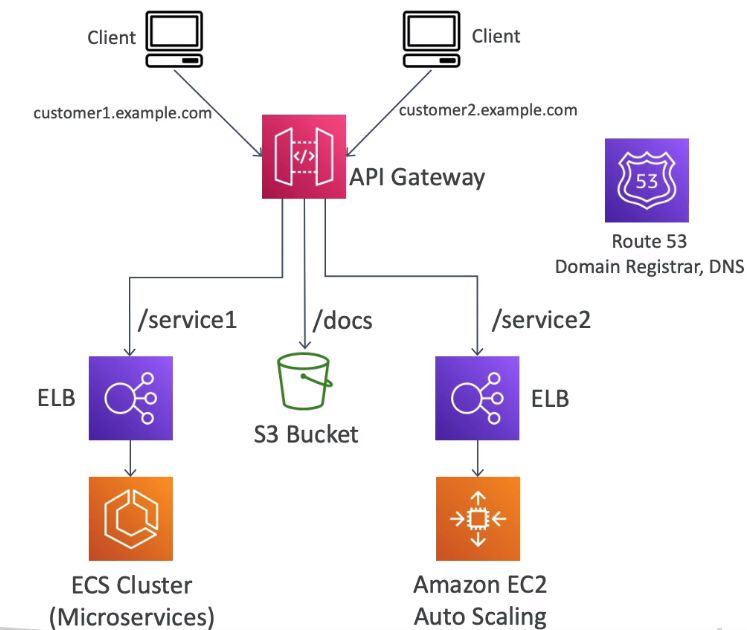

# AWS Certified SysOps Associate

Amazon Web Services(AWS) is a leading cloud provider, meaning they provide you with services and servers that can scale easily and on demand.


#### Table of contents

* [EC2 for SysOps](#ec2-for-sysops)
    * [Launching an EC2](#launching-an-ec2)
    * [Changing EC2 Instance Type](#changing-ec2-instance-type)
    * [Enhanced Networking](#enhanced-networking)
    * [EC2 - Placement Groups](#ec2---placement-groups)
    * [EC2 - Shutdown Behavior & Termination Protection](#ec2---shutdown-behavior-&-termination-protection)
    * [EC2 - TroubleShooting](#ec2---troubleshooting)
    * [EC2 - Instance Purchasing Options](#ec2---instance-purchasing-options)
    * [EC2 - Spot Instances & Spot Fleets](#ec2---spot-instances-&-spot-fleets)
    * [Burstable Instances](#burstable-instances)
    * [Elastic IPs](#elastic-ips)
    * [Cloudwatch Metrics for EC2](#cloudwatch-metrics-for-ec2)
    * [CloudWatch - Unified CloudWatch Agent](#cloudwatch---unified-cloudWatch-agent)
    * [EC2 - Instance Status Checks](#ec2---instance-status-checks)
    * [EC2 - Hibernate](#ec2---hibernate)
* [AMI - Amazon Machine Image](#ami---amazon-machine-image)
    * [AMI - No Reboot Option](#ami---no-reboot-option)
    * [EC2 - Instance Migration using AMIs](#ec2---instance-migration-using-amis)
    * [EC2 - Image Builder](#ec2---image-builder)
    * [AMI in Production](#ami-in-production)
* [Managing EC2 at Scale](#managing-ec2-at-scale)
    * [Systems Manager (SSM)](#systems-manager-(ssm))
        * [SSM - Resource Groups](#ssm---resource-groups)
        * [SSM - Documents](#ssm---documents)
        * [SSM - Run Command](#ssm---run-command)
        * [SSM - Automations](#ssm---automations)
        * [SSM - Inventory & State Manager](#ssm---inventory-&-state-manager)
        * [SSM - Patch Manager](#ssm---patch-manager)
        * [SSM - Session Manager](#ssm---session-manager)
        * [SSM - Parameter Store](#ssm---parameter-store)
    * [AWS OpsWorks](#aws-opsworks)
* [EC2 - High Availability and Scalability](#ec2---high-availability-and-scalability)
    * [ELB](#elb)
        * [ELB - Sticky Sessions](#elb---sticky-sessions)
        * [ELB - Cross Zone Load Balancing](#elb---cross-zone-load-balancing)
        * [ELB - SSL Certificates](#elb---ssl-certificates)
        * [ELB - Connection Draining](#elb---connection-draining)
        * [ELB - Health Checks](#elb---health-checks)
        * [ELB - Monitoring, Troubleshooting, Logging, Tracing](#elb---monitoring,-troubleshooting,-logging,-tracing)
        * [Target Group Attributes](#target-group-attributes)
        * [ALB - Rules](#alb---rules)
    * [ASG](#asg)
        * [ASG Scaling Policies](#asg-scaling-policies)
        * [ASG - SysOps](#asg---sysops)
        * [ASG - CloudWatch](#asg---cloudwatch)
        * [Auto Scaling](#auto-scaling)
* [Elastic Beanstalk](#elastic-beanstalk)
* [CloudFormation](#cloudformation)
    * [YAML](#yaml)
    * [CloudFormation Resources](#cloudformation-resources)
    * [CloudFormation Parameters](#cloudformation-parameters)
    * [CloudFormation Mappings](#cloudformation-mappings)
    * [CloudFormation Outputs](#cloudformation-outputs)
    * [CloudFormation Conditions](#cloudformation-conditions)
    * [CloudFormation Intrinsic Functions](#cloudformation-intrinsic-functions)
    * [CloudFormation Rollbacks](#cloudformation-rollbacks)
    * [CloudFormation User Data](#cloudformation-user-data)
    * [CloudFormation cfn-init](#cloudformation-cfn-init)
    * [CloudFormation cfn-signal](#cloudformation-cfn-signal)
    * [CloudFormation Nested Stacks](#cloudformation-nested-stacks)
    * [CloudFormation ChangeSets](#cloudformation-changesets)
    * [CloudFormation DeletionPolicy](#cloudformation-deletionpolicy)
    * [CloudFormation TerminationProtection](#cloudformation-terminationprotection)
    * [CloudFormation CreationPolicy](#cloudformation-creationpolicy)
    * [CloudFormation UpdatePolicy](#cloudformation-updatepolicy)
    * [CloudFormation DependsOn](#cloudformation-dependson)
    * [CloudFormation Stack Policies](#cloudformation-stack-policies)
    * [CloudFormation Multi Region StackSets](#cloudformation-multi-region-stacksets)
    * [CloudFormation Continue Rolling Back and Update](#cloudformation-continue-rolling-back-and-update)
* [Lambda for SysOps](#lambda-for-sysops)
    * [Lambda](#lambda)
    * [Lambda - S3 Event Notifications](#lambda---s3-event-notifications)
    * [Lambda - IAM Roles & Resource Policies](#lambda---iam-roles-&-resource-policies)
    * [Lambda - X-Ray Tracing](#lambda---x-ray-tracing)
    * [Lambda - Function Performance](#lambda---function-performance)
    * [Lambda - Concurrency](#lambda---concurrency)
    * [Lambda - Monitoring Extras](#lambda---monitoring-extras)
* [EC2 Storage and Data Management](#ec2-storage-and-data-management)
    * [EC2 - Instance Store](#ec2---instance-store)
    * [EBS](#ebs)
        * [EBS - Volume Types](#ebs---volume-types)
        * [EBS - Multi Attach](#ebs---multi-attach)
        * [EBS - Operations](#ebs---operations)
* [EFS](#efs)
    * [EFS - Access Points](#efs---access-points)
    * [EFS - Operations](#efs---operations)
    * [EFS - CloudWatch Metrics](#efs---cloudwatch-metrics)
* [S3](#s3)
    * [S3 - Policies](#s3---policies)
    * [S3 - Website](#s3---website)
    * [S3 - Versioning](#s3---versioning)
    * [S3 - Replication](#s3---replication)
    * [S3 - Storage Classes](#s3---storage-classes)
    * [S3 - Lifecycle Rules](#s3---lifecycle-rules)
    * [S3 - Event Notifications](#s3---event-notifications)
    * [S3 - Performance](#s3---performance)
    * [S3 & Glacier Select](#s3-&-glacier-select)
    * [S3 - Batch Operations](#s3---batch-operations)
    * [S3 - Inventory](#s3---inventory)
    * [S3 - Glacier](#s3---glacier)
    * [S3 - Glacier Vault Lock and Object Lock](#s3---glacier-vault-lock-and-object-lock)
    * [S3 - Multi-Part Upload](#s3---multi-part-upload)
    * [Athena](#athena)
    * [S3 - Encryption](#s3---encryption)
    * [S3 - CORS](#s3---cors)
    * [S3 - MFA](#s3---mfa)
    * [S3 - Access Logs](#s3---access-logs)
    * [S3 - Pre-signed URLs](#s3---pre-signed-urls)
    * [S3 - Access Points](#s3---access-points)
    * [S3 - VPC Endpoints](#s3---vpc-endpoints)
* [Advanced Storage](#advanced-storage)
    * [AWS Snow Family](#aws-snow-family)
    * [Amazon FSx](#amazon-fsx)
    * [Storage Gateway](#storage-gateway)
* [CloudFront](#cloudfront)
    * [CloudFront - TroubleShooting](#cloudfront---troubleshooting)
    * [CloudFront - Caching](#cloudfront---caching)
* [Databases for SysOps](#databases-for-sysops)
    * [RDS](#rds)
        * [RDS - Multi-AZ vs Read Replicas](#rds---multi-az-vs-read-replicas)
        * [RDS - Multi-AZ Failover Conditions](#rds---multi-az-failover-conditions)
        * [RDS Proxy](#rds-proxy)
        * [RDS - Parameter Groups](#rds---parameter-groups)
        * [RDS - Backups and Snapshots](#rds---backups-and-snapshots)
        * [RDS - Events and Logs](#rds---events-and-logs)
        * [RDS - CloudWatch](#rds---cloudwatch)
        * [RDS - Performance Insights](#rds---performance-insights)
    * [Aurora](#aurora)
        * [Aurora - Backups](#aurora---backups)
        * [Aurora - SysOps](#aurora---SysOps)
    * [RDS & Aurora Security](#rds-&-aurora-security)
    * [ElastiCache](#elasticache)
        * [ElastiCache - Redis Cluster Modes](#elasticache---redis-cluster-modes)
        * [ElastiCache - Redis for SysOps](#elasticache---redis-for-sysops)
        * [ElastiCache - Memcached for SysOps](#elasticache---memcached-for-sysops)
* [Monitoring, Auditing & Performance](#monitoring,-auditing-&-performance)
    * [CloudWatch - Metrics](#cloudwatch---metrics)
    * [CloudWatch - Custom Metrics](#cloudwatch---custom-metrics)
    * [CloudWatch - Dashboards](#cloudwatch---dashboards)
    * [CloudWatch - Logs](#cloudwatch---logs)
    * [CloudWatch - Alarms](#cloudwatch---alarms)
    * [CloudWatch - Synthetics](#cloudwatch---synthetics)
    * [EventBridge](#eventbridge)
        * [EventBridge - Content Filtering](#eventbridge---content-filtering)
        * [EventBridge - Input Transformation](#eventbridge---input-transformation)
    * [Service Quotas](#service-quotas)
    * [CloudTrail](#cloudtrail)
        * [CloudTrail - SysOps](#cloudtrail---sysops)
    * [Config](#config)
        * [Config - Aggregators](#config---aggregators)
* [AWS Account Management](#aws-account-management)
    * [Status Health Dashboard](#status-health-dashboard)
    * [Personal Health Dashboard](#personal-health-dashboard)
    * [Organizations](#organizations)
        * [Organizations - SysOps](#organizations---sysops)
    * [AWS Control Tower](#aws-control-tower)
    * [AWS Service Catalog](#aws-service-catalog)
    * [AWS Billing Alarms](#aws-billing-alarms)
    * [AWS Cost Explorer](#aws-cost-explorer)
    * [AWS Budgets](#aws-budgets)
    * [AWS Cost Allocation Tags & Cost & Usage Reports](#aws-cost-allocation-tags-&-cost-&-usage-reports)
    * [AWS Compute Optimizer](#aws-compute-optimizer)
* [Disaster Recovery](#disaster-recovery)
    * [AWS DataSync](#aws-datasync)
    * [AWS Backup](#aws-backup)
* [Security and Compliance](#security-and-compliance)
    * [Shared Responsibility Model](#shared-responsibility-model)
    * [DDoS, AWS Shield and AWS WAF](#ddos,-aws-shield-and-aws-waf)
    * [Penetration Testing on AWS](#penetration-testing-on-aws)
    * [Amazon Inspector](#amazon-inspector)
    * [Logging in AWS](#logging-in-aws)
    * [Amazon GuardDuty](#amazon-guardduty)
    * [Amazon Macie](#amazon-macie)
    * [Trusted Advisor](#trusted-advisor)
    * [Encryption](#encryption)
    * [KMS](#kms)
        * [KMS - Key Rotation](#kms---key-rotation)
        * [KMS - SysOps](#kms---sysops)
    * [CloudHSM](#cloudhsm)
    * [AWS Artifact](#aws-artifact)
    * [ACM](#acm)
    * [Secrets Manager](#secrets-manager)
        * [Secrets Manager - Monitoring & Troubleshooting](#secrets-manager---monitoring-&-troubleshooting)
* [Identity](#identity)
    * [IAM Security Tools](#iam-security-tools)
    * [IAM Access Analyzer](#iam-access-analyzer)
    * [Identity Federation with SAML & Cognito](#identity-federation-with-saml-&-cognito)
    * [STS & Cross Account Access](#sts-&-cross-account-access)
    * [Cognito User Pools](#cognito-user-pools)
    * [Cognito Identity Pools](#cognito-identity-pools)
    * [IAM Identity Center](#iam-identity-center)
* [Route 53](#route-53)
    * [Route 53 - S3 Website](#route-53---s3-website)
    * [Route 53 - Resolvers](#route-53---resolvers)
* [Networking - VPC](#networking---vpc)
    * [VPC](#vpc)
    * [Subnet](#subnet)
    * [Internet Gateways & Route Tables](#internet-gateways-&-route-tables)
    * [Bastion Hosts](#bastion-hosts)
    * [NAT Instances](#nat-instances)
    * [NAT Gateways](#nat-gateways)
    * [NACL & Security Groups](#nacl-&-security-groups)
    * [VPC Peering](#vpc-peering)
    * [VPC Endpoints](#vpc-endpoints)
    * [VPC Flow Logs](#vpc-flow-logs)
    * [Site-to-Site VPN and Gateways](#site-to-site-vpn-and-gateways)
    * [Direct Connect](#direct-connect)
    * [Transit Gateway](#transit-gateway)
    * [VPC Traffic Monitoring](#vpc-traffic-monitoring)
    * [IPv6 for VPC](#ipv6-for-vpc)
    * [Egress Only Internet Gateway](#egress-only-internet-gateway)
    * [Networking Costs](#networking-costs)
    * [AWS Network Firewall](#aws-network-firewall)
* [Other Services](#other-services)


&nbsp;
# EC2 for SysOps

## Launching an EC2
* to connect with instances/servers you can use: 
    * `EC2 Instance Connect` - doesnt require SSH key cause they will be temporarily uploaded for the session
    * `Session manager` - no ports required
    * `SSH` - requires port 22 open in EC2 SG


## Changing EC2 Instance Type
You can change the instance type by:
1. Stop the instance
1. Right click in console and select `Change Instance Type`
1. Only works for EBS backed instances
1. Newer instance types have EBS Optimized enabled for better throughput


## Enhanced Networking
* **EC2 Enhanced Networking (SR-IOV)**
    * higher bandwidth, higher PPS (packet per second), lower latency
    * to enable:
        * Option 1 : setup `Elastic Network Adapter (ENA)` to get up to 100 Gbps
        * Option 2 : use `Intel 82599 VF` give up to 10Gbps -> LEGACY
    * is enabled by default in newer generatioin instances
* **Elastic Fabric Adapter (EFA)**
    * `improved ENA` for HPC
    * only works on `Linux`
    * great for inter-node communcations, `tightly coupled workloads`
    * leverages `Message Passing Interface (MPI)` standard
    * bypasses the underlying Linux OS to provide low-latency, reliable transport

```shell
# check if ENA is installed
modinfo ena 

# information about network interface driver
#   - driver: vif -> not using ena
#   - driver: ena -> using ena
ethtool -i eth0 
```


## EC2 - Placement Groups
* defining placement groups gives control over EC2 Instance physical placement
* **Placement Strategies**:
    * `Cluster`
        * clusters instances into a low-latency group in a single AZ on the same rack
        * pros:
            * great network (10 Gbps bandwidth between instances)
        * cons:
            * if rack fails, all instance fails at the same time
        * use case: Big Data job that needs to complete fast, app that needs extremely low latency and high network throughput
    * `Spread`
        * spreads instances across underlying hardware
        * max 7 instances per group per AZ
        * pros:
            * minimizes risk of simultaneous failure
            * can span across AZ
            * instances on different physical hardware
        cons:
            * limited to 7 instances per AZ per placement group
        * use case: HA, critical applications where instances need isolation from each other
    * `Partition`
        * spreads instances across many different partitions, which rely on different server racks within an AZ
        * scales to 100s of EC2 instances per group
        * up to 7 partitions per AZ
        * can span multiple AZs
        * instances in a partition do not share rack with instances in other partition
        * a partition failure can affect many EC2 but wont effect other partitions
        * EC2 instances get acess to the partition information as metadata
        * use case: Hadoop, Cassandra, Kafka, HBase, HDFS


## EC2 - Shutdown Behavior & Termination Protection
* **Shutdown Behavior** - if OS shuts down from OS:
    * `Stop` -> default behavior, changes status to stopped
    * `Terminate` -> changes status to terminated
    * not applicable from AWS console
    * CLI attibute: `InstanceInitiatedShutdownBehavior`
* **Termination protection**
    * can be enabled to protect against accidental termination in AWS Console or CLI
    * tip: if `shutdown behavior = terminate` and `enable termination protection = true` and we terminate from OS it will still be terminated

``` shell
# shutdown instance
sudo shutdown
```


## EC2 - TroubleShooting
* **Launch Issues**
    * `# InstanceLimitExceeded` -> you have reached your limit of max number of vCPUs per region
        * On-Demand instance limits set per-region basis
        * vCPU limits only apply to running On-Demand and Spot instances
        * resolution: 
            * launch in different region
            * request quota increase from AWS for the region
                * `Console` -> `EC2` -> `Limits` -> `Request Limit Increase`
                * `Console` -> `Service Quotas Console` -> `Amazon Elastic Compute Cloud`
    * `# InsufficientInstanceCapacity` -> AWS does not have enough On-Demand capacity in the particular AZ where the instance is launched
        * resolution:
            * wait and request again
            * if making multiple requests, break down the requests
            * submit a request for a different instance type
            * launch in different AZ
    * `# Instance Terminates Immediately` -> goes from pending to terminated
        * causes:
            * reached EBS volume limit
            * corrupt EBS snapshot
            * root EBS is encrypted and you do not have permissions for KMS key decryption
            * instance store-backed AMI used is missing required part (an `image.part.xx` file)
        * troubleshooting:
            * `Console` -> `EC2` -> `Instance` -> `Instance` -> `Description` -> reason next to State transition label
* **SSH Issues**
    * `Unprotewcted private key file`
        * private key (`pem` file) on linux machine does not have `400` permissions
    * `Host Key not found` / `Permission denied` / `Connection close by [instance] port 22`
        * username for the OS was not given correctly when logging via SSH
    * `Connection timed out`
        * causes:
            * SG doesnt allow inbound TCP traffic on port 22
            * NACL is not configured correctly
            * route table of subnet does not route traffic to IGW
            * instance doesn't have IPv4
            * CPU load of instance is high
    * **Instance Connect**
        * is used through a range of IPs
        * the user goes through `EC2 Instance Connect API` so his IP is not taken into account
        * the SG should allow SSH on a range of IPs -> `18.206.107.24/29`
            * range is region specific and can be checked: https://ip-ranges.amazonaws.com/ip-ranges.json
        * a temporary SSH public key that is valid 60s is used by AWS

Change permissions of key file:
```shell
chmod 0400 KeyPair.pem
```

Instance connect IP configuration
``` json
{
    "ip_prefix": "18.206.107.24/29",
    "region": "us-east-1",
    "service": "EC2_INSTANCE_CONNECT",
    "network_border_group": "us-east-1"
}
```
    


## EC2 - Instance Purchasing Options
* **Tenancy** defines how EC2 instances are distributed across physical hardware and affect pricing
* purchase options include:
    * **On-Demand Instances** - short workload, predictable pricing, pay by second
        * billing per second after first minute for Linux or Windows
        * billing per hour for other OS
        * *highest cost* but no *upfront payment*
        * best if: 
            * *short* workload
            * *uninterrupted* workload
            * *cant predict* application behavior
    * **Reserved** (1 & 3 years)
        * types:
            * **Reservecd Instances** - long workloads
            * **Convertible Reserved Instances** - long workloads with flexible instances
        * Up to 72% discount compared to On-demand
        * reserve specific instance attributes (Type, Region, Tenancy, OS)
        * the higher the *reservation period* the higher the discount
        * *payment options* - no upfront, partial upfront, all upfront
        * *scope* - region or zonal
        * can buy and sell in the `Reserved Instance Marketplace`
        * best for:
            * steady-state usage applications (like DB)
    * **Savings Plan** (1 & 3 years) - commitment to an amount of usage
        * discount based on long-term usage
        * commit to a type of usage (like $/hour for 1 or 3 years)
        * usage beyond Saving Plans is billed at On-Demand price
        * **locked** to *instance family* and *AWS region*
        * **flexible** across *instance size*, *os*, *tenancy*(Host, Dedicated, Default)
    * **Spot Instances** - short workloads, can lose instances (less reliable)
        * up to 90% disount compared to on-demand
        * can lose at any point of time if your `max spot price` is less then `current spot price`
            * in this scenario can choose to stop or terminate instance with a 2 minutes grace period
        * *most cost-efficient* instances
        * useful for workloads that are *resilient to failure* like:
            * *batch jobs*
            * *data analysis*
            * *image processing*
            * *distributed workkloads*
            * *workloads with flexible start and end time*
        * *not suitable* for critical jobs or databases
    * **Dedicated Hosts** - book an entire **physical server**, control instance placement
        * physical server with EC2 capacity fully dedicated to your use
        * allows addressing *compliance requirements* and *existing server-bound software licenses*(per-socket, per-core, per-VM software licenses)
        * purchasing options: *On-demand*, *Reserved (No Upfront, Partial Upfront, All Upfront)*
        * characteristics:
            * enables the use of dedicated physical servers
            * per host billing
            * visibility of sockets, cores, host ID
            * affinity between a host and instance
            * targeted or automatic instance placement
            * add capacity using an allocation request
    * **Dedicated Instances** - no other customers will share your hardware
        * runs on **hardware* that is dedicated to you, but may share it with other instances you control
        * you have no control over instance placement
        * per instance billing (subject to 2$ per region fee)
    * **Capacity Reservations** - reserve capacity in a specific AZ for any duration
        * reserve On-Demand instances capacity in an AZ for any duration
        * always have access to that capacity
        * pay hourly rates even if you dont use it
        * *no time commitment* and *no billing discounts*
        * sutiable for *short-term uninterrupted workloads* that need to be in a specific AZ


## EC2 - Spot Instances & Spot Fleets
* **Spot Instances** - short workloads, can lose instances (less reliable)
    * up to 90% disount compared to on-demand
    * can lose at any point of time if your `max spot price` is less then `current spot price`
        * in this scenario can choose to stop or terminate instance with a 2 minutes grace period
    * *most cost-efficient* instances
    * useful for workloads that are *resilient to failure* like:
        * *batch jobs*
        * *data analysis*
        * *image processing*
        * *distributed workkloads*
        * *workloads with flexible start and end time*
    * *not suitable* for critical jobs or databases
    * a **spot request** consists of:
        * max price
        * desired number of instances
        * launch specification
        * request type -> one-time | persistent
        * valid from
        * valid until
* **Spot Fleets** - set of Spot Instance + optional On-Demand Instances
    * will try to meet the target capacity with price constraints
    * define possible launch pools: `instance type`, `OS`, `AZ`
    * can have multiple launch pools (fleet can choose)
    * stop launching instances when cap reached or max cost
    * strategies to allocate Spot Instances:
        * `lowerPrice`: from the pool with lowest price (cost optimization, short workload)
        * `diversified`: distributed across all pools (good for availability, long workloads)
        * `capacityOptimized`: pool with optimal capacity for the number of instances
    * benefit: Allows us to automatically request Spot Instances with the lowest price


## Burstable Instances
* **Burstable Instances** - instances within the `T` family
    * have **OK** CPU performance
    * when machine gets a spike in load, it can `burst` and CPU can be **VERY** good
    * bursting utilizes `burst credits`
    * if burst credits gone - CPU becomes **BAD** -> drops to baseline
    * different instance types have different:
        * `Launch credits` -> burst credits at launch
        * `CPU credits earned per hour` -> how quickly you replenish burst credits
        * `Maximum earned CPU credit balance` -> cap on burst credits
        * `Baseline performance` -> minimal CPU performance
    * use:
        * great for unexpected traffic
        * if consistently runs low on credit -> move to different kind of non-burstable instance
* **T2 / T3 Unlimied** - unlimited burst credit balance instance tpye
    * `pay extra` if over credit balance but wont lose performance
    * if average CPU usage over 24h exceeds baseline -> billed for additional `vCPU/h`
    * costs can go high if not monitoring CPU health


## Elastic IPs
* **Elastic IP** -> allows setting a fixed public IPv4 IP to an EC2 instance
    * wont change as long as you dont delete it
    * can attach to one instance at a time
    * allows masking the failure of an instance by `rapidly remapping` the address
    * can only have `5 Elastic` IP in your account (can ask AWS to increase)
    * free of charge if attached -> payed if reserved but not attached
    * avoid using Elastic IP:
        * often reflect poor architectural decisions
        * instead -> use random public IP and register a DNS name to it
        * can also use load balancer and not use public IP at all


## Cloudwatch Metrics for EC2
* **AWS Provided metrics**:
    * `Basic Monitoring (default)` - metrics collected at 5min interval
    * `Detailed Monitoring (paid)` - metrics collected at 1min interval
    * metrics: 
        * `CPU`
            * utilization
            * credit usage / balance
        * `Network`
            * in
            * out
            * packets
        * `Disk`
            * Read / Write for Ops / Bytes (only for isntance store)
        * `Status Check Metrics`
            * Instance status = check the EC2 VM
            * System status = check the underlying hardware
        * RAM is NOT included in the AWS EC2 metrics
* **Custom metric**:
    * `Basic Resolution` - 1 minute resolution
    * `High Resolution` - 1 second resolution
    * metrics: `RAM`, `Application level metrics`
    * access: IAM permissions on the EC2 instance role


## CloudWatch - Unified CloudWatch Agent
* **Agent** - needs to run on EC2 or on-premises to push log files to CloudWatch
* EC2 must have IAM permission to do this
    * CloudWatch Logs
    * CloudWatch Metrics
* IAM policies for Agent specific operations also available:
    * CloudWatch Agent Server
    * CloudWatch Agent Administrator -> enables storing config in SSM Parameter Store
* **CloudWatch Unified Agent**
    * new version
    * collect additional system-level metrics (RAM, processes, etc..)
        * `CPU` - active / guest / idle / system / user / steal
        * `Disk metrics` - free / used / total, Disk IO -> writes / reades / bytes / iops
        * `RAM` - free / inactive / used / total / cached
        * `Netstat` - TCP, UDP connection count / net packets / bytes
        * `Processes` -  total / dead / bloqued / idle / running / sleep
        * `Swap Space` - free / used / used %
    * collect logs and send to CloudWatch logs
     * centralized configuration using SSM Parameter Store
* out-of-the box metrics for EC2 -> disk, CPU, network (high level)
* default namespace for metrics is `CWAgent` - can be configured / changed
* **procstat Plugin** - collect metrics and monitor system utilization of individual processes
    * supports Linux and Windows
    * example metrics:
        * process use of CPU
        * process use of memory
    * select which processes to monitor by:
        * `pid_file` -> name of process identification number (PID) files they create
        * `exe` -> process name that match string you specify (RegEx)
        * `pattern` -> command lines used to start the processes (RegEx)
    * namespace for procstat metrics is `procstat`
        * `procstat_cpu_time`

```shell
# enable server to send some content over http
echo "hello world" > /var/www/html/index.html
sudo systemctl start httpd
sudo systemctl enable httpd

# various logs are available for the httpd process
cat /var/log/httpd/access_log
cat /var/log/httpd/error_log

# install the CloudWatch agent
sudo yum install amazon-cloudwatch-agent

# run the install wizard
#   - stores configs in SSM Parameter Store
#   - prints thew config in json at the end
#   - can specify log file to monitor like /var/log/httpd/access_log
sudo /opt/aws/amazon-cloudwatch-agent/bin/amazon-cloudwatch-agent-config-wizard

# create required files
sudo mkdir -p /usr/share/collectd
sudo touch /usr/share/collectd/types.db

# set options
#   - can fetch configs from SSM Parameter Store
#   - in example below the config id is: AmazonCloudWatch-linux
#   - can provide reference to ssm parameter store: -c ssm:<name of parameter>
#   - can also provide flat file path: -c file:/path/to/file/config.json
sudo /opt/aws/amazon-cloudwatch-agent/bin/amazon-cloudwatch-agent-ctl \
    -a fetch-config \
    -m ec2 \
    -c ssm:AmazonCloudWatch-linux -s

sudo /opt/aws/amazon-cloudwatch-agent/bin/amazon-cloudwatch-agent-ctl \
    -a fetch-config \
    -m ec2 \
    -c file:/opt/aws/amazon-cloudwatchagent/bin/config.json -s
```


## EC2 - Instance Status Checks
* **Instance Status Checks** -  autoamted checks to identify hardware and software issues
    * **System Status Checks**
        * monitors problems with AWS systems 
            * `lost of network connectivity`
            * `loss of system power`
            * `software issues on the physical host`
            * `hardware issues on the physical host that impact network reachability`
        * check `Personal Health Dashboard` for any scheduled critical maintenance by AWS to hosts
        * `Resolution`: stop and start instance -> will be migrated to a new host(new IP)
    * **Instance Status Checks**
        * monitors software / network configuration of your individual instance:
            * `incorrect networking or startup configuration`
            * `exhausted memory`
            * `corrupted file system`
            * `incompatible kernel`
        * requires your involvement to fix
        * `Resolution`: reboot the instance or change the instance configuration
    * **CW Metrics & Recovery**
        * ClouWatch Metrics:
            * `StatusCheckFailed_System`
            * `StatusCheckFailed_Instance`
            * `StatusCheckFailed` -> both
        * automate with `CloudWatch Alarm`
            * recover EC2 isntance with same private IP / public IP / EIP / metadata / Placement Group
            * send notifications using SNS
        * automate with ASG:
            * less conventional
            * set min / max / desired to 1 to recover instance
            * wont keep private IP / EIP
```shell
# set alarm state for tst / debug purposes
aws cloudwatch set-alarm-state \
    --alarm-name <alarm name here> \
    --state-value ALARM \
    --state-reason "test recovery action"
```


## EC2 - Hibernate
* operations on instances:
    * `stop` -> the data on disk (EBS) is kept intact in the next start
    * `terminate` -> any EBS volumes (root) also set-up to be destroyed is lost
    * `start` -> OS boots, EC2 User Data script is run, app starts, caches get warmed up -> can take time
* **EC2 Hibernate** - the in-memory (RAM) state is preserved
    * instance boot is much faster
    * under the hood -> RAM state is written to a file in the root EBS volume
    * root EBS volume must be encrypted, not instance store and large
    * use cases: long running processing, saving the RAM state, services that take time to initialize
    * *supported instance families*: C3, C4, C5, I3, M3, M4, R3, R4, T2, T3
    * instance RAM size must be less than 150 GB
    * not supported for bare metal instances
    * **supported AMI**: Amazon Linux 2, Linux AMI, Ubuntu, RHEL, CentOS, Windows
    * available in `On-Demand`, `Reserved`, `Spot` instances
    * instance cannot be hibernated for more than `60 days`


&nbsp;
# AMI - Amazon Machine Image
* **AMI** - **Amazon Machine Image** - *customization* of an EC2 instance:
    * add own software, configuration, OS, monitoring
    * faster boot thx to pre-packaged software
* region specific and can be copied across regions
* you can launch EC2 instances from:
    * `public AMI` - provided by AWS
    * `own AMI` - you make and maintain them
    * `AWS Marketplace AMI` - an AMI someone else made and potentially sells
* you can:
    * build an AMI from an existing EC2 instance(which creates EBS snapshot)
* **Instantiating Applications Quickly**
    * **Golden AMI** - an AMI that serves as a bootstrap for all EC2 instances you use within a logical group(like for ECS Cluster, or ASG), contain all applications, OS dependencies etc
    * **Bootstrap using User Data** - good for dynamic configurations like database URL
    * **Hybrid** - mix Golden AMI and User Data to setup a fleet of EC2 instances quickly and reliably


## AMI - No Reboot Option
* enables you to create an AMI without shutting down your instance
* not selected by default -> EC2 will shutdown before creating an AMI to maintain file system integrity
* risk: no-reboot causes OS buffers not to be flushed before the snapshot is created
* **AWS Backup**
    * does not reboot instances while taking EBS snapshot
    * wont guarentee creation of AMI with file system integrity
    * to maintain integrity:
        * provide reboot parameter while taking images
        * `EventBridge` + `Lambda` + `CreateImage API with reboot`


## EC2 - Instance Migration using AMIs
* `AZ to AZ`
    * create AMI in AZ 1
    * launch / restore from AMI in AZ 2
* `Cross-Account AMI Sharing`
    * does not affect ownership of AMI
    * can only share AMI that:
        * have `unencrypted` volumes
        * volumes `encrypted` with custom managed key
            * must share key with Key Policy
            * provide permissions `kms:DescribeKey`, `kms:CreateGrant`, `kms:Decrypt`, `kms:GenerateDataKey`, `kms:ReEncrypt`
* `Cross-Account AMI Copy`
    * you are owner of copied AMI
    * source AMI owner must grant read permissions for the storage that backs AMI (EBS Snapshot)
    * if encrypted owner must share key / keys 
    * can reencrypt AMI with own CMK while copying


## EC2 - Image Builder
* **EC2 Image Builder** - automate creation of VM or container images
    * a regional service
    * free service, only pay for underlying resources(EC2 instances, storage of AMI)
    * automate the creation/maintenance/validation/testing of EC2 AMIs
    * steps:
        * creates a *Builder EC2 Instance* - build components applied like custom software
        * creates a new AMI from the Builder EC2 instance
        * creates a *Test EC2 Instance* from the AMI - runs test suite to check if its working/secure/app running
        * distributes the AMI - allows distribution to multiple regions
    * can run on a schedule like weekly/triggers(package updates)/manually
    * *Recipe* - how source image is customized
    * *Infrastructure Configuration* - ec2 instance type and configs(like IAM)
    * *Distribution Settings* - what regions the AMI will be distributed to


## AMI in Production
* can `force` users to only launch EC2 isntances from `pre-approved AMIs` using `IAM policies`
* **Pre-approved AMIs** are AMIs with specific tags
* can combine with `AWS Config` to find non-compliant EC2 instances (launch with non-approved AMIs)

```json
{
    "Condition": {
        "StringEquals": {
            "ec2:ResourceTag/Environment": "Prod"
        }
    }
}
```


&nbsp;
# Managing EC2 at Scale
* how to manage flee of EC2 instances and on-premise servers?
* how to apply patches at scale?
* how to run automations?
* how to store parameters?


## Systems Manager (SSM)
* **AWS Systems Manager (SSM)** - helps manage EC2 and On-Premises systems at scale
    * `Hybrid Service` - allows managing both AWS and On-Premises resources
    * get operational insights about the state of your infrastructure
    * easily detect problems
    * free service
    * patching automation for enhanced compliance
    * suite of 10+ products:
        * `Resource Groups`
        * `Operations Management`
            * Explorer
            * OpsCenter
            * CloudWatch Dashboard
            * PHD
            * Incident Manager
        * `Shared Resources` -> Documents
        * `Change Management`
            * Change Manager
            * Automation
            * Change Calendar
            * Maintenance Windows
        * `Application Management`
            * Application Manager
            * AppConfig
            * Parameter Store
        * `Node Management`
            * Fleet Manager - view fleet of EC2 Instances
            * Compliance
            * Inventory
            * Hybrid Activations
            * Session Manager
            * Run Command
            * State Manager
            * Patch Manager
            * Distributer
    * works with Windows and Linux OS
    * integrated with:
        * `CloudWatch metrics / dashboards
        * AWS Config
* **How it works**
    * install SSM agent onto the systems we control - default on Amazon Linux 2 AMI & some Ubuntu AMI
    * if an instance cant be controlled with SSM -> most likely an SSM issue
    * make sure EC2 isntances have proper IAM role
        * create IAM instance profile
        * provide it with `AmazonSSMManagedInstanceCore` - enough permissioins for it to be managed by SSM


### SSM - Resource Groups
* **AWS Tags** - key-value pairs called `Tags` attached to many AWS resource, commonly used in EC2
    * free naming
    * common tags are: `Name`, `Environment`, `Team`
    * used for:
        * resource grouping
        * automation
        * cost allocation
    * better to have too many tags than too few
* **SSM - Resource Groups** - create / view / manage logical group of resources based on tags
    * regional service
    * works with EC2, S3, DynamoDB, Lambda, etc.
    * allows creation of logical groups like:
        * apps
        * different layers of an app stack
        * production versus development environments


### SSM - Documents
* **SSM - Documents** - define parameters and actions to perform on 
    * can be JSON or YAML
    * prebuilt documents exist in AWS
    * can:
        * perform `Run Command`
        * run actions in `State Manager`, `Patch Manager`, `Automation`
        * get parameters from `Parameter Store`

Example Document
```yaml
---
schemaVersion: '2.2'
description: State Manager Bootstrap Example
parameters: {}
mainSteps:
    - action: aws:runShellScript
      name: configureServer
      inputs:
        runCommand:
            - sudo yum install -y httpd
            - sudo yum --enablrepo=epel install -y clamav
```


### SSM - Run Command
* **SSM - Run Command** - execute document (script) or just run a command
    * run command `across multiple instances` (using resource groups)
    * run `inside` EC2 instances
    * `Rate` Control / `Error` Control
        * useful when running on a lot of instances 
        * rate -> how many to run on
        * error -> what to do in case of error 
    * `no` need for `SSH`
    * Command `Output` can be:
        * shown in the `AWS Console`
        * sent to `S3 Bucket`
        * sent to `CloudWatch Logs`
    * send notifications to `SNS` about command status (In progress, Success, Failed)
    * intergrated with `IAM` & `CloudTrail`
    * can be invoked by `EventBridge`


### SSM - Automations
* **SSM - Automations** - simplifies common maintenance and deployment tasks of EC2 isntances and other AWS resources
    * examples: restart instances, create an AMI, EBS snapshot
    * runs `outside` of EC2 instances
    * `Automation Runbook` - SSM Documents to define actions performed on your EC2 isntances or AWS resources (pre-defined or custom)
    * can be triggered using:
        * manually using AWS Console, AWS CLI or SDK
        * Amazon EventBridge
        * on a schedule using maintenance windows
        * by AWS Config for rules remediations
    * execute options:
        * `simple execution` -> execute on specific targets all at once
        * `rate control` -> define concurrency and error thresholds
        * `multi-account and region` -> execute across accounts and regions
        * `manual execution` -> step by step manual


### SSM - Inventory & State Manager
* **SSM - Inventory** - collect metadata from your managed instances (EC2 / On-premises)
    * metadata: `installed software`, `os drivers`, `configurations`, `installed updates`, `running services`
    * view data in:
        * AWS Console
        * store in `S3`
        * query and analyze with `Athena` and `QuickSight`
    * specify metadata collection interval (minutes, hours, days)
    * query data from multiple AWS accounts and regions
    * create `Custom Inventory` for your custom metadata (e.g. rack location of each managed instance)
* **SSM - State Manager** - automate the process of keeping your managed isntances in a state that you define
    * use cases: `bootstrap` instances with software, `patch` OS / `software updates` on a `schedule`
    * **State Manager Association** - defines the state that you want to maintain to your managed instances
        * example: port 22 must be closed, antivirus must be installed
        * specify schedule when configuration is applied
    * uses `SSM Documents` to create an `Association`
* **Resource Data Sync** - synces inventory data into S3 or Athena, can query installed packages etc


### SSM - Patch Manager
* **SSM - Patch Manager** - automates process of patching managed instances
    * OS updates, applications updates, security updates
    * supports EC2 instances and on-premises servers
    * supports Linux, macOS, Windows
    * patch on-demand or on a schedule using `Maintenance Windows`
    * scan instances and generate patch compliance reports
    * **Patch Baseline** - defines which patches should / shouldnt be installed on your instances
        * ability to create custom Patch Baselines (approved / rejected patches)
        * patches can be auto-approved within days of their release
        * by default -> install only critical patches / security patches
    * **Patch Group** - associate set of instances with specific Patch Baseline
        * example: `dev`, `test`, `prod`
        * instances should be defined with `tag` key `Patch Group`
        * an instance can only be in one Patch Group
        * Patch Group can be registered with only one Patch Baseline
    * process:
        * uses `Run command` to run `Document` -> `AWS-RunBatchBaseline` on each configured EC2 Instance
        * SSM Agent on each instances queries `Patch Manager` to get the list of patches that need to be installed
* **Maintenance Windows**
    * defines a schedule for when to perform actions on your instances
    * example: OS Patch, updating drivers, installing software
    * maintenance window contains:
        * schedule
        * duration
        * set of registered instances
        * set of registered tasks
        * rate control


### SSM - Session Manager
* **SSM - Session Manager** - start SSH on EC2 and on-premises servers without SSH access / bastion hosts / SSH keys
    * access through AWS Console, AWS CLI, Session Manager SDK 
    * no port 22 needed
    * support for Linux / macOS / Windows
    * send all commands as log data to S3 or CloudWatch Logs -> more compliance and security
    * `CloudTrail` integration to itnercept `StartSession` events
    * **Managed Nodes** - EC2 instances and other servers configured to work with SSM Session Manager
* **IAM Persmissions**
    * control which users / groups on which can use Session Manager on which instances
    * use tags to restrict access to only specific EC2 instances
    * access SSM + wrtie to S3 + write to CloudWatch
    * optionally: restrict commands a user can run in a session

IAM Permission that allows starting session only on dev resources
```json
{
    "Version": "2012-10-17",
    "Statement": [
        {
            "Effect": "Allow",
            "Action": "ssm:StartSession",
            "Resource": "arn:aws:ec2:us-east-1:123456789012:instance/*",
            "Condition": {
                "StringLike": {
                    "ssm:resourceTag/Environment": ["Dev"] 
                }
            }
        }
    ]
}

```


### SSM - Parameter Store
* **SSM - Parameter Store** - secure storage for configuration and secrets
    * optional seamless `encryption` using `KMS`
    * serverless, scalable, durable
    * easy SDK
    * `version tracking` of configurations / secrets
    * security through `IAM`
    * notifications with `Amazon EventBridge`
    * integration with `CloudFormation`
    * enables hierarchical organization of keys:
        * `/finance/`
            * `app/`
                * `dev/`
                    * `db-url`
                    * `db-password`
                * `prod/`
                    * `db-url`
                    * `db-password`
    * can access secrets in `Secrets Manager` through `/aws/reference/secretsmanager/secret_ID_in_Secrets_Manager`
    * public parameters included by aws like `/aws/service/ami-amazon-linux-latest/amzn2-ami-hvm-x86_64-gp2`
* **Tiers**
    * `Standard`: 
        * 10000 params allowed per account & region
        * max 4 KB parameter size
        * no parameter policies available
        * no additional charge
        * free storage
    * `Advanced`:
        * 100000 params allowed per account & region
        * max 8 KB parameter size
        * parameter policies available
        * charges apply
        * 0.05 $ per advanced parameter per month
* **Parameter Policies**
    * allow assigning a TTL to a parameter
    * allows forcing updating or deleting sensitive data such as passwords
    * can assign multiple policies at a time

Expiration Parameter Policy example:
```json
{
    "Type": "Expiration",
    "Version": "1.0",
    "Attributes": {
        "Timestamp": "2020-12-02T21:34:33.000Z"
    }
}
```

Expiration Notification:
```json
{
    "Type": "ExpirationNotification",
    "Version": "1.0",
    "Attributes": {
        "Before": "15",
        "Unit": "Days"
    }
        
}
```


## AWS OpsWorks
* **AWS OpsWorks** is a managed Chef & Puppet, alternative to `AWS SSM`
* **Chef**, **Puppet** - tools for performing server configuration automatically, or repetitive actions
    * work great with EC2 & On-Premises VM
    * only allow provisioning standard AWS resources, like:
        * EC2 instances, Databases, Load Balancers, EBS volumes
* **Architecture**
    * *OpsWorksStacks* -> [*ELB Layer* -> [`ALB`, `OpsWorks Layers`], *Application Server Layer* -> [`EC2`, `OpsWorks Layer`], *Database Layer* -> [`Database Server(RDS)`, `OpsWorks Layers`]]
    * *Cookbook Repository* -> *Application Server Layer* <- *Applications* <- *App Repository*
* use case: if you use *Chef* and *Puppet* before moving to AWS and want to reuse templates
* work with Linux / Windows
* automate user accounts / cron / ntp / packages / services
* leverage `Recipes` or `Manifests`
* similiarities with SSM / Beanstalk / CloudFormation
* open-source tools -> cloud-agnostic


&nbsp;
# EC2 - High Availability and Scalability
* **Scalability** - can handle greater loads by adapting
    * `Vertical Scalability` - increasing the size of an instance, `scale up / down`
        * common for non-distributed systems like a DB ( RDS, ElastiCache )
        * limited by hardware
    * `Horizontal Scalability` (elasticity) - increasing number of instances / systems for application, `scale out / in`
        * implies distributed systems like a web application / modern application
        * not everything can be distributed
        * made simple by cloud services like [ASG](#asg), [ELB](#elb)
* **High Availability** - running your application in at least 2 data centers(2 AZ)
    * goal is to survive a data center loss
    * *Passive* - a resource that can take over when an active resource fails (like DB replica in another AZ) 
    * *Active* - multiple replicas of the resource are in use(like horizontally scaled architecture)
    * facilitated by services like [ASG](#asg) with multi AZ enabled or [ELB](#elb) with multi AZ enabled
* **Definitions**
    * *Scalibility* - ability to accommodate a larger load by making the hardware stronger, or by adding nodes
    * *Elasticity* - the system can automatically scale based on the load it is receiving 
    * *Agility* - how easily available new IT resources are ( 1 week, 1 minute, etc.)


## ELB
* **Load Balances** - servers that forward traffic to multiple servers downstream. Used to:
    * `spread load` across instances
    * expose a `single point of access` (DNS) to your application
    * seamlessly `handle` downstream instance `failure` 
    * perform `healthchecks`
    * provide `SSL termination` (HTTPS) for your websites => decrypting SSL-encrypted data traffic before offloading it to a web server
    * enforce `stickiness` with cookies => assign identification(through cookies or IP details) and fix routing based on it
        * `Stickiness` - the ability to route traffic from a client to a single destination, instead of balancing traffic across multiple destinations
    * enable `HA` across zones
    * separate `public` from `private traffic`
* **ELB** - **Elastic Load Balancing** - a managed load balancer 
    * *managed* means:
        * AWS guarentees it will be working
        * AWS takes care of upgrades, maintenance and HA
        * AWS provides only a few configuration knobs
    * cheaper to setup own LB but a lot more effort
    * integrated with AWS services:
        * [EC2](#ec2), [ASG](#asg), [ECS](#ecs)
        * [ACM](#other-services), [CloudWatch](#cloudwatch)
        * [Route 53](#route-53), WAF, AWS Global Accelarator
    * need to configure security groups on load balancers to specify rules for incoming/outgoing traffic
* **Health Checks** are crucial for loadbalancers
    * enable to know if instances handling traffic can reply to requests 
    * are done on a specific port and a specific route like `/health` for example:
        * Protocol: `HTTP`
        * Port: `4567`
        * Endpoint: `/health`
    * if response to health check is not `200 (OK)` then labeled `unhealthy`
* **4 kinds** of LB are available on AWS:
    * **CLB** - *Classic Load Balancer* - `v1`, old generation, LB available from 2009 
        * operates on Layer 4 and Layer 7
        * for `protocols` HTTP, HTTPS, TCP, SSL (secure TCP)
        * **retired in 2023**
    * **ALB** - *Application Load Balancer* - `v2`, new generation, LB available from 2016
        * Layer 7 (HTTP)
        * HTTP routing features
            * load balancing to multiple HTTP applications across machines(target groups)
            * can load balance to multiple apps on one EC2 instance(like Docker containers)
            * support redirects (like HTTP -> HTTPS)
        * Routing Tables to multiple target groups:
            * routing based on path in URL (example.com/`users`)
            * routing based on hostname in URL (`one`.example.com, `other`.example.com)
            * routing based on query string, headers (example.com/users?`id=123&order=false`)
        * Static DNS (URL)
        * for `protocols` HTTP, HTTPS, WebSocket, gRPC
        * **use cases**: micro services & container-based apps (ex. Docker & Amazon ECS)
        * Port mapping feature -> redirect to a dynamic port in ECS
        * **target group**:
            * can be:
                * EC2 Instances -> HTTP
                * ECS tasks -> HTTP
                * Lambda functions -> HTTP -> JSON event
                * IP Addresses -> only  Private IP Address, like a Data Center
            * can route to multiple target groups
            * health checks are at target group level (not instance, or container)
        * **good to know**:
            * get fixed hostname
            * app server doesnt see IP of client directly
                * true IP is inserted in the header `X-Forwarded-For`
                * port in `X-Forwarded-Port`
                * proto in `X-Forwarded-Proto`
    * **NLB** - *Network Load Balancer* - `v2`, new generation, LB available from 2017
        * ultra-high performance (millions of requests per second)
        * Static IP through Elastic IP
            * has one static IP per AZ
            * Elastic IP is good for whitelisting specific IP
        * not included in AWS Free Tier
        * Layer 4 (TCP/UDP)
        * for `protocols` TCP, TLS (secure TCP), UDP  
        * **target groups**:
            * can be:
                * EC2 Instances
                * IP Addresses -> must be private IPS 
                * Application Load Balancer
        * health checks support TCP, HTTP, HTTPS protocols
    * **GWLB** - *Gateway Load Balancer* - modern LB available from 2020, used to deploy/scale/manage a fleet of 3rd part network virtual appliances in AWS
        * operates at layer 3 (Network layer) - IP Protocol for IP Packets
        * combines functions:
            * **Transparent Network Gateway** - single entry/exit for all traffic
            * **Load Balancer** - distributes traffic to your virtual appliances
        * uses the `GENEVE protocol` on port **6081** on IP Packets
        * Route Traffic to Firewalls that you manage on EC2 Instances
        * **Use cases**: Firewall, Intrusion detection and prevention systems, Deep packet inspection, payload manipulation
        * sends traffic through 3rd Party Security Virtual Appliances before routing it to the destination(application)
            * after traffic is accepted it is resent to GLB
            * once accepted GLB forwards traffic to application 
        * **target groups**: 
            * EC2 instances -> with for example third party security appliances
            * IP addresses -> must be private IPs
    * newer generation load balancers have more features and are recommended
* load balancer can be setup as:
    * **private** - for your internal network
    * **public** - for public facing applications (ELBs)
* **security groups** for loadbalancers should be such that:
    * allow all inbound and outbound traffic for the **LB** on the pertinent protocols like:
        1. Type: `HTTP` \ Protocol: `TCP` \ Port Range: `80` \ Source: `0.0.0.0/0`
        1. Type: `HTTPS` \ Protocol: `TCP` \ Port Range: `443` \ Source: `0.0.0.0/0`
    * on connected **instances** only allow traffic to and from the LB:
        1. Type: `HTTP` \ Protocol: `TCP` \ Port Range: `80` \ Source: `sg-1231231theloadbalancersSecurityGroup`

### ELB - Sticky Sessions
* **Sticky Session** or **Session Affinity** - allow load balancer to redirect the same client to the same instance behind the load balancer
    * works for CLB & ALB
    * "cookie" used has expiration date which you set
    * **use case**: make sure user doesnt lose his session data
    * may bring inbalance to load over back-end EC2 instances
    * **cookie names**
        * `Application-based Cookies`:
            * Custom cookie
                * generated by target
                * can include custom attributes required by application
                * cookie name specified individually for each target group
                * *reserved cookie names*: AWSALB, AWSALBAPP, AWSALBTG (reserved by ELB)
            * Application cookie
                * generated by LB
                * name is AWSALBAPP
            * expiration based on duration set in application
        * `Duration-based cookies`
            * generated by LB
            * name is: 
                * *AWSALB* for ALB
                * *AWSELB* for CLB
            * expiration based on duration set on LB

### ELB - Cross Zone Load Balancing
* **Cross Zone Load Balancing** - allows LB to distirbute traffic evenly across all registered instances in all AZs
    * without this traffic is distributed evenly amongs nodes of LB in all AZs (not targets)
    * ALB:
        * enabled by default
        * can be disabled at Target Group level
        * no charges for inter AZ data
    * NLB & GLB
        * disabled by default
        * pay for inter AZ data if enabled

### ELB - SSL Certificates
* SSL / TLS - Basics
    * **SSL Certificate** - allows client -> LB traffic to be encrypted in transit(in-flight encryption)
        * issued by CA (Certificate Authorities), like Comodo, Symantec, GoDaddy, GlobalSign, Digicert, Letsencrypt
        * have an expiration date and must be renewed
    * **SSL** - Secure Socket Layer - used to encrypt connections
    * **TLS** - Transport Layer Security - newer version of SSL, mainly used nowadays but still referred to as SSL
* SSL For LB
    * client <-> LB : encrypted (HTTPS)
    * LB <-> EC2 Instances : unencrypted (HTTP)
    * LB uses X.509 certificate (SSL/TLS server certificate)
    * can manage certificates using ACM (AWS Certificate Manager)
    * can create/upload own certs
    * HTTPS listener:
        * must specify default certificate
        * can add optional list of certs to support multiple domains
        * clients can use **SNI** (Server Name Indication) to specify hostname they reach
            * solves problem of loading **multiple SSL certs onto one web server** to support multiple websites
            * a newer protocol that requires client to indicate hostname of target server in the initial SSL handshake
            * server will then find correct cert or return default
            * only works for ALB & NLB, CloudFront
        * ability to specify a security policy to support older version of SSL / TLS (legacy clients)
* ALB & NLB -> support multiple listeners with multiple SSL certs through SNI


### ELB - Connection Draining
* **Connection Draining** or **Deregistration Delay** - a delay when de-registering instance(for example when flagged as unhealthy) to provide time to complete "in-flight requests"
    * can configure the delay to between 1 - 3600s, default 300s
    * can be disabled
    * lower delay good for short requests


### ELB - Health Checks
* **Health Checks** are crucial for loadbalancers
    * enable to know if instances handling traffic can reply to requests 
    * are done on a specific port and a specific route like `/health` for example:
        * Protocol: `HTTP`
        * Port: `4567`
        * Endpoint: `/health`
    * if response to health check is not `200 (OK)` then labeled `unhealthy`
* **HealthCheck Settings**:
    * `HealthCheckProtocol` - ex. `HTTP` - protocol used to perform health checks
    * `HealthCheckPort` - ex. `80` - port used to perform health checks
    * `HealthCheckPath` - ex. `/` - destination for health checks on targets
    * `HealthCheckTimeoutSeconds` - ex. `5` - consider health check failed if time has elapsed
    * `HealthCheckIntervalSeconds` - ex. `30` - send healthcheck every n seconds
    * `HealthCheckThresholdCount` - ex. `3` - consider target healthy after n successful health checks
    * `UnhealthyThresholdCount` - ex. `5` - consider target unhealthy after n failed health checks
* **Target Health Status**
    * `Initial` - registering the target
    * `Healthy`
    * `Unhealthy`
    * `Unused` - target is not registered
    * `Draining` - de-registering target
    * `Unavailable` - health checks disabled
* if a target group contains only unhealthy targets -> ELB routes across its unhealthy targets


### ELB - Monitoring, Troubleshooting, Logging, Tracing
* **Errors**
    * `4xx` - Client errors
        * `400` - Bad Request
        * `403` - Access Denied, WAF filtered
        * `429` - Quota exceeded, Throttle
        * `460` - Client closed connection
        * `463` - X-Forwarded-For header with > 30 IP (similar to malformed request)
    * `5xx` - Server errors
        * `500` - internal server error would mean some error on the LEB itself
        * `502` - Bad Gateway Exception
            * usually incompatible output returned from a Lambda proxy integration
            * occasionally for out-of-order invocations due to heavy loads
        * `503` - Service Unavailable Exception
        * `504` - Gateway timeout - probably an issue within the server
        * `561` - Unauthorized
* **ELB CloudWatch**
    * all metrics are directly pushed to CloudWatch metrics
    * **Monitoring**:
        * `BAckendConnectionErrors`
        * `HealhtyHostCount` / `UnHealthyHostCount`
        * `HTTPCode_Backend_2XX` - succesful requests
        * `HTTPCode_Backend_3XX` - redirected request
        * `HTTPCode_Backend_ELB_4XX` - client error codes
        * `HTTPCode_Backend_ELB_5XX` - server error codes generated by the load balancer
        * `Latency` - how long it takes to get a rsponse to client
        * `RequestCount`
        * `RequestCountPerTarget` - how many requests an instances receives on average
        * `SurgeQueueLength` - total number of requests (HTTP listener) or connections (TCP listener) that are pending routing to a healthy instance
            * helps to scale out ASG
            * max value is 1024
        * `SpilloverCount` - the total number requests that were rejected because the surge queue is full
            * if over 0 scale your backend
    * **Troubleshooting Metrics**
        * `HTTP 400: BAD_REQUEST` -> client sent a malformed requests that does not meet HTTP specifications
        * `HTTP 503: Service Unavailable` -> ensure that you have healthy instances in each AZ that LB is configured on
            * look for HealthHostCount in CloudWatch
        * `HTTP 504: Gateway Timeout` -> check if keep-alive settings on your EC2 instances are enabled
            * make sure keep-alive timeout is greater than the idle timeout settings of load balancer
        * useful link: https://docs.aws.amazon.com/elasticloadbalancing/latest/classic/ts-elb-error-message.html
    * **Access Logs**
        * stored in S3 containing:
            * Time
            * Client IP address
            * Latencies
            * Request paths
            * Server response
            * Trace Id
        * only pay for S3 storage
        * helpful for:
            * compliance reason
            * keeping access data even after LEB or EC2 instances termination
        * are already encrypted
    * **Request Tracing**
        * request tracing -> each HTTP req has an added custom header `X-Amzn-Trace-Id`
        * useful in logs / distributed tracing platform to track a single request
        * `ALB` is `not` (yet) integrated with `X-Ray`


### Target Group Attributes
* `deregistration_delay.timeout_seconds` -> time the LB waits before deregistering a target
* `slow_start.duration_seconds` -> **Slow Start Mode** - gives healthy target time to warm-up before LB sends them full share of traffic
    * by default a target receives its full share of requests once its registered with the target group
    * with Slow Start LB linearly increases the number of reqs it sends to target
    * target exits Slow Start Mode when:
        * the duration period elapses
        * target becomes unhealthy
    * to disable set `Slow start duration` value to 0
* `load_balancing.algorithm.type` -> method used to select target when routing requests (Round Robin, Least Outstanding Requests)
    * **Least Outstanding Requests** 
        * the next instance to receive the request -> instance that has lowest number of pending / unfinished reqs
        * works with ALB and CLB (HTTP / HTTPS)
    * **Round Robin** - equally choose targets from the target group
        * works with ALB / CLB (TCP)
    * **Flow Hash**
        * select a target based on:
            * protocol
            * source / destination IP address
            * source / destination port
            * TCP sequence number
        * each TCP / UDP connection is routed to single target for life of the connection
        * works with NLB
        * when connection established, a `Flow Hash` is generated for the connection and target is maintained
* `stickiness.enabled`
* `stickiness.type` -> application based or duration-based cookie
* `stickiness.app_cookie.cookie_name` -> name of app cookie 
* `stickiness.app_cookie.duration_seconds` -> app based cookie expiration period
* `stickiness.lb_cookie.duration_seconds` -> duration-based cookie expiration period


### ALB - Rules
* **Rules** determine how traffic is forwarded to targets
    * processed in `order`
    * has a final `Defaul Rule`
    * supported `Actions` -> forward, redirect, fixed-response
    * **Rule Conditions**
        * `host-header`
        * `http-request-method`
        * `path-pattern`
        * `source-ip`
        * `http-header`
        * `query-string`
* **Target Group Weighting**
    * specify weight for each Target Group on a single Rule
    * example: multiple version of app, blue / green deployment
    * allows control of distribution of traffic to apps


## ASG
* **ASG** - **Auto Scaling Groups** - a group of EC2 instances that is treated as a logical grouping for the purpose of automatically scalling
    * work hand in hand with [ELB](#elb)
* the goal of an ASG is to:
    * *Scale out* - add instances to match increased load
    * *Scale in* - remove instances to match a decreased load
    * ensure there is a `min` and `max` of machines running
    * automatically register new instances to a load balancer
* parameters include:    
    * *minimum size* - the minimum amount of running instances
    * *actual size / desired capacity* the actual ammount of running instances at a given moment
    * *maximum size* - the maximum amount of running instances
* attributes:
    * *launch configuration* or *launch templates* (newer - recommended) - how a new instance is launched and attached configurations such as:
        * AMI + Instance Type
        * EC2 User Data
        * EBS Volumes
        * Security Groups
        * SSH Key Pair
        * `IAM roles` -> are attached to each instance
    * *Min Size* 
    * *Max Size*
    * *Initial Capacity*
    * *Network + Subnets* information
    * *Load Balancer* information
    * *Scaling Policies* what will trigger a scale out and scale in
* you update an ASG by providing a new launch configuration | template
* ASG is free, you pay for the launched resources
* if an instance within ASG is terminated, ASG will *automatically* create new replacements 
    * example: a LB marks instance as unhealthy
* **Scaling Strategies**:
    * *Manual Scaling* - update size of ASG manually
    * *Dynamic Scaling* - respond to changing demand
        * *Simple / Step Scaling* - when an alarm is triggered add/remove n units
        * *Target Tracking Scaling* - scale so that average CPU usage is around 40%
        * *Scheduled Scaling* - anticipate scaling based on known usage patterns, like increase capacity between 2PM-4PM on Friday
    * *Predictive Scaling* - use machine learning to scale ahead of time based on traffic forcasts
        * automatically provision based on prediction
        * useful when your load has predictable time-based patterns
    * Good metrics: `CPUUtilization`, `RequestCountPerTarget`, `Average Network In / Out` (if app is network bound), `Custom Metrics` (push using CloudWatch)
    * **Scaling Cooldown** - after scaling activity happens a cooldown period is triggered (default 300s), ASG will not launch / terminate instances during the cooldown (this allows for metrics to stabilize)
        * **Advice** - use ready-to-use AMI to reduce cooldown period
* **Clean-up** - delete ASG > delete ALB > delete EC2 instances
* **ASG Instance Refresh** - a feature that allows gradually removing EC2 instances and reacreating them with a new launch template
    * set *minimum healthy percentage* which specifies the min % of healthy instances that should be available during instance refresh
    * set *warm up time* to specify how long until instance is ready to use


## ASG Scaling Policies
* **Auto Scaling Alarms** - can scale an ASG based on [CloudWatch](#cloudwatch) alarms
    * alarms monitor system metrics
    * metrics are computed for the overall ASG instances
    * the alarm can trigger:
        * scale-out policies
        * scale-in policies
* **Auto Scaling New Rules** - easy to setup rules for scale-out and scale in like:
    * target avg cpu usage
    * number of requests on ELB per instance
    * average network in/out
* **Auto Scaling Custom Metric** - can control scaling based on custom metric, which is defined and emitted from your application
    * can be based on a schedule
    * can be transferred from the application to CloudWatch, which can have alarms configured


## ASG - SysOps
* **ASG - Lifecycle Hooks** - allows performing actions at different stages of an instances lifecycle
    * by default as soon as instance launched by ASG -> it is in service
    * states:
        1. ASG Scale out
        1. `Pending` -> perform extra steps before instance goes in service
            * ex. define script to run on instances as the start
        1. `Pending:Wait` - lifecycle hook = **EC2_Instance_Launching**
        1. `Pending:Proceed` - lifecycle hook = **EC2_Instance_Launching**
        1. `InService`
        1. ASG Scale in
        1. `Terminating` -> perform actions before instance is terminated
            * ex. pause the instances before they're terminated for troubleshooting
        1. `Terminating:Wait` - lifecycle hook = **EC2_Instance_Terminating**
        1. `Terminating:Proceed` - lifecycle hook = **EC2_Instance_Terminating**
        1. `Terminated`
    * use cases: cleanup, log extraction, special health checks
    * intergrations: `EventBridge`, `SNS`, `SQS`
* **Launch Configuration vs Launch Template** 
    * **Both**
        * ide of AMI
        * instance type
        * SSH key pair
        * SG
        * tags
        * EC2 user-data
        * other EC2 params
        * cant edit both
    * **Launch Configuration**
        * legacy
        * must be re-created every time
    * **Launch Template**
        * newer
        * can have multiple versions
        * create parameters subsets - partial config for re-use and inheritance
        * provision using both On-Demand and Spot instance (or mix - spot fleet)
        * can use T2 unlimited burst feature
        * recommended
* **SQS with ASG** - use CloudWatch Metric - `ApproximateNumberOfMessages` to scale out target group based on CloudWatch Alarm trigger
* **ASG Health Check** - ensure HA means 2 instances, across 2 AZ in ASG
    * must configure `multi-AZ ASG`
    * health checks available:
        * `EC2 Status Checks`
        * `ELB Health Checks`
        * `Custom Health Checks` - send intsnaces health to ASG using AWS CLI or AWS SDK
    * ASG will launch new instance after terminating unhealthy one
    * ASG will not reboot unhealthy hosts for you
    * CLI:
        * `set-instance-health` - use with custom health checks
        * `terminate-instance-in-auto-scaling-group`
* **Troubleshooting**
    * `Cannot launch new instances` -> update maximum capacity / capacity issue in AZ
    * `Launching EC2 instance fails` -> SG does not exist / SG deleted / key pair does not exist
    * if ASG fails launching instances for over 24h -> automatically suspeds the process (`administration suspension`)


## ASG - CloudWatch
* metrics collected every 1 min
* ASG-level metrics (opt-in):
    * `GroupMinSize` / `GroupMaxSize` / `GroupDesiredCapacity`
    * `GroupInServiceIinstances` / `GroupPendingInstances` / `GroupStandbyInstances`
    * `GroupTerminatingInstances` / `GroupTotalInstances`
    * should enable metric colleciton to see them
* EC2-level metrics (enabled) - CPU / Storage / Network, Basic (5min) or Details (1min)


## Auto Scaling
* **AWS Auto Scaling** - backbone of all autoscaling for scalable resource in AWS
    * central place to manage autoscaling across different services
    * `Amazon EC2 Auto Scaling groups` -> launch / terminate EC2 instances
    * `Amazon EC2 Spot Fleet requests` -> launch / terminate instance from Spot Flee req, or auto replace those interrupted for price / capacity reasons
    * `Amazon ECS` -> adjust ECS service desired count up or down
    * `Amazon DynamoDB` -> table or global secondary index - WCU & RCU
    * `Amazon Aurora` -> dynamic read replicas auto-scaling
* **Scaling Plans**
    * `Dynamic scaling` - create a target tracking scaling policy
        * optimize for availability => 40% resource utilization
        * balance availability and cost => 50% resource utilization
        * optimize for cost => 70% resource utilization
        * custom => choose own metric and target value
        * options: disable scale-in, cooldown period, warmup time (for ASG)
    * `Predictive scaling` - continuously forecast load and schedule scaling ahead


&nbsp;
# Elastic Beanstalk
* **AWS Elastic Beanstalk** - a managed orchestration service for deploying applications allong with many AWS services and features
    * developer problems on AWS include:
        * managing infrastructure
        * deploying code
        * configuring DB, load balancers and other services
        * scaling concerns
        * most web apps have the same architecture
        * just want to run code possibly, consistently across different applications and environments
    * uses all popular AWS services such as EC2, ASG, ELB, RDS and more
    * managed so:
        * automatically handles capacity provisioning
        * load balancing
        * scaling
        * application health monitoring
        * instance configuration
        * and more
    * focus on the code but still have full control over configuraiton of services
    * Elastic Beanstalk is free, but you pay for bundled services
* **Components**
    * **Application** - collection Elastic Beastalk components (env, versions, configurations,...)
    * **Application Version** - iteration of application code
    * **Environment** - collection of AWS resources running an application version 
        * only one version per environment
        * *Tiers*
            * `Web Server Environment` - consists of ELB sending traffic to EC2 instances hosting web servers, controlled by ASG
            * `Worker Environment` - consists of SQS queue coupled with EC2 instances hosting workers, controlled by ASG
                * scales based on number of SQS messages
                * can push messages to SQS queue from a Web Server Tier
        * can create multiple environments
* **Deployment Modes** - what environment is set up
    * *Single Instance* - 1 Elastic IP, 1 EC2 Instance, 1 RDS Master
        * good for dev env
    * *High Availability with Load Balancer* - ALB, ASG with RDS Master and Standby
        * good for production
* **Process**
    1. Create Application
    1. Upload Version
    1. Launch Environment
    1. Manage Environments -> Upload Version
* **Supported Platforms**
    * Go
    * Java SE
    * Java with Tomcat
    * .NET Core on Linux
    * Node.js
    * PHP
    * Python
    * Ruby
    * Packet Builder
    * Single Container Docker
    * Multi-container Docker
    * Preconfigured Docker
    * if not supported you can write a custom platform (advanced)
* **Deployment Options for Updates** - how Beansalk manages deploying updated versions
    * *All at once* - fastest, but cause downtime
        - stop -> update -> start
        - no additional cost
        - good for development
    * *Rolling* - few at a time, move on to next element once previous is healthy
        * `bucket` -> group of instances terminated and updated, can set(like 2 = 2 instances are brought down, started up, then another 2)
        * application runs below capacity for some time
        * no additional cost
        * at some point there are 2 different versions running at the same time
    * *Rolling with additional batches* - spins up new instances to move the batch 
        * additional cost
        * never below capacity
        * running both versions simultanuously
        * longer deployment
        * good for prod
        * can set `bucket` size
        * zero downtime
    * *Immutable* - spins up new instances in new ASG, deploys version to new instances, swaps instances when everything is healthy
        * zero downtime
        * new code deployed to new instances on temp ASG
        * longest deployment
        * high cost, double capacity
        * quick rollback in case of failure
        * great for prod
    * *Blue Green* - create new environment and switch over when ready
        * not a direct feature of Elastic Beanstalk
        * zero downtime and release facility
        * create new Beanstalk Environment -> deploy v2 there -> use Route 53 to weight some traffic to new env -> "swap URLs" using Beanstalk when done
        * can swap environment urls from Beanstalk view (this takes some time)
    * *Traffic Splitting* - canary testing - send small % fo traffic to temporary ASG for new deployment
        * can configure to trigger automated rollbacak (very quick) on failed deployment
        * no app downtime
* **CLI** - a special CLI is available for Beanstalk called **EB CLI** 
    *  Basic commands: `eb create`, `eb status`, `eb health`, `eb events`, `eb logs`, `eb open`, `eb deploy`, `eb config`, `eb terminate`
    * helpful for automated deployment pipelines
* **Deployment Process**:
    * describe dependencies (package.json)
    * package code as zip
    * *Console* - upload zip file in AWS Console and deploy
    * *CLI* - create new app version using CLI(uploads zip) an deploy
    * Beanstalk takes zip and deploys to every EC2 instances and start the app
* **Lifecycle Policy** - allows phasing out old application to make room for new ones
    * Beanstalk can store at most 1000 application versions
    * if you dont remove old versions, cant deploy new ones
    * phase out based on:
        * `Time` - old versions are removed
        * `Space` - removes old versions if you exceed a threshold of app versions
    * used versions arent deleted
    * option not to delete source bundle from S3 to prevent data loss
* **Extensions** - files containing code that define Beanstalk parameters that are normally configured in the UI
    * requirements:
        * code in the `.ebextensions/` directory in root of source code
        * YAML / JSON format
        * file must end in `.config`
        * can modify default settings using `option_settings` - like environment variables
        * can add resources like `RDS`, `ElastiCache`, `DynamoDB`
    * resource managed by .ebextensions are deleted if the Beanstalk Environment is deleted
* **Beanstalk & CloudFormation** - ElasticBeanstalk relies on CloudFormatioin under the hood
    * you can define CloudFormation resources in `.ebextensions`
* **Beanstalk Cloning** - clone existing environment into new environment
    * useful for deploying test version
    * all configured resources are preserved (along with their configurations)
    * can change settings after cloning
* **Beanstalk Migrations**
    * Elastic Load Balancer
        * cannot change ELB type after creating environment(can only change config), need to migrate
        * steps:
            1. create new env with same configuration except LB (cant use clone, would also clone LB)
            1. deploy application to new env
            1. perform a CNAME swap or Route 53 update to point traffic to new env
    * Decouple RDS
        * RDS for prod environment should live outside of ElasticBeanstalk so that its lifecycle is not tied to environment lifecycle
        * should create seperate RDS and provide connection string to EB app
        * steps to decouple RDS from EB:
            1. create snapshot of RDS DB (as safeguard)
            1. Protect RDS from deletion in console
            1. Create new EB, without RDS, point app to RDS
            1. Shift traffic to new env using CNAME swap or Route 53 update
            1. terminate old env
            1. Delete CloudFormation stack in case of DELETE_FAILED state
* **Beanstalk with Docker** - can run app as single docker container or multi docker container
    * Single Docker Container
        * options:
            * `Dockerfile` - EB will build and run the Docker container
            * `Dockerrun.aws.json (v1)` - describe where already build image is
                * Image
                * Ports
                * Volumes
                * Logging
                * etc.
        * Beanstalk in Single Docker Container does not use ECS
    * Multi Docker Container
        * run multiple container per ec2 instance in EB
        * will create: ECS Cluster, ASG, EC2 Instances, Load Balancer, Task definition and execution
        * requires a config: `Dockerrun.aws.json (v2)` at root of source code
        * `Dockerrun.aws.json` used to generate ECS task definition
        * Docker images must be prebuilt and stored in ECR
        * maps beanstalk urls to container ports
* **Advanced Concepts**
    * **HTTPS with Beanstalk** - to load SSL cert onto LB in beanstalk
        * from Console -> EB console, LB configuration
        * from `.ecextensions/securelistener-alb.config`
        * SSL Cert can be provisioned using ACM or CLI
        * must configure SG that allows HTTPS
    * **Beanstalk redirect HTTP to HTTPS** - configure instances to redirect or configure ALB with a rule
        * make sure healthchecks arent redirected
    * **Web Server vs Worker Environment** - if app performs tasks that take long to complete, offload to dedicated worker environment
        * decouples app into two tiers
        * use case: processing video, generating zip
        * can define periodic tasks in `cron.yaml` file
    * **Custom Platform** - can define from scratch OS, Additional Software, Scripts that Beanstalk runs on these platforms
        * use case: app language is incompatible with Beanstalk & doesnt use Docker
        * to create:
            * define AMI using `Platform.yaml` file
            * build that platform using the `Packet software` -> open source tool to create AMIs
        * **Customer Image (AMI)** -> tweak an exisitng Beanstalk Platform


&nbsp;
# CloudFormation
* **AWS CloudFormation** - an IaC solution that gives developers and businesses an easy way to automate creation, provisioning and management of AWS or third-party compute resources
    * a declarative way of outlining AWS Infrastructure for any resources
    * benefits:
        * no resources are manually created
        * code can be version controlled
        * knows in what order resources should be created / updated /deleted
        * changes to infrastructure are reviewed through code
        * cost:
            * CloudFromation in itself is free
            * stacks of resources are tagged which allows `easily identifying costs`
            * `estimate costs` of resources using the CloudFormation template
            * `savings strategy`: you can fe. automate deletion of templates at 5 PM and reacreate at 8 AM
        * productivity:
            * ability to destroy and re-create infrastructure on the fly
            * automatic generation of Diagram for your templates
            * declarative programming
        * `separation of concern` - create many stacks for many apps / layers:
            * VPC stacks
            * Network stacks
            * App stacks
    * lots of templates are available so DONT REINVENT THE WHEEL
* **Infrastructure as Code** - code that can deploy / create / update / delete our infrastructure
* **How it works**
    1. templates have to be uploaded in S3 and referenced in CloudFormation
    1. to update we have to reupload a new version of the template (no editing)
    1. stacks are identified by name
    1. deleting a stack results in all resources created by it being deleted
* **Template deployment**
    * `Manual`
        * editing templates in the CloudFormation Designer
        * using console to input parameters and making other changes
    * `Automatic`
        * editing templates in a YAML file
        * using the AWS CLI to deploy the templates
        * recommended for full flow automation
* **Building Blocks**
    * **Templates**
        * `Resources` AWS resources declared in the template (MANDATORY)
        * `Parameters` dynamic inputs for your template
        * `Mappings` static variables for your template
        * `Outputs` references to what has been created
        * `Conditionals` list of conditions to perform resource creation
        * `Metadata`
    * **Template helpers**
        * `References` linking resources in templates
        * `Functions` transform data within templates
* **Uploading Changes** - when uploading new stack(YAML) CloudFormation doesnt replace everything but figures out was is missing and configures it
    * this can be viewed in `Change set preview` section in AWS Console
* **CloudFormation Stack Notifications** - send stack events to SNS Topic (Email, Lambda, ...) by enabling *SNS Integration* using *Stack Options*
* **ChangeSets** - information on what is changed before a stack is updated. Can view, execute and optionally create additional change sets for greater confidence
    * does not inform if update successful
* **Nested stacks** - stacks that are parts of other stacks
    * isolate repeated patters / common components, like:
        * LB configuration
        * SG
    * considered BEST PRACTICE
    * to update nested stack -> update the parent (root stack)
    * Cross Stacks vs Nested Stacks:
        * *Cross Stacks* -> use when stacks have different lifecycles, use Outputs Export and !ImportValue when you need to pass export to many stacks
        * *Nested Stacks* -> helpful when components must be reused, only important to higher level stack, not shared across stacks
* **StackSets** - create / update / delete across multi account and regions with single operation
    * need admin account to create StackSets
    * trusted account to create / update / delete StackSets
    * updating one stack updates all stacks in set throughout all regions and account
* **CloudFormation Drift** - tool for managing manual configuration changes to created resources which cause `Drift` status
    * Action -> Detect Drift -> checks resources for changes that dont adhere to YAML configuration
* **CloudFormation Stack Policies** - a JSON document that defines the update actions allowed on specific resources during stack updates
    * by default update actions are allowed on all resources
    * looks like IAM policy
    * specify explicity ALLOW for resources


## YAML
* CloudFormation supports YAML and JSON for CloudFormation
* supports:
    * key:value pairs
    * nested objects
    * support arrays
    * multi line strings
    * comments

```yaml
invoice :   12324
date    :   2001-01-23
bill-to :
    given   :   Chris
    family  :   Dumars
    address:
        lines:  |
            Ul. Zenczykowskiego 458
            m 258
        city:   Warsaw
        state:  NA
        postal: 00-101
product:
    -   sku : 123132
        quantity: 5
        description: adasdsa
        price: 450.0
    -   sku : adasdad
        quantity: 10
        description: adsadsa
        price: 2123.00
```


## CloudFormation Resources
* resources included in a stack created based on a template
* core of CF template (mandatory)
* resources are declared and can reference eachother
* AWS figures out creation / updates / deletes of resources for us
* over 224 types of resources -> ALMOST every service
    * you can use `AWS Lambda Custom Resources` for resources that are not available
* resource types indentifiers are of the form `AWS::aws-product-name::data-type-name`
* cannot create dynamic resources - cant perform code generation in CF YAML


## CloudFormation Parameters
* way to provide inputs to your CF template
* important for reusability and inputs that cant be determined ahead of time
* can prevent errors in templates thx to types
* is CF Resource configuration likely to change? If YES -> make it a parameter
* **Parameter Settings**:
    * `Type`: String, Number, CommaDelimitedList, List<Type>, AWS Parameter (match against values in AWS Account to validate)
    * `Description`
    * `Constraints`
    * `ConstraintDescription` (String)
    * `Min Length` / `Max Length`
    * `Min Value` / `Max Value`
    * `Defaults`
    * `AllowedValues` (array)
    * `AllowedPattern` (regexp)
    * `NoEcho` (Boolean) - for secret values
* **Reference Patterns** using the `Fn::Ref` function -> `VpcId: !Ref MyVPC` -> shorthand syntax in YAML is `!Ref`
* **Pseudo Parameters** - parameters made available by default by AWS
    * `AWS:AccountId`
    * `AWS::NotificationARNs`
    * `AWS::NoValue`
    * `AWS::Region`
    * `AWS::StackId`
    * `AWS::StackName`


## CloudFormation Mappings
* fixed hardcoded variables within CF template
* handy to differentiate between environments (dev/stage/prod), regions, AMI types, etc 
* good for values you know beforehand and will be reused across resources
* allow for safer control over the template
* when values are very user specific use parameters
* **Accessing Mapping Value** - `Fn::FindInMap` to return named value from specific key
    * shorthand: `!FindInMap`
    * example: `!FindInMap [ MapName, TopLevelKey, Sec]`

```yaml
Mappings:
    Mapping01:
        Key01:
            Name: Value01
        Key02:
            Name: Value02
        Key03:
            Name: Value03
```


## CloudFormation Outputs
* declare optional output values that, if exported, can be impoted by other stacks
* outputs are available in AWS Console and through AWS CLI
* useful for collaboration cross stack
    * experts handle their own stacks and provide output for others
    * example: network CF stack outputs VPC ID
* **Reference** by using `Fn::ImportValue` function
* cant delete the underlying stack until all the references are deleted too

```yaml
Outputs:
    StackSSHSecurityGroup:
        Description: THE SSH Security Group for our Company
        Value: !Ref MyCompanyWideSSHSecurityGroup
        Export:
            Name: SSHSecurityGroup
```

```yaml
Resources:
    MySecurityInstance:
        Type: AWS::EC2::Instance
        Properties:
            AvailabilityZone: us-east-1a
            ImageId: ami-a4c7edb2
            InstanceType: t2.micro
            SecurityGroups:
                - !ImportValue SSHSecurityGroup
```


## CloudFormation Conditions
* conditions control creation of resources or output based on a condition
* can be whatever you want but common ones are:
    * Environment
    * AWS Region
    * Any parameter value
* a condition can reference another condition
* intrinsic functions: `Fn::And`, `Fn::Equals`, `Fn::If`, `Fn::Not`, `Fn::Or`

``` yaml
Conditions:
    CreateProdResource: !Equals [ !Ref EnvType, prod ]
```

```yaml
Resources:
    MountPoint:
        Type: "AWS::EC2::VolumeAttachement"
        Condition: CreateProdResources
```


## CloudFormation Intrinsic Functions
* available functions with a CF template:
    * `Ref` - leveraged to reference a **parameter** to gets its value or a **resource** to get its physical ID
        * shorthand: `!Ref`
    * `Fn::GetAtt` - get values of attributes of resources, check documentation for list of available attributes  
        * shorthand: `!GetAtt`
    * `Fn::FindInMap` - accessing mapping values
        * shorthand: `!FindInMap`
    * `Fn::ImportValue` - import values that have been exported by other templates
        * shorthand: `!ImportValue`
    * `Fn::Join` - join values with a delimiter
        * shorthand: `!Join`
        * syntax: `!Join [ delimiter, [ comma-delimited list of values]]`
    * `Fn::Sub` - substitute variables from a text (string interpolation)
        * shorthand: `!Sub`
    * `Condition Functions` - And, Equals, If, Not, Or

```yaml
!Sub
    - String
    - { Var1Name: Var1Value, Var2Name: Var2Value}

!Sub String
```

## CloudFormation Rollbacks
* Stack Creation Fails
    - default: everything rolls back (gets deleted)
    - disable rolback and troubleshoot what happened
    - get details in logs
* Stack Update Fails:
    * stack automatically rolls back to previous known working state
    * check logs to view error message and debug


## CloudFormation User Data
* can include EC2 user data in a CloudFormation template
* pass entire script through the function `Fn::Base64`
* logs from user data script is in `/var/log/cloud-init-output.log`
* stack will mark as green even if user data hasnt loaded yet

```yaml
Resource:
    MyInstance:
        Type: AWS::EC2:Instance
        Properties:
            ...
            UserData:
                Fn::Basea64: |
                    #!/bin/bash -xe
                    yum update -y
                    yum install -y httpd
                    systemctl start httpd
                    systemctl enable httpd
                    echo "Hello World from user data" > /var/www/html/index.html
```


## CloudFormation cfn-init
* `cfn-init` script help make complex EC2 configuration readable
* the EC2 instance will query the CF service to get the init data
* query for the init data within the `UserData` 
* `AWS::CloudFormation::init` must be in the `Metadata` of a resource
* logs go to `/var/log/cfn-init.log`
* has options like:
    * `packages` -> which packages should be installed and with what tool
    * `files` -> manipulate content of file and mode
    * `command` -> run commands
    * `services` -> start and configure services

```yaml
Resource:
    MyInstance:
        Type: AWS::EC2:Instance
        Properties:
            ...
            UserData:
                Fn::Basea64: |
                    #!/bin/bash -xe
                    
                    # get latest CFN package
                    yum update -y aws-cfn-bootstrap
                    
                    # start cfn-init
                    /opt/aws/bin/cfn-init -s ${AWS::StackId} -r MyInstance --region ${AWS::Region} ||
                    error_exit 'Failed to run cfn-init'
        Metadata:
            Comment: Install a simple Apache HTTP page
            AWS::CloudFormation::Init:
                config:
                    packages:
                        yum:
                            httpd: []
                    files:
                        "/var/www/html/index.html":
                            content: |
                                <h1>Hello World from EC2 instance!</h1>
                                <p>This was created using cfn-init</p>
                            mode: '000644'
                    commands:
                        hello:
                            command: "echo 'hello world'"
                    services:
                        sysvinit:
                            httpd:
                                enabled: 'true'
                                ensureRunning: 'true'
```


## CloudFormation cfn-signal
* `cfn-signal` - allows writing a script that waits for a signal from the resource - use this signal to determine whether creation was a success / failure
* `WaitCondition` - define to block the template until it receives a signal from `cfn-signal`
* to make this work attach a `CreationPolicy`
* example flow:
    1. CF -> Launches EC2 Instance
    1. EC2 -> retreive init data from CF
    1. EC2 -> run cfn-init
    1. EC2 -> send signal to CF
    1. CF -> get signal from `cfn-signal`
    1. CF -> set stack to CREATED
* **failures troubleshooting** - wait condition didnt receive the required number of signals
    * ensure AMI has `CF helper scripts`
        * can also download them to instance
    * verify `cfn-init` and `cfn-signal` run successfully
        * check `/var/logs/cloud-init.log` or `/var/log/cfn-init.log`
    * disable `rollback on failure` to analyze logs - otherwise CF deletes instances after stack fails
    * verify instance has connection to internet -> private suubnet -> NAT device, public subnet -> IGW

```yaml
Resource:
    MyInstance:
        Type: AWS::EC2:Instance
        Properties:
            ...
            UserData:
                Fn::Basea64: |
                    #!/bin/bash -xe
                    
                    # get latest CFN package
                    yum update -y aws-cfn-bootstrap
                    
                    # start cfn-init
                    /opt/aws/bin/cfn-init -s ${AWS::StackId} -r MyInstance --region ${AWS::Region} ||
                    error_exit 'Failed to run cfn-init'

                    # start cfn-signal to the wait condition
                    /opt/aws/bin/cfn-signal -e $? --stack ${AWS::StackId} --resource SampleWaitCondition --region ${AWS::Region}
        Metadata:
            ...

SampleWaitCondition:
    CreationPolicy:
        ResourceSignal:
            Timeout: PT1M
            Count: 1
    Type: AWS::CloudFormation::WaitCondition
```


## CloudFormation Nested Stacks
* stack nested in other stacks
* allow isolating repeated patterns and calling them from other stacks
* example:
    * Load Balancer configuration
    * Security Group
* are considered best practice
* to update nested stack - always update parent stack(the stack that uses the nested stack)

```yaml
Resource:
    myStack:
        Type: AWS::CloudFormation::Stack
        Properties:
            TemplateURL: https://s3.amazonaws.com/cloudformation-templates-us-east-1/LAMP_Signle_Instance.template
            Parameters:
                KeyName: !Ref SSHKey
                DBName: "mydb"
                DBUser: "user"
                DBPassowrd: "pass"
                DBRootPassowrd: "passroot"
                InstanceType: t2.micro
                SSHLocation: "0.0.0.0/0"

Outputs:
    StackRef:
        Value: !Ref myStack
    OutputFromNestedStack:
        Value: !GetAll myStack.Outputs.WebsiteURL

```


## CloudFormation ChangeSets
* a set of changes to the current set
* a sort of dry run for applying changes to your stack
* shows what will change in Console or JSON format
* can apply multiple change sets to refine methodology


## CloudFormation DeletionPolicy
* **DeletionPolicy** - set on any resource to control what happens when CF template is deleted
    * `Retain`
        * specify to preserve / backup in case of deletion
        * to keep resource, specify `Retain`
        * works for any resource / nested stack
    * `Snapshot`
        * creates a snapshot before resource is deleted
        * works with:
            * `EBS Volume`
            * `ElastiCache Cluster`
            * `ElasiCache ReplicationGroup`
            * `RDS DBInstance`
            * `RDS DBCluster`
            * `Redshift Cluster`
    * `Delete` (default behavior)
        * for `AWS::RDS::DBCluster` resource default is `Snapshot`
        * to delete an S3 Bucket, need to first empty the bucket of its content

```yaml
Resources:
    MySG:
        Type: AWS::EC2::SecurityGroup
        DeletionPolicy: Retain
        ...

    MyEBS:
        Type: AWS::EC2::Volume
        DeletionPolicy: Snapshot
        ...
```


## CloudFormation TerminationProtection
* **TerminationProtection** - enable to prevent accidental deletes of CF templates


## CloudFormation CreationPolicy
* `CreationPolicy` allow specifying conditions that need to be met after resource creation to ensure it is working correctly
    * if policy specifications not met -> stack will fail to launch

```yaml
Resources:
    AutoScalingGroup:
        Type: AWS::AutoScaling::AutoScalingGroup
        Properties:
            AvailabilityZones:
                Fn::GetAZs:
                    Ref: "AWS::Region"
                LaunchConfigurationName:
                    Ref: LaunchConfig
                DesiredCapcity: '3'
                MinSize: '1'
                MaxSize: '4'
            CreationPolicy:
                ResourceSIgnal:
                    Count: '3'
                    Timeout: PT15M
```


## CloudFormation UpdatePolicy
* `UpdatePolicy` - attribute to specify how CF handles updates for some resources 
    * applies to `AWS::AutoScaling::AutoScalingGroup`, `AWS::Lambda::Alias`, `AWS::ElasticCahe::ReplicationGroup`
    * for ASG can specify three update policies:
        * `AutoScalingReplacingUpdate` - will create a whole new ASG and switch to it once CreationPolicy is satisfied
        * `AutoScalingRollingUpdate` - will update in batches respecting mix instances in services
        * `AutoScalingScheduledAction`


```yaml
Resources:
    AutoScalingGroup:
        Type: AWS::AutoScaling::AutoScalingGroup
        Properties:
            AvailabilityZones:
                Fn::GetAZs:
                    Ref: "AWS::Region"
                LaunchConfigurationName:
                    Ref: LaunchConfig
                DesiredCapcity: '3'
                MinSize: '1'
                MaxSize: '4'
            CreationPolicy:
                ResourceSIgnal:
                    Count: '3'
                    Timeout: PT15M
            UpdatePolicy:
                AutoScallingRollingUpdate:
                    MinInstancesInService: '1'
                    MaxBatchSize: '2'
                    # how much time to wait for the signal
                    PauseTime: PT1M
                    WaitOnResourceSignals: 'true'
                    # can suspend processes during the update
                    # SuspendProcesses:
                    #   - list of processes...
                AutoScalingScheduledAction:
                    # Prevent Scheduled Actions from modifying min/max/desired for CLoudFormation
                    IgnoreUnmodifiedGroupSizeProperties: 'true'
```


## CloudFormation DependsOn
* `DependsOn` - attribute that allows defining which resources a resource depends on
    * dependant resource will not be created until the resources it depends on are created
    * dependant resources are deleted before resources they depend on are deleted

```yaml
Resources:
    EC2Instances:
        Type: AWS::EC2::Instance
        Properties:
            ...
        DependsOn: MyDB

    MyDB:
        Type: AWS::RDS::DBInstance
        Properties:
            AllocatedStorage: '5'
            ...
```


## CloudFormation Stack Policies
* **Stack Policy** - a json document in which permissions for specific actions on specific stack items are defined

```json
{
    "Statement": [
        {
            "Effect": "Allow",
            "Action": "Update:*",
            "Principal": "*",
            "Resource": "*"
        },
        {
            "Effect": "Deny",
            "Action": "Update:*",
            "Principal": "*",
            "Resource": "LogicalResourceId/CriticalSecurityGroup"
        }
    ]
}
```

## CloudFormation Multi Region StackSets
* create / update / delete stacks across `multiple accounts and regions` with a single operation
* Administrator account to create StackSets
* Trusted accounts to create / update / delete stack instances from StackSets
* when you update stack set -> **all** associated stack instances are updated throughout all accounts and regions
* can set:
    * max concurrent actions on targets (# or %)
    * failure tolerance (# or %)
* need to create IAM Roles for admin -> can be done with CF ready templates you can find online


## CloudFormation Continue Rolling Back and Update
* a stack goes into the `UPDATE_ROLLBACK_FAILED` state when CF cant roll back all changes during an update
* resource cant return to original state -> causing rollback to fail
* example: DB removed from console during rollback
* **Solutions**
    * fix error manually then continue update rollback the stack
    * skip resources that cant rollback successfully (CF will mark failed resources as UPDATE_COMPLETE)
* cant update a stack in `UPDATE_ROLLBACK_FAILED`
* nested stacks -> rolling back parent stack will attempt to roll back child stacks


&nbsp;
# Lambda for SysOps


## Lambda
* **AWS Lambda** - computing service that runs code in response to events and automatically provisions infrastructure required by that code
    * virtual functions
    * no servers to manage
    * short executions -> limited by time
    * run on demand
    * scaling is automated
    * benefits:
        * pay per request and compute time
        * very generous free-tier
        * integrated with whole suite of AWS services
        * integrated with many programming languages
        * easy monitoring through CloudWatch
        * easy to get more resources per function (up to 10GB of RAM)
        * increasing RAM improves CPU and network
    * compatible languages:
        * `Node.js`
        * `Python`
        * `Java`
        * `C# (.NET Core)`
        * `C# / Powershell`
        * `Golang`
        * `Ruby`
        * `Custom Runtime API` - community supported, like Rust
        * `Lambda Container Image` - must implement the Lambda Runtime API, ECS / Fargate preffered for running arbitrary Docker images
    * integrated services:
        * `API Gateway` - to create REST API that invokes Lambda functions
        * `Kinesis` - data transformations on the fly
        * `DynamoDB` - create triggers that invoke Lambda functions on specific database operations
        * `S3` - trigger Lambda functions on specific bucket operations
        * `CloudFront` - Lambda at edge computing
        * `CloudWatch Events` - react to infrastructure specific events
        * `CloudWatch Logs` - streaming logs
        * `SNS` - react to notifications in SNS
        * `SQS` - process messages from SQS
        * `Cognito` - react to AWS user actions
    * pricing:
        * per calls: 1kk requests free, then $0.20 per 1kk requests
        * per duration: 400k GB/sec of compute time free, then $1.00 for 600k GB/sec in 1 ms increments
    * you can test your lambda within the AWS console
    * lambda settings:
        * `Code` - contains the code that is run, allows making changes and deploying them
            * information on the runtime
            * the **Lambda Handler** which is the function within the code that is invoked when the lambda is run
                * **Event Object** - an JSON-formatted document passed to the lambda handler function that contains data for the function to process
                    * information on invoking service
                    * based on the used runtime it is converted to an object
                    * example: input arguments, invoking service arguments
                * **Context Object** - a JSON-formatted document containing method / properties that provide information about the invocation / function / runtime environment
                    * passed to function at runtime
                    * example: `aws_request_id`, `function_name`, `memoty_limit_in_mb`
        * `Test` - allows running the lambda with a preset input and presents output and metrics(runtime, memory used)
        * `Monitor` - aggregated metrics presented on graphs, logs per invocation(stored in CloudWatch Logs), errors with stacktrace
            * to make this possible make sure the assigned IAM Role has:
                * `Allow: logs:CreateLogGroup`
                * `Allow: logs:CreateLogStream`
                * `Allow: logs:PutLogEvents`
        * `Configuration` - allows setting max memory(CPU scales with memory), timeout(max 15min),  execution role(IAM role that defines function permissions)
* **Synchronous Invocation** - direct invocation where you wait for the result
    * services that use synchronous invocation:
        * user invoked:
            * ELB (Application Load Balancer)
            * API Gateway
            * Cloudfront
            * Amazon S3 Batch
            * CLI
        * services invoked:
            * Cognito
            * Step Functions
            * Amazon Lex
            * Amazon Alexa
            * Amazon Kinsesis Data Firehose
            * SDK
    * error handling must be done on client side (retries, exponential backoff, etc...)
* **Asynchronous Invocations** - invocation based on events placed in an `Event Queue`
    * services that use asynchronous invocation:
        * S3
        * SNS
        * CloudWatch Events / EventBridge
        * CodeCommit
        * CodePipeline
        * CloudWatch Logs (log processing)
        * Amazon Simple Email Service
        * AWS CloudFormation
        * AWS Config
        * AWS IoT
        * AWS IoT Events
    * Lambda retries 2 times on error
        * 1 minute wait after 1st fail
        * 2 minutes wait after 2nd fail
    * Lambda function should be idempotent(in case of retries) - in case of retries the result is the same
    * retries result in duplicate logs entries in CloudWatch Logs
    * Can define a DLQ (dead-letter queue) - SNS or SQS - for failed processing
        * this requires IAM permissions
    * allows to speed up processing but running multiple lambdas in parallel

``` bash
# list lambda functions
aws lambda list-functions

# synchronous invocation
aws lambda invoke --function-name {name} --cli-binary-format raw-in-base64-out --payload '("some": "example payload)' --region eu-west-2 response.json

# asynchronous invocation
aws lambda invoke --function-name {name} --cli-binary-format raw-in-base64-out --payload '("some": "example payload)' --invocation-type Event --region eu-west-2 response.json
```


## Lambda - S3 Event Notifications
* an S3 event can be sent to:
    * `SNS` -> `SQS` - fan out pattern
    * `SQS` -> `Lambda` - buffer events
    * `Lambda` -> async invocation, can setup DLQ for failures
* if two writes made to single non-versioned object -> possible that only a single event notification will be sent
* enable versioning -> ensure event notification sent for every successful write operation


## Lambda - IAM Roles & Resource Policies
* `Lambda Execution Role`: **IAM roles**:
    * grants Lambda permission to invoke other services
    * `AWSLambdaBasicExecutionRole` - upload logs to CloudWatch
    * `AWSLambdaKinesisExecutionRole` - Read from Kinesis
    * `AWSLambdaDynamoDBExecutionRole` - Read from DynamoDB Streams
    * `AWSLambdaSQSQueueExecutionRole` - Read from SQS
    * `AWSLambdaVPCAccessExecutionRole` - deploy lambda funciton in VPC
    * `AWSXRayDaemonWriteAccess` - upload trace data to X-Ray
    * using `event source mapping` to invoke Lambda functions, the execution role is used to read event data
    * **best practice**: create one Lambda Execution Role per function
* Lambda **Resource Based Policies**
    * give account and services permission to use your Lambda
    * an IAM principal can access Lambda:
        * if policy attached to principal authorizes it(user access)
        * if resource-based policy authorizes it(service access)
    * when AWS Service like Amazon S3 calls your Lambda function, the resource based policy gives it access


## Lambda - X-Ray Tracing
* all Lambda execution logs are stored in CloudWatch Logs if authorized by IAM policy in execution role
* **CloudWatch Metrics**:
    * Lambda metrics displayed in AWS CloudWatch Metrics
    * metrics include: `Invocations`, `Durations`, `Concurrent Executions`, `Error count`, `Success Rates`, `Throttles`, `Async Delivery Failures`, `Iterator Age (Streams)`(lag time for stream reading)
* **X-Ray**
    * enable `Active Tracing` in Lambda Function
    * runs X-Ray daemon for you
    * must use AWS X-Ray SDK in Code
    * ensure Lambda Function has appropriate IAM Execution Role - `AWSXRayDaemonWriteAccess`
    * if needed set environment variables to communicate with X-Ray:
        * `_X_AMZN_TRACE_ID` - contains the tracing header
        * `AWS_XRAY_CONTEXT_MISSING` - by default, LOG_ERROR
        * `AWS_XRAY_DAEMON_ADDRESS` - the X-Ray Daemon IP_ADDRESS:PORT


## Lambda - Function Performance
* **RAM**:
    * from 128MB to 10GB in 1MB increments
    * vCPU cannot be set separately, it scales with RAM
    * at 1792 MB a function has the equivalent of one full VCPU
    * after 1792 MB, you get more than one CPU and need to use multi-threading to benefit from it
* **CPU**:
    * if app is computation heavy(CPU-bound) must increase RAM
* **Timeout**: by default 3 sec, with maximum of 900 sec(15minutes)
    * its good to get this right to make sure you can retry and analyze error without using unnecessary compute power
* **Lambda Execution Context**:
    * temporary runtime env that initializes any external dependencies of your lambda code
    * good for database connections, HTTP clients, SDK clients...
    * is maintained in anticipation of another Lambda function invocation
    * next function invocations can "re-use" an execution context improving performance
    * execution context includes `/tmp` directory which is a space where you can write files accessible throughout executions
    * **Best practice** - anything that takes time to initialize should be put *outside of the function handler*
* **/tmp**
    * if lambda function requires big files to work store here
    * if disk space is required use `/tmp`
    * max size is 10 GB
    * default size is 512 MB
    * directory content remains when execution context is frozen, providing transient cache
    * for persistent storage use for example S3
    * to encrypt content on /tmp, must generate KMS Data Keys(cant be done from console)

```python
import os

# this establishes the db connection once and reuses it accross invocations!!
DB_URL = os.getenv("DB_URL")
db_client = db.connect("DB_URL")

def get_user_handler(event, context):
    user = db_client.get(user_id = event["user_id"])
    return user

```

## Lambda - Concurrency
* Concurrency limit by default 1000 for a region
    * to get a higher limit you need to create a Support Ticket requesting it
* **reserved concurrency** at function level is a limit for concurrent executions
    * each invocation over the limit wil trigger a `Throttle`
    * Throttle behavior:
        * sync invocation -> return `ThrottleError` - `429`
        * async invocation -> retry automatically and then go to DLQ
* concurrency issues(if not reserved)
    * sync: all executions reserved for one invoker, other invokers will get throttled
    * async: 
        * for throttling errors(429) and system errors(5**) lambda returns event to queue and attempts to run for up to 6h
        * retry interval increases exponentially from 1s to up to 5min
* **Cold Starts** - new instance, run for the first time
    * code needs to be loaded and code outside the handler run(init)
    * if init is large(deps, SDK, code) process can take some time
    * first request served by new instances has higher latency then the rest
* **Provisioned Concurrency**
    * concurrency is allocated in advance
    * cold start never happens and all invocations have low latency
    * Application Auto Scaling can manage concurrency (schedule or target utilization)
* Note: cold starts in VPC have been dramatically reduced in Oct & Nov 2019


## Lambda - Monitoring Extras
* **CloudWatch Metrics**:
    * `Invocations` - number of time function invoked (success / failure)
    * `Durations` - amount of time functio nspends processing an event
    * `Errors` - number of invocations that result in function error
    * `Throttles` - numbe rof invocation requests that are throttled (no concurrency available)
    * `DeadLetterErrors` - number of times Lambda filaed to send an event to a DLQ (async)
    * `IteratorAge` - time between when Stream receives record and when the Event Source Mapping sends the event to the function (for Event Source Mapping that reads from Stream)
    * `ConcurrentExecutions` - number of function instances that are processing events
* **CloudWatch Alarms**
    * when error > 0 -> debug
    * when throttles > 0 -> increase capacity
* **CloudWatch Logs Insights** - use to inspect logs across all Lambdas
* **Lambda Insights**
    * collects / aggregates / summarizes:
        * `System-level Metrics` -> CPU time, memory, disk, network
        * `Diagnostic Information` -> cold starts, Lambda worker shutdowns
    * sent into CloudWatch Logs into `/aws/lambda-insights/...` log group
    * helps isolate issues with your Lambda functions and resolve them quickly
    * must use a `CloudWatch Lambda Extension` provided as a `Lambda layer`


```sql
--How many time Lambda function had errors in the last 7 days
fields @timestamp, @message
  filter @message like /ERROR/
  sort @timestamp desc

--last 100 errors
fields Timestamp, LogLevel, Message
 | filter LogLevel == "ERR"
 | sort @timestamp desc
 | limit 100

--percentage of cold starts in total invocations
filter @type = "REPORT"
 | stats sum(strcontains(@message, "Init Duration"))/count(*) * 100 as
 coldStartPct, avg(@duration) by bin(5min)

--invocations using 100% of assigned memory
filter @type = "REPORT" and @maxMemoryUsed=@memorySize
 | statscount_distinct(@requestId) by bin(30m)

--average memory used across invocations
avgMemoryUsedPERC, avg(@billedDuration) as avgDurationMS by bin(5m)

--invoications that timed out
filter @message like /Task time out/
 | stats count() by bin(30m)
```


&nbsp;
# EC2 Storage and Data Management
* **EBS** vs **EFS**
    * **EBS**: 
        * one instance (except io1/io2 multi-attach)
        * locked at AZ level
        * `gp2`: IOPS increases with disk size
        * `io1`: provisioned IOPS
        * to migrate across AZ take a snapshot and restore in other AZ
        * backups use IPS, shouldnt run while application handling high traffic
        * root EBS volume for EC2 instance terminated by defualt (can disable)
    * **EFS**:
        * network filesystem that can be attached to 100s of EC2 instances
        * not bound to AZ level
        * share files
        * only for Linux instances (POSIX)
        * higher price
        * can leverage EFS-IA for cost savings


## EC2 - Instance Store
* **EC2 Instance Store** - high-performance ephemeral storage connected directly to the EC2 hardware
    * better IOPS performance than network drives
    * losses storage on instance termination(ephemeral)
    * good for buffer/cache/scratch data/temporary content
    * risk of data loss if hardware fails -> Backup and Replication is your responsiblity


## EBS
* **EBS** - **Elastic Block Store** - a network drive you can attach to an instance while they run
    * persist data even when instance is terminated
    * can only mount to 1 instance at a time (CCP level, CCA level "multi-attach" feature for some possible)
    * bound to AZ
        * to move across AZ first need to *snapshot* a volume
    * think of them as *network USB stick*
    * is a *network drive*:
        * can cause latency
        * easily attached and detached
    * capacity(GB, IOPS) needs to be provisioned in advance
* **parameters**
    * *Delete on Termination* - deletes the EBS volume on EC2 instance termination
        * by default `on` for root volumes
        * by default `off` for non-root volumes
        * use case: disable for root volume to preserve on ec2 termination
* **EBS Snapshot** - a backup of an EBS volume at any point of time
    * not necessary to detach volume (but recommended)
    * can copy across AZ or Region
    * Features:
        * *EBS Snapshot Archive* - allows moving to an "archive tier" that is 75% cheaper, takes 24-72h to restore
        * *Recycle Bin for EBS Snapshots* - rules to retain deleted snapshots, specify retention 1d-1y, find deleted snapshots
        * *FSR* - Fast Snapshot Restore - force full initialization of snapshot for low latency on first use, cost extra, useful with very big snapshots if you need them available fast


### EBS - Volume Types
* **Volume Types**
    * *gp2 / gp3 (SSD)* - general purpose SSD, balances price and performance for wide variaty of workloads
        * cost effective, low latency
        * **use cases**: system boot, virtual desktops, development/test envs
        * 1 GiB - 16 TiB
        * **gp3**: 
            * baseline of 3000 IOPS and throughput of 125 MiB/s
            * can increase IOPS to 16000 and throughput to 1000 MiB/s independently
        * **gp2**:
            * small volumes can burst to 3000 IOPS
            * size of volume and IOPS linked, 3 IOPS per GB, max of 16000 IOPS at 5334 GB
    * *io1 / io2 (SSD)* - highest-performance SSD, mission-critical low-latency or high-throughput workloads
        * highest performance, throughput and lowest latency
        * **PIOPS** - provisioned IOPS SSD
        * **use cases**: critical business applications, apps that need more than 16000 IOPS, database workloads
        * 4 GiB - 16 TiB
        * Max PIOPS -> 64000 for Nitro EC2 Instances, 32000 for other
        * can increase PIOPS independently of storage size
        * io2 -> more durability, more IOPS per GiB at same price as io1
        * **io2 Block Express** - 4 GiB - 64 Gib, sub-ms latency, max PIOPS: 256000, IOPS:GIB ratio of 1000:1
        * supports EBS Multi-Attch
    * *st 1 (HDD)* - lowest costs HDD, designed for frequently accessed, throughput-intensive workloads
        * 125 GiB to 16 TiB
        * throughput optimized HDD: max throughput -> 500 MiB / s, max IOPS 500
    * *sc1 (HDD)* - lowest cost HDD volume designed for less frequently accessed workloads
        * Cold HDD
        * scenario for lowest cost
        * max throughput 250 MiB/s, max IOPS 250
    * **EBS Volumes** are characterized in Size / Throughput / IOPS
    * only *gp2/gp3* and *io1/io2* can be used as boot volumes


### EBS - Multi Attach
* **EBS Multi-Attach** -  attach same EBS volume to multiple EC2 instances in the same AZ
    * only compatible with io1/io2 volume types
    * each instance has read & write permissions
    * **use case** : 
        * higher application availability in clustered Linux applications (ex: Teradata)
        * applications must manage concurrent write operations
    * **limitations**: same AZ, max of 16 EC2 Instances, must use cluster-aware file system(not XFS, EX4, etc...)


### EBS - Operations
* **Volume Resizing** - can increase EBS volumes
    * increase:
        * `Size` - any volume type
        * `IOPS` - only in io1
    * after resizing an EBS volume -> need to `repartition` your drive - use `growpart` command and specify the partition
        * `sudo growpart /dev/xvda 1`
    * volume goes into `optimisation phase` -> but is still usable
    * cant decrease size -> must create smaller volume then migrate data
    * commands:
        * `lsblk` -> lists information about all available or the specified block devices
        * `df -h`-> displays disk space used in file system in human readable format
        * `sudo growpart <partition> 1` -> repartitions an EBS volume
* **Snapshots** - make a backup (snapshot) of your EBS volume at a point in time
    * not necessary to detach volume, but recommended
    * can copy cross AZ or Region
    * **Data Lifecycle Manager**
        * automate the creation / retention / deletion of EBS snapshots and EBS-backed AMIs
        * schedule backups / cross-account snapshot copies / delete outdated backups ...
        * use resource tags to identify resources
        * cant be used to manage snapshots / AMIs created outside of Data Lifecycle Manager
    * **Fast Snapshot Restore (FSR)**
        * `FSR` - create volume from a snapshot that is fully initialized at creation (no IO latency)
        * underneath EBS snapshots are stored in S3
        * by default there is a latency IO operations the first time each block is accessed
        * very expensive $$$
        * enabled for snapshot in particular AZ (billed per minute)
        * can be enabled with `Data Lifecycle Manager`
        * **solution**:
            * force initialization of entire volume with `dd` or `fio` command
            * enable `FSR`
    * **EBS Snapshot Archive** - move snapshot to archive tier, 75% cheaper, 24-72h restore
    * **Recycle Bin** - rules to retain deleted snapshots, specify retention 1d-1y, find deleted snapshots
* **Volume Migration** - EBS Volumes are locked to AZ. To migrate:
    1. Snapshot the volume
    1. (optional) copy the volume to a different region
    1. create a volume form the snaphsot in the new AZ
* **Volume Encryption** - encrypting an EBS give the following:
    * data at rest is encrypted
    * data in flight moving between instance and volume is encrypted
    * all snapshots are encrypted
    * volumes created from snapshot are encrypted
    * encryption - decryption is handled transparently (no extra work needed by you)
    * minimal impact on latency
    * leverages keys from KMS (AES-256)
    * copying an unencrypted snapshot allows encryption
    * can only encrypt during creation


## EFS
* **EFS** - **Elastic File System** - is a *managed NFS*(network file system) that can be mounted on many EC2(EFS mount targets)
    * an EFS can work in multi-AZ (regional, for durability and availability)
    * highly available, scalable, expensive, pay per use
    * uses *NFSv4.1 protocol*
    * access controlled by *security group*
    * only compatible with Linux based AMI
    * encryption at rest using KMS
    * *POSIX* file system with a standard API
    * scales automatically (no capacity planning!)
* use cases:
    * content management
    * web serving
    * data sharing
    * wordpress
* performance and storage classes:
    * **Scale** - 1000s of concurrent NFS clients, 10 GB+ throughput, grow to Petabyte-scale NFS automatically
    * **Performance mode** - set at EFS creation time:
        * *General purpose* (default) - latency-sensitive use cases (web server, CMS, etc...)
        * *Max I/O* - higher latency, throughput, highly parallel (big data, media processing)
    * **Throughput mode** set at EFS creation time:
        * *Bursting* - 1 TB = 50MiB/s + burst of up to 100MiB/s, the more space you use the more throughput
        * *Provisioned* -  set throughput regardless of storage size
* storage classes:
    * **Storage Tiers** - lifecycle management features, can set to rules to transition between IA and out of it
        * *Standard* - for frequently accessed files
        * *Infrequent access* (EFS-IA) - cost to retrieve files, lower price to store 
            * enable with a Lifecycle policy, which moves from standard automatically based on last access time 
            * optimal for non-frequent access(up to 92% lower costs compared to standard)
        * **EFS Lifecycle Management** - rules to automatically transition data between tiers
    * **Availability and Durability**
        * *Regional* - multi-AZ, great for prod
        * *One Zone* - one AZ, cheaper, compatible with IA (EFS One Zone-IA), backup enabled by default, good for dev
* network access: setup groups of: `AZ` -> `Subnet ID` -> `IP address` -> `SG`


### EFS - Access Points
* **EFS Access Points** - feature that make it easy to manage applications access to NFS environment
    * create Access Point will give arn -> next attach it to ec2 isntances
    * features:
        * restrict access to a dir within FS
        * optionally specify different root dir
    * security:
        * enforce a POSIX user and group to use when accessing the FS
        * restrict access from NFS clients using IAM policies


### EFS - Operations
* **EFS - Operations**
    * `Can be done in place`
        * Lifecycle Policy -> enable IA / change IA settings
        * Throughput Mode
        * Provisioned Throughput Numbers
        * EFS Access  Points
    * `Require Migration using DataSync`
        * migration to encrypted EFS
        * Performance Mode (e.g. Max IO)


### EFS - CloudWatch Metrics
* `PercentIOLimit` -> how close FS to IO limit (General Purpose). If at 100% -> migrate to Max IO
* `BurstCreditBalance` -> number of burst credits FS can use to achieve higher throughput levels
* `StorageBytes` -> file systems size in bytes. Updated at 15 minutes interval. Dimensions: Standard, IA, Total (Standard + IA)


&nbsp;
# S3
* **S3** - **Simple Cloud Storage** - infinitely scaling storage
* one of the main building blocks of AWS
* use cases: backup/storage/disaster recovery/archive/hybrid cloud storage/application hosting/media hosting/data lakes/big data analytics/software delivery/static websites
* buckets names are unique accross all AWS
* **Buckets** - directories containing objects
* **Objects** - files within buckets
    * each one has a **key** which is the full path composed of *prefix* + *object name*. Example: 
        * `s3://my-bucket/some_key.txt` -> some_key.txt
        * `s3://my-bucket/some_folder/some_key.txt` -> some_folder/some_key.txt
    * no directories, but objects can behave as directories
    * **value** is the content of the body
    * **type** is the objects mime type
    * max size 5TB
    * if uploading more than 5GB, must use `multi-part upload`
    * **metadata** - list of text key/value pairs, system/user metadata
    * **tags** - up to 10 unicode key/value pair, good for security/lifecycle
    * **version id** - if versioning enabled
    * a public url gives access to the S3 object, a pre-signed public url contains auth information on the user which is trying to view the object
* buckets defined at region level
* naming convention: no uppercase, no underscore, 3-62 chars, not an ip, starts with lowercase letter/number, no prefix xn--, no suffix -s3alias


## S3 - Policies
* **User-Based** - IAM Policies
    * an IAM principal can access S3 object if:
        * user IAM perm ALLOW it OR resource policy ALLOWS it
        * AND there's no explicit DENY
    * IAM policies take precedence over S3 bucket policies
* **Resource Based**
    * **Bucket Policies** - bucket wide rules from the S3 console - allows cross account access
        * used for:
            * grant public access
            * force object encryption on upload
            * grant cross account access
        * JSON document
            * Resource -> buckets and objects
            * Action -> allow or deny
            * Actions -> set of api to allow or deny
            * Principal -> the account or user to apply the policy to
        * apply conditioins on:
            * Public IP or Elastic IP (not on Private IP)
            * Source VPC or Source VPC Endpoint (not gateway)
            * CloudFront Origin Identity
            * MFA
    * **Object Access Control List (ACL)** - finer grain (can be disabled)
    * **Bucket Access Control List (ACL)** - less common (can be disabled)
* **Encryption** - encrypt object using encryption keys. Different types of encryption available:
    * **Server Side Encryption** - the server storing the object encrypts it after receiving it (encryption at rest)
    * **Client Side Encryption** - file is encrypted before it is uploaded ( encryption in flight)
* new buckets are configured by default to block all public access even if you allow it through a bucket policy - disable this in settings

Bucket Policy - restrict access to only principals from AWS account inside an AWS Organization:
```json
{
    "Version": "2012-10-17",
    "Statement": [
        {
            "Effect": "Allow",
            "Principal": "*",
            "Action":: [
                "s3:GetObject"
            ],
            "Resource": [
                "arn:aws:s3:::mybucket/*"
            ],
            "Condition": {
                "StringEquals": {
                    "aws:PrincipalOrgId": ["o-exampleorgid"]
                }
            }
        }
    ]
}
```

Bucket Policy - prevent upload of unencrypted objects
```json
{
    "Version": "2012-10-17",
    "Statement": [
        {
            "Effect": "Allow",
            "Principal": "*",
            "Action":: [
                "s3:PutObject"
            ],
            "Resource": [
                "arn:aws:s3:::mybucket/*"
            ],
            "Condition": {
                "Null": {
                    "s3:x-amz-server-side-encryption": true
                }
            }
        }
    ]
}
```

Bukect Policy - only users with MFA
```json
{
    "Version": "2012-10-17",
    "Statement": [
        {
            "Effect": "Allow",
            "Principal": "*",
            "Action":: [
                "s3:PutObject"
            ],
            "Resource": [
                "arn:aws:s3:::mybucket/*"
            ],
            "Condition": {
                "Bool": {
                    "aws:MultiFractorAuthPresent": "true"
                }
            }
        }
    ]
}
```


## S3 - Website
* **Static Webstie Hosting** - S3 can host static websites
    * url examples:
        * http://bucket-name.s3-website-aws-region.amazonaws.com
        * http://bucket-name.s3-website.aws-region.amazonaws.com
    * enable this in S3 settings
    * bucket must be made public


## S3 - Versioning
* **Versioning** - makes uploading objects with existing key create a new version without deleting the old version
    * enabled at bucket level
    * a good practice, easy to restore on delete, easy roll-back
    * any file not versioned prior to enabling versioning has version `null`
    * suspending versioning does not delete previous versions
    * deleting a file does a soft delete by applying a `delete marker` to it, deleting a `delete marker` file type will permanently delete it


## S3 - Replication
* **Replication** - allows replicating objects across buckets in the same or cross region
    * must enable versioning on both source and destination buckets
    * replication types:
        * *Cross-Region Replication (CRR)* - compliance, lower latency access, replication across account
        * *Same-Region Replication (SRR)* - log aggregation, live replication between prod and test accounts
    * buckets can be in different AWS account
    * copying is asynchronous
    * requires proper IAM permissions on S3
    * only new objects are replicated
    * to replicate existing objects you must use S3 Batch Replication
    * DELETE operations
        * can replicate delete markers (optional)
        * deletions with a version ID are not replicated
    * no replication chaining -> bucket 1 replicates to bucket 2 and bucket 2 to bucket 3, then bucket 1 IS NOT replicated to bucket 3


## S3 - Storage Classes
* **Durability** - how often objects can be lost
    * S3 is highly durable - 99.999999999% across multiple AZs
    * example: store 10,000,000, incur loss of 1 object once every 10000 years
    * `same` for all storage classes
* **Availability** - how readily available a service is
    * S3 standard is 99.99% available, which means its not available 53 minutes a year
    * `varies` depending on storage class
* object storage classes can be changed: 
    * manually or through *S3 Lifecycle configurations*
* **Amazon S3 Standard**
    * **General Purpose** - 99.99% availability, frequently accessed data, low latency, high throughput, sustains 2 concurrent facility failures
        * use cases: big data analytics, mobile & gaming applications, content distribution
    * **Infrequent Access (IA)** - less frequent acces, but requires rapid access when needed
        * lower cost than standard
        * 99.9% Availability
        * use cases: disaster recovery, backups
    * **One Zone-Infrequent Access** - high durability within a single AZ, data lost if AZ destroyed
        * 99.5% Availability
        * use cases: secondary backup copies of on-premise data, or data you can recreate
* **Amazon S3 Glacier** - low-cost object storage meant for archiving / backup, price for storage + object retrieval
    * **Instant Retrieval** - ms retreival, great for data accessed once a quarter, minimum 90 day storage duration
    * **Flexible Retrieval** - minimum storage duration is 90 days. 3 flexibility options:
        * Expedited -> retrieval in 1 to 5 min
        * Standard -> retrieval in 3 to 5 h
        * Bulk -> retrieval in 5 to 12 h, is free
    * **Deep Archive** - min storage duration 180 days. 2 flexibility options:
        * Standard -> retrieval in 12 h
        * Bulk -> retrieval in 48 h
* **Amazon S3 Intelligent Tiering** - move objects automatically between access tiers based on usage
    * costs a small fee
    * no retrieval charges
    * tiers:
        * *Frequent Access tier* - default tier, enabled automatically
        * *Infrequent Access tier* - objects not accessed for 30 days, enabled automatically
        * *Archive Instant Access tier* - objects not accessed for 90 days, enabled automatically
        * *Archive Access tier* - objects not accessed for a configurable amount of 90 to 700+ days, enabled optionally
        * *Deep Archive Access tier* - objects not accessed for a configurable amount of 180 to 700+ days, enabled optionally


## S3 - Lifecycle Rules
* **Lifecycle Rules** - allow setting rules for automatic transitioning S3 objects between storage classes
    * infrequently access -> Standard IA
    * dont need fast access -> Glacier / Glacier Deep Archive
    * **Actions**:
        * *Transition Actions* - rules to transition object to different storage class
            * use cases: old objects
        * *Expiration Actions* - rules to expire(delete) objects after some time
            * use cases: old versions of files, incomplete Multi-Part upload, log files
    * rules can target prefix, tags, versions
* **S3 Analytics** - tool to help decide when to transition objects to the right storage class
    * does not work for One-Zone IA or Glacier
    * recommended for *Standard* and *Standard IA*
    * generates a report that is updated daily
    * takes 24-48h to see data analysis
    * good first step to create or improve Lifecycle Rules


## S3 - Event Notifications
* **S3 Event Notifications** - events are any operations like Created, Removed, Replication, etc... on the S3 bucket
    * possible to filter based on object name, or **Advanced Filtering** with JSON rules(metadata, object size, name,...)
    * use case: generate thumbnails of images
    * events can be sent to: SNS, SQS, Lambda
    * events can take up to a minute or longer to propagate
    * all events end up in Amazon EventBridge from where they can be sent to 17 AWS services and destinations 
    * can send events to multiple destinations
    * events come with all `EventBridge` capabilities like Archive, Replay Events, Reliability


## S3 - Performance
* **S3 Baseline Performance**
    * scales to high request rates 100-200 ms latency
    * can achieve at least 3500 PUT/COPY/POST/DELETE or 5500 GET/HEAD requests per second per prefix in a bucket
    * no limit to number of prefixes in buckets
    * **Multi-Part upload**
        * recommended for files > 100 MB
        * must use for files > 5GB
        * helps parallelize uploads
    * **S3 Transfer Acceleration** - transfer to edge locatioin which then forwards data to S3 bucket, compatible with multi-part upload, maximizes private AWS network traffic
    * **S3 Byte-Range Fetches** - parallelize GETs by requesting specific byte ranges
        * better resilience in case of failures
        * use cases:
            * speed up downloads due to parallelization
            * retrieve only partial data (like first 20 records of file)


## S3 & Glacier Select
* **S3 Select & Glacier Select** - allows retrieving less data using SQL by performing **server-side filtering**
    * can filter by rows/columns
    * less network transfer, less CPU cost client-side
    * get CSV with S3 Select using SQL


## S3 - Batch Operations
* **S3 Batch Operations** - perform bulk operations on existing S3 objects with a single request
    * features:
        * manage retries
        * track progress
        * send completion notifications
        * generate reports
    * use:
        1. `S3 Inventory` to get Object List Report
        1. `S3 Select` to filter your inventory
        1. `S3 Batch Operations` to process object - use can set operation and parameters
    * use cases:
        * modify object metadata & properties
        * copy object between S3 buckets
        * encrypt un-encrypted object
        * modify ACLs, tags
        * restore objects from S3 Glacier
        * invoke Lambda function to perform custom action on each object
* **Manifest** - a `manifest.json` or CSV file that specifies which objects from which buckets should be included in Batch Operation
* **Operations** - must select what operation will be performed on the files specified in manifest
    * `Copy`
    * `Invoke AWS Lambda function`
    * `Replace all object tags`
    * `Delete all object tags`
    * `Replace access control list (ACL)`
    * `Restore` - initialize restore requests for archived objects
    * `Object Lock retention` - set object lock for a fixed amount of time
    * `Object Lock legal hold` - set object lock until legal hold is removed
* **Completion Reports** - a report of the performed operations that can be stored in a S3 Bucket
* need to manually run job from console - requires confirmation (`Run Job` button)

Example CSV manifest:
```csv
some-example-bucket, object1.jpg
some-example-bucket, object2.jpg
some-example-bucket, object3.jpg
some-example-bucket, object4.jpg
```


## S3 - Inventory
* **S3 Inventory** - list objects and metadata
    * alternative to S3 List API operation
    * usage:
        * audit and report on replication and encryption status
        * get number of object in S3 bucket
        * identify total storage of previous object versions
    * generate reports daily / weekly
    * **output files**: CSV, ORC, Apache Parquet
    * can query all data using:
        * Amazon Athena, Redshift
        * 3rd party: Presto, Hive, Spark
    * can filter report using S3 Select
    * use cases: Business / Compliance / Regulatory needs


## S3 - Glacier
* `low-cost` object storage meant for archiving / backup
* data retention for longer term - `10s of years`
* alternative to on-premises `magnetic tape storage`
* average annual durability -> 99.999999999%
* cost per storage per month:
    * `Standard` - $0.004 / GB
    * `Deep Archive` - $0.00099 / GB
* **Archive** - name for each item in Glacier - up to 40TB size
* **Vaults** - where archives are stored
* data encrypted at rest by default -> AES-256 -> keys managed by AWS
* **Glacier Operations**
    * **Vault Operations**
        * `Create & Delete` - delete only when no archives in it
        * `Retrieving Metadata` - creation date, number of archives, total size of all archives
        * `Download Inventory` - list of archives in the vault (archive ID, creation data, size, ...)
    * **Glacier Operations**
        * `Upload` - single operation or by parts (MultiPart upload) for larger archives
        * `Download`
            1. initiate retrieval job
            1. Glacier prepares download
            1. user has limited time to download the data from staging server
            1. can specify range or portion of bytes to retrieve
        * `Delete` - use Glacier Rest API or AWS SDKs by specifying archive ID
        * restore links have an expiry date
    * **Retrieval Options**
        * `Expedited` - 1 - 5 min retrieval - $0.03 per GB and $10 per 1000 requests
        * `Standard` - 3 - 5h - $0.01 per GB and $0.03 per 1000 requests
        * `Bulk` - 5 - 12h - $0.0025 per GB and $0.025 per 1000 requests
* **Vault Policies & Vault Lock**
    * each vault: `ONE` vault access policy and `ONE` vault lock policy
    * `Vault Access Policy` - JSON document like bucket policy that specifies user / account permissions
    * `Vault Lock Policy` - policy you lock for regulatory / compliance requirement
        * policy is immutable - can never be changed
        * example:
            * implement WORM policy
            * forbid deleting an archive if less than 1 year old
* **Notifications for Restore Operations**
    * `Vault Notificatioin Configuration`
        * configure a vault so that when a job completes - message sent to SNS
        * optionally specify SNS topic when you initiate a job
    * `S3 Event Notifications`
        * support for S3 Glacier storage class archive restoration into S3
        * `s3:ObjectRestore:Post` -> notify when object restoration initiated
        * `s3:ObjectRestore:Completed` -> notify when object restoration completed


## S3 - Glacier Vault Lock and Object Lock
* **Glacier Vault Lock** - enforce a WORM (Write Once Read Many) model, where object cant be deleted by anyone
    * requires a `Vault Lock Policy`
    * lock the policy for future edits
    * helpful for compliance and data retention
* **S3 Object Lock** - adopt WORM model for object verision for a specified amount of time
    * versioning must be enabled
    * **Retention mode - Compliance**
        * object version cant be verwritten or deleted by any user, including the root user
        * objects retention modes cant be changed
        * retention periods cant be shortened
    * **Retention Mode - Governance**
        * most cant delete / overwrite / alter lock settings of an object
        * some users have special permissions to change the retention or delete the object
    * **Retention Period** - must set in both modes, protect object for fixed period, can be extended
    * **Legal Hold**
        * protect the object indefinitely, independent from retention period
        * can be freely placed and remove using the `s3:PutObjectLegalHold` IAM permission

Example Vault Lock Policy
```json
{
    "Version": "2012-10-17",
    "Statement": [
        {
            "Sid": "deny-based-on-archive-age",
            "Principal": "*",
            "Effect": "Deny",
            "Action": "glacier:DeleteArchive",
            "Resource": [
                "arn:aws:glacier:us-west-2:123456789012:vaults/examplevault"
            ],
            "Condition": {
                "NumericLessThan": {
                    "glacier:ArchiveAgeInDays": "365"
                }
            }
        }
    ]
}
```


## S3 - Multi-Part Upload
* upload large object in parts (any order)
* recommended files > 100 MB, mandatory files > 5 GB
* helps parallelize uploads (speed up transfers)
* max parts: 10 000
* **Failures** - restart uploading ONLY failed parts
* **Lifecycle Policy** - can be used to delete old parts of unfinised upload after x days
* upload using SDK or CLI
* process:
    1. initialize multi-part upload
    1. file get split into chunks
    1. each chunk is uploaded in parallel
    1. after all chunks are uploaded a `COMPLETE` request is sent
    1. chunks are concatenated

```shell
# generate a big file
dd if=/dev/zero of=100MB.txt bs=1MB count=100

# split into 3 parts of 35MB
split -b 35m 100MB.txt 100MB_part_

# initiate the multi-part upload
aws s3api create-multipart-upload --bucket $BUCKET_NAME --key 100MB.txt

# get the upload_id and insert into env var
UPLOAD_ID=valueIsprovidedOnceTheMultiPartUploadIsInitializedInStepAbove

# list existing multi part uploads
aws s3api list-multipart-uploads --bucket $BUCKET_NAME

# upload the parts
#   -repeat below for each part
aws s3api upload-part --bucket $BUCKET_NAME --key 100MB.txt 
    --part-number 1 --body 100MB_part_aa --upload-id $UPLOAD_ID

# list the parts
aws s3api list-parts --upload-id $UPLOAD_ID --bucket $BUCKET_NAME --key 100MB.txt

# complete multi-part upload
aws s3api complete-multipart-upload --bucket $BUCKET_NAME \
    --key 100MB.txt --upload-id $UPLOAD_ID \
    --multipart-upload "stringified json that contains list of parts"
```


## Athena
* **Amazon Athena** - serverless query service to analyze data stored in Amazon S3
    * uses SQL (built on Presto)
    * supports `CSV`, `JSON`, `ORC`, `Avro`, and `Parquet` (built on Presto)
    * **pricing** - around $5.00 per TB of data scanned
    * can build reporting / dashboards on top of Athena through `Amazon QuickSight`
    * use cases include: `BI`, `Analytics`, `Reporting`, `Analyze & Query VPC Flow logs`, `ELB logs`, `CloudTrail trails` 
    * **Performance Improvement**
        * use **columnar data** for cost-savings (less scan)
            * `Apache Parquet` or `ORC` recommended for huge performance improvement
            * use `Glue` to convert your data to Parquet or ORC
        * **compress** data for smaller retrievals
            * `bzip2`, `gzip`, `lz4`, `snappy`, `zlip`, `zstd`
        * **partition** datasets in S3 for easy querying on virtual columns
            * ex: `s3://athena-examples/flight/parquet/year=1991/month=1/day=1/`
        * use **larger files** ( > 128 MB) to minimize overhead
    * **Federated Query** - can query data anywhere 
        * including relational, non-relational, object, custom data sources, AWS and on-premises
        * uses `Data Source Connectors` that run on AWS Lambda to run Federated Queries (e.g. CloudWatch Logs, DynamoDB, RDS, ...)
    * can store results of query in S3 Bucket


## S3 - Encryption
* **Encryption** - encrypt object using encryption keys. Different types of encryption available:
    * **Server Side Encryption (SSE)** - the server storing the object encrypts it after receiving it (encryption at rest)
        * three flavors:
            * use keys handled, owned and managed by AWS (Amazon S3-Managed Keys (**SSE-S3**))
                * encryption type AES-256
                * must set header **"x-amz-server-side-encryption": "AES256"**
                * enabled by default for new buckets & new objects
            * KMS Keys stored in AWS KMS (**SSE-KMS**) - AWS Key Management Service
                * user control over key
                * audit key usage using CloudTrail
                * must set header **"x-amz-server-side-encryption": "aws:kms"**
                * KMS limitations: 
                    * on upload it calls `GenerateDataKey` KMS API
                    * on download it calls `Decrypt` KMS API
                    * each call counts towards KMS quota per second (5500, 10000, 30000 req/s based on region)
            * use Customer-Provided Keys (SSE-C) to use own keys
                * AWS never stores the key
                * HTTPS must be used
                * key must be provided in HTTP headers for every HTTP request made
                * this is not supported in AWS Console, only SDK and CLI
    * **Client Side Encryption** - file is encrypted before it is uploaded
        * decryption also happens on client side
        * customer fully manages keys and encryption lifecycle
    * **Encryption in transit (SSL/TLS)**
        * two exposed S3 endpoints -> HTTP and HTTPS
        * HTTPS is encrypted and recommended
        * most clients use HTTPS by default
    * you can force encryption using a bucket policy -> refuse API call PUT on S3 object without encryption headers(`SSE-KMS` or `SSE-C`)


## S3 - CORS
* **S3 CORS** - web browser based mechanism to allow requests to other origins while visiting the main origin
    * *Origin* = scheme (protocol) + host (domain) + port
    * CORS stands for Cross-Origin Resource Sharing
    * same origin: http://example.com/app1 & http://example.com/app2
    * different origin: http://www.example.com & http://other.example.com
    * req to different origin wont be allowed unless the other origin allows with CORS Headers (ex. `Access-Control-Allow-Origin`) 
    * ex. flow:
        1. **Web Browser** needs an image from a **Web Server** at another origin (https://www.other.com)
        1. **Web Browser** send **preflight request** [Options /, Host: www.other.com, Origin: https://www.example.com]
        1. **Web Server** return **preflight response** [`Access-Control-Allow-Origin`: https://www.example.com, `Access-Control-Allow-Methods`: GET, PUT, DELETE]
    * if client wants to make CORS request on S3 you need to enable correct CORS on S3

Example CORS configuration:
```json
[
    {
        "AllowedHeaders": [
            "Authorization"
        ],
        "AllowedMethods": [
            "GET"
        ],
        "AllowedOrigins": [
            "<url of some bucket without slash at the end>"
        ],
        "ExposeHeaders": [],
        "MaxAgeSeconds": 3000
    }
]
```


## S3 - MFA
* **S3 MFA Delete** - way to force authenticating with a device before performing destructive S3 operations
    * will be required to(for destructive operations):
        * permanently delete an object version
        * suspend versioning on bucket
    * MFA wont be required for(non-destructive operations):
        * enable versioning
        * list deleted versions
    * to use this feature versioning must be enabled
    * only bucket owner (root account) can enable/disable MFA delete
    * this can only be enabled via AWS CLI


## S3 - Access Logs
* **S3 Access Logs** - for audit purposes all access to S3 buckets (authorized and denied) can be logged
    * data can be analyzed using data analysis tools
    * logging bucket must be in same region
    * do not set logging bucket same as monitored bucket -> `logging loop`, bucket will grow exponentially


## S3 - Pre-signed URLs
* **S3 Pre-signed URLs** - generate pre-signed URL using S3 Console, AWS CLI, SDK
    * can set URL Expiration:
        * **S3 Console** - 1 - 720 min
        * **AWS CLI** - use `--expires-in` parameter to specify value in seconds, default 3600, max 604800 (168 hours)
    * users given pre-signed URL inherit permissions of the user that generated the URL for GET / PUT
    * use case: 
        * allow user to upload file to specific location in bucket
        * allow dynamic list of users to download files by generating URLs dynamically
        * allow only logged-in users to download a premium video


## S3 - Access Points
* **S3 Access Points** - an access point to specific prefix in S3 bucket that specifies permissions to files with that prefix based on a policy that looks just like a bucket policy
    * makes managing access to specific resources for specific groups of users easier
    * attach IAM policies to access points
    * access points simplify security management for S3 Buckets
    * each Access Point has:
        * own DNS name (Internet or VPC origin)
            * VPC origin:
                * only accessible from within the VPC
                * must create VPC Endpoint to access the Access Point (Gateway or Interface Endpoint)
                * endpoint must allow access to target bucket and Access Point
                * 3 layers of protection:
                    1. VPC Endpoint Policy
                    1. `Bucket Policy` -> enforce access to bucket only through access points
                    1. `Access Point Policy` -> allow only specific user access to specific prefix
        * access point policy
* **Multi-Region Access Points** - provide global endpoint that span S3 buckets in multiple AWS regions
    * dynamically route requests to the nearest S3 Bucket (lowest latency)
    * bi-directional S3 bucket replication rules are created automatically to keep data in sync across regions
    * **Failover Controls** - allows you to shift requests across S3 buckets in different AWS regions within minutes
        * `Active-Active`
        * or `Active-Passive`
    * can define Multi-Region Access Point Access Policy

## S3 - VPC Endpoints
* `Public Subnet` -> `IGW` -> `S3 Bucket`
    * for example for www bucket
    * can set bucket policy by `AWS:SourceIP` (public IP)
* `Private Subnet` -> `VPC Endpoint Gateway` -> `S3 Bucket`
    * can set bucket policy by `AWS:SourceVpce` for one or few endpoints
    * can set bucket policy by `AWS:SourceVpc` - all possible VPC endpoints


&nbsp;
# Advanced Storage


## AWS Snow Family
* a highly-secure, portable device to collect and process data at the edge and/or migrate data into and out of AWS. 
* AWS sends this portable device to the user, the user loads the data and ships the device back to AWS for import/export to S3 bucket
* all devices can run EC2 Instances & AWS Lambda functions (using AWS IoT Greengrass)
* **Data Migration** - moving large volumes of data takes a lot of time and can cost a lot, especially with limited connectivity/bandwidth/instable stability. Rule of thumb: if transfer takes more then a week you should use Snow Family. Tools:
    * *Snowcone* - smaller portable computing, anywhere, rugged & secure, resistant to harsh environments
        * light -> 4.5 pounds, 2.1 kg
        * 2 CPUs, 4 GB RAM, wired/wireless access
        * `Snowcone` - 8 TB, HDD ; `Snowcone SSD` - 14 TB, SSD
        * USB-C power or battery
        * used for edge computing, storage, data transfer
        * 8 TBs of usable storage
        * must provide own batteries and cables
        * send back to AWS offline, or connect to internet and use **AWS DataSync** to send data
        * *Recommended migration size* - up to 24 TB
    * *Snowball Edge* - physical data transport solution for moving TB/PB of data in/out of AWS
        * alternative to moving data across network
        * pay per data transfer job
        * provide block storage and AWS S3 compatible object storage
        * two types:
            * *Snowball Edge Storage Optimized* -> 80 TB of HDD capacity for block volume and S3 compatible object storage
                * 40 vCPUs, 80 GiB RAM
                * object clustering available
            * *Snowball Edge Compute Optimized* -> 42 TB of HDD capacity for block volume and S3 compatible object storage
                * 52 vCPUs, 208 GiB RAM
                * Optional GPU
        * use case: large data cloud migrations, DC decommission, disaster recovery
        * *Recommended migration size* - up to petabyes
    * *Snowmobile* - an actual truck that can transfer 100 PB of data (1 EB = 1000 PB = 1000000 TB)
        * high security: temperature controlled, GPS, 24/7 video surveillance
        * *Recommended migration size* - up to exabytes
* **Edge Computing** - process data while its created on an edge location(like ship) with limited/no internet access/access to computing power.
    * Tools:
        * *Snowcone*
        * *Snowball Edge*
    * Use cases: preprocessing data, machine learning at the edge, transcoding media streams
    * long-term deployment options: 1-3 years discounted pricing
* **Usage Process**
    1. Request devices from AWS console for delivery
    1. Install snowball client / AWS OpsHub on your servers
    1. connect devices to servers and copy using client
    1. ship devices back to AWS
    1. data loaded into S3 bucket
    1. devices completely wiped
* connect through CLI or AWS OpsHub (GUI application). Allows:
    * unlocking/configuring clustered devices
    * transferring files
    * launching/managing instances running on Snow Family Devices
    * monitor device metrics
    * launch AWS services on your devices
* **Snowball into Glacier** - must use S3 first, in combination with a S3 lifecycle policy to transition into Glacier


## Amazon FSx
* 3rd-party high performance file systems on AWS
* fully managed services
* options:
    * **FSx for Lustre**
        * `Lustre` - type of parallel distributed file system, for large-scale computing
        * fully managed/high-performance/scalable file storage
        * for High Performance Computing (HPC)
        * *Luster* -> Linux + Cluster
        * good for Machine Learning/Analytics/Video Processing/Financial Modeling
        * scales up to 100s GB/s, millions of IOPS, sub-ms latencies
        * proxy that allows sharing data between corporate data center and AWS compute instances(VPN or Direct Connect)
        * stores data on AWS Storage services like S3
        * **Storage Options**
            * `SSD` - low latency, IOPS intensive workloads, small & random file operations
            * `HDD` - throughput-intensive workloads, large & sequential file operations
        * seamless integration with S3
            * can read S3 as a file system (through FSx)
            * can write the output of computation back to S3
    * **FSx for Windows File Server**
        * fully managed/highly reliable/scalable/Windows native shared file system
        * built on Windows File Server
        * supports SMB protocol & Windows NTFS
        * can integrate with a windows client in a corporate data center and serves as a proxy that enables access for cloud resources(ec2)
        * integration with Microsoft Active Directory
        * can be accessed from AWS resources and on-premise infrastructure - VPN or Direct Connect integration
        * supports Microsofts Distributed File System (DFS) Namespaces (group files across multiple FS)
        * scale up to 10s GB/s, millions IOPS, 100s PB of data
        * **Storage Options**:
            * `SSD` - latency sensitive workloads (databases, media processing, data analytics,...)
            * `HDD` - broad spectrum of workloads (home directory, CMS, ...)
        * can be configured to be Multi-AZ (HA)
        * data is backed-up daily to S3 
    * **FSx for NetApp ONTAP**
        * managed NetApp ONTAP on AWS
        * File System compatible with `NFS`, `SMB`, `iSCSI` protocol
        * move workloads running on ONTAP or NAS to AWS
        * works with:
            * Linux
            * Windows
            * MacOS
            * VMware Cloud on AWS
            * Amazon Workspaces & AppStream 2.0
            * Amazon EC2, ECS and EKS
        * storage shrinks and grows automatically
        * snapshots, replication, low-cost, compression and data de-duplication
    *** FSx for OpenZFS**
        * managed OpenZFS file system on AWS
        * File System compatible with NFS (v3, v4, v4.1, v4.2)
        * move workloads running on ZFS to AWS
        * very performant - up to 1 000 000 IOPS, < 0.5 ms latency
        * works with:
            * Linux
            * Windows
            * MacOS
            * VMware Cloud on AWS
            * Amazon Workspaces & AppStream 2.0
            * Amazon EC2, ECS, EKS
        * snapshots, compression and low-cost
        * `Point-in-time` instantaneous cloning (helpful testing new workloads)
* **File System Deployment Options**
    * `Scratch File System`
        * temporary storage
        * data is not replicated (doesnt replicate if file server fails)
        * high burst (6x faster, 200 MBps per TiB)
        * usage: short-term processing, optimize costs
    * `Persistent File System`
        * long-term storage
        * data is replicated within same AZ
        * replace failed files within minutes
        * usage: long-term processing, sensitive data
* **FSx for Sysops**
    * `FSx for Windows - Single AZ`
        * automatically replciates data within an AZ
        * two generations: `Single-AZ 1 (SSD)`, `Signle-AZ 2 (SSD & HDD)`
    * `FSx for Windows - Multi-AZ`
        * automatically replicates data across AZs (synchronous)
        * standby file server in a different AZ (automatic failover)
        * always recommended!


## Storage Gateway
* AWS is pushing for "hybrid cloud" due to:
    * long cloud migrations
    * security requirements
    * compliance requirements
    * IT strategy
* storage types on AWS:
    * `Block` - EBS, EC2 Instance Store
    * `File` - Amazon EFS, Amazon FSx
    * `Object` - Amazon S3, Amazon Glacier
* **AWS Storage Gateway** - bridge between on-premise data and cloud data in S3 for use with hybrid cloud architecture
    * hybrid storage service to allow on-premises to seamlessly use AWS Cloud
    * uses Amazon EBS, Amazon S3, Amazon Glacier to achieve this
    * use cases: 
        * disaster recovery
        * backup & restore
        * tiered storage
        * on-premises cache & low-latency files access
    * types:
        * **S3 File Gateway** - works as a proxy between on-premise application server and S3
            * on-premise communciates with gateway using `NFS` / `SMB` protocols
            * gateway translates NFS / SMB requests to HTTPS requests to S3
            * most recently used data is cached in the file gateway
            * supports: `S3 Standard`, `S3 Standard IA`, `S3 One Zone A`, `S3 Intelligent Tiering`
            * transition to S3 Glacier using lifecycle policy
            * control bucket access with IAM roles linked to each File Gateway
            * SMB protocol has integration Active Directory for user authentication
        * **FSx File Gateway** - provides native access to Amazon FSx for Window File Server
            * useful for adding local cache for frequently accessed data
            * windows native compatibility (SMB, NTFS, Active Directory, ...)
            * useful for group file shares and home directories
        * **Volume Gateway** - block storage using `iSCSI` protocol backed by S3
            * backed by EBS snapshots which can help restore on-premises volumes
            * **Cached volumes** -  low latency access to most recent data
            * **Stored volumes** - entire dataset is on premise, scheduled backups to S3
        * **Tape Gateway** - allows using same processes as physical tape backups in the cloud
            * `Virtual Tape Library (VTL)` backed by Amazon S3 and Glacier
            * back up data using existing tape-based processes (and `iSCSI` interface)
            * works with leading backup software vendors
    * **Hardware appliance**
        * usually storage gateway requires running the Gateway on your on-premises hardware
        * `Storage Gateway Hardware Appliance` allows buying hardware for Storage Gateway from Amazon
        * works with `File Gateway`, `Volume Gateway`, `Tape Gateway`
        * has required CPU, memory, network, SSD cache resources
        * helpful for daily NFS backups in small data centers
* **Storage Gateway for SysOps**
    * `File Gateway` -> POSIX compliant -> POSIX metadata ownership, permissions, timestamps stored in the objects metadata in S3
    * `Reboot Storage Gateway VM` -> e.g. maintenance
        * `File Gateway` -> restart the Storag Gateway VM
        * `Volume and Tape Gateway`
            * stop storage gateway service (AWS Console, VMI local Console, Storage Gateway API)
            * reboot the storage gateway VM
            * start storage gateway service
    * **Storage Gateway - Activations**
        * two ways to get Activation Key:
            * using `Gateway VM CLI`
            * make a web request to the `Gateway VM (port 80)`
        * troubleshooting activation failures:
            * mmake sure `Gateway VM` has port `80` opened
            * edge case: check the `Gateway VM` has the correct time and synchronizing its time automatically to `Netowrk Time Protocol (NTP)` server
    * **Volume Gateway Cache**
        * `Cached mode` - only most recent data is stored
        * cache efficiency:
            * look at the `CacheHitPercent` metric - want it to be high
            * look at `CachePercentUsed` - dont want it to be too high
        * can create a larger cache disk:
            * ise the cached volume to clone a new volume of a larger size
            * select the new disk as the cached volume


&nbsp;
# CloudFront
* **AWS CloudFront** - a distributed CDN with features like:
    * improves `read performance`, through caching content on edge locations
        * edge location include 216 Point of Presence globally (new ones are added constantly)
    * `DDOS protection` 
    * integration with `Shield`
    * `AWS Web Application Firewall`
    * can expose external HTTPS and can talk to internal HTTPS backends
    * `GEO Restriction` - allows restricting access to your distribution based on country of requestor
        * **Allowlist** - whitelist approved countries
        * **Blocklist** - blacklist users from specific countries
        * country is determined using a 3rd party Geo-IP database
        * use case: Copyright Laws to control access to content
* **CloudFront Origins**
    * *S3 Bucket*:
        * for distributing files and caching at edge
        * enhanced security with CloudFront **Origin Access Identity** = **OAI**
            * **OAI** - an IAM role for CloudFront origin
        * CloudFront as an ingress (to upload files to S3)
    * *Custom Origin (HTTP)* - can be anything that support HTTP
        * `ALB`
            * EC2 allows SG of ALB
            * ALB must be public
            * SG for ALB must allow public IP of edge locations - find all on https://d7uri8nf7uskq.cloudfront.net/tools/
            * to enable `ALB Stick Session` must forware / whitelist cookie that controll the session affinity to the origin
                * `Client [Cookie: AWSALB=]` -> `CloudFront [Whitelisting on AWSALB cookie]` -> `ALB [forwarded AWSALB cookie]`
                * for security set TTL to a value lesser than when the authentication cookie expires
        * `EC2`
            * must be public
            * security group must allow IP of edge locations - find all on https://d7uri8nf7uskq.cloudfront.net/tools/list-cloudfront-ips
        * `S3 website` - an S3 bucket enabled as a static S3 website
        * any `HTTP` backend
* **How it works**
    * `Client` ---- `HTTP Request` ----> `CloudFront (Edge Location)`
    * `CloudFront (Edge Location)` ---- Forwards request with query strings / headers ----> `Origin`
    * `Origin` ---- Sends response ----> `CloudFront (Edge Location)`
    * `CloudFront (Edge Location)` - caches response
    * `CloudFront (Edge Location)` ----> sends response ----> `Client`
* **CloudFront vs S3 Cross Region Replication**
    * *CloudFront*
        * global edge network
        * files are cached for a TTL (maybe a day)
        * great for static content that must be available everywhere
    * *S3 Cross Region Replication*
        * must be setup for each region you want replication to happen
        * files are updated in near real-time
        * read only
        * great for dynamic content that needs to be available at low-latency in few regions
* **Caching** - a cache lives at each CloudFront Edge Location where objects are identified using a **Cache Key**
* **Signed URL** - allows giving access to individual files (one signed URL per file)
    * attach a policy with: `URL Expiration`, `IP Ranges to access data from`, `trusted signer` -> which AWS account can create signed URLS
    * TTL for Url:
        * short for Shared Content
        * long for Private Content
    * signed URLs can be generated by AWS SDK
    * **Cloudfront vs S3 Signed URL**
        * CloudFront provides:
            * access to a path no matter the origin
            * account wide key-pair, only root can manage it
            * filter by IP / path / date / expiration
            * leverage caching features
        * S3 provides:
            * issue a request as the person that pre-signed the URL
            * use IAM key of signing IAM principal
            * limited lifetime
* **Signed Cookies** - same as Signed URL but give access to multiple files (one cookie = multiple files)
* **Key Groups** - recommended way to sign urls by using a trusted managed key group
    * can leverage APIs to create / rotate keys (and IAM for API security)
    * *alternative* -> use AWS Account that contains a CloudFront Key Pair -> NOT RECOMMENDED
        * need to manage keys using the root account and AWS console
        * cant utilize APIs
    * can create multiple trusted key group
    * can generate:
        * **public key** - is used by CloudFront to verify the URLs
        * **private key** - used by applications to sign URL
* **Advanced Concepts**:
    * **Pricing**
        * cost of data out per edge location varies
        * **Price Classess** -> reduce number of edge locations for cost reduction
            * *Price Class All* - all regions = best performance
            * *Price Class 200* - most regions, exludes the most expensive 
            * *Price Class 100* - only least expensive regions
    * **Multiple Origin** - route to different kind of origins based on content type or path pattern
    * **Origin Groups** - increase HA and failover by specifying secondary Origin Groups in case the primary fails
    * **Field Level Encryption** - protect sensitive information by encrypting specific pieces of data at edge close to the user
        * additional layer of security along with HTTPs
        * uses asymmetric encryption
        * usage:
            1. specify set of fields in POST requests to encrypt (up to 10 fields)
            1. specify public key to encrypt them
            1. web server decrypts using a matching private key
            1. Edge Location, CloudFront and ALB will only have access to the encrypted data!
* **Real Time Logs** - can send all requests to CloudFront to log in Kinesis Data Streams
    * allow mointoring / analyzing and taking actions based on CloudFront performance
    * configuration options:
        * *Sampling Rate* - % of requests for which you want to receive logs
        * specify fields and specific Cache Behaviors


## CloudFront - TroubleShooting
* **Reports** - create reports based on Access Logs. Do not need to send logs to S3 for reports to be generated
    * `Cache Statistics Report`
    * `Popular Objects Report`
    * `Top Referrers Report`
    * `Usage Reports`
    * `Viewers Reports`
* **Logs** - logs every request made to CF into a logging S3 Bucket 
* **TroubleShooting**
    * CF cache HTTP 4xx and 5xx status codes returned by S3 (or other origin server)
    * 4xx - user doesnt have access to underlying bucket(403) or not found(404)
    * 5xx - indicates Gsateway issues


## CloudFront - Caching
* **Caching** - a cache lives at each CloudFront Edge Location where objects are identified using a **Cache Key**
    * cache lives at each CloudFront Edge Location
    * you want to maximize `Cache Hit ratio`
        * monitor the CloudWatch metric `CacheHitRate`
        * specify TTL on objecy `Cache-Control:max-age` header
        * specify none or the minimally required headers
        * specify none or the minimally required cookies
        * specify none or the minimally required query string parameters
        * separate static and dynamic distributions (two origins)
    * can invalidate part of cache using `CreateInvalidation` API
    * **Cache Key** is a unique identifier for every cached object, by default `hostname + resource portion of the URL`
    * **Caching Policies** - allows adding other elements like HTTP headers, cookies, query strings to cache keys
        * use case: content that varies based on user/device/language/location
        * options:
            * *HTTP Headers*: None - Whitelist
            * *Cookies*: None - Whitelist - Include All-Except-All
                * `default` - do not proces the cookies
                    * caching is not based on cookies
                    * cookies are not forwarded
            * *Query String*: None - Whitelist - Include All-Except - All
                * `default` - do not process query strings
        * control the `TTL` (0s-1year) by using `Cache-Control` or `Expires` header
        * create own policies or use `Predefined Managed Policies`
        * all HTTP HEADER/COOKIES/QUERY STRING in Cache Key are automatically included in origin requests. This means:
            * *None* -> best caching performance cause no headers
            * *Whitelist* -> only specified cache keys are included in the req to origin
        * for performance you want to limit the amount of data sent in origin request - Caching Policies help with this
        * **Origin Request Policy** - enables including values in origin req without including them in Cache Key
            * *HTTP Headers*: None - Whitelist - All viewer headers options
            * *Cookies*: None - Whitelist - All
            * *Query String*: None - Whitelist - All
            * can add CloudFront HTTP header and Custom header even if not included in viewer request
        * **Caching Policy vs Origin Request Policy** - cache policy defines values needed for caching purposes, origin policy values needed by the origin to handle request(like User-Agent or Authorization headers)
    * **Cache Invalidation** - allows bypassing the TTL to perform entire or partial cache refresh through **CloudFront Invalidation**
        * patterns are `(*)` for all or `(/images/*)` for specific path
    * **Cache Behaviors** - allows setting different origins/origin groups based on the content type or path pattern
        * contains whitelist of headers to forward
        * **TTL**
            * `Cache-Control:max-age` is preffered to `Expires` header
            * if origin always sends back the header `Cache-Control` then you can set `TTL` to be controlled only by that header
            * to set min / max boundaries, you cosse `customize` for the `Object Caching` setting
            * if `Cache-Control` header is missing, it will default to `default value`
        * pattern examples:
            * `/images/*` -> use S3 origin
            * `/api/*` -> use ALB origin
            * `/*` -> default cache behavior
        * default cache behavior is always last to be processed and alwas `/*`
        * use cases: 
            * authorize with auth service before getting access to resources on S3 origin
            * maximize cache hits by separating static and dynamic distributions
* **Origin Custom Headers** - origin-level setting, set a constant header / header value for all requests to origin, not used for caching
* **Cookies** - specific header with multiple key-value pairs allowed


&nbsp;
# Databases for SysOps


## RDS
* **RDS** - **Relational Database Service** - a managed DB service for databases that use SQL as query language, like:
    * Postgres
    * MySQL
    * MariaDB
    * Oracle
    * SQL Server
    * Aurora
* managed means:
    * automated `provisioning`
    * automated `OS patching`
    * continuous `backups`
    * `Point in Time Restore` - restore to specific timestamp
    * `monitoring` dashboards
    * `maintenance` windows for upgrades
    * `scaling` capability (vertical and horizontal)
    * storage backed by `EBS` (gp2 or io1)
    * `CANNOT SSH` into your instances
* **RDS Backups**
    * automatically enabled in RDS
    * daily full backup during maintenance window
    * transaction logs backed-up every 5 minutes
    * Point in Time Restore from up to 5 minutes ago
    * 7 day retention that can be increased to 35 days
    * **DB Snapshots**
        * manually triggered backup by user
        * retention as long as you want
* **RDS Storage Autoscaling**
    * increases storage on instance dynamically and automatically
    * triggered when RDS detects that DB is running out of storage
    * *Maximum Storage Threshold* - a setting that describes that maximum allowed storage
    * autoscaling can be triggered if:
        * free storage is `less than 10%` of allocated storage
        * low-storage lasts for at least `5 min`
        * `6 hours` have passed since last modification
    * useful for applications with unpredictable workload
    * supports all databases


### RDS - Multi-AZ vs Read Replicas
* **Read Replicas** for improved read performance
    * up to 5
    * within AZ, Cross AZ, Cross Region
    * ASYNC replication -> reads are eventually consistent
    * replicas can be promoted to own DB
    * application must update connection string to leverage read replicas
    * use case: Reporting, Analytics Application
    * Network Cost: 
        * dont pay for data transfer across the same region between instance and replicas
        * pay for data transfer across region with cross region replicas
* **Multi AZ** setup for DR
    * SYNC replication
    * One DNS name -> automatic app failover to standby instance
    * increase availability
    * failover in case of loss of AZ/network/instance/storage
    * no manual intervention
    * NOT USED for scaling
    * can setup Read Replicas as Multi AZ for DR
* **Transition RDS from Signle-AZ to Multi-AZ**
    * zero downtime operation
    * a snapshot of DB is taken and new DB is restored from the snapshot in new AZ
    * synchronization established between two DBs


### RDS - Multi-AZ Failover Conditions
* the primary DB instance:
    * `failed`
    * OS is undergoing `software patching`
    * `unreachable` due to loss of network connectivity
    * `modified` (e.g. DB isntance type changed)
    * busy and `unresponsive`
    * underlying `storage failure`
* an `AZ outage`
* a manual failover of the DB isntance was initiated using `Reboot with failover`


### RDS Proxy
* **RDS Proxy** - managed database proxy for RDS
    * rds connection pooling
    * improves DB efficiency by reducing the stress on DB resources and minimize open connections (and timeouts)
    * serverless, autoscaling, HA (multi-AZ)
    * reduced RDS & Aurora failover time by up to 66%
    * supports RDS(MySQL, PostgreSQL, MariaDB) and Aurora (MySQL, PostgreSQL)
    * no code changes required
    * can *enforce IAM Authenctication* for DB and securily store credentials in *AWS Secrets Manager*
    * only available in VPC
    * helps avoid `TooManyConenctions` Error in Lambda


### RDS - Parameter Groups
* **Parameter Groups** allow configuring the DB engine using a Parameter Group
    * `dynamic` parameters are applied immediately
    * `static` parameters are applied after reboot
    * can modify parameter group associated with a DB (must reboot)
    * list of DB parameters availabe in documentation
    ***Important parameters**
        * `rds.force_ssl=1` -> force SSL connections on PostgreSQL / SQL Server
        * `require_secure_transport=1` -> force SSL connections on MySQL / MariaDB


### RDS - Backups and Snapshots
* **RDS Backups**
    * `Automated Backups`
        * continuous
        * daily full backup of the db (during maintenance window)
        * PITR (from oldest backup 5 minutes ago)
        * transaction logs are backed-up by RDS every 5 minutes
        * 0 - 35 days of retention
        * can retain backups when deleting instance
        * set retention to 0
    * `Manual DB Snapshots`
        * manually triggered by the user
        * snapshots do not expire
        * takes IO
        * can stop DB from seconds to minutes
        * snapshots on Multi AZ DB are performed on standby - no impact on master
        * are incremental -> after the first, full snapshot
        * can take `final` snapshot when you delete
    * `Trick` - if planning RDS to be down for a long time - take snapshot, terminate, restore when you need it
* **Snapshot Sharing**
    * `Manual Snapshots` - can be shared with AWS accounts
    * `Automated snapshots` - cant be shared, copy first
    * can only share unencrypted snapshots and snapshtos encrypted with a customer managed key
    * if sharing encrypted snapshot must also share customer managed keys
* **Restore Options**
    * restoring RDS / Aurora backup or a snapshot creates a new database
    * can restore MySQL RDS database from S3
        1. create a backup of your on-premises database
        1. store it on Amazon S3
        1. restore the backup file onto a new RDS instance running MySQL
    * can restore MySQL Aurora cluster from S3
        1. create a backup of your on-premises database using `Percona XtraBackup`
        1. store the backup file on Amazon S3
        1. restore the backup file onto a new Aurora cluster running MySQL


### RDS - Events and Logs
* RDS keeps record of events related to:
    * DB Instances
    * Snapshots
    * parameter groups
    * security groups
* **RDS Event Subscriptions**
    * subscribe to event with SNS
    * specify `Event Source` (instances, SGs, ...) and `Event Category`(creation, failover, ...)
* RDS delivers events to `EventBridge`
* **RDS Database Log Files**
    * stores logs:
        * general
        * audit
        * error
        * slow query
    * feeds logs into `CloudWatch`
    * can filter using `CloudWatch Metric Filter`
    * can integrate with `CloudWatch Alarms`


### RDS - CloudWatch
* CloudWatch metrics associated with RDS(gathered from the hypervisor)
    * `DatabaseConnections`
    * `SwapUsage`
    * `ReadIOPS / WriteIOPS` -> peaking, could mean you couldve reached max IPOS for EBS volume
    * `ReadLatency` / `WriteLatency`
    * `ReadThroughPut` / `WriteThroughPut`
    * `DiskQueueDepth` - high could mean lots of operations waiting to be executed
    * `FreeStorageSpace`
* **Enhanced Monitoring** - gathered from an agent on the DB instance
    * useful when you need to see how different processes or threads use the CPU
    * access to over 50 new CPU / memory / file system / IO metrics 


### RDS - Performance Insights
* visualize database performance and analyze and issues that affect it
* visualize load / filter load:
    * `By Waits` -> find resource that is the bottleneck (CPU, IO, lock, etc...)
    * `By SQL statements` -> find the SQL statement that is the problem
    * `By Hosts` -> find the server that is using the most of our DB
    * `By User` -> find user that is using the most of our DB
* `DBLoad` - number of active sessions for the DB engine
* view the SQL queries that are putting load on your database


## Aurora
* **Aurora** - a cloud-native optimized relational database service
    * `proprietary` technology from AWS 
    * compatible with `MySQL` and `Postgres` (same drivers will work)
    * claims huge `performance` improvement:
        * 5x over MySQL on RDS
        * 3x over Postgres on RDS
    * `Auto Expanding` - shared storage automatically grows from `10 GB` to `128 TB`
        * sysops dont need to monitor
    * `Self Replicating` can have `15 replicas` with `faster replication` process (sub 10ms replica lag)
        * MySQL can have 5
    * `instantaneous failover`
        * HA native
    * costs about 20% more than RDS
* **Aurora HA and Read Scaling**
    * 6 copies of data across 3 AZ
        * 4 needed for writes/reads
        * 3 needed for reads
        * `Self Healing` with peer-to-peer replication
            * easily handles corrupted data
        * storage is striped across 100s of volumes
            * `Striped` - segmenting logically sequential data, so that consecutive segments are stored on different physical storage devices
    * One Aurora instances takes `writes` called the `master`
        * automatic failover for master in 30 seconds
        * only the master can write to the database
    * Up to 15 Aurora Read Replicas serve `reads`
        * a `read` replica can be transformed into a `master`
    * support for cross region replication
* **Aurora DB Cluster**
    * `Writer Endpoint` - DNS name that always points to the master, so client can maintain connection on failover
    * `Read Replicas` - 1 to 15 replicas that handle read operations, with Auto Scaling possible
    * `Reader Endpoint` - DNS name on top of a Connection Load Balancer that always point to the cluster of read replicas
* **Features** - remember for exam:
    * `Self Replicating` - numerous and fast replication
    * `Self Healing` - easily handles corrupted data
    * `Auto Expanding` - storage automatically grows without the need of monitoring or provisioning
    * `Automatic fail-over` - endpoints with single DNS, fail-over handled underneath
    * `Backup and Recovery` - read and write multi-AZ replicas natively
    * `Isolation and security` - safely process multiple transactions thx to replication
    * `Industry compliance` - ACID-compliant
    * `Push-button scaling` - can scale without incurring downtime
    * `Automatic Patching with Zero Downtime`
    * `Advanced Monitoring`
    * `Routing Maintenance` - handles routing traffic between replicas for zero downtime during maintenance
    * `Backtrack` - restore data at any point of time without using backups


### Aurora - Backups
* **Aurora Backups**
    * `Automated Backups`
        * 1-35 days
        * cannot be disabled
        * point-in-time recovery in that timeframe
        * restore to a new database cluster
    * `Manual DB Snapshots`
        * manually triggered by the user
        * retention of backup for as long as you want
* **Aurora Backtracking**
    * rewind the DB cluster back and forth in time (up to 72h)
    * doesnt create a new DB cluster (in-place restore)
    * supports Aurora MySQL only
* **Aurora Database Cloning**
    * create a new Aurora DB Cluster from an existing one
    * faster than snapshot & restore
    * uses `copy-on-write` protocol
        * initially new DB cluster uses same data volume as the original DB cluster
        * when updates are made to the new DB cluster data, then additional storage is allocated and data is copied to be separated
        * very fast & cost-effective
        * use case: creating a `staging` db from `production` db without impacting the production database


### Aurora - SysOps
* can associate a prioirty tier (0-15) on each Read Replica
    * controls the failover priority
    * RDS will promote the Read Replica with the highest priority (lowest tier)
    * if same priority -> RDS promotes the largest in size
    * if same priority and size -> RDS promotes arbitrary replica
* can migrate RDS MySQL snapshot to Aurora MySQL Cluster
* Cloudwatch Metrics for Aurora:
    * `AuroraReplicaLag` - amount of lag when replicating updates from primary instance
    * `AuroraReplicaLagMaximum` - max amount of lag across instances in cluster
    * `AuroraReplicaLagMinimum` - min amount of lag across instances in cluster
    * if replica lag is high, that means user will gave different experience based on which replica they read from (eventual consistency)
    * `DatabaseConnection` - current number of connections to a DB instance
    * `InsertLatency` - average duration of insert operations


## RDS & Aurora Security
* **RDS Security**:
    * encryption at rest using KMS - must be defined at launch time
    * replicas cant be encrypted if master isnt
    * automated backups
    * to encrypt an unecrypted DB: take a DB snapshot -> restore as encrypted
    * encryption in flight using SSL by default -> use AWS TLS root certificates provided on client-side
    * possible to `authenticate using IAM roles` (only for open-source databases)
    * YOU configure Security Groups
    * YOU CAN'T SSH into it unless using RDS Custom service
    * Audit logs can be enabled and sent to CloudWatch Logs for longer retention
    * to enforce SSL run `REQUIRE SSL` to all your DB users
* **Aurora Security**
    * uses same engine as RDS 
    * encryption at rest using KMS
    * automated backups, snapshots and replicas are also encrypted
    * encryption in flight using SSL
    * possible to `authenticate using IAM token`
    * YOU configure Security Groups
    * YOU CAN'T SSH into it


## ElastiCache
* **ElastiCache** - fully managed in-memory data store on top of Redis or Memcached
    * **Cache** - an in-memory database with really high performance and low-latency
        * `cache invalidating` - a strategy to make sure most current data is used in cache
    * helps:
        * `query caching` - reduce load off database for read intensive workloads 
        *  make your application `stateless`
    * AWS manages:
        * OS maintenance
        * patching
        * optimizations
        * setup
        * configuration
        * monitoring
        * failure recovery
        * backups
    * usage involves *heavy application code changes*
    * configuration options:
        * encryption at rest
        * encryption in flight -> can use Redis AUTH which requires a Redis AUTH token
        * can enable automatic backups
        * maintenance window with topic for SNS notifications

### ElastiCache - Redis Cluster Modes
* **Cluster Mode**: enables replication across multiple shards for scalability and availability
    * data is partitioned across many shards
    * helpful to scale writes
    * each shard has a primary and up to 5 replica nodes
    * Multi-AZ by default
    * up to 500 nodes per cluster
        * 500 shards with a single master
        * 250 shards with 1 master and 1 replica
        * 100 shards with 1 master and 4 replica
        * 83 shards with 1 master and 5 replicas
* **Cluster Mode Disabled** - if disabled Redis will have single shard with one primary node and up to *5 replicas*
    * async replication
    * primary node is used for read/write
    * other nodes are read-only
    * one shard -> all nodes have all data
    * guard against data loss if node failure
    * Multi-AZ enabled by default
    * helpful to scale read performance
* **Multi-AZ** - provide enhanced HA, automatic failover to read replica, cross AZs


### ElastiCache - Redis for SysOps
* **Scaling**
    * `Cluster Mode Disabled`
        * **horizontal** -> add / remove read replicas
        * **vertical** -> larger / smaller node type
            * ElastiCache will itnernally create a new node group, then data replication and DNS update
    * `Cluster Mode`
        * two modes:
            * `Online Scaling` -> continue service requests during the scaling process (no downtime, some degredation in performance)
            * `Offline Scaling` -> unable to server requests during the scaling process (backup and restore)
                * additional configurations supported like:
                    * change node type
                    * upgrade engine version
        * **horizontal**:
            * `Resharding` - scale out/in by adding/removing shards
            * `Shard Rebalancing` - equally distribute the keyspaces among the shards as possible
            * support Online and Offline Scaling
        * **vertical**:
            * change read/write capacity by setting larger/smaller node type
            * support Online scaling
* **Monitor**
    * `Evictions` - number of non-expired items the cache evicted to allow space for new writes
        * memory is overfilled
        * solution:
            * choose an eviction policy to evict expired items (evict least recently used LRU items)
            * scale up to larger node type (more memory) or scale out by adding more nodes
    * `CPUUtilization` - monitor CPU utilization for the entire host
        * solution: scale up to larger node type(more memory) or scale out by adding more nodes
    * `SwapUsage` - should not exceed 50MB
        * Solution: verify that you have configured enough reserved memory
    * `CurrConnections` - number of concurrent and active connections
        * too high could mean app is not properly cleaning up dangling connections
        * Solution: investigate application behavior to address the issue
    * `DatabasememoryUsagePercentage` - the percentage of memory utilization
    * `NetworkBytesIn/Out` & `NetworkPacketsIn/Out`
    * `ReplicationBytes` - the volume of data being replicated
    * `ReplicationLag` - how far behind the replica is from the primary node


### ElastiCache - Memcached for SysOps
* **Scaling**
    * cluster can have 1-40 nodes (soft limit)
    * **horizontal**
        * add / remove nodes from the cluster
        * `auto-discovery` allow your app to find nodes
    * **vertical**
        * scale up/down to larger/smaller node type
        * scale up process:
            1. create new cluster with the new node type
            1. update your application to use the new clusters endpoints
            1. delete the old cluster
        * memcached clusters / nodes start out empty
* **Memcached Auto Discovery**
    * typically you need to manually connect to individual cache nodes in the cluster using its DNS endpoints
    * Auto Discovery automatically identifies all the nodes
    * all the cache nodes in the cluster maintain a list of metadata about all other nodes
    * this is seamless from a client perspective
* **Monitor**
    * `Evictions` - number of non-expired items the cache evicted to allow space for new writes
        * memory is overfilled
        * solution:
            * choose an eviction policy to evict expired items (evict least recently used LRU items)
            * scale up to larger node type (more memory) or scale out by adding more nodes
    * `CPUUtilization` - monitor CPU utilization for the entire host
        * solution: scale up to larger node type(more memory) or scale out by adding more nodes
    * `SwapUsage` - should not exceed 50MB
        * Solution: verify that you have configured enough reserved memory
    * `CurrConnections` - number of concurrent and active connections
        * too high could mean app is not properly cleaning up dangling connections
        * Solution: investigate application behavior to address the issue
    * `FreeableMemory` - amount of free memory on the host


&nbsp;
# Monitoring, Auditing & Performance
* **CloudTrail**
    * Audit API calls made by users / services / AWS Console
    * useful to detect anauthorized calls or root cause of changes
    * can define trails for specific resources
    * global service
* **CloudWatch**
    * metrics over time for monitoring
    * logs for storing application logs
    * alarms to send notification in case of unexpected metrics
* **Config**
    * record configuration changes
    * evaluate resources against compliance rules
    * get timeline of changes and compliance
    * automatically remediate non-compliant resources


## CloudWatch - Metrics
* **Metrics** - collect and track key metrics
    * a Metric is a `variable` to monitor
    * are provided for `every service` in AWS
    * have `timestamps`
    * belong to `namespaces`
    * **Dimensions** are an attribute of a metric (instance id, environment, etc)
        * up to 30 dimensions per metric
    * can create a CloudWatch `dashboard` for Metrics
    * examples:
        * **EC2** - CPU Utilizations, Status Check, Network
            * default sampled every 5 minutes
            * can enable `detailed metrics` - sampled every 1min (extra cost)
                * good if you want to scale faster for ASG
                * 10 detailed monitoring metrics in Free Tier
            * EC2 Memory usage is not pushed by default (must be pushed from instance as Custom Metric)
        * **EBS volumes** - disk read/writes
        * **S3 buckets** - BucketSizeBytes, NumberOfObjects, AllRequests
        * **Billing** - total estimated charge (only in us-east-1)
        * **Service Limits** - how much a service API has been used
    * **CloudWatch Metric Stream** - continually stream metrics to a KDF or 3rd party service provider(Datadog, Dynatrace, New Relic, etc.), with `near-real-time delivery` and `low latency`


## CloudWatch - Custom Metrics
* **Custom Metrics** - define and send your own CloudWatch metrics
    * example: RAM, disk space, number of logged users...
    * **PutMetricData** - API to upload custom metrics
    * **StorageResolution** - API parameter for metric resolution:
        * `Standard` - 1 minute sampling
        * `High Resolution` - 1/5/10/30 sec sampling - higher cost
    * can use dimensions(attributes) to segment metrics:
        * `Instance.id`
        * `Environment.name`
    * **Important** - accepts metric data points *two weeks in the past* or *two hours in the future*
        * make sure to configure time in EC2 for integrity between CloudWatch data and EC2 data

Example metric object:
```json
[
    {
        "MetricName": "New Posts",
        "Timestamp": "Wednesday, June 12, 2013 8:28:20 PM",
        "Value": 0.50,
        "Unit": "Count"
    }
]
```


## CloudWatch - Dashboards
* great way to osetup cusotm dashboards for quick acces to key metrics and alarms
* dashboards are global
* dashboards can include graphs from different **AWS account and regions**
* can change the time zone / time range of the dashboard
* can setup automatic refresh (10s, 1m, 2m, 5m, 15m)
* dashboard can be shared with people who dont have an AWS account
    * public
    * email address
    * 3rd part SSO provider through Amazon Cognito
* pricing:
    * 3 dashboards - up to 50 metrics - FREE
    * $3 / dashboard / month


## CloudWatch - Logs
* **Logs** - collect, monitor, analyze, store log files
    * **Log Groups** - arbitrary name, usually representing an application
        * can create 2 subscription filters per log group
    * **Log Stream** - instances within application / log files / containers
    * enables `real-time` monitoring
    * adjustable log `retention`
        * by default logs never expire
        * log retention policy can be defined at `Log Groups` level 
    * **Collect** from:
        * `SDK`
        * `Elastic Beanstalk` - collection from application
        * `ECS` - collection from containers
        * `AWS Lambda` - collection from function logs
        * `CloutTrail` - filter based
        * **CloudWatch Logs Agents**(EC2 / on-premises)
            * need to run on EC2 or on-premises to push log files to CloudWatch
            * EC2 must have IAM permission to do this
            * comes in two flavors:
                * **CloudWatch Logs Agent**
                    * old version
                    * only sends to CloudWatch Logs
                * **CloudWatch Unified Agent**
                    * new version
                    * collect additional system-level metrics (RAM, processes, etc..)
                        * `CPU` - active / guest / idle / system / user / steal
                        * `Disk metrics` - free / used / total, Disk IO -> writes / reades / bytes / iops
                        * `RAM` - free / inactive / used / total / cached
                        * `Netstat` - TCP, UDP connection count / net packets / bytes
                        * `Processes` -  total / dead / bloqued / idle / running / sleep
                        * `Swap Space` - free / used / used %
                    * collect logs and send to CloudWatch logs
                    * centralized configuration using SSM Parameter Store
                * out-of-the box metrics for EC2 -> disk, CPU, network (high level)
        * `Route 53` - DNS queries
        * `VPC Flow Logs` - VPC specific logs
        * `API Gateway` - traffic logs
    * **Send** to: 
        * **Amazon S3**
            * can take up to `12 hours` for log data to be available for export
            * **CreateExportTask** - API for exporting
            * not suitable for near-real time or real-time
        * **CloudWatch Logs Subscriptions** - filter set up on CloudWatch logs. 
            * good for near-real time or real-time
            * filtered logs can be sent to destination, like:
                * `Kinesis Data Streams`
                * `Kinesis Data Firehouse`
                * `AWS Lambda`
                * `OpenSearch`
            * can be used for `Multi-Account` / `Multi-Region` **Logs Aggregation**
    * **Metric Filters** - use filter expression, mount CloudWatch alarms on the metric filters
        * do **not retroactively** filter data, only publish metric data for events that occur after filter was created
        * use cases: 
            * find specific IP inside log
            * count occurences of ERROR in logs
            * trigger alarms
        * example: `EC2 Instance [CloudWatch Logs Agent]` --(`stream`)--> `CW Logs` ----> `Metric Filters` ----> `CW Alarm` ----> `SNS`
    * **CloudWatch Logs Insights** - used to query logs and add queries to **CloudWatch Dashboard**


## CloudWatch - Alarms
* **Alarms**- trigger notifications for any metric
    * **Period** - length of time in seconds to evaluate the metric
        * high resolution custom metrics: 10s / 30s / n * 60s
    * **Options** - for triggering alarms( sampling, %, max, min, etc...)
        * alarms are mounted on a single metric
    * **Alarm States**:
        * `OK` - metric is below threshold and alarm should not be triggered
        * `INSUFFICIENT_DATA` - not enough data to evaluate if alarm should be triggered or not
        * `ALARM` - threshold has been reached and alarm is triggered
    * **Targets**:
        * `Auto Scaling` - increase or decrease EC2 instances "desired" count
        * `EC2 Actions` - stop, terminate, reboot, recover an EC2 instance
        * `SNS notifications` - send a notification into an SNS topic
        * `Systems Manager Action`
    * **Composite Alarms** - allows monitoring the states of multiple other alarms
        * specify `AND` and `OR` conditions
        * helps reduce `alarm noise` - example: only get alarm if CPU and IOPS is high
    * **EC2 Instance Recovery**
        * *Status Check* - `Instance Status` -> check the EC2 VM, `System status` -> check the underlying hardware
        * *Recovery* - if checks fail instance is recovered with same Private / Public / Elastic IP / metadata / placement group
        * can send alarm to SNS 
    * **Good to Know**:
        * alarms can be created based on CloudWatch Logs Metrics Filters to trigger for example SNS notifications
        * to test alarms and notification, set the alarm state to `Alarm` using CLI
            * `aws cloudwatch set-alarm-state --alarm-name "myalarm" --state-value ALARM --state-reason "testing purposes"`


## CloudWatch - Synthetics
* **CloudWatch Synthetics** - configurable script to monitor APIs, URLs, Websites,...
    * reproduce what customers do programatically to find issues before customers are impacted - `E2E tests`
    * `check availability / latency` of endpoints
    * store `load time data` and `screenshots` of the UI
    * integrates with `CloudWatch Alarms` - this allows integration with Lambda to perform actions based on script output
    * write scripts in `Node.js / Python`
    * programmatic access to a `headless Google Chrome browser`
    * run `once`, or on a regular `schedule`
    * **Blueprints**
        * *Heartbeat Monitor* - load URL, store screenshot and an HTTP archive file
        * *API Canary* - test basic read / write functions of REST APIs
        * *Broken Link Checker* - chceck all links inside the URL that you are testing
        * *Visual Monitoring* - compare screenshot taken during canary run with baseline screenshot - `Visual Regression Testing`
        * *Canary Recorder* - integrates with **CloudWatch Synthetics Recorder** which records actons on a website and automatically generates a script for that
        * *GUI Workflow Builder* - verifies that actions can be taken on your webpage (ex. test login form)


## EventBridge
* service for scheduling jobs that replaces CloudWatch Events
* events can perform a wide variety of tasks like triggering lambda or publishing to SQS/SNS
* **Event Bus** - a mediator that transfers a message from a sender to a receiver
    * **Default Event Bus** - generated by AWS services, same as CloudWatch Events
    * **Partner Event Bus** - receive events from SaaS service or applications(Zendesk, DataDog, Segment, Auth0 ...)
    * **Custom Event Buses** - for own applications
    * an Event Bus can be accessed by other AWS accounts
    * can `archive events`(all/filter) sent to an event bus(indefinitely or set period)
    * can `replay archived events`
* **Rules** - define how to process events
* **Schema Registry** - define models(schema) for events
    * EventBridge can analyze events in bus and `infer the schema`
    * can `generate code` for your application that will know in advance how data is structured in the event bus
    * schema can be `versioned`
* **Resource-based Policy** - manage permissions for specific Event Bus
    * allow/deny events from `another AWS account / region`
    * use case: aggregate all events from AWS Organization in a single AWS account or AWS region
* **Event Types**
    * *Schedule* - cron-like scheduled scripts
    * *Event Pattern* - event rules to react to a service doing something
* **Events Source**
    * *AWS Services*
    * *Other* - customer and partner events
    * *All Events* - centralize all events in multiple accounts
* **EventBridge vs CloudWatch Events**:
    * builds upon CloudWatch Events - same service API / endpoint / underlying service infrastructure
    * extra: event bus for custom apps and 3rd party SaaS apps / Schema Registry
    * different name to mark new capabilities
* **Sandbox** - test event rules on sample JSON events provided by you or choose sample events
* **Multi-Account Aggregation** - allows aggregating events from multiple accounts within a single account. To do this create events rules in Source Accounts that send events to an Event Bus in the Target Account


Resource-based policy:
``` json
{
    "Version": "2012-10-17",
    "Statement": [
        {
            "Effect": "Allow",
            "Action": "events:PutEvents",
            "Principal": { "AWS": "111222333" },
            "Resource": "arn:aws:events:us-east-1:123456789012:event-bus/central-event-bus"
        }
    ]
}
```


### EventBridge - Content Filtering
* **Content Filtering** - set filters in JSON form to only react to specific types of events
    * filter types:
        * `prefix matching`
        * `suffix matching`
        * `anything-but-matching`
        * `numeric matching`
        * `IP address matching`
        * `exists matching`
        * `equals-ignore-case matching`
        * combine filter types

```json
{
    "source": ["aws.s3"],
    "detail-type": "Object Created",
    "detail": {
        "bucket": {
            "name": [ { "prefix": "mybucket" } ]
        },
        "object": {
            "key": [ { "suffix": ".png" } ]
        },
        "source-ip-address": [ { "cidr": "10.0.0.0/24" } ]
    }
}
```


### EventBridge - Input Transformation
* allows transforming events based on a json schema
* **Input Path** - create variables from input event
    * `{ "timestamp": "$.time"}` - would take the `time` key in the root of the event and store it as `timestamp` to be made available in transformation scheme
* **Template** - json template of the output of the transformation. Can use input path variables

Example `Input Path`:
```json
{
    "timestamp": "$.time",
    "instance": "$.detail.instance-id",
    "state": "$.detail.state",
    "resource": "$.resources[0]"
}
```

Example `Template`:
```json
{
    "timestamp": <timestamp>,
    "message": "<instance> is in state <state> at <timestamp>, with an arn <resource>."
}
```


## Service Quotas
* service that notifies when your close to a service quota value threshold
* from `Service Quotas` console:
    * can request quota increase
    * create `CloudWatch` alarms
* example: Lambda concurrent executions -> if passes 900 -> trigger CW Alarm
* useful: know when to request quota increase or shutdown resources before limit is reached
* **alternative**: `Trusted Advisor` + `CloudWatch Alarms`
    * only ~50 service limit checks in Trusted Advisor
    * Trusted Advisor publishes check results to CloudWatch
    * can create CloudWatch Alarm on service quota usage (Service Limits)


## CloudTrail
* **AWS CloudTrail** - service that enables auditing, security monitoring, operational troubleshooting by tracking user activity and API usage
    * provides:
        * `governance`, `compliance` and `audit` for AWS Account
        * is enabled by default
        * get history of events / API calls made with your AWS Account:
            * Console
            * SDK
            * CLI
            * AWS Services
        * put logs from CloudTrail into CloudWatch Logs or S3
        * trails can be applied to all regions(by default) or a single region
        * if a resource is deleted look into CloudTrails
        * **CloudTrail Insights** which provide an automated analysis of your CloudTrail Events
* **CloudTrails Events**
    * **Management Events** - operations performed on resources in your AWS account
        * examples: configuring security, rules for routing data, logging setup
        * by default Trails are configured to log management events
        * types:
            * `Read Events` - events that don't modify resources
            * `Write Events` - events that modify resources
    * **Data Events**
        * examples: S3 object level activity, AWS Lambda function execution activity
        * by default data events are not logged(high volume)
        * can seperate Read and Write Events
    * **Insights Events** - detect unusual activity in your account
        * requires enabling and is payed
        * examples:
            * inaccurate resource provisioning
            * hitting service limits
            * bursts of AWS IAM actions
            * gaps in periodic maintenance activity
        * analyzes normal management events to create a baseline
        * after analysis continuously analyzes `WRITE` events to detect unusual patterns
        * generates `Insights Events`
        * `Insights` can be visible in `CloudTrail Console`, dumped to S3 Buckets or create an EventBridge event
    * **Events Retention**
        * by default 90 day event retention in CloudTrail
        * to keep events for longer periods: Log to S3 and use Athena to analyze them
* **Intercept API Calls** - combine with Amazon EventBridge and SNS to get notified of any destructive operations and quickly react


### CloudTrail - SysOps
* **Log File Integrity Validation** - helps you validate whether the log file has been tampered with since it was written
    * `Digest Files`
        * references the log files for the last hour and contains a hash of each
        * stored in the same S3 bucket as log files (different folder)
        * hashing using SHA-256, Digital Signing using SHA-256 with RSA
        * protect the S3 bucket using `bucket policy`, `versioning`, `MFA Delete protection`, `encryption`, `object lock`
    * helps determine whether a log was modified / deleted after CloudTrail delivered it
    * protect CloudTrail using IAM to make sure nobody disables Digest Files
* **Integration with EventBridge**
    * used to react to any API call being made in your account
    * CloudTrail is not real-tiime:
        * delivers an event within `15 min` of an API call
        * delivers log files to an S3 bucket eveyr `5 min`
* **Organization Trails**
    * setup CloudTrail on organization level
    * logs trails from all organizaitons accounts into a target S3 bucket
    * log events for management and member accounts
    * trail with the same will be created in every AWS account (IAM permissions)
    * member accounts cant remove or modify the organization trail (view only)


## Config
* **AWS Config** - service that records configurations and changes over time to help auditing compliance of your AWS resources
    * provides a list of all changes that can be stored in S3, analyzed by Athena
    * questions solved by Config:
        * unrestricted SSH access to SGs
        * do buckets have public access
        * how ALB config changed over time
    * receive alerts for changes -> SNS notifications
    * per region service
    * can combine logs from various regions in a single S3 bucket
    * provides a *Configuration* timeline and *Compliance* timeline to easily visualize what changes where made at what point in time and how/when that effected compliance
    * tags resources as compliant/non-compliant
* **Config Rules**
    * AWS managed (over 75)
    * custom rules
    * rules can be evaluated / triggered
    * does not prevent actions from happening (no deny)
* **Pricing** - no free tier, $0.003 per configuration item recorded per region, $0.001 per config rule evaluation per region
* **Config Resource**
    * view compliance of a resource over time
    * view configuration of a resource over time
    * view CloudTrail API calls of a resource over time
* **Remediations** - automate remediation of non-compliant resource using SSM Automation Documents
    * use AWS-Managed Automation Document or create custom Automation Document
    * can invoke Lambda function from custom Automation Documents (and do pretty much anything)
    * can set `Remediation Retries` up to 5 times if resource still non-compliant after auto-remediation
* **Notifications**
    * use EventBridge to trigger notifications
    * ability to send configuration changes and compliance state notification to SNS(can filter using SNS Filtering or client-side filtering)


### Config - Aggregators
* **Aggregators** - an Aggregator Account is one that centralizes all configurations from multiple accounts
    * **Aggregated View** shows compliant & non-compliant resources across all accounts
    * **Aggregator Account** - aggregator is created in a central Aggregator account, not on each account
    * **Aggregator Rules** - set rules across account and regions
    * no need for individual Authorization if using AWS Organizations
    * if not using AWS Organizations must authorize Aggregator to collect data form each account individually
    * rules are created in each individual source AWS account
    * can deploy rules ot multiple target accounts using CloudFormation StackSets


&nbsp;
# AWS Account Management


## Status Health Dashboard
* **AWS Service Health Dashboard** - shows all regions and services health
    * shows historical information
    * has an RSS feed you can subscribe to
    * https://status.aws.amazon.com


## Personal Health Dashboard
* **AWS Health Dashboard** - provides alerts and `remediation` guidance when AWS is experiencing events that may impact you
    * features:
        * global
        * list of issues / actions for remediatioin
        * shows AWS maintenance events
        * programatically accessible through the `AWS Health API`
        * allows aggregating data from an entire AWS Organization
    * previously called AWS Personal Health Dashboard
    * information on performance/availability of AWS Services related to your Account
    * displays relevant and timely information, proactive notifications to help plan scheduled activities
    * show how AWS `outages` impact you directly
* **Health Event Notifications** - use EventBridge to react to changes for AWS Health events
    * example: receive email notifications when EC2 instances in your AWS account are scheduled for updates
    * cant be used to return public events from the Service Health Dashboard


## Organizations
* **AWS Organizations** - `global service` that allows managing multiple AWS Accounts by a `master account`
    * `management account` - the master account
    * `member accounts` - part of one organizatioinal unit
    * Cost benefits:
        * provides **consolidated billing** across all account that is payed by the `master account`
        * price benefits from **combined usage** (volume discount fror EC2, S3)
            * share volume pricing
            * share savings plan discounts
            * one bill for all AWS Accounts in Organization
            * pooling of Reserved EC2 instances for optimal savings
                * this can be turned of for any OU
    * API available to automate account creation
    * restrict account priviliges using **Service Control Policies (SCP)**
* **Multi Account Strategy** - separate accounts for different departments
    * better resource isolation
    * separate per account service limits
    * isolated account for logging
* **Multi-VPC** - separate departments through VPCs instead of multi-accounts
* can use tagging standards for billing purposes
* GOOD PRACTICE: enable CloudTrail on all accounts, send logs to central S3 account
* GOOD PRACTICE: send CloudWatch logs from all accounts to a central logging account
* **Organization Untis (OU)** - a logical group that could be seperated into its own Account with an Organization. 
    * strategies:
        * `business unit` - master ou -> [sales ou, retail ou, finance ou]
        * `environmental lifecycle` - master ou -> [dev ou, test ou, production ou]
        * `project-based` - master ou -> [project 1 ou, project 2 ou, project 3 ou]
        * https://aws.amazon.com/answers/account-management/aws-multi-account-billing-strategy
* **Advantages**:
    * multi account vs one account multi vpc
    * use tagging standards for billing purposes
    * enable CloudTrail on all account, send logs to central S3 account
    * send CloudWatch Logs to central logging account
    * establish cross account roles for admin purposes
    * enhance security with Service Control Policies (SCP)
* **Service Control Policies (SCP)** - allows whitelist/blacklist IAM actions on OU or Account
    * does not apply to Master Account
    * applied to all users/roles including the root
    * does not apply to **Service Linked Roles** - roles that enable AWS services to integrate with AWS Organizations
    * must have explicit ALLOW - by default does not allow anything
    * use cases:
        * restrict access to certain services
        * enforce PCI compliance by explicitly disabling services which are not compliant
    * DENY rules flow down the Organization Unit Hierarchy tree
    * SCP looks just like an IAM Policy -> JSON with specific format
    * you can easily check which policies are applied to which OU's in the AWS Console
    * strategies:
        * `Blocklist` - first allow all actions on all services, then block specific ones
        * `Allowlist` - first block all actions on all services, then allow specific ones

```json
{
    "Version": "2012-10-17",
    "Statement": [
        {
            "Sid": "AllowAllActions",
            "Effect": "Allow",
            "Action": "*",
            "Resource": "*"
        },
        {
            "Sid": "DenyDynamoDB",
            "Effect": "Deny",
            "Action": "danymodb:*",
            "Resource": "*"
        }        
    ]
}
```


### Organizations - SysOps
* **Reserved Instances Sharing**
    * consolidated billing feature
    * all OU can receive hourly cost benefit of Reserved Instances purchased by another OU
    * payer account (master account) of organization can turn of Reserved Instance (RI) discount and Shavings Plans discount for any accounts in the organization
    * both master account and target account must have hsaring turned on for RI or Savings Plans discount 
* `aws:PrincipalOrgId` - condition key in your resource-based policies to restrict access to IAM principals from accounts in an AWS Organization
    * easy to give access to whole organization and not one OU at a time
* **Tag Policies** - helps standardize tags across resources in an AWS Organization
    * ensure `consistent` tags, `audit` tagged resources, maintain proper resource `categorization`
    * helps with `AWS Cost Allocatin Tags` and `Attribute based Access Control`
    * prevent any non-comliant tagging operations on specified services and resources
    * generate a report that lists all tagged/non-compliant resources

Example tag policy:
```json
{
    "tags" : {
        "costcenter": {
            "tag_key": {
                "@@assign": "CostCenter"
            },
            "tag_value": {
                "@@assign": ["100", "200"]
            },
            "enforce_for": {
                "@@assign": ["secretsmanager:*"]
            }
        }
    }
}
```


## AWS Control Tower
* **AWS Control Tower** - easy way to setup(few clicks) and govern secure and compliant multi-account AWS environment based on best practices
    * `automated setup` in few clicks
    * `automated` ongoing `policy management` using Guardrails
    * detect and remediate policy violations
    * `monitor` compliance through interactive dashboard
    * runs on top of AWS Organizations
    * a Control Tower setup is called a **Landing Zone**
* it sets up things such as:
    * OUs
    * shared accounts
    * native cloud directory with preconfigured groups and SSO access
    * preventive guardrails to enforce policies
    * detective guardrails to detect configuration violations
* **Guardrails** - rules that can be enabled on OUs to enforce policies or detect violations
    * provides ongoing governance for your Control Tower environment
    * `Preventive Guardrail - using SCPs` - example restrict regions across all your account
    * `Detective Guardrail - using AWS Config` - identify untagged resources


## AWS Service Catalog
* **AWS Service Catalog** - quick self-service portal to launch a set of authorized products pre-defined by admins
    * helps users new to AWS to launch stacks that are compliant with rest of organization
    * Admins do the following:
        * **Product** - CloudFormation templates of resources that can be launched as part of Service Catalog
            * ready to use
            * properly configured
            * properly tagged
        * **Portfolio** - collection of products
        * define IAM Permissions to Access Portfolios
    * Users do the following:
        * authorized by IAM
        * launch provisioned products
* **Sharing Catalogs**
    * share portfolios with individual AWS accounts or AWS Organizations
    * sharing options:
        * share reference to portfolio -> import portfolio in recipient account -> stays in-sync with original portfolio
        * deploy a copy of portfolio to recipient account -> must re-deploy updates
    * can add products from imported portfolio to local portfolio
* **TagOptions Library**
    * easily manage tags on provisioned products
    * **TagOption** - key-value pair managed in AWS Service Catalog, used to create an AWSTag
    * can be associated with Portfolios and Products
    * enforce proper resource tagging or defining allowed tags
    * can be shared with AWS accounts and AWS Organizations


## AWS Billing Alarms
* **Billing Alarms** - billing data metric is stored in CloudWatch `us-east-1`
    * billing data are for overall worldwide AWS costs
    * its for actual cost, not for projected costs
    * intended a simple alarm


## AWS Cost Explorer
* **Cost Explorer** - visualize, understand and manage AWS costs and usage over time
    * create custom reports
    * analyze data at high level - total costs over all accounts
    * monthly/hourly resource level granularity
    * choose an optimal Savings Plan
    * forecast usage up to 12 months based on previous usage


## AWS Budgets
* **AWS Budgets** - create budgets that send alarms when actual/forecasted costs exceed a threshold
    * 4 types: Usage, Cost, Reservation, Savings Plan
    * for RI:
        * track utilization
        * supports EC2, ElastiCache, RDS, Redshit
    * up to 5 sns notification per budget
    * can filter by:
        * service
        * linked account
        * tag
        * purchase option
        * instance type
        * region
        * AZ
        * API Operation
        * more
    * has same options as AWS Cost Explorer
    * 2 budgets are free, then $0.02/day/budget


## AWS Cost Allocation Tags & Cost & Usage Reports
* **AWS Billing Dashboard** -  shows forecasts, costs for month, summary of costs, free tier dashboard with usage per service and information if you will surpass the free tier
* **Cost Allocation Tags** - use cost allocation tags to track your AWS costs on a detailed level
    * tag types:
        * `AWS generated tags` -> automatically applied to created resource, starts with prefix **aws:** (e.g. aws:createdBy)
        * `User-defined tags` -> defined by the user, starts with prefix **user:**
    * tags are used for organizing resources:
        * EC2: instances, images, LB, SG
        * RDS, VPC resources, Route 53, IAM users, etc
        * resources created by CloudFormation are automatically tagged the same way
        * free naming, like: `Name`, `Environment`, `Team`
        * create **Resource Groups**(accessible under this name in console):
            * create, maintain, view a collection of resources that share common tags
            * manage these tags using the **Tag Editor**
* **Cost and Usage Reports** - generate reports with comprehensive set of costs / usage
    * most comprehensive set of AWS cost and usage data available
    * includes additional metadata about AWS services, pricing, reservations
    * lists AWS usage for each service category used by an account and its IAM users in hourly or daily line items
    * includes tags that you have activated for cost allocation purposes
    * can be integrated with Athena, Redshift or QuickSight


## AWS Compute Optimizer
* **AWS Compute Optimizer** - reduce costs and improve performace by recommending optimal AWS resoruces for your workloads
    * helps choose optimal configurations and right-size your workloads (over/under provisioned)
    * uses ML to analyze your resources configurations and their utilization CloudWatch metrics
    * supported: EC2 Instances, EC2 ASG, EBS volumes, Lambda functions


&nbsp;
# Disaster Recovery
* **Concepts**
    * `Disaster` - any event that has a negative impact on a companys business continuity or finances is a disaster
    * `Disaster Recovery (DR)` - preparing for and recovering from a disaster
    * `Kinds of DR`
        * `On-premise => On-premise` - traditional DR, very expensive
        * `On-premise => AWS Cloud` - hybrid recovery
        * `AWS Cloud Region A => AWS Cloud Region B` - cloud native
    * `RPO: Recovery Point Objective` - how much of a data loss are you willing to except in case of disaster - depends on backup frequency
    * `RTO: Recovery Time Objective` - how much downtime are you willing to except between disaster and recovery
* **Disaster Recovery Strategies**
    * `Backup & Restore`
        * cheapest
        * highest RTO
        * highest RPO 
        * architecture:
            * DC --> AWS Storage Gateway    --> S3      --> lifecycle   --> Glacier
            * DC --> AWS Snowball           --> Glacier
            * AWS Cloud EBS | Redshift | RDS --> regular snapshots
            * restore EC2 from snapshot AMIs
            * restore DB from RDS Snapshots
        * example: backup all data to S3 and restore in case of disaster for on-premise
    * `Pilot Light`
        * cheap
        * high RTO
        * high RPO
        * only core functions of app are in the cloud(on ec2 for example) and ready to scale
        * in case of disaster of on-premise, enable all functions and scale up pilot light
        * architecture:
            * DC --> Data Replication --> AWS RDS
            * DC --> failure --> Route 53 --> AWS EC2
    * `Warm Standby`
        * expensive
        * low RTO
        * low RPO
        * full version of the app on cloud, but small scale
        * in case of disaster, scale up cloud version to production load
        * architecture:
            * DC [Reverse Proxy] --> failure --> Route 53 --> AWS ELB
            * DC [DB] --> Data Replication --> RDS Slave (running)
            * DC [App Server] --> failure --> AWS EC2 ASG (low scale)
    * `Multi-site / Hot-site`
        * most expensive
        * very low RTO
        * very low RPO
        * full version at production scale on cloud, in case of disaster, switch to cloud version
        * architecture:
            * DC [Reverse Proxy] --> failure --> Route 53 --> AWS ELB
            * DC [DB] --> Data Replication --> RDS Slave (running)
            * DC [App Server] --> failure --> AWS EC2 ASG (production scale)
* **Disaster Recovery Tips**
    * `Backup`
        * EBS Snapshots, RDS automated backups / Snapshots
        * Regular pushes to S3 / S3 IAM / Glacier / Lifecycle Policy / Cross-Region Replication
        * From On-Premise: Snowball or Storage Gateway
    * `High Availability`
        * use Route53 to migrate DNS over Regions
        * RDS Multi-AZ, ElastiCache Multi-AZ, EFS, S3
        * Site to Site VPN as a recovery for Direct Connect
    * `Replication`
        * RDS Replication (Cross Region), AWS Aurora + Global Databases
        * Database replication from on-premise to RDS
        * Storage Gateway
    * `Automation`
        * CloudFormation / Elastic Beanstalk to re-create a whole new environment
        * Recover / Reboot EC2 instances with CloudWatch if alarms fail
        * AWS Lambda function for customized automations
    * `Chaos`
        * choas-monkey that randomly terminate EC2 instances in production to ensure the system is resilient


## AWS DataSync
* **AWS DataSync** - move large amounts of data from on-premises to AWS
    * can synchronize on-premise other-cloud to AWS (NFS, SMB, HDFS, S3 API,...) -> agent needed
    * can synchronize AWS to AWS (different storage services) -> no agent needed
    * can synchronize to:
        * Amazon S3
        * Amazon EFS
        * Amazon FSx (Windows, Lustre, NetApp, OpenZFS)
    * replication can be `scheduled` hourly / daily / weekly
    * replication tasks are **incremental** after the first full load
    * **Unique for this service** -> file permissions and metadata are preserved (NFS POSIX, SMB, ...)
    * one agent task can use `10 Gbps`, can setup bandwidth limit
    * setup: DC Server connects through *AWS DataSync Agent* which conects to *AWS DataSync* which moves data into various AWS Storage Resources
    * `AWS Snowcone` has DataSync agent pre-installed


## AWS Backup
* **AWS Backup** - fully-managed service to centrally manage and automate backups across AWS services
    * no need to create custom scripts and manual processes for backup management
    * **Backup Plans** - backup policies that define:
        * backup frequency
        * backup window
        * transition to Cold Storage (Never, Days, Weeks, Months, Years)
        * retention period
        * tag-based backup policies
    * capabilities:
        * cross-region backups
        * on-demand / schedule backups
        * supports PITR ( Point-in-time Recovery)
        * cross-account backup (using AWS Organizations)
    * supported services:
        * Amazon EC2 / Amazon EBS
        * Amazon S3
        * Amazon RDS (all DBs engines) / Amazon Aurora / Amazon DynamoDB
        * Amazon DocumentDB / Amazon Neptune
        * Amazon EFS / Amazon FSx (Listre & Windows File Server)
        * AWS Storage Gateway (Volume Gateway)
* **AWS Backup Vault Lock**
    * enforce WORM (Write Once Read Many) state for all the backups that you store in your AWS Backup Vault
    * additional layer of defense:
        * inadvertent or malicious delete operations
        * updates that shorten or alter retention periods
    * even root use cannot delete backups when enabled


&nbsp;
# Security and Compliance


## Shared Responsibility Model
# AWS Shared Responsiblity
* https://aws.amazon.com/compliance/shared-responsibility-model/
* **Customer Responsiblity** - security `in` the cloud:
    * customer data
    * platform/applications/identity & access management
    * operating system/network/firewall configuration
    * client-side data encryption/data integrity authentication
    * server-side encryption (file system/data)
    * networking traffic protection (encryption/integrity/identity)
    * **IAM**:
        * users, groups, roles, policies management and monitoring
        * enable MFA on all accounts
        * rotate your keys often
        * use IAM tools to apply appropriate permissions
        * analyze access patterns & review permissions
    * **EC2**:
        * security groups rules
        * O/S patches and updates
        * software and utilities install on the EC2 instance
        * IAM roles for EC2 & IAM user access management
        * data security on instance - firewall / network configuration
    * **EC2 Storage**:
        * setting up backup / snapshot procedures
        * setting up data encryption
        * data on the drives
        * risk of using EC2 Instance Store(ephemeral, hardware failure)
    * **S3**:
        * versioning
        * bucket configuration
        * bucket policies / public settings
        * replication setup
        * logging and monitoring
        * optimal storage classes
        * data encryption at rest and in transit
        * IAM user and roles
    * **Databases**
        * if run on EC2 must handle all things that are done by AWS in managed db (see AWS database responsibility model)
        * check the ports / IP / security group inbound rules in DB's SG
        * in-database user creation and permissions
        * creating a database with or without public access
        * ensure parameter groups or DB is configured to only allow SSL connections
* **AWS Responsiblity** - security `of` the cloud
    * software - compute/storage/database/networking
    * hardware/global infrastructure - regions/az/edge locations, global network security
    * configuration and vulnerability analysis
    * compliance validation
    * **Security**:
        * protecting infrastructure (hardware, sotware, facilities, networking) that runs all the AWS services
        * protecting services like S3, DynamoDB, RDS, etc
    * **EC2**:
        * infrastructure (global network security)
        * isolation on physical hosts
        * replacing faulty hardware
        * compliance validation
    * **EC2 Storage**:
        * infrastructure
        * replication for data for EBS volumes/EFS drives
        * replacing faulty hardware
        * ensuring employees cannot access your data
    * **S3**:
        * infrastructure -> global security, durability, availability, sustain concurrent loss of data in two facilities
        * configuration and vulnerability analysis
        * compliance validation
        * guarentee unlimied storage
        * guarentee encryption
        * ensure separation of data between different customers
        * ensure AWS employees cant access your data
    * **Databases**
        * manage underlying EC2 instances, disable SSH access
        * automated DB patching
        * automated OS patching
        * audit the underlying instance and disks & guarentee it functions
        * offers to manage databases which makes them:
            * quickly provisioned
            * highly available
            * fault tolerance
            * easy vertical and horizontal scaling
            * automated backup & restore
            * automated operations / upgrades
            * automated operating system patching
            * monitoring/alerting out of the box
* **Shared Responsibility**
    * patch management
    * configuration management
    * awareness & training


## DDoS, AWS Shield and AWS WAF 
* **AWS Shield** - comes in two flavors, **Standard** protects againast DDOS for website and applications for all customers at no additional costs and **Advanced** gives premium DDOS protection
    * **AWS Shield Standard**
        * free service
        * activated for every AWS customer
        * provides protection from attacks such as `SYN/UDP Floods`, `Reflection attack` and other `Layer 3/4 attacks`
    * **AWS Shield Advanced**
        * optional DDoS mitigation service (3 000 $ per month per organization)
        * protect against more sophisticated attack on `EC2`, `ELB`, `CloudFront`, `AWS Global Accelerator`, `Route 53`
        * 24/7 access to AWS DDoS response team (`DRP`)
        * protect against higher fees during usage spikes due to DDoS
* **AWS WAF** - the Web Application Firewall allows filtering specific requests based on rules
    * protects from common web exploits (`Layer 7`)
    * deploy to ALB, API Gateway, CloudFront
    * define `Web ACL (Web Access Control List)`
        * rules can include `IP addresses`, `HTTP headers`, `HTTP body` or `URI strings` 
        * protects from common attacks like SQL Injection or Cross-Site Scripting (XSS)
        * size constraints (make sure requests arent too big)
        * geo-match (block countries)
        * rate based rules (count occurrences of events) - for DDoS protection
    * has built-in rules
    * can create own rules
    * **Web ACL rule capacity units** - cannot exceed 1500 rules because it would take too long to process


## Penetration Testing on AWS
* **Penetration Testing** - attacking own infrastructure to test security
* customers *ARE ALLOWED* to perform pentest for the following services:
    * EC2
    * NAT Gateways
    * ELB
    * RDS
    * CloudFront
    * Aurora
    * API Gateways
    * Lambda
    * Lambda Edge Functions
    * Lightsail resources
    * Elastic Beanstalk environments
* customer *ARE NOT ALLOWED**
    * `DNS Zone` walking via Amazon Route 53 Hosted Zones
    * `DoS` (Denial of Service), `DDoS`,`Simulated DoS`, `Simulated DDoS`
    * `Port flooding`
    * `Protocol flooding`
    * `Request flooding` (login request flooding, API request flooding)
    * these would look like real attacks and would result in counter-measures by AWS employees


## Amazon Inspector
* **AWS Inspector** - service for running automated security assessments
    * works on:
        * `EC2 Instances` - leverages the `AWS SSM` agent to analyze against *unintended network accessibility* and analyzes the running OS for *vulnerabilities*
        * `ECR container images` - assesses vulnerabilities as containers are pushed
        * `Lambda Functions` - software vulnerabilities, package deps, works when deployed
    * reporting & integration with [AWS Security Hub](#security-hub)
    * can send finding to `AWS EventBridge`
    * evaluates only:
        * running EC2, Lambda Functions, Container Images
        * scanning when needed
    * looks at a database of vulnerabilities (EC2, ECR, Lambda) -> `database of CVE`
        * runs again when CVE is updated
    * network reachability (EC2)
    * `risk score` is associated with all vulnerabilities for prioritization


## Logging in AWS
* for compliance requirements -> AWS provides many service-specific security / audit logs:
* **Service Logs**
    * `CloudTrail trails` -> trace all API calls
    * `Config Rules` -> for config & compliance over time
    * `CloudWatch Logs` ->
    * `VPC Flow Logs` -> 
    * `ELB Access Logs` -> 
    * `CloudFront Logs` ->
    * `WAF Logs` ->
* logs can be analyzed using AWS Athena if theyre stored in S3
* should:
    * encrypt logs in S3
    * control access using IAM & Bucket Policies
    * enable MFA
* move logs to glacier for cost savings


## Amazon GuardDuty
* **AWS GuardDuty** - intelligent threat discovery to protect AWS Account 
    * uses ML, anomaly detection, 3rd party data
    * 30 day trial
    * enabling is only one click
    * looks at:
        * `CloudTrail Events Logs` - unusual API calls, unauthorized deployments
            * `Cloudtrail Management Events` -> create VPC subnet, create trail, ...
            * `CloudTrail S3 Data Events` -> get object, list object, delete object
        * `VPC Flow Logs` - unusual traffic / ip address
        * `DNS Logs` - compromised EC2 instances sending encoded data within DNS queries
        * `Kubernetes Audit Logs` - suspicious activites / potential EKS cluster compromises
    * can setup EventBridge rules to be notified in case of findings - target Lambda/SNS
    * can protect against CryptoCurrency attacks (dedicated "finding" for it)


## Amazon Macie
* **AWS Macie** - fully managed data security/privacy service that utilizes ML/pattern matching to discover and protect your sensitive data in AWS
    * alerts about sensitive data like **Personally Identifiable Information (PII)**
    * example flow: [S3 Bucket] --[analyze]--> [Macie] --[notify]--> [AWS EventBridge] --> [integrations]
    * one click to enable


## Trusted Advisor
# AWS Trusted Advisor
* high level AWS account assessment
* analyzes your AWS accounts and provides recommendation on 5 categories:
    * **Cost optimization**
        * low utilization EC2 instances
        * idle load balancers
        * under-utilized EBS volumes
        * reserved instances & savings plans optimizations
    * **Performance**
        * high utilization EC2 instances
        * CloudFront CDN optimizations
        * EC2 to EBS throughput optimizations
        * Alias records recommendations
    * **Security**
        * MFA enabled on Root Account
        * IAM key rotation
        * exposed Access Keys
        * S3 Bucket Permissions for public access
        * security groups with unrestricted ports
    * **Fault Tolerance**
        * EBS snapshots age
        * AZ balance
        * ASG Multi-AZ
        * RDS Multi-AZ
        * ELB configutation
    * **Service limits**
* **Support Plans**
    * **7 Core Checks** -> Basic & Developer Support Plan (FREE)
        * S3 Bucket Permissions
        * SG - Specific Ports Unrestricted
        * IAM Use (one IAM user minimum)
        * MFA on Root Account
        * EBS Public Snapshots
        * RDS Public Snapshots
        * Service Limits
    * **Full checks** -> Business & Enterprise Support Plan (PAYED)
        * full checks available on the 5 categories
        * ability to set CloudWatch alarms when reaching limits
        * Programmatic access using the AWS Support API


## Encryption
* **Encryption**
    * **Encryption in flight** - data is encrypted before sending and decrypted after receiving
        * SSL certificates help with encryption (HTTPS)
        * encryption in flight ensures no MITM (man in the middle attack) can happen 
    * **Encryption at rest** - encryption by server after receiving the data
        * data is decrypted before being sent
        * stored in an encrypted form thanks to a key (usually a data key)
        * the encryption / decryption keys must be managed somewhere and the server must have access to it
    * **Client side encryption** - data is encrypted by the client and never decrypted by the server
        * data will be decrypted by a receiving client
        * the server should not be able to decrypt the data
        * could leverage `Envelope Encryption`


## KMS
* **Key Management Service (KMS)** -> AWS manages encryption keys, while user decides who/what has access to them
    * `aws manages` encryption keys for us
    * fully integrated with `IAM` for `authorization`
    * can `audit` KMS Key usage using `CloudTrail`
    * GOOD PRACTICE: never store secrets in plaintext, especially in code
    * KMS Key Encryption available through `API calls` (SDK, CLI)
        * can perform encryption using KMS in apps and scripts
        * encrypted secrets can be stored in the code / environment variables
    * encryption per AWS Service:
        * `seamlessly integrated` into most AWS Services
        * opt-in:
            * EBS volumes
            * RDS database
            * S3 buckets
            * Redshift database
            * EFS drives
        * automatically:
            * CloudTrail logs
            * S3 Glacier
            * Storage Gateway
* **Encryption types**
    * *Data at rest* -> data stored on a device
        * EFS, RDS, S3 Glacier Deep Archive
    * *Data in transit* (or in motion) -> data that is being transferred on the `network` from a source to a target
        * on-premises -> AWS, EC2 -> DynamoDB
    * ideally we want to encrypt data in both states
* **Encryption keys Types**
    * `Symmetric (AES-256 keys)` - single encryption key that is used to Encrypt and Decrypt
        * AWS services that are integrated with KMS use Symmetric CMKSs
        * must call KMS API to use - never get access to the KMS Key unencrypted
        * API:
            * `Encrypt` - encrypt up to 4KB of data through KMS
            * `GenerateDataKey` - generate unique symmetric data key (DEK)
                * returns plaintext copy of DEK
                * AND a copy that is encrypted under the CMK that you specify
            * `GenerateDataKeyWithoutPlaintext` - generate DEK to use at some point and stores an encrypted DEK at CMK you specify
            * `Decrypt` - decrypt up to 4 KB of data (include DEK)
            * `GenerateRandom` - returns a random byte string
    * `Asymmetric (RSA & ECC key pairs)` - use public key to encrypt and private key to eecrypt
        * used for Encrypt / Decrypt, or Sign / Verify operations
        * the public key is downloadable, but you cant access the Private Key unencrypted
        * use case: encryption outside of AWS by users who cant call the KMS API
* **Types of Encryption Keys within AWS** - various kinds of encryption keys available in AWS:
    * `AWS Owned Keys` -> collection of CMKs that an AWS service owns and manages for multiple accounts
        * are free
        * include: `SSE-S3`, `SSE-SQS`, `SSE-DDB` (default key)
        * aws can use to protect resources
        * customer does not have access or any type of control over these keys
    * `AWS Managed KMS Key` -> created/managed/used by AWS on the customer's behalf, only used by AWS services
        * form: `aws/s3`, `aws/ebs`, `aws/redshift`
        * free to use
        * rotate automatically every 1 year
    * `Customer Managed CMK` -> create/manage/used by client and can be enabled/disabled, define rotation policy, bring own key
        * created in KMS cost; 1$ / month
        * imported symmetric key: 1$ / month
        * pay for API call to KMS: 0.03$ / 10000 calls
        * if enabled automatic rotation every 1 year
        * for imported keys only manual rotation possible using alias
    * `CloudHSM Keys (custom keystore)` -> keys generated from own CloudHSM hardware device
        * cryptographic operations happen within the CloudHSM cluster
* **Copying Snapshots across regions**  
    1. You have an EBS Volume Encrypted with KMS `KMS Key A`
    1. Create a snapshot of the EBS, will also be encrypted with  KMS `KMS Key A`
    1. Copy the snapshot and `ReEncrypt` with new key in new region `KMS Key B`
    1. The same KMS Key cannot live in two regions
* **Key Policies and IAM**
    * control access to KMS keys use a Key Policy (like an S3 bucket policy)
    * you cannot control access without them
    * policy types:
        * `Default KMS Key Policy`
            * create if you dont provide a specific KMS Key Policy
            * complete access to the key to the root user = entire AWS account
        * `Custom KMS Key Policy`
            * define users / roles that can access the KMS key
            * define who can administer the key
            * useful for cross-account access of your KMS Key
    * **Principal Options** in Key Policy:
        * `AWS Account and Root User`
            * `"Principal": { "AWS": "123456789012" }`
            * `"Principal": { "AWS": "arn:aws:iam::123456789012:root" }`
        * `IAM Roles`
            * `"Principal": { "AWS": "arn:aws:iam::123456789012:role/role-name" }`
        * `IAM Role Sessions` - for assumed roles for Cognito Identity Pool or SAML
            * `"Principal": { "AWS": "arn:aws:sts::123456789012:assumed-role/role-name/role-session-name" }`
            * `"Principal": { "Federated": "cognito-identity.amazonaws.com" }`
            * `"Principal": { "Federated": "arn:aws:iam::123456789012:saml-provider/provider-name" }`
        * `IAM Users`
            * * `"Principal": { "AWS": "arn:aws:iam::123456789012:user/user-name" }`
        * `Federated User Sessions`
            * `"Principal": { "AWS": "arn:aws:sts::123456789012:federated-user/user-name" }`
        * `AWS Services`
            * `"Principal": { "Service": ["ecs:amazonaws.com", "elasticloadbalancing.amazonaws.com"] }`
        * `All Principals`
            * `"Principal": "*"`
            * `"Principal": { "AWS": "*"}`
    * **Copying Snapshots across accounts**
        1. create a Snapshot, encrypt with your own KMS Key (Customer Managed Key)
        1. attach a KMS Key Policy to authorize cross-account access
        1. share the encrypted snapshot
        1. in target account create a copy of the snapshot
        1. encrypt the copied snapshot with a CMK in target account
        1. create a volume from the snapshot
* **Encryption Patterns**:
    * **Envelope Encryption** - encryption pattern used if you want to encrypt data that is more than 4 KB in size
        * KMS Encrypt API call has a limit of 4 KB
        * this encryption pattern uses `GenerateDataKey` API which can encrypt over 4 KB of data
        * encryption process:
            1. `GenerateDataKey` API call sends back a Plaintext DEK (Data Encryption Key) and Encrypted DEK
            1. Encrypt big file client side using the `Plaintext DEK`
            1. Build `Envelope` around file containing the Encrypted DEK and Encrypted File
        * decryption process:
            1. Call `Decrypt` API with Encrypted DEK
            1. Returns `Plaintext DEK`
            1. Decrypt Encrypted Data File using the `Plaintext DEK`
        * `Encryption SDK` - implement Envelope Encryption, also exists as CLI, implements Java / Python / C / Javascript
        * **Data Key Caching** - feature that allows caching and reusing the DEK across files
            * lower security - reused DEK
            * lower cost - less number of calls to KMS
            * `LocalCryptoMaterialsCache` - defines attributes of the cached keys like, max age, max bytes, max number of messages encrypted by DEK before creating a new one
* `ThrottlingException` - when exceeding KMS Request Quotas
    * all cryptiographic operations share a quota - across regions, includes requests made by AWS(ex. SSE-KMS)
    * quotas are different depending on region
    * solutions:
        * use exponential backoff
        * for `GenerateDataKey` consider DEK caching
        * can request a Request Quotas increase through API or AWS Support
* **Integrations**
    * **Lambda** - can encrypt environment variables and decrypt at runtime, provides easy to use snippet, IAM role must have permission to `Decrypt`
    * **S3 Bucket Key** - new encryption setting for buckets using SSE-KMS encryption
        * can decrease number of API calls to KMS from S3 by 99% 
        * can decrease costs of KMS encryption on S3 by 99%
        * leverages data keys - generates an `S3 bucket key` that is used to encrypt objects
        * will see less KMS CloudTrail events
    * **CloudWatch** - can encrypt CloudWatch logs with KMS keys
        * enabled at log group level, by associating CMK
        * can be done when creating log group or after creation
        * can only be done using CloudWatch Logs API:
            * `associate-kms-key` - if the log group exists
            * `create-log-group` - if log group doesnt exist yet


### KMS - Key Rotation
* **Automatic Rotation**
    * can enable automatic key rotation for `CMK` (customer-managed key)
    * if enabled -> key rotation happens `every 1 year`
    * `previous key` is `kept active` so you can decrypt old data
    * new key has the `same CMK ID` (only backing key is changed)
* **Manual Rotation**
    * if you want to rotate every 90 / 180 / etc days
    * new key has a `different CMK ID`
    * `keep` the `previous key` active so you can decrypt old data
    * better to `use aliases` in this case (to hide change of key for the application)
    * good solution to rotate CMK that are not eligible for automatic rotation (like asymetric CMK)
* **KMS Alias Updating** - better to use aliases in this case - to hide the change of key for the application


### KMS - SysOps
* **EBS KMS Key**
    * cant change the encryption keys used by an EBS volume
    * create an EBS snapshot and create a new EBS volume and specify the new KMS key
* **RDS DB Snapshot Encrypted with KMS**
    * can share encrypted RDS DB snapshots, but must first share KMS CMK using Key Policy
* **KMS Key Deletion**
    * schedule CMK deletion - waiting period of `7 - 30 days`
    * CMK goes into status `Pending Deletion` while waiting
    * during waiting -> CMK `cant` be used for `cryptographic operations`
    * the key is `not rotated` even if planned
    * can `cancel deletion`
    * can use `CloudTrail` -> `CloudWatch Logs` -> `CloudWatch Alarms` -> `SNS` -> to be notified if someone tries to perform cryptographic operations with key in Pending Deletion state


## CloudHSM
* **CloudHSM** -> AWS provisions encryption `hardware`, by providing dedicated hardware (HSM - Hardware Security Module)
    * AWS manages the hardware
    * you manage your own encryption keys
    * HSM is tamper resistant (FIPS 140-2 level 3 compliance)
    * compliant with `FIPS 140-2 Level 3` security standard
    * the `AWS CloudHSM Service` communicates with an `AWS CloudHSM Client` through SSL to manage keys securely
    * support both `symmetric` and `asymmetric` encryption (SSL / TLS keys)
    * no free tier
    * must use the `CloudHSM Client Software`
    * Redshift support CloudHSM for database encryption and key management
    * Good option to use with `SSE-C encryption` on top of S3 when managing own encryption keys
    * if you want to import on-premise assymetric keys -> only possible through CloudHSM
* access:
    * `IAM permissions` - allow CRUD on HSM Cluster at a high level
    * `CloudHSM Software` - manage keys, users, access to keys
* **High Availability**
    * CloudHSM clusters are spread across Multi AZ
    * great for availability and durability
* **Integration** - can intergrate with KMS, configure custom KMS Key Store with CloudHSM, AWS Service use HSM keys that are stored in AWS KMS
* **CloudHSM vs KMS**
    * `CloudHSM`
        * `tenancy`: single-tenant
        * `standard`: FIPS 140-2 Level 3
        * `master keys`: Customer Managed CMK
        * `key types`: Symmetric / Asymettric / digital signing / hashing
        * `key accessiblity`: deployed / managed in VPC, can be shared across VPCs with VPC Peering(so across multiple regions)
        * `cryptographic acceleration`: SSL / TLS Acceleration, Oracle TDE Acceleration
        * `access & authentication`: you create users and manage permissions
        * `high availability`: add multiple HSMs over AZs
        * `audit capability`: CloudTrail, CloudWatch, MFA support
        * `free tier`: no
    * `KMS`:
        * `tenancy`: multi-tenant
        * `standard`: FIPS 140-2 Level 2
        * `master keys`: AWS Owned / AWS Managed / Customer Managed CMK
        * `key types`: Symmetric / Asymettric / digital signing
        * `key accessiblity`: in multple regions
        * `cryptographic acceleration`: none
        * `access & authentication`: AWS IAM
        * `high availability`: AWS Managed Service
        * `audit capability`: CloudTrail, CloudWatch
        * `free tier`: yes


## AWS Artifact
* **Artifact** - portal that provides customers on-demand access to AWS compliance documentation and AWS agreements
    * *Artifact Reports* - download AWS security/compliance documents from third-party auditors
        * AWS ISO certifications
        * Payment Card Industry (PCI)
        * System and Organization Control (SOC)
    * *Artifact Agreements* - review/accept/track status of AWS agreements
        * Business Associate Addendum (BAA)
        * Health Insurance Portability and Accountability Act (HIPAA)
        * works for individual account or organization
    * used to support internal audit or compliance
    * global service


## ACM
* service for easily provisioning/managing/deploying SSL/TLS certificates
    * used to provide in-flight encryption for website HTTPs endpoints
    * supoorts public and private TLS certs
    * free of charge for public TLS certs
    * automatic certificate renewal
    * integrates with other services (loads the certificate):
        * ELB
        * CloudForm Distributions
        * APIs on API Gateway


## Secrets Manager
* **Secrets Manager** - newer service meant for storing secrets
    * can force rotation of secrets every X days
    * automate rotating of secrets
    * integration with Amazon RDS
    * secrets are encrypted using KMS
    * mostly for RDS integration
    * more expensive than SSM
    * Lambda function provided for RDS, Redshift, DocumentDB
* **Types of secrets**
    * most consist of name and password and are used for *Databases*
        * links the user and pass to the DB
        * rotates 
    * *Other type of secrets* are JSON files containing multiple key:value pairs
* seamless integration with CloudFormation for RD & Aurora through `ManageMasterUserPassword` attribute in CF template

Example CF template:
```yml
Resources:
    MyCluster:
        Type: AWS::RDS::DBCluster
        Properties:
            Engine: aurora-mysql
            MasterUsername: masteruser
            ManageMasterUserPassword: true

Outputs:
    Secret:
        Value: !GetAtt MyCluster.MasterUserSecret.SecretArn
```


### Secrets Manager - Monitoring & Troubleshooting
* **Monitoring**
    * CloudTrail captures API calls to Secrets Manager API
    * ClouTrail records these events as non-API service events:
        * `RotationStarted` event
        * `RotationSucceeded` event
        * `RotationFailed` event
        * `RotationAbandoned` event - manual change to a secret instead of automated rotation
        * `StartSecretVersionDelete`
        * `CancelSecretVersionDelete`
        * `EndSecretVersionDelete`
    * combine with CW Logs and CW Alarms for automations


&nbsp;
# Identity


## IAM Security Tools
* **IAM Security Tools** various tools for checking how secure your IAM configuration is:
    * *IAM Credentials Report* - list of account's users and various credential status - `account level`
    * *IAM Access Advisor* - list of service permissions granted to user and when they where last accessed. Very handy to revise policies assigned to user - `user level`


## IAM Access Analyzer
* find out which resource are shared externally
* resources include:
    * `S3 Buckets`
    * `IAM Roles`
    * `KMS Keys`
    * `Lambda Functions and Layers`
    * `SQS queues`
    * `Secrets Manager Secrets`
* **Zone of Trust** - AWS Account or AWS Organization, findings outside of zone of trusts are flagged


## Identity Federation with SAML & Cognito
* **Identity Federation** -  lets users outside of AWS to assume temporary role for accessing AWS resources
    * these users assume identity provided access role
    * federation assumes a form of 3rd party authentication:
        * LDAP
        * MS AD (~=SAML)
        * Single Sign On
        * Open ID
        * Cognito
    * using federation -> dont need to create IAM users (user management is outside of AWS)
* **SAML Federation**
    * for enterprises
    * directly integrated with AWS
    * to integrate `AD` / `ADFS` with AWS (or any `SAML 2.0`)
    * provides acces to AWS Console or CLI (through temporary creds)
    * no need to create an IAM user for each of your employees
* **Custom Identity Broker Application**
    * for enterprises that dont have identity provider compatible with SAML 2.0
    * identity broker must determine the appropriate IAM policy
    * identity broker needs to communicate with STS directly to get temporary creds
* **AWS Cognito - Federated Identity Pools**
    * for public applications
    * `Goal`: Provide direct access to AWS Resources from the Client Side
    * `How`:
        * log in to federated identity provider - or remain anonymous
        * get temporary AWS creds back from the Federate Identity Pool
        * these credentials come with a pre-defined IAM policy stating their permissions
    * `Example`: provide temp access to S3 bucket using Facebook Login
    * `Note`: Web Identity Federation is an alternative to using Cognito but AWS recommends against it


## STS & Cross Account Access
* **Security Token Service** - allow to grant limited and temporary access to AWS resources
    * token is valid for up to one hour (must be refreshed)
    * `AssumeRole` - API call to STS
        * within your own account -> for enhanced security
        * cross acount access -> assume role in target account to perform actions there
    * `AssumeRoleWithSAML`
        * return cred for users logged with SAML
    * `AssumeRoleWithWebIdentity`
        * return creds for users logged with and IdP (Facebook, Google, OIDC compatible)
        * deprecated -> use Cognito instead
    * `GetSessionToken`
        * for MFA, from a user or AWS account root user
* **Assume Role Process**
    1. define IAM Role within your account or cross-account
    1. define which principals can access this IAM Role
    1. use AWS STS to retrieve creds and impersonate IAM Role you have access to (`AssumeRole API`)
    1. temporary creds can be valid between 15min - 1h


## Cognito User Pools
* **Cognito User Pools (CUP)** - sign in functionality for app users
    * create a serverless database of users for your web & mobile apps
    * users can:
        * login using username(or email) and password
        * reset password
        * email & phone number verification
        * set password requirements
        * MFA
        * `Federated identities`: users from Facebook, Google, SAML..., federation through 3rd party identity providers
            * if you only need federated identities use Cognito Identity Pools
        * block users if credentials are compromised elsewhere
        * login sends back a JWT
    * send emails through SNS or Cognito -> Cognito good for development, SNS is a must for production 
    * **Integrations**:
        * `API Gateway`
        * `ALB`
            * can securely authenticate users to LB
            * apps can focus on business logic
            * auth users through: 
                * `Identity Provider(IdP)` -> OIDC compliant
                * `Cognito User Pools` -> for social IdPs(like Amazon, Facebook, Google) or corporate identityes using SAML, LDAP, Microsoft AD
            * must use an `HTTPS`(443) listener to set authenticate-oidc & authenticate-cognito rules
            * `OnUnauthenticatedRequest` -> authenticate(default), deny, allow
            * process for CUP auth:
                1. create Cognito User Pool, Client and Domain
                1. make sure an ID token is returned
                1. add the social or corporate IdP if needed
                1. several URL redirections are necessary
                1. allow your Cognito User Pool Domain on your IdP apps callback URL
                    * examples: 
                        * `https://domain-prefix.auth.region.amazoncognito.com/saml2/idresponse`
                        * `https://user-pool-domain/oauth2/idpresponse`
            * process for IdP auth:
                1. configure a `Client ID` & `Client Secret`
                1. allow redirect from OIDC to your `ALB DNS name` (AWS provided) and `CNAME`(DNS Alias of app)
                    * `https://DNS/oauth2/idpresponse`
                    * `https://CNAME/oauth2/idpresponse`
    * **Hosted Authentication Page** - optionally provides a hosted UI for authenticating users
        * foundation for integration with social logins, OIDC, SAML
        * can customize logo and custom CSS
        * can host on custom domain:
            * must create ACM certificate in `us-east-1`
            * must be defined in the **App Integration** section during CUP configuration
    * **Adaptive Authentication** - allows blocking sign-in or requiring MFA if login appears suspicious
        * Cognito examines sign-in attempt and generates a `risk score`(low, medium, high) fir likeliness of malicious attacker
        * user prompted for MFA only if risk is detected
        * risk score is based on various factors:
            * using same device
            * location
            * IP address
            * more
        * checks for compromised credentials, account takeover protection, phone and email verification
        * integration with CloudWatch Logs
    * **CUP JWT**
        * Base64 encoded - easily transferred across network
        * contains:
            * `headers`
            * `payload`
            * `signature`
        * the signature must be verified to ensure the JWT can be trusted
        * payload will contain user information:
            * `sub UUID` - User ID in Cognito DB
            * `give_name`
            * `email`
            * `phone_number`
            * `attributes`
            * `expire` - when JWT expires
            * `iat` - when JWT was issued
            * more
    * **Lambda Triggers** - can integrate with AWS Lambda to perform operations during different events within CUP
        * synchronous invocation triggers:
            * `Authentication Events`:
                * `pre-auth` -> custom validation to accept/deny sign-in request
                * `post-auth` -> event logging for custom analytics
                * `pre token gen` -> augment or suppress token claims
            * `Sign-up`:
                * `pre sign-up` -> custom validation to accept/deny sign up
                * `post confirmation` -> custom welcome messages or event logging for custom analytics
                * `migrate user` -> migrate user from existing user directory to user pools
            * `Messages` -> advanced customization and localization of messages
            * `Token Creation` -> add/remove attributes in Id tokens




## Cognito Identity Pools
* **Cognito Identity Pools** - provide AWS credentials to users so they can access AWS resources directly
    * used to be called `Federated Identity`
    * integrate with Cognito User Pools as an identity provider 
    * get identities for "users" so they obtain temporary AWS credentials
    * solves problems of:
        * too many users to configure all with IAM
        * limited trust
        * need an auth mechanism that scales
    * identity pool can include:
        * `Public Providers` -> amazon, facebook, google, apple
        * users in `Amazon Cognito User Pool` -> allows for unathenticated(`guest`) access
        * `OpenID Connect` Providers & `SAML` Identity Providers
        * `Developer Authenticated` Identities (custom login server)
    * once identities are provided users can access AWS services from SDK / CLI / API Gateway
    * obtained credentials are associated with `IAM policies` 
        * defined in Cognito
        * can be customized based on the user_id for fine grained control
* **IAM Roles** - various options for mapping IAM roles to identified users
    * `Default` -> setup default IAM role for authenticated and guest users
    * `Rules` -> define rules to choose which role for each user based on users ID
    * `Variables` -> partition users access using **policy variables**
    * IAM credentials are obtained by Cognito Identity Pools through STS
    * roles must have a `trust` policy of Cognito Identity Pools
* **Options**
    * `Push synchronization` -> if user settings change these changes can be pushed to all devices
    * `Cognito Streams` -> push each dataset change to Kinesis stream you own in real time.
    * `Cognito Events` -> run AWS Lambda function in response to important events in Cognito

Example guest user policy:
```json
{
    "Version": "2012-10-17",
    "Statement": [
        {
            "Action":: [
                "s3:GetObject"
            ],
            "Effect": "Allow",
            "Resource": [
                "arn:aws:s3:::mybucket/assets/my_picture.jpg"
            ]
        }
    ]
}
```

Policy variables on S3:
```json
{
    "Version": "2012-10-17",
    "Statement": [
        {
            "Action": ["s3:ListBucket"],
            "Effect": "Allow",
            "Resource": ["arn:aws:s3:::mybucket"],
            "Condition": {
                "StringLike": {"s3:prefix": ["${cognito-identity.amazonaws.com:sub}/*"]}
            }
        },
        {
            "Action":: [
                "s3:GetObject",
                "s3:PutObject"
            ],
            "Effect": "Allow",
            "Resource": ["arn:aws:s3:::mybucket/${cognito-identity.amazonaws.com:sub}/*"]
        }        
    ]
}
```

Policy variables on DynamoDB:
```json
{
    "Version": "2012-10-17",
    "Statement": [
        {
            "Effect": "Allow",
            "Action": [
                "dynamodb:GetItem", "dynamodb:BatchGetItem", "dynamodb:Query",
                "dynamodb:PutItem", "dynamodb:UpdateItem", "dynamodb:DeleteItem",
                "dynamodb:BatchWriteItem"
            ],
            "Resource": [
                "arn:aws:dynamodb:us-west-2:123456789012:table/MyTable"
            ],
            "Condition": {
                "ForAllValues:StringEquals": {
                    "dynamodb:LeadingKeys": [
                        "${cognito-identity.amazonaws.com:sub}"
                    ]
                }
            }
        }
    ]
}
```

    
CIP with Public Providers:


CIP with CUP:


## IAM Identity Center
* **IAM Identity Center** - SSO for multiple  AWS accounts & applications
    * one login for all your:
        * AWS Account in AWS Organizations
        * Business cloud applications (e.g. Salesforce, Box, Microsoft 365,...)
        * SAML2.0-enabled applications
        * EC2 Windows Instances
* **Identity providers**
    * built-in identity store in IAM Identity Center
    * 3rd party: AD, OneLogin, Okta,...
* **Permission Sets** - specify which users have access to what
* **Fine-grained Permissions and Assignments**
    * `Multi-Account Permissions`
        * manage access across AWS accounts in your AWS Organization
        * permission sets - a collection of one or more IAM Policies assigned to users / groups to define AWS Access
    * `Application Assignments`
        * SSO access to many SAML 2.0 business applications
    * `Attribute-Based Access Control (ABAC)`
        * fine-grained permissions based on users attributes stored in IAM Identity Center Identity Store
        * example: cost center, title, locale
        * use case: define permissions once, then modify AWS access by changing the attributes


&nbsp;
# Route 53
* **Route 53** - a highly available, scalable, fully managed and Authoritative DNS and Domain Registrar
    * ability to check the health of resources
    * only AWS service which provides 100% availability SLA
    * *53* is a reference to traditional DNS port used by DNS services
    * a global service
* **Records** - define how you want to route traffic for a domain
    * each record contains:
        * *Domain/subdomain Name* - the domain or subdomain the rule is applied to
        * *Record Type* - a key that represents a parameter of the DNS 
            * `A` (must know) - maps a hostname to IPv4
            * `AAAA` (must know) - maps a hostname to IPv6
            * `CNAME` (must know) - maps a hostname to another hostname
                * target domain name must have an A or AAAA record
                * cant create CNAME for top node(root domain) of a DNS namespace like `example.com` (Zone Apex = root domain = top node)
            * `NS` (must know) - Name Servers for the Hosted Zone, they can respond to your DNS querries
                * controls how traffic is routed to domain
            * `CAA` - specify which Certification Authorities (CA) are authorized to deliver SSL certificates for your domain
            * `DS` - used to secure delegations
            * `MX` - indicates what domain email messages in accordance with SMTP are routed to
            * `NAPTR` - allows setting dynamic rules for how a website processes requests (useful for internet telecommunicatioin services)
            * `PTR` - a piece of information attached to an email to verify that sender matches ip address it claims to be. Known as *reverse DNS lookup*
            * `SOA` - *start of authority* record includes administrative information about your DNS zone
            * `TXT` - contains text information for sources outside of your domain, that can be used in various ways
            * `SPF` - contains list of all IP addresses that are permitted to send emails on behalf of your domain
            * `SRV` - a resource record which is used to identify computers hosting specific services. Used to locate domain controller for Active Directory
            * **Alias** - like CNAME allows a hostname to point to another hostname but:
                * works for root domain and non root domain
                * free of charge
                * native health check
                * maps hostname to AWS resource
                * extension to DNS functionality
                * automatically recognizes changes in the resources IP address
                * always record of type A or AAAA
                * use cases: ELB, CLoudFront Distributions, API Gateway, Elastic Beanstalk envs, S3 Websites, VPC Interface Endpoints, Global Accelerator accelerator, Route 53 in record in the same hosted zone
                * CANNOT set ALIAS record for an EC2 DNS name
        * *Value* - the value in the record
        * *Routing Policy* - how Route 53 responds to DNS queries
            * DNS routing does not route traffic, just responds to queries
        * **TTL** - amount of time record is cached
            * if a DNS request is made the client caches this request for the amount of time specified in the TTL
            * high TTL -> less traffic on Route 53, but possibly outdated records
            * low TTL -> high traffic on Route 53, but less possible to get outdated records
            * mandatory for all records, but Alias
* **Hosted Zones** - a container for records that define how to route traffic to domain/subdomains
    * **Public Hosted Zones** - contain records that specify how to route internet traffic (public domain names)
    * **Private Hosted Zones** - contain records the specify routing for traffic within VPC/s (private domain names)
    * cost in AWS is $0.50 per month per hosted zone
* **Routing Policies**
    * **Simple Routing Policy** - no HC, route traffic to single resource
        * can specify multiple values in single record -> a random one is chosen by client
        * specify only one AWS resource in Alias
    * **Weighted Routing Policy** - assign weights to host servers which determine the % of routed traffic that is redirected to each one. Allows health checks. Similiar to a load balancer
        * traffic (%) = [weight for record] / [sum of all the weights for all records]
        * weights dont need to sum up to 100
        * records must have same name and type
        * use cases: load balancing across regions, testing new application versions
        * assign weight of 0 to a record to stop sending traffic to a resource
    * **Latency Routing Policy** - routes traffic to the server with lowest latency
        * latency is based on traffic between users and AWS Regions
        * can be associated with HC (failover capability)
        * create multiple records where an IP is mapped to a region
    * **Failover Routing Policy** - configure a primary and failover host, in case of failed HC on primary DNS record points to the failover
    * **Geolocation Routing Policy** - routing based on user location
        * can specify locaiton by Continent, Country, US State
        * in case of overlapping most precise location is selected
        * should create **Default** record in case of no matching location
        * use cases: website localization, restrict content distribution, load balancing,...
        * can be associated with HC
    * **Geoproximity Routing Policy** - route traffic to resources based on geographic location of users and resources
        * shift more traffic to resources based on defined bias
        * to change size of geographic region, specify bias values
            * to expand (1 to 99) - more traffic to resource
            * to shrink (-1 to -99) - less traffic to resource
        * resources can be:
            * AWS resources
            * Non-AWS resources (specify Latitude and Longitude)
        * must use **Route 53 Traffic Flow** to use this feature
        * useful to shift traffic from one region to another based on defined bias
    * **IP-based Routing Policy** - route traffic based on clients IP addresses
        * you provide a list of CIDRs for your clients
        * map CIDR to endpoints/locations (user-IP-to-endpoint mappings)
        * use cases: optimize performance, reduce network costs
        * example: route end users from a particular ISP to a specific endpoint
    * **Multi-Value Routing Policy** - use to route traffic to multiple resources
        * Route 53 will return multiple values/resources and one will be chosen
        * can be associated with HC (only return values for healthy resources)
        * up to 8 healthy records for each Multi-Value query
        * not a substitute for ELB
* **Route 53 Traffic Flow**
    * visual editor to manage complex routing decision trees
    * simplify creating and maintaining records in large complex configurations
    * configurations can be saved as *Traffic Flow Policy*
        * can be applied to different Hosted Zones
        * supports versioning
* **Health Checks** - Route 53 healthchecks are only available for *public resources*. This provides automated DNS failover. 
    * 3 types:
        * monitor an **endpoint** (app, server, other AWS resource)
            * 15 global health checkers check endpoint health
            * healthy/unhealthy `threshold` -> default = 3
            * `interval` 30 sec (can set lower like 10s but higher cost)
            * support HTTP, HTTPS, TCP
            * if > 18% checkers report Healthy, then Route 53 considers it healthy
            * can choose locations Route 53 uses for HC
            * HC only pass if responds with 2xx and 3xx status codes
            * HC can be setup to fail based on text in first 5120 bytes of response
            * must configure router/firewall to allow incoming requests from Route 53 Health Checkers
        * monitor other health checks (**calculated health checks)**
            * combine result of multiple HC into a single HC
            * allows OR, AND, NOT
            * can monitor up to 256 child HC
            * specify how many child HC need to pass for parent to pass
            * usage: perform maintenance to website without causing all health check to fail
        * monitor **CloudWatch Alarms** -> eg. throttles of DynamoDB, alarms on RDS, custom metrics (good for private resources)
            * Route 53 is outside of VPC so cant access private endpoints
            * can create CW metric, associate with CW Alarm, create HC for that alarm
    * HC are integrated with CW metrics
* **3rd Party Domains** -  you can use Route 53 as DNS Service for domains hosted by a different registrat then AWS Registrar
    * setting up a Public Hosted Zone you get a collection of name servers associated -> change the nameservers of the 3rd party Domain to these to start using the domain in Route 53
    * Domain Registrar != DNS Service


## Route 53 - S3 Website
* create an S3 Bucket with the same name as the target record (like `acme.example.com`)
* enable S3 webiste on the bucket
* enable S3 bucket public settings
* create a Route 53 `Alias record` to the S3 website endpoint or type `A - IPv4` address
    * example: **Alias Record** -> Record name: `acme.example.com` | type: `A` | Value: `s3-website.eu-central-1.amazonaws.com`
* only works for HTTP traffic - for HTTPS use CloudFront


## Route 53 - Resolvers
* **Resolvers** - by default Route53 Resolver automatically answers DBS queries for:
    * local domain names for EC2 instances
    * records in Private Hosted Zones
    * records in Public Name Servers
* **Hybrid DNS** - allows resolving DNS queries between VPC (Route 53 Resolver) and your networks (other DNS Resolvers)
    * networks can be:
         * VPC itself / Peered VPC
         * On-premises Network (connected through Direct Connect or AWS VPN)
    * **Resolver Endpoints**
        * `Inbound Endpoint`
            * can forward DNS queries to Route 53 Resolver
            * allow your DNS Resolvers to resolve domain names for:
                * AWS resources (e.g. EC2 instances)
                * records in Route 53 Private Hosted Zones
        * `Outbound Endpoint`
            * route 53 resolver conditionally forwards DNS queries to your DNS resolvers
            * use `Resolver Rules` to forward DNS queries to your DNS Resolvers
        * associated with one or more VPCs in the same region
        * create in two AZs for HA
        * each endpoint supports 10000 queries per second per IP address
* **Resolver Rules** - control which DNS queries are forwarded to DNS Resolvers on your network
    * `Conditional Forwarding Rules (Forwarding Rules)`
        * forward DNS queries for a specified domain and all its subdomains to `target IP addresses`
    * `System Rules`
        * selectively overrides behavior defined in Forwarding Rules
    * `Auto-defined System Rules`
        * defines how DNS queries for selected domains are resolved
    * if multiple rules matched - Route 53 Resolver chooses most spepcific match
    * Resolver Rules can be shared across account using AWS RAM
        * manage them centrally
        * send dns queries from multiple VPC to the target IP defined in the rule


&nbsp;
# Networking - VPC
* summary:
    * `CIDR` -> IP range
    * `VPC` -> Virtual Private Cloud -> we define a list of IPv4 & IPv6 CIDR
    * `Subnets` -> tied to AZ, we define CIDR
    * `Internet Gateway` -> at VPC level, provide IPv4 & IPv6 Internet Access
    * `Route Tables` -> key to network flow within VPC, must be edited to add routes from subnets to the IGW, VPC Peering Connections, VPC Endpoitns, ...
    * `Bastion Host` -> public EC2 instance to SSH into, that has SSH connectivity to EC2 instances in private subnets
    * `NAT Instances` -> gives internet access to EC2 instances in private subnets, must be in public subnet, disable Source / Destination check flag
    * `NAT Gateway` -> managed by AWS, provides scalable Internet access to private EC2 instances, IPv4 only
    * `Private DNS + Route 53` -> enable DNS Resolution + DNS Hostname (VPC)
    * `NACL` -> stateless, subnet rules for inbound and outbound, dont forget **Ephemeral Ports**
    * `Security Groups` -> stateful, operate at the EC2 instance level
    * `Reachability Analyzer` -> perform network connectivity testing between AWS resources
    * `VPC Peering` -> connect two VPCs with non overlapping CIDR, non-transitive
    * `VPC Endpoints` -> provide private access to AWS Services (S3, DynamoDB, CloudFormation, SSM) within a VPC
    * `VPC Flow Logs` -> get logs from VPC / Subnet / ENI Level, identify attack, analyze using Athena or CloudWatch Logs Insights
    * `Site-to-site VPN` -> setup Customer Gateway on DC, Vritual Private Gateway on CPV and site-to-site VPN over public internet
    * `AWS VPN CloudHub` -> hub-and-spoke VPN model to connect your sites
    * `Direct Connect` ->setup Virtual Private Gateway on VPC, establish direct private connection to an AWS Direct Connect Location, takes time to setup(1 month)
    * `Direct Connect Gateway` -> setup Direct Connect to many VPCs in different AWS regions
    * `AWS PrivateLink / VPC Endpoint Services` -> connect services privately, service VPC <-> customers VPC
        * doesnt need VPC Peering, public Internet, NAT Gateway, Route Tables
        * must be used with NLB & ENI
    * `ClassicLink` -> connect EC2-Classic EC2 instances privately to your VPC
    * `Transit Gateway` -> transitive peering connections for VPC, VPN & DX
    * `Traffic Mirroring` -> copy network traffic from ENIs for further analysis
    * `Egress-only Internet Gateway` -> like a NAT Gateway, but for IPv6
* concepts:
    * `CIDR` - Classless Inter-Domain Routing - a method for allocatin IP address
        * used in Security Groups rules and AWS networking in general
        * help fedine an IP address range
        * ex.: 
            * `WW.XX.YY.ZZ/32` -> one ip
            * `0.0.0.0/0` -> all IPs
            * `192.168.0.0/26` -> x.0 - .63 -> 64 IP addresses
        * consist of two components:
            * `Base IP` -> represents an IP contained in the range like `192.168.0.0`
            * `Subnet Mask` -> defines how many bits can change in the IP like `/0`, `/24`
            * can take two forms:
                * `/8` -> 255.0.0.0
                * `/16` -> 255.255.0.0
                * `/24` -> 255.255.255.0
                * `/32` -> 255.255.255.255
        * **Subnet Mask** allows part of the underlying IP to get additional next value from the base IP
            * `/32` allows for 2^0 = 1 IP -> 192.168.0.0
            * `/31` allows for 2^1 = 2 IPs
            * `/30` allows for 2^2 = 4 IPs -> 192.168.0.0 - 192.168.0.3
            * `/28` allows for 2^4 = 16 IPs -> 192.168.0.0 - 192.168.0.15
            * `/24` allows for 2^8 = 256 IPs -> 192.168.0.0 - 192.168.0.255
            * `/16` allows for 2^16 = 65536 IPs -> 192.168.0.0 - 192.168.255.255
            * `/0` allows for all IPs -> 0.0.0.0 - 255.255.255.255
            * IP is comprised of 4 Octets:
                * `/32` - no octet can change
                * `/24` - last octet can change
                * `/16` - last 2 octets can change
                * `/8` - last 3 octets can change
                * `/0` - all octets can change
    * `IANA` - Internet Assigned Number AUthority established certain block of IPv4 addresses for the use of private (LAN) and public (internet) addresses
    * `Private IP` - only allow certain values:
        * `10.0.0.0 - 10.255.255.255` (10.0.0.0/8) -> big networks
        * `172.16.0.0 - 172.31.255.255` (172.16.0.0/12) -> AWS default VPC in that range
        * `192.168.0.0 - 192.168.255.255` (192.168.0.0/16) -> home networks, own devices
    * `Public IP` - all other IP address on the Internet are Public


## VPC
* **VPC** - **Virtually Private Cloud** - provisions a logically isolated section of the AWS cloud network 
    * a `private network` to deploy resources
    * can have multiple in an AWS Region (soft limit of 5)
    * max CIDR per VPC is 5
        * min size: `/28` -> 16 IPs
        * max size: `/16` -> 65536 IPs
    * VPC is private -> only private IP ranges allowed:
        * `10.0.0.0 - 10.255.255.255` (10.0.0.0/8) -> big networks
        * `172.16.0.0 - 172.31.255.255` (172.16.0.0/12) -> AWS default VPC in that range
        * `192.168.0.0 - 192.168.255.255` (192.168.0.0/16) -> home networks, own devices
    * one and only one `default VPC` is created for each **region**
    * VPC CIDR should NOT overlap with other networks
* **Default VPC** - all new AWS account have a default VPC
    * has internet connectivity
    * all EC2 instances inside it have a public IPv4 address
    * also get private IPv6 DNS names


## Subnet
* **Subnets** - allow partitioning your VPC network (**AZ resource**)into ranges of IP addresses using CIDR
    * AWS reserves 5 IP addresses (`first 4 and last 1`) in each subnet. 
        * example CIDR block `10.0.0.0/24`, then reserved IP addresses:
            * `10.0.0.0` - Network Address
            * `10.0.0.1` - for VPC Router
            * `10.0.0.2` - for mapping to Amazon-provided DNS
            * `10.0.0.3` - for future use by AWS
            * `10.0.0.255` - Network Broadcast Address -> AWS does no support broadcast in a VPC, hence it is reserved
    * `public subnet` - accessible from the internet
        * you dont need that many IP address, just for client facing resources so a small ip range is good
    * `private subnet` - not accessible from the internet


## Internet Gateways & Route Tables
* **Internet Gateways (IGW)** - allows resource within a VPC to connect with the public internet through a gateway
    * two-way communication - inbound and outbound
    * created separately from a VPC
    * horizontally scaled, redundant, HA
    * IGW on its own does not allow Internet access -> also needs Route Tables
* **Route Tables** - define access to the internet and between subnets
    * any CIDR within VPC is set on route table by default with target `local`
    * link with IGW for CIDR of anything else then VPC CIDR -> `0.0.0.0/0`


## Bastion Hosts
* **Bastion Hosts** - an EC2 instance that is in a public subnet and works as a gateway for interacting with private subnets
    * way to SSH into private resourcw
    * should have own SG
    * `Bastion SG` -> must allow `inbound` from the internet on port `22` from `restricted CIDR` (like public CIDR of your corporation)
    * `Private EC2 SG` -> allow `private IP` of Bastion host


## NAT Instances
* **NAT Instance** - self-managed NAT that uses an EC2 instance
    * must be created in `public subnet`
    * must disable EC2 settings: `Source / destination Check`
    * must have `Elastic IP` attached to it
    * `Route Tables` must be configured to route traffic from private subnects to the NAT Instance
    * characteristics:
        * pre-configured Amazon linux AMI is available
        * not HA / resilient setup out of the box
            * need to create ASG in multi-AZ + resilient user-data script
        * internet traffic bandwidth depends on EC2 iinstance type
        * must manage Security Groups & rules
            * `Inbound` - allow HTTP/S from private subnets, SSH from home network
            * `Outbound` - allow HTTP / HTTPS traffic to the internet
* **NAT** - Network Address Translation, allows EC2 isntances in private subnets to connect to the Internet


## NAT Gateways
* **NAT Gateways** - AWS-managed NAT that provide internet access to the internet for `private subnets` while allowing them to remain private
    * pay per hour for usage and bandwidth
    * NATGW is created in specific AZ
    * uses an Elastic IP
    * cant be used by EC2 in same subnet(only other subnets)
    * requires an IGW ( Private Subnet => NATGW => IGW )
    * 5 Gbps of bandwidth with automatic scaling up to 45 Gbps
    * no SG to manage / required
    * only resilient within a single AZ
    * must create multiple NATGW in multiple AZs for fault-tolerance


## NACL & Security Groups
* **Security Groups** - firewall that controls traffic to and from an **ENI**(Elastic Network Interface) or an [EC2](#ec2) instance
    * can only have `ALLOW` rules
    * can reference ip addresses or other SG's
    * general:
        * `operates` at instance level
        * `supports` allow rules only
        * `stateful` - return traffic is automatically allowed
        * `evaluate all rules` before deciding whether to allow traffic
        * `applies` only if associated with specifically associated with instance
* **Network ACL (NACL)** - a firewall which controls traffic from and to a subnet
    * contains `ALLOW` and `DENY` rules
    * are attached to **Subnets**
    * 1 NACL per Subnet
    * define **NACL Rules**:
        * rules only include IP addresses
        * rules have a number (1-32766) -> higher precenedence with a lower number
        * last rule is asterisk and denies a request in case of no rule match
        * AWS recommends adding rules by increment of 100
        * newly created NACL will deny everything
        * NACL are a great way of blocking a specific IP address at subnet level
    * **Default NACL** - accepts everything inbound / outbound for associated subnet
    * general:
        * `operates` at subnet level
        * `supports` allow and deny rules
        * `stateless` - return traffic must be explicitly allowed by rules
        * `evaluate rules in number order` before deciding whether to allow traffic
        * `applies` automatically to all instances in subnet
* rule evaluation:
    * `Inbound`
        1. Check NACL Inbound Rules for Allow
        1. Check SG Inbound Rules for Allow
        1. Check NACL Outbound Rules for Allow
    * `Outbound`
        1. Check SG Outbound Rules for Allow
        1. Check NACL Outbound Rules for Allow
        1. Check NACL Inbound Rules for Allow
* **Ephemeral Ports**
    * for any two endpoints to establish a connection - they must use ports
    * clients connect to a `defined port` and expect a response on an `ephemeral port`
    * the `ephemeral port` is a random port within a OS specific range that is allocated temporarily by the underlying OS for the connection
    * different OS use different port ranges:
        * `IANA & MS Windows 10` -> 49152 - 65535
        * `Many Linux Kernels` -> 32768 - 60999
    * **NACL & Ephemeral Ports** - must allow port ranges for ephemeral ports for each subnets CIDR when communicating between subnets


## VPC Peering
* **VPC Peering** - connect two VPC, privately using AWS network, to make them behave as if they where in the same network
    * `must not` have overlapping CIDR (IP address range)
    * `not transitive` - requires establishing for each VPC-to-VPC connection seperatly
    * this can work `cross-region` & `cross-account`
    * can reference SG in a peered VPC (works cross accounts / regions) - `HTTP -> TCP -> 80 -> 1234567890123/sg-ad71239asduai12`
* to peer:
    1. Create `Peering Connection`
    1. Edit Route Table in both VPCs to allow eachothers CIDR block


## VPC Endpoints
* **VPC Endpoints** - allow to connect AWS Services using `private network` in place of public network
    * enhanced security and lower latency for AWS services
    * enables private access from within a VPC to AWS services
    * `Amazon S3` and `DynamoDB` are the only services that have a `VPC Gateway Endpoint` - all the other services have `VPC Gateway Inteface (ENI)`(with a private IP)
    * every service is publicly exposed (public URL)
    * redundant and scale horizontally
    * in case of issues:
        * check DNS Settings Resolution in your VPC
        * check Route Tables
* **AWS PrivateLink** - allows establishing a private connection between a `Service VPC` that requires a `NLB` and a `Customer VPC` that requires an ENI
    * does not require VPC peering, Internet Gateway, NAT, route tables
    * most secure & scalable way to expose a service to 1000s of VPCs
    * each new customer only has to create a new PrivateLink to the Service VPC which is easy
* types of endpoints:
    * **Interface Endpoints** - powered by PrivateLink
        * provisions an ENI (private IP address) as an entry points (must attach SG)
        * supports most AWS services
        * $ per hour + $ per GB of data processed
        * works for every service
    * **Gateway Endpoints**
        * provisions a gateway and must be used as a target in a route table (does not use SG)
        * does not leverage IP
        * supports both S3 and DynamoDB
        * free
    * gateway always preferrable over endpoints unless connecting from:
        * `on-premises` (Site to site VPN / Direct Connect)
        * different VPC
        * different region


## VPC Flow Logs
* **VPC Flow Logs** - captures information about all IP traffic going into interfaces
    * types:
        * `VPC` Flow Logs
        * `Subnet` Flow Logs
        * `Elastic Network Interface` Flow Logs
    * helps monitoring and troubleshooting connectivity issues
        * subnets to internet
        * subnets to subnets
        * internet to subnets
    * captures network information from AWS managed interfaces like: ELB, ElastiCache, RDS, Aurora, etc.
    * logs can be sent to [S3](#s3), [CloudWatch](#cloudwatch) or `Kinesis Data Firehose`
    * captures network information from AWS managed interfaces too: ELB, RDS, ElastiCache, Redshift, WorkSpaces, NATGW, Transit Gateway, ...
* flow log syntax:
    * example: `2 123456789010 eni-1235b8ca123456789 172.31.16.139 172.31.17.21 20641 22 6 20 4249 14148530010 1417890070 ACCEPT OK`
    * from left to right in example:
        * `2` -> **version** ->
        * `123456789010` -> **account-id**
        * `eni-1235b8ca123456789` -> **interface-id**
        * `172.31.16.139` -> **srcaddr** - helps identify problematic IP
        * `172.31.17.21` -> **dstaddr** - helps identify problematic IP
        * `20641` -> **srcport** - helps identify problematic ports
        * `22` -> **dstport** - helps identify problematic ports
        * `6` -> **protocol**
        * `20` -> **packets**
        * `4249` -> **bytes**
        * `1418530010` -> **start**
        * `1418530070` -> **end**
        * `ACCEPT` -> **action** - success or failure of the request due to SG / NACL
            * INCOMING: inbound `REJECT` -> NACL or SG
            * INCOMING: inbound `ACCEPT`, outbound `REJECT` -> NACL
            * OUTGOING: outbound `REJECT` -> NACL or SG
            * OUTGOING: outbound `ACCEPT`, inbound `REJECT` -> NACL
        * `OK` -> **log-status**
    * can be used for analytics on usage patterns, or malicious behavior
    * `query VPC flow logs` using `Athena` on S3 or `CloudWatch Logs Insights`


## Site-to-Site VPN and Gateways
* **Site to Site VPN** - connect on-premise VPN to AWS
    * *VPN* - automatically encrypted connection over the `public internet`
    * does not have access to VPC Endpoints from VPN
    * take away: `quick to establish but less security`
    * to setup:
        * **Customer Gateway (CGW)**
            * software application or physcial device on the `customer side` of the VPN connection
        * **Virtual Private Gateway (VGW)**
            * VPN concentrator on the `AWS side` of the VPN connection
            * VGW is created and attached to the VPC from which you want to create the Site-to-Site VPN connection
            * possibility to customize the ASN (Autonomous System Number)
        * once CGW and VGW are provisioned they can be connected via Site-to-Site VPN
* **Connections**
    * `Customer Gateway Device`
        * use public internet-routable IP address for your Customer Gateway device
        * if its behind a NAT devices thats enabled for NAt traversal (NAT-T) -> use publc IP of the NAT device
    * **important step**: enable `Route Propagation` for the Virtual Private Gateway in the route table that is associated with your subnets
    * if you need to ping EC2 - enable ICMP protocol on inbound SG
* **AWS VPN CloudHub** - provide secure communication between multiple sites, if you have multiple VPN connections
    * low cost `hub-and-spoke` model for priamry or secondary network connectivity between different locations (VPN only)
    * goes over public internet
    * to setup:
        1. configure multiple VPN connections on the same `VGW`
        1. setup dynamic routing
        1. configure route tables


## Direct Connect
* **Direct Connect (DX)**
    * physical dedicated and private connection between on-premise network and AWS
    * must be setup between DC and AWS Direct Connect locations
    * must setup Virtual Private Gateway on your VPC
    * does not have access to VPC Endpoints from DX
    * features:
        * access public (S3) and private (EC2) resources on same connection
        * private, secure and fast
        * over `private network`
    * take away: `slow to establish but fast and secure`
    * use cases:
        * increase `bandwidth` throughput -> lower costs with large scale data sets
        * more `consistent network` experience -> real-time data feeds
        * hybrid environments
    * **Connection Types**
        * `Dedicated Connection` - 1Gbps / 10 Gbps / 100 Gbps capacity
            * physical ehternet port dedicated to a customer
            * request made to AWS first -> completed by AWS Direct Connect Partners
        * `Hosted Connections` - 50 Mbps / 500 Mbps / 10 Gbps capacity
            * connection requests made via AWS Direct Connect Partners
            * capcity can be added or removed on demand
            * 1, 2, 5, 10 Gbps available at select AWS Direct Connect Partners
        * lead time often longer than 1 month to establish connection
* **Direct Connect Gateway** - allows setup to one or more VPC in many different regions (same account)
* **Encyrption**
    * data in-transit not encrypted, but private
    * AWS Direct Connect + VPN provides an IPsec-encrypted private connection
        * good for an extra level of security, more complex to setup
* **Resiliency**
    * `High` -> one connection at multiple locations
    * `Maximum` -> separate connections terminating on separate devices in more than one location
* **Site-to-Site VPN Integration** - can setup Site-to-Site VPN connection as backup to DX


## Transit Gateway
* **Transit Gateway** - a service that creates a transitive peering connection between thousands of VPC and on-premises networks
    * `hub-and-spoke (star)` architecture - each network is connected through the AWS Transit Gateway
        * star like architecture diagram with Transit Gateway in the middle
    * enables scaling AWS Site-to-Site VPN beyon a single IPsec tunnels maximum limit of 1.25 GBps
    * facilitates managing complicated network topology
    * central place for networking configurations:
        * `VPC Peering`
        * `Site to Site VPN`
        * `Transit Gateway`
        * configure on Transit Gateway instead of between network components
    * integrations: 
        * Direct Connect Gateway
        * VPN connections
    * features:
        * regional resource, can work cross-region
        * share cross-account using `Resource Access Manager (RAM)`
        * peer Transit Gateways across regions
        * `Route Tables`: limit which VPC can talk with other VPC
        * works with Direct Connect Gateway, VPN connections
        * supports `IP Multicast` -> not supported by any other AWS service
* **ECMP** - Equal-cost multi-path routing
    * routing strategy to allow to forward packet over multiple best path
    * use case: create multiple Site-to-Site VPN connection to increase the bandwitdh of your connection to AWS
    * huge network throughput optimization -> but extra cost per ECMP


## VPC Traffic Monitoring
* allows capturing and monitoring network traffic within VPC
* route the traffic to security appliances that you manage
* capture traffic:
    * `From (Source)` -> ENIs
    * `To (Targets)` -> ENI / NLB
* capture:
    * all packets
    * packets of interest
    * truncate packets
* `Source` and `Target` can be in same VPC or different VPC
* use cases:
    * content inspection
    * threat monitoring
    * troubleshooting


## IPv6 for VPC
* `IPv4` designed to provide 4.3 Billion addresses
    * cannot be disabled for VPC subnet
* `IPv6` designed to proved 3.4 x 10 ^ 38 unique IP addresses
    * every IPv6 address is public and internet-routable (no private range)
    * **format**: `x.x.x.x.x.x.x.x` -> where `x` is hexadecimal, range can be from `0000` - `ffff`
    * can be enabled in VPC to operate in `dual-stack mode`
    * **dual-stack mode**
        * EC2 instances will get at least a private internal IPv4 and a public IPv6
        * they can communicate susing either IPv4 or IPv6 to the internet using `Internet Gateway`
    * **troubleshooting**
        * `Problem`: EC2 cant be launched because no available IPv4 in your subnet
        * `Solution`: create new IPv4 CIDR in your subnet


## Egress Only Internet Gateway
* allows instances outbound IPv6 connection in VPC but blocks internet from initiating inbound IPv6 connection to VPC
* similiar to a `NAT Gateway` but for IPv6
* must update the `Route Tables` to make it work
    * **Public Subnet** -> `Destination: ::/0` : `Target: igw-id`
    * **Private Subnet** -> `Destination: ::/0` : `Target: eigw-id`
* for `public` IPv6 use `Internet Gateway`, for `private` IPv6 use `Egress-only Internet Gateway`


## Networking Costs
* simplified overview
* concepts:
    * `egress traffic` -> outbound traffic from AWS to outside
    * `ingress traffic` -> inbound traffic from outside to AWS
* `FREE`
    * incoming traffic -> VPC
    * same AZ traffic using private IP
    * S3 ingress
    * S3 to CloudFront
* `PRICED`
    * cross-AZ over public IP / elastic IP -> `$0.02`
    * cross-AZ over private IP -> `$0.01`
    * cross-region -> `$0.02`
    * S3 egress -> `$0.09 per GB`
    * S3 Tranfer Acceleration -> `Data Transfer Pricing + $0.04 - $0.08 per GB`
    * CloudFront to Internet -> `$0.085 / GB`
        * slightly lower then S3 egress
        * caching
        * reduce costs associated with S3 Requests Pricing (7x cheaper with CloudFront)
    * S3 Cross Region Replication: `$0.02 / GB`
    * NAT Gateway -> `$0.045 / h` + `$0.045 / GB`
    * VPC Endpoint -> `$0.01 data transfer in / out`
* Cost saving:
    * use private IP for cost saving
    * use same AZ (at cost of HA)
    * try to keep as much internet traffic within AWS
    * choose Direct Connect location co-located in same AWS Region


## AWS Network Firewall
* for fine-grained protectection network on AWS:
    * `NACL`
    * `SG`
    * `WAF`
    * `Shield`
    * `Firewall Manager` 
* **Network Firewall** - sophisticated protection for entire Amazon VPC
    * from Layer 3 - Layer 7
    * any direction you can inspect
        * VPC to VPC traffic
        * Outbound to internet
        * Inbound from internet
        * To / from Direct Connect & Site-to-Site VPN
    * internally uses AWS GLB
    * rules can be centrally managed cross-account to apply to many VPCs
    * support 1000s of rules:
        * `IP & port` -  example: 10000s of IPs filtering
        * `Protocol` - block SMB protocol for outbound communcations
        * `Stateful domain list rule groups` - only allow outbound *.mycorp.com
        * `General pattern matching using regex`
    * **Traffic filtering** - allow / drop / alert for the traffic that matches rules
    * **Active flow inspection** - protect against network threats with intrusion-prevention capabilities (like GLB but managed by AWS)
    * send logs of rule matches to S3, CloudWatch Logs, Kinesis Data Firehose


&nbsp;
# Other Services
* **ElasticSearch**
    * may be calle Amazon ES
    * managed version of ElasticSearch (open source project)
    * needs to run on servers (not serverless)
    * use cases:
        * Log Analytics
        * Real Time app monitoring
        * indexing
        * security analytics
        * full text search
        * clickstream analytics
    * **Access Policy** - `IP-based policies` used to restrict an ES domain to ip address or CIDR block, allows unsigned requests to an ES domain (curl, Kibana)
    * **Production Setup**
        * use 3 dedicated Master nodes -> 1 per AZ
        * use at least 2 Data nodes per AZ (for replication)
        * deploy domain across 3 AZ
        * create at least one replica for each index in the cluster
    * **Kibana Authentication** - doesnt natively support IAM users and roles
        * can control access to Kibana using:
            * `HTTP Basic Authentication` -> user db stored in ElasticSearch Index
            * `SAML` -> 3rd party identity providers, support SAML 2.0
            * `Amazon Cognito` -> easy for MS AD integration
* **X-Ray** - tracing and visual analysis of our applications
    * troubleshoot performance
    * udnerstand dependencies in distributed system
    * pinpoint service issues
    * review request behavior
    * find errors / exceptions
    * where am i throttled
    * are we meeting SLA
    * identity users that are impacted
* **AWS Amplify** - web and mobile app development tool
    * set of tools to help develop / deploy scalable full stack web and mobile apps
    * one place for Auth / storage / api / cicd / pubsub / analytics / ai/ml / monitoring
    * connect to source code
    * elastic beanstalk for web and mobile apps
