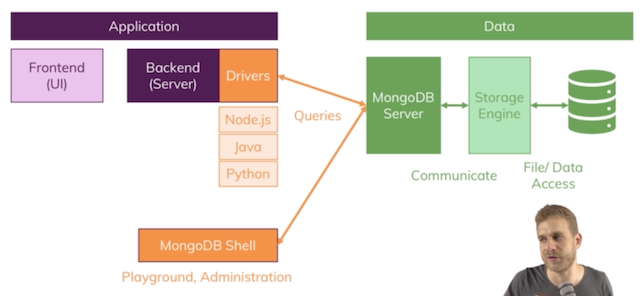
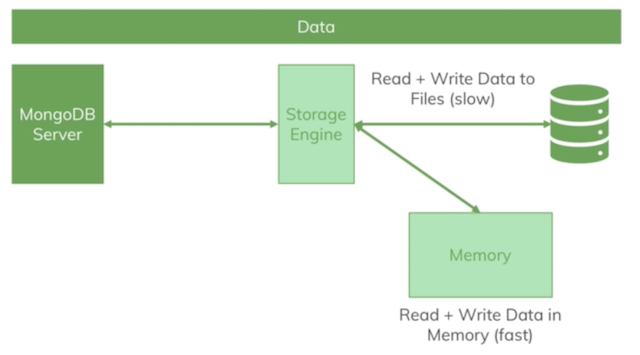
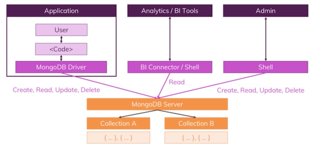

__Source__:
* [Official MongoDB manual](https://docs.mongodb.com/manual/)
* [Course by Maximilian Schwarzmüller](https://www.udemy.com/mongodb-the-complete-developers-guide/)

#### Table of contents

* [Introduction](#introduction)
    * [Installation](#installation)
    * [Basic Commands](#basic-commands)
    * [Drivers](#drivers)
    * [Basic Features](#basic-features)
    * [Data Types](#Data-Types)
* [CRUD Operations](#crud-operations)
    * [Create](#create)
        * [Options](#options)
        * [Importing Data](#Importing-Data)
    * [Read](#read)
        * [Cursor](#cursor)
        * [Projections](#projections)
    * [Update](#Update)
    * [Destroy](#Destroy)
* [Operators](#operators)
    * [Query Operators](#Query-Operators)
    * [Projection Operators](#Projection-Operators)
    * [Update Operators](#Update-Operators)
    * [Aggregation Operators](#Aggregation-Operators)
* [Structuring Documents](#structuring-documents)
    * [Schemas](#schemas)
    * [Relations](#relations)
    * [Schema Validation](#schema-validation)
* [Shell](#Shell)
* [Compass](#compass)
* [Indexes](#indexes)
* [Geospatial Data](#geospatial-data)
* [Aggregation Framework](#aggregation-framework)
* [Numeric Data](#numeric-data)
* [Security and Authentication](#security-and-authentication)
* [Performance](#performance)
* [Fault Tolerance](#fault-tolerance)
* [Deployment](#deployment)
* [Transactions](#transactions)
* [Drivers](#drivers-1)
* [Stitch](#stitch)


&nbsp;
# Introduction

MongoDB is a database solution created to work efficiently with large amounts of data. No/few relations between data increase __performance__ and schemaless architecture provides __flexibility__.

An instance of MongoDB can host multiple __databases__. Each database is comprised of __collections__ which in turn contain JSON format __documents__. JSON documents are internally converted into a binary representation called BSON.

MongoDB is a whole ecosystem of different products:
* Self-Managed Database
* Enterprise Database
* CloudManager
* OpsManager
* __Atlas__ - cloud solution
* Mobile Solution
* __Compass__ - GUI for data inspection
* BI Connectors
* MongoDB Charts
* __Stitch__ - a serverless solution
    * Serverless Query API
    * Serverless functions
    * Database Triggers - listen to events and handle them internally
    * Real-Time Sync - synchronize database and cloud




Credits: [Maximilian Schwarzmüller](https://www.udemy.com/mongodb-the-complete-developers-guide/)


## Installation
1. Download the installation client from [here](https://www.mongodb.com/download-center/community)
1. Run the installation
1. Link the executables within your .bash_profile
    ``` shell
    export PATH=/Users/username/pathto/mongodb/bin:$PATH
    ```
1. Create `/data/db/` folders in root directory
1. Start a mongodb client instance
    ``` shell
    # start form default location /data/db
    mongod

    # start from specific location
    mongod --dbpath "/some/path/data/db"

    # start on specific port
    mongod --port 27000
    ```
1. Start the mongodb shell
    ``` shell
    # connect on the default port
    mongo

    # connect on a specific port
    mongo --port 27000
    ```

## Basic Commands
Basic mongoDB shell commands. 

* `show dbs` - lists all available databases on the current instance
* `show tables` | `show collections` - lists all collections available in the current database
* `use db_name` - sets a specific database as the current db
* `db.dropDatabase()` - deletes the current database
* `db.someCollection.drop()` - deletes a collection in the current database
* `db.stats()` - display information about the current database
* `cls` - clears the terminal screen

``` shell
> show dbs
admin         0.000GB
auth          0.000GB
config        0.000GB
dbname        0.000GB
local         0.000GB
test          0.000GB

> use test
switched to db test

> show tables
todos
test_table

> db.test_table.drop()
true

> show collections
todos

> db.dropDatabase()
{ "dropped" : "example", "ok" : 1 }

> show dbs
admin         0.000GB
auth          0.000GB
config        0.000GB
dbname        0.000GB
local         0.000GB

> db.stats()
{
	"db" : "companyData",
	"collections" : 1,
	"views" : 0,
	"objects" : 1,
	"avgObjSize" : 180,
	"dataSize" : 180,
	"storageSize" : 16384,
	"numExtents" : 0,
	"indexes" : 1,
	"indexSize" : 16384,
	"fsUsedSize" : 279049719808,
	"fsTotalSize" : 500068036608,
	"ok" : 1
}

```

## Drivers
A set of APIs for connecting mongoDB to a programming language of choice.

Drivers enable usage of the core features in many popular technologies like Java, Node, C++, Python. They usually mimick how you would work with the DB in the mongoDB shell.

``` shell
# installation
npm install mongodb --save
```

``` javascript
// Inserting a single document
db.collection('inserts').insertOne({a:1}, function(err, r) {
    assert.equal(null, err);
    assert.equal(1, r.insertedCount);
}
```

## Basic Features

__Lazy Creation__: you do not have to explicitly create databases and tables. They will be created automatically when any data is added to them.

__Unique ID__: mongoDB implicitly adds a unique id to each document. Unique ids can be used for sorting

__Limits__
* a single document can not exceed 16mb in size
* embedded documents can not exceed 100 levels of nesting
* max values:
    * __int32__ max value is `+-2,147,483,647`
    * __int64__ max value is `+-9,223,372,036,854,775,807` 
* [docs on limits](https://docs.mongodb.com/manual/reference/limits/)


## Data Types
Source: [docs on data types](https://docs.mongodb.com/manual/reference/bson-types/)

__JSON vs BSON__
* BSON stands for binary JSON
* as a developer you work with JSON
* mongoDB drivers translate JSON to BSON implicitly
* BSON allows for special data types like `ObjectId("adada1231jk313")`
* you can omit quotation marks around keys

__Data Types__\
All data types valid in JSON are valid in mongo. There are also some types specific to mongo.
* __String__ - alias: `"string"`
* __Boolean__ - alias: `"bool"`
* __Number__
    * __Integer__ (int32) - alias: `"int"`
    * __NumberLong__ (int64) - alias: `"long"`
    * __NumberDecimal__ - high precision floating point numbers - alias: `"decimal"`
    * __Double__ - low precision floating point numbers. This is the _default Numeric value_. Alias: `"double"`
* __Objects__ - also called Embedded Documents. Alias: `"object"`
* __ObjectId__ - sorting is built into the ObjectId - a later assigned ID has a greater value. Alias: `"objectId"`
* __Arrays__ - alias: `"array"`
* __ISODate__ - alias: `"date"`
* __Timestamp__ - mostly used internally, guarenteed to be unique. Alias: `"timestamp"`
* __Null__ - alias: `"null"`
* __Regular Expressions__ - alias: `"regex"`

``` javascript
db.example.insertOne({
    name: 'John',
    male: true,
    age: 10,
    height: 1.87,
    hobbies: ['fishing', 'chess', 'blockchain'],
    joined: new Date(),
    meta: {
        insertedAt: new Timestamp(),
        big_secret: NumberLong(1234567890123),
        small_secret: NumberInt(123),
        decimal: NumberDecimal("1.1234567890123")
    }
})

```

__Embedded Documents__\
Documents can be embedded in other documents, allowing up to 100 levels of nesting.
* use dot notation to access nested fields

``` javascript
// status is an embeded document
> db.exampleData.updateMany({}, {$set: {status: {description: 'something', lastUpdated: "1 minute ago"}}})

> db.exampleData.findOne({'status.description': 'something'})
```

__Arrays__\
Arrays can store any data types including embedded documents.

``` javascript
// posts are an array of data
> db.exampleData.updateMany({name: 'Greg'}, {$set: {posts: ["hi", "nope", "first"]}})


// accessing an array
> db.exampleData.findOne({name: 'Greg'}).posts

[ "hi", "nope", "first" ]


// array filter
> db.exampleData.find({posts: "first"}).pretty()

{
	"_id" : ObjectId("5c9a1df326f8c65afe3a58c8"),
	"name" : "Greg",
	"str" : "hi",
	"int" : 10001,
	"bool" : false,
	"status" : {
		"decription" : "something",
		"lastUpdated" : "1 minute ago"
	},
	"posts" : [
		"hi",
		"nope",
		"first"
	]
}
```


&nbsp;
# CRUD Operations
CRUD stands for **C**reate, **R**ead, **U**pdate, **D**elete. These are operations that most apps working with persistant data should be able to perform.



Credits: [Maximilian Schwarzmüller](https://www.udemy.com/mongodb-the-complete-developers-guide/)

## Create
Inserting a document into a collection. 

Inserts in MongoDB are ordered by default, meaning they are processed seperatly and sequentially. If an n-th insert fails any preceeding inserts will be added while following imports will be omitted. This can be changed through the `options` object. If inserts are non-ordered inserts following an eronous operation are processed as well.

__Atomicity__ - mongoDB guarantees atomicity on a per document level. If an operation is eronous it is roled back and changes are not saved. This only works for single documents. For bulk atomicity you need to use [transactions](#transactions).

Methods:
* `insertOne(data, options)` - inserts one document
* `insertMany(data, options)` - inserts an array of documents

``` javascript
// command - insertOne()
> db.exampleData.insertOne({ str: 'text', int: 123456, bool: true })

// ouput
{
	"acknowledged" : true,
	"insertedId" : ObjectId("5c99fd5026f8c65afe3a58c4")
}

// command - insertMany()
> db.exampleData.insertMany([
    { name: 'Greg', str: 'hi', int: 10001, bool: false },
    { name: 'John', str: 'yo', int: 10002, bool: false },
    { name: 'Jane', str: 'howdy', int: 10003, bool: true }
])

// ouput
{
	"acknowledged" : true,
	"insertedIds" : [
		ObjectId("5c9a03e226f8c65afe3a58c5"),
		ObjectId("5c9a03e226f8c65afe3a58c6"),
		ObjectId("5c9a03e226f8c65afe3a58c7")
	]
}
```

### Options
* `ordered` - boolean indicating if inserts should be ordered
* `writeConcern` - object that configures operations regarding writing data. Has two properties:
    * `w` - integer indicating how many instances the data should be written to
    * `wtimeout` - integer indicating after how many milliseconds is an incomplete write operation considered a failure
    * `j` - boolean value indicating if write operations should be logged in a journal


### Importing Data
Data in .json format can be directly imported into MongoDB. This is done through the `mongoimport` command which takes the following argument.
* data_file - a .json file you want to import data from
* `-d dbName` - db you want to import the data into
* `-c colName` - the collection you want to import the data into
* `--jsonArray` - specify if you are importing an array of data
* `--drop` - if the collection exists it will be dropped and readded. Omiting this flag causes the data to be appended.
``` shell
> mongoimport some_file.json -d exampledb -c test_col --jsonArray -drop
```


## Read
Extracting data from a collection. Read methods can take a filter argument which narrows down the search.

__Methods__:
* `find(filter, options)` - retrieve all matching documents
* `findOne(filter, options)` - retrieve first matching document

``` javascript
// command - find()
> db.exampleData.find();

// output
{ "_id" : ObjectId("5c99fd5026f8c65afe3a58c4"), "str" : "text", "int" : 123456, "bool" : true }
{ "_id" : ObjectId("5c9a03e226f8c65afe3a58c5"), "name" : "Greg", "str" : "hi", "int" : 10001, "bool" : false }
{ "_id" : ObjectId("5c9a03e226f8c65afe3a58c6"), "name" : "John", "str" : "yo", "int" : 10002, "bool" : false }
{ "_id" : ObjectId("5c9a03e226f8c65afe3a58c7"), "name" : "Jane", "str" : "howdy", "int" : 10003, "bool" : true }

// command - find(filter)
> db.exampleData.find({ bool: true })

// output
{ "_id" : ObjectId("5c99fd5026f8c65afe3a58c4"), "str" : "text", "int" : 123456, "bool" : true }
{ "_id" : ObjectId("5c9a03e226f8c65afe3a58c7"), "name" : "Jane", "str" : "howdy", "int" : 10003, "bool" : true }

// command - findOne(filter)
> db.exampleData.findOne({ bool: false })

// output
{
	"_id" : ObjectId("5c9a03e226f8c65afe3a58c5"),
	"name" : "Greg",
	"str" : "hi",
	"int" : 10001,
	"bool" : false
}

// command - findOne(filter)
> db.exampleData.findOne({int: {$gt: 10000}})

// output
{
	"_id" : ObjectId("5c99fd5026f8c65afe3a58c4"),
	"str" : "text",
	"int" : 123456,
	"bool" : true
}
```

### Cursor
The `find()` returns an iterable __cursor object__ that points to a set of data. This is very convenient for huge data sets since it allows working with batches one at a time. 

Cursor methods:
|Name|Description|
|----|-----------|
|`addOption(flag)`|adds wire protocol flags|
|`batchSize(size)`|controls the number of documents returned to a client through a single request|
|`close()`|close cursor and free associated resources|
|`isClosed()`|boolean value indicating if cursor is closed|
|`collation()`|specifies the cursors collation|
|`comment()`|attachs comment to query for traceability in logs and system.profile collection|
|`count()`|returns the number of documents in result set|
|`explain()`|returns the queries metadata|
|`forEach(func)`|runs a JavaScript function for each document|
|`hasNext()`|boolean value indicating if the cursor can be iterated over|
|`hint()`|forces a specific index for a query|
|`isExhausted()`|boolean value indicating if cursor is closed and has no documents in the batch|
|`itcount()`|returns the total number of documents client side by fetching and iterating the result set|
|`limit(int)`|constrains the size of a cursors batch|
|`map(func)`|applies a function to each document and stores the result in an array|
|`max()`|specifies an upper index bound for a cursor. Used with `cursor.hint()`|
|`maxTimeMS()`|specifies a cumulative time limit for processing cursor operations|
|`min()`|specifies a lower index bound for a cursor. Used with `cursor.hint()`|
|`next()`|returns next document in cursor|
|`noCursorTimeout()`|does not close a cursor after a period of inactivity|
|`objsLeftInBatch()`|returns number of documents left in the current batch|
|`pretty()`|pretty prints the cursor results before returning them|
|`readConcern()`|specifies `read concern` for a `find()` operation|
|`readPref()`|specifies how the client directs queries to a replica set|
|`returnKey()`|cursor returns index keys instead of documents|
|`showRecordId()`|adds an internal storage engine ID filed to each returned document|
|`size()`|returns the count of all documents in the cursor|
|`skip(int)`|returns a cursor that begins at a specified document|
|`sort(object)`|sorts cursor results|
|`tailable()`|marks the cursor as tailable|
|`toArray()`|returns an array containing all documents returned by the cursor|

For cursors the order of chaining methods __does not effect__ the final result.

``` javascript
// Sort according to ascending rating.average values
> db.movies.find().sort({"rating.average": 1})

// Sort according to descending rating.average values
> db.movies.find().sort({"rating.average": -1})

// Sort according to multiple fileds
> db.movies.find().sort({"rating.average": -1, runtime: 1})
```

### Projections
A mechanism that enables retrieving specific fields from a document. This allows for granular data retrieval effectively reducing the amount of data transmitted over a network. Projection is used through the `option` argument in read methods. The `_id` field is added to projections by default.

Projections are specified through an object that flags document fields with:
    * `prop: 1` - includes property in the search results
    * `prop: 0` - excludes property from the search results

``` javascript
// command - find(filter, options)
> db.exampleData.find({}, {name: 1, _id: 0})

//output
{ "name" : "Greg" }
{ "name" : "John" }
{ "name" : "Jane" }
```

Projection work on nested documents
``` javascript
> db.shows.find({}, {"network.name": 1, _id: 0})

//output
{ "network" : { "name" : "CBS" } }
{ "network" : { "name" : "CBS" } }
{ "network" : { "name" : "Space" } }
{ "network" : { "name" : "ABC" } }
```

Projection have some special syntax for working with arrays

``` javascript
// returns one of the matched genres
> db.shows.find({genres: "Drama"}, {"genres.$": 1})

// only returns genres equal to "Horror" for shows that have the "Drama" genre
> db.shows.find({genres: "Drama"}, {"genres": {$elemMatch: {$eq: "Horror"}}})

// result
{ "_id" : ObjectId("5c9c82c8369a874ff6dd3ed3") }
{ "_id" : ObjectId("5c9c82c8369a874ff6dd3ed4") }
{ "_id" : ObjectId("5c9c82c8369a874ff6dd3ed5"), "genres" : [ "Horror" ] }
```


## Update
Changing data in document. Update methods can take a filter argument which determine what documents are updated.

Methods:
* `update(filter, data, options)` - replaces a document with a new document only maintaining the id. It is good practice to use below methods instead of `update()`
* `updateOne(filter, data, options)` - edits a single document
* `updateMany(filter, data, options)` - edits multiple documents
* `replaceOne(filter, data, options)` - replace a document entirely

``` javascript
// command - updateOne(filter, data)
> db.exampleData.updateOne({str: "text"}, {$set: {int: 9000}})

// ouput
{ "acknowledged" : true, "matchedCount" : 1, "modifiedCount" : 1 }


// command - updateOne(filter, data) - multiple updates in one
> db.exampleData.updateOne({_id: ObjectID("abcdef1234567890")}, {$inc: {age: 1}, $set: {old: true}})


// command - updateMany(filter, data)
// {} as filter selects all documents in collection
> db.exampleData.updateMany({}, {$set: {marker: "delete"}})

// ouput
{ "acknowledged" : true, "matchedCount" : 4, "modifiedCount" : 4 }


// command - update(filter, data)
> db.exampleData.update({_id: ObjectId("5c99fd5026f8c65afe3a58c4")}, {val: "entirely new doc"})

//output
WriteResult({ "nMatched" : 1, "nUpserted" : 0, "nModified" : 1 })


// command - replaceOne(filter, data)
> db.exampleData.replaceOne({_id: ObjectId("5c99fd5026f8c65afe3a58c4")}, {val: "correct way to replace"})

// output
{ "acknowledged" : true, "matchedCount" : 1, "modifiedCount" : 1 }
```

You can use the `upsert` option to update a document or insert it if it does not exist.

``` javascript
> db.users.updateOne({
    name: 'Juan'
}, {
    $set: {
        age: 29, 
        hobbies: ['Sports', 'Chess', 'Movies']
    }
}, {
    upsert: true
})
```


## Destroy
Deleting data from a collection. Delete methods can take a filter argument that specifies which document/s should be deleted.

Methods:
* `deleteOne(filter, options)` - deletes a single document
* `deleteMany(filter, options)` - deletes multiple documents

``` javascript
// command - deleteOne(filter)
> db.exampleData.deleteOne({ bool: true })

// result
{ "acknowledged" : true, "deletedCount" : 1 }


// command - deleteMany(filter)
> db.exampleData.deleteMany({ marker: "delete" })

// result
{ "acknowledged" : true, "deletedCount" : 2 }
```

&nbsp;
# Operators
MongoDB operators are `$` followed by a set of characters that denote an operation.

Operators can be divided into:
* Query operators
* Projection operators
* Update operators
* Aggregation operators
* Query modifiers - deprecated

## Query Operators
**R**ead related operators used for locating data. Do not mutate data.

__Comparison__
|Name|Description|
|----|-----------|
|`$eq`|equal to|
|`$gt`|greater than|
|`$gte`|greater than or equal|
|`$in`|matches value to any value in array|
|`$lt`|less than|
|`$lte`|less than or equal|
|`$ne`|not equal|
|`$nin`|matches value to any value not in array|

``` javascript
// simple equality operator
> db.shows.find({runtime: {$eq : 30}})

// embedded document
> db.shows.find({"rating.average": {$gt: 9}})

// Exact match
> db.shows.find({genres: ["Drama"]})

// Exists in array match
> db.shows.find({genres: "Drama"})

// If value exists in collection
> db.shows.find({"schedule.days": {$in: ["Thursday", "Friday"]}})
```

__Logical__
|Name|Description|
|----|-----------|
|`$and`|Logical AND. Used for repeated|
|`$not`|Logical NOT|
|`$nor`|Logical NOR|
|`$or`|Logical OR|

MongoDB uses the `$and` operator by default when multiple filters are defined. When specifying multiple filters on the same field using the `$and` operator is mandatory since some languages don't permit the same property key in one object.

``` javascript
// OR
> db.shows.find({
    $or: [
        {"rating.average": {$lt: 4.5}},
        {"rating.average": {$gt: 9.1}}
    ]
})

// AND - implicit
> db.shows.find({"rating.average": {$gt: 9}, genres: "Drama" })

// AND - explicit
> db.shows.find({
    $and: [
        {"rating.average": {$lt: 9}},
        {"rating.average": {$gt: 8.5}}
    ]
})
```

__Element__
|Name|Description|
|----|-----------|
|`$exists`|Matches documents that have specified field|
|`$type`|Matches documents if field is of specified type|

``` javascript
// Exists
> db.shows.find({
    "rating.average": {$exists: true, $ne: null}
})

// Type
> db.shows.find({
    genres: {$type: 'array'}
})

> db.shows.find({
    "rating.average": {$type: ["null", "string"]}
})
```

__Evaluation__
|Name|Description|
|----|-----------|
|`$expr`|allows usage of aggregation expressions within query language|
|`$jsonSchema`|validate against given JSON Schema|
|`$mod`|selects based on outcome of modulo operation|
|`$regex`|selects based on matching regular expression|
|`$text`|performs text search|
|`$where`|matches documents that satisfy JavaScript expression|

``` javascript
// expression
> db.sales.find({
    $expr: {
        $gt: ["$volume", "$target"]
    }
})

> db.sales.find({
    $expr: {
        $gt: [
            {
                $cond: {
                    if: {
                        $gte: ["$volume", 190]
                    },
                    then: {
                        $subtract: ["$volume", 10]
                    },
                    else: "$volume"
                }
            },
            "$target"
        ]
    }
})

// regex
> db.shows.find({
    summary: {$regex: /musical/}
})
```

__Array__
|Name|Description|
|----|-----------|
|`$all`|matches if array contains all elements specified in query|
|`$elemMatch`|matches if element in array meets all specified conditions|
|`$size`|matches if array field is of specified size|

`$size` only supports exact matches.

``` javascript
// All
> db.shows.find({
    genres: {
        $all: ['Drama', 'Action', 'Crime']
    }
})

// ElemMatch
> db.users.find({
    hobbies: {
        $elemMatch: {
            title: "Sports",
            frequency: {$gte: 3}
        }
    }
})

db.ratings.find({
    "ratings": {
        $elemMatch: {
            $gt: 8,
            $lt: 10
        }
    }
})

// Size
> db.shows.find({
    genres: {
        $size: 4
    }
})
```


__Geospatial__
|Name|Description|
|----|-----------|
|`$geoIntersects`|select geometries that intersect with a GeoJSON geometry|
|`$geoWithin`|select geometries within a bounding GeoJSON geometry|
|`$near`|select geospatial objects in proximity to a point|
|`$nearSphere`|select geospatial object in proximity to a point on a sphere|

__Bitwise__
|Name|Description|
|----|-----------|
|`$bitsAllClear`|matches if set of bit positions all have value 0|
|`$bitsAllSet`|matches if set of bit positions all have value 1|
|`$bitsAnyClear`|matches if any bit in a set of bit positions has value 0|
|`$bitsAnySet`|matches if any bit in a set of bit positions has value 1|

__Comments__
|Name|Description|
|----|-----------|
|`$comment`|adds comment to query predicate|


## Projection Operators
**R**ead related operators used for modifying data presentation. Do not mutate data.

|Name|Description|
|----|-----------|
|`$`|projects first element in an array that meets query condition|
|`$elemMatch`|projects first element in an array that meets the $elemMatch condition|
|`$meta`|projects documents score assigned during $text operation|
|`$slice`|limits number of elements projected from an array|

``` javascript
// $
> db.shows.find({genres: "Drama"}, {"genres.$": 1})

// $elemMatch
> db.shows.find({genres: "Drama"}, {"genres": {$elemMatch: {$eq: "Horror"}}})

// $slice - project only 2 genres
> db.shows.find({"rating.average": {$gt: 9}}, {"genres": {$slice: 2}, name: 1})

// $slice - project only the 2nd and 3rd genre
> db.shows.find({"rating.average": {$gt: 9}}, {"genres": {$slice: [1, 2]}, name: 1})
```

## Update operators
**U**pdate related operators used for modifying and adding addition data.

__Fields__
|Name|Description|
|----|-----------|
|`$currentData`|sets value of field to current date|
|`$inc`|increments value of field by specified amount|
|`$min`|only updates field if specified value is less than the exists field value|
|`$max`|only updates field if specified value is greater than the exists field value|
|`$mul`|multiplies value of field by specified amount|
|`$rename`|renames a field|
|`$set`|sets the value of a field|
|`$setOnInsert`|sets the value of a field if the update inserts a new document|
|`$unset`|removes a field from a document|

``` javascript
// setting
> db.exampleData.updateMany({}, {$set: {marker: "delete"}})

// incrementing
> db.users.updateOne({name: "Manuel"}, {$inc: {age: 1}})

// decrementing
> db.users.updateOne({name: "Lich"}, {$inc: {age: -1}})

// updating age to 35 only if it is higher than 35
> db.users.updateOne({name: "Chris"}, {$min: {age: 35}})

// updating age to 50 only if it is lower than 50
> db.users.updateOne({name: "John"}, {$max: {age: 50}})

// multiplying
> db.users.updateOne({name: "John"}, {$mul: {age: 1.1}})

// deleting a field
> db.users.updateOne({name: "Max"}, {$unset: {phone: ""}}) 

// rename a field
> db.users.updateMany({}, {$rename: {age: "totalAge"}})
```

__Arrays__
|Name|Description|
|----|-----------|
|`$`|placeholder to update the first element in a document that matches a query condition|
|`$[]`|placeholder to update an array of elements in a document that matches a query condition|
|`$[<identifier>]`|placeholder to update all elements that match the `arrayFilters` condition in a document that matches a query condition|
|`$addToSet`|adds elements to array only if they do not already exist in it|
|`$pop`|removes first or last item of array|
|`$pull`|removes all array elements that match a specified query|
|`$push`|adds an item to an array|
|`$pullAll`|removes all matching values from an array|

``` javascript
// $
> db.users.updateMany({
    hobbies: {
        $elemMatch: {
            title: "Sports",
            frequency: {$gte: 3}
        }
    }
}, {
    $set: {
        "hobbies.$.highFrequency": true
    }
})
```

__Modifiers__
|Name|Description|
|----|-----------|
|`$each`|modifies `$push` and `$addToSet` to append multiple items for array updates|
|`$position`|modifies `$push` to specify index in array at which elements are added|
|`$slice`|modifies `$push` to limit the size of updated arrays|
|`$sort`|modifies `$push` to reorder documents stored in an array|

__Bitwise__
|Name|Description|
|----|-----------|
|`$bit`|performs bitwise AND, OR, XOR updates of integer values|


## Aggregation Operators

|Name|Description|Example|
|----|-----------|-------|
|placeholder|placeholder|


&nbsp;
# Structuring Documents

## Schemas
Schemas define a documents structure. While mongoDB does not enforce using schemas in real-world applications its a good idea to structure your data.

__Data Modelling Process__:
1. What data does the App need and generate?
    * based on user information, product information, orders, ...
    * defines __fields__ youll need and their __relationships__
1. Where do I need my data?
    * where in the gui? orders page? welcome page? authorization?
    * defines required __collections__ and __field groupings__
1. Which kind of data and information do I want to display?
    * example: products page: product names, product list
    * defines which __queries__ youll need
1. How often do I fetch my data?
    * every page reload? every second? once a day?
    * defines how you should __optimize__ for fetching
1. How often do I write or change data?
    * example: products -> often, posts -> often, user -> rarely
    * defines how you should __optimize__ for writing

Based on the answer to the above questions you build a schema.

## Relations
Defines how data depends on other data. There are 3 types of these dependencies and they can be defined in 2 different ways.

How Relations are handled:
* Embedded Documents
    * group data together logically
    * good for data that belongs together and doesnt overlap with other data
    * avoid deep nesting
* References
    * split data across collections
    * great for related but shared data
    * great for data which is used in relations and standalone
    * allows overcoming nesting and size limits

Relations can be divided into three types:
* __1 to 1__ - a one to one relationship.
    * __example__: a user has one account and the account is owned by one user
    * __best approach__: 
        * if data is tightly coupled - embedded document
        * if data is often fetched separately - reference
* __1 to N__ - a one to many relationship.
    * __example__: a user has many posts, but a post can only belong to one user
    * __best approach__: 
        * if the data is often fetched together - embedded document
        * if the many side is very numerous - reference
* __N to M__ - a many to many relationship.
    * __example__: a customer can have many favorite books and a book can be a favorite of many customers
    * __best approach__: usually a combination of the two
        * embeded document to store relationship specific data and a reference to make the connection

You can merge reference relations using the aggregate framework
``` javascript
> db.books.aggregate([
    {
        $lookup: {
            from: "authors", 
            localField: "authors", 
            foreignField: "_id", 
            as: "creators"
        }
    }
])
```

## Schema Validation
An additional layer that validates data before it is inserted into the database. It can either accept and make the change, or reject and send back an error message/warning.

Schema validation has two properties:
* __validation level__ - which documents should be validated and how:
    * __strict__ - all inserts and updates are validated
    * __moderate__ - all inserts are validated. Updates are only validated for valid documents
* __validation action__ - how to handle failed validation
    * __error__ - throw error and deny operation
    * __warn__ - log warning but proceed with operation

Schema validation can be added during collection definition
* use the `createCollection()` method 
* add the `validator` property in the options object
* in the validator obect use the `$jsonSchema` operator
* for each property and the document itself you can specify:
    * `bsonType` - the fields or documents target data type
    * `required` - an array of required fields
    * `description` - a description of the validation mechanism

``` javascript
// collection definition
db.createCollection("posts", { 
    validator: {
        $jsonSchema: {
            bsonType: "object",
            required: ["title", "text", "creator", "comments"],
            properties: {
                title: {
                    bsonType: "string",
                    description: "must be a string and is required"
                },
                text: {
                    bsonType: "string",
                    description: "must be a string and is required"
                },
                creator: {
                    bsonType: "objectId",
                    description: "must be an objectId and is required"
                },
                comments: {
                    bsonType: "array",
                    description: "must be an array and is required",
                    items: {
                        bsonType: "object",
                        required: ["text", "author"]
                        properties: {
                            text: {
                                bsonType: "string",
                                description: "must be a string"
                            },
                            author: {
                                bsonType: "objectId",
                                description: "must be an objectId and is required"
                            }
                        }
                    }
                },
            }
        }
    }
});
```

To change the validation actions on an existing schema use `db.runCommand({collMod: "col_name", new_schema})`.

``` javascript
db.runCommand({
    collMod: "col_name", 
    validator: {
        $jsonSchema: {
            bsonType: "object",
            required: ["title", "text", "creator", "comments"],
            properties: {
                title: {
                    bsonType: "string",
                    description: "must be a string and is required"
                }
            }
        }
    },
    validationAction: 'warn'
})
```

&nbsp;
# Shell
The mongoDB shell makes administrative tasks easy. It facilitates configuration, logging and debugging. Any valid JavaScript code is also valid in the shell.

__Log Files__\
To log the output of your database to a seperate file launch the mongoDB instance with the `--logpath` option. Must specify a log file. If it doesn't exist it will be created automatically.
``` shell
mongod --logpath /Users/me/somePath/logs/log_file.log
```

__MongoDB as a service__\
To run mongoDB as a background service launch it with the `--fork` option. Must include a log file. To shutdown afterwards use `db.shutdownServer()`
``` shell
mongod --fork --logpath /Users/me/somePath/logs/log_file.log
```

__Configuration file__\
To preconfigure mongod instances use a configuration file. This allows specifying all the options available when starting mongod from the shell. Create a file or use the default one(Windows/ Linux only).

The file should be in YAML format
``` yaml
storage:
    dbPath: "/Users/me/some/path/mongodb/db"
systemLog:
    destination: file
    path: "/Users/me/some/path/mongodb/logs/logs.log
```

To use a specific config file launch mongod with the `--config [path]` or `-f [path]` option.
``` shell
mongod -f /Users/me/some/path/mongodb/bin/mongod.conf
```

__Help__\
To get a quick reference for various database objects use the `help()` method within the shell.
``` javascript
// check for db shell commands
db.help()

// check for collection shell commands
db.some_col.help()
```

&nbsp;
# Compass
A GUI for MongoDB. Allows exploring your data visually and gaining useful insights regarding DB usage.

Download: [compass](https://www.mongodb.com/products/compass)

Features include:
* performance charts
* database navigation
* visualize geospatial data
* identify performance issues
* implement schemas
* deployment awareness
* query history
* insert data
* create databases


&nbsp;
# Indexes


&nbsp;
# Geospatial Data


&nbsp;
# Aggregation Framework


&nbsp;
# Numeric Data


&nbsp;
# Security and Authentication


&nbsp;
# Performance


&nbsp;
# Fault Tolerance


&nbsp;
# Deployment


&nbsp;
# Transactions


&nbsp;
# Drivers


&nbsp;
# Stitch

