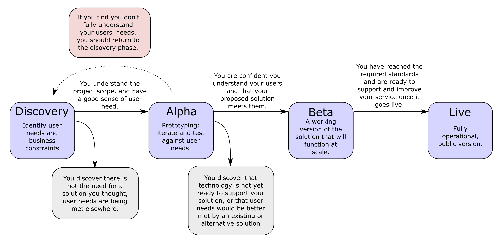

# General Information on Software Development

Source: 
* [Wikipedia - Software Development](https://en.wikipedia.org/wiki/Software_development)
* [r-stylelab.com ~ discovery](https://r-stylelab.com/company/blog/it-outsoursing/discovery-phase-data-driven-approach-to-software-product-development)

#### Table of contents

* [Remote Work - Tools](#remote-work---tools)
* [Software Product Development Stages](#software-product-development-stages)
* [Software Requirement Specification](#software-requirement-specification)
* [Discovery](#discovery)

&nbsp;
# Remote Work - Tools

* [firebase](https://firstbasehq.com/) - supply and manage physical equipment for employees
* [graphyapp](https://graphyapp.com/) - easily create and share dashboards without the hassle of writing SQL queries
* [commsor.com](https://commsor.com/) - track community data and easily integrate with popular services(github, slack, jira, tweeter). Gives you insights on which team members are active and how they use various tools pertinent to your business
* [loom.com](https://www.loom.com/) - capture screen, voice, face when explaining a document and share it - faster and more instructive then writing an email!
* [slack](https://slack.com/intl/en-pl/) - live communication with team members. Easily integrated with other collaboration services
* [zoom](https://zoom.us/) - video conferences
* [notion](https://www.notion.so/) - great tool for creating a Team wiki, managing projects and tasks, sharing notes and documentation. 
* [linear](https://linear.app/) - issue tracking tool with a nice GUI
* [hopin](https://hopin.to/) - virtual event platform

&nbsp;
# Software Product Development Stages
Source: [deparkes.co.uk](https://deparkes.co.uk/2016/12/30/the-software-development-cycle/)

&nbsp;
# Software Requirement Specification
An SRS is a specification of all business requirements a software product should meet. This is especially useful for validating the feasibility of the product in question and communicating what needs to be created to the software team or a software vendor. 

An SRS should contain:
* __Functional requirements__ - detailed description of all the functions performed by the system
* __Non-functional requirements__ - usability, performance, maintenance requirements and more
* __User stories__ - detailed description of what the user can do with the software
* __Sketches and wireframes__ - functional mockups and target mockups that show how the product will be used

&nbsp;
# Discovery
Purpose is to ensure product development is going in a direction that provides value to the business, by reiterating on the products feasibility before committing too much work.

&nbsp;
# Software Development Practices

##