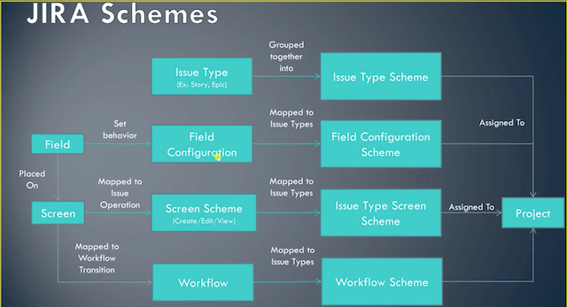
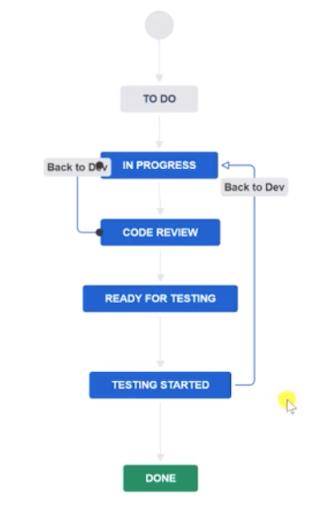
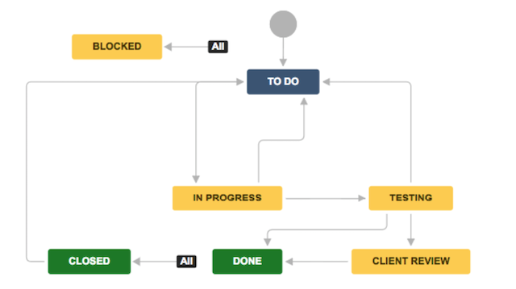
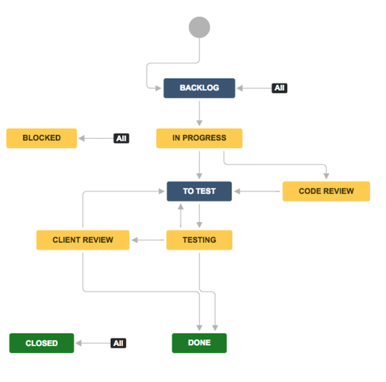
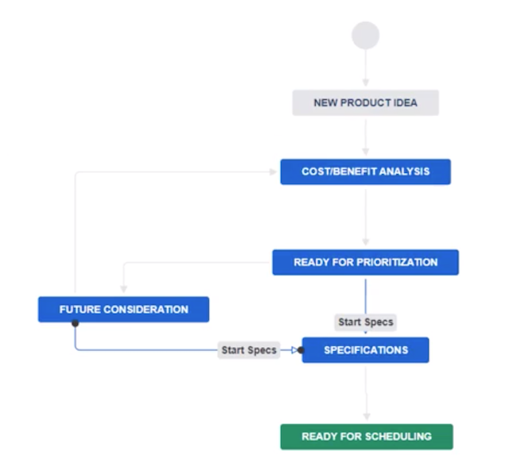

# JIRA  and Confluence Guide

Source: 
* [jira docs](https://developer.atlassian.com/cloud/)
* [confluence docs](https://confluence.atlassian.com/confcloud/confluence-cloud-documentation-home-941614888.html)

#### Table of contents

* [Introduction](#introduction)
* [Terms](#Terms)
* [User Interface](#user-interface)
    * [Issues](#issues)
    * [JQL](#JQL)
    * [Keyboard Shortcuts](#Keyboard-Shortcuts)
* [Development Team](#development-team)
* [Management](#management)
    * [Configuring Agile Boards](#configuring-agile-boards)
    * [Creating Projects](#creating-projects)
    * [Project Flow](#project-flow)
* [Administration](#administration)
    * [Users and Groups](#users-and-groups)
    * [Project Settings](#project-settings)
    * [Permissions Flow](#permissions-flow)
    * [JIRA Schemes](#jira-schemes)
    * [Issue Type Creation Flow](#issue-type-creation-flow)
    * [Workflow Creation Flow](#workflow-creation-flow)
* [Icebox](#icebox)
* [Addons](#Addons)
* [Confluence](#confluence)
    * [Keyboard Shortcuts](#keyboard-shortcuts-1)
    * [Spaces](#spaces)
        * [Basic Space Settings](#basic-space-settings)
        * [Additional Settings](#Additional-Settings)
        * [Space Types](#Space-Types)
        * [Space Blueprints](#Space-Blueprints)
    * [Pages](#pages)
        * [Page Editor](#Page-Editor)
        * [Page Blueprints](#Page-Blueprints)
        * [Page Options](#Page-Options)
    * [Macros](#macros)
    * [User Settings](#user-settings)
    * [Collaboration](#Collaboration)
    * [Administration](#Administration-1)
        * [Configuration Settings](#Configuration-Settings)
        * [Security Settings](#Security-Settings)
        * [Look and Feel Settings](#Look-and-Feel-Settings)
        * [Administration Settings](#Administration-Settings)

&nbsp;
# Introduction
JIRA is a fully customizable, plugin-rich project management and issue tracking tool released by [Atlassian](https://www.atlassian.com).

JIRA ecosystem:
* __JIRA Core__ - customizable work flows, issue tracks
* __JIRA Software__ - JIRA Core + agile tools
* __JIRA Service Desk__ - help desk for JIRA
* __Confluence__ - document management application, easily integrated with JIRA
* __Stride__ - team communication tool, easily integrated with JIRA
* __Bitbucket__ - code repository management, easily integrated with JIRA

JIRA support two kind of Agile frameworks:
* __Kanban__ - used for unpredictable development like support 
* __Scrum__ - used for projects with defined features

&nbsp;
# Terms

__Issues__ - a work item, anything that requires action from a person

__Project__ - a collection of related issues

__Workflow__ - a set of statuses and possible transitions an issue can go through within a project

__Versions__ - help track releases of software

__Components__ - subsections of a project, like backend and frontend

__User Story__ - a single feature or item in the Scrum Backlog
> As a user, I can choose a dark themed layout

__Story Points__ - a unit for estimating workload. Story point estimate should take into account:
* the amount of work that needs to be done
* the complexity of the work
* any risk or uncertainty in doing the work
    * unclear requirement - a risk
    * no tests - a risk
    * legacy code - a risk

__Event__ - a trigger that is associated with a notification scheme and/or workflow transition

__Icebox__ - a place where you can store features and issues for much later resolution(like nice-to-have features)

&nbsp;
# User Interface
Divided into:
* __Dashboards__
    * full customizable favorites page
    * divided into feature boxes which are called __gadgets__
    * __assigned to me__ - issues that are assigned to the current user
    * __activity stream__ - news feed for your JIRA site to share with team members
* __Projects__
    * list of projects
    * each project is generated a __unique key__ which is immutable
    * you can also provide a project 
    * __filters__ - custom made filters for facilitating issue viewing
    * search through issues filtered by project
* __Issues__
    * can search through all issues for all projects
    * use filters
    * manage filters
    * bulk change issues
* __Settings__
    * administration settings
    * only available when logged in as admin

## Projects
List of all projects the current account is assigned to. 

A projects view is comprised of various sub views
|Sub View|Description|
|--------|-----------|
|Boards|All available boards under the current project|
|Backlog|The backlog, current sprints and items assigned to them, also contains a `Versions` and `Epics` subview|
|Active Sprints|Shows the board for the current Sprints|
|Reports|Different charts for graphical analysis of sprint progress and other metrics|
|Releases|Configure version of the product and release dates, usually done at the end of a Sprint|
|Issues and filters|List all issues with configured filters|
|Pages|Documents regarding the project|
|Components|Create subsections of the project|
|Add Item|Adds an external resource to the project|
|Project Settings|[Project Settings](#project-settings)|

## Issues
Work items can have the following parameters:
|Parameter|Description|Example|
|---------|-----------|-------|
|Type|what type of issue it is|`Story`, `Bug`, `Epic`|
|Status|at what stage of the flow the issue currently is|`DONE`, `IN PROGRESS`, `NEW`|
|Priority|level of urgency|`High`, `Medium`, `Low`|
|Resolution|if the issue has been resolved|`Done`, `Unresolved`, `Duplicate`, `Cannot Reproduce`|
|Affects Version|which version the issue was raised for|`1.1`|
|Fix Version|which version the issue was resolved in|`1.3`|
|Labels|user defined tags for grouping issues|`Test`|
|Sprint|which sprint the issue was raised in|`Example Sprint 2`|
|Assignee|the person responsible for the issue|`Jane Crawford`|
|Reporter|the person the reported the issue|`John Doe`|
|Votes|team members can vote for an issue which could effect its priority|`2`|
|Watchers|who gets notified about changes to the issue|`3`|
|Description|what the issue is about and its details|`As a user, I can choose a dark themed layout`|
|Comments|user comments on the issue|`Please add resolution method to know-how`|
|Work Log|comments on done work|`Added testing scripts`|
|Activity|a news feed for the issue|`Create RSS feed`|

__Actions__\
You can configure various actions for an issue that will assigned a button. Default actions are:
* __Attachment__ - attaches a file to the issue
* __Link__ - links the issue to another issue
* __Create Subtask__ - creates a subtask linked to the issue

__Issue Types__
* Default
    * __Task__ - something that needs to be done, usually technical
    * __Subtask__ - a part of a task
* Software
    * __Story__ - functionality request from the perspective of a non-technical entity(user, stakeholder, ...)
    * __Bug__ - problem that impairs functionality
    * __Epic__ - large piece of work comprised of many issues
* Service Desk
    * __Incident__ - system outage or other sudden failure
    * __Service request__ - request from a user for a service
    * __Change__ - rollout of new solution
    * __Problem__ - tracks underlying causes of incidents

__Bulk Changes__ - you can perform bulk operations on issues
1. Select multiple issues
1. Right click
1. Select `Bulk Change`
1. Go through `Bulk Operation` wizard

## Keyboard Shortcuts
|key|description|
|---|-----------|
|`/`|Open Search|
|`[`|Expand/Minimize Menu|
|`c`|Create Issue|
|`i`|Open selected issue edit menu|


&nbsp;
# JQL
Stands for JIRA Query Language is a querying language similar in syntax to SQL. JQL enables creating custom filters.

JIRA implicitly generates a JQL query for every search you make. To view the generated JQL click on `Advanced` in the filter bar.

If you frequently reuse a filter save it using the `Save as` button.

__Filter Subscription__ - you can set a subscription that periodically sends the results of the query to your email

``` sql
issuetype = Epic AND status = "In Progress" AND assignee in (admin)

issuetype = Epic AND status != "In Progress"
```


&nbsp;
# Development Team
The primary tasks for the development team are:
* working with issues
* understanding how to work with issues
* search for issues
* configure own dashboard


&nbsp;
# Management
The primary tasks for the product manager/team lead/scrum master are:
* configure and manage agile boards
* building a backlog for creating stories
* make sure backlog is groomed
* setting up sprints
* work with dev team to provide estimations
* planning releases

## Configuring Agile Boards
An agile board is fully configurable to fit your teams needs.

It is common practice to create seperate board for seperate workflows. Example:
* Backend Board
* Frontend Board
* QA Board
* PM Board

__Board Edition Options__:
* __General__ - name, associated projecys, automatically applied filters
* __Columns__ - visible columns, their status, flow and constraints
* __Swimlanes__ - configure rows on the bored that you can use to group issues
* __Quick Filters__ - set up JQL filters that are automatically applied to the board
* __Card colors__ - highlight cards based on a selected characteristic. JQL example:
    ``` sql
    updateDate >= -1d
    ```
* __Card layout__ - configure up to 3 extra fields to be shown on the cards
& __Estimation__ - setup units in which issue complexity is estimated
* __Working Days__ - setup which days are working days
* __Issue Detail View__ - configure the issue detail view

## Creating Projects
JIRA comes prepacked with many project templates you can use to create your own project.

Project templates:
* __Kanban__
    * manage work in continuous flow
    * controlling work from a backlog
* __Scrum__
    * delivering work on a regular schedule
    * stories, tasks and workflows
* __Bug Tracking__
    * manage list of development tasks and bugs
    * when no board is needed
* __Project Management__
    * activites for completing a business project
    * time-based or deliverable-based projects
* __Task Tracking__
    * organizing tasks for a team or personal project
    * like a long to-do list
* __Process Control__
    * tracking activities and taks for recurring processes
    * for processes that have defined steps
* __Content Management__
    * manage content lifecycle from draft to delivery
    * for content requiring reviews and approval
* __Recruitment__
    * monitor candidates from application to offer 
    * for teams that frequently higher
* __Document Approval__
    * manage documents from creation to approval
    * for policies, contracts, critical documents
* __Lead Tracking__
    * track sales opportunities to conversion
    * for small sales teams
* __Procurement__
    * track purchases from request to receipt
    * for formalizing a purchasing process
* creating your a shared configuration is also possible

## Project Flow
A common flow when creating a project is:
1. Create the __Project__ through an appropriate template
1. Create all the __Epics__
1. Create the __Stories__ and __Tasks__ for each epic
1. Create a __Sprint__
1. __Assign Issues__ to the current Sprint
1. __Assign Estimates__ to issues in current Sprint
1. Create __Versions__ of the Product
    * PoC
    * Prototype
    * MVP
1. ... Work on sprint backlog ...
1. End Sprint
1. Release the Version you were working on
1. Go through Sprint reports during Sprint Review
1. Repeat from #4 unless backlog is empty

&nbsp;
# Administration
JIRA is fully customizable. This is done through the `JIRA settings` pane.

JIRA Instance settings:
* __SYSTEM__ - higher level system configuration
    * __Troubleshooting__
        * __Audit Log__ - logs all activities in the JIRA instance during the last 3 months
    * __Security__
        * __Project roles__ - associate users and groups with specific projects
        * __Global permission__ - permissions that apply to all projects
        * __Issue Collector__ - allows embedding JIRA functionality into a website
    * __User Interface__
        * __Default user preferences__ - default values for user preferences
        * __System Dashboard__ - configures the default system dashboard for all users
        * __Look and feel__ - edits the JIRA application colors, favicons, title, logo to fit the look and feel to your organization
    * __Import and export__
        * __Backup manager__ - manage automatic backup of JIRA Application data for local storage or later import
        * __External System Import__ - import a JIRA project from a file 
        * __Restore System__ - import a JIRA project from another JIRA export
    * __Mail__
        * __Global Mail Settings__ - configure if emails are pulled from external mailing clients and how they are stored
        * __Outgoing Mail__ - view information on outgoing emails sent by the JIRA mailing client
        * __Incoming Mail__ - configuring the internal JIRA mailing client
        * __Send Email__ - allows sending an email to a set of JIRA users
    * __Admin Helper__
        * __Permission helper__ - wizard for resolving permission based issues
        * __Notification helper__ - wizard for resolving notification based issues
    * __Shared Items__
        * __Shared filters__ - manage with who and what filters you share
        * __Shared dahsboards__ - manage with who and what dashboards you share
    * __Advanced__
        * __Attachments__ - manage attachment permissions
        * __Events__ - configure events in JIRA
        * __WebHooks__ - manage user-defined callbacks over HTTPS. React on website to JIRA instance events
        * __Services__ - manages different services performed by JIRA
        * __LexoRank management__ - configure how the ranking fields are handled in JIRA
* __PRODUCTS__ - manage how JIRA works with external services and suites of services
* __PROJECTS__ - projects list and management of project categories used to group projects
* __ISSUES__ - manage settings involving issues
    * __Issue Types__ - add specific issue types, link types with projects, enable/disable sub-tasks
    * __Workflows__ - create workflow schemes and assign them to boards
    * __Screens__ - configure and manage screens for creating, editing or transitioning issues
    * __Fields__ - create custom fields, configure and manage fields
    * __Issue Features__ - configure time tracking settings, disable/enable/configure issue linking
    * __Issue Attributes__ - configure statuses, resolutions, priorities, who can/cannot view issues/notification/permissions
* __APPS__ - manage JIRA extensions and plugins

Attlasian Suite settings:
* user management
* billing

## Users and Groups
Users and groups can be managed in the Administration pane.

__Users__\
Users can be added through an email inivitation. As an admin you can:
* access control
* overall access to JIRA Application
* login as the user
* view login details of the user(like last loggin)

__Group__\
A group is a collection of users. This allows performing user operations on many users in one go including:
* assigning global permissions
* assigning project permissions through a permission scheme
* view login details of users in groups

__Permission Scheme__\
A set of permission rules that can be assigned to a project. Each project can only have on permission scheme.

Example permission scheme:
|Permission|Granted to|
|----------|----------|
|Administer Projects|`Administrators`, `Project Owner`|
|Browse Projects|`Project Team`, `Customer`|
|Manage sprints|`Project Owner`|
|View Development Tools|`Developers`, `Consultants`|
|View Read-Only Workflow|`Project Team`|
|Assignable User|`Project Team`|
|Assign Issues|`Project Team`|
|Close Issues|`Project Team`|
|Create Issues|`Project Team`|
|Delete Issues|`Project Owner`|
|Edit Issues|`Project Team`|
|Link Issues|`Project Team`|
|Modify Reporter|`Project Owner`|
|Move Issues|`Project Owner`|
|Resolve Issues|`Project Team`|
|Schedule Issues|`Project Team`|
|Set Issue Security|`Project Owner`|
|Transition Issues|`Project Team`|
|Manage Watchers|`Project Team`|
|View Voters and Watchers|`Project Team`|
|Add Comments|`Project Team`|
|Delete All Comments|`Project Owner`|
|Delete Own Comments|`Project Team`|
|Edit All Comments|`Project Owner`|
|Edit Own Comments|`Project Team`|
|Create Attachments|`Project Team`|
|Delete All Attachments|`Project Owner`|
|Delete Own Attachments|`Project Team`|
|Delete All Worklogs|`Project Owner`|
|Delete Own Worklogs|`Project Team`|
|Edit All Worklogs|`Project Owner`|
|Edit Own Worklogs|`Project Team`|
|Work On Issues|`Project Team`|


__Project Roles__\
Project specific roles that can be assigned to individual users or groups. Project roles can then be linked to permission schemes


## Project Settings
Each project has its own set of configurations.
|Name|Description|
|----|-----------|
|Details|Top level settings like `name`, `key` and `description`|
|People|Assigning users and their roles to the project|
|Summary|Summary of all the project settings|
|Delete Project|Deleting the project|
|Issue Types|Overview of assigned `Issue Type Scheme`|
|Issue Layout|Overview of which issue types are assigned to which issue layouts|
|Workflows|Overview of assigned workflow scheme, viewing diagram of workflow scheme|
|Screens|Overview of which issue types are assigned to which issue layouts|
|Fields|Configure visible fields on an issue type level|
|Versions|Overview of project versions|
|Components|Overview of components within a project|
|Permissions|Assign permissions to users/groups/project roles|
|Issue Security|Configure who can and who cannot view issues|
|Notifications|Overview of notification scheme assigned to the project|
|Issue Collectors|Configure issue collectors for a project|


## Permissions Flow

1. Add `Users`
    * __Administration__ > __Users__
    * anyone who will be performing work regarding the project
1. Create `Groups`
    * __Administration__ > __Groups__
    * based on roles in the project
1. Assign `Users` to `Groups`
    * __Administration__ > __Groups__ > __[edit_group]__
1. Give groups Product Access if needed
    * __Administration__ > __Product Access__
1. Create `Project Roles`
    * __JIRA Settings__ > __Project Roles__
    * based on roles in the project
1. Assign default `Groups` or `Users` to `Project Roles` if needed
    * __JIRA Settings__ > __System__ > __Project Roles__ > __Manage Default Members__
    * do this only if the same users or groups are always assigned to `Projects` with given `Project Roles`
1. Create `Permission Scheme`
    * __JIRA Settings__ > __Issues__ > __Permission Schemes__
    * assign individual project permissions to the respective project roles
1. Create the `Project`
1. Update `Project` to use new `Permission Scheme`
1. Assign `Users` and `Groups` to project roles
1. Log in as each user and make sure everything is configured correctly

## JIRA Schemes


Credits: [Kosh Sarkar](https://www.udemy.com/the-complete-guide-to-jira-with-real-world-examples/)

__Available Schemes__:
* __Issue Types__
    1. groups different issue types into a `Issue Type Scheme`
    1. the scheme is assigned to a `Project`
* __Fields__
    1. fields are configured
    1. configured fields are assigned to issue types within a `Field Configuration Scheme`
    1. the scheme is assigned to a `Project`
    * fields can also be mapped to `Screens`
* __Screens__
    1. are mapped to an issue operation(create/edit/view) in a `Screen Scheme`
    1. `Screen Schemes` are mapped to `Issue Types` which results in a `Issue Type Screen Scheme`
    1. the `Issue Type Screen Scheme` is assigned to a `Project`
    * screens can also be mapped to a `Workflow Transition`
* __Workflows__
    1. a workflow is configured
    1. the configured workflow is assigned to a `Workflow Scheme`
    1. the `Workflow Scheme` is assigned to a `Project`
    * a workflow is comprised of `States` and `Transitions` between those states

__Transition Options__
* __Properties__ - change predefined properties of a transition. Example: order of appearance in issue edit screen
* __Triggers__ - can trigger events that external application and plugins can react to(like bitbucket) or react to external events within JIRA
* __Conditions__ - conditions that need to be met in order for a transition to take place
* __Validators__ - validations performed in order for a transition to take place
    * example: disallow transitioning of issues with no estimation
* __Post Function__ - a function that is invoked after the transition occurs
    * for example automatically resolve any issues that are transitioned to `Done` status

## Issue Type Creation Flow
1. Create new `Issue Type`
    * __JIRA Settings__ > __Issues__ > __Issue Types__
1. Create a new `Issue Type Scheme`
    * __JIRA Settings__ > __Issues__ > __Issue Type Schemes__ > __Add Issue Type Scheme__
1. Assign the `Issue Type Scheme` to a `Project`
    * __JIRA Settings__ > __Issues__ > __Issue Type Schemes__ > __Associate__
1. Create a `Screen` for the `Issue Type`
    * __JIRA Settings__ > __Issues__ > __Screens__ > __Add Screen__ | __Copy__
1. Configure the `Screen`
    * __JIRA Settings__ > __Issues__ > __Screens__ > __Configure__
1. Create new `Screen Schemes` for the `Issue Type`
    * __JIRA Settings__ > __Issues__ > __Screens Scheme__ > __Add Screen Scheme__
1. Map Create/Edit/View operations through the `Screen Scheme`
    * __JIRA Settings__ > __Issues__ > __Screens Scheme__ > __Configure__
1. Map `Issue Types` through the `Issue Type Screen Scheme`
    * __JIRA Settings__ > __Issues__ > __Issue Type Screen Schemes__ > __Configure__ > __Associate...__
1. Optionally create custom `Fields` for the new `Screen Scheme`
    * __JIRA Settings__ > __Issues__ > __Custom Fields__ > __Add custom field__
1. Create a `Field` configuration for the custome `Fields`
    * __JIRA Settings__ > __Issues__ > __Field Configuration__ > __Add Field Configuration__ | __Copy__
1. Create a `Field Configuration Scheme`
    * __JIRA Settings__ > __Issues__ > __Field Configuration Schemes__ > __Add ...__ | __Copy__
1. Map `Issue Types` to `Field Configurations` in the `Field Configuration Scheme`
    * __JIRA Settings__ > __Issues__ > __Field Configuration Schemes__ > __Configure__
1. Map `Field Configuration Scheme` to `Project`
    * __Project__ > __Project Settings__ > __Fields__ > __Actions__

## Workflow Creation Flow
1. Create new `Workflow`
    * __JIRA Settings__ > __Issues__ > __Workflows__ > __Add Workflow__
    * this opens a wizard in which you can assign `Statuses` and `Transitions`
1. Configure `Workflow Transitions` and `Workflow Statuses`
    * you can assign `Screens` to `Workflow Transitions`
1. Add the `Workflow` to a `Workflow Scheme`
    * __JIRA Settings__ > __Issues__ > __Workflow Schemes__ > __Add Workflow Scheme__ | __Edit__
1. Link the `Workflow` with `Issue Types` within the `Workflow Scheme`
1. Publish the changes using the `Publish Changes` button
    * there are limitations to changes you can publish in an active project
    * in a live environment you cannot:
        * add transition to existing live status
        * adding/deleting statuses
        * renaming workflow
    * to make the above changes you need deactivate the workflow 
1. Update Columns to reflect any new `Statuses`
    * __Project__ > __Backlog__ | __Active Sprints__ > __...__ > __Board Settings__ > __Columns__

## Example Workflows

__Basic__\


Credits: [Kosh Sarkar](https://www.udemy.com/the-complete-guide-to-jira-with-real-world-examples/)

__Medium Project__\


Credits: [Vjaceslavs Kreidikovs](https://medium.com/chili-labs/why-workflows-are-important-in-your-work-70e4641913bd)

__Large Project__\


Credits: [Vjaceslavs Kreidikovs](https://medium.com/chili-labs/why-workflows-are-important-in-your-work-70e4641913bd)

&nbsp;
# Icebox
An Icebox is a place where you can store nice-to-have features/issues that might be implemented after all the core features are implemented.

__Approaches__
* mark icebox issues so that they stand out in the backlog
    1. Assign `Labels` to Icebox Items
    1. Assign `Card Color` to Icebox label through JQL
    1. Add label to `Card Layout` for backlog items
    1. Create a `Icebox` filter and `Backlog-Only` filter
    * __advantage__: quick configuration
    * __disadvantage__: cluttered backlog
* create a seperate board for icebox items
    * __advantage__: quick configuration
    * __disadvantage__: icebox items need to adhere to same workflow as normal issues
* create a seperate project for icebox items
    1. Create a `Kanban Project`
    1. Create an Icebox `Workflow`
        * the icebox workflow focuses on going from an idea to something you decide to implement
    1. Move `Issues` that complete the Icebox `Workflow` to the backlog in another Project
    * __advantage__: full seperation and transparency
    * __disadvantage__: lengthy configuration

__Example Icebox Workflow__\


Credits: [Kosh Sarkar](https://www.udemy.com/the-complete-guide-to-jira-with-real-world-examples/)

&nbsp;
# Addons
JIRA is extremely rich in plugins allowing integration with most popular software development tools.

__JIRA Portfolio__ - a bird eye view of project specific metrics that facilitate project planning. Some features:
* automatically create plan based on metrics
* visualize timelines
* visualize team capacity
* specify which work items require which skills
    * Portfolio automatically assigns backlog items to users based on skills and complexity

## Gitlab Integration
__Source__: [docs gitlab](https://docs.gitlab.com/ee/user/project/integrations/jira.html)

&nbsp;
# Confluence
A content management system and team collaboration tool created by Attlasian.

__Benefits__:
* create and organize rich content related to anything and everything
* collaboration on documents
* document templates for easy content creation
* seamless integration with JIRA
* automatic document version control and saving
* rich in plugins

__Terms__:
* __Spaces__ - organize content into spaces. 
    * `Spaces` to Confluence are like `Projects` to JIRA
* __Pages__ - any kind of content. 
    * `Pages` to Confluence are like `Issues` to JIRA
* __Macros__ - dynamic content that can be added into a `Page` to create rich content
    * automatically generate table of contents
    * list JIRA issues based on a JQL query
    * search bar

## Keyboard Shortcuts
|key|description|
|---|-----------|
|`c`|Create Page|
|`e`|Edit Page|
|`[`|Expand/Minimize Menu|
|`cmd + s`|Publish page or post|
|`s`|Share current page with users|
|`/`|Open search panel|
|`shift + ?`|View list of all keyboard shortcuts|


## Spaces
A folder like element that allows grouping content. There is no limit to the amount of spaces you have in a Confluence instance. Anything created within a space is either a Page or a Blog post.

### Basic Space Settings
|Name|Description|
|----|-----------|
|`Logo`|Icon representing the space|
|`Name`|Human readable name|
|`Key`|Assigned key that serves as a namespace, cannot only be set during creation|
|`Home Page`|Each space is assigned a customizable home page|
|`Category`|Label for grouping various spaces|
|`Description`|A textual description of the space|
|`Administrators`|Users that can administer the space|

### Additional Settings
* __Sidebar Configuration__
    * toggle if space has a `Blog` and `Overview` available
* __Permissions__
    * assign permissions to groups, users or for public access
    * view pages with restricted access
* __Content Tools__
    * manage templates
    * order pages
    * list pages not linked to other pages
    * list pages that are linked but non-existent
    * list all available attachments
    * list deleted content
    * export content in `HTML`, `XML` or `PDF`
    * subscribe to content through RSS feed
* __Look and Feel__
    * assign Theme
    * create Header and Footer using `HTML`
    * customize PDF layout using `HTML`
    * customize PDF look using `CSS`
* __Integrations__
    * integrate the space with external applications

### Space Types
|Name|Description|
|----|-----------|
|`Site Spaces`|Spaces for collaboration on project or team specific documents|
|`Personal Spaces`|Spaces for private files|
|`My Spaces`|Spaces flagged as favorite|
|`Archived Spaces`|Spaces that were archived|

### Space Blueprints
When creating a new Space you can either start from scratch or from a blueprint. Confluence by default adds specific macros and layouts for each space blueprint.
* __Personal Space__ - personal notes and task lists
* __Documentation Space__ - create and manage technical documentation
* __Knowledge Base__ - capture and share best practices and solutions
* __Software Project Space__ - software requirements, meeting notes, decision tracking
    * can link with a Project in a Jira Instance
* __Team Space__ - collaborate and share resources with your team. Like an intranet for the team


## Pages
Various documents stored in a Space. Pages can be previewed and saved as drafts before being published.

Pages can have various layouts from standard documents to a multi-section layout.

### Page Editor
The page editor comes with a handy toolbar at the top that enables standard text document operations and many other features through macros. 

You can type in special symbols that expand into various operations making edition fast and easy.
|Special Symbol|Description|
|--------------|-----------|
|`@`|Reference a user|
|`//`|Select a date|
|`!`|Autocomplete for `Media` addition|
|`[`|Autocomplete for `Link` addition|
|`{`|Autocomplete for `Macro` addition|

### Page Blueprints
When creating a new page you either start from scratch or from a blueprint.

__Available Blueprints__:
* __Blog Post__ - share announcements and news with your team
    * standard blank page but is saved as a blog post, not a page
* __Decision__ - report project decisions and communicate them with your team
    * opens a setup wizard for the decision including `Status` and `Stakeholders`
    * prepopulates page with:
        * decision properties
        * background
        * relevant data
        * options considered
        * action items
        * outcome
* __File List__ - uploading, previewing and sharing files
    * page is represented by an expandable item
    * prepopulates page with: 
        * file upload macro
        * commenting macro
* __How-to article__ - step-by-step instructions
    * prepopulates page with:
        * an ordered list
        * `Info` widget
        * `Related Articles` macro
* __Jira Report__ - communicate Jira information in reports
    * can be a:
        * Status Report: communicate status report to stakeholders
        * Change Log: create report with list of issues. Can use JQL
    * automatically connects with accounts Jira Instance
* __Marketing Plan__ - define strategies and plan marketing programs
    * heavily prepopulated: `SWOT`, `Budget`, `Risks` and more
* __Meeting Notes__ - set meeting agendas, notes, minutes, action items
    * prepopulates page with:
        * Date
        * Participants
        * Topics
        * Goals
        * Action Items
        * Decisions
* __Persona__ - create personas for different user types of your products and services
    * prepopulates page with various fields to describe a persona
* __Product Launch__ - prepare product launch, document strategy, plan launch activities
* __Product Requirements__ - define / track / scope requirements for product / feature
    * can link to epic in Jira
* __Project Plan__ - define, scope, plan milestones for a project
    * prepopulates page with:
        * problem statement
        * scope
        * timeline
        * milestones and deadlines
* __Project Task report__ - track project specific tasks
    * creates a `Project task report blueprint` folder with various task lists
    * prepopulates page with:
        * a checkbox task list
        * commenting widget
* __Retrospective__ - track and share the outcome of a retrospective meeting
    * prepopulates page with:
        * action items
        * retrospective -> Start doing / Stop doing / Keep doing
* __Share a link__ - create and share web articles and other media
    * add a link in the wizard
    * creates a `Shared Links` folder
    * prepopulates page with:
        * content card
        * commenting macro
* __Task report__ - keep track of tasks for team or project
    * adds a `Task Report macro` which you can customize to your needs
* __Team Task report__ - keep track of task for a team
    * creates a list of all incomplete tasks assigned to chosen users
* __Troubleshooting article__ - solutions for common problems
    * prepopulates page with:
        * Problem
        * Solution
        * Related articles

### Page Options
Pages comes with various built-in features. Most of these can be accessed through the `...` button in the top right corner of any page.

|Name|Description|
|----|-----------|
|Attachements|add and list attachements associated with page|
|Page History|shows all versions of the document, allows comparison of versions|
|Restrictions|restrict permissions to specific users|
|Page Information|metadata about the document|
|Resolved comments|lists all resolved inline comments|
|Link to this Page...|shareable link to the document|
|View in Hierarchy|view page in a folder tree|
|View Source|shows underlying source elements|
|View Storage Format|shows underlying page markup|
|Export to PDF|export to page as a .pdf document|
|Export to Word|export the page as a word document|
|Import Word Document|import a word document into the page|
|Slack Notifications|integrate slack notification into the page|
|Copy / Move / Delete|Copy move or delete the document|


## Macros
Dynamic content that can be added into a `Page` to create rich content. Confluence comes prepacked with numerous macros. You can also buy macros through the marketplace.

__Popular Macros__
|Name|Description|
|----|-----------|
|`Status`|Create colorful boxes that represent statuses and assign them|
|`Table of Contents`|Generates a table of contents based on headers|
|`Warning`|Creates a text box with a warning label|
|`Info`|Creates a text box with an info label|
|`Section`|Creates a section in the document|
|`Columns`|Facilitates splitting page into columns|
|`Roadmap Planner`|Create a chart of the project roadmap|
|`Jira Issue Filter`|Lists Jira Issues or their count based on a JQL filter|
|`Jira Issue`|Publish the card of a single Jira Issue. This is used implictly if you paste a link to a Jira Issue. This also pastes a link to the confluence page in Jira|


## User Settings
Apart from account settings like password, email, etc. you have additional features available in the User Settings pane:
* view all tasks assigned to you
* view all your draft documents
* list of all watched files
* view recent activity of followed users
* view connected Slack workspaces

## Collaboration
Users can colalborate on documents in various ways:
* inline comments
    * __Select Text__ > __Comment__ > ... > __Save__
* page comments
    * at the bottom of each page
* mentions
    * through the `@` symbol
* collaborative editing
    * get shareable link or send notification through `+` button in top right corner of page edition screen
    * a user can follow the link to edit and view editing in real time
    * this is similar to collaborative editing in the Google Suite
    * you can work with up to 12 people per document

## Administration
Confluence comes with an abundance of customization, security and extension options.
* `Site Administration` - manage users and billing, these are global Atlassian Suite settings
* `Configuration` - general Confluence instance settings like formats, templates, blueprints and more
* `Atlassian Marketplace` - buy plugins and add-ons to simplify or improve your day-to-day
* `Security` - manage permission and other security settings for users and groups
* `Look and Feel` - 
* `Administration` - 


### Configuration Settings
List of `Configuration` panels and short descriptions.

|Panel|Description|
|-----|-----------|
|`General Configuration`|Configure encoding, datetime formats, attachements and timeouts |
|`Further Configuration`|Configure homepage, quick navigation, enable/disable likes|
|`Languages`|Set default language|
|`Shortcut Links`|Configure link stubs to speed up inserting links from a common domain|
|`Global Templates and Blueprints`|Edit or Disable templates and blueprints|
|`Import Templates`|Import own or marketplace templates|
|`Recommended Updates Email`|Periodically send emails to users with content suggestions based on comment and like history|
|`HipChat Integration`|Integrate Confluence instance with HipChat instance|
|`PDF Export Language Support`|Setup fonts for generating PDFs in various languages|
|`Configure Code Macro`|Customize appearance of code block macro based on programming language syntax|

### Security Settings
List of `Security` panels / features and short descriptions.

|Panel|Description|
|-----|-----------|
|`Users`|Configure users for Atlassian Suite|
|`Groups`|Configure groups for Atlassian Suite|
|`Security Configuration`|Security settings for user management, site security and user privacy|
|`Global Permissions`|Configure global permissions for users, groups and anonymous access|
|`Space Permissions`|Configure default and specific space permissions|

__Global Permissions__
|Name|Description|
|----|-----------|
|`Use Confluence`|Allow/Disallow usage of confluence|
|`Confluence Administrator`|Allow/Disallow administration|
|`System Administrator`|Allow/Disallow |
|`Attach Files to User Profile`|Made obsolete by `Personal Space`|
|`Personal Space`|Allow/Disallow usage of Personal Space|
|`Create Spaces`|Allow/Disallow creating new `Spaces`|

__Space Permissions__
|Name|Description|
|----|-----------|
|`All`|Grant/Revoke All permissions|
|`Pages`|Allow/Disallow adding or deleting `Pages`|
|`Blog`|Allow/Disallow adding or deleting `Blogs`|
|`Comments`|Allow/Disallow adding or deleting `Comments`|
|`Attachments`|Allow/Disallow adding or deleting `Attachements`|
|`Restrictions`|Allow/Disallow adding and deleting `Restrictions`|
|`Mail`|Allow/Disallow deleting `Mails`|
|`Space`|Allow/Disallow exporting or administrating `Spaces`|


### Look and Feel Settings
List of `Look and Feel` panels and short descriptions.

|Panel|Description|
|-----|-----------|
|`Themes`|Change the Theme of the whole confluence site|
|`Colour Scheme`|Edit Primary and Secondary colors of the whole confluence site|
|`PDF Layout`|Configure global PDF layout|
|`PDF Stylesheet`|Create a CSS stylesheet for PDF documents|
|`Site Logo and Favicon`|Change the confluence instance logo and favicon|
|`Header and Footer`|Set default header and footer for spaces|
|`Default Space Logo`|Set a default space logo|

### Administration Settings
List of `Administration` panels and short descriptions.

|Panel|Description|
|-----|-----------|
|`Macro Usage`|Lists all used macros and counts occurences|
|`Audit Log`|Tracks all actions performed on the confluence instance|
|`Backup Manager`|Configure backup of all confluence instance data|
|`Import Spaces`|Import Spaces from an external confluence instance|
|`Application Links`|Configure links with external applications|
|`JIRA Macro Repair`|Troubleshoot JIRA related macros|
|`Application Navigator`|Configure navigation between Atlassian Suite applications|