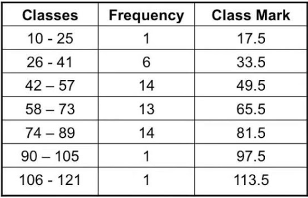

# MATH - QUICK RECAP

Math symbols integrated into markdown through [KaTeX](https://katex.org/).
* [Supported Table](https://katex.org/docs/support_table.html#p)
* [Supported Functions](https://katex.org/docs/supported.html)

#### Table of contents
* [Sets](#sets)
  * [Basic Notation and Terminology](#Basic-Notation-and-Terminology)
  * [Ven Diagram](#Ven-Diagram)
  * [Cardinality and Ordinality](#Cardinality-and-Ordinality)
  * [Relations and Operations](#Relations-and-Operations)
  * [Cartesian Product](#Cartesian-Product)
  * [Formulas and Laws](#Formulas-and-Laws)
* [Algebra](#Algebra)
  * [Real Number Line](#Real-Number-Line)
  * [Number Sets](#Number-Sets)
  * [Basic Axioms](#Basic-Axioms)
  * [Algebraic Properties](#Algebraic-Properties)
  * [Relations](#Relations)
  * [Inequalities](#Inequalities)
  * [Factors](#factors)
  * [Exponents](#Exponents)
  * [Logarithms](#Logarithms)
  * [Rate of Growth](#Rate-of-Growth)
  * [Sigma Notation](#Sigma-Notation)
* [Functions](#Functions)
  * [Cartesian Plane](#Cartesian-Plane)
  * [Distance](#distance)
  * [Linear Equations](#Linear-equations)
  * [Set to Set](#Set-to-Set)
  * [Graphs](#Graphs)
  * [Function Direction](#Function-Direction)
  * [Function Composition](#Function-Composition)
  * [Continuous Function](#Continuous-Function)
  * [Differentiation](#Differentiation)
* [Statistics](#statistics)
  * [Basic Terminology](#Basic-Terminology)
  * [Data Classification](#Data-Classification)
  * [Averages](#Averages)
* [Probability](#probability)
  * [Terminology](#Terminology)
  * [Notation](#Notation)
  * [Principles](#Principles)
  * [Joint Probability](#Joint-Probability)
  * [Permutations and Combinations](#Permutations-and-Combinations)
  * [Bayes Theorem](#Bayes-Theorem)
  * [Inverse Probability](#Inverse-Probability)
  * [Bayes Thinking](#Bayes-Thinking)

# Sets
Sources:
* [probabilitycourse.com](https://www.probabilitycourse.com/preface.php)
* [table of math symbols](https://www.rapidtables.com/math/symbols/Set_Symbols.html)
* [coursera - data science math skills](https://www.coursera.org/learn/datasciencemathskills/home/welcome)

## Basic Notation and Terminology
A `set` is a collection of elements:

$$ A = \{1, 2, -3, 7\} $$
$$ B = \{1, 3, -4, 5\} $$
$$ C = \{25\} $$

An `empty set` is a set with no elements:

$$ D = \empty $$

Notation for an element `belonging to` a set A:

$$ 2 \in A $$

Notation for an element `not belonging to` a set A:

$$ 5 \notin A $$
$$ \{2\} \notin A $$

All admissable elements are considered the `universal set` or `universe`:

$$ U = \{1, 2, 3\}$$
$$ \empty \notin U$$

## Ven Diagram
A graphical representation of sets in a universum.

## Cardinality and Ordinality
An `Ordinal Number` is a number that says what position something has in a list.

> He finished THIRD in the race.

A `Cardinal Number` is a number that says how many of something there is.

> There was ONE Beethoven.

`Ordinality` describes the position of an element and was introduced by Georg Cantor to accommodate infinite sequences. `Ordinal numbers` are used to position elements in a `well-ordered set`. 

A `well ordered set` is one in which for any two elements there is a greater than, lesser than or equality relation.

$$ \forall x, y\{x,y \mid x>y \ or \ x = y \ or \ x < y \} $$

In finite sets the distinction between ordinality and cardinality is not as apparent as in infinite sets. The `smallest infinite ordinal` is the set of all natural numbers. 

$$ \{0,1,2...\} = \N = ω$$
$$ \{1,2,3...\} = ω+1$$
$$ \{0,2,4...\} = 2* ω$$

`Cardinality` describes the size of a set:

$$ |A| = 4 $$
$$ \# A = 4 $$

The cardinality of an empty set is 0:

$$ |D| = 0 $$

Which should not be mistaken with the cardinality of a set containing an empty set:

$$ E = \{\empty\}$$
$$ |E| = 1$$

The cardinality of an infinite set depends on the sets characteristics, since there are various measures of infinity:
* `aleph-naught` $\alef_0$ - infinite cardinality of natural numbers set. Also called `countable` because you can list their elements.

$$ A = \{0, 1, 2, 3... \}$$
$$ B = \{1, 2, 3... \}$$
$$ C = \{1, 4, 9... \}$$
$$ |A| = |B| = |C| = \alef_0$$
* `aleph-one` $\alef_1$- infinite cardinality of all countable ordinal numbers set. Also called `uncountable`. You cannot list their elements.

$$ |\R| = \alef_1$$

A `bijenction` is when two sets have a one-to-one correspondance.

A set is `countable` if it fulfills one of the following conditions:
* if its cardinality is a finite number  - $|S| < \infin$
* if it is a bijection of the natural numbers set. Such a set is called `countably infinite`

## Relations and Operations
The `|` symbol denotes a `such that` relationship.

`Intersection` is which elements two sets have in common:

$$ A \cap B = \{1 \}$$
$$ A \cap B = \{x\mid X \in A \wedge X\in B \} $$

A `Union` is a set containing elements present in at least one of the unioned sets. The union of countable sets is also countable.

$$ A \cup B = \{1, 2, 3, -3, -4, 5, 7 \}$$
$$ A \cup B = \{x\mid X \in A \vee X \in B \} \\ \text{ }$$

Two sets are considered `Equal` when they have the exact same elements.

$$ A = \{1,2\}, B = \{1,2\}$$
$$ A = B$$

The `Complement` of a set are elements in the universal set that are not elements of that set:

$$ U = \{1, 2, 3, 4\}$$
$$ A = \{1, 2\}$$
$$ A' = \{3, 4\}  $$
$$ A^c = \{3, 4\}  $$

`Difference` is all elements that are in one set and not in another:

$$ A = \{1, 2, 3 \}$$
$$ B = \{2, 3 \}$$
$$ A - B = \{1\}$$
$$ B \backslash A = \empty$$

`Symmetric Difference` is a set of elements that belongs in one of two sets but not in their intersection.

$$ A = \{1,2,5,6\}, B = \{2,5,8\}, C = \{2,8\} $$
$$ A \ominus B = \{1,6,8\}$$
$$ B \Delta C = \{5\}$$

`Disjoint` or `Mutually Exclusive` sets are when the intersection between two sets is an empty set.

$$ A = \{1, 2\}$$
$$ B = \{3, 4 \}$$
$$ A \cap B = \empty$$

A `Partition` of a set is when a collection of `non-empty` sets are `disjoint` and their `union` is that set. 

$$ A = \{1, 2, 3\}$$
$$ A_1 = \{1\},\ A_2 = \{2\},\ A_3 = \{3\}$$
$$ A_1 ≠ \empty ,\ A_2 ≠ \empty,\ A_3 ≠ \empty$$
$$ A_1 \cap A_2 = \empty ,\ A_2 \cap A_3 = \empty ,\ A_1 \cap A_3 = \empty$$
$$ A_1 \cup A_2 \cup A_3 = A \\ \text{ }$$
$$ A = \displaystyle\bigcup_{i=1}^3A_i$$

A `Subset` is a set that is included in another set. Any subset of a countable set is also countable.

$$ A = \{1,2\}, B = \{1,2\}, C=\{1, 3\}$$
$$ A \sube B $$
$$ A \nsubseteq C $$

A `Strict Subset` is a set that is included but not equal to another set.

$$ A = \{1\}, B = \{1,2\}, C=\{1, 3\}$$
$$ A \sub B $$
$$ B \ ⊄ \ C $$

A is a `Superset` of B if A includes B. Any superset of an uncountable set is also uncountable.

$$ A = \{1,2\}, B = \{1,2\}, C=\{1, 3\}$$
$$ A \supe B $$
$$ A \nsupseteq C $$

A is a `Strict Superset` of B if A includes but is not equal to B.

$$ A = \{1,2\}, B = \empty, C=\{1, 3\}$$
$$ A \supset B $$
$$ A \ ⊅ \ C $$

A `Power Set` is a set of all a sets subsets. It is important to note that an empty set is the subset of  every set - even if its another empty set. There are two notations for a power set.

$$ A = \{1, 2, 3\}, B = \empty $$
$$ P(B) = \{\empty\} $$
$$ 2^A = \{\empty, \{1\}, \{2\}, \{3\}, \{1,2\}, \{1,3\}, \{2,3\}, \{1,2,3\}\} $$

The cardinality of a set's powerset is always 2 to the power of that sets cardinality.

$$ A = \{1, 2, 3\}, B = \empty $$
$$ |A| = 3, |B| = 0 $$
$$ |2^A| = 2^{|A|} = 2^3 = 8$$
$$ |2^B| = 2^{|B|} = 2^0 = 1$$

`Cantor's Theorem` states that the set of all subsets of `S` is bigger than `S` itself. With `S` being any set.

$$ |2^s| > |S|$$

An `ordered pair` is a pair of two elements where the order in which the elements appear is significant. 

$$ a = 1, b = 4 $$
$$ (a, b) \neq (b, a) $$

## Cartesian Product
The `Cartesian Product` of two sets is a set containing `ordered pairs` from these two sets.

$$ A \times B = \{(x,y)\mid x \in A \ and \ y \in B \}$$
$$ A = \{1, 2, 3\}, B = \{a, b\} $$
$$ A \times B = \{(1, a), (1, b), (2, a), (2, b), (3,a), (3, b)\} $$
$$ A_1×A_2×A_3×⋯×A_n=\{(x_1,x_2,⋯,x_n)|x_1∈A_1 \ and \ x_2∈A_2 \ and \ ⋯x_n∈A_n\} $$

The cartesian product of countable sets is also countable. `i` and `j` are the indices of some countable sets.

$$ C = \displaystyle\bigcup_{i}\displaystyle\bigcup_{j}\{a_{ij}\}$$

A good example is the set of rational numbers $ℚ$ which can be represented as:

$$ ℚ = \displaystyle\bigcup_{i \in \Z}\displaystyle\bigcup_{i \in \N}\{\frac{i}{j}\}$$

In a Cartesian Product the order of the operands is also important.

$$A \times B \neq B \times A $$

The `Multiplication Principle` states that the cardinality of a cartesian product of two finite sets is equal to the result of multiplying the cardinality of those two sets.

$$ |A| = M, |B| = N \ then \ |A \times B| = M * N  $$
$$ ∣A_1×A_2×A_3×⋯×A_n∣=M_1×M_2×M_3×⋯×M_n $$

The cartesian product of `n` sets of all real numbers is equal to the set of all points in an `n-dimensional plain`.

$$ R^2 = R \times R = \{(x,y)\mid x \in R, y \in R \}$$
$$ R^3 = R \times R \times R = \{(x,y,z)\mid x \in R, y \in R, z \in R \}$$

## Formulas and Laws
Popular formulas when dealing with sets.

### Inclusion / Exclusion Formula
A rule stating that the cardinality of 2 or more sets is the sum of each sets cardinality minus their interections.

$$ |A \cup B| = |A| + |B| - |A \cap B| $$

### De Morgan's Law
$$ For \ any \ sets: A_1, A_2, ...,A_n:$$ 
$$1. \ (A_1 \cup A_2 \cup ... \ A_n)^c = A_1^c \cap A_2^c ... \cap A_n^c$$ 
$$2. \ (A_1 \cap A_2 \cap ... \ A_n)^c = A_1^c \cup A_2^c ... \cup A_n^c$$ 

To prove De Morgan's Law:

$$ (A \cup B)^c = A^c \cap B^c$$
$$\ x \in  (A \cup B)^c$$
$$\ x \notin  (A \cup B)$$
$$\ x \notin  A \ and \ x \notin B$$
$$\ x \in  A^c \ and \ x \in B^c$$
$$\ x \in  A^c \cap B^c$$

### Distributive Law
$$ For \ any \ sets: A, B, C:$$ 
$$ A \cap(B \cup C) = (A \cap B) \cup (A \cap C)$$ 
$$ A \cup(B \cap C) = (A \cup B) \cap (A \cup C)$$ 

# Algebra
Sources:
* [wyzant](https://www.wyzant.com/resources/lessons/math/algebra/properties_of_algebra)
* [coursera - data science math skills](https://www.coursera.org/learn/datasciencemathskills/home/welcome)

## Real Number Line
The spectrum of all real numbers is from `-∞` to `+∞`

$$ -\infin\text{ }\text{------------------------}\text{ }+\infin $$

`Absolute value` of a real number `X` is the distance from `X` to `0`

$$ X = -5 $$
$$ Y = 5 $$
$$ |X| = |Y| $$
$$ |X| =  \begin{Bmatrix}
            x \ \ \ \ if \ x >0 \\
            -x \ if \ x <0 \\
          \end{Bmatrix}
$$

An `interval` is a set of real numbers that lies between two numbers on the real number line. Where x and y are any two numbers in a given universe. Intervals can be `open`, `closed` or `half-open`. If an interval has infinity

$$ (2, 6) = \{x \in R: 2 < x < 6 \} $$
$$ [2, 6] = \{x \in R: 2 \leq x \leq 6 \} $$
$$ [2, \infin) = \{x \in R: x \ge 2 \} $$
$$ x \in [2, \infin] $$

## Number Sets

`Real numbers` encompass the whole spectrum. They are the superset of all other number types. For example between `0` and `1` you have an infinite amount of real numbers.

$$ \R=\{...0, 0.0001, 0.0002...\} $$

Real numbers can be separated into:
* `positive real numbers` - any real number greater than `0`
* `non-negative real numbers` - any real number equal to or lesset than `0`
* `negative real numbers` - any real number lesser than `0`
* `non-positive real numbers` - any real number equal to or lesser than 0

$$ \R_+ = \{...0.0001...1...10312.12...\}$$
$$ \R_- = \{...10312.12...-1...-0.0001...\}$$

`Rational numbers` are real numbers that can be represented as a quotient or fraction of two integers.

$$ \{ -3,\frac{1}{2}, 0.001, 5\} \in Q $$

`Irrational numbers` are all real numbers that cannot be represented as a quotient or fraction of two integers. This includes: 
* `pi` - the ratio of a circles circumference to its diameter `π`
* `Euler's number` - a constant representing the base of a natural algorithm `e`
* `The golden ratio` - a ratio between two quantities if their ratio is the same as the ratio of their sum to the larger of the two quantities `φ` 
* `all square roots` of `natural numbers` that are not perfect squares

$$ \Phi \approx 1.61803 $$
$$ \pi \approx 3.14159 $$
$$ e \approx 2.71828 $$
$$ \sqrt{2} \approx 1.41421 $$
$$ \{\Phi, \pi, e, \sqrt{2} \} \in \R \backslash Q$$ $$

`Integers` are whole numbers, meaning they have no fraction part.

$$ \Z=\{...-2, -1, 0, 1, 2...\} $$

`Natural` numbers are either whole positive numbers or whole non-negative numbers. This is disputed.

$$ \N=\{1, 2...\} $$
$$ \N=\{0, 1, 2...\} $$

Sometimes for disambiguation a different notation is used for natural nubmer sets starting with 0 and with 1.

$$ \N_1=\{1, 2...\} $$
$$ \N_0=\{0, 1, 2...\} $$

## Basic Axioms
Simple rules that are derived from Euclid's Common Notion One.

`Reflexive Axiom`:

$$ a = a$$

`Symmetric Axiom`:

$$ if \ a = b \ \ then \ \ b = a$$

`Transitive Axiom`:

$$ if \ a = b \ \ and \ \ b=c \ \ then \ \ a = c$$

`Additive Axiom`:

$$ if \ a = b \ \ and \ \ b=c \ \ then \ \ a = c$$

`Multiplicative Axiom`:

$$ if \ a = b \ \ and \ \ c=d \ \ then \ \ a*b = c*d$$

## Algebraic Properties
A set of basic rules that apply to all `real numbers`

`Commutitave Property of Addition`:

$$ a + b = b + a $$

`Commutitave Property of Multiplication`:

$$ a * b = b * a $$

`Associative Property of Addition`:

$$ (a+b)+c = a + (b+c) $$

`Associative Property of Multiplication`:

$$ (a*b)*c = a*(b*c) $$

`Distributive Property`:

$$ a*(b+c) = a*b+a*c $$

`Additive Identity Property`:

$$ a+0 = a $$

`Multiplicative Identity Property`:

$$ a*1 = a$$

`Additive Inverse Property`:

$$ a - a = 0$$

`Multiplicative Inverse Property`:

$$ a * \frac{1}{a} = 1$$

`Equality properties`:

$$ \text{if } a = b, \text{Then }a + c = b + c $$
$$ \text{if } a = b, \text{Then }a * c = b* c $$
$$ \text{if } a + c = b + c, \text{Then }a = b$$
$$ \text{if } a* c = b * c \text{ and }c \neq 0, \text{Then }a = b$$

`Properties of zero`:

$$ a \pm 0 = a $$
$$ a * 0 = 0 $$
$$ if a \neq 0, \text{ Then }\frac{0}{a} = 0 $$
$$ \frac{a}{0} = \text{NaN} $$

`Zero Product Property`:

$$ \text{If } a * b = 0 \text{, Then } a = 0 \text{ and/or } b = 0$$

`Equivalent Fractions`:

$$ \frac{a}{b} = \frac{c}{d} \iff ad = bc $$

`Rules of Signs`:

$$ -\frac{a}{b} = \frac{-a}{b} = \frac{a}{-b} \text{ and } \frac{-a}{-b} = \frac{a}{b} $$

`Generate Equivalent Fractions`:

$$ \frac{a}{b} = \frac{a * c}{b * c} \iff c \neq 0$$

`Add/Subtract with Like Denominators`:

$$ \frac{a}{b} \pm \frac{c}{b} = \frac{a \pm c}{b} $$

`Add/Subtract with Unlike Denominators`:

$$ \frac{a}{b} \pm \frac{c}{d} = \frac{a * d \pm b * c}{b * d} $$

`Multiply Fractions`:

$$ \frac{a}{b} * \frac{c}{d} = \frac{a * c}{b * d} $$

`Divide Fractions`:

$$ \frac{a}{b} \div \frac{c}{d} = \frac{a}{b} * \frac{d}{c} = \frac{a * d}{b * c} \iff c \neq 0 $$

## Relations
Number in relation to where they are positioned on the `real number line`

Is `less than`: 

$$ 2 < 5 $$

Is `greater than`:

$$ 10 > 5 $$

A is greater than B if and only if B is less than A:

$$ A > B \iff B < A$$

A is `less than or equal` to B:

$$A \le B $$

B is `greater than or equal` to A:

$$B \ge A $$

A is `much much less than` one(popular notation in data science):

$$ A \ll B $$

## Inequalities
Using basic algebraic properties you can solve most linear equations. 

Inequalities are solved just like linear equations with the exception of `multiplication` and `division` where multplying/dividing by a `negative number flips the inequality sign`.

$$ -x + 2 > 10 \hspace7ex :-2$$  
$$ -x > 8 \hspace7ex :*(-1)$$  
$$ x < -8 $$

## Factors
A `Factor` is a number you can multiply by to get another number. For example `3` is a factor of `9` and `15`

$$ 3 * 3 = 9 $$
$$ 3 * 5 = 15 $$

`Factorization` is writing a number as a product of its factors.

$$ 10 = 2 * 5 $$
$$ 128 = 2 * 2 * 32 $$

A `Prime Number` is a number that can only be factorized into the product of itself and `1`. `1` is not a prime number.

$$2 = 2 * 1 $$
$$3 = 3 * 1 $$
$$5 = 5 * 1 $$
$$7 = 7 * 1 $$

`Prime Factorization` is factorizing a number into a list of all prime numbers its a product of.

$$8 = 2 * 2 * 2$$

A `Factorial` is the product of an integer and all integers below it and is denoted by an exclamation mark.

$$ n! = n * (n-1) * (n-2) * ... * 3 * 2 * 1 \\ \text{}$$
$$ n! = \displaystyle\prod_{i=0}^{n-1} n - i  \\ \text{ }$$
$$ 3! = 3 * 2 * 1 = 6 $$
$$ 1! = 1 $$
$$ 0! = 1 $$

## Exponents
An `exponential number` is a number `x` multiplied by itself `n` times $x^n$. It consists of the:
* `base` - the number that is being multiplied by itself
* `exponent` - the number of times it is being multiplied

$$ x^n = x * x * x *...* x $$

An `exponent` represents the power to which an expression should be raised. Usually expressed as a raised number to the right of the expression.

$$ 2^2 = 4$$
$$ 2^3 = 8$$
$$ 2^4 = 16$$
$$ 2^5 = 32$$
$$ 2^6 = 64$$
$$ (3 + x)^2 = 9 + 6x + x^2$$

`n-squared` is the number `n` to the second power $n^2$

$$ 5^2 = 25 $$

`n-cube` is the number `n` to the third power $n^3$

$$ 3^3 = 27 $$

Any number except 0 raised to the `0` with power equals `1`. $0^0$ is `undefined`

$$ \pi^0 = 1 $$

A `negative integer exponent` produces the opposite of repeated multiplication.

$$ x^{-n} = \frac{1}{x^n} \\ \text{}$$
$$ \frac{1}{x^{-n}} = x^n \\ \text{}$$

$$ 3^{-1} = \frac{1}{3^{1}} = \frac{1}{3} \\ \text{}$$
$$ 5^{-2} = \frac{1}{5^{2}} = \frac{1}{25} \\ \text{}$$
$$ \frac{1}{5^{-2}}= \frac{1}{\frac{1}{5^{2}}} = \frac{1}{\frac{1}{25}} = 25 = 5^2 \\ \text{}$$
$$ \frac{1}{4^{-2}}= 4^2 = 16$$

`Scientific Notation` is a shorhand way of writing numbers with a lot of zeros in them. We take the `significant non-zero digits` and multiple them by an `exponent of 10`.
* only `one digit` to the left of the decimal place

$$ \text{MASS OF THE EARTH}(kg) \\ \text{}$$
$$ 5972000000000000000000000$$
$$ = 5.972 * 10^{24} \\ \text{}$$

$$ \text{MASS OF ELECTRON}(kg) \\ \text{}$$
$$ 0.0000000000000000000000000000009109$$
$$ = 9.109 * 10^{-31} \\ \text{}$$

A `Fractional Exponent` $x^{\frac{n}{m}}$ can be divided into two operations where the `numerator` represents a standard integer exponent and the `denominator` represents a `root`.

$$x^{\frac{n}{m}} = \sqrt[m]{x^n} \\ \text{}$$

$$ 8^{\frac{2}{3}} = \sqrt[3]{8^2} = \big(\sqrt[3]{8}\big)^2$$

### Basic Rules for Exponential Expressions
* `Multiplication Rule` - $x^n * x^m = x^{n+m}$

$$ 2^2 * 2^3 = 2^{2+3} = 2^5 $$

* `Power to a Power` - $(x^n)^m = x^{n*m}$

$$ (2^2)^3 = 2^{2*3} = 2^6 $$

* `Product to a Power` - $(x*y)^n = x^ny^n$

$$(2*3)^3 = 2^3 * 3^3  $$

* `Fraction to a Power` - $(\frac{x}{y})^n = \frac{x^n}{y^n}$

$$ \bigg(\frac{2}{3}\bigg)^3 = \frac{2^3}{3^3} $$

* `Division and Negative Powers` - $\frac{x^n}{x^m} = x^{n-m}$

$$ \frac{2^2}{2^3} = 2^{2-3} = 2^{-1} $$

## Logarithms
A `Logarithm` represents a value equal to the power to which a fixed number needs to be raised to produce a specific number.
* `b` - the fixed number number is called the `base` of the logarithm
* `N` - the attained value
* `x` - the exponent
* the logarithm is an inverse function to exponentiation

Logarithms can take `two forms`:
* `exponential form` where it is expressed as an exponent

$$b^x = N $$
$$2^3 = 8 = N $$

* `logarithmic form` where it is expressed as a logarithm

$$ x = \log_b(N) $$
$$ \log_2(8) = x = 3 $$

### Logarithm Rules
Logarithms like exponents follow some `basic rules`:
* `Zero Rule` - the logarithm of one for any base equals 0

$$ \log_2(1) = 0 $$
$$ \log_{\pi}(1) = 0 $$

* `Identity Rule` - the logarithm of a number that is equal to its base equals 1

$$ \log_x(x) = 1 $$
$$ \log_{\pi}(\pi) = 1 $$

* `Product Rule` - the logarithm of $x * y$ of any base equals $\log x + \log y$

$$ \log(x * y) = \log(x) + \log(y) \\ \text{}$$
$$ \log_b (35) = \log_{b}7 + \log_{b}5 $$

* `Quotient Rule` - the logarithm of a fraction $\frac{x}{y}$ of any base is equal to $\log x - \log y$

$$ \log(\frac{x}{y}) = \log(x) - \log(y) \\ \text{}$$

* `Exponent Rule` - the logarithm of an exponential which has the same base as the logarithm base equals to the exponent.

$$ \log_{b}(b^n) = n$$

* `Power Rule` - the logarithm of a number to a power $x^n$ is equal to the product of the logarithm of that number and its power

$$ \log(x^n) = n * \log(x) $$

* `Exponent of Log` - raising the logarithm of a number by its base equals that number

$$ b^{\log_{b}(k)} = k \\ \text{}$$
$$ 2^{\log_{2}(16)} = 16$$

The `Exponent of Log` rules is often used as a `problem-solving technique` in which you treat both sides of an equation as though they where exponents.

$$ x = y $$
$$ z^x = z^y \\ \text{}$$
$$ \log_{2}\bigg(\frac{39x}{(x-5)}\bigg) = 4 \\\ \text{}$$
$$ 2^{\log_{2}(\frac{39x}{(x-5)})} = 2^4 \\ \text{}$$
$$ \frac{39x}{(x-5)} = 16 \\ \text{}$$
$$ 39x = 16(x-5) \\ \text{}$$
$$ 39x = 16x-80 \\ \text{}$$
$$ 23x = -80 \\ \text{}$$
$$ x = -\frac{80}{23} \\ \text{}$$

### Base Conversion
To convert the base of a logarithm use the following formula for which:
* `x` - the base the is being converted
* `a` - the target base

$$ \log_{a}(b) = \frac{\log_x(b)}{\log_x(a)} $$

## Rate of Growth
`Growth Rate` is how much a quantity increases over time.
> The human population grows at a rate o `1.08% per year`

$$ r = 0.0108$$

`Decay Rate` is how much a quantity decreases over time.
> The number of bacteria decays by `3% each hour`

$$ r = 0.03$$

`Growth Factor` or `Exponential Growth` is a multiplier by which a quantity multiplies itself as it grows over time.
> The human population grows by a factor of 1.0108 per year
* `a` - the `initial value` - e.g. $7.7 * 10^9$
* `r` - the `growth rate` - e.g. $1.08%$
* `x` - number of `time intervals` - e.g. years

$$ y = a(1 + r)^x $$

`Decay Factor` or `Exponential Decay` is a multiplier by which a quantity multiplies itself as it decreases over time.
> The number of bacteria decays by a factor of 0.97 per hour
* `a` - the `initial value` - e.g. $3.2 * 10^{16}$
* `r` - the `decay rate` - e.g. $3%$
* `x` - number of `time intervals` - e.g. hours

$$ y = a(1 - r)^x $$

Exponential Growth and Decay can be:
* `discrete` - where the value changes at set intervals

$$ y = a(1 + r)^x $$

* `continuous` - where the value changes continuously. This is expressed by multiplying the initial value by an exponent of euler's number

$$ y = a * e^{(r)(x)}$$

### Eulers Constant in Growth Rate

If we start multiplying the number of time intervals and dividing the rate of growth by the same amount, the result keeps increasing until it finally levels off at a value close to `euler's constant`. 

$$ e \approx 2.718281828459 $$

Let's imagine the following scenario. We have `1$` and the rate of growth is `100%` over a `year`:
* `a` = 1
* `r` = 1
* `x` = 1 year

$$ y = a(1+r)^x \\ \text{}$$
$$ y = 1 * (1+1)^1 = 2 \\ \text{}$$

* in 1 year our initial value would double
* now let's see how much the initial value increases over a year if we change the interval to one month and divide the growth of rate accordingly:

$$\text{Once a month: } y = (1+\frac{1}{12})^{12} \approx 2.613 \\ \text{}$$
$$\text{Once a week: } y = (1+\frac{1}{52})^{52} \approx 2.693 \\ \text{}$$
$$\text{Once a day: } y = (1+\frac{1}{365})^{365} \approx 2.715 \\ \text{}$$
$$\text{Once an hour: } y = (1+\frac{1}{8760})^{8760} \approx 2.718 \\ \text{}$$
$$\text{Once a minute: } y = (1+\frac{1}{525600})^{525600} \approx 2.718 \\ \text{}$$

* As we can see by the time we get to an hour long interval the result evens out at `euler's constant` - $e \approx 2.718$

Now lets assume that every year I gain `5%` in weight and my current weight is `75kg`. Using the `continuous exponential growth formula` I could easily calculate how much I'll weigh in `4 years`:

$$ \text{weight in 3 years} = 75 * e^{(0.05)(4)} = 75 * e^{0,2} \approx 91.60 \ kg$$

### Natural Logarithm
A `Natural Logarithm` is one for which the base is `euler's number`. The notation for a natural logarithm is `ln(x)`. It is called natural because it is used to count naturally occurring rates of growth.
* imaging you have rabbits breeding. Each rabbit weighs `10kg` and the number of rabbits grows by `200%` each year
* how many years(`t`) would it take for all the rabbits to way as much as the earth $5.972 * 10^{24} kg$?

$$ 5.972 * 10^{24} kg = 10kg * e^{2t} \\ \text{}$$
$$ 5.972 * 10^{23} = e^{2t} \\ \text{}$$
$$ \text{MULTIPLE BOTH SIDES BY } \ln \\ \text{}$$
$$ \ln(5.972 * 10^{23}) = \ln e^{2t} \\ \text{}$$
$$ \ln(5.972 * 10^{23}) = 2t \\ \text{}$$
$$ \frac{\ln(5.972 * 10^{23})}{2} = t \\ \text{}$$
$$ t \approx 27.37 \text{ years} \\ \text{}$$

## Sigma Notation

`Sigma Notation` is a consice way of presenting of sequence of sums. It consists of:
* `i` - the index of summation, sometimes called `dummy indices`
* `m` - the lower bound of summation
* `n` - the upper bound of summation
* `k` - an expression

$$ \displaystyle\sum_{i=m}^nk \\ \text{ }$$
$$ \sum a^2_i = \displaystyle\sum_{i=1}^n a^2_i \\ \text{ }$$
$$ \displaystyle\sum_{i=1}^4 i^2 = 1^2+2^2+3^2+4^2 = 30 \\ \text{ }$$
$$ 2\displaystyle\sum_{i=1}^4 i^2 = 60\\ \text{ }$$
$$ \Bigg(2\displaystyle\sum_{i=1}^4 i^2\Bigg) + 5 = 65\\ \text{ }$$
$$ \displaystyle\sum_{i=1}^n i^2 = 1^2 + 2^2 +3^2+...+n^2\\ \text{ }$$
$$ \displaystyle\sum_{1< k<10} k = 2+3+4+5+6+7+8+9 = 44\\ \text{ }$$
$$ S = \{1, 2, 3\} $$
$$\displaystyle\sum_{x \in S}2x = 2 *1 + 2*2 + 2*3 = 12 \\ \text{ }$$
$$\displaystyle\sum_{i|10}x = 1+2 +5+10 = 18 \\ \text{ }$$
$$\displaystyle\sum_{i, j} = \displaystyle\sum_{i} + \displaystyle\sum_{j}= \displaystyle\sum_{i}\displaystyle\sum_{j} \\ \text{ }$$

`Boundary cases` for sigma notation are when $n=m$ or when $n < m$:

$$ \displaystyle\sum_{i=2}^2x=x \\ \text{ }$$
$$ \displaystyle\sum_{i=2}^1x=0 $$

Some `simple rules` for sigma notation, where `c` is any constant. These rules will stay true if you replace `c` with a function:

$$ \displaystyle\sum_{i=1}^n c = nc\\ \text{ }$$
$$ \displaystyle\sum_{i=1}^n 4c = 4\displaystyle\sum_{i=1}^n c = nc\\ \text{ }$$
$$ \displaystyle\sum_{i=1}^n (i + c) = nc + \displaystyle\sum_{i=1}^n i\\ \text{ }$$
$$ \displaystyle\sum_{i=1}^4 (i + 2) = (4*2) + \displaystyle\sum_{i=1}^4 i = 18\\ \text{ }$$
$$ \displaystyle\sum_{i=1}^n (i^2 + ic) = \displaystyle\sum_{i=1}^n i^2 + \displaystyle\sum_{i=1}^n ic \\ \text{ }$$

Finding the `mean of a set` is as simple as:

$$ \frac{1}{n} \displaystyle\sum_{i=1}^n x_i \\ \text{ } $$
$$ S = \{1, 2, 3, 4, 5\} \\ \text{ } $$
$$ \frac{1}{|S|} \displaystyle\sum_{i=1}^{|S|} S_i = \frac{(1+2+3+4+5)}{5} = \frac{15}{5} = 3\\ \text{ } $$

`Capital pi notation` is a consice way of presenting the product of a sequence which is the result of multiplying elements. Its notation is respective to the sigma notation.

$$ \displaystyle\prod_{i=m}^n \\ \text{ }$$
$$ \displaystyle\prod_{i=1}^3 i+1 = 2 * 3 * 4 = 24 \\ \text{ }$$

# Functions
A function is a relation that associates each element in one set with exactly one element from another set.

## Cartesian Plane
A `Cartesian Plane`, often denoted $\R^2$ is a graph with two perpendicular axis - the horizontal `x-axis` and vertical `y-axis`. Each point on the cartesian plane can be specified by a unique `ordered pair` with the first numerical value representing its position on the x-axis and the second value its position on the y-axis as follows `(x,y)`. The axis cross at the `origin` which is denoted by an `O` and represents the `(0,0)` pair.

$$ \text{x-axis} = \{ x \in \R^2 : y = 0 \}$$
$$ \text{y-axis} = \{ y \in \R^2 : x = 0 \}$$

`Quadrants` are four regions on the Cartesian Plane.

$$ I = \{(x,y) \in \R^2: x > 0, y > 0\} $$
$$ II = \{(x,y) \in \R^2: x < 0, y > 0\} $$
$$ III = \{(x,y) \in \R^2: x < 0, y < 0\} $$
$$ IV = \{(x,y) \in \R^2: x > 0, y < 0\} $$

## Distance
The `Distance Formula` is a formula through which you can calculate the distance between two points on the cartesian plane. It is derived from the Pythagorean theorem, which states that in a right triangle the length of the hyptenuse can be calculated using the lengths of its legs as operands.

$$ c^2 = a^2 + b^2$$
$$ c = \sqrt{a^2 + b^2} \\ \text{ }$$

$$ |A-B| = \sqrt{(x_B - x_A)^2 + (y_b - y_a)^2} \\ \text{ }$$
$$ A = (1, 1)$$
$$ B = (5, 4) \\ \text{ }$$
$$ |A - B| = \sqrt{(x_B - x_A)^2 + (y_B - y_A)^2} = \sqrt{(5 - 1)^2 + (4 -1)^2} = \sqrt{25} = 5 $$

`Nearest neighbors` or `NN` defines an element in a set that is most like another element. For example given a set of points $S=\{A(1,1), B(1,2), C(1,3)\}$ the nearest neighbor of point $D(1,4)$ would be `C` since it is closest to `D` on the cartesian plane.

`Clustering` is a technique used to divide data points or a population into groups of data points so that data points in the same group are similar to each other and dissimilar to data points in other groups.

A cluster is determined by the distances between its data points. If points:
* $A$ and $B$ are in `Cluser I`
* $C$ is in `Cluser II`
* $D$ is in `Cluser III`

$$ |A - B| << |A - C|$$
$$ |A - B| << |A - D|$$

## Linear Equations
A line from point `A` to point `B` denoted by $\overrightarrow{AB}$

The `Slope` is a characteristic defining the direction of a line and is denoted by $M$ and is calculated by dividing the `rise` $y_2-y_1$(or $\Delta y$) by the `run` $x_2-x_1$(or $\Delta x$). Slopes are divided into:
* `positive slope` - $M$ is a positive value, you have to `"run up"`
* `negative slope` - $M$ is a negative value, you have to `"run down"`

$$A = (x_1, y_1), B = (x_2, y_2) \\ \text{ }$$
$$ M_{\overrightarrow{AB}} =  \frac{y_2-y_1}{x_2 - x_1} \\ \text{}$$
$$ OR \\ \text{}$$
$$ M_{\overrightarrow{AB}} =  \frac{\Delta y}{\Delta x} \\ \text{}$$

The `y-intercept` of a line is a unique point where the line meet the y-axis - $f(0)$

$$f(x) = 2x + 4$$
$$f(0) = 2*0 + 4 = 4$$

`Point Slope` formula allows calculating the `slope` and `point` of a line on the Cartesian Plane. It states that:
> If a line `l` has slope `M` and if $(x_0, y-_0)$ is any point on the line than `l` has the equation $y - y_0 = m(x - x_0)$

`Slope Intercept` formula is a popular way of expressing a lines equation. Determining the formula requires:
* `m` - the slope of a line
* `b` - the y-intercept of the line

The formula in simpler terms states that:
> if a line `l` has slope `m` and `l` hits the `y-axis` at the point `(0,b)`, then `y = mx + b` is an equation for the line

$$ y = mx + b$$

## Set to Set
As stated before, a `function` $f: X \to Y$ is a relation(rule, formula, machine) that assigns to each element `x` in the set `X` exactly one element `y` in the set `Y`. In this example: 
* the set `X` is the `domain`
* the set `Y` is the `codomain`
* all the possible values of $f:X \to Y$ is the `range` and it is usually a subset of `Y`, the codomain

You can also say that it transforms $x \in X$ into $f(x) \in Y$

In the real world you usually do not have functions for different events - you do not know what the output for every input is.

`Supervised Learning` is a machine learning task, which is supposed to infer a function that maps specific inputs to specific outputs based on some example input-output pairs. It can than apply this function to pairs other than the example pairs.

## Graphs
A `graph` is a diagram showing the relation between variables expressed by a function.
> If $g:\R \to \R$ the graph of $g$ is $\text{graph}(g) = \{ (x,y) \in \R^2:y=g(x)\}$

The `Vertical Line Test` is a way to assess whether a graph actually represents a function. By drawing a vertical line on a graph you can visualize whether each element of the domain maps to only one value in the range.
> Any vertical line intersects the graph of a function **once**

## Function Direction
An `strictly increasing function` is one in which the `y-value increases` as the `x-value increases` along its `whole domain`.

$$f: \R \to \R$$
$$ a > b $$
$$ f(a) > f(b) $$

A `decreasing function` is one in which the `y-value decreases` as the `x-value increases` along its `whole domain`.

$$f: \R \to \R$$
$$ a > b $$
$$ f(a) < f(b) $$

The `Horizontal Line Test` is a way to assess whether a graph is strictly decreasing or increasing. By drawing a horizontal line on a graph you can visualize whether each element is the range is unique for each element in the domain. 
> Any horizontal line intersects with a strictly decreasing or increasing graph only once

## Function Composition
`Function Composition` is an operation in which you create a `composite function` by passing the output of one function as the input of another function. 
* The `function composition operator` is a small circle $\circ$
* function composition is `not commutitave` - $f(x) \circ g(x) \neq g(x) \circ f(x)$

$$\R\xrightarrow{f(x)}\R\xrightarrow{g(x)}\R \\ \text{}$$
$$g \circ f \\ \text{} $$

$$f(x) = x^2$$
$$g(x) = x + 1$$
$$(g \circ f)(x) = g(f(x)) = g(x^2) = x^2 + 1 $$
$$ (g \circ f)(3) = g(f(3)) = g(3^2) = 9 + 1 = 10  \\ \text{}$$

$$ (f \circ g)(x) = f(g(x)) = f(x + 1) = (x + 1)^2 $$
$$ g \circ f \neq f \circ g $$

An `Inverse function` is one that when applied to the output of another function the result is always equal to x.

$$ f(x) = x + 1 $$
$$ g(x) = x - 1 \\ \text{}$$

$$ (g \circ f)(x) = g(f(x)) = g(x + 1) = (x + 1) - 1 = x $$

In the above case $f$ and $g$ are inverses of eachother.

Not every function $f: \R \to \R$ has an inverse. In general if a graph `fails the horizontal line test`, meaning the function is neither strictly decreasing or increasing than `it has no inverse function`

## Continuous Function
Source: [dummies](https://www.dummies.com/education/math/calculus/how-to-determine-whether-a-function-is-continuous/)

## Differentiation
A `Tangent Line` expresses the rate of change of a function $f(x)$ for a specific `x`. 
* On $\R^2$ it can be graphed as a line parallel to the graph of the function $f(x)$ and adjacent at that point in question. 
* The tangent lines `slope` represents the `rate of change`.

`Differentiation` is the action of computing a derivative of a function.

A `derivative function` $f'(x)$ also denoted $\frac{d}{dx}$ is used to calculate the rate of change of a function $f(x)$ at any point `x`
* to calculate the `rate of change` of $f(x)$ at a point $a$ such that $a \in x$ you need to know the `slope` of the `tangent line` at $f(a)$
* to calculate the `slope` you need `two points` on that `tangent line` but you are only given one point $a$
* in `differentiation` this is done by taking an `arbitrary point` that is very close to $a$ and `shrinking` $\Delta x$ to zero
* this results in the equation:

$$\frac{\Delta y}{\Delta x} = \frac{f(x + \Delta x) - f(x)}{\Delta x}$$

* `shrinking` $\Delta x$ can be expressed as $\lim\limits_{\Delta x \to 0}$
* which brings us to:

$$ f'(x) = \lim\limits_{\Delta x \to 0}\frac{f(x + \Delta x) - f(x)}{\Delta x} \\ \text{}$$
* for example:

$$f(x) = x^2 \\ \text{}$$
$$ f'(x) = \lim\limits_{\Delta x \to 0} \frac{(x + \Delta x)^2 - x^2}{\Delta x} \\ \text{} 

$$ = \lim\limits_{\Delta x \to 0} \frac{x^2 + 2\Delta x*x + \Delta x^2- x^2}{\Delta x}  $$

$$ = \lim\limits_{\Delta x \to 0} \frac{\Delta x(2x + \Delta x)}{\Delta x} \\ \text{}$$
$$ = \lim\limits_{\Delta x \to 0} 2x + \Delta x = 2x$$

* if $f'(x)=0$ that means the tangent line for that point is horizontal

&nbsp;
# Statistics
Source:
* [Udemy - Statistics for Data Science and Business Analysis](https://www.udemy.com/course/statistics-for-data-science-and-business-analysis/)

## Basic Terminology
The `population`, denoted $N$, is the collection of all items of interest to our study. The larger a population the harder it is to observe and define. A value that refers to a population is called a `parameter`.

**Examples**: 
* all the students in the world $\to N_1$
* all the students in my math class $\to N_2$
* all consumers of canned goods $\to N_3$
* all investors $\to N_4$

A `sample`, denoted $n$ is a subset of the population $n \sub N$. A sample is much cheaper and less time consuming to observe and can give insights on the population that is its superset. A value that refers to a sample is a `statistic`. Samples have two defining characteristics:
* `Randomness` - each element in the sample is selected strictly by chance
* `Representativeness` - the sample accurately reflects the members of the population

**Examples**: 
* random students from various universities across the world $n_1 \sub N_1$
* randomly chosen students from my math class $n_2 \sub N_2$
* 40 consumers of canned goods I interviewed $n_3 \sub N_3$
  * this is neither random or representative
* investors that use my algo investing app, that has global reach $n_4 \sub N_4$
  * this is not random

## Data Classification
Data is classified by its:
* `Type` - defined by what is observed
  * `Categorical` - describes categories or groups of data. E.g.: 
    * phone brands - samsung, nokia, iphone
    * boolean data - true or false
  * `Numerical` - values represented by real numbers. These farther divide into:
    * `Discrete` - finite numerical data set. E.g.:
      * number of eggs in a basket
      * score on a test
      * dates in a calendar
      * time on a clock
      * number of objects
    * `Continuous` - infinite numerical data sets. E.g.:
      * a persons weight or height
      * distance
      * time in general
      * area
* `Measurement Level` - defined by the method of observation
  * `Qualitative` - describes non-numerical data through concepts like **meaning**, **characteristics**, **metaphors**, **symbols** and **descriptions**. Consists of two groups:
    * `Nominal` - labels variables without providing quantitative value. E.g.:
      * true and false
      * samsung, nokia, iphone
      * mercedes, fiat, mazda
    * `Ordinal` - groups and categories that follow an order that describes the relation between elements.  E.g.:
      * disgusting, poor, average, good, terrific
      * a scale from 1 to 10
  * `Quantitative` - measures of values or counts expressed as numbers. Split into two groups:
    * `Interval` - data measured along a scale where points are an equal distance from one another. E.g.:
      * temperature on a thermometer
      * time
    * `Ratio` - has an equal and definitive ratio between each data and an *absolute zero* value. E.g:
      * temperature on the Kelvin scale
      * weight

## Data Visualization
`Frequency distribution table` is a list, table of graph that represents the frequency of various outcomes in a sample.

`Pie Charts`

`Bar Charts`

`Pareto Diagrams`
  

## Averages

The `mean` of a set of numbers is the sum of all its elements divided by its cardinality. `n` in this case is a variable representing th cardinality of the set in question.

$$ \mu_x = \frac{1}{n} \displaystyle\sum_{i=1}^{n} x_i\\ \text{ }$$
$$ S = \{1, 2, 3\} \\ \text{ }$$
$$ \mu_S = \frac{1}{n} \displaystyle\sum_{i=1}^n x_i = \frac{1}{3} \displaystyle\sum_{i=1}^3 x_i = \frac{1+2+3}{3} = 2$$

`Mean centering` is a technique used to redefine the 0 point of a scale through shifting the set of values. A constant is subtracted from each value so that all values "revolve around" the mean value of the set.

$$ S = \{2, 6, 13\} $$
$$ \mu_S = 7 $$
$$ S \ ' = \{2 - 7, 6 - 7, 13 - 7 \} = \{-5,-1, 6\}$$
$$ \mu \ ' = 0$$

The `median` of a set of numbers is the middlemost number. If the sets cardinality is an even number we compute the median by calculating the mean of its two middlemost numbers.

$$ S_1 = \{1, 2, 3\}$$
$$ \text{\~{S}}_1 = 2\\ \text{ }$$
$$ S_2 = \{1, 2, 3, 4\}$$
$$ \text{\~{S}}_2 = \frac{2+3}{2} = 2.5$$

The `mode` of a set of numbers is the number that occurs the most. If a set has two modes it is called `bimodal`.

$$ S_1 = \{1, 2,2, 3\}$$
$$ Mo_{S_1} = 2 \\ \text{ }$$
$$ S_2 = \{1, 2,2, 3,3,4\}$$
$$ Mo_{S_2} = \{2, 3\}$$

The `variance` of a set represents how far each value in the data set is from the mean. It is the summation of the difference between the value of each element and the sets mean to the power of 2, and dividing that sum by the number of elements in the set.

$$ \sigma^2_n = \frac{1}{n} \Bigg(\displaystyle\sum_{i=1}^n(x_i - \mu_x)^2 \Bigg) \\ \text{ }$$
$$ S = \{1,5,12\} $$
$$ n_S = 3 $$
$$ \mu_S = 6 \\ \text{ }$$
$$ \sigma^2_n = \frac{1}{3} \Bigg(\displaystyle\sum_{i=1}^3(x_i - 6)^2 \Bigg) = \frac{1}{3} (25 + 1 + 36) = \frac{62}{3}$$

The `standard deviation` is the square root of a sets variance.

$$\sigma_x = \sqrt{\sigma^2_x}$$

What makes `variance` and `standard deviation` especially useful as `measures of scatter` in statistics are the following properties:
* their measure is proportional to the scatter of the data
* their measure is independent of the cardinality of the data set
* their measure is independent of the mean

# Probability
Source:
* [probabilitycourse](https://www.probabilitycourse.com/chapter1/1_3_1_random_experiments.php)
* [coursera - data science math skills](https://www.coursera.org/learn/datasciencemathskills/home/welcome)
* [wikipedia - probability](https://en.m.wikipedia.org/wiki/Probability_distribution)

## Terminology
`Probability` is a degree of belief in the truth or falsity of a statement. 

Probability is important in `random experiments`, which is a process in which we observe something uncertain. 

The `sample space` is a set of all possible outcomes of the random experiment.

$$S_{coin} = \{heads, tails\}\\ \text{}$$

$$S_{dice} = \{1,2,3,4,5,6\} $$

A `trial` is a particular performance of a random experiment. An `event` is a subset of the sample space that we are researching.

A `statement` $X$ is the description of the event we are researching.
> What is the probability that when I flip a coin the outcome will be `tails`

$$S_{coin} = \{H, T\}\\ \text{}$$

$$S_{tails} = \{T\} \\ \text{}$$

$$P(x) = \frac{1}{2} = 50\% $$

`Probability Distribution` is a collection of 2 or more statements where, `given complete information` those statements are:
* `Exclusive` - `no more than one` statement can be `true`
* `Exhaustive` - `at least one` statement must be `true`

## Notation
In probability we deal with uncertainty
* `range of uncertainty` is `(0,1)`
* a `certainly false` statement is assigned a value of `0`
* a `certainly true` statement is assigned a value of `1`

Notation for probability:
* the `Probability of the statement x`  is denoted $P(x)$
* the negation `~` of a statement `x` is denoted $\sim x$.
* `probability distribution` is usually denoted by a `capital letter`
* `individual statements` in a distribution are denoted with lowercase letters

$$ X = \{x_1, x_2, x_3, ... , x_n\}$$
$$ Y = \{y_1, y_2, y_3, ... , y_n\}$$

## Principles

The `Law of Excluded Middle` is defined as:
> For any statement either it is true or its negation is true

$$ P(X) + P(\sim X) = 1 $$

* a coin flip either results in tails or it does not

$$ P(X) = \frac{1}{2} \\ \text{}$$
$$ P(\sim X) = \frac{1}{2} \\ \text{}$$
$$ P(X) + P(\sim X) = 1 $$

The `Principle of Indifference` states that:
> in the absence of any relative evidence, degrees of belief should be distributed equally amongst possible outcomes(events) under consideration
* lets consider a card deck that is well shuffled, a card deck has 52 cards in it
* what is the probability you will draw an King of Spades
* there are $52$ `possible outcomes` in this scenario
* `absence of any relative evidence` - the deck is well shuffled, we have no reason to believe it is not
* `distributed equally` - in this case the probability of drawing any single card is the number of outcomes in the event divided by the sample space.

$$ P(\text{event}) = \frac{\text{number of outcomes in event}}{\text{total number of possible outcomes in sample space}} \\ \text{}$$
$$ P(\text{ace}) = \frac{\text{4 aces in a deck}}{\text{52 cards in a deck}} = \frac{4}{52} = \frac{1}{13} $$

## Joint Probability
`Joint Probability` is the probability that two separate events $x_1, y_1$ from two separate probability distributions $X,Y$ both occur at the same time
* two `separate probability distributions` are for example a `dice roll` and `coin toss`
* two `seperate events` in this example can be a coin toss resulting in `heads` and a dice roll resulting in `4`

`Independence of Probability Distributions` means that knowing the outcome of one event $A$ does not effect the probability of the other $B$

`Joint Distribution` denoted $P(x_1,y_1)$ is the probability distribution of two separate events occuring together.
> The probability that a coin flip will result in heads and dice roll will result in 2

$$P(x_1,y_1)$$

`Product Distribution` is the product of the probability of two events:
> Coin flip resulting in heads has a $\frac{1}{2}$ chance of happening and dice roll resulting in 2 has a $\frac{1}{6}$ chance of happening

$$P(x_1) * P(y_1) = \bigg(\frac{1}{2}\bigg)\bigg(\frac{1}{6}\bigg)$$

If the joint distribution is equal to the product distribution the two probability distributions are by definition independent:

$$P(x_1,y_1) = P(x_1) * P(y_1) $$

Joint probability distribution and joint probabilities within those distributions are commutitave

$$ P(A,B) = P(B,A) \\ \text{}$$
$$ P(x_1,y_1) = P(x_1,y_1) \\ \text{}$$

Joint probability comes in different forms depending on what the statement is. In the following examples we will stick to the example of a coint toss resulting in heads and dice roll resulting in 2:
* probability of `both events occurring`:

$$P(x_1 \text{ and } y_1) = P(x_1, y_1) = P(x_1) * P(y_2) \\ \text{}$$
$$P(x_1) * P(y_1) = \bigg(\frac{1}{2}\bigg)\bigg(\frac{1}{6}\bigg) = \frac{1}{12}$$

* probability of `either one of the events` occurring: 

$$P(x_1 \text{ or } y_1) = P(x_1) + P(y_1) - P(x,y) \\ \text{}$$
$$P(x_1) + P(y_1) - P(x,y) = \frac{1}{2} + \frac{1}{6} - \bigg(\frac{1}{2}\bigg)\bigg(\frac{1}{6}\bigg) = \frac{6}{12} + \frac{2}{12} - \frac{1}{12} = \frac{7}{12}$$

### Sum Rule
When only joint probabilities are known you can use the sum rule to determine the `marginal probability` of an event. The `marginal probability` is the probability of a single event in a joint distribution.

The `Sum Rule` states that:
> The marginal probability is equal to the sum of the joint probabilities

There are `two formulas` for the Sum Rule:
* $P(A) = P(A,B) + P(A, \sim B)$
* $P(A) = P(A,B_1) + P(A,B_2) + ... + P(A, B_n)$

Given the picture below and useing the sum rule we can calculate any of the marginal probabilities $P(x_1), P(x_2), P(x_3), P(y_1), P(y_2), P(y_3)$:

$$ P(x_1) = P(x_1, y_1) + P(x_1, y_2) + P(x_1, y_3) = 0.01 + 0.10 + 0.04 = 0.15 \\ \text{}$$
$$ P(y_2) = P(x_1, y_2) + P(x_2, y_2) + P(x_3, y_2) = 0.10 + 0.20 + 0.49 = 0.79 \\ \text{}$$

### Conditional Probability
`Conditional Probability` is the probability that a statement is true given that some other statement is true with certainty.

$$ P(A \mid B) = "P(A) \text{ if } P(B) = 1" = \frac{\text{relevant outcomes}}{\text{total outcomes remaining when B is true}}$$

**Example**: What is the probability of drawing an ace of spades from a deck of 52 cards if you know with certainty that an ace was drawn.
* `A` - draw an ace of spades
* `B` - draw an ace
* `total outcomes remaining` - we definitely drew an ace so `4`
* `relevant outcomes` - we are only interested in ace of spades so `1`

$$P(A \mid B) = \frac{1}{4} = 25\%$$

### Product Rule
The `Product Rule` states that:
> The conditional probability of `A`, given that `B` is true with certainty, is the joint probability of `A` and `B` divided by the marginal probability that `B` is true.

$$P(A \mid B) = \frac{P(A,B)}{P(B)}$$

The Product Rule allows creating a new definition of independence
* `old`: $P(A, B) = P(A) * P(B)$
* `new`: $P(A | B) = P(A)$
  * if the certainty of an event `B` does not effect the probability of an event `A` than `the two are independent`

## Permutations and Combinations

`Permutations` denoted $P(n,k)$ or $_{n}P_k$ is the probability of events ocurring in an order
* is `ordered`
* **example**: placing 3 people in a 2 person queue
* `Permutation formula` is as follows:
  * `n` -  denotes the `number of elements` in the sample space
  * `k` - denotes the `number of elements chosen` from the sample space
  * following the afformentioned example $n = 3, k = 2$ 

$$ P(n,k) =  \frac{n!}{(n-k)!} \\ \text{}$$
$$ P(n,k) =  \frac{3!}{(3-2)!} = 3! = 6 \\ \text{}$$

`Combinations` denoted $C(n,k)$ or $_{n}C_k$ is the probability of a group of events happening
* is `unordered`
* **example**: forming a 4 person team out of 6 people
* `Combinations formula` or `n choose k formula` is as follows:
  * `n` -  denotes the `number of elements` in the sample space
  * `k` - denotes the `number of elements chosen` from the sample space
  * following the afformentioned example $n = 6, k = 4$ 

$$ C(n,k) =  \frac{n!}{k!(n-k)!} \\ \text{}$$
$$ C(n,k) =  \frac{6!}{4!(6-4)!} = \frac{6 * 5}{2} = 15$$

  * the `n choose k` formula is also denoted as follows:
  
$$ \binom{n}{k} = \frac{n!}{k!(n-k)!} \\ \text{}$$

Another important variable when calculating permutation or combination is the `sampling technique`:
* `with replacement` - if a sample when being chosen from the sample space is **not removed from it**
  * **example**: choose a card from a deck of cards, put it back and choose another one
* `without replacement` - if a sample when chosen from the sample space is removed from it
  * **example**: choose a card from a deck of cards, hold on to it and choose another one

## Bayes Theorem
`Bayes' Theorem` describes the probability of an event, based on prior knowledge of conditions that might be related to the event.

$$ P(A \mid B) = \frac{P(B \mid A) * P(A)}{P(B)}$$

Bayes' Theorem is derived from the `product rule`:
* start with the `product rule`:

$$ P(A \mid B) = \frac{P(A,B)}{P(B)} $$

* `multiply` by the probability of B:

$$ P(A \mid B)*P(B) = P(A,B)$$

* commutate the joint `P(A,B)`:

$$ P(A \mid B)*P(B) = P(B, A)$$

* use the `product rule` to substitute the right side of the equation:

$$ P(A \mid B) * P(B) = P(B | A)* P(A)$$

* `divide` both sides by the probability of B and voila:

$$ P(A \mid B) = \frac{P(B \mid A) * P(A)}{P(B)}$$

## Inverse Probability
`Inverse Probability` is when you need to assess the probability a given `process` with a given `probability parameter` is being used to generate observed `data`. Denoted:
* $A_i$ - a `process`
* $\theta_i$ - is the `probability parameter`
* $B$ - is the observed data

Using Bayes' Theorem we can express such a problem:

$$ P(A_i \mid B) = \frac{P(B \mid A_i)P(A_i)}{P(B)}$$

We can then use the `Sum Rule` to expand the denominator $P(B)$ to calculate this for any number of processes:

$$ P(A_i \mid B) = \frac{P(B \mid A_i)P(A_i)}{P(B \mid A_1)P(A_1) +P(B \mid A_2)P(A_2) + ... + P(B \mid A_n)P(A_n)}$$

**Example**: Given two urns, one has 30% blue marbles and the other 20% blue marbles. If we draw 3 blue marbles in a row, with replacement, what is the probability we are observing Urn #1 and Urn #2?

$$A_1 \to Urn 1, \ \theta_1 = 0.3 $$
$$A_2 \to Urn 2, \ \theta_2 = 0.2 $$
$$ B \to \text{draw blue marble 3 times in a row}$$

* Calculate the `likelihood` for each process individually:

$$P(B \mid A_1) = P(A_1) * P(A_1) * P(A_1) = \frac{27}{1000} \\ \text{}$$
$$P(B \mid A_2) = P(A_2) * P(A_2) * P(A_2) = \frac{8}{1000}$$

* Use the `Principle of indifference` to assign `prior probability` to each process. We assign them an even probability because we have not observed any data yet:

$$ P(A_1) = 0.5 $$
$$ P(A_2) = 0.5 $$

* Now calculate the probability it was one of the processes:

$$P(A_1 \mid B) = \frac{P(B \mid A_1)P(A_1)}{P(B \mid A_1)P(A_1) + P(B \mid A_2)P(A_2)} = \frac{\frac{27}{1000} * \frac{1}{2}}{\frac{27}{1000} * \frac{1}{2} + \frac{8}{1000} * \frac{1}{2}} = \frac{27}{35}$$

* the probability of it being process $A_2$ is the inverse of the probability of it being $A_1$:

$$ P(A_1 \mid B) = \frac{27}{35} \\ \text{}$$
$$ P(A_2 \mid B) = P(\sim (A_1 \mid B)) = \frac{8}{35} \\ \text{}$$

### Vocabulary
* `posterior probability` - probability after observation
* `prior probability` - probability before observation
* `likelihood` - standard forward probability of data given parameters
* `marginal probability` - probability of the data

## Bayes Thinking
Source: 
* [A visual guide to Bayesian Thinking](https://www.youtube.com/watch?v=BrK7X_XlGB8&t=2s)
* [Bayesian Trap](https://www.youtube.com/watch?v=R13BD8qKeTg)

In a nutshell:
1. `Remember your priors`
    * assess what you know before making assumptions
1. Imagine your theory is wrong. Would the world look different?
1. `Update your theorem` incrementally
    * as human beings we can not understand very complex(with an unidentifiable amount of covariants) areas perfectly. All we can do is better our understanding as more and more evidence becomes available.
    * through repetition you can get more and more accurate results

**Example**: Lets imagine that we are diagnosed with a very rare disease.
* this disease effects about `0.01%` of the human population
* the test will correctly identify `99%` of people that have this disease

Now lets apply this data to the Bayes Theorum.
* `H` - hypothesis that you actually have the disease
* `E` - the event that you tested positive
* $P(H | E)$ - the probability that you actually have the disease
* $P(H)$ - the prior probability that you have the disease is true  - `0.0001`
* $P(E \mid H)$ - the probability that you would test positive if you had the disease - `0.99`
* $P(E)$ - the total probability of the event occurring
* $P(H) * P(E \mid H)$ - true positive - `0.001 * .99`
* $P(\sim H) * P(E \mid \sim H)$ - false positive - `0.999 * .01`

$$P(H | E) = \frac{P(E \mid H) * P(H)}{P(E)} = \frac{P(E \mid H) * P(H)}{P(H) * P(E \mid H) + P(\sim H) * P(E \mid \sim H)} \\ \text{}$$
$$ = \frac{0.99 * 0.001}{0.001 * .99 + 0.999 * .01} \approx 0.09 = 9\% $$

Imagine `1000 people` where tested and you are one of those people. If you actually have the disease than 1% of the remaining people would be falsely identified as having the disease. That means `1 out of 11` would actually have the disease if tested positive. 

If you repeat the test at an independent lab the `prior` probability changes from `0.0001` to `0.09`, greatly increasing the likelihood that you would get true results.

* $P(H) = 0.09$ - the prior probability after the previous observation increased to `0.09`

$$P(H | E) = \frac{0.99 * 0.09}{0.09 * .99 + 0.91 * .01} \approx 0.91 = 91\% $$

## Binomial Theorem
The `Binominal Theorem` is used to calculate how often a repeating event will produce a desired outcome. The theorem deals with binary values - `success` or `non-success`. The formula consists of:
* `n` - the number of trials with replacement
* `s` - number of successes in these trials
* `p` - the probability of one success
* $1-p$ - probability of failure
* $n-s$ - number of failures

$$ \binom{n}{s}p^s(1-p)^{n-s}$$

**Example**: 
* 68 tails out of 100 coin tosses of a fair coin - `50%` it will be tails

$$ n = 100, s = 68, p = 0.5 \\ \text{}$$
$$ \binom{100}{68}*0.5^{68}(1-0.5)^{100 - 68} = \binom{100}{68}*0.5^{68} * 0.5^{32} \approx 1.128 * 10^{-4}$$

* if the coin was bent, hence a `55%` of tossing tails the outcome would be:

$$ n = 100, s = 68, p = 0.55 \\ \text{}$$
$$ \binom{100}{68}*0.55^{68}(1-0.55)^{100 - 68} = \binom{100}{68}*0.55^{68} * 0.45^{32} \approx 2.528 * 10^{-3}$$

* We can combine this with Bayes Theorem to assess the probability of the coin being fair:

$$ P(\text{fair} \mid 68/100) = \frac{P(\text{fair} \mid 68/100)*P(\text{fair})}{P(\text{fair} \mid 68/100) * P(\text{fair}) + P(\text{bent} \mid 68/100) * P(\text{bent})} \\ \text{}$$
$$ = \frac{1.128 * 10^{-4} * 0.5}{1.128 * 10^{-4} * 0.5 + 2.528 * 10^{-3} * 0.5} \approx 0,04 = 4\% $$

There is a:
* `4%` chance that the coin is fair
* `96%` chance that the coin is bent
